# 第 5 章模式. xml:内容

你听说过学习三角吗？它基本上表明，当你经历以下过程时，对任何特定主题的掌握水平都会提高:阅读、看、听、看、做和教学。您现在正在阅读这篇文章，但是为了最大限度地提高学习过程，我鼓励您在自己的 Solr 安装中继续学习。

在本章中，我们将使用真实数据创建自己的示例:Syncfusion *简洁地*系列中的书籍列表。这不是一个大的数据集，但是我可以演示索引您自己的内容所需的步骤。

## 我们自己的例子

我简洁地选择了*系列，因为它是我认同的东西，而且很容易理解。我们将利用图书馆创建一个应用程序来索引书籍，并允许人们通过标签或文本搜索来浏览它们。让我们开始这个派对吧！*

 *

图 49:简明同步融合系列

我们将从只为三个字段建立数据索引开始，然后在本章中，逐步增加一些字段，这样我们就可以使用 faceting、date、multi-values 和您在应用程序中最可能需要的其他功能来执行查询。让我们快速查看一下示例数据，看看它包含什么。如你所见，我们有像书名、描述和作者这样的东西。我们将使用 CSV 文件；但是，为了显示，我目前正在使用 Excel 向您显示数据。

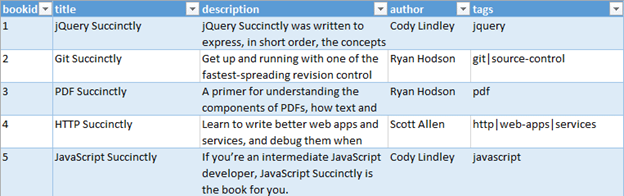

图 50:样本数据

每当您想要向索引中添加字段时，您需要告诉 Solr 名称、类型和一些其他属性，以便它知道如何处理它们。通俗地说，就是定义索引的数据结构。

您可以通过使用 Schema.xml 文件来实现这一点。该文件通常是您在设置新安装时配置的第一个文件。您可以在其中声明您的字段、字段类型和属性。您可以指定在向索引中添加文档或从索引中查询文档时如何处理每个字段，它们是必需的还是多值的，以及它们是否需要存储或用于搜索。即使不是必需的，您也可以为每个文档声明哪个是您的主键(它需要是唯一的)。需要记住的一件非常重要的事情是，在将文档添加到索引中之后，更改模式是不明智的，所以在添加之前，请尽量确保您拥有所需的一切。

如果您查看下载中提供的 schema.xml，您会看到它包括以下几个部分:

### 版本

版本号告诉 Solr 如何处理模式中的一些属性。从 Solr 4.10 开始，当前版本是 1.5，您不应该在应用程序中更改此版本。


图 51:版本号

### 类型定义

逻辑上有两种类型:简单和复杂。简单类型被定义为定义其行为的一组属性。首先，您有一个名称，这是必需的，然后是一个类，指示它在哪里实现。简单类型的一个例子是 string，它被定义为:


图 52:类型定义

复杂类型除了存储数据之外，还包括分组到分析器中进行附加处理的令牌化器和过滤器。让我们定义每一个的用途:

#### Tokenizer

令牌化器负责将字段内容划分为令牌。维基百科将一个标记定义为:“一个由一个或多个字符组成的字符串，作为一个组具有重要意义。从输入字符流形成标记的过程称为标记化。”一个标记可以是一个字母、一个单词或多个单词，它们都嵌入在一个短语中。这些令牌如何出现取决于我们当前使用的令牌化器。

例如，标准标记器将文本字段拆分为标记，将空白和标点符号视为分隔符。除了几个例外，分隔符被丢弃。另一个例子是小写标记器，它通过在非字母处定界，然后将所有字母转换为小写来标记输入流。空白和非字母被丢弃。第三个是字母标记器，它从连续的字母字符串中创建标记，丢弃所有非字母字符。名单越列越多。

#### 过滤器

过滤器消耗输入并产生令牌流。它基本上按顺序查看流中的每个标记，并决定是继续传递、替换还是丢弃它。它还可以通过向前看并同时考虑多个令牌来进行更复杂的分析，尽管这并不常见。

过滤器是链式的；因此，顺序会显著影响结果。在典型的场景中，首先使用通用过滤器，而专用过滤器留在链的末端。

#### 分析者

字段分析器负责检查字段的文本并产生输出流。简单来说，它们是由至少一个(但可能是多个)标记器和过滤器组成的多个操作的逻辑组。可以指定在查询时或索引时使用哪个分析器。

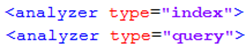

图 53:分析仪

#### 回到复杂类型

让我们看一个例子。在这种情况下，我们将使用最常用的类型之一，`text_general`。通过使用该字段存储文本，您将删除停止词并在查询时应用同义词，以及其他操作。另外，您可以看到有两个分析器:一个用于查询时间，另一个用于索引时间。

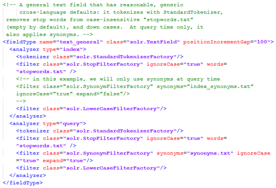

图 54:文本一般类型

### 字段定义

在本节中，您将指定组成索引的字段。例如，如果您想在 Syncfusion 的*简明指南的*系列或 Pluralsight 的在线培训中索引和搜索书籍，那么您可以指定以下字段:

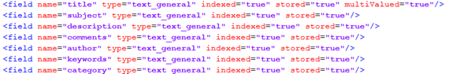

图 55:示例数据的 Solr 字段

一个字段定义有一个名称、一个类型和多个属性，这些属性告诉 Solr 如何管理每个特定的字段。这些被称为静态字段。

Solr 首先寻找静态定义，如果没有找到，它会尝试在动态字段中寻找匹配。本书没有涉及动态字段。

### 复制字段

您可能希望以多种方式解释某些文档字段。为此，Solr 有一种执行自动字段复制的方法。为此，您可以在`copyField`中指定要复制的字段的来源、描述和最大大小(可选)作为`maxChars`。使用此功能，多个字段可以很容易地复制到单个`copyField`中。

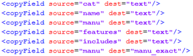

图 56: Solr 复制字段

也可以使用模式指定复制字段；例如，*source =“* _ I”*会将所有以 *_i* 结尾的字段复制到一个`copyField`中。

### 按用例列出的字段属性

在 Apache Solr [文档维基](https://wiki.apache.org/solr/)中，有一个非常有用的表，它告诉您每个用例所需的属性值。我在这里一字不差地抄表，并且会用一个例子来解释。请在 Solr 维基中查找“按用例划分的字段属性”以获取更多信息。

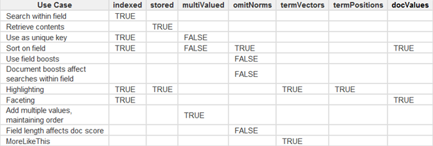

图 57:按用例划分的字段属性

使用该表的方法是为您的字段寻找您想要的特定场景，并确定属性。假设您想要一个可以搜索、排序和检索内容的字段。

这意味着有三种情况:*在字段*内搜索、*检索内容、*和*在字段*上排序。在列中查找所需的属性，您需要设置*索引=“真”*、*存储=“真”、*和*多值=“假”*。

### 图式常见错误。可扩展标记语言

现在让我们来谈谈如何避免人们在使用 schema.xml 时犯的一些错误。

1.  您需要保持 schema.xml 的简单性和组织性。我实际上有一个朋友，她首先清理整个 schema.xml，然后添加她需要的部分。我认为你可能实际上不需要达到那个程度，但是每个人都有自己的工作方式。
2.  还有另一个极端，有些人只是从默认配置中更改字段名。我说这可能会带来一些意想不到的后果，因为你会将这些字段复制到你实际上并不打算复制的其他字段中。
3.  还有另一个极端，有些人做了很多过度规划，有“除了厨房水槽什么都有”的方法论。他们对自己根本不想用的东西过度规划。有一个首字母缩略词很好地描述了这一点:YAGNI，或者“你不会需要它。”计划是好的，但是过度计划通常是不好的。不要包含不需要的属性和字段。
4.  最后，这可能不是一个错误，但这是一个很好的建议:尽可能升级您的 Solr。Solr 有一个非常活跃的开发社区，当有新版本可用时，您应该进行升级。当然，坚持适合自己发展能力的。

### 简洁的图式。可扩展标记语言

是时候用我们的数据让它成为我们自己的 Solr 了。我们将获取样本数据，这些数据可以在 GitHub 中的以下存储库中找到:[https://github.com/xaviermorera/solr-succinctly.git](https://github.com/xaviermorera/solr-succinctly.git)。

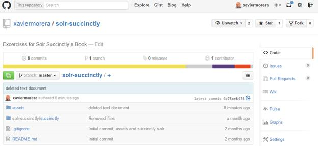

图 58:练习库

存储库包括两个主要文件夹:

*   练习的源文件位于**资源**文件夹中。大小在 50KB 以下，需要的话可以单独下载。
*   一个完成的例子，如果你按照本书提供的说明去做，你可能不需要它。

理解我们将在本演示中索引的文档很容易。在现实世界中，可能会更棘手。

#### 创建您的收藏

到目前为止，我们已经为 Solr 下载中包含的一些示例文档编制了索引。我们将使用这个集合作为基础来创建我们自己的，并将使用一个更合适的名称。值得一提的是，每当使用“文档”一词时，它都是指一组逻辑数据。这基本上就像用数据库语言说“记录”或“行”。我参加过一些会议，在这些会议中，当我们使用这个特定的词时，不懂搜索的与会者只会想到 Word 文档(或类似的东西)。别糊涂了。

以下是创建第一个索引的步骤:

*   打开命令行，导航到我们之前解压 Solr 的地方。应该在***C:\ Solr-简洁\简洁\solr*** 。这是 collection1 所在的地方。
*   在此目录中，您将找到当前安装中可用的集合。现在，我们只有集体 1。我们需要克隆收藏 1，所以请复制粘贴，并将新收藏重命名为**简明图书**。

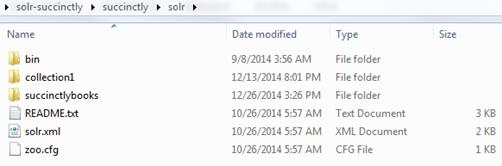

图 59:创建简洁的书籍集合

现在进入简明书籍文件夹，打开`core.properties`。这里是您指定核心名称的地方，也称为集合。应该是这样的:

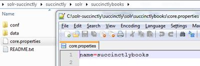

图 60:命名集合

现在重启你的 Solr，进入核心选择器。应该展示简明指南的书籍。

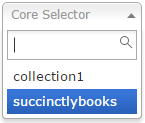

图 61:加载的新集合

如果您忘记在`core.properties`内重命名集合名称并尝试重新启动，您将获得一个错误，告诉您集合已经存在。控制台中显示的错误类似于以下内容:

```
      2972 [main] ERROR org.apache.solr.core.SolrCore ull:org.apache.solr.common.SolrException: Found multiple cores with the name [collection1], with instancedirs [C:\solr-succinctly\succinctly\solr\collection1\] and [C:\solr-succinctly\succinctly\solr\succinctlybooks\]

```

#### 快速清理

不要求清除索引并注释掉现有字段；但是，考虑到我们的索引中有数据，我们需要这样做以避免在我们移除的字段和我们更改的类型上出现错误。

以下两个步骤将向您展示如何确保我们清除冗余数据。

**第一步:清除索引**

我们刚刚复制的集合带有我们最近索引的样本数据。那么，Solr 将索引数据存储在哪里呢？在当前集合内的一个名为“索引”的文件夹中*数据*文件夹。如果您忘记了，只需打开*管理界面*部分的*概述*部分，您就可以看到当前的工作目录(CWD)、实例位置、数据和索引。

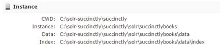

图 62:管理界面中的索引

在我们这种情况下，可以在这里找到:*C:\ Solr-简洁\简洁\ solr \简洁 lybooks\data\index* 。如果您查看文件夹内容，这就是 Lucene 索引的样子:

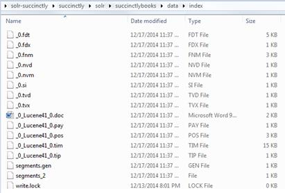

图 63:一个 Lucene 索引

下一步是清除索引，因为我们将修改字段，以便创建新的索引。请首先通过在启动 Solr 的控制台窗口中键入 **Ctrl + C** 来停止 Solr，在您的 Lucene 索引中打开 Windows 资源管理器，选择索引中的所有文件，然后删除。

当您重新启动 Solr 时，您的索引现在有 0 个文档。我们现在有一个空的索引开始。

需要指出的是，如果不删除索引，我们将把`uniquekey`从`string`改为`int`。假设原始示例中的一些键具有看起来像“MA147LL/A”的键，当您重新启动时，将会出现以下错误:

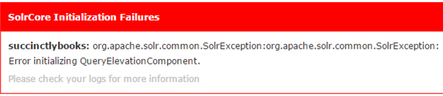

图 64:Solr 错误

很快，我们将改变我们的 uniquekey 的名字，但不是它的类型。如果你坚持要`int`作为`bookid`的类型而不是`string`，你会得到我刚开始给你看的错误，即使你有干净的索引。图 65 显示了如果不按照说明操作将会遇到的错误。

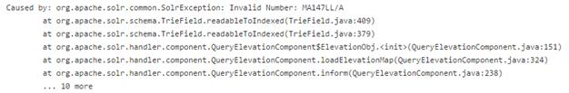

图 65:Solr 错误堆栈跟踪

我就让你来玩玩，弄清楚`elevate.xml`文件是干什么用的，这是这个错误的两个潜在元凶之一:

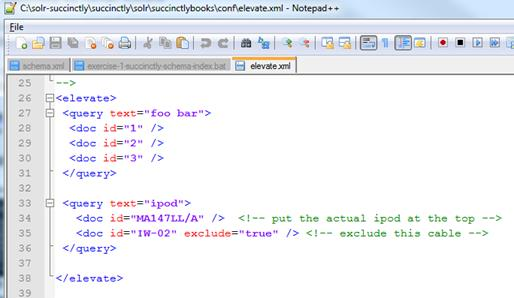

图 66:提升

步骤 2:注释掉现有字段

我想在 Schema.xml 中删除两个部分:

*   现成示例数据的字段定义。
*   Solr 单元格字段。

首先寻找 *id* 的定义，一路注释到*店，*如下图所示。用一个 XML 注释来做，以`<!--`开始，以`-->`结束。

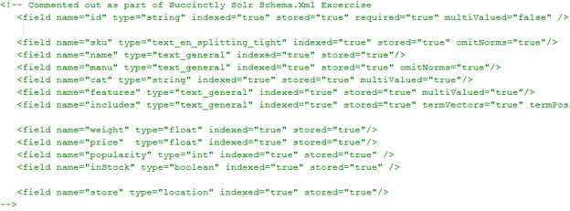

图 67:注释掉现有字段

现在让我们寻找 Solr 单元格字段，并从标题一直注释到链接。还有几个你应该注释掉的字段，分别是`content`、`manu_exact`和`payloads`。请注意，我没有注释掉文本，因为它是通过`copyFields`实现的一个通用字段。我们很快就会谈到它。

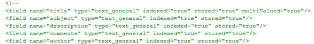

图 68: Solr 单元字段

最后，寻找`copyFields`并注释掉。

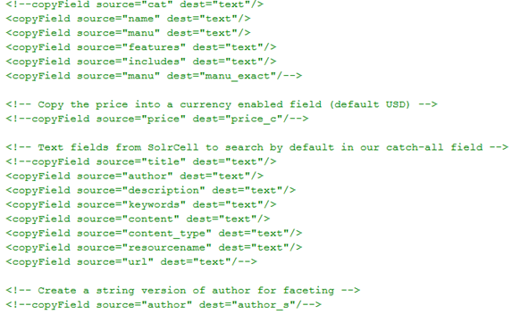

图 69:复制字段被注释掉

让`dynamicFields`和`uniqueKey`保持原样；我们很快就会找到他们。

#### 从了解您的数据开始

为 Syncfusion 的*简洁地说*系列创建搜索用户界面可能需要很长时间，并且可能会让你有些头疼——或者如果你有适当的资源，可以很快完成。如果你手里有这本书，你是幸运的，因为你有合适的资源。以下是我们将使用的数据:


图 70:源数据行

*   书号:书号只是一个数字，作为唯一的钥匙。
*   书名:这本书的书名。这是将被搜索、存储和检索的文本。
*   描述:稍大一点的文字，有书的描述。
*   作者:*简洁地说*系列通常每本书只有一个作者；但是，它可能是多值的，因此我们将这样声明。我们将把这个作为一个方面。
*   标签:另一个多值字段；我们也将把它作为一个方面。

在记事本++或任何其他文本编辑器中打开“简明图册”集合的 **schema.xml** 文件。如果您忘记或跳过了前面的练习，它位于此处:**C:\ Solr-简明\简明\ solr \简明书籍\conf** 。

是时候定义我们的静态字段了。这些字段应该与我们刚刚注释掉的示例数据字段位于同一部分。请查找 *id* 字段定义，从`bookid`开始，同级别添加。

`Bookid`将是我们独一无二的钥匙。我们用这个名称声明一个字段，并添加类型，在本例中是`string`。如果你愿意，它也可以是一个`int`；这并没有太大的不同。给定它是`uniquekey`，它需要被索引以检索特定的文档；它是必需的，唯一键不能是多值的。还记得**按用例划分的字段属性**吗？另外，请注意大写；例如，多值有一个大写的 v

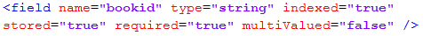

图 71: Bookid

我们将唯一键的名称从`id`更改为`bookid`。寻找`uniquekey`标签并进行相应的更改。


图 72:唯一键已更改

现在我们定义其余的静态字段。您应该会在模式中看到如下的一些条目:

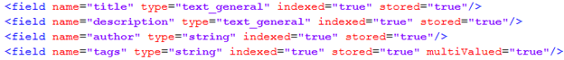

图 73:模式条目

你可能已经注意到了*称号*和*描述*属于`text_general`类型，而`author`和`tags`属于 **`string`** 类型。正如您可能已经猜到的，这些是 Solr 环境中不同的数据类型。

字符串被定义为没有标记化的简单类型。也就是说，它将单词或句子存储为精确的字符串，因为没有分析器。它对于精确匹配很有用，即用于刻面。


图 74:字符串定义

另一方面，*文本* _general 的类型定义比较复杂，包括*查询*和*索引*时间分析器，用于像下套管一样进行标记化和二次处理。当我们想要匹配句子的一部分时，它对所有场景都很有用。如果将标题定义为字符串，然后搜索 *jquery，*就找不到 *jQuery 简洁*。您需要查询确切的字符串。这不是我们最想要的。

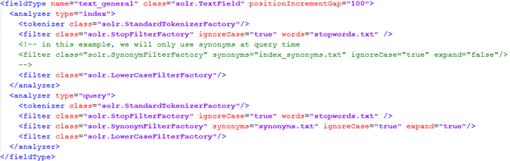

图 75:查询字符串

我们将为标签和作者创建方面，这意味着字符串是用于这些的正确类型。如果我们只键入名字或姓氏，我们能找到他们吗？让我们拭目以待。

### 总结

在本章中，我们开始查看 schema.xml 文件。我们发现这个文件对 Solr 有多重要，我们开始编辑它来定义我们自己的集合，包含关于*简洁地*电子书系列的信息。

在下一章中，我们将进入游戏计划的下一阶段，并介绍索引主题。*