# 八、搜索和关联

## 人爱搜索吗？

说到在 Solr 中搜索(一般来说)，人们喜欢搜索东西，对吗？至少，这是我们一直以来的印象；不幸的是，这真的与事实相去甚远。事实是这样的:人们喜欢找到他们正在寻找的东西。

作为搜索应用程序的开发人员，我们的工作是返回与用户查询最相关的结果，并让他们从中进行微调。虽然如果你第一时间神奇地向用户展示他们想要的结果，你肯定会得到好评，但在 99%的情况下，非常接近就足够了。

### 相关性

相关性是查询结果满足正在搜索信息的用户的程度。它意味着返回用户想要或需要的东西。在谈论相关性时，我们基本上需要考虑两个重要的概念:准确性和召回率。

#### 精确

精度是结果集中与初始查询相关的文档的百分比。也就是说，有多少文档包含用户实际寻找的结果。明确地说，我们这里也不是在讨论完全匹配；如果你正在寻找“红色汽车”，含有“汽车”的火柴可能仍然有效，但含有“红色油漆”的火柴则无效。

#### 回忆

Recall 是系统中所有相关结果中返回的相关结果的百分比。也就是说，用户是否获得了所有与他或她的查询相匹配的文档。最初，用一个定义来理解有点困难，但是用一个例子就变得简单多了:

*   你有一个包含 10 个文档的索引。
*   您有一个匹配四个文档的特定查询。
*   当您运行这个查询时，您只得到两个文档。这意味着你的召回没有那么好，因为它只返回了它应该返回的一半文档。

在现实生活中，场景要复杂得多；搜索引擎有数千到数百万的文档，因此返回相关文档可能会很困难。

获得完美的回忆是微不足道的。您只需为每个查询返回集合中的每个文档，对吗？但是，如果您返回集合中的每个文档，这将是一个问题——它可能对用户不太有用。

这就是相关性的来源。相关性是搜索引擎返回的与您的查询真正相关的文档数量。用一个真实的例子，假设你在谷歌上运行一个查询，第一页没有返回任何有用的结果。没有一个结果与您的查询“相关”。

您需要考虑四种情况:

*   **真否定:**这些结果永远不应该出现在结果集中，因为它们与所呈现的查询的满意度毫无关系。一个真正的否定对搜索结果来说是最糟糕的；返回它们意味着您的搜索应用程序根本没有正确工作。
*   **误报:**误报是指查询匹配数据库中的某个内容，但该匹配与搜索的上下文无关。从前面的精确例子来看，“红色油漆”将是一个假阳性——匹配是由于使用了术语“红色”而发生的，但是“油漆”的上下文与描述汽车的上下文无关。
*   **假阴性:**顾名思义，它与假阳性完全相反。当文档结果匹配，但搜索应用程序未返回时，会出现假阴性。在我们前面的例子中，“红色车漆”可能会被拒绝，理由是它的上下文仅适用于油漆，而不适用于涂有红色的汽车，如果我们的搜索标准涉及“红色汽车”，这是不正确的。当设计你的搜索应用程序时，你永远不希望产生这样的结果。
*   **真正的积极因素:**这是终极游戏——你每次的目标。这些都是真实的、与上下文相关的搜索结果，它们要么满足查询，要么便于查看如何重新组织查询以变得更好。

#### 准确(性)

这导致准确性，这是一个权衡。在某些情况下，如果你得到高精度，你可能会得到很少的回忆。也就是说，您可能会得到与您的查询极其相关的文档，但是您得到的文档可能很少。这最终会导致丢失文档，这些文档可能包含最终用户相关但不太准确的信息。

在另一端，我们有很大的召回率，但精确度要低得多。准确无误的诀窍是在这两者之间取得正确的平衡。

#### 并非所有结果都是平等的

最后，要明白并非所有的结果都是平等的，这一点非常重要。在配置搜索引擎时，您需要考虑用户的需求。

#### 语境

您需要考虑每个上下文的类别。例如，假设您正在搜索一家开发公司，并且您有 IT 专业人员和开发人员。信息技术专家可能希望获得与服务器和网络技术更相关的结果，而开发人员可能希望研究网络开发——然而他们可能使用相同的关键词。

#### 第二页？

考虑文件的相关性也很重要。用户很少超越结果的第二页，这意味着最相关的结果需要在第一页，第二页包含不太相关的结果。

#### 文件时代

在某些情况下，文档年龄非常重要。例如，如果你在报纸上搜索当前新闻，你只想要最新的结果。

#### 安全

很多搜索工程师从来不考虑这个问题，但是安全性非常重要。几年前，我在微软的一个项目中工作，作为安全计划的一部分，我们必须对大约 300，000 个 SharePoint 站点进行分析。这里的目标是找到并防止无意中访问搜索引擎可能错误返回的公司机密信息。文件安全必须始终是第一要务。

#### 速度

最后，我们进入速度的问题，底线是:人们几乎立即期待搜索结果。几毫秒，甚至一秒钟，对大多数人来说都是可以忍受的。除此之外，你会看到很多抱怨。

我见过查询可能需要几分钟的异常，但是这个特定的过程过去需要几个小时才能找到相关信息。这通常是一个特殊的场景，在更大的计划中，几分钟可以节省大量时间。

## 查询、数据和元数据

全球有数十亿搜索用户，这主要归功于谷歌。但是，当您使用谷歌搜索时，您仅限于一小部分关键词，包括网站、链接、相关、或、信息、缓存、+、-，以及其他类似的运算符。如果你客观地想一想，这没问题；谷歌在网络上爬行，这是一种“狂野西部”的庞大的主要是非结构化数据集合，而不是一个很好的、有序的集合，如果它是我们自己的数据，我们可能会搜索它。

### 数据和元数据搜索

在 Solr 中，我们可以更好地控制数据和索引中的元数据。这使我们能够非常准确地定义回答非常具体问题的查询。以我们的*简洁地*系列数据集为例，我们可以寻找彼得·肖所有谈论 Bootstrap 的书。

您可以通过以下查询来实现这一点:

```
      http://localhost:8983/solr/succinctlybooks/books?q=author%3A%22Peter+Shaw%22+AND+description%3Abootstrap&wt=json&indent=true

```

如下图所示，我们得到了与查询非常精确的匹配，只有一个结果。

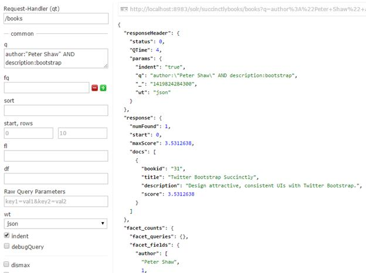

图 123:按作者和描述的精确查询

### 深入 Solr 搜索相关性

要真正理解搜索并熟练调整搜索相关性，了解 Lucene 评分算法(称为`tf.idf`模型)非常重要。`tf.idf`是首字母缩略词，代表术语频率，逆文档频率。这些术语将在以下段落中描述。

#### 术语频率

术语频率是术语在文档或字段中出现的频率。术语频率越高，文档分数越高。

#### 反向文档频率

该术语在索引中的其他文档中出现得越少，它对分数的贡献就越大。

还有两个术语没有作为评分算法`tf idf`名称的一部分提及，但同样重要。条款如下:

协调因素

在文档中找到的查询词越多，得分越高。

字段标准(字段长度)

一个字段包含的单词越多，得分就越低。它惩罚字段值较长的文档。

文档中有多页讨论 Lucene 评分。强烈建议您花一些时间阅读和理解它们，以便让您的搜索应用程序返回更好的结果。

### 查询语法

DisMax 查询解析器是 Solr 使用的默认解析器。它旨在处理用户输入的简单短语，并使用不同的权重或提升在多个领域搜索术语。DisMax 的设计更像谷歌，但它的优势是可以处理驻留在 Solr 中的高度结构化的数据。

DisMax 代表最大析取，DisMax 查询的定义如下:

一种查询，它生成由其子查询生成的文档的并集，并用任何子查询生成的该文档的最大得分对每个文档进行评分，并为任何附加的匹配子查询加上一个打破平局的增量。

这有点言过其实——只要知道 DisMax 查询解析器的设计是为了易于使用，并且接受输入时出错的可能性更小。

让我们回顾一下搜索的一些可能性。

#### 在字段中搜索单词

到目前为止，我们一直在寻找*:*这意味着所有可搜索的字段，所有的值。您可以指定要查找的单词或短语，以及在哪个字段中查找。

例如，假设我想查找所有有“数据库”作为描述一部分的书籍。我将使用/books 请求处理程序从管理用户界面运行对**描述:数据库**的查询，如下所示:

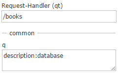

图 124:我们的示例查询可以使用 Solr 中的管理用户界面来查看

该查询应该会给你四个结果，你可以使用以下网址检索到自己的页面:

```
      http://localhost:8983/solr/succinctlybooks/books?q=description%3Adatabase&wt=json&indent=true

```

但是，您可能会注意到一些事情:仔细查看 URL 返回的结果，特别是每个结果的得分。

返回的分数范围从 1.05 到 0.63，这对于在几个字段上使用通配符的一般搜索来说是可以的，但是在我们的例子中，我们在特定的字段中搜索特定的单词，我们知道该单词在每个结果中恰好出现一次。在这种情况下，每个结果的分数不应该相等吗？

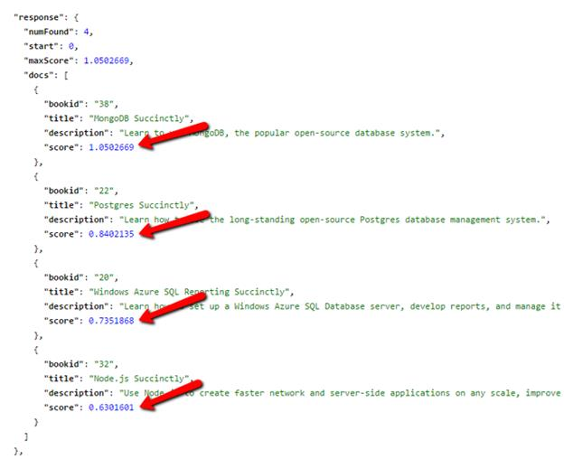

图 125:不同的描述分数

让我们在另一个领域测试一下，看看会发生什么。这一次，我们将使用`author:"Xavier Morera"` *在作者的名字中搜索我名字的出现。*在浏览器中输入以下网址，确保根据需要调整域名和端口号:

```
      http://localhost:8983/solr/succinctlybooks/books?q=author%3A%22Xavier+Morera%22&wt=json&indent=true

```

这一次，我们可以看到每个结果的分数现在是一样的。

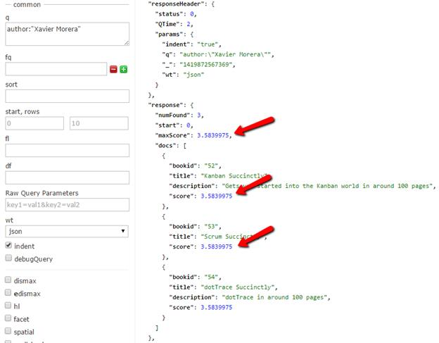

图 126:作者字段得分相同

为了向您展示这里发生了什么，我们需要重复“数据库”查询，但这一次，我们将使用 debugQuery 选项来帮助我们。如果您是从管理用户界面运行，请确保在单击执行之前通过**调试查询**选中该框。


图 127:选中调试查询

如果您直接输入网址，请确保在将网址提交到浏览器之前将`debugQuery=true`添加到网址的末尾:

```
      http://localhost:8983/solr/succinctlybooks/books?q=description%3Adatabase&wt=json&indent=true&debugQuery=true

```

如果向下滚动结果到调试部分，应该会在`"explain"`部分看到答案；Solr 中的`"fieldnorm"`流程是造成所有差异的元素。

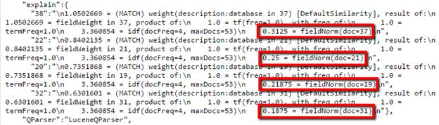

图 128: Fieldnorm 有所不同

分析的一部分包括`fieldnorm`，它惩罚较长的字段。如果你看下图，你可以看到我在描述的两端画了一条红线，你可以看到顶部的结果(有更具体的分数)有更短的描述。

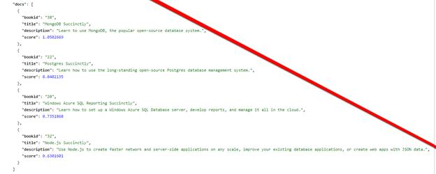

图 129:描述随着排名的增加而变长

这只是一个具体的例子，关键字在四个文档中只出现了一次，唯一的区别就是字段长度。现实世界的查询通常要复杂得多。

让我们试着只在作者中搜索我的名字。这应该是类似于“ *q=Xavier”的东西；*我们将使用以下网址，看看会发生什么:

```
      http://localhost:8983/solr/succinctlybooks/select?q=author%3AXavier&wt=json&indent=true&debugQuery=true

```

奇怪的是，我们的查询没有结果。

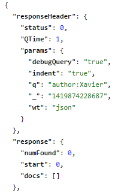

图 130:没有查询泽维尔的结果

起初，这看起来像是一个奇怪的回答——毕竟，我们肯定知道我的名字不止一次出现在`author`字段中，那么我们的查询怎么会找不到任何东西呢？

重新打开 Schema.xml 文件，根据我们之前创建的定义刷新您的内存。你会看到`author`是一个`string`，但是描述类型是`text_general`。


图 131:作者是字符串，描述是 text_general

不同的是字段类型；`string`是一个简单的类型，只存储一个简单的文本字符串。要找到它，您需要运行一个查询来查找精确匹配。这对于人脸识别来说很好，但对于一般搜索来说就不太好了。

但是`text_general`是一个复杂的类型，因为它有`analyzers`、`tokenizers`、`filters`、`. Additionally, within analyzers, it has both`、`query`、`index`时间。它主要用于通用文本搜索。

一旦你理解了不同的领域类型，事情就变得容易多了。

#### 在字段中搜索短语

正如我们之前对作者字段所做的那样，我们可以搜索短语。让我们尝试使用我们的`description:database`查询，并通过查询`description:”database system”.`来进一步细化它

我们可以使用以下查询轻松做到这一点:

```
      http://localhost:8983/solr/succinctlybooks/books?q=description%3A%22database+system%22&wt=json&indent=true&debugQuery=true

```

我们只有一个完全匹配的。太棒了，我们的搜索工作，并给我们准确的结果，对不对？不完全是，因为我们在做一般搜索时并不想绝对具体。

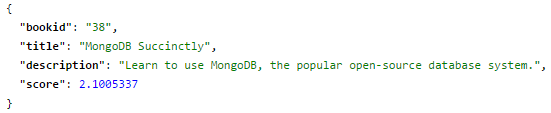

图 132:精确匹配搜索

#### 邻近

如果我们想找到的不是完全匹配的，而是非常接近的匹配呢？例如， *MongoDB 简洁地*有`“database system”`，但这遗漏了 *Postgres 简洁地*，后者有`“database management system”`，这是一个非常接近的匹配，可能对我们的用户有用。

为了解决这个问题，我们有一种叫做邻近匹配的方法，也称为查找在匹配单词特定距离内的单词的过程。

更改我们刚刚发出的查询(只返回一个结果的查询)，以便我们的 **`q`** 参数现在显示为`'q = description:"database system"~4'`。如果您是通过浏览器中的网址输入的，新查询应该如下所示:

```
      http://localhost:8983/solr/succinctlybooks/books?q=description%3A%22database+system%22~4&wt=json&indent=true&debugQuery=true

```

如下图所示，我们现在有两个结果，更重要的是，我们的分数让我们知道了重要性或相关性的顺序。

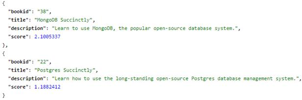

图 133:邻近搜索

#### 运算符和字段

可以使用运算符进行查询。例如，如果我想搜索所有有数据库描述的书籍，并使用 Azure 作为技术，我会将我的查询术语形成为`'description:database AND description:Azure'`。将它转换为一个网址，我们得到如下结果:

```
      http://localhost:8983/solr/succinctlybooks/books?q=description%3Adatabase+AND+description%3AAzure&wt=json&indent=true&debugQuery=true

```

如您所料，您也可以进行或搜索。例如，下面的查询词`'description:database OR description:Azure'`，变成了下面的网址:

```
      http://localhost:8983/solr/succinctlybooks/books?q=description%3Adatabase+OR+description%3AAzure&wt=json&indent=true&debugQuery=true

```

这产生了四个结果。您也可以在字段之间进行匹配，例如，搜索标题中带有标签`'aspnet'`或`'Net'`的所有书籍。查询条件是`'tags:aspnet OR title:net'`，下面的网址说明了这一点:

```
      http://localhost:8983/solr/succinctlybooks/select?q=tags%3Aaspnet+OR+title%3Anet&wt=json&indent=true

```

你可以根据需要嵌套操作符，但是你**必须**记住大写。用`AND`和`and`不一样；这是重要的一点。如果大写错误，您的搜索将不会像预期的那样工作。

#### 不是(否定查询)

也可以执行否定搜索，即您特别要求不包含给定术语的结果的搜索。比如你可以搜索*标签:aspnet* ，会得到两个结果:*ASP.NET MVC 4 移动网站*和*ASP.NET Web API*。如果我们不想要任何与移动相关的结果，我们可以使用以下查询术语(注意 **-** 符号):

```
      tags:aspnet AND -title:Mobile

```

在 URL 格式中，它看起来像这样:

```
      http://localhost:8983/solr/succinctlybooks/books?q=tags%3Aaspnet+AND+-title%3AMobile&wt=json&indent=true

```

尝试更改网址，只包含`'tags:aspnet'`，然后包含`'AND -title:Mobile'`。请注意，第一种形式给出两个结果，第二种形式只给出一个结果，正如我们可能预期的那样。

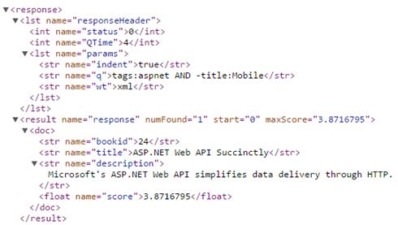

图 134:仅显示一个匹配的否定查询结果

#### 通配符匹配

正如您已经在本书的许多地方看到的那样(*:*)，到目前为止，我们已经使用了相当多的通配符。然而，通配符的意义远不止于此。Solr 支持在单词的末尾和中间使用通配符。一**？**表示单个字符的变体，而*表示多个字符。

如果你想知道，一个短语(称为前导通配符或后缀查询)开头的“*”最初在 Solr 中不被支持。这个最近被改变了，但是请知道这是一个非常低效的搜索方法，不推荐生产使用。

让我们尝试一些示例通配符搜索。使用以下查询条件创建一些搜索(在管理用户界面或使用浏览器网址):

*   作者:“泽维尔*”
*   作者:Xavier*
*   作者:X*a
*   作者:*莫雷拉

尝试创建一些自己的网址来满足这些查询，或者只使用管理用户界面。一旦您了解位置如何影响操作员，向下滚动查看您的结果是否与下表中的结果相匹配。

| 询问 | 结果 | 笔记 |
| --- | --- | --- |
| 作者:“泽维尔*” | 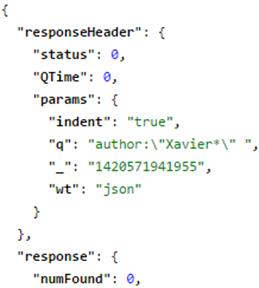 | 当您进行短语搜索时，此查询没有任何结果。 |
| 作者:Xavier* | 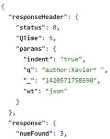 | 去掉引号，我们会得到预期的结果。 |
| 作者:X*a |  | 工作正常，正如预期的那样。Solr 返回任何以`X`开头，以`a`结尾的作者。 |
| 作者:*莫雷拉 | 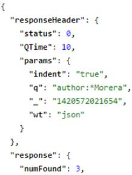 | 这给了我们预期的结果，但是请记住，将“*”放在术语前面是低效的。 |

由于在这些示例中我们的索引和搜索数据的大小很小，我们看不到查询时间有很大的差异。然而，如果我们有一个更大的数据集和索引，您将很容易看到哪些方法是最有效的。

#### 范围搜索

范围查询允许将文档与指定值范围内的值进行匹配。在我们的例子中，我们没有包括任何日期(或者说，任何基于范围的数据)；如果我们这样做了，例如，在一个名为`createddate`的字段中，我们可以执行类似如下的查询:

```
      createddate:[20120101 TO 20130101]

```

这将允许我们在字段`createddate`中搜索包含在方括号内的下限和上限中的结果。这里有几个更广泛的例子。

*   字段:[* TO 100] 
*   字段:[100 至*]检索所有大于或等于 100 的字段值
*   字段:[* TO *]将所有文档与该字段匹配

#### 促进

查询时间的增加允许我们定义每个字段的重要性。例如，如果您运行特定术语的查询，并且您对出现在`title`中的术语比对文档描述中的更感兴趣，您可能会形成如下所示的查询术语:

```
      title:javascript^1.5 description:javascript

```

在这种情况下，只要你的术语出现在`title`中，你就应用`"1.5"`的提升，同时如果它也出现在`description`中，你仍然保持兴趣。

我建议你使用`explain`，这样你就可以看到你的助推是如何影响得分的。在我们对查询部分的管理用户界面的初步浏览中，我们提到有一个名为调试查询的复选框，用于显示调试信息。启用它，响应将附带一个文本，解释为什么特定文档与您的查询匹配或相关。在这种特殊情况下，您可以看到 boost 被用来影响文档的分数。

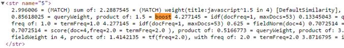

图 135:提升影响评分

不需要对每个查询都执行提升；同样，不是每个查询都只在默认的`field(df)`上执行。您可以在 Solrconfig 中指定查询字段(`qf`)。Xml，以便在每次查询时，自动应用所需的提升。

下图显示了一个内置示例集合的处理程序示例(在我们定义简洁书籍集合之前使用的集合)。如您所见，处理程序已经预先指定了搜索时应该应用哪些增强，以及应该自动应用到哪些字段。

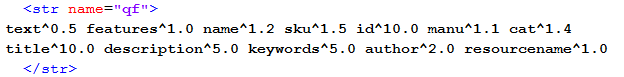

图 136:处理程序中指定的升压

这就是你如何调整你的 Solr 应用程序的本质。随着时间的推移，你可以做一些小的改变，分析结果，记录你的用户正在进行的搜索，然后自己对照这些搜索进行调整。这种反复试验的过程可能会很乏味，但特别是在搜索行业，这通常是微调事物以提供预期结果的最佳方式。

重要的是要考虑到`df`仅在未指定`qf`时使用。

#### 关键词搜索和复制字段

到目前为止，我们主要在字段内进行查询，例如`author:Xavier Morera`。

然而，想象一下，我们只想搜索一个关键词，比如“简洁地”这本应该和我们收藏的所有书都相配，对吗？毕竟，这个系列的每一本书，书名里都有这个词。

不完全是。从管理界面运行术语`'Succinctly'`的查询并观察结果。

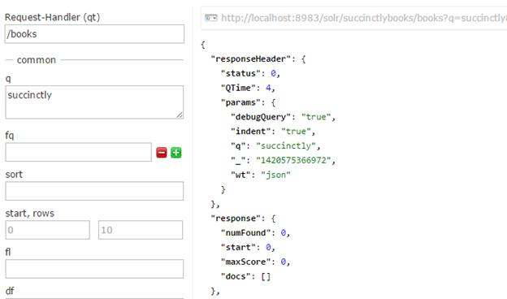

图 137:没有“简洁”的查询结果

为什么没有返回结果？这很简单——让我们现在看看我们的 Solrconfig.xml 文件来找到答案。请找到`/books`请求处理程序。如下图所示，我们有一个`text`的`df`。`df`代表默认字段；因此，我们告诉 Solr，我们的默认搜索字段叫做*文本*。

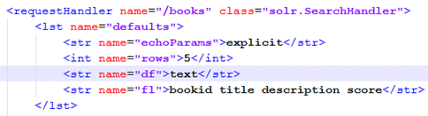

图 138:文本是我们的默认字段

但是如果您在 Schema.xml 中查找`text`的复制字段声明，您会注意到它被注释掉了。因此，现在它是空的，因为在索引期间没有信息被复制到`text`。

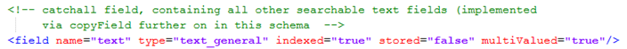

图 139:所有副本字段都被注释掉了

让我们试着修改一下`df`使其指向描述，这可以在 Solrconfig.xml 中完成，如下图所示，`df`的值为`description`而不是`text`。别忘了重装核心或者重启 Solr。


图 140:将默认字段更改为描述

如果我们现在按照对配置所做的更改重新运行之前的查询，我们现在应该会看到得到更好的结果。


图 141:再次运行查询

如果您希望使用直接网址，只需在浏览器中输入以下内容:

```
      http://localhost:8983/solr/succinctlybooks/books?q=succinctly&wt=json&indent=true&debugQuery=true

```

在这种情况下，我们在单个字段中进行搜索，因此让我们回到文本，并为我们想要复制的每个字段创建一个`copyField`。这是在 Schema.xml 文件中完成的。

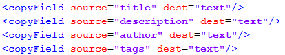

图 142:复制字段

重新加载并再次查询。你会注意到它不起作用——但是为什么呢？


图 143:查询不起作用

这是查询:

```
      http://localhost:8983/solr/succinctlybooks/books?q=succinctly&wt=json&indent=true&debugQuery=true

```

`copyField`在文档被索引时完成，所以在索引分析器之前。这与您在两个不同的字段中提供相同的输入文本是相同的过程。简而言之，你需要重新索引。

像使用*练习一样重新索引-1-简洁地说-schema-index.bat* 来自示例文档，来自命令行。

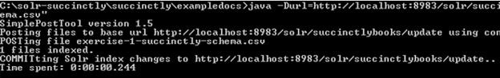

图 144:重新索引样本数据

再次运行查询。你应该得到多少结果？

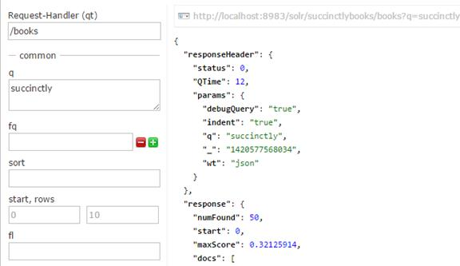

图 145:用 50 个结果再次查询

答案是 50。为什么呢？我们有 53 个文档，但是重新索引只考虑我们的初始结果集。我们手动添加了另外三个。

#### 同义词

同义词在 Solr 中用于匹配具有相同含义的单词或短语。它允许您匹配令牌字符串，并用其他令牌字符串替换它们，以帮助提高召回率。同义词映射也可以用来纠正拼写错误。让我们尝试一个简单的测试来说明我的意思。

|  | 提示:为了确保我们的索引中有所有的示例数据，请打开一个命令提示符，导航到 Solr-简洁\简洁\exampledocs，并运行以下批处理文件:练习-1-简洁-模式-索引-fixseparator.bat。通过这样做，您将把示例书籍重新加载到索引中。 |

在我们的藏书中查询`q=lightning`；您应该会看到没有找到任何结果。

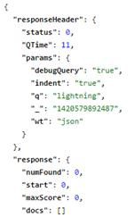

图 146:查询闪电没有结果

现在打开模式。Xml，并转到我们的默认字段类型， **`text_general`** 。您可以在`fieldtype name=text_general`节点内找到它，如下图所示。在`type=query`的`analyzer`节点内，可以看到一个`class=solr.SynonymFilterFactor` *y* 的`filter`。这表明您的 Solr 已经为查询时计算的任何类型的字段`text_general`配置了同义词。

太好了。这意味着不需要重新索引，尽管它可能会在一定程度上影响性能。

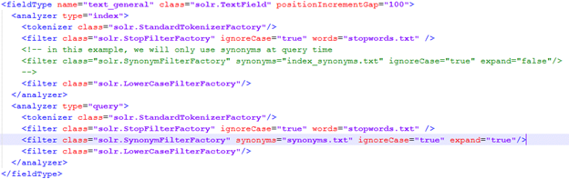

图 147:查看文本 _ 常规

如果你仔细观察同义词的过滤器，它有一个`attribute synonyms=“synonyms.txt”`。这意味着我们的同义词词典是这个文本文件，它位于我们的 **conf** 目录中，用于简明词典核心。

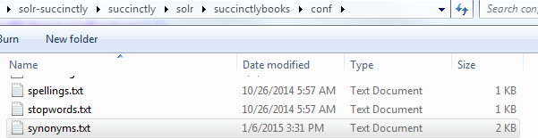

图 148:同义词的位置

打开文件，添加一个条目(比如`lightning`)作为`bootstrap`的同义词。我们有逗号分隔的值。

```
      lightning,bootstrap

```

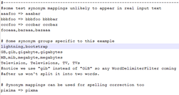

图 149:同义词. txt 文件内容

现在再次尝试运行 **`lightning`** 的查询，使用简明图书核心中的`/books`请求处理程序。你应该不会有结果。与大多数配置更改一样，您需要重新加载核心才能生效。

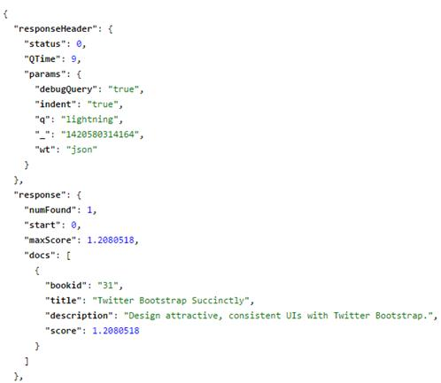

图 150:闪电的重新加载和查询

现在，我的朋友彼得·肖的自举书在那里。(这是我个人推荐给每一个和我一样对 UI 有挑战的开发人员的！这真的很重要。)

#### 停止言语

Stopwords 是 Solr 如何处理从查询中移除常用词的。常用词被定义为标准英语常用词，如“a”、“an”、“and”、“are”和“as”，以及许多其他词。任何有可能在每个句子中普遍出现的单词都可以归类为中止词。

在某些情况下，一个单词在特定的索引中没有任何特殊的含义。在我们的例子中，所有的文档都有“简洁”这个词，所以当使用时，它不会提供额外的价值。在我之前参与的一个项目中，我必须索引全世界所有的专利和申请；这导致“专利”一词没有任何特殊含义。

让我们尝试用`q=succinctly`进行查询。您应该会得到以下结果:

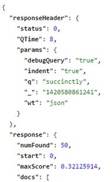

图 151:简洁地查询

请记住，您可以通过运行查询并单击右上角的灰色框，从管理用户界面构建该查询的网址。

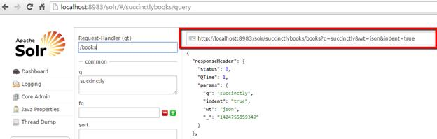

图 152:点击哪里构建查询网址

所有的结果都会被找到，因为这个词出现在每个文档中。指示哪些单词不应在查询中使用的方法是通过 stopwords。这是通过 Solr.stopfilterfactory 完成的。

要添加一个 **stopword** ，你需要去 **conf** 目录，在我们修改同义词的同一个位置。

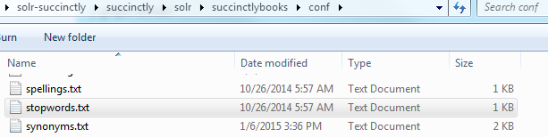

图 153:停止词的位置

打开 **stopwords.txt** 并添加所需单词。

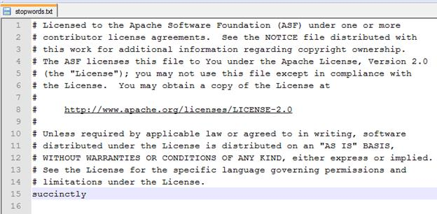

图 154:stop words . txt 的内容

如果现在运行查询，仍然应该返回所有文档，这意味着 stopwords 不起作用。这是意料之中的，因为我们刚刚进行了配置更改，但尚未按要求重新加载内核。

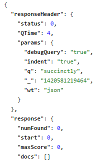

图 155:还没有结果

重新加载核心并再次查询。没有发现任何结果，这是我们期望的结果。

可以在查询和索引时添加 Stopwords。它在索引时非常有用，因为如果这些词从您的索引中移除，并且它们非常常见，这将有助于索引大小。在查询时，它也很有用，因为不需要重新索引。

#### 摘要

在本节中，我们学习了一些使用 Solr 进行搜索的基础知识。这是一个非常大的主题，可能会产生数百甚至数千页的内容，但这一开端让你处于一个很好的位置，可以独自前进。

在下一节中，我们将讨论 Solr 的用户界面。