# 第九章添加用户界面

Solr 可以有许多不同的用途。在很多情况下，您可以将其用作应用程序中的一个小功能。例如，它可以用来实现类型先行功能，以帮助最终用户。在其他情况下，您的应用程序可能更以搜索为中心，例如，专利分析应用程序来查找现有技术。

无论如何，不管您当前的需求如何，很有可能在某个时候您需要一个定制的 Solr 用户界面。在这一章中，我提出了两个众所周知的替代方案，这将使这项任务变得更加容易。

## 索利塔斯:速度响应者的奇特名字

既然您已经知道如何创建自己的自定义处理程序，那么我想向您介绍一个，因为它可以帮助您创建自己的搜索应用程序。`/browse`请求处理程序已经存在于您的应用程序中。打开你的 Solrconfig.xml 找到它；它应该看起来像下图。

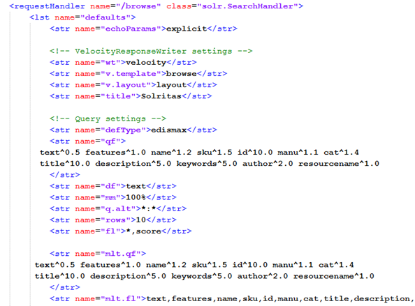

图 156:速度响应记录器

速度响应编写器，也称为 Solritas，是一个处理程序，允许使用称为速度的模板系统处理结果。

你可以在[http://velocity.apache.org/](http://velocity.apache.org/)阅读更多。它最近没有更新，但是你可以用它来学习查询、地理定位等等。Velocity 是生成用于测试数据的用户界面的一种非常快速和简单的方法。要访问它，只需导航到以下位置:

```
      http://localhost:8983/solr/browse

```

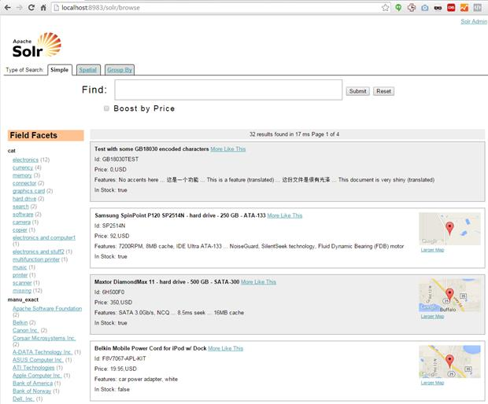

图 157:也称为 Solritas

**轮到你了**:为什么不尝试用简洁的集合来修改呢？我建议在 Schema.Xml 中添加一个`publicationdate`字段。然后，为我们的示例数据文件 books.csv、index 和 test 中的所有书籍添加随机日期。分支到 GitHub，试着了解它是如何工作的。它包括地理定位和助推。

## SolrNet:一个 Apache Solr 客户端。网

从. NET 早期开始，我就是一名. NET 开发人员。NET 测试版。如果你也是其中之一，那么这一章将会引起你的高度兴趣，因为当你想使用. Net 中的 Solr 时，SolrNet 是一个极好的选择

但是，如果您不是. NET 开发人员，请随意跳过本章的其余部分，您可以通过其 RESTful 接口或专门为您的语言创建的包来使用 Solr。其中非常受欢迎的是面向 Java 开发人员的 SolrJ。

但是对于那些。NET 开发人员，瞧，我们有了 SolrNet。

### 什么是 SolrNet？

正如网站所说:

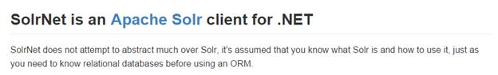

图 158: SolrNet 是的 Apache 客户端。网

对于. NET 开发人员来说，SolrNet 可以帮助您以非常自然的方式使用 Solr，它允许您通过使用普通旧 CLR 对象(POCOs)来表示您的模式。如果您不熟悉概念验证操作系统，它们基本上是一个类，代表了我们模式中的确切内容。XML，类型对类型，具有完全相同的名称。

SolrNet 让 Solr 感受到你的代码的一部分，而 RESTful 接口却不能。

### 索尔内特的历史

SolrNet 由来自阿根廷的毛里西奥·舍费尔于 2007 年创建。我亲自联系他，询问 Solr 的历史。他指给我看他第一次介绍 SolrNet 的原始博文，可以在这里找到。

他还向我概述了 SolrNet 是如何诞生的。他有一个要求，要在他当时正在工作的网站上添加方面，但是由于工作的其他任务，他没有时间去做，所以他得到了一笔额外的钱来完成正常办公时间之外的工作。作为项目的一部分，他协商了作为开源的代码的发布。

他最初在 code.google.com 工作，但由于它已经受到许多开源项目的青睐，现在它住在 GitHub。

当时，Solr 在 1.2 版本上，这意味着它是一个早期版本，并且几乎没有文档。他的一些工作是基于 SolrSharp 的，到目前为止，SolrSharp 已经陷入了不活跃状态。然而，他的主要驱动力是增加单元测试和改进库的整体构建的愿望。

无论如何，谢谢毛里西奥！此外，特别感谢你用你的洞察力和信息回应了我的信息，让我能够与我的读者分享这个故事。

### 获取 SolrNet

要获得 SolrNet，只需从 GitHub:https://github.com/mausch/SolrNet 克隆它

如果你不了解 Git，你可以做两件事。一是只需点击**下载**即可获取代码本地副本，二是获取[T3】Git 简洁 T5】电子书。Git 是一个你不应该忽视的神奇工具。](http://www.syncfusion.com/resources/techportal/ebooks/git)

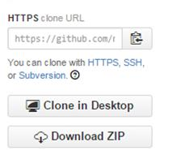

图 159:获取 SolrNet

我选择的 Git 客户端是 [SourceTree](http://www.sourcetreeapp.com/) ，但请随意使用哪个让您更舒服。

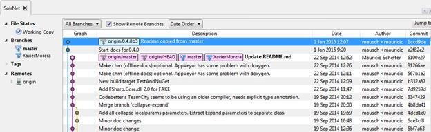

图 160:作为 Git 客户端的 SourceTree

在 code.google.com 有一个古老的网址；它是仍然存在的原始存储库，但不再维护，所以忽略它。

### SolrNet

一旦你有了 SolrNet，有几种方法可以让它开始运行。您将需要 Visual Studio。我有 2012，但它也适用于其他版本，包括 Visual Studio Community。

SolrNet 附带了一个示例。NET 应用程序。您可以将此作为创建自己的 Solr 应用程序的基础，或者仅仅作为 Solr 配置和开发的测试场地。

它以标准的 ASP.NET MVC 应用程序的形式出现。如果你不熟悉 ASP.NET MVC，你可能还有一些其他的概念要学才能入门；SampleSolrApp 很好地教你如何使用 SolrNet。

我通常的工作流程是首先打开主 SolrNet 项目并构建解决方案，只是为了检查一切都存在并且工作正常。

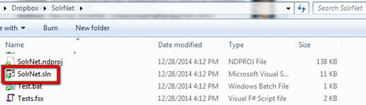

图 161: SolrNet 解决方案

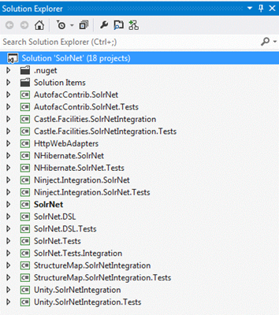

图 162: SolrNet 项目

如果一切顺利，您应该会得到一个成功的构建报告。

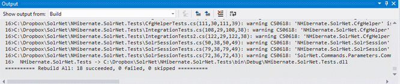

图 163:重建成功

一旦您对 SolrNet 正常工作感到满意，就关闭该项目并打开示例应用程序的解决方案。如下图所示，选择重建解决方案，就像使用 SolrNet 一样。

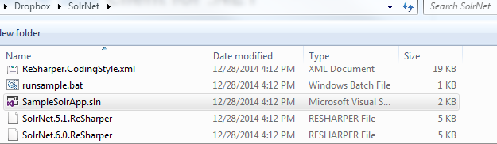

图 164:打开 SampleSolrApp

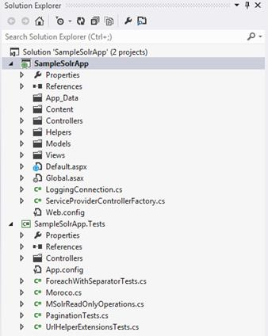

图 165:重建解决方案

此时，您应该期望在解决方案中得到一些构建错误。

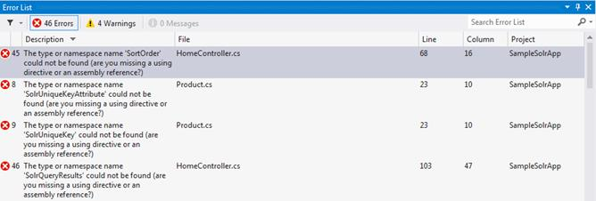

图 166:重建时的错误

如果您查看项目引用，您会发现您需要重新链接新重建的 SolrNet 程序集。

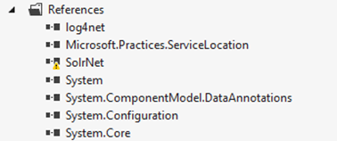

图 167:SolrNet 的问题

我知道这意味着有警告，所以我隐藏了我的错误。

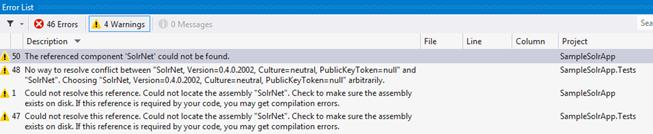

图 168:缺少组件

您可以通过重新绑定对 SolrNet.dll 的引用来解决这个问题，这可以在 **SolrNet\bin\Debug** 中找到。

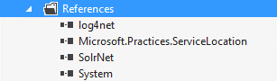

图 169:解决装配和问题

如果您在添加引用后再次重建，您会发现您还有一些事情要修复。

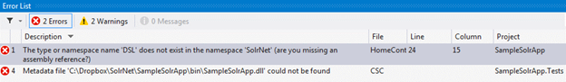

图 170:SolrNet 的新错误。数字式用户线路

从`SolrNet.DSL\bin\Debug`添加`SolrNet.DSL`修复剩余问题，然后重建运行。

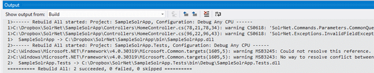

图 171:SampleSolrApp 的重建成功

如果一切正常，您应该会看到下面的 web 应用程序:

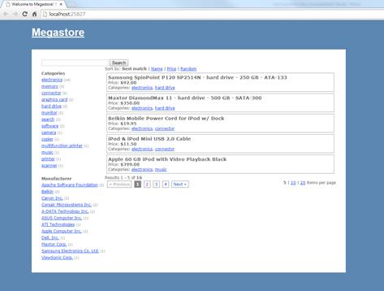

图 172: SampleSolrApp 正在运行

继续玩，运行查询，分析响应。查看方面、分页和每页的项目如何影响查询。放入一两个断点。将其与您在管理用户界面中的内容进行比较。

### 让示例应用程序使用我们的数据

样本当前正在运行默认的*集合 1* 。在接下来的几页中，我将向您展示修改 SampleSolrApp 以使其使用我们的简明书籍集合是多么容易。在这个过程中，我们将为同步融合*简洁地*系列构建我们自己的定制用户界面。

我会给你一个初始步骤和一些提示。我们开始吧。

1.  确保您有一个运行中的 Solr 实例，其中简洁地填充了我们的示例数据。如果需要重建，可以从我的 GitHub 页面[https://github.com/xaviermorera/solr-succinctly](https://github.com/xaviermorera/solr-succinctly)获取新安装。
2.  在网络上。SolrNet 附带的 SampleSolrApp 的配置，找到`solrUrl`键并将其更改为使用简洁的集合:

```
      <add key="solrUrl" value="http://localhost:8983/solr/succinctlybooks" />

```

3.  此时，如果您运行 SolrNet 应用程序，您将获得如下应用程序错误:

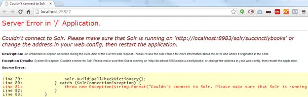

图 173:连接到 Solr 时出错

4.  打开 Solr 的日志，你会看到错误。现在一切都说得通了。您正试图使用 collection1 架构阅读简明扼要的书籍。我哪里知道？请看下图。Solr 没有直接告诉我，但它通过陈述`"document is missing mandatory field bookid"`暗示了我正确的方向。我意识到我的索引中有文档没有唯一的键，这意味着它们来自另一个集合。现在看起来可能很难，但是一旦你有了经验，你就能更容易地找出这些错误。


图 174:索尔日志

5.  不完全相信我？调试时使用书中最好的技巧:打开“异常时中断”。快速访问是通过 Visual Studio 中的 Ctrl+Alt+E 实现的。Visual Studio 不会告诉您何时引发和捕获异常。但是，如果打开“在例外上中断”，则每当在同一行中出现任何例外时，都会提示您。

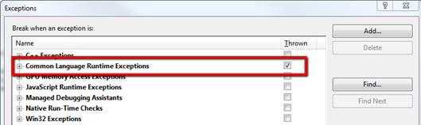

图 175:打开异常中断

现在你可以清楚地看到，真正的异常正在被掩盖。

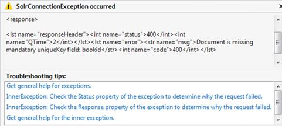

图 176:真正的异常

如果你已经走到这一步，你就走对了路。以下是关于后续步骤的一些提示:

*   示例应用程序使用名为`AddInitialDocuments`的函数来填充示例数据。我们不需要它在简明图书收藏中，所以评论一下。
*   您需要修改您的 POCO 以匹配您的 Solr schema.xml，它目前在`Product.cs`中定义，如下图所示。

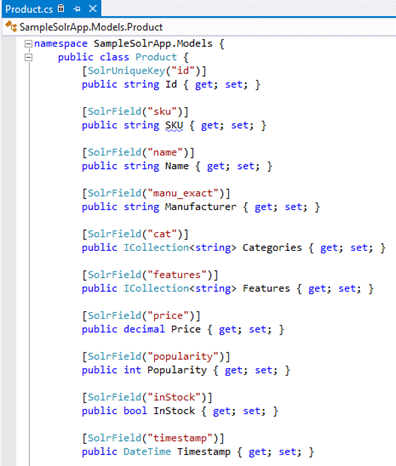

图 177:很少

*   您需要修改方面，以便只加载那些与简明书籍相关的方面，而不是集合 1。
*   确保只使用集合中的字段。

完成了？如果你愿意，就提交你的分支！

## 总结

在本节中，我们已经学习了如何向我们的 Solr 搜索引擎添加用户界面。第一个选项是使用 Velocitas 响应编写器，它内置于下载的 Solr 中。第二种选择是使用 SolrNets 示例应用程序。这不是一个完整的应用程序，但这是一个很好的开始，可能会让你赚一些钱，或者为你节省一些钱。