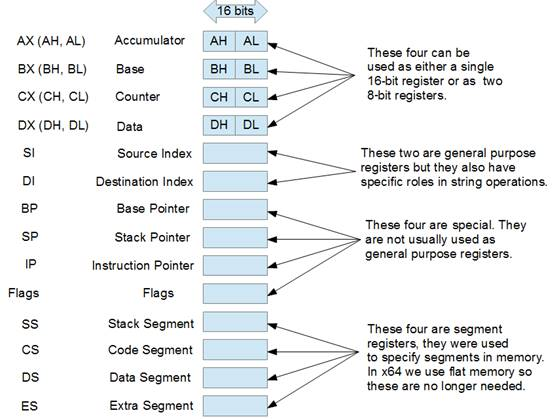
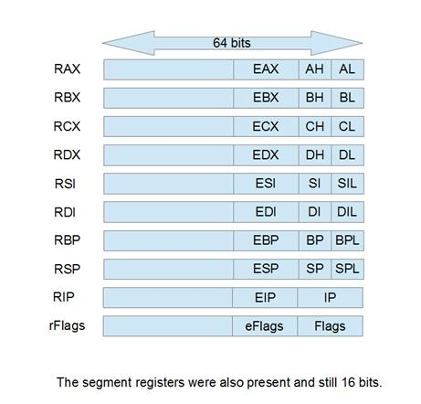
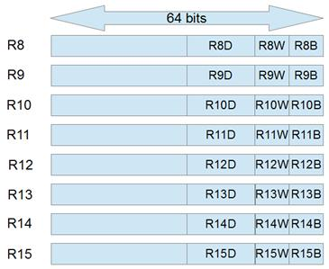

# 第三章记忆空间

计算机是由许多部件组成的，其中一些部件有存储信息的内存或空间。这些不同的存储空间的速度和每个存储空间能够容纳的内存量是完全不同的。一般来说，内存空间越靠近中央处理器，数据的读写速度就越快。

计算机内部有无数可能的内存空间:显卡、u 盘，甚至打印机和其他外部设备都给系统增加了内存空间。通常，外围设备的内存由设备附带的驱动程序访问。下表仅列出了一些标准内存空间。

表 3:内存空间

| 存储量 | 速度 | 容量 |
| 人工输入 | 未知的 | 未知的 |
| 硬盘和外部存储 | 非常慢 | 海量，> 100 千兆字节 |
| 随机存取存储 | 快的 | 大的千兆字节 |
| CPU 高速缓存 | 非常快 | 小，兆字节 |
| 中央处理器寄存器 | 最快的 | 很小，< 1 千字节 |

汇编程序最重要的两个内存空间是内存和中央处理器内存。RAM 是系统内存；它又大又快。在 32 位时代，内存是分段的，但是现在我们使用平面内存模型，整个系统内存是一个巨大的字节数组。内存离中央处理器相当近，因为有专门的总线设计来传输进出内存的数据，速度比硬盘快几百倍。

CPU 上有很小的内存区域。其中包括缓存，它存储从外部随机存取存储器读取的数据副本，以便在需要时可以快速访问。现代中央处理器上通常有不同级别的缓存，可能多达 3 级。1 级(缩写为 l 1 缓存)是最小但最快的缓存，3 级(缩写为 l 3 缓存)是最慢的缓存，但大小可能为兆字节。缓存的操作几乎完全是自动的。中央处理器根据进入自己的缓存并写入内存的数据来处理自己的缓存，但是有一些指令专门处理数据应该或不应该如何缓存。

重要的是要知道缓存，即使在 x86 中，程序员没有被授予对它们的直接控制权。当内存中某个地址的某个值已经在 L1 缓存中时，对它的读取或写入几乎与对寄存器的读取和写入一样快。一般来说，如果数据被读取或写入，中央处理器将预期两件事:

*   在不久的将来，同样的数据可能会再次被需要(时间局部性)。
*   可能还需要相邻数据(空间局部性)。

由于这两个期望，中央处理器将存储来自内存及其缓存的指令所请求的值。它还将获取并存储相邻的值。

比中央处理器缓存更重要的是寄存器。CPU 无法对内存中的数据进行计算；数据必须先加载到 CPU，然后才能使用。一旦从内存加载，数据就存储在中央处理器寄存器中。这些寄存器是整个计算机中最快的内存。他们不只是靠近 CPU，他们就是 CPU。寄存器只是驻留在中央处理器上的少数几个变量，它们有一些非常奇怪的特征。

## 寄存器

寄存器是驻留在中央处理器上的变量。寄存器没有数据类型。具体来说，它们都是数据类型、字节、字、数据字和 qwords。它们没有地址，因为它们不在内存中。它们不能像数据段变量一样被指针访问或取消引用。

目前的寄存器组(x64)来自早期的 x86 CPUs。检查旧的中央处理器寄存器集时，最容易理解为什么会有这些寄存器。这个小小的历史之旅并不仅仅是为了了解一般知识，因为 20 世纪 70 年代的大多数寄存器都还在我们身边。

|  | 注:对于什么是 64 位、32 位或 16 位的中央处理器，没有实际的定义，但主要的定义特征之一是通用寄存器的大小。x64 CPUs 有 16 个通用寄存器，它们都是 64 位宽。 |

### 16 位寄存器组

图 12

让我们从研究 1970 年代的原始 16 位 8086 寄存器组开始。最初的 8086 个寄存器中的每一个都有一个名称，表明该寄存器的主要用途。首先要注意的是，AX、BX、CX 和 DX 都可以用作单个 16 位寄存器或两个 8 位寄存器。

**AX、BX、CX 和 DX:** 寄存器 AL(表示 A Low)是 AX 的低位字节，寄存器 AH(表示 A High)是高位字节。BX、CX 和 DX 也是如此；每个 16 位寄存器有两个 8 位版本。这意味着更改其中一个低位字节(a1、B1、CL 或 DL)将会更改字大小版本(AX、BX、CX 或 DX)中的值。改变高位字节(AH、BH、CH 和 DH)也是如此。这也意味着程序员可以对字节或单词进行算术运算。四个 16 位寄存器可以用作八个 8 位寄存器、四个 16 位寄存器或任何其他组合。

**SI 和 DI:** 这些是源和目的索引寄存器。它们用于字符串指令，其中 SI 指向指令的源，DI 指向目的地。它们最初只有 16 位版本，但没有像 AX、BX、CX 和 DX 那样的字节版本。

**BP:** 这是基指针；它与 SP 一起使用，有助于在调用过程时维护堆栈框架。

**SP:** 这是栈指针；它指向在执行`POP`指令时将从堆栈中弹出的第一个项目的地址。

**IP:** 这是指令指针(在一些汇编语言中称为程序计数器的 PC)；它指向内存中要为下一个机器代码字节读取的位置。IP 寄存器不是通用寄存器，在允许通用寄存器作为参数的指令中不能引用 IP。相反，通过调用跳转指令(`JMP`、`JE`、`JL`等来隐式操纵该 IP。).通常情况下，IP 只是一次对一条指令进行计数。当代码执行时，指令从内存中的 IP 指示的地址取出，并被送入中央处理器的算术单元执行。跳转指令和过程调用导致 IP 移动到内存中的其他位置，并继续从新地址读取代码。

**Flags:** 这是另一个特殊的寄存器；它不能作为通用寄存器来引用。它保存关于中央处理器状态的各个方面的信息。它用于执行条件语句，如跳转和条件移动。标志寄存器是一组 16 位的寄存器，每一位都讲述了最近发生在中央处理器中的事件。许多算术和比较指令设置标志寄存器中的位，随后的条件跳转和移动根据该寄存器位的状态执行指令。标志寄存器中有更多的标志位，但下表列出了一般应用程序编程的重要标志位。

表 4:标志寄存器

| 标志 Name | 少量 | 缩写 ev。 | 描述 |
| --- | --- | --- | --- |
| 携带 | Zero | 随军牧师 | 最后一条算术指令导致进位或借位。 |
| 平价 | Two | 脉波频率（Pulse Frequency 的缩写） | 如果最后一个操作的最低字节有偶数 1 个计数，则为 1。 |
| 辅助进位 | four | 非常地 | 携带用于 BCD(不再使用)。 |
| 零 | six | 零频率(Zero Frequency) | 最后的结果等于零。 |
| 符号 | seven | 芬兰 | 最后一次操作的符号，1 代表–0 代表+。 |
| 方向 | Ten | DF | 字符串操作的继续方向。 |
| 泛滥 | Eleven | 属于…的 | 签名操作的进位标志。 |

标志寄存器的各个标志位不仅用于它们最初的名称。旗帜的名称也反映了每个旗帜的最普遍的用途。例如，CF 用于指示最后的加法或减法是否导致最终的进位或借位，但它也由旋转指令设置。

奇偶校验标志最初用于错误检查，但现在几乎完全没有用了。它是根据最后一次操作结果的最低字节中设置为 1 的位数来设置的。如果最后一个结果设置了偶数个 1 位，奇偶校验标志将设置为 1。如果不是，它将被清除为 0。辅助进位标志用于二进制编码十进制(BCD)操作，但大多数 BCD 指令在 x64 中不再可用。

8086 列表中的最后四个寄存器(SS、CS、DS 和 ES)是段指针。它们被用来指向内存中的段。一个 16 位指针最多可以指向 64 千字节的不同内存地址。当时有些系统的内存超过 64kb。为了访问超过这个 64kb 的限制，内存被分段，段指针指定了总安装内存的一个段，而另一个指针寄存器在段中有 16 位偏移量。这样，一个段指针和一个偏移指针可以被认为是一个 32 位指针。这是一种简化，但我们不再使用分段内存。

### 32 位寄存器组

当 32 位处理器出现时，向后兼容性是寄存器组的驱动力。所有先前的寄存器都保留下来，但也进行了扩展，以允许 32 位操作。

图 13

原始寄存器仍然可以作为新的 32 位版本的低 16 位来引用。比如 AX 是 EAX 的最低字，AL 仍然是 AX 的最低字节，AH 是 AX 的高字节。EBX、ECX 和 EDX 也是如此。由于寄存器组的这种扩展，386 和 486 CPUs 可以对字节、字和数据字执行算术运算。

SI、DI、BP 和 SP 寄存器也增加了 32 位版本，最初的 16 位寄存器是其中的低位字。当时这些寄存器没有字节形式。

段寄存器也存在，另外增加了两个(一般事务和文件系统)。同样，段寄存器不再像以前那样有用，因为现代 Windows 系统使用平面内存模型。

|  | 注意:将单个寄存器的不同部分用作指令的两个不同操作数是完全可以接受的。例如，“mov al，ah”将数据从 AH 移动到 al。这是可能的，因为中央处理器有内部临时寄存器，在执行算术运算之前，它会将值复制到这些寄存器中。 |

### 64 位寄存器组

最后，我们到达我们现在的寄存器组。这是一个巨大的变化，但再次，几乎所有的向后兼容性得到了维护。除了通过在 32 位版本(EAX、EBX 等)的左边增加 32 位来将所有通用寄存器增加到 64 位宽之外。)，增加了八个新的通用寄存器(R8 至 R15)。BP、SP、DI 和 SI 现在也可以引用它们的最低字节，以及最低字或最低双字。

图 14

通用寄存器 AX、BX、CX 和 DX 仍然有高字节(AH、BH、CH 和 DH)，但其他寄存器都没有第二字节可寻址(没有高字节版本的 RDI RDH)。RAX、RBX、RCX 或黑索今的高字节不能与单个指令中其他寄存器的低字节一起使用。比如`mov al, r8b`合法，`mov ah, r8b`不合法。

图 15

这些是新的 64 位通用寄存器 R8 至 R15。它们可以用于原始 RAX、RBX、RCX 或黑索今寄存器可以用于的任何用途。图中不清楚，但新寄存器的最低 32 位可作为 R8D 寻址。R8 最低的 16 位称为 R8W，最低的字节称为 R8B。虽然图像似乎描绘了与 R8W 和 R8B 相邻的 R8D，但 R8W 实际上是低 16 位，与 RAX、EAX、AX 和 AL 完全相同。