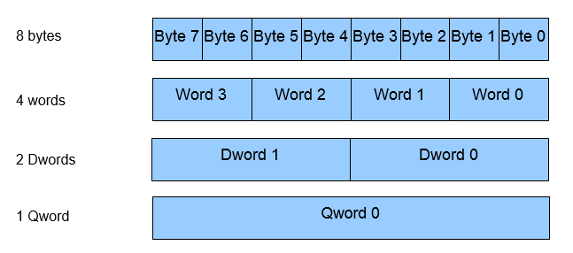
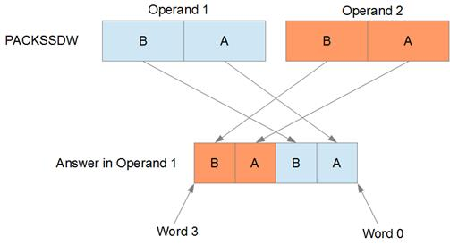
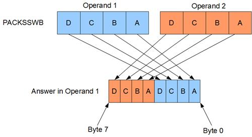
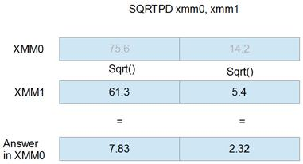
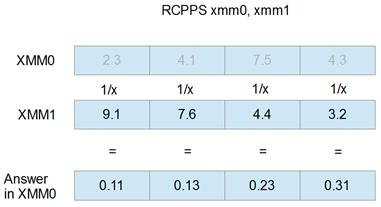

# 第八章 SIMD 指令集

SIMD 代表单指令多数据。这是一种并行编程。SIMD 的想法是一次对多条数据执行相同的指令。添加到 x86 体系结构中的 SIMD 指令最初用于加速多媒体处理。在多媒体编程中，对屏幕上的每个像素或者声音数据流中的每个字节执行相同的操作是很常见的。

自推出以来，已有数百条新指令被添加到 x86 CPUs 中。这是一种非常不同的编程方式。它需要一组新的眼睛、调试技能、新的算法和数据结构。SIMD 指令集有自己的新寄存器和指令。这些新寄存器通常比原来的 x86 寄存器大，可以认为它们保存了一个小的值数组。例如，一个 64 位 SIMD 寄存器可以保存一个 8 字节、4 个字或 2 个字的数组。

许多 SIMD 风格的指令对两个寄存器中的相应元素进行操作。在 SIMD，字节相加包括将两个操作数中最低的两个字节相加，并将答案存储在最低的字节中，将倒数第二个字节相加，并将其存储在答案的倒数第二个字节中——这一过程一直持续到两个最高字节相加在一起，并且它们的结果存储在答案的顶部元素中。虽然许多指令是以这种方式工作的，正如许多指令做完全不同的事情一样。

例如，考虑标量编程中的一个循环，它将两个数组中的元素相加。也许数组包含 8 个元素。这些元素可以用 C++添加，如下所示:

```asm
  for(int i = 0; i < 8; i++)
  {
         arr1[i] += arr2[i];
  }

```

这导致在 Visual Studio 中打开优化时生成大约 24 行程序集。C++编译器展开整个循环并使用八条`ADD`指令。展开循环是一种很好的优化技术，现代编译器正是这种优化的专家。

然而，即使使用最基本的 SIMD 指令(本例中使用的是 MMX 指令)，也只需四条指令就可以完成 8 字节数组的相同加法。

```asm
  movq mm0, qword ptr arr1   ; Load 8 bytes from arr1 into
  MM0
  paddb mm0, qword ptr arr2  ; Add the 8 bytes from arr2
  movq qword ptr arr1, mm0   ; Store the answer back in arr1
  emms                       ; Close multimedia state

```

最重要的是要注意，在 SIMD 版本中没有循环。循环的所有八次迭代都可以在单个指令(`PADDB`，添加打包字节指令)中执行。加法指令对 CPU 来说是单步；它需要一两个时钟周期(取决于 CPU 和流水线问题，并假设阵列在缓存中)。MMX 可以一次执行八个操作，但它的执行速度不会是常规标量代码的八倍。虽然它的执行速度不会快八倍，但您会看到性能提升，尤其是在计算密集型功能方面。计算密集型函数是那些从内存中加载数据，对数据执行许多操作，然后存储结果的函数。

## SIMD 概念

### 饱和算法与环绕算法

在常规的 x86 指令中，当结果太大而无法放入目标时，结果的顶部会丢失，并且实际上只写入适合目标的位。这有效地将结果包装在顶部和底部，如下所示:

```asm
  mov al, 255
  inc al        ; AL will wrap around to 0 since 256 is too
  large

  mov al, 0
  dec al        ; AL will wrap to 255 if unsigned and -1 if
  signed

```

这被称为环绕算法，或模块化算法。这往往是所有需要的，但也有一些问题。多媒体上的许多运算并没有从这种算术中受益。例如，考虑一种通过给每个像素增加一些值来增加图像亮度的算法。一些像素可能已经几乎是白色的，具有接近 255、255、255 的值，这是标准 RGB24 颜色模式中的白色像素。如果给这些像素增加额外的亮度，它们会突然变得非常暗。我们的原始像素的红色分量值为 252，我们将亮度增加 12，使其为 264，但由于在 256 处进行了舍入，我们最终将得到 8。我们的像素会从非常亮变成非常暗，使得调整亮度算法显得不正确。

正是由于这个原因，饱和算术被结合到 SIMD 指令集的许多指令中。饱和算法为每种数据类型设置一个最大值和最小值，答案将被限制在这些值上，而不是绕回。我们示例中的 252 + 12 将饱和为 255。

每个数据大小和类型(无符号或有符号)都有两个饱和值:一个是最小值，另一个是最大值。

表 18:饱和值

| 数据类型 | 最小饱和 | 最大饱和 |
| --- | --- | --- |
| 无符号字节 | Zero | Two hundred and fifty-five |
| 有符号字节 | -128 | One hundred and twenty-seven |
| 无符号字 | Zero | Sixty-five thousand five hundred and thirty-five |
| 签名字 | -32768 | Thirty-two thousand seven hundred and sixty-seven |
| 未签名 Dword | Zero | Four billion two hundred and ninety-four million nine hundred and sixty-seven thousand two hundred and ninety-five |
| 签名 Dword | -2147483648 | Two billion one hundred and forty-seven million four hundred and eighty-three thousand six hundred and forty-seven |

### 打包/SIMD 对标量

一次对多个数据元素的操作称为 SIMD 操作或打包操作。在 x86 指令中，对单个元素的操作称为标量。一些 SIMD 指令集和 SIMD 一样执行标量运算。

## MMX

MMX 是第一个添加到 x86 体系结构中的 SIMD 指令集。它是英特尔在 1996 年添加的(其他 x86 CPU 制造商也包括这些 SIMD 指令集，如 AMD 和 VIA)。在添加时，英特尔不希望向中央处理器添加新的寄存器。相反，它们使用与 x87 浮点单元相同的寄存器(MMX 寄存器被称为 x87 寄存器的别名，反之亦然)。x87 浮点单元有双重作用；它可以执行常规的 x87 浮点运算，也可以处于多媒体模式，执行 MMX 指令。x87 单元将简单地通过执行 MMX 指令改变到 MMX 模式，但是一旦程序完成 MMX，你必须调用 EMMS(退出多媒体状态)指令来使 x87 返回到它的常规浮点模式。

值得注意的是，MMX 指令也被添加到 SSE2 指令集。将这些指令与 SSE 寄存器一起使用时，它们的工作负载会加倍，使用 128 位 SSE 寄存器而不是 64 位 MMX 寄存器。大多数 SSE 指令集使用浮点运算，但是如果 CPU 支持 SSE2，您也可以将任何 MMX 指令与 128 位 SSE 寄存器结合使用，对整数执行运算。现在几乎所有的 CPU 都有 SSE2 的能力。Windows 8 和 Office 2013 需要具有 SSE2 功能的 CPU，这表明 SSE2 CPUs 有多广泛。如果 MMX 和 SSE2 版本的说明之间的差异很重要，我已经在 MMX 和 SSE 参考章节中包含了该说明。

### 寄存器

x87 寄存器(ST0 至 ST7)有 8 个 MMX 寄存器。我们不会在本书中研究 x87，因为上交所已经使它主要成为遗产。MMX 寄存器命名为 MM0、MM2、MM3、MM4、MM5、MM6 和 MM7。每个寄存器 64 位宽。MMX 寄存器可以用作 8 字节、4 个字、2 个双字，或者偶尔用作单个 q 字。MMX 寄存器的数据大小由指令决定。特定寄存器保存的数据大小不是固定的；你可以随时改变它。传统上，寄存器被绘制成数组，第一个字节在最右边，最后一个字节在左边。每个元素中的字节也是一个位数组，最低有效位在每个元素的右边，最高有效位在左边。

MMX 寄存器可以通过以下方式使用:



大多数 MMX 指令采用两个操作数；第一个是目的地，第二个是来源。与 x86 指令一样，目标也经常充当源。例如，使用 add 指令，目标变成目标加上源。因为这可能会引起误解，所以我将使用术语操作数 1 和 2 或参数 1 和 2。

### 参考记忆

要在 MMX 指令中引用内存，请使用以下命令:

```asm
  movq mm5, qword ptr [A]

```

`A`是至少 64 位的数组。不能单独使用`A`(没有指针前缀)；MMX 需要知道那里有大量的数据。您也可以使用 x86 复杂寻址模式。

```asm
  mov mm0, qword ptr [rax+rdx*2]
  mov qword ptr [rdx], mm3

```

大多数 MMX(以及上交所)指令不允许第一个操作数是内存。通常，第一个操作数必须是 MMX 寄存器，第二个操作数可以是 MMX 寄存器或内存操作数。

### 退出多媒体状态

`EMMS`

八个 MMX 寄存器实际上使用浮点单元的 ST(x)寄存器。一执行 MMX 指令，中央处理器就进入多媒体状态，即 MMX 模式。要恢复这些寄存器的常规浮点使用，必须调用 EMMS。

```asm
  movq mm0, mm1 ; Call some MMX instruction to begin MMX
  mode
  emms   ; After you are done in MMX, call emms to restore
  floating point mode

```

|  | 注意:几乎所有的浮点运算都是通过使用 SSE 标量指令来执行的，而不是使用相当孤独且越来越被忽视的 x87 单元。在 x64 中，不调用 EMMS 通常不会造成问题。不过，EMMS 总是一个好主意，因为跟踪这种令人发指的忽视良好实践的行为会产生的错误可能很困难。 |

不要在循环中间调用 EMMS，因为(特别是在旧的英特尔处理器上)指令执行起来非常慢。最好一起进行大块的 MMX 处理，并且仅在所有 MMX 处理完成后调用该指令。

## 将数据移入 MMX 寄存器

MMX 有两条数据移动指令；一个移动 64 位数据，另一个移动 32 位。移动 32 位时，如果目标操作数是 MMX 寄存器，则顶部清 0，数据仅移动到下半部分。

### 移动四字

`MOVQ [mmx], [mmx/mem64]`

`MOVQ [mmx/mem64], [mmx]`

该指令将第二个操作数的 64 位数据复制到第一个操作数中。

### 移动 Dword

`MOVD [mmx], [mmx/mem32/reg32]`

`MOVD [mmx/mem32/re32], [mmx]`

该指令将第二个操作数的 32 位移入 MMX 寄存器第一个操作数的底部；它也可用于将 32 位数据从通用寄存器或存储单元移动到 MMX 寄存器。

|  | 注意:当第一个操作数是 MMX 寄存器时，该指令将前 32 位清零。 |

`mov eax, 12`

`mov mm0, eax ; MM0 would have the following dwords: [0, 12]`

## 布尔指令

`PAND [mmx], [mmx/mem64]`

`POR [mmx], [mmx/mem64]`

`PXOR [mmx], [mmx/mem64]`

`PANDN [mmx], [mmx/mem64]`

这些指令在两个操作数的位之间应用布尔运算，并将结果存储在第一个操作数中。

打包的`AND NOT` ( `PANDN`)没有 x86 等价物；它对源(第一个操作数)和目标(第一个操作数)的倒数(按位`NOT`)执行按位`AND`。第一个操作数被补充，然后用第二个操作数执行`AND`。其他位指令的真值表，请参考 x86 指令集中`OR`、`AND`和`XOR`的条目。

表 PANDN 真值表

| 操作数 1 | 操作数 2 | 操作数 1 中的结果 |
| Zero | Zero | Zero |
| Zero | one | one |
| one | Zero | Zero |
| one | one | Zero |

|  | 注意:要将 MMX 寄存器清零，可以对寄存器使用 PXOR 来清零两个操作数。 |

`pxor mm0, mm0 ; Clear MM0 to 0`

`pandn mm0, mm0 ; The new ANDN instruction will clear a register to 0`

使用布尔指令时，数据类型之间没有区别。用文字对数据使用`XOR`与用字节对数据使用`XOR`产生完全相同的结果。与许多其他指令不同，布尔指令没有任何指定的数据类型。

## 移位位

`PSLLW [mmx], [mmx/mem64/imm8] ; Left, Logical, Words`

`PSLLD [mmx], [mmx/mem64/imm8] ; Left, Logical, dwords`

`PSLLQ [mmx], [mmx/mem64/imm8] ; Left, Logical, qword`

`PSRLW [mmx], [mmx/mem64/imm8] ; Right, Logical, Words`

`PSRLD [mmx], [mmx/mem64/imm8] ; Right, Logical, dwords`

`PSRLQ [mmx], [mmx/mem64/imm8] ; Right, Logical, qword`

`PSRAW [mmx], [mmx/mem64/imm8] ; Right, Arithmetic, Words`

`PSRAD [mmx], [mmx/mem64/imm8] ; Right, Arithmetic, dwords`

这些指令将目标中的元素向右或向左移动第二个操作数中指定的位数。左移有效地将数据乘以 2 的幂，而右移将比特右移，并除以 2 的幂。

逻辑移位将 0 移入空位，而算术右移位复制符号位，可用于整数的二次方有符号除法。

|  | 注意:如果第二个操作数是 64 位存储单元或 MMX 寄存器，则不是读 SIMD 风格。它被读取为单个 64 位数字。您不能将 MMX 登记簿中的单个元素移动不同的金额；它们都移位了相同的位数。 |

移位指令不会将数据绕回，因此可以通过向左移位超过数据大小的位来将寄存器清零，向左移位 64 位或更多位可以将寄存器清零。

还可以通过使用算术右移和大于或等于数据元素大小的值，在整个元素中复制元素的符号。

```asm
  psraw mm0, 16; Sets each of MM0's words to 1s if negative,
  otherwise 0

```

## 算术指令

`PADDB [mmx], [mmx/mem64] ; Add unsigned/signed bytes, wrap around`

`PADDSB [mmx], [mmx/mem64] ; Add signed bytes, saturate`

`PADDUSB [mmx], [mmx/mem64] ; Add unsigned bytes, saturate`

`PADDW [mmx], [mmx/mem64] ; Add unsigned/signed words, wrap around`

`PADDSW [mmx], [mmx/mem64] ; Add signed words, saturate`

`PADDUSW [mmx], [mmx/mem64] ; Add unsigned words, saturate`

`PADDD [mmx], [mmx/mem64] ; Add unsigned/signed double-words, wrap around`

`PSUBB [mmx], [mmx/mem64] ; Subtract signed/unsigned bytes, wrap around`

`PSUBSB [mmx], [mmx/mem64] ; Subtract signed words, saturate`

`PSUBUSB [mmx], [mmx/mem64] ; Subtract unsigned bytes, saturate`

`PSUBW [mmx], [mmx/mem64] ; Subtract unsigned/signed words, wrap around`

`PSUBSW [mmx], [mmx/mem64] ; Subtract signed words, saturate`

`PSUBUSW [mmx], [mmx/mem64] ; Subtract unsigned words, saturate`

`PSUBD [mmx], [mmx/mem64] ; Subtract signed/unsigned doubles`

这些指令加减字节、字或数据字。第二个操作数中的每个元素都从第一个操作数中的相应元素中减去或添加到第一个操作数中，打包加法和减法的结果存储在第一个操作数中。这些指令可以选择使用环绕或饱和算法。在 MMX，对数据字进行操作的指令没有饱和或无符号；如果需要此功能，则使用 SSE。

每个数据类型都有一个指令，其中数据类型是有符号的还是无符号的并不重要，因为结果是相同的。`PADDB`、`PADDW`、`PADDD`、`PSUBB`、`PSUBW`和`PSUBD`如果数据是有符号或无符号的，都给出相同的答案。它们都没有使用饱和度。

|  | 注意:当您需要检测哪些元素在 SIMD 操作中溢出时，您可以执行操作的饱和版本和环绕版本，并比较结果。两个答案中不相同的元素已经溢出。这很有用，因为在 SIMD 没有进位标志或溢出。 |

`PADDW mm0, mm1`说明如下:


图 16

下一个例子是`PSUBW mm0, mm1`。请注意，第二个操作数从第一个操作数中减去。


图 17

### 乘法

`PMULHW [mmx], [mmx/mem64] ; Multiply and keep high 16 bits of 32 bit result`

`PMULLW [mmx], [mmx/mem64] ; Multiply and keep low 16 bits of 32 bit result`

`PMADDWD [mm0], [mmx/mem64] ; Multiply and add words to double-words`

您可以将两个 MMX 寄存器或一个 MMX 寄存器与一个存储单元相乘，但所有这些指令只对有符号的字进行操作。对于其他整数数据类型的乘法，使用 SSE2。乘法时，可以选择保留乘法的前 16 位(`PMULHW`)或后 16 位(`PMULLW`)。

还有一个融合的乘加指令(`PMADDWD`，假设单词是有符号的)，允许您在单次操作中以更高的精度进行乘加。目的地中的每个单词乘以目的地中相应的单词，得到四个结果:A、B、C 和 D。然后 A 被加到 B 上，C 被加到 D 上，这两个答案形成了目的地中的最后两个 dword。初始乘法能够产生 32 位，因为使用了更大的临时寄存器。

|  | 注意:如果 PMADDWD 的一个操作数是{ 1，1，1，1 }(四个字都设置为 1)，操作将执行水平相加。它将目标中的每对相邻单词相加，并将两个结果存储为两个 dwords。 |

|  | 注意:如果 PMADDWD 的两个操作数中的第二个字都是 0，那么该指令将导致两个字的乘法，但整个 32 位结果将被保留。 |

## 比较

`pcmpeqb [mmx], [mmx/mem64] ; Compare bytes for equality`

`pcmpgtb [mmx], [mmx/mem64] ; Compare signed bytes for greater than`

`pcmpeqw [mmx], [mmx/mem64] ; Compare words for equality`

`pcmpgtw [mmx], [mmx/mem64] ; Compare signed words for greater than`

`pcmpeqd [mmx], [mmx/mem64] ; Compare double-words for equality`

`pcmpgtd [mmx], [mmx/mem64] ; Compare signed double-words for greater than`

MMX 有一个比较指令，用于测试相等性和大于唯一性。所有其他的比较必须建立在这些和布尔指令的基础上。

MMX(和其他 SIMD 指令集)中的比较导致将每个元素的所有位设置为 1 或 0。元素在通过条件时设置为全 1 掩码，在不通过条件时设置为全 0 掩码。所有“大于”的比较都在 MMX 签署。

例如，如果 mm0 有{ 9，14，21，40 }四个字，而 MM1 有{ 9，4，21，4 }，那么下面的代码将导致 MM0 有{ ffffh，0000h，ffffh，0000h }:

`pcmpeqw mm0, mm1 ; Packed compare words for equality`

这是因为 MM0 和 MM1 中有两个词相同，两个词不相同。MM0 实际上变成了 MM0 和 MM1 之间相同单词的掩码。

|  | 注意:PCMPEQB 指令(和其他等式比较指令)可用于将 MMX 寄存器设置为全 1 或 ffffffffffffh，方法是将同一寄存器用作两个操作数。 |

`pcmpeqb mm0, mm0 ; Set MM0 to all 1s`

### 创建剩余的比较运算符

有许多方法可以创建其他比较(`!=`、`>=`等)。).要使用 MM7 作为临时寄存器在 MM0 和 MM1 之间执行不等操作(`!=`)，请使用以下命令:

```asm
    pcmpeqb mm0, mm1
    pcmpeqb mm7, mm7
    pxor mm0, mm7

```

要使用 MM7 作为临时寄存器在 MM0 和 MM1 之间执行大于或等于操作(`>=`)，请使用以下命令:

```asm
  movq mm7, mm0    ; Backup parameter to mm7
  pcmpeqb mm0, mm1 ; Find where they are equal
  pcmpgb mm7, mm1  ; Find where they are greater
  por mm0, mm7     ; OR these two results

```

要使用 MM7 作为临时寄存器在 MM0 和 MM1 之间执行小于操作(`<`)，请使用以下命令:

```asm
  movq mm7, mm0               ; Backup parameter to mm7
  pcmpeqd mm0, mm1           ; Does mm0 = mm1 ?
  pcmpgd mm7, mm1            ; Is mm7 > mm1 ?
  por mm0, mm7                ; mm0 is now >= mm1
  pcmpeqd mm7, mm7           ; Get mm7 ready to complement
  mm0
  pxor mm0, mm7               ; mm0 is now < mm1

```

## 包装

`PACKSSDW [mmx], [mmx/mem64] ; Pack signed double-words to words and saturate`

`PACKSSWB [mmx], [mmx/mem64] ; Pack signed words to bytes and saturate`

`PACKUSWB [mmx], [mmx/mem64] ; Pack unsigned words to bytes and saturate`

打包指令将大数据类型转换成小数据类型，然后获取两个操作数的元素并调整它们的大小，使它们适合单个操作数。您可以将 dwords 转换为单词，或将单词转换为字节。转换字节时，可以使用带符号或不带符号的单词。所有的 MMX 包装说明都使用饱和度。

`PACKSSDW`通过饱和 dword 并将来自第一操作数的两个转换后的 dword 存储在答案的下半部分，并将来自第二操作数的两个转换后的单词存储在答案的上半部分，将 dword 转换为单词。



图 18

`PACKSSWB`和`PACKUSWB`通过首先应用饱和度将字转换为字节。`PACKSSWB`范围是-128 到 127，`PACKUSWB`范围是 0 到 255。第一个操作数的四个字转换成字节存储在答案的下半部分，第二个操作数的四个字转换成字节存储在答案的上半部分。



图 19

### 开箱

`PUNPCKLBW [mmx], [mmx/mem64] ; Unpack low bytes to words`

`PUNPCKHBW [mmx], [mmx/mem64] ; Unpack high bytes to words and interleave`

`PUNPCKLWD [mmx], [mmx/mem64] ; Unpack low words to double-words`

`PUNPCKHWD [mmx], [mmx/mem64] ; Unpack high words to double-words`

`PUNPCKLDQ [mmx], [mmx/mem64] ; Unpack low double-words to quad-words`

`PUNPCKHDQ [mmx], [mmx/mem64] ; Unpack high dwords to qword and interleave`

解包指令将较小的数据类型转换为较大的数据类型。它们是`MOV`指令，因为实际上根本没有数据转换。例如，将源中的八个字节转换为八个字需要的空间比 MMX 寄存器所能容纳的空间要多，因此您必须选择转换下半部分或上半部分。

转换是使用所谓的交错来执行的。第一个操作数的元素与第二个操作数的元素交错。


图 20

交错系统的发明是为了在给中央处理器增加最少指令的同时实现最大的灵活性。如果第二个操作数包含全零，则这些指令会对第一个操作数中的数据进行零扩展(无符号扩展)。

最初，这些指令也用于广播值(在整个寄存器中复制元素)。然而，上交所的洗牌指令让广播变得容易多了。

使用包装和拆包说明的一些例子如下:

```asm
  ; To duplicate the bottom 32 bits of mm0 into the top:
  punpckldq mm0, mm0

  ; To fill MM0 with 8 copies of a byte from AL (9 in this
  example):
  xor eax, eax                ; Make sure the top of EAX is
  0
  mov al, 9                  ; Copy the byte into eax, 9 in
  this example
  movd mm0, eax               ; Copy eax to the low dword of
  mm0
  punpckldq mm0, mm0          ; Duplicate the bottom into
  the topof MM0
  packssdw mm0, mm0          ; Copy these two 9s into 4
  packuswb mm0, mm0          ; Copy those four 9s into 8

  ; Sign extending: If the second operand contains the signs
  of the
  ; elements in the first operand (use the PSRAW instruction
  to get this)
  ; then these instructions have the effect of sign extending
  the data
  ; in the first operand:
  movq mm1, mm0        ; Copy words
  psraw mm1, 16        ; Fill mm1 with signs of elements in
  mm0
  punpcklwd mm0, mm1   ; Unpack interleaving with signs,
  sign extend to dwords!

```

## 上交所指令集

### 简介

SSE(流式 SIMD 扩展)指令集在新的 128 位寄存器上执行 SIMD 操作。多年来，已经创建了 SSE、SSE2、SSE3、SSSE3、SSE4.1、SSE4.2 和 SSE4a 指令集。最初的 SSE 指令集的目的是允许 SIMD 浮点指令和同时处理四个单精度浮点值的能力。额外的指令集增加了大量的指令，几乎可以用 SIMD 和标量来做任何事情。例如，SSE2 指令集增加了整数指令以及许多双精度浮点指令。

当 MMX 寄存器与 x87 单元的寄存器混叠时，上交所寄存器在中央处理器上占据一个新的寄存器空间。使用 SSE 不需要从多媒体模式切换到浮点模式。一些 SSE 指令确实将 MMX 寄存器与 SSE 寄存器结合使用，并且这些指令仍然会导致 x87 单元中的切换。就像在 MMX 指令集中一样，每当 SSE 指令引用 MMX 寄存器时，必须调用`EMMS`来将 x87 单元恢复到浮点模式。

最初，从 XMM0 到 XMM7 有八个 SSE 寄存器。在 x64 应用中，这已经增加到十六个寄存器，从 XMM0 到 XMM15。每个 SSE 寄存器宽 128 位，可用于图 21 所示的数据大小。

在接下来的指令列表中，我包含了指令集(除了助记符)。这就是指令的来源。使用前，务必检查中央处理器是否能够执行`CPUID`功能 1 的指令。


图 21

总的来说，SSE 指令集为程序员提供了数量惊人的数百条指令。许多指令都有标量版本和 SIMD 版本。

|  | 注意:微软编译器使用标量 SSE 指令来执行浮点运算，而不是使用 x87 FPU。 |

在 x64 中，C++编译器使用的 C 调用约定使用 XMM0 寄存器传递浮点参数。只有 XMM0 的最低单精度或双精度元素用于返回值，但 XMM0、XMM1、XMM2 和 XMM3 的最低元素用于将前四个浮点值传递给函数。

数据对齐对于许多引用内存的 SSE 指令非常重要。数据必须与读取或写入内存的 16 字节对齐，否则会出现分段错误。

### AVX

本参考资料中包括一些新的 AVX 说明。这些指令只在新的中央处理器上可用。AVX 指令集是自 1999 年最初的上交所以来增加的最大指令。指令集由许多 SSE 指令的新 AVX 版本和新的 256 位 SIMD 寄存器组成。

与早期的指令集不同，AVX 需要操作系统的支持。默认情况下，Windows 7 不支持 AVX，必须通过安装 Service Pack 1 (SP1)进行升级。Windows 8 及更高版本支持 AVX。

从 YMM0 到 YMM15 共有 16 个 AVX 寄存器。它们都是 256 位宽，并与十六个 SSE 寄存器混叠，因此 YMM0 的低 128 位是 SSE 寄存器 XMM0。

每个 AVX 寄存器都可以像上交所寄存器一样拆分，只是 AVX 寄存器中可用的元素数量是上交所寄存器的两倍。AVX 指令以“V”开头，助记符与上交所版本的指令相似。

除了更大的寄存器，新的 AVX 指令经常提供许多指令的非破坏性版本。

`ADDPD XMM0, XMM2 ; Destructive, XMM0 is overwritten`

`VADDPD XMM0, XMM2, XMM7 ; Non destructive, XMM0 = XMM2 + XMM7`

此指令以类似于 SSE 版本的方式添加相应的打包双精度值；只有操作数 2 和 3 相加，答案存储在操作数 1 中。这允许目标对于两个源是不同的操作数。

## 数据移动指令

### 移动对齐的打包双打/单打

`MOVAPD [xmm/mem128], [xmm/mem128] - SSE2`

`VMOVAPD [xmm/mem128], [xmm/mem128] - AVX`

`VMOVAPD [ymm/mem256], [ymm/mem256] - AVX`

`MOVAPS [xmm/mem128], [xmm/mem128] - SSE2`

`VMOVAPS [xmm/mem128], [xmm/mem128] - AVX`

`VMOVAPS [ymm/mem256], [ymm/mem256] - AVX`

移动对齐指令将第二个操作数的 128 位或 256 位数据移动到第一个操作数中。如果两个操作数中的任何一个是内存位置，那么它必须与 16 个字节对齐。

在声明变量的数据类型之前，可以使用 **_declspec(align(16))** 指令在 C++中将数据对齐到 16 个字节。

数据可以在。在声明变量之前，使用**对齐线上的 16** 来组装数据段。

尽管上交所和 AVX 的许多指令需要对齐的数据，否则会产生分段错误，但中央处理器对对齐的数据执行操作的速度更快。

### 移动未对齐的打包双打/单打

`MOVUPD [xmm/mem128], [xmm/mem128] - SSE2`

`VMOVUPD [xmm/mem128], [xmm/mem128] - AVX`

`VMOVUPD [ymm/mem256], [ymm/mem256] - AVX`

`MOVUPS [xmm/mem128], [xmm/mem128] - SSE`

`VMOVUPS [xmm/mem128], [xmm/mem128] - AVX`

`VMOVUPS [ymm/mem256], [ymm/mem256] - AVX`

移动未对齐的打包双精度和单精度指令将第二个操作数的 128 位或 256 位数据移动到第一个操作数中。与对齐的移动指令不同，如果其中一个操作数是内存操作数，那么它不需要对齐到 16 个字节。

## 算术指令

整数类型的算术运算可以使用 SSE 寄存器和与 MMX 指令相同的指令助记符来执行。只有当 SSE2 指令集可用时，MMX 指令助记符才能用于 SSE 寄存器。

### 添加浮点值

表 20

| 记忆的 | 意义 | 操作数 | 指令组 |
| --- | --- | --- | --- |
| ADDPD | 添加打包双打 | [xmm]、[xmm/mem128] | SSE2 |
| VADDPD | 添加打包双打 | [xmm]、[xmm]、[xmm/mem128] | AVX |
| VADDPD | 添加打包双打 | [ymm]、[ymm]、[ymm/mem256] | AVX |
| ADDPS | 添加打包的单曲 | [xmm]、[xmm/mem128] | 同ＳＯＵＴＨ-ＳＯＵＴＨ-ＥＡＳＴ |
| 瓦迪斯 | 添加打包的单曲 | [xmm]/[xmm]、[xmm/mem128] | AVX |
| 瓦迪斯 | 添加打包的单曲 | [ymm]/[ymm]，[ymm/mem256] | AVX |
| ADDSD | 添加标量双精度 | [xmm]、[xmm/mem64] | SSE2 |
| VADDSD | 添加标量双精度 | [xmm]、[xmm]、[xmm/mem64] | AVX |
| 附加 | 添加标量单个 | [xmm]、[xmm/mem32] | 同ＳＯＵＴＨ-ＳＯＵＴＨ-ＥＡＳＴ |
| 瓦迪斯 | 添加标量单个 | [xmm]、[xmm]、[xmm/mem32] | AVX |

这些指令用于将元素从一个 SSE 或 AVX 寄存器添加到另一个。双操作数 SSE 和 AVX 版本将第二个操作数的元素添加到第一个操作数的相应元素中，并将答案存储在第一个操作数中。三操作数 AVX 版本将第二个操作数和第三个操作数中的元素相加，然后将答案存储在第一个操作数中。

以下示例说明了添加指令的操作方式。这里`ADDPS`(添加打包的单个)指令用于将 XMM1 中的值与 XMM0 中的值相加:


图 22

### 减去浮点值

表 21

| 记忆的 | 意义 | 操作数 | 指令组 |
| --- | --- | --- | --- |
| 支线飞机 | 减去打包双打 | [xmm]、[xmm/mem128] | SSE2 |
| VSUBPD | 减去打包双打 | [xmm]、[xmm]、[xmm/mem128] | AVX |
| VSUBPD | 减去打包双打 | [ymm]、[ymm]、[ymm/mem256] | AVX |
| 支线飞机 | 减去打包的单曲 | [xmm]、[xmm/mem128] | 同ＳＯＵＴＨ-ＳＯＵＴＨ-ＥＡＳＴ |
| VSUBPS | 减去打包的单曲 | [xmm]、[xmm]、[xmm/mem128] | AVX |
| VSUBPS | 减去打包的单曲 | [ymm]、[ymm]、[ymm/mem256] | AVX |
| subst | 减去标量双精度 | [xmm]、[xmm/mem64] | SSE2 |
| vsubst | 减去标量双精度 | [xmm]、[xmm]、[xmm/mem64] | AVX |
| SUBSS | 减去标量单 | [xmm]、[xmm/mem32] | 同ＳＯＵＴＨ-ＳＯＵＴＨ-ＥＡＳＴ |
| vsboss | 减去标量单 | [xmm]、[xmm]、[xmm/mem32] | AVX |

减法指令从另一个寄存器的相应元素中减去一个寄存器或存储器中的元素。指令的双操作数版本从第一个操作数的相应元素中减去第二个操作数的元素，并将答案存储在第一个操作数中。三操作数 AVX 版本从第二个操作数中减去第三个操作数的元素，并将结果存储在第一个操作数中。

以下示例说明了使用 XMM0 和 XMM1 作为操作数的`SUBPS`指令。XMM1 中的四个单精度浮点数与 XMM0 中的浮点数相减，结果放入 XMM0 中。


图 23

### 划分浮点值

表 22

| 记忆的 | 意义 | 操作数 | 指令组 |
| --- | --- | --- | --- |
| DIVPD | 分开打包双打 | [xmm]、[xmm/mem128] | SSE2 |
| VDIVPD | 分开打包双打 | [xmm]、[xmm]、[xmm/mem128] | AVX |
| VDIVPD | 分开打包双打 | [ymm]、[ymm]、[ymm/mem256] | AVX |
| DIVPS | 分开打包的单品 | [xmm]、[xmm/mem128] | 同ＳＯＵＴＨ-ＳＯＵＴＨ-ＥＡＳＴ |
| VDIVPS | 分开打包的单品 | [xmm]、[xmm]、[xmm/mem128] | AVX |
| VDIVPS | 分开打包的单品 | [ymm]、[ymm]、[ymm/mem256] | AVX |
| DIVSD | 标量双分频 | [xmm]、[xmm/mem64] | SSE2 |
| VDIVSD | 标量双分频 | [xmm]、[xmm]、[xmm/mem64] | AVX |
| div css | 单分频标量 | [xmm]、[xmm/mem32] | 同ＳＯＵＴＨ-ＳＯＵＴＨ-ＥＡＳＴ |
| VDIVSS | 单分频标量 | [xmm]、[xmm]、[xmm/mem32] | AVX |

除法指令将一个寄存器或存储器中的元素除以另一个寄存器或存储器中的相应元素。双操作数版本将第一个操作数中的值除以第二个操作数中的相应值，并将结果存储在第一个操作数中。三操作数版本将第二个操作数中的元素除以第三个操作数中的元素，并将结果存储在第一个操作数中。

示例图示为以 XMM0 和 XMM1 为操作数的`DIVPD`指令。XMM0 中的元素除以 XMM1 中的元素，得到的双精度值存储在 XMM0 中。


图 24

### 乘以浮点值

表 23

| 记忆的 | 意义 | 操作数 | 指令组 |
| --- | --- | --- | --- |
| MULPD | 多重包装双打 | [xmm]、[xmm/mem128] | SSE2 |
| VMULPD | 多重包装双打 | [xmm]、[xmm]、[xmm/mem128] | AVX |
| VMULPD | 多重包装双打 | [ymm]、[ymm]、[ymm/mem256] | AVX |
| MULPS | 多重包装的单品 | [xmm]、[xmm/mem128] | 同ＳＯＵＴＨ-ＳＯＵＴＨ-ＥＡＳＴ |
| VMULPS | 多重包装的单品 | [xmm]、[xmm]、[xmm/mem128] | AVX |
| VMULPS | 多重包装的单品 | [ymm]、[ymm]、[ymm/mem256] | AVX |
| MULSD(消歧义) | 乘法标量双精度 | [xmm]、[xmm/mem64] | SSE2 |
| VMULSD | 乘法标量双精度 | [xmm]、[xmm]、[xmm/mem64] | AVX |
| MULSS | 单倍标量 | [xmm]、[xmm/mem32] | 同ＳＯＵＴＨ-ＳＯＵＴＨ-ＥＡＳＴ |
| VMULSS | 单倍标量 | [xmm]、[xmm]、[xmm/mem32] | AVX |

乘法指令将一个寄存器中的元素乘以另一个寄存器或存储器中的相应元素。双操作数版本将第一个操作数中的值乘以第二个操作数中的值，并将结果存储在第一个操作数中。三操作数版本将第三个操作数中的值乘以第二个操作数中的值，并将结果存储在第一个操作数中。

下图是使用 XMM0 和 XMM1 作为操作数的`MULPD`指令。XMM0 中的双精度与 XMM1 中的双精度相乘，结果存储在 XMM0 中。


图 25

### 浮点值的平方根

表 24

| 记忆的 | 意义 | 操作数 | 指令组 |
| --- | --- | --- | --- |
| SQRTPD | 平方根包装双打 | [xmm]、[xmm/mem128] | SSE2 |
| VSQRTPD | 平方根包装双打 | [xmm]、[xmm/mem128] | AVX |
| VSQRTPD | 平方根包装双打 | [ymm]，[ymm/mem256] | AVX |
| 条 | 平方根包装单打 | [xmm]、[xmm/mem128] | 看见 |
| VSQRTPS | 平方根包装单打 | [xmm]、[xmm/mem128] | AVX |
| VSQRTPS | 平方根包装单打 | [ymm]，[ymm/mem256] | AVX |
| SQRTSD | 平方根标量双精度 | [xmm]、[xmm/mem64] | SSE2 |
| VSQRTSD | 平方根标量双精度 | [xmm]、[xmm/mem64] | AVX |
| 强调 | 平方根标量单 | [xmm]、[xmm/mem32] | 同ＳＯＵＴＨ-ＳＯＵＴＨ-ＥＡＳＴ |
| VSQRTSS | 平方根标量单 | [xmm]、[xmm/mem32] | AVX |

平方根指令计算第二个操作数中元素的平方根，并将答案存储在第一个操作数中。

下图是使用寄存器 XMM0 和 XMM1 作为操作数的`SQRTPD`指令。计算中忽略第一个操作数(xmm 0)；它的元素已变灰。XMM0 元素的最终结果是 XMM1 中双精度的平方根。



图 26

### 单精度浮点数的倒数

表 25

| 记忆的 | 意义 | 操作数 | 指令组 |
| --- | --- | --- | --- |
| RCPPS | 相互打包的单曲 | [xmm]，pxmm/mem128] | 同ＳＯＵＴＨ-ＳＯＵＴＨ-ＥＡＳＴ |
| VRCPPS | 相互打包的单曲 | [xmm]、[xmm/mem128] | AVX |
| VRCPPS | 相互打包的单曲 | [ymm]，[ymm/mem128] | AVX |
| RCPSS | 倒数标量单 | [xmm]、[xmm/mem32] | 同ＳＯＵＴＨ-ＳＯＵＴＨ-ＥＡＳＴ |
| VRCPSS | 倒数标量单 | [xmm]、[xmm/mem32] | AVX |
| VRCPSS | 倒数标量单 | [ymm]，[ymm/mem32] | AVX |

倒数指令计算第二个操作数中元素的倒数(1/ *x* ，其中 *x* 是元素)，并将结果存储在第一个操作数的元素中。第一个操作数的元素在计算中被忽略。这些指令中除以零的结果是无穷大。这些指令只给出了实数倒数的快速近似；当不需要精确精度时，可以使用它们。

下图为以 XMM0 和 XMM1 为操作数的`RCPPS`指令。XMM0 中的初始值被指令忽略，并被 XMM1 中元素的倒数覆盖。它们在图 27 中是灰色的。



图 27

### 单精度浮点数平方根的倒数

`RSQRTPS [xmm], [xmm/mem128] – SSE`

`VRSQRTPS [xmm], [xmm/mem128] – AVX`

`VRSQRTPS [ymm], [ymm/mem256] – AVX`

`RSQRTSS [xmm], [xmm/mem32] – SSE`

`VRSQRTSS [xmm], [xmm], [xmm/mem32] – AVX`

这些指令计算第二个操作数中元素的平方根(1/sqrt( *x* )或 sqrt( *x* )/ *x* ，其中 *x* 是元素)的倒数，并将结果存储在第一个操作数中。换句话说，它们用第二个操作数中元素的平方根除以 1，并将结果存储在第一个操作数中。答案并不精确，说明仅在需要快速近似时使用。

下图显示了使用 XMM0 和 XMM1 作为操作数的`RSQRTPS`指令。XMM0 中的值在计算中被忽略，并已灰显。得到的倒数平方根只是第二个操作数的平方根。


图 28

## 布尔运算

不管寄存器中的数据类型如何，所有这些操作本质上都是完全相同的，因为打包双精度的按位操作对 SIMD 寄存器的影响与打包单精度的按位操作相同。当 SIMD 寄存器中的数据不被视为相同大小时，一些中央处理器会遭受轻微的性能损失。因此，使用为您正在处理的特定数据类型设计的按位或布尔指令是最安全的。

### 不是打包双打/单打

`ANDNPD [xmm], [xmm/mem128] – SSE2`

`PANDN [xmm], [xmm/mem128] – SSE2`

`VANDNPD [xmm], [xmm], [xmm/mem128] - AVX`

`VANDNPD [ymm], [ymm], [ymm/mem256] – AVX`

`ANDNPS [xmm], [xmm/mem128] – SSE2`

`VANDNPS [xmm], [xmm], [xmm/mem128] – AVX`

`VPANDN [xmm], [xmm], [xmm/mem128] - AVX`

`VANDNPS [ymm], [ymm], [ymm/mem256] – AVX`

`AND NOT`指令首先对一个操作数进行补码，然后在两个操作数之间执行按位`AND`。它们将结果存储在目的地(请参阅 MMX 布尔指令了解该指令的真值表)。对于这些指令的双操作数版本，先对第一个操作数进行补码，然后在两个操作数的位之间执行按位`AND`。结果存储在第一个操作数中。

对于这些指令的三操作数版本，第二个操作数被补充，然后在第二个和第三个操作数之间执行按位`AND`。结果存储在第一个操作数中。

该指令对于创建表示负比较的位掩码非常有用。

### 和打包双打/单打

`ANDPD [xmm], [xmm/mem128] – SSE2`

`PAND [xmm], [xmm/mem128] – SSE2`

`VANDPD [xmm], [xmm], [xmm/mem128] - AVX`

`VPAND [xmm], [xmm], [xmm/mem128] - AVX`

`VANDPD [ymm], [ymm], [ymm/mem256] – AVX`

`ANDPS [xmm], [xmm/mem128] – SSE`

`VANDPS [xmm], [xmm], [xmm/mem128] - AVX`

`VANDPS [ymm], [ymm], [ymm/mem256] – AVX`

这些指令在两个操作数之间执行按位`AND`。该指令的双操作数版本在第一个和第二个操作数之间执行按位`AND`，将结果存储在第一个操作数中。三操作数版本在第二个和第三个操作数之间执行按位`AND`，并将结果存储在第一个操作数中。

### 或打包双打/单打

`ORPD [xmm], [xmm/mem128] – SSE2`

`POR [xmm], [xmm/mem128] – SSE2`

`VORPD [xmm], [xmm], [xmm/mem128] - AVX`

`VPOR [xmm], [xmm], [xmm/mem128] – AVX`

`VORPD [ymm], [ymm], [ymm/mem256] – AVX`

`ORPS [xmm], [xmm/mem128] – SSE`

`VORPS [xmm], [xmm], [xmm/mem128] - AVX`

`VORPS [ymm], [ymm], [ymm/mem256] – AVX`

`OR`指令在两个操作数之间执行逐位`OR`。双操作数版本在第一个和第二个操作数之间执行按位`OR`，并将结果存储在第一个操作数中。三操作数 AVX 版本在第二个和第三个操作数之间执行按位`OR`，将结果存储在第一个操作数中。

### XOR 打包双打/单打

`XORPD [xmm], [xmm/mem128] – SSE2`

`PXOR [xmm], [xmm/mem128] – SSE2`

`VXORPD [xmm], [xmm], [xmm/mem128] - AVX`

`VXORPD [ymm], [ymm], [ymm/mem256] – AVX`

`VPXOR [xmm], [xmm], [xmm/mem128] – AVX`

`XORPS [xmm], [xmm/mem128] – SSE`

`VXORPS [xmm], [xmm], [xmm/mem128] - AVX`

`VXORPS [ymm], [ymm], [ymm/mem256] – AVX`

`XOR`指令在两个操作数之间执行逐位`XOR`运算。这些指令的双操作数版本在第一个和第二个操作数之间执行按位`XOR`，并将结果存储在第一个操作数中。三操作数版本在第二和第三操作数之间执行按位`XOR`，并将结果存储在第一操作数中。

## 对比说明

### 打包双打和单打的比较

`CMPxxPtt [xmm], [xmm/mem128] - SSE and SSE2 versions`

`VCMPxxPtt [xmm], [xmm], [xmm/mem128] - AVX versions`

`VCMPxxPtt [ymm], [ymm], [ymm/mem256] - AVX versions`

有很多比较说明；助记符跟随大纲(`CMPxxPtt`或`VCMPxxPtt`)，其中`xx`由运算符缩写(来自后面的**比较运算符**表)代替，`tt`由数据类型代替(`D`表示打包双精度浮点，`S`表示打包单精度浮点)。

表 26:比较运算符

| 缩写 | 意义 |
| --- | --- |
| 情商 | 等于 |
| 书信电报(letter message) | 不到 |
| 低爆速炸药（Low Explosive） | 小于或等于 |
| 无序 | 无序(NaN 或未定义) |
| 订单 | 有序(不是 NaN 或未定义) |
| NEQ | 不等于 |
| 那拉提 | 大于或等于，不小于 |
| NLE | 大于、不小于或等于 |

它们在两个操作数的对应元素之间执行比较运算符。运算符为真的任何元素的所有位都设置为 1。运算符为 false 的任何元素的所有位都设置为 0。

在 SSE 和 SSE2 版本中，在操作数 1 和 2 之间进行比较，结果位掩码存储在第一个操作数中。

在 AVX 版本中，在操作数 2 和 3 之间进行比较，并将结果位掩码放入第一个操作数中。

`UNORD`和`ORD`比较运算符用于确定各种 NaN(不是数字)元素的位置。双精度或浮点中的 NaN 值是无序的，如果使用`UNORD`比较将返回真，如果使用`ORD`将返回假。当使用`ORD`运算符时，所有数值可排序的值(不是 NaN 或#IND 的值)返回真，当使用`UNORD`运算符时返回假。

### 比较标量双打和单打

`CMPxxStt [xmm], [xmm/mem64/mem32] - SSE and SSE2 versions`

`VCMPxxStt [xmm], [xmm], [xmm/mem64/mem32] - AVX versions`

比较指令的标量版本与打包指令相同，只是它们在最低的双精度或单精度上执行比较。他们的助记符中有标量的`S`，而不是打包的`P`。

### 比较和设置滞后

`COMISD [xmm], [xmm/mem64] - SSE2`

`VCOMISD [xmm], [xmm/mem64] - AVX`

`COMISS [xmm], [xmm/mem32] - SSE`

`VCOMISS [xmm], [xmm/mem32] – AVX`

这些有趣的指令通过比较 SSE 或 AVX 寄存器，但设置 rFlags 寄存器，弥合了 SIMD 指令集和常规 x86 指令集之间的差距。指令是标量的，比较最低的单精度浮点(`COMISS`和`VCOMISS`)或最低的双精度浮点(`COMISD`和`VCOMISD`)。它们以下列方式设置标志寄存器:

表 xCOMISxx 之后的 x86 标志

| 情况 | 零标志 | 奇偶标记 | 进位标志 |
| 圆盘烤饼 | one | one | one |
| 参数 1 >参数 2 | Zero | Zero | Zero |
| 参数 1 | Zero | Zero | one |
| 参数 1 =参数 2 | one | Zero | Zero |

## 转换数据类型/转换

### 转换说明

转换为双打

`CVTDQ2PD [xmm], [xmm/mem64] ; Converts two dwords to doubles using SSE2`

`VCVTDQ2PD [xmm], [xmm/mem64] ; Converts two dwords to doubles using AVX`

`VCVTDQ2PD [ymm], [ymm/mem128] ; Converts two dwords to doubles using AVX`

`CVTPS2PD [xmm], [xmm/mem64] ; Converts packed singles to packed doubles using SSE2`

`VCVTPS2PD [xmm], [xmm/mem64] ; Converts packed singles to packed doubles using AVX`

`VCVTPS2PD [ymm], [ymm/mem128] ; Converts packed singles to packed doubles using AVX`

`CVTSI2SD [xmm], [reg32/64] ; Converts from x86 register to double using SSE2`

`VCVTSI2SD [ymm], [ymm], [reg32/64] ; Converts from x86 register to double using AVX`

`CVTSS2SD [xmm], [xmm/mem64] ; Converts a scalar single to a scalar double using SSE2`

`VCVTSS2SD [ymm], [ymm], [ymm/mem64] ; Converts a scalar single to a scalar double using AVX`

转换为单曲

`CVTDQ2PS [xmm], [xmm/mem128] ; Converts packed dwords to singles using SSE2`

`VCVTDQ2PS [xmm], [xmm/mem128] ; Converts packed dwords to singles using AVX`

`VCVTDQ2PS [ymm], [ymm/mem256] ; Converts packed dwords to singles using AVX`

`CVTPD2PS [xmm], [xmm/mem128] ; Converts packed doubles to singles using SSE2`

`VCVTPD2PS [xmm], [xmm/mem128] ; Converts packed doubles to singles using AVX`

`VCVTPD2PS [ymm], [ymm/mem256] ; Converts packed doubles to singles using AVX`

`CVTSD2SS [xmm], [xmm/mem64] ; Converts scalar double to scalar single using SSE2`

`VCVTSD2SS [ymm], [ymm], [ymm/mem64] ; Converts scalar double to scalar single using AVX`

`CVTSI2SS [xmm], [reg32/64] ; Converts from x86 registers to a scalar single using SSE2`

`VCVTSI2SS [ymm], [ymm], [reg32/64] ; Converts from x86 registers to a scalar single using AVX`

转换为整数

`CVT(T)PD2DQ [xmm], [xmm/mem128] ; Converts packed doubles to dwords using SSE2`

`VCVT(T)PD2DQ [xmm], [xmm/mem128] ; Converts packed doubles to dwords using AVX`

`VCVT(T)PD2DQ [ymm], [ymm/mem256] ; Converts packed doubles to dwords using AVX`

`CVT(T)PS2DQ [xmm], [xmm/mem128] ; Converts singles to dwords using SSE2`

`VCVT(T)PS2DQ [xmm], [xmm/mem128] ; Converts singles to dwords using AVX`

`VCVT(T)PS2DQ [ymm], [ymm/mem256] ; Converts singles to dwords using AVX`

`CVT(T)SD2SI [reg32/64], [xmm/mem32/64] ; Converts double to x86 register using SSE2`

`VCVT(T)SD2SI [reg32/64], [ymm/mem32/64] ; Converts double to x86 register using AVX`

`CVT(T)SS2SI [reg32/64], [mem32/64] ; Converts scalar single to scalar integer using SSE2`

`VCVT(T)SS2SI [reg32/64], [mem32/64] ; Converts scalar single to scalar integer using AVX`

数据转换指令在双精度、单精度和整数数据之间进行转换。它们将第二个操作数中的元素(或元素)转换为其他数据类型，并将转换后的结果存储在第一个操作数的元素中。转换类似于 C++类型转换。

将浮点值转换为 x86 寄存器的版本只处理标量值，因为 x86 寄存器本质上是标量的。它们很有用，因为它们允许使用 SSE 浮点计算的答案在 x86 寄存器中快速轻松地转换为整数。

当转换为整数时，您可以选择使用截断(通过将附加的`T`放在助记符的中间，如前面列表中的`(T)`所示)或使用 MXCSR 寄存器中指定的舍入函数。

### 选择舍入函数

`STMXCSR [mem32] – Store MXCSR`

`LDMXCSR [mem32] – Load MXCSR`

从浮点值转换为整数的转换指令根据 MXCSR 寄存器的舍入函数(第 13 位和第 14 位)执行舍入。

表 28:MXCSR 中的舍入函数位

| 第 14 位 | 第 13 位 | 舍入函数 |
| --- | --- | --- |
| Zero | Zero | 舍入到最接近的整数 |
| Zero | one | 向下舍入到最接近的整数 |
| one | Zero | 向上舍入到最接近的整数 |
| one | one | 截断(向 0 舍入) |

要在 MXCSR 中设置舍入功能，必须首先使用存储 MXCSR 指令`STMCXSR`将寄存器复制到内存中。然后可以使用位测试指令`BTS`和`BTR`(或布尔指令)在内存中设置位 13 和 14。最后，可以使用加载 MXCSR 指令`LDMXCSR`，将 MXCSR 的改变值从内存加载回真实的 MXCSR。

`LDMXCSR`和`STMCXSR`指令都采用单个 32 位内存操作数。在`STMXCSR`中，这个操作数是一个变量，用于将 MXCSR 存储在内存中。在`LDMXCSR`中，操作数是复制 MXCSR 新值的存储位置。

```asm
  ; Example of selecting Round to Nearest, 00
  STMXCSR mxcsrState   ; Copy MXCSR to the 32-bit memory
  operand
  btr mxcsrState, 13   ; Unset both bits, set it to 0
  btr mxcsrState, 14
  LDMXCSR mxcsrState   ; Load the altered value back into
  MXCSR

  ; Example of selecting Round Down, 01
  STMXCSR mxcsrState   ; Copy MXCSR to the 32-bit memory
  operand
  bts mxcsrState, 13   ; Set bit 13 to 1
  btr mxcsrState, 14   ; And bit 14 to 0
  LDMXCSR mxcsrState   ; Load the altered value back into
  MXCSR

```