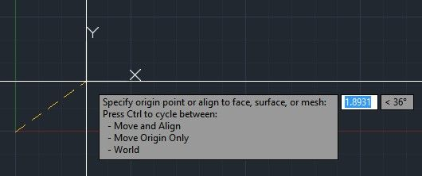
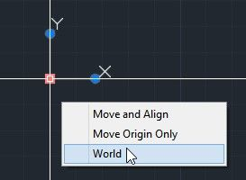
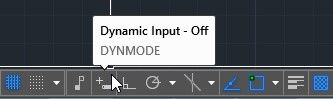
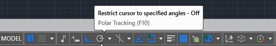
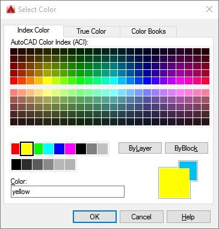
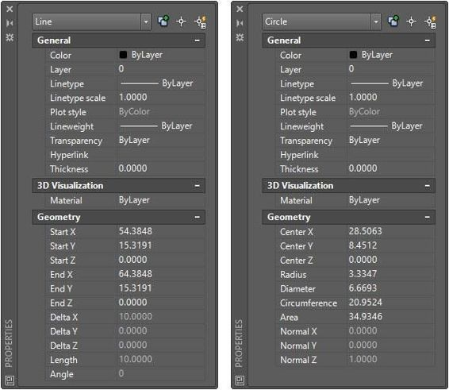
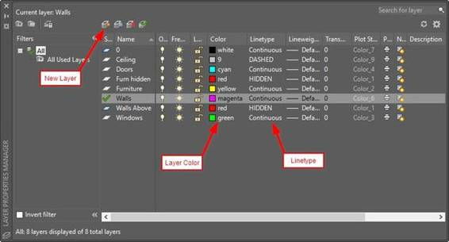
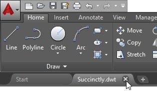

AutoCAD 几何图形由用于创建图形的图形实体组成，但是在我们开始创建一些图形之前，您首先需要了解如何在 AutoCAD 中输入坐标。

所有 AutoCAD 产品都由基于 x、y 和 z 坐标的三维(3D)坐标系组成。当您基于标准模板而不是三维模板(acad3D.dwt 和 acadiso3D.dwt)开始空白绘图时，您从俯视图开始，并且只能看到用户坐标系(UCS)的 x 轴和 y 轴。

本书仅涵盖创建和编辑二维(2D)几何图形，假设坐标系的 z 值为零。

|  | 注意:AutoCAD LT 可以打开在其他版本的 AutoCAD 上创建的三维模型，但不能创建或编辑三维几何图形，并且不允许高级自定义。 |

开始新绘图时，坐标系实际上是世界坐标系(WCS)，只有在方向、x、y 或 z 轴或原点位置发生任何变化后，才应将其称为 UCS。

WCS 在原点包含一个小正方形，而 UCS 不包含(见图 18)。

图 18: WCS 和加州大学

为了简化起见，我们将 AutoCAD 坐标系简称为 UCS。

如果选择其中一个轴端，只需单击它并将所需节点拖动到适当的位置或角度，即可更改 UCS 位置。

图 19:移动统一通信系统原点

如果将蓝色方块(称为夹点)悬停在上方，将弹出一个菜单，显示参考节点的可能编辑选项。图 20 显示了 UCS 原点的快速菜单。点击`World`返回到 UCS 到世界坐标系。

图 20:原点的 UCS 快速菜单

绘图限制由绘图区域中不可见的矩形边界表示。除非打开绘制限制，否则它不会定义允许绘制的区域。通常，绘图限制应该是纸张尺寸的延伸乘以比例。例如，如果您的绘图要以 1:10 的比例绘制，并且纸张大小为 420 毫米 x 297mm 毫米，则绘图限制可以是(0，0)到(4200，2970)。这不是必需的，许多用户从不设置或更改绘图限制。

要设置绘图限制，在命令窗口中输入`LIMITS`并按下`Enter`。将显示以下选项:

*   `Lower left corner`:点击或输入左下角为图纸限制。
*   `Upper right corner`:点击或输入左上角为图纸限制。
*   `On`:打开限制以避免在绘图限制之外输入点或创建元素。
*   `Off`:关闭限制，但是保存当前设置，虽然没有强制执行。

现在让我们了解您将如何告诉 AutoCAD 您想要在哪里定位您需要输入的点。在 AutoCAD 中有三种输入坐标的方法:

*   绝对的
*   亲戚
*   相对极坐标

创建几何对象时，要简化显示，按`F12`关闭动态输入，或点击状态栏上的`Dynamic Input`图标，如图 21 所示。状态栏上的灰色按钮表示变量设置为关闭。

图 21:动态输入切换

|  | 提示:如果您只使用 2D 对象，则在输入坐标时 z 坐标值可能会被忽略，并且它将被设置为当前高程设置(默认为 0)。 |

绝对坐标是从当前 UCS 的原点开始测量的。如果在坐标(50，25)处创建一个点，该点将位于 UCS 原点右侧(x 方向)50 个单位，UCS 原点上方(y 方向)25 个单位。您可以为坐标和负值输入任何数值；将点定位在原点的左侧或下方。

相对坐标是从您输入的最后一点开始测量的。@符号表示“最后一点”或“从最后一点开始”

在相对极坐标上，从输入的最后一点开始，输入到下一点的距离(或长度)和方向(角度)。请记住，默认情况下，角度以度为单位逆时针测量。您输入的负角度将顺时针旋转。

您也可以通过简单地单击绘图区域中的位置来快速输入点。您也可以通过将十字准线光标放在您想要创建线段的方向上并输入距离值来创建线段。这在结合正交和极坐标追踪时非常有用，它们可以帮助您限制角度方向。

为了说明如何使用 ORTHO，首先我们需要确保正交地限制光标。

为此，按下`F8`键，或点击状态栏上的按钮，如下图所示(记住蓝色为开，灰色为关)。

图 22:切换正交

现在只需遵循以下步骤:

1.  键入`L`并按下`Enter`或`Spacebar`启动`LINE`命令。
2.  单击屏幕上的一个点。
3.  将鼠标移到绘图区域上方，确保有一条垂直线。键入`10`并按下`Enter`或`Spacebar`。
4.  向右移动鼠标，确保有一条水平线。键入`10`并按下`Enter`或`Spacebar`。
5.  移动下面的鼠标，确保你有垂直线。键入`10`并按下`Enter`或`Spacebar`。
6.  键入`C`并按下`Enter`或`Spacebar`关闭矩形并结束命令。

类似于正交限制，它限制了统一坐标系的 x 和 y 方向，您可以使用极坐标追踪。要打开极坐标追踪，按下`F10`键或点击`Polar Tracking`切换按钮，如图 23 所示(记住蓝色是开的，灰色是关的)。

图 23:极坐标追踪切换

使用极坐标追踪，您可以选择其他角度增量进行限制，甚至添加自定义角度。只需点击按钮旁边的小向下箭头，显示默认增量跟踪角度列表，如图 24 所示，然后进行选择。

图 24:极坐标追踪设置

当您在“极坐标追踪”打开的情况下开始创建直线时，带有距离和角度的方框以及绿色虚线会显示您选择的增量方向。现在，您可以像使用正交限制一样输入距离。

图 25:极坐标追踪在运行

随着绘图的增长，您需要导航绘图，以便放大绘图区域或平移到其他位置。除了第 1 章中讨论的鼠标导航功能之外，默认情况下，AutoCAD 会在绘图区域的右上角显示一个导航栏，您可以在其中找到几乎所有的绘图导航工具(参见图 26)。

图 26:导航栏

鼠标滚轮仅限于放大和缩小图形，而“缩放”命令提供了更高级的方法。您可以通过输入`ZOOM,`或简单地输入`Z,`并按`Enter`从命令窗口执行`Zoom`命令，如图 27 所示，或者从导航栏执行`Zoom`命令，如图 28 所示。

 27:缩放命令提示符

 28:导航栏中的缩放命令

*   `Zoom All`:缩放至绘图范围或绘图限制，以较大者为准。
*   `Zoom Center` : 通过将选定点设置到屏幕中心并以放大级别进行缩放。放大级别越大，屏幕上显示的图形越小。

图 29:缩放中心前后

*   `Zoom Dynamic`:使用矩形视图框缩放和平移绘图，该矩形视图框可以缩小或放大，并在绘图上移动。

*   `Zoom Extents`:缩放至图形中所有对象的延伸，不受限制。
*   `Zoom Previous`:恢复以前的视图，最多 10 个以前的视图。
*   `Zoom Scale`:按比例因子改变缩放倍率。比例因子是一个正的非零数字，其中`1`是当前放大级别，后跟`X`，表示相对于当前视图的比例，或者`XP`，表示相对于图纸空间单位的比例。例如，输入`.5x`使对象看起来只有当前屏幕大小的一半。
*   `Zoom Window`:缩放到指定的矩形区域。这是从命令窗口运行时的默认方法。单击任意两个角来定义新的显示窗口。
*   `Zoom Object`:缩放到一个或多个选定的对象，以填充屏幕。
*   `Zoom Real Time`:工作原理与鼠标滚轮按钮类似，但使用鼠标左键。左键单击并向上拖动会增加缩放级别，而向下拖动会减少缩放级别。按下`Enter`或`Esc`退出命令。

在 AutoCAD 中创建的每个对象都有一组属性。有些属性是所有对象共有的；其他的是对象类型独有的。例如，一个圆有中心点坐标和半径，而一条线有起点和终点坐标(见图 31)。

称为“常规属性”的常见属性如下:

#### 颜色

对象颜色是一个非常重要的属性，因为它很容易用于识别图形中的对象。AutoCAD 调色板中有 255 种不同的颜色，但您也可以使用真彩色或彩色图书。如果图形设置为依赖于颜色的打印样式，AutoCAD 调色板允许您控制打印时对象的外观，这就是 acad.dwt 模板的设置方式。这本书只涵盖颜色相关的情节风格。

当您调用一个命令来选择一种颜色时，AutoCAD 会显示颜色对话框，如图 30 所示。

AutoCAD 颜色索引(ACI)的前两个大调色板的编号从 10 到 249。顶部调色板包含偶数，而下部调色板包含奇数。

中间色调色板显示从 1 到 9 的颜色，其中颜色 1 到 7 也被命名为红色、黄色、绿色、青色、蓝色、品红色和白色。白色可能显示为黑色，具体取决于绘图区域背景颜色。

最低的调色板显示从 250 到 255 的灰色阴影。

按钮`ByLayer`和`ByBlock`设置对象颜色，以继承与其关联的图层或块的颜色。为图层选择颜色时，这些按钮不可用。

颜色文本框允许您输入颜色索引号或名称。

颜色条带(对话框左侧的两个正方形)显示选定的颜色和先前的颜色，其中当前选定的颜色与先前选定的颜色重叠。

图 30:颜色对话框

`Layer`:设置对象的图层。你很快就会学到更多关于图层的知识。

`Linetype`:线条的外观，如连续、虚线、中心等。

`Linetype scale`:这个乘数改变线条样式的密度。

`Line weight`:控制对象在屏幕上出现的加粗程度。除非您指定，否则这不会影响打印方式。

`Transparency`:设置图形中元素的可见性。非常适用于模拟阴影等阴影区域。

`Thickness`:定义对象的高度，如拉伸或墙。当图形处于俯视图中时，这没有影响。

图 31:显示线属性和圆属性的属性面板

|  | 请注意，在图 31 中，一些常规属性被设置为“按层”。这意味着对象将继承在设置它的图层中定义的属性。 |

可以从位于主页选项卡中的属性面板快速编辑对象属性(图 33)。您应该尽可能将对象设置为继承图层属性，以保持图形在视觉上易于管理。

在“属性”选项卡中，可以更改对象的颜色、线宽、线条样式和透明度。您还可以将选定对象的属性与其他对象进行匹配。最后，`list`命令显示所有选定对象及其几何属性的列表。

下图显示了三个选定对象的详细信息:圆、多段线(列为 lw 折线)和一条线。

图 32:列表命令

 33:对象属性面板

图层是组织图形中对象的最重要方法。图层使您的绘图更易于查看，并且可以通过简单地隐藏所有您暂时不需要查看的对象来提高性能。

例如，想象每一层都是一张透明的纸，你在上面画一些墙。然后，在绘制窗口的顶部添加另一个透明板，另一个透明板用于注释，另一个用于尺寸，等等。任何时候，您都可以简单地取出一张或多张纸，并在需要时放回原处。

打开 AutoCAD，根据`acad.dwt`模板开始新的绘图，如果您还没有这样做的话。

要创建图层，单击图层面板中的`Layer Properties`工具(图 32)。这将打开图层特性管理器选项板。

图 34:带状图层面板

点击图 35 所示的`New Layer`按钮。一个名为`Layer1`的新图层被创建并准备重命名。键入`Walls`并按`Enter`。

点击图层颜色打开`Select Color`对话框，点击第二个调色板中的`magenta`颜色。

图 35:属性管理器

重复上一步，创建一个名为`Walls Above`的图层，颜色为`red`。点击当前设置为`Continuous`的`Linetype`，打开`Select Linetype`对话框(见图 36)。点击`Load…`显示`Load or Reload Linetypes`对话框。滚动`Available Linetypes`选择`DASHED`和`HIDDEN`。使用`Ctrl+click`选择多个选项。单击`OK`加载选定的线型并关闭对话框。两种选定的线型将被载入并在“选择线型”对话框中列出。选择`HIDDEN`并点击`OK`关闭对话框。

图 36:选择线型对话框

按如下方式创建附加层:

| 图层名称 | 颜色 | 线型 |
| 天花板 | nine | 虚线 |
| 门 | 蓝绿色 | 连续的 |
| 隐藏的 | 红色 | 隐藏的 |
| 设备 | 黄色 | 连续的 |
| 墙壁 | 品红 | 连续的 |
| 上面的墙 | 红色 | 隐藏的 |
| Windows 操作系统 | 绿色的 | 连续的 |

双击`Wall`图层，使其成为当前图层。

|  | 提示:图层是组织图形和实施图形标准的最有效和最高效的方式。我建议您避免更改对象级别属性，例如颜色和线型，因为随着图形变大，您可能会失去对设计的控制。 |

开始新图形时，它是从图形模板创建的，该图形模板可以是默认的图形模板文件(如第 1 章中用于创建图形的模板文件)，也可以是使用您选择的设置和数据创建的模板文件

将此信息保存为图形模板文件时，无需重新创建或重新配置任何设置即可开始创建图形。可以在图形模板中定义的一些设置有:

*   绘图单位
*   设置
*   图层和图层属性
*   线型式
*   尺寸样式
*   文本样式
*   注释比例
*   布局
*   打印和发布设置

要保存图形模板，请继续执行以下步骤:

1.  点击 AutoCAD 窗口左上角的`Menu Browser`。
2.  将鼠标移到`Save As`菜单项上，并按住直到面板`Save a copy of the drawing`展开，或者单击另存为菜单右侧的箭头。
3.  点击`Drawing Template`，如图 37 所示。
4.  `Save Drawing As`对话框在选择的默认模板文件夹打开。
5.  在`File name`字段输入`ACAD Succinctly` 。
6.  点击`Save`。
7.  将打开一个对话框，您可以在其中输入有关模板的可选附加信息。在描述框中，输入`Base template for the AutoCAD Succinctly book` ，点击`OK`。

图 37:保存绘图模板

现在可以通过点击绘图选项卡中的`X`按钮关闭模板文件，如图 38 所示。

图 38:关闭绘图