是时候开始创造你的世界了。在本章中，您将学习如何创建最常见的 AutoCAD 几何图形

打开 AutoCAD(如果尚未打开)，并基于 ACAD 简洁模板开始新图形。

在我们开始创建几何图形之前，让我们先来谈谈对象捕捉。对象快照是绘图助手，允许您在提示输入点时选择精确的位置。

AutoCAD 有一个名为自动捕捉的功能(图 39)，它会自动捕捉到现有对象中最近的点。当“对象捕捉”打开时，当接近现有对象时，会显示带有工具提示的视觉确认标记。按下`F3`键打开或关闭自动睡眠。

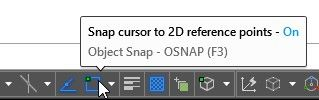

 39:对象捕捉切换按钮

图 40:捕捉到一条线的端点

要查看或设置运行对象捕捉，请单击按钮右侧的小三角形以显示当前选择。要打开或关闭对象捕捉模式，请单击所需的模式。活动模式的左侧会显示一个复选标记，如图 41 所示。

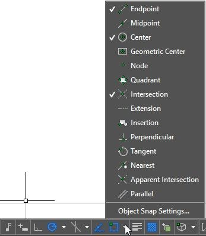

 41:运行对象捕捉

要临时覆盖正在运行的对象捕捉模式，按住`Shift`键和`right-click`鼠标按钮，显示对象捕捉覆盖菜单(见图 42)，并选择您选择的临时对象捕捉模式。临时对象捕捉仅对当前指向选择有效。

 42:覆盖运行对象捕捉

命令:线路

别名:L

线条是最基本、最常见的 AutoCAD 对象。直线是连接两个给定点(起点和终点)的直线段。)要画线，点击`Line`工具。要开始一行，请单击主页选项卡中的`Line`工具，或在命令窗口中键入`LINE`(或只键入`L`，然后按下`Enter`或`Spacebar`。

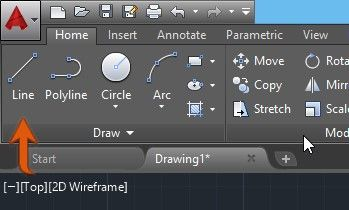

图 43:主页选项卡中的命令行

运行`LINE`命令时，可以创建一系列相连的线段。每个片段都是一个独立的对象，可以在不影响其他片段的情况下进行修改或删除。

是时候生产一些东西了。让我们创建以下绘图:

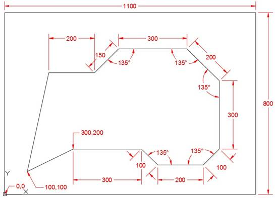

 44:线段

以下步骤指导您创建外部矩形。您可以从命令窗口或功能区工具运行`LINE`命令。

命令:L `8`

指定第一点:0，0 `8`

指定下一点或[撤销]: @1100，0 `8`

指定下一点或[撤销]: @0，800 `8`

指定下一点或[关闭/撤销]: @-1100，0 `8`

指定下一点或【关闭/撤销】:C `8`

开始创建图形时，它可能会超出当前屏幕边界。双击鼠标中键缩放至绘图扩展，或键入`Z`并按下`Enter`，然后键入`E`并按下`Enter`。

在前面的步骤中，我们通过输入绝对坐标(0，0)在 UCS 的原点开始第一条线段，然后是三个相对坐标，最后通过键入`C`关闭矩形。

|  | 提示:如果创建的线段坐标不正确，只需按下 U 键，然后按回车键即可撤消线段，而不会中断命令。您可以随意撤消任意多的线段，但重做线段的唯一方法是重新输入点坐标。 |

要创建图形的其余线条，请执行以下命令序列:

命令:L `8`

指定第一点:100，100 `8`

指定下一点或【撤销】:300，200 `8`

指定下一点或[撤销]: @300，0 `8`

指定下一点或[关闭/撤销]: @1008

指定下一点或[关闭/撤销]: @200<0 `8`

指定下一点或[关闭/撤销]: @100<45 `8`

指定下一点或[关闭/撤销]: @300<90 `8`

指定下一点或[关闭/撤销]: @200<135 `8`

指定下一点或[关闭/撤销]: @300<180 `8`

指定下一点或[关闭/撤销]: @150<225 `8`

指定下一点或[关闭/撤销]: @200<180 `8`

指定下一点或【关闭/撤销】:C `8`

请注意，我混合使用了绝对、相对和相对极坐标。选择哪种坐标输入法没有限制。例如，输入`@-300,0`将创建与`@300<180`相同的线段。

因为默认情况下，角度是从`X`轴的正方向逆时针测量的，所以我必须计算一个更简单的角度测量来输入。例如，在第三条线段中，如果您输入 135°作为角度测量值，将导致从上一点向右上方有一条线段。由于需要向下向右走，我们进入`-45 (90-135)`进行角度测量。

将您的绘图保存为`Lines01.dwg`。

|  | 注意:默认情况下，AutoCAD 2016 保存为 AutoCAD 2013 文件格式，这意味着您可以在自 AutoCAD 2013 以来的任何 AutoCAD 版本上打开在 AutoCAD 2016 上编辑的文件。如果需要在旧版本的 AutoCAD 上打开图形，请从“文件类型”下拉列表中选择版本。 |

|  | 提示:要快速保存绘图，可以使用快捷键 Ctrl+S 组合。要用不同的名称保存图形，请使用 Ctrl+Shift+S 显示“将图形另存为”对话框。 |

开始新的空白绘图。我们将使用极坐标追踪和距离输入创建以下图形:

图 45:线路 02.dwg

确保“对象捕捉”、“对象捕捉跟踪”和“极坐标跟踪”处于打开状态，并且极坐标跟踪设置为 15°增量，如第 2 章所述。

您的状态栏应该类似于下图，其中蓝色图标表示相应的助手已打开:

|  | 提示:按 F3 切换对象捕捉，按 F10 切换极坐标追踪，按 F11 切换对象捕捉追踪。 |

通过在命令窗口中键入或单击功能区工具启动命令行。

命令:L `8`

指定第一点:单击绘图区域中的任意位置

对于下一个点，我们将定位鼠标，使其模拟矢量的方向，如图 46 `. Enter only the segment length in the command prompt and press` `Enter`所示。

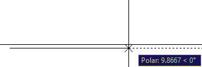

46:0 时的极坐标追踪

指定下一点或[撤销]: 10 `8`

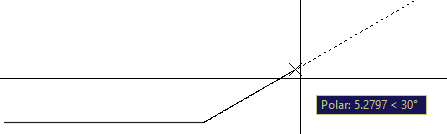

图 47:30°时的极坐标追踪

指定下一点或[撤销]: 15 `8`

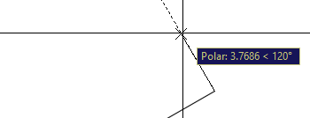

图 48:120°极坐标追踪

指定下一点或【关闭/撤销】:5 `8`

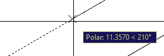

图 49:210 的极坐标追踪

指定下一点或【关闭/撤销】:15 `8`

接下来，我们将使用极坐标追踪和对象捕捉追踪的组合。首先将鼠标悬停在如图 50 `. This will activate object snap on the point. When you move the mouse up approximately at 90º, the object snap tracking line is displayed. Continue moving the cursor up until the intersection with the Polar Tracking appears, as shown on` 图 51 `, and then left-click to select the point.`所示创建的第一个线段的左端点上

 50:激活点的对象捕捉跟踪

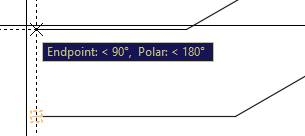

 51:对象捕捉跟踪和极坐标捕捉跟踪相交

指定下一点或[关闭/撤消]:在对象捕捉跟踪线和极坐标跟踪线的交点处按鼠标左键。

指定下一点或【关闭/撤销】:C `8`

将您的绘图保存为`Line02.dwg`。

#### 命令行提示

*   `Specify first point`:选择线段的第一点。按下`Enter`将从先前创建的对象的最后一点继续。如果前一个对象是一条弧，按下`Enter`将从弧的最后一点延续直线并与该弧相切。

图 52:从先前创建的弧延续一条线

*   `Specify next point`:选择线段的端点(以及下一段的起点，直到命令完成)。
*   `Undo`:撤销序列的最后一个线段。
*   `Close`:创建一条线段，从序列中最后一条线段的端点开始，到第一条线段的第一个点结束，完成命令。要使用“关闭”命令，系列中至少需要有两条线段。

|  | 提示:您可以单击命令窗口中的选项，或者键入相应的大写蓝色字母。 |

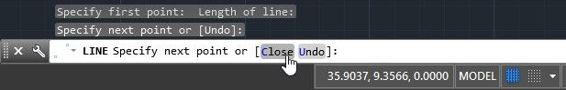

图 53:从命令窗口中选择命令选项

命令:CIRCLE

别名:C 或 CI

使用`Circle`命令在 AutoCAD 中创建一个圆对象。创建圆的默认方法是选择圆心并输入半径值。如果在“主页”面板上的“绘制”选项卡中单击“圆”工具下方的小三角形，则可以使用其他方法创建圆。

要开始创建圆，请单击“绘图”选项卡中的`Circle`工具，或输入`CIRCLE`(或简称为`C`)并按下`Enter`或`Spacebar`。

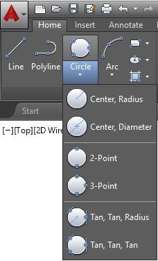

图 54:主页选项卡中的圆形命令

图 55；圆形命令提示符选项

请注意，命令窗口显示了创建圆的选项。要选择一个选项，单击该选项或键入别名，显示为蓝色，然后按`Enter`或`Spacebar`。您也可以右键单击并从弹出的上下文菜单中选择选项。这种做法类似于所有 AutoCAD 命令。

您可以使用以下任一选项创建圆:

`Center, Radius`:在命令窗口和功能区键入命令时，这是创建圆的默认选项，直到选择另一个选项。要创建圆，请运行命令，并通过输入坐标值或在屏幕上选择它们来选择一个点。通过在命令窗口中键入半径长度或选择一个点来输入半径长度。选择一个点时，半径的起点是最后选择的点，即圆心。

中心，直径 `(D)`:与中心，半径相同，但是您将改为输入直径长度。从命令窗口运行命令时，可以输入`D`并在输入长度前按下`Enter`或`Spacebar`。这将指示 AutoCAD 下一个长度是圆直径。

点 `(2P)`:通过选择两点来创建圆。两点之间的距离就是圆的直径。

图 56:两点圆

`Points (3P)`。这将创建一个圆周穿过三个选定点的圆。

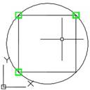

图 57: 3 点圆

`Tan, Tan, Radius (TTR)`。这通过选择两个切点和圆半径来创建圆。有时，选择可能会产生不止一种创建圆的可能性。发生这种情况时，AutoCAD 会创建一个圆，其中的切点最接近您拾取的点。

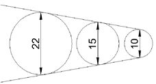

图 58:半径不同的两条直线的圆切线

`Tan, Tan, Tan`。这将创建一个与三个选定点相切的圆。此选项不能作为命令窗口选项使用，但实际上，这是与切线对象捕捉结合使用的 3P 选项，您将在本书的后面部分了解到。

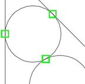

图 59:有三个切点的圆

命令:ARC

别名:A

默认情况下，圆弧是逆时针创建的。使用第 1 章中讨论的`Unit`命令改变角度方向也会影响构建圆弧的方向。

要创建弧，单击功能区主页选项卡中的`Arc` 工具(图 62)或在命令窗口中输入`A`(T2 命令的别名)，然后按`Enter`或`Spacebar`键。当从命令窗口运行`Arc`时，提示改变以匹配下一点选择可能性。

图 60:命令窗口中的弧线命令

`3 Point`。创建圆弧的默认方法是在绘图区域中选择三个点。圆弧是通过三个选定点创建的。

图 61:用三个点创建的弧

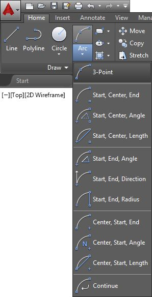

 62:弧形工具

|  | 注意:功能区工具中的所有构造方法都可以通过命令窗口以及运行时选择的组合来获得。使用命令窗口将使您在大多数 AutoCAD 命令上更有效率。 |

|  | 提示:某些圆弧创建方法允许用户在选择最后一个点时按住 Ctrl 键来更改圆弧的方向。 |

`Start, Center, End`。在此方法中，选定的第一个点是弧的起点，选定的第二个点是中心点，第三个(也是最后一个)点是弧的终点。

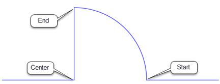

 63:起点、中心、终点弧

`Start, Center, Angle`:在这种构造方法中，首先选择圆弧的起点，然后选择定义圆弧半径的圆弧的中心点。最后一个提示指定圆弧的夹角。您可以输入角度测量值或选择一个点来定义角度。

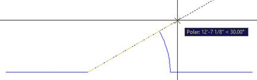

`Start, Center, Length`:通过选择弦的起点、中心和长度来创建弧。

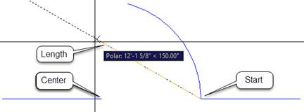

`Start, End, Direction`:通过选择圆弧的起点、终点和切线方向来创建圆弧。

`Start, End, Radius`:通过选择第一点、终点和半径来创建圆弧。

`Contiguous Tangent Arcs and Lines`:可以从之前创建的圆弧或直线继续圆弧。弧的起点将是先前创建的对象的最后一点。

图 64:从先前创建的线继续创建弧

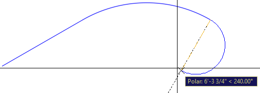

图 65:从先前创建的弧继续弧

好吧，让我们做点什么。我们要画一个柱基，如下图所示:

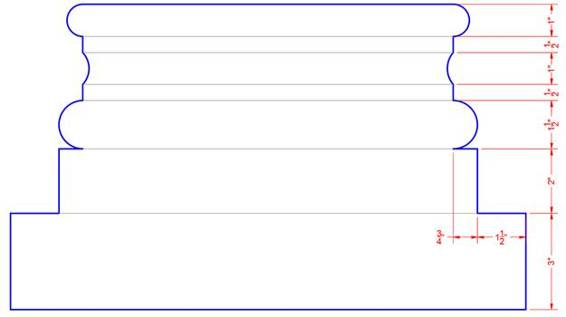

确保“对象捕捉”、“对象捕捉跟踪”和“极坐标跟踪”处于打开状态，并且极坐标跟踪设置为 15°增量，如第 2 章所述。

将`Drawing Units`改为`Architectural`(见第一章图纸单位)。

用颜色`5`(蓝色)创建一个名为`ColumnBase`的图层，并使其成为当前图层。有关创建图层的回顾，请参见第 2 章中的“创建图层”。

命令:L `8`

指定第一点:0，0 `8`

向上移动鼠标，以便跟踪提示将角度显示为 90 度。

指定下一点或[撤销]: 3 `8`

向左移动鼠标，以便跟踪提示显示角度为 180°。

指定下一点或[撤销]: 1.5 `8`

向上移动鼠标，以便跟踪提示将角度显示为 90 度。

指定下一点或【关闭/撤销】:2 `8`

向左移动鼠标，以便跟踪提示显示角度为 180°。

指定下一点或[关闭/撤销]: .75 `8`

指定下一点或[关闭/撤销]: `8`

命令:A `8`

指定弧的起点或[中心]:单击创建的最后一条线的终点旁边，确保 OSNAP 提示显示为端点，如下图所示。

 

指定第二个弧点或【中心/终点】:C `8`

指定圆弧中心点:@ 0 . . 75`8`

指定弧的终点(按住 Ctrl 键切换方向)或[角度/弦长]: `8`

命令:L `8`

指定第一点:在先前创建的圆弧的终点附近单击

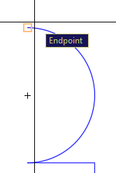

向上移动鼠标，以便跟踪提示将角度显示为 90 度。

指定下一点或[撤消]: .5

指定下一点或[撤销]: `8`

命令:A

指定弧的起点或[中心]: @0，1

指定第二个弧点或[中心/终点]: E

指定弧的终点:在先前创建的线的终点附近单击

指定圆弧中心点(按住 Ctrl 键切换方向)或【角度/方向/半径】:R `8`

指定圆弧半径(按住 Ctrl 键切换方向):. 75 `8`

命令:L `8`

指定第一点:

指定下一点或[撤销]: .5 `8`

指定下一个点或[撤消]:

命令:A `8`

指定弧的起点或[中心]:

指定第二个弧点或【中心/终点】:E `8`

指定弧的终点:@0，1 `8`

指定弧的中心点(按住 Ctrl 键切换方向)或[角度/方向/半径]: D `8`

指定圆弧起点的切线方向(按住 Ctrl 键切换方向):

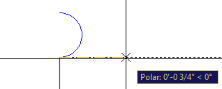

命令:L `8`

指定第一点:0，0 `8`

向左移动鼠标，以便跟踪提示显示角度为 180°。

指定下一点或[撤销]: 1'4" `8`

指定下一点或[撤销]: `8`

现在让我们镜像复制轮廓来创建柱基的左侧。在下一章中，您将了解有关镜像命令的更多信息。

命令:MI `8`

选择对象:单击要选择的图形左侧和上方的点，然后单击圆弧右侧和下方的点，如下图所示:

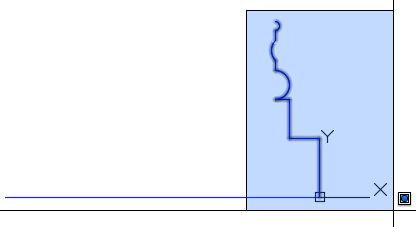

选择对象:`8`

指定镜像线的第一点:中间`8`(或者按住 shift 键并右键单击以显示“覆盖运行对象捕捉”菜单并选择“中点”)

在宽水平线中点附近单击

指定镜像线的第二个点:选择上方或下方的一个点，确保极坐标追踪在 90 O

擦除源对象？【是/否】<no>:否`8`</no>

缩放至绘图扩展。运行命令后，您的图形将填充您的绘图区域。

命令:Z `8`

指定窗口角，输入比例因子(nX 或 nXP)，或[全部/中心/动态/范围/上一个/比例/窗口/对象] <real time="">: E `8`</real>

现在，我们将缩小一点(10%)，使绘图更易读:

命令:Z `8`

指定窗口角，输入比例因子(nX 或 nXP)，或[全部/中心/动态/范围/上一个/比例/窗口/对象] <real time="">: .9x `8`</real>

用颜色`8`创建一个名为`ColumnBase-vis`的图层，并使其成为当前图层。

创建连接柱基各层端点的线。

将您的绘图保存为`ColumnBase.dwg`。

图 66:折线工具

多段线是由多条线段或圆弧组成的单个对象。创建仅由直线段组成的多段线类似于创建标准直线。

命令:PL 或 PLINE

多段线显示以下提示:

指定起点:设置多段线起点。一个小的刻度标记折线的第一个点，直到命令完成(见图 67)。在空提示下按下`Enter`将从创建直线、圆弧或其他多段线时选择的最后一点开始创建新的多段线。

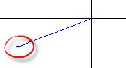

 67:折线第一点刻度线

#### 线性线段提示

指定下一个点或[弧线/闭合/半宽/长度/撤消/宽度]:

*   `Arc:` 开始创建与前一段相切的曲线折线。
*   `Length`:创建一个指定距离的连续直线段。如果前一条线段是圆弧，则新线段与该圆弧相切。

#### 拱形线段提示

|  | 注意:拱形多段线线段的构建方法类似于一般的圆弧构建方法。 |

指定弧的端点(按住 Ctrl 键切换方向)或

[角度/中心/关闭/方向/半宽/线/半径/秒点/撤销/宽度]:

*   `Endpoint of arc` `: Completes an arc segment. The arc segment is tangent to the previous segment of the polyline.`
*   `Angle`:指定圆弧从起点开始的夹角。
*   `Direction:` `Specifies the tangent for the arc segment.`
*   `Line`:将折线构建模式设置回直线段。
*   `Radius`:指定圆弧段的半径。
*   `Second pt` `: Specifies the second point and endpoint of a three-point arc.`

#### 常见提示选项

*   `Close`:连接第一段和最后一段，创建闭合多段线。请注意，直线段的别名是`C`，而拱形段的别名是`CL` ，以避免与中心(`CE`)冲突。
*   `Halfwidth`:指定从宽线段的中心到边缘的宽度。该值将保持不变，直到再次更改，并且对于当前图形的新多段线也将保持不变。
*   `Width`:指定下一段的全宽。该值将保持不变，直到再次更改，并且对于当前图形的新多段线也将保持不变。
*   `Undo`:删除最后添加的线段。

|  | 注意:定义了宽度的多段线会被定义为地块，并且会受到地块比例以及比例命令所做修改的影响。若要重置，请将宽度设置为 0。 |

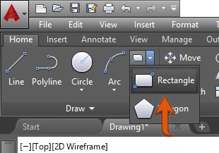

图 68:功能区中的矩形工具

命令:REQUANT

别名:REC 或 RECTANG

根据命令窗口提示中传递的参数创建一个矩形:

指定第一个角点或[倒角/高程/圆角/厚度/宽度]:

指定其他角点或[面积/尺寸/旋转]:

通过在绘图区域中选择两个点(第一个角和其他角)，可以快速创建矩形。)

例如，图 44 中创建的矩形 `could be created as follows:`

命令:REC `8`

指定第一个角点或【倒角/标高/圆角/厚度/宽度】:0，0 `8`

指定其他角点或【面积/尺寸/旋转】:@1100，800 `8`

|  | 注意:对于“其他角点”输入，由于第一个点在 UCS 原点，在这种情况下相对坐标和绝对坐标是相同的，所以您可以简单地输入 1100，800。 |

或者简单地输入矩形尺寸，如下所示:

命令:REC `8`

指定第一个角点或【倒角/标高/圆角/厚度/宽度】:0，0 `8`

指定其他角点或[面积/尺寸/旋转]: D `8`

指定矩形的长度<10.0000> : 1100 `8`

指定矩形的宽度<10.0000> : 800 `8`

指定其他角点或[面积/尺寸/旋转]:选择第一个点右上角的点

`Rectangle options:`

*   `Chamfer`:允许用户为确定倒角长度的矩形指定倒角。新矩形的倒角长度保持不变，直到改变。
*   `Elevation`:指定矩形的 Z 级别。新矩形将在定义的 Z 级别创建，直到被更改。
*   `Fillet`:设置半径创建圆角矩形。
*   `Thickness`:定义新矩形的线段厚度(高度)。
*   `Width`:指定新矩形的线宽。

图 69:矩形方法

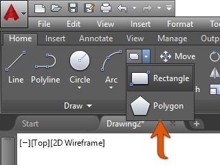

图 70:功能区中的多边形工具

命令:多边形

别名:英寸

`Polygon`方法创建一条定义了相等边数的闭合折线。最小边数为 3，最大边数为 1，024。下图显示了创建多边形的两种方法。

为了理解多边形的构造，让我们首先创建两个圆，如下步骤所示:

命令:C `8`

指定圆的中心点或[3P/2P/Ttr(棕褐色半径)]: 3，3 `8`

指定圆的半径或[直径]: 2.5 `8`

命令:C `8`

指定圆的中心点或[3P/2P/Ttr(棕褐色半径)]: 10，3 `8`

指定圆的半径或【直径】<2.5000> : 2.5 `8`

现在让我们根据屏幕调整绘图:

命令:Z `8`

指定窗口角，输入比例因子(nX 或 nXP)，或[全部/中心/动态/范围/上一个/比例/窗口/对象] <real time="">: E `8`</real>

命令:Z

`Specify corner of window, enter a scale factor (nX or nXP), or [All/Center/Dynamic/Extents/Previous/Scale/Window/Object] <real time>: .7X` `8`

现在让我们创建两个六边形(6 边多边形)。第一个将围绕左边的圆，第二个在右边的圆内接。

按照以下步骤创建第一个六边形:

命令:POL `8`

多边形输入边数<4> : 6 `8`

指定多边形或[边]的中心:CEN `8`

将光标放在左边圆的周边。一个 OSNAP 提示写着“中心”，一个小的琥珀色圆圈出现在圆圈的中心。左键单击选择圆的中心点。

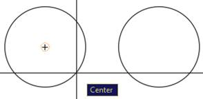

输入选项【内接圆/外接圆】 *: C `8`*

指定圆半径:2.5 `8`

现在是第二个六边形:

命令:POL `8`

多边形输入边数<6> : 6 `8`

指定多边形或[边]的中心:CEN `8`

将光标放在右边圆圈的周边。一个 OSNAP 提示写着“中心”，一个小的琥珀色圆圈出现在圆圈的中心。左键单击选择圆的中心点。

输入选项【内接圆/外接圆】 <c>: I `8`</c>

指定圆半径:2.5 `8`

如果需要，使用`Zoom`命令，使绘图适合屏幕。

将您的绘图保存为`Polygons.dwg`。

其他创建方法:

`Edge`:通过指定第一条边的端点来创建多边形。

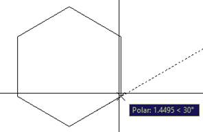

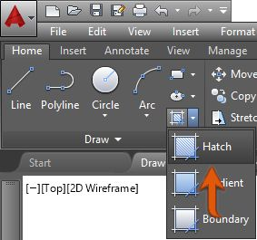

图 71:功能区中的填充工具

命令:HATCH

别名:H

阴影命令允许用户使用预定义和自定义图案以及实体和渐变填充来填充封闭区域。

图 72:填充阴影的区域

运行“图案填充”命令或选择图案填充对象时，会加载并激活“图案填充”上下文选项卡，显示图案填充选项。

图 73:剖面线上下文选项卡

“图案填充”上下文选项卡包括以下面板和工具:

*   `Boundaries panel`: Includes tools for addition and removal of areas to be hatched

    

*   `Pick Points`:允许用户通过点击封闭区域内部来选择边界
*   `Select`:允许用户选择要阴影化的对象
*   `Remove`:从选择集中移除边界区域
*   `Recreate`:仅在编辑图案填充时可用；创建图案填充边界的闭合多段线
*   `Pattern Panel`:AutoCAD 中可用填充图案列表
*   `Properties Panel`: Allows the user to set and modify properties for the hatch

    

*   `Hatch Type`:允许用户选择要应用的填充类型。您可以从样式(默认)、实体、渐变和用户定义中进行选择。
*   `Color`:设置阴影颜色。如果“图案填充类型”设定为“渐变”，这将成为渐变填充开始颜色(颜色 1)。
*   `Background Color`:设置阴影背景的颜色。如果“图案填充类型”设定为“渐变”，这将成为渐变填充结束颜色(颜色 2)。
*   `Hatch Transparency`:将填充透明度级别的阴影设置为 0 到 90%，其中 0 是完全不透明的阴影。
*   `Angle`:改变填充图案角度。该角度相对于当前统一通信系统的 X 轴。
*   `Scale`:允许增加或减少图案可见性比例。仅当“图案填充类型”设置为“图案”时，此选项才可用。
*   `Layer Name`:允许用户设置为其指定图案填充的图案填充层。
*   `Relative to Paper Space`:相对于纸张空间单位缩放图案，使具有一致的缩放显示(仅在处理布局时可用)。
*   `Double`:用于用户自定义填充类型；创建另一组垂直于原始直线的直线。
*   `Origin Panel`:控制基点生成图案。这在创建图案(如瓷砖)时非常有用，在这种情况下，您需要控制图案的起点。
*   `Options panel`:包括一套管理图案填充模式的工具。

让我们通过创建向场地平面图添加图案填充来了解“图案填充”命令是如何工作的。

如果你还没有这样做，请从图纸位置下载这本书的图纸。

打开位于`Chapter03`文件夹中的 SitePlan.dwg 文件。

让我们从给建筑足迹添加阴影开始。使用您喜欢的缩放工具缩放到更靠近建筑区域的位置。建筑足迹是深蓝色多段线，如上图所示。继续执行以下步骤:

通过从“常用”选项卡“图层”面板的“图层”列表中选择图层来激活图层`L-Deck Pavers`。

|  | 注意:在选择图层之前，请确保没有选择任何对象。选择一个图层，同时选择一个或多个对象，将选定的对象分配给该图层。在拾取图层之前，按下退出(Esc)键取消任何选择。 |

图 74:激活图层

移动 UCS 并将其放置在建筑物的左上角。

1.  点击绘图区域左下角的`UCS`图标。显示一个描绘原点的蓝色框和每个轴末端的两个蓝色圆圈。
2.  单击蓝色框并将其拖动到建筑物的左上角。确保您看到描绘线条端点的琥珀色矩形，然后再次单击鼠标。
3.  单击描绘 X 轴的蓝色圆圈来旋转 UCS，然后选择原点所在的同一条线以南的点。UCS 图标应该会显示出来，如下图所示。按下`Escape`键取消选择。请注意，您的光标已更改以匹配 UCS 方向。您现在创建的任何内容都将引用此统一通信系统。

通过点击填充工具或输入`H`运行填充命令，并在命令窗口中按下`Enter`。

命令:H `8`

功能区中将显示“图案填充(图案填充创建)”上下文选项卡。在`Boundaries`面板中，点击`Select`工具。

选择对象或[picK 内部点/撤销/设置]:_S

单击建筑轮廓线边界将其添加到选择集中。

选择对象或[picK 内部点/撤销/设置]:找到 1 个

图案填充在选定边界上显示为实心灰色填充。确保在“图案”面板中选择了 ANSI31，然后在“属性”面板中，将比例设置为`96`并按下`Enter`。

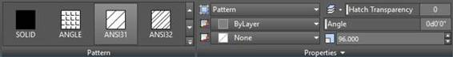

选择对象或[picK 内部点/撤销/设置]:按退出(Esc)键完成命令。

再次将 UCS 移动到甲板区域，如下图所示:

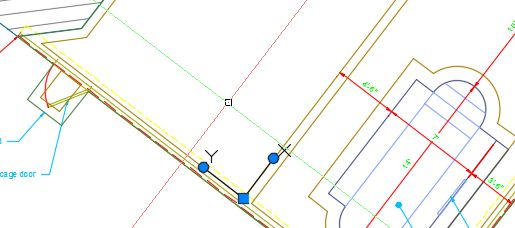

从主页选项卡，图层面板，点击`Turn Layer Off`工具(见下图。)

命令:裁员

当前设置:视口=冻结，块嵌套级别=块

选择图层上要关闭的对象或[设置/撤消]:单击文本对象。

图层“左文本”已关闭。

选择图层上要关闭的对象或[设置/撤消]:单击尺寸对象。

图层“L-Dims”已关闭。

选择图层上要关闭的对象或[设置/撤消]:单击代表屏蔽外壳的门或多线对象。

图层“左屏幕笼”已关闭。

选择图层上要关闭的对象或[设置/撤消]:单击池区域内的任何浅蓝色线条

图层“左池杂项”已关闭。

选择图层上要关闭的对象或[设置/撤消]:按 Esc 键

|  | 提示:关闭图层有助于选择正确的边界，并提高选择性能。 |

再次运行“填充”命令。

命令:H `8`

从“边界”面板中，单击`Pick Points`工具。

拾取内部点或[选择对象/撤消/设置]:单击所有四个摊铺机指定区域(拉奈、水池平台和门垫)的内部，如下图所示:

|  | 提示:如果您选择了错误的边界，您可以通过单击快速访问工具栏中的撤消工具来撤消选择，或者输入 U，然后在命令窗口中按回车键。 |

在`Pattern Panel`中，滚动找到并选择`AR-HBONE`图案。

在`Properties Panel`中，在`Hatch Pattern scale` `box and press` `Enter`中输入`1`。

按下`Esc`键结束命令。

在视图立方体帮助器中，单击视图立方体下方的下拉菜单，并选择`8`将统一通信系统恢复到其原始状态。

在`Home`选项卡的`Layers` 面板中，点击`Turn All Layers On`工具，如图 75 `, to show all layers that you hid on previous commands (you will learn more about layer management in Chapter 4).`所示

 75:打开所有图层

将您的绘图保存为`MySitePlan.dwg`。

如果需要在阴影区域进行修改，请通过单击来选择阴影。填充线编辑器上下文选项卡在功能区中激活，因此您可以进行所需的更改。

|  | 注意:编辑在另一个统一通信系统上创建的图案填充将重置图案填充以匹配当前统一通信系统。在编辑图案填充之前，请确保正确设置了 UCS。 |

图 76:功能区中的点工具

命令:点

别名:采购订单

点是作为辅助对象的对象，您可以使用“OSNAP 节点”选项捕捉它们。命令`Divide`和`Measure`(本节稍后解释)沿选定对象创建点。

点可能会变得很难在屏幕上看到。要更改点的显示方式，请单击主页选项卡(图 77)的`Utilities`面板中的`Point Style`工具，或输入`PTYPE`，然后在命令窗口中按`Enter`显示“点样式”对话框，并选择您希望点的显示方式。

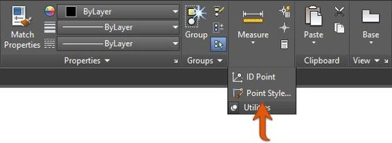

 77:功能区中的点样式工具

|  | 注:点如屏幕所示绘制；确保将外观更改为所需的样式，以避免对绘图进行不必要的重复。另一个选项是在非绘图层上创建点，例如定义点层(在标注尺寸时自动创建)或自定义的非绘图层(您将在第 4 章中了解有关层的更多信息)。 |

图 78:功能区中的构造线工具

命令:XLINE

别名:XL

`XLINE`是一个无限长的线性物体；它没有起点和终点。`XLINES`在缩放扩展操作中被忽略。

`XLINE`提示如下:

指定一个点或[水平/垂直/垂直/等分/偏移]:

`Point`:指定 XLINE 经过的点。

`Hor or H`:创建平行于当前 UCS X 轴(垂直于 Y 轴)的 XLINE。

`Ver or V`:创建一条垂直于当前 UCS X 轴(平行于 Y 轴)的 XLINE。

`Ang`:允许用户指定从 X 轴逆时针测量的 XLINE 角度(默认)。

`Bisect`:创建一条 XLINE，该 XLINE 平分由三个点选择的角度:假想弧的顶点、起点和终点。

`Offset`:以给定的距离或通过选定的点，创建平行于现有线性对象的 XLINE。

图 79:功能区中的光线工具

命令:RAY

光线类似于 XLINES，区别在于光线只在一个方向上无限传播。如果在一个点修剪一条 XLINE，它将变成一条光线。

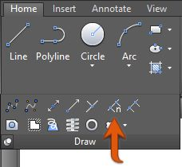

图 80:功能区中的分割工具

命令:DIVIDE

别名:DIV

将几何对象(直线、多段线、圆弧、圆、椭圆或样条曲线)分成给定数量的等长线段。默认情况下，线段分割用点对象标记。

`Divide`命令提示如下:

选择要分割的对象:

输入段数或[块]:

如果在前面的提示中选择“阻止”，将显示以下提示:

输入要插入的块的名称:

将块与对象对齐？【是/否】<y>:</y>

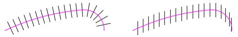

图 81:块与对象对齐(左)和不对齐(右)

你将在第五章学习积木。

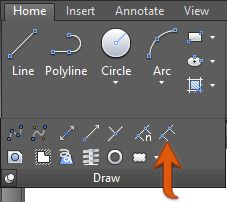

图 82:功能区中的测量工具

命令:MEASURE

别名:我

将几何对象(直线、多段线、圆弧、圆、椭圆或样条曲线)划分为给定长度的多个线段。默认情况下，线段分割用`Point`对象标记。

`Measure`和`Divide`命令的工作方式相同。唯一不同的是，在`Divide`命令中，用户输入所需的线段数，并计算线段长度。在`Measure`命令中，用户输入所需的线段长度，并计算分割数。

命令:重绘

别名:R

在活动视口中执行快速显示刷新，并删除临时图形助手。

命令:REGEN

别名:RE

随着图形变大，缩放和平移到图形的许多不同区域，最终，当您缩放到一个弯曲的对象附近时，它可能看起来有多面，图案填充可能看起来破碎。更改注释性比例设置时，还需要重新生成图形。

这是因为 AutoCAD 会重新调整图形以提高显示性能，但不会自动重新调整。为此，运行`Regen`命令，在活动视口中重新生成整个图形，如下所示:

*   重新计算所有对象的位置和可见性
*   重新索引图形数据库，以优化显示和对象选择性能
*   重置可用于平移和缩放的整体区域

命令:REGENALL

别名:面积

执行所有`Regen`过程，但针对空间或布局中的所有视口。