无论何时需要修改图形，都需要选择要修改的对象。AutoCAD 包括许多帮助选择对象的方法。您可以选择不在冻结或锁定层中的任何对象。

您可以在运行命令之前或之后选择对象。如果在未选择对象的情况下运行命令，AutoCAD 会在命令窗口中显示以下提示:

选择对象:

您可以通过简单地单击对象或使用窗口、窗口交叉或套索来选择对象，而无需其他提示。

选择由从左到右选择的两个点定义的矩形区域内的所有对象。

要开始选择，请在要选择的一个或多个对象左侧(上方或下方)的绘图区域中单击(不要按住鼠标按钮)，然后向右移动鼠标，在一个或多个对象周围创建一个矩形区域。选择窗口用蓝色实心边框填充。

图 83:窗口选择

选择由从右向左选择的两个点定义的矩形区域内部或交叉的所有对象。

选择窗口用绿色虚线边框填充。

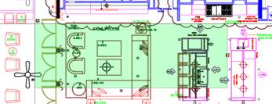

图 84:交叉选择

### 套索

您可以通过按住鼠标左键并围绕您想要选择的对象进行绘制来套索选择对象。与“窗口”和“窗口交叉”选择类似，开始从左向右拖动鼠标，以选择完全位于套索边界内的所有对象。从右向左(穿过套索)将选择套索内的所有对象以及被套索边界穿过的对象。

图 85:套索选择

|  | 提示:您可以从选项对话框的选择选项卡中停用套索选择模式。取消选中“允许按下并拖动套索”复选框。 |

`All`:选择图形中的所有对象，包括其他空间上的对象(冻结或锁定图层上的对象除外)。)

选择对象:全部`8`

发现 6110 个(204 个重复)，总数 5217 个

893 个不在当前空间。

最后或 L `: Select the last created object in the active drawing space, assuming the object’s layer is neither frozen nor locked.`

选择对象:左

找到 1 个

`Crossing`:与窗口交叉相同，但允许任意方向的交叉选择。

`WPolygon or WP (Window Polygon)`:选择完全在由点定义的多边形边界内的所有元素。

选择对象:WP

图 86: WPoligon 选择

`CPolygon or CP (Crossing Polygon)`:选择由点定义的多边形边界内部和交叉的所有对象。

选择对象:CP

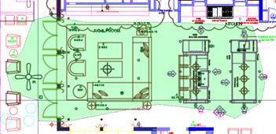

图 87:多边形选择

`Fence of F:`类似于`CPolygon`，只是只选择了边界所穿越的对象。

选择对象:F

图 88:围栏选择

选择相似允许用户选择与先前选择的相似的所有对象。例如，如果要在图形中选择一组匹配的块，选择相似非常有用。

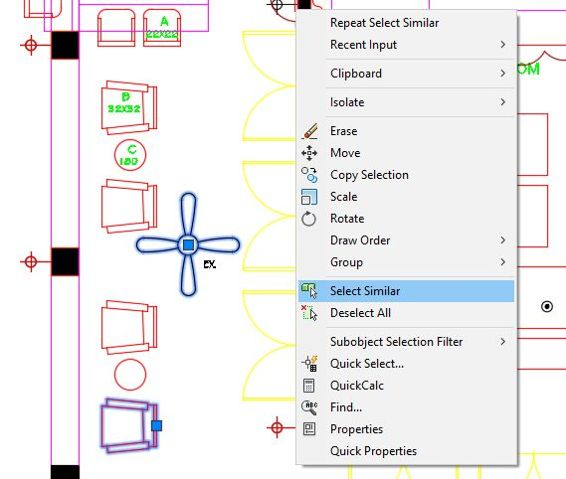

图 89:选择相似

要选择相似的对象，首先选择一个或多个对象作为参考，然后右击鼠标显示上下文菜单，点击`Select Similar`，如图 89 所示。

您已经熟悉了第 2 章中的图层和图层属性管理器。现在是时候回顾一下在 AutoCAD 中使用图层的威力了。大多数可用的图形设计软件都有一种分层组织图形的方法。

您可以使用图层来控制图形或输出中对象的可见性，以及设置颜色、线型、线宽和透明度等属性。创建对象时，它会继承与创建对象的图层相关联的属性，尽管您可以根据需要覆盖对象属性。当您看到一个对象属性显示为`BYLAYER`时，这意味着该属性是从对象的层继承的。

要打开`Layer Property Manager`窗口:

从“常用”选项卡的“图层”面板中，单击`Layer Properties`工具。

命令:LAYER

别名:LA

“图层特性管理器”窗口中的图层列表显示了图形中的图层列表和特性。您可以通过单击列标题对列表进行排序。

图 90:层列表

|  | 提示:按住 Shift 键选择一组连续的层，或者按住 Ctrl 键选择交替的层。 |

图层列表包含以下列:

*   `Status`:显示描述图层状态的图标。带有绿色复选标记的图层是当前图层。要将另一个图层设置为当前图层，请双击图层状态或图层名称。
*   `Name`:显示图层名称。要重命名图层，请选择该图层并按 F2 键。
*   `On`:打开或关闭选定的层。关闭图层以使该图层在打印时在显示中不可见。“关闭”层中的对象参与再生过程和一些选择方法。
*   `Freeze:`冻结图层不可见，不打印，在选择对象和重新生成图形时被忽略。这提高了复杂图形的性能和再生时间。
*   `Lock`:锁定图层中的对象不能修改，虽然可以在图层中添加新对象。
*   `Color`:定义图层的颜色。
*   `Linetype`:定义图层的线型。
*   `Lineweight`:设置图层线宽。
*   `Transparency`:将图层的透明度级别设置为 0 到 90，其中 0 表示完全不透明。
*   `Plot Style`:允许为图层选择打印样式。如果绘图打印样式策略是颜色相关打印样式，则禁用此选项。
*   `Plot:` 设置出图时对象的可见性。当设置为无绘图时，对象显示在屏幕上，但不显示在绘图中。
*   `New VP Freeze`:定义图层在布局选项卡上新创建的视口中是否可见。
*   `Description`:可以输入图层的友好描述。此字段是可选的，您可以按 F2 键进行编辑。

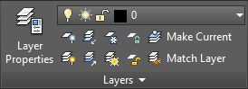

图 91:层面板

默认情况下，“图层”面板位于“常用”选项卡中，由以下工具组成:

 `Layer Properties`:打开图层属性管理器，可以在其中添加新图层，编辑现有图层的属性，管理图层过滤器和状态，或者移除空图层。

`Layers List`:显示当前(活动)图层。所有新对象都被分配到该层。您也可以从此列表中激活另一个图层，或者更改对象选择的图层属性。您也可以从此列表中更改图层状态。

图 92:层列表下拉列表

|  | 注意:如果想要激活另一个图层，请确保没有选择任何对象。在选择一个或多个对象的情况下更改列表中的图层会将对象分配给所选图层。 |

 `Off`:通过选择对象关闭图层。使用此命令可以清除视图并便于阅读图形或地块。

 `Isolate Layers`:该命令关闭除了选定对象以外的所有图层。当只愿意处理某些对象时非常有用。例如，您可能只想处理墙壁、窗户和门，并隐藏所有尺寸、天花板平面图、注释等。您可以使用`Layer Un-isolate`命令恢复图层状态。

 `Freeze`:通过选择对象冻结图层。

 `Lock`:通过选择对象锁定图层。当您需要查看和捕捉图层中的对象而不冒意外修改或删除这些对象的风险时，这非常有用。

` Make Current`:使选中的对象成为当前(活动)层。

` Layer On`:打开图形中的所有图层。

 `Un-Isolate Layers`:恢复上一条`Layer Isolate`命令之前的图层状态。

` Thaw All Layers`:解冻(解冻)图形中的所有图层。它不会解冻图纸空间布局中冻结的图层。

` Unlock`:点击对象解锁图层。

` Match Layer`:该命令允许用户将另一个对象的图层与所选对象的图层进行匹配。

在本主题中，我们将使用现有文件来编辑图层、隐藏和隔离图层和对象，以及编辑现有对象。请继续执行以下步骤:

1.  如果尚未打开，请打开 AutoCAD。
2.  打开位于`Chapter 04`文件夹中的`First Floor Plan`图。本图纸为建筑平面图，包括基本测量和景观平面图。这个图很难看，所以我们关掉一些图层，让它更容易看。
3.  Zoom closer to the center of the house so that the Great Room fits in the drawing area.

    

4.  在`Home`选项卡的`Layers`面板中，单击`Off`工具(参见本章前面的图层面板工具主题)。
5.  随机点按一些对象以关闭其指定的层。如果不小心关闭了一个图层，输入`U`并按`Enter`恢复最后一个图层的可见性。您可以根据需要使用鼠标滚轮平移和缩放，而无需中断命令。
6.  按下`Enter`、`Spacebar`或`Esc`完成命令。

|  | 注意:您可能会在命令窗口中收到一条警告，通知您正在尝试关闭当前图层。你必须确认行动。不建议关闭当前图层，因为您可能会创建在打开图层之前不可见的新对象。 |

要重新打开所有图层，请单击图层面板中的`Layers On`工具，或在命令窗口中键入`LAYON`并按下`Enter`或`Spacebar`。所有关闭的图层现在都打开了。

您也可以直接从`Layer Properties` 窗口或从`Layers`面板中的`Layer List`打开或关闭图层；灰色灯泡表示图层处于关闭状态，黄色灯泡表示图层处于打开状态。

打开`Layer Properties Window`并关闭以下图层:

A-彦俊-Det-TAG，A-彦俊-Dims，A-彦俊-E-Dr-TAG，A-彦俊-Elev-TAG-48，A-彦俊-Mas-Dim，A-彦俊-Mas-Slab-Elev，A-彦俊-Mas-Text，A-彦俊-TieB-Txt，A-Anno-Win-TAG，A-Clng-Circ，A-Clng-Head，A-Clng-Lite，A-Flor-Case，A-Furn-Free，A-Grid-Cntr，A

如果需要，关闭图层属性。

平移并缩放至池区域，然后单击图层面板中的`Isolate`工具按钮，或者在命令窗口中键入`LAYISO`并按下`Enter`或`Spacebar`。

|  | 提示:默认情况下，LAYISO 命令(隔离工具)锁定和淡化未选择对象的图层。要使其关闭图层，请在命令窗口中输入 S，按回车键，键入 O，然后按回车键。新图形或 AutoCAD 剖面将保留此设置，直到您再次更改它。 |

选择池内任意一条线，按`Enter`。

点击`Layers` 面板中的`Unisolate`工具按钮，或在命令窗口中输入`LAYUNISO`，按`Enter`或`Spacebar`，恢复到之前的状态。

将您的绘图保存为`My First Floor Plan`并关闭绘图。

AutoCAD 提供了许多工具来支持重用和修改现有对象。这些工具大多位于主页选项卡的修改面板(图 93)中。

 93:修改面板

常见提示选项`:`

*   `Select objects` `: Select the objects to be modified.`
*   `Base point` `: Select a point to use as reference point`

将选定对象移动到新位置。

命令:移动

别名:M

在新位置创建选定对象的副本。

命令:COPY

别名:CP 或 CO

提示选项`:`

*   `Mode`:更改选项，允许在单个命令中创建多个(多个)副本，或者在创建一个副本后完成命令(单个)。
*   `Array`:创建一个等间距的线性阵列。
*   `Number of Items to Array`
*   `Second Point` `:`定义阵列相对于基点的距离和方向。数组中的第一个元素位于指定距离处，其余元素在该给定距离处均匀分布。
*   `Fit`:创建多个等距的对象副本，以适合选定的距离。

围绕基点将一个或多个对象旋转到绝对角度。

命令:旋转

别名:RO

提示选项:

*   `Rotation Angle`:定义旋转轴穿过选定基点并与当前 UCS 方向匹配的旋转角度。
*   `Copy`:创建所选对象的副本进行旋转。
*   `Reference`:允许用户指定一个新的角度作为基准角度。然后参照新选定的角度旋转对象。

创建与原始对象平行或同心的选定对象的副本。

命令:偏移

别名:O

提示选项`:`

*   `Offset Distance`:指定与源对象的距离。
*   `Exit`:退出命令。
*   `Multiple`:使用当前偏移距离重复偏移操作。
*   `Undo`:反转上一个偏移量。
*   `Through`:创建通过指定点的对象。

`Stretch`命令允许您通过拉伸由交叉窗口或本章前面的选择对象主题中描述的其他交叉选择方法包围的点来修改选定的对象。

命令:STRETCH

别名:S

创建从选定对象镜像的新对象。

命令:MIRROR

别名:MI

提示选项:

*   `Specify first point, second point of mirror line`:定义一条像镜子一样的线。所有选定的对象都通过镜像线进行镜像。从镜像对象点到镜像线的距离与源对象点到镜像线的距离相同。
*   `Erase source objects`:保留或移除源对象的选项。

通过指定基点和比例因子来调整一个或多个对象的大小。负比例因子反映了选择。

命令:缩放

别名： SC

`Trim`命令允许用户在选定的修剪边界处修剪对象。要使用所有现有对象作为修剪边界，请在第一次提示选择对象时按`Enter`。例如，`Trim`命令可用于修剪墙洞口的线条。

命令:TRIM

别名:TR

|  | 提示:选择要修剪的对象时，使用 Shift + Click 将扩展该对象，而不是修剪它。 |

延伸选定对象以接触先前选定的边界。该命令的工作方式类似于`Trim`命令。

命令:EXTEND

别名:EX

|  | 提示:选择要修剪的对象时，使用 Shift +单击将修剪该对象，而不是扩展它。 |

从两个对象创建圆角。默认情况下，`Fillet`根据需要自动修剪或延伸开放对象(直线、圆弧、开放多段线)。

命令:FILLET

别名:F

提示选项:

*   `Undo`:撤销命令部分的前一个圆角。
*   `Polyline:` 用指定的圆角半径圆化折线的所有角。
*   `Radius`:设置圆角半径。
*   `Trim:` 定义是否要修剪圆角段。

*   `Multiple`:允许用户在一次命令运行中创建多个圆角。

从两条不平行的直线段创建斜角。

命令:CHAMFER

别名:CHA

提示选项:

*   `Undo`:撤销命令部分中之前的倒角。
*   `Polyline:` 用指定的距离倒角折线的所有角。
*   `Distance`:设置倒角距离。

*   `Angle`:设置从所选元素交点开始的倒角距离和从第一段开始的角度。
*   `Trim:` 定义是否要修剪圆角段。

*   `Multiple`:允许用户在一次命令运行中创建多个倒角。

此命令允许用户编辑多段线或从现有的直线、圆弧和样条曲线创建新的多段线。

指挥:PEDIT

别名： PE

提示选项:

*   `Close:`通过创建连接多段线中最后一点和第一点的线段来闭合多段线。
*   `Open:`移除闭合折线的线段。
*   `Join:`允许用户向折线添加附加元素。多段线必须是开放的，并且要添加的元素必须共享终点或起点。
*   `Width:`设置折线宽度。这是一个可扩展的值。如果宽度值大于零，输出宽度将被缩放以匹配绘图比例。
*   `Edit vertex:`允许用户单独编辑折线中的每个顶点。
*   `Fit:` 创建一条曲线折线，在每个折线顶点上连接圆弧。
*   `Spline:`将折线转换为样条拟合折线，其中折线的每个顶点都是样条控制点。
*   `Decurve`:拉直一条曲线折线。所有曲线段都变成了直线段。
*   `Ltype gen:`当图层或多段线指定了非连续的线型时有用。启用此功能后，会连续生成多段线类型，而不会在每个线段上重新开始。
*   `Reverse:` 反转折线的顶点顺序。
*   `Undo:` 通过折线编辑部分撤销每个动作。

`Array` 命令创建均匀间隔的对象副本，可以创建为矩形、放射状(极向)或沿路径。阵列工具位于“主页”选项卡的“修改”面板中，如下图所示:

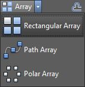

图 94:阵列工具

命令:ARRAY

别名:AR

`ARRAY` 命令有以下选项:

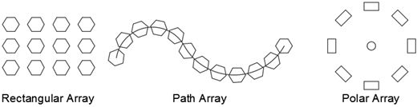

图 95:数组类型

以下选项是所有阵列创建方法的通用选项:

*   `Associative`:指定排列的对象是关联的还是独立的。

*   `Base point`:允许用户设置阵列的基点和基点夹点。
*   `Exit or Close Array`:结束命令。

#### 矩形的

矩形阵列由行和列组成。创建矩形阵列的另一个命令是`ARRAYRECT`。

您可以通过在调用命令之前或之后选择对象来创建数组。完成对象选择后，阵列创建上下文选项卡显示在功能区中，如图 96 所示

 96:矩形阵列上下文选项卡

创建矩形阵列的选项有:

*   `Columns`:指定数组中的列数。按照当前 UCS 的`X`方向创建列。

*   `Rows`:指定数组中的行数。行沿着当前统一通信系统的`Y`方向创建。

*   `Levels`:指定数组中的层数。按照当前 UCS 的`Z`方向创建标高。

#### 小路

创建沿选定路径均匀分布的对象阵列。创建矩形阵列的另一个命令是`ARRAYPATH`。

要创建路径数组:

1.  点击`Path Array`工具
2.  如果在调用命令之前没有选择任何对象，请选择要沿路径分布的对象(源对象)。按`Enter`完成选择。
3.  选择分发路径。路径可以是直线、多段线、三维多段线、样条线、螺旋线、圆弧、圆或椭圆。

路径阵列创建上下文选项卡在功能区中激活，如下图所示:

图 97:路径数组创建面板

创建路径数组的选项有:

*   `Method`:控制如何沿着路径分配物品。

*   `Tangent direction`:指定数组中的对象如何相对于路径的起始方向对齐。选择定义阵列中第一个元素切线的两个点，该元素将分布在整个路径中。
*   `Rows`:指定数组中的行数、行与行之间的距离以及行与行之间的增量高程。

*   `Align items`:设置后，阵列中的项目会旋转以跟随路径，否则项目会保持与源对象相同的方向。

#### 极地的

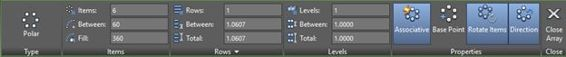

极坐标阵列通过围绕选定点旋转来重复选定的对象，如下图所示:

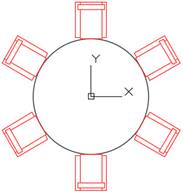

将选定的对象转换到下一个基本级别。例如，分解多段线会将多段线转换为规则的独立直线段和圆弧段。

命令:爆炸

别名:X

`Erase`命令从图形中删除选定的对象。它不会将对象复制到剪贴板粘贴到其他地方。

命令:ERASE

别名:E

快捷键:DEL 键

|  | 提示:OOPS 命令恢复最后被擦除的对象，与它们被擦除后执行了多少命令无关。 |

如果在没有命令运行时选择对象，所选对象会在对象的每个顶点节点或基点上显示实心的小正方形(图 98)。这些正方形称为夹点(蓝色夹点称为冷夹点)，您可以通过拖动夹点快速拉伸、移动、旋转、缩放或镜像对象来编辑对象。根据对象的类型，有更多的编辑选项可用。您选择执行的动作称为夹点模式。我个人使用夹点编辑对象的频率高于任何其他方法。

 98:选定对象上的夹点

|  | 注意:夹点不会显示在锁定图层上的对象上。 |

要使用夹点编辑对象，请单击一个夹点，该夹点会变成红色，称为热夹点。默认情况下，编辑处于拉伸模式。右键单击鼠标显示上下文菜单(图 99)来选择不同的操作。

选择并修改多个夹点

您可以在选择夹点时按住`Shift`键来选择各种夹点。选定的夹点称为多重热夹点选择，并参与编辑操作；它们主要在使用夹点拉伸对象时有用。预热所需的夹点后，松开`Shift`键，选择一个夹点(暖夹点或冷夹点)作为基点(或参考点)来执行操作。

 99:夹点模式上下文菜单

用手柄拉伸

要使用夹点拉伸对象，只需单击要拉伸的夹点，在夹点变为红色后，将夹点移动到新的所需位置。

|  | 注意:处理圆和椭圆等对象时，显示的夹点用于对象中心点和四个象限。在这种情况下，距离是从对象的中心(或径向距离)开始测量的，像拉伸这样的动作实际上会改变对象的半径，而不是选定夹点的位移。 |

使用夹点移动

1.  选择要用作参考点的夹点。
2.  鼠标右键，选择`Move`。
3.  将所选对象移动到所需位置，然后单击以放置对象。
4.  按下`Enter`、`Spacebar`或`Esc`取消抓握模式。

使用夹点旋转

1.  选择要用作参考点的夹点。
2.  鼠标右键，选择`Rotate`。
3.  如果旋转中心点(基点)不合适，右击鼠标，选择`Base Point`选择新的基点。
4.  移动鼠标旋转选定的对象，然后单击放置对象。
5.  按下`Enter`、`Spacebar`或`Esc`取消抓握模式。

使用夹点缩放

1.  选择要用作参考点的夹点。
2.  鼠标右键，选择`Scale`。
3.  如果比例基点不合适，右击鼠标，选择`Base Point`选择新的基点。
4.  `Enter`缩放因子值并按`Enter`，或移动鼠标动态缩放所选对象并点击放置对象。
5.  按下`Enter`、`Spacebar`或`Esc`取消抓握模式。

带把手的镜子

1.  选择要用作参考点的夹点。
2.  鼠标右键，选择`Mirror`。
3.  如果镜像基点不合适，右键点击鼠标，选择`Base Point`选择新基点。
4.  选择镜像线的第二个点。

使用夹点制作多个副本

1.  按下`Enter`、`Spacebar`或 Esc 取消抓握模式。
2.  从上下文菜单中选择所需的操作。
3.  按下`C`并按下`Enter`，或按住`Ctrl`键进行操作。继续复印，直到您按下`Enter`、`Spacebar`或`Esc`。

在本练习中，您将练习许多编辑对象的方法。我们要画的是一幅风景图。

1.  如果尚未打开，请打开 AutoCAD。
2.  打开位于`Chapter 04`文件夹中的图纸`Landscape Plan`。
3.  将图纸保存为`My Landscape Plan`。
4.  缩放到池区域，使整个池适合绘图区域。

让我们首先使用`Offset` 命令创建池步骤

命令:O `8`

指定偏移距离或【穿透/擦除/图层】<1'-0"> : 12 `8`

选择要偏移的对象或【退出/撤消】<exit>:选择如下图所示的搁板分界线:</exit>

1 

指定要偏移的边上的点或[退出/多重/撤销] <exit>:单击所选线下方的任意位置。</exit>

选择要偏移的对象或【退出/撤消】<exit>:选择新创建的线。</exit>

指定要偏移的边上的点或[退出/多重/撤销] <exit>:单击所选线下方的任意位置。</exit>

选择要偏移的对象或[退出/撤消] <exit>:按回车键、空格键或退出键(Esc)完成命令。</exit>

接下来让我们在游泳池的拱形边缘创建一个消失的边缘和水槽。

命令:O `8`

指定偏移距离或【穿透/擦除/图层】<1'-0"> : 8 `8`

选择要偏移的对象或[退出/撤消] <exit>:选择圆弧</exit>

指定要偏移的边上的点或[退出/多重/撤销] <exit>:单击弧下方的任意位置</exit>

选择要偏移的对象或[退出/撤消] <exit>:按回车键、空格键或退出键(Esc)完成命令。</exit>

命令:按回车键或空格键重复最后一个命令

指定偏移距离或[穿透/擦除/图层] <0'-8"> : 2'6" `8`

选择要偏移的对象或[退出/撤消] <exit>:选择顶部弧</exit>

指定要偏移的边上的点或[退出/多重/撤销] <exit>:单击弧上方的任意位置</exit>

选择要偏移的对象或[退出/撤消] <exit>:按回车键、空格键或退出键(Esc)完成命令。</exit>

命令:按回车键或空格键重复最后一个命令

指定偏移距离或【穿透/擦除/图层】<3'-0"> : 12 `8`

选择要偏移的对象或[退出/撤消] <exit>:选择新创建的弧</exit>

指定要偏移的边上的点或[退出/多重/撤销] <exit>:单击弧上方的任意位置</exit>

选择要偏移的对象或[退出/撤消] <exit>:按回车键、空格键或退出键(Esc)完成命令。</exit>

请注意，使用“偏移”命令创建的新弧不接触池边界。为了解决这个问题，我们将使用扩展命令。

命令:EX `8`

选择对象或<select all="">:如下图选择线，然后按回车键或空格键确认选择。</select>

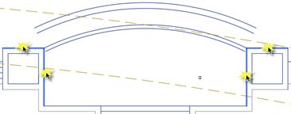

选择要延伸的对象或按住 shift 键选择要修剪的对象或[栅栏/交叉/项目/边缘/撤消]:

路径与边界不相交。

选择要延伸的对象或按住 shift 键选择要修剪的对象或[栅栏/交叉/项目/边/撤消]:在要延伸的创建弧的每个端点附近单击

选择要延伸的对象或按住 shift 键选择要修剪的对象或[栅栏/交叉/项目/边缘/撤消]:按回车键、空格键或 Esc 键完成

按`Ctrl+S`保存您的图纸。

现在让我们在泳池甲板的右侧建造楼梯台阶。缩放到该区域，使其适合绘图区域，如下图所示:

使用`Offset`命令偏移两者:右侧的垂直线和建议楼梯顶部的水平线。偏移距离为 12；对朝向建筑物的每条线重复偏移三次。结果应该如下图所示:

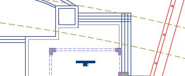

我们需要修理和修整线路。拉近到要修剪的区域(阶梯线交叉的右上角区域)，然后按如下步骤进行:

命令:TR `8`

选择切削刃...

选择对象或<select all="">:如下图选择两个步骤线，然后按回车键</select>

选择要修剪的对象或按住 shift 键选择要延伸的对象或[栅栏/交叉/项目/边缘/擦除/撤消]:单击交叉点右侧的水平线

选择要修剪的对象或按住 shift 键选择要延伸的对象或[栅栏/交叉/项目/边缘/擦除/撤消]:单击交叉点上方的垂直线

选择要修剪的对象或按住 shift 键选择要延伸的对象或[栅栏/交叉/项目/边缘/擦除/撤消]:按回车键、空格键或 Esc 键结束命令

在这种情况下，另一种快速修剪线段的方法是使用如下命令`Trim`:

命令:F `8`

选择第一个对象或【撤消/折线/半径/修剪/多重】:R `8`(设置圆角半径)

指定圆角半径<2'-3 11/16"> : 0 `8`(将半径设置为零)

选择第一个对象或[撤消/折线/半径/修剪/多重]: M `8`(多重修剪动作)

选择第一个对象或[撤消/多段线/半径/修剪/多重]:单击交叉点旁边的线。

选择第二个对象或按住 shift 键选择以应用拐角或[半径]:单击最近的相交线

选择第一个对象或[撤消/多段线/半径/修剪/多重]:单击交叉点旁边的线。

选择第二个对象或按住 shift 键选择以应用拐角或[半径]:单击最近的相交线

选择第一个对象或[撤消/多段线/半径/修剪/多重]:按回车键、空格键或 Esc 键结束命令

缩放以使整个泳池平台适合绘图区域。在 lanai 和游泳池搁板的左下角之间有一套桌子。我们需要另一边的对称副本。我们可以通过使用`Mirror`命令来实现这一点，如下所示:

命令:MI `8`

选择对象:选择表集

选择对象:`8`

指定镜像线的第一点:按住 Shift 键并右键单击鼠标，从上下文菜单中选择“中间”。_mid of 单击水池楼梯踏步中点附近的

指定镜像线的第二点:按住 Shift 键并右键单击鼠标，从上下文菜单中选择“中间”。_mid of 单击另一个水池楼梯踏步中点附近的，以创建垂直镜像线。

擦除源对象？【是/否】<no>:否`8`(这将维护源，选择是将擦除源对象)</no>

按`Ctrl+S`保存你的图纸，让我们在网站的前部工作。

命令:Z `8`

指定窗口角，输入比例因子(nX 或 nXP)，或[全部/中心/动态/范围/上一个/比例/窗口/对象] <real time="">: E `8`</real>

我们首先需要改变摊铺机模式。为此，我们需要使用`Hatch Editor`上下文选项卡编辑阴影。如果需要，可以放大到前院。

1.  选择车道填充图案。`Hatch Editor`上下文选项卡加载到功能区中。
2.  在`Pattern`面板中，找到并选择名为`AR-HBONE`的图案。
3.  在`Properties`面板中，将刻度改为`1`。

车道现在呈现出人字形的舱口图案。

车道上有一辆车(块)，我们需要旋转它以适应车道自然流动。我们可以使用 `Move`命令，也可以在夹点模式下旋转。没有使用哪种方法的规则，但是对于这种情况，让我们在夹点模式下旋转。

1.  选择车辆挡块。一个蓝色的实心把手出现在汽车中央附近。
2.  单击夹点；它变成红色。进入拉伸模式(因为该对象是一个块，拉伸将作为移动)。
3.  右键单击鼠标，从上下文菜单中选择`Rotate` 。
4.  如果知道旋转角度，可以在这里输入值。在这种情况下，旋转角度是未知的，所以我们将选择方向。按住`Shift`键，右键单击鼠标，从上下文菜单中选择`Center`。
5.  单击其中一个圆弧段上的任意位置，创建拱形驱动。
6.  按`Esc`取消该部分。

接下来，我们将在车道周围创建两个灌木层。有两条多段线将定义分布代表灌木的对象的路径。右边的路径使对象位于路径的左端。在创建数组之前，将灌木复制到左边路径的一个端点。

*   选择灌木(中间有十字的绿色小圆圈)。
*   单击块中心的夹点。
*   右键选择`Move`。
*   右键选择`Copy`。
*   按住`Shift`，右键单击鼠标，选择`Endpoint`覆盖捕捉线段端点。
*   单击左侧圆弧端点附近。
*   按下`Esc`以最终确定夹点模式。
*   按`Esc`清除选择。
*   按`Ctrl+S`保存您的图纸。

接下来，我们将创建一个沿着车道周围路径的数组。`Click on the` `Path Array`工具启动一个路径数组。

选择对象:选择右侧多段线路径末端的灌木块。

选择对象:按回车键提交选择。

选择路径曲线:选择阵列路径右侧的多段线。

选择要编辑阵列的夹点或[关联/方法/基点/切线方向/项目/行/标高/对齐项目/Z 方向/退出] <exit>:从“阵列创建”上下文选项卡的“项目”面板中，在“介于”字段中输入 36，然后按回车键。</exit>

选择要编辑阵列的夹点或[关联/方法/基点/切线方向/项目/行/标高/对齐项目/Z 方向/退出] <exit>:按回车键、空格键或 Esc 键完成命令。</exit>

重复前面的步骤，在车道的左侧创建灌木层。

选择用于定义阵列路径的两条多段线。您可能需要放大以确保不选择阵列。

按`Delete`键擦除路径。

拉近车道中央的棕榈树。有一个块代表一种灌木，它需要排列在棕榈树周围。我们将使用阵列极坐标命令来实现这一点:

从主页选项卡，修改面板，点击`Polar Array`工具:

命令:_arraypolar

选择对象:选择棕榈树符号下的灌木符号。

选择对象:按回车键确认选择并进入下一步。

指定阵列的中心点或[基点/旋转轴]:按住 Shift 键，右键单击鼠标，然后从上下文菜单中选择插入:悬停在棕榈树上的 _ins，一个琥珀色符号显示在符号的中心。用鼠标左键选择棕榈树插入点作为阵列的中心。

选择要编辑阵列的夹点或[关联/基点/项目/项目之间的角度/填充角度/行/级别/旋转项目/退出] <exit>:在“阵列创建”上下文选项卡上，为项目计数输入 12，然后按回车键。</exit>

选择要编辑阵列的夹点或[关联/基点/项目/项目之间的角度/填充角度/行/级别/旋转项目/退出] <exit>:按回车键或按 Esc 键结束命令。</exit>

现在我们需要在院子里建一个灌木层。庭院墙壁的左下角旁边有一个灌木符号。我们将使用该块创建一个矩形数组。

点击`Rectangular Array`工具，按照以下步骤操作:

命令:_arrayrect

选择对象:选择灌木符号。

选择对象:按回车键确认选择并进入下一步。

选择要编辑数组的夹点或[关联/基点/计数/间距/列/行/级别/退出] <exit>:在“数组创建”上下文选项卡的“列”面板上，为“列计数”字段输入 3，为“之间”值输入 48(这是项目之间的空间，从基点到基点)。</exit>

选择要编辑数组的夹点或[关联/基点/计数/间距/列/行/级别/退出] <exit>:行面板，在行计数字段中输入 8，在之间值中输入 48。</exit>

选择要编辑数组的夹点或[关联/基点/计数/间距/列/行/级别/退出] <exit>:按回车键或按 Esc 键结束命令。</exit>

接下来，我们应该修改藤架和车道之间的步行区。缩放到人行道。我们需要对人行道裙板的拐角进行倒角，以创建更平滑的过渡。这将使用`Chamfer`命令来完成:

命令:CHA `8`

选择第一条线或[撤销/折线/距离/角度/修剪/方法/多重]: D `8`

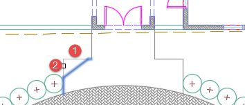

指定第一个倒角距离<0'-0"> : 48 `8`这是上图所示 1 号线的倒角距离。

指定第二倒角距离<4'-0"> : 36 `8`这是上图所示的 2 号线的倒角距离。

选择第一条线或[撤消/折线/距离/角度/修剪/方法/多重]:左键单击上图所示的行号 1。

选择第二条线或 shift-select 应用拐角或[距离/角度/方法]:左键单击上图所示的行号 2。

重复前面的动作，也在人行道的右侧露营。

为了完成这个练习，我们需要将位于车道入口右侧的绿色圆圈移动到更靠近车道停机坪的位置，如下图所示，然后将树添加到其他位置。请遵循以下步骤:

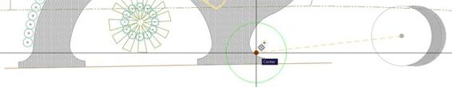

命令:M `8`

选择对象:选择树符号。

选择对象:按回车键提交选择。

指定基点或【位移】<displacement>:按住 Shift 键，鼠标右键。从上下文菜单中，选择中心。</displacement>

指定基点或【位移】<displacement>:_ 岑点击树符号圆周。</displacement>

指定第二个点或<use first="" point="" as="" displacement="">:按住 Shift 键并右键单击鼠标。从上下文菜单中，选择中心中心–左键单击弧，如上图所示。</use>

现在继续复印:

指挥:文书主任

选择对象:选择在上一个操作中重新定位的树符号。按回车键提交选择。

指定基点或【位移/模式】<displacement>:按住 Shift 键，右键单击鼠标。从上下文菜单中，选择单击树符号圆周的中心。</displacement>

指定第二个点或【数组】<use first="" point="" as="" displacement="">:将树符号复制到如下图所示的位置。确保使用中心对象捕捉替代。按回车键、空格键或 Esc 键完成命令。</use>

按`Ctrl+S`保存您的图纸。

关闭图形，然后打开位于`Chapter 04`文件夹中名为`ColumnBase Partial`的图形。这是我们在第 3 章中处理的同一个柱基，下面练习的目标是将圆弧和直线转换为一条折线。我们还将练习使用`Stretch`命令改变柱基的高度。

1.  From the Home tab, Modify panel, click on the `Stretch` tool.

    

2.  单击要拉伸的对象右侧的点(上图中显示的点 1)，然后单击要拉伸的元素左侧的点(点 2。)至关重要的是，将参与拉伸动作的所有点都被交叉窗口包围，并且要交叉的受影响元素被交叉窗口包围。
3.  按`Enter`提交选择。
4.  单击绘图区域中的任意位置来标记基点。
5.  确保`Polar Tracking`开启，角度增量包括 90°(见第二章“其他输入法”部分)。
6.  在绘图区域中向上移动光标。对象开始沿着光标方向伸展。确保极坐标追踪显示为 90°，输入`1`，然后按`Enter`。
7.  底部被拉伸，尺寸被更新为 4 英寸。

接下来，我们需要连接元素以创建多段线:

命令:PE `8`

选择折线或[多重]:选择垂直蓝线(测量 4 英寸)，然后按回车键。

因为所选对象是一条线(不是多段线)，所以 AutoCAD 会确认是否应将其转换为多段线。我们需要通过在提示中输入`Y`来接受:

选定的对象不是多段线。是否将其转换为多段线？ <y>Y `8`</y>

接下来，我们将加入定义基本配置文件的其他部分:

输入一个选项[关闭/连接/宽度/编辑顶点/拟合/样条线/反弯/垂直生成/反向/撤销]: J `8`

选择对象:创建一个交叉窗口，如前图中拉伸动作所示。找到 11 个

选择对象:按回车键将选定的线段连接到多段线。

8 条线段添加到多段线

输入一个选项[关闭/连接/宽度/编辑顶点/拟合/样条线/去弯/类型生成/反转/撤销]:按回车键、空格键或 Esc 键完成命令。

|  | 注意:尺寸线无法连接或转换为多段线，因此会自动从选择中过滤。 |

将鼠标放在新多段线上，确认对象是否已连接。

让我们使用`Mirror`命令镜像复制折线，以定义左侧的轮廓:

命令:MI `8`

选择对象:选择多段线。找到 1 个

选择对象:指定镜像线的第一点:按住 Shift 键并右键单击鼠标。从上下文菜单中，选择“中点”。_ 月中旬

指定镜像线的第二个点:确保“极坐标追踪”处于打开状态，将光标向上或向下移动 90 到，并左键单击以定义镜像线。

擦除源对象？【是/否】 <no>: N `8`(我们需要保留源对象。)</no>

让我们将它们连接起来，创建一条折线:

命令:PE `8`

默认情况下，只能编辑一条多段线。我们将使用多重选项在一次运行中选择所有对象:

选择折线或[多重]: M `8`

现在让我们选择图形中的所有对象。尺寸对象被自动排除在连接之外:

选择对象:全部`8`

发现 5 个

选择对象:按回车键提交选择。

将直线、圆弧和样条曲线转换为多段线[是/否]？ <y>Y `8`</y>

输入一个选项[关闭/打开/连接/宽度/拟合/样条曲线/去弯/纵向/反向/撤销]: J `8`

输入模糊距离或【关节类型】<0'-0"> : 0 `8`

添加到多段线的 10 条线段

要闭合多段线:

输入一个选项[关闭/打开/连接/宽度/拟合/样条曲线/去弯/纵向/反向/撤销]: C `8`

输入一个选项[关闭/打开/连接/宽度/拟合/样条曲线/反弯/纵向/反向/撤销]:按回车键、空格键或 Esc 键完成命令。

现在柱基是一个单折线对象。按`Ctrl+Shift+S`打开`Save Drawing As`对话框。将您的绘图保存为`MyColumnBasePL.dwg`。

在本章中，您学习了如何选择、修改、修改和创建对象的副本。AutoCAD 的编辑能力远远超出了这里所涵盖的范围，您肯定会找到自己的方法来使用 AutoCAD 提供的许多修改工具。

在下一章中，您将学习如何以非常有效的方式重用对象。到时候见。