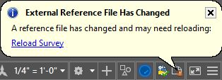

随着您对 AutoCAD 的了解，您将很快意识到您必须一遍又一遍地重复绘制和编辑相同的对象。AutoCAD 提供了一些工具，可以在同一图形中或图形之间重用对象。

重用对象的一种方法是创建副本。您可以根据需要多次复制图形中的任何对象，以便在图形中的任何位置重复使用。假设您在整个图形中多次创建选定对象的副本。现在假设您的客户决定这些(重复的)对象的一部分需要修改。如果您的选择是由平面几何图形(折线、圆弧、直线等)组成的。)，您必须找到每个副本，并编辑或替换每个实例的受影响区域。

在本章中，您将学习如何使用两种非常有效的方法来重用对象:块和外部参照。

块是由其他对象组成的单个对象，块中的每个元素都有自己的属性集。

块是时间和文件大小的节省器。定义块后，AutoCAD 会将其存储在当前图形的内部库中，称为块表。即使没有在任何地方使用(插入)，块也可能存在于图形中，如果通过重新插入或复制来创建块的多个实例，所有实例都将引用块库。如果编辑单个块参照，所有其他块都将同等更新。

命令:阻止

别名:B 或 BL

在创建块之前，首先像创建任何图形一样绘制元素。为了说明如何创建块，我们将在前面几章中创建的柱基图形上进行操作。

如果尚未打开 AutoCAD，现在就打开，然后打开位于`Chapter 05`文件夹中的图形`ColumnBase.dwg`。

图形由定义柱基轮廓的蓝色多段线和定义柱基过渡的灰色线组成。

元素在已定义的层上正确设置，但是有一些实践，虽然不是必需的，但在处理像这样的简单块时变得非常方便:

*   将所有对象设置为图层`0`。第 0 层是一个“神奇”的层，当隐藏或冻结层时，有助于许多操作。
*   将所有属性设置为`ByBlock`。这将允许用户通过更改块属性来更改块元素的外观，如果块(对象)属性设置为`ByLayer`，则块将继承图层属性。如果设置为`ByLayer`，块将继承`Layer Properties`，并且块属性的更改不会影响块元素。
*   定义一个有意义的基点(插入点)。

同样，这些不是规则，但在低密度块上很方便。对于更复杂的块，例如细节，您可能希望维护所有属性，以便可以通过其他方式进行管理。

让我们更改此块的对象属性:

1.  通过窗口或窗口交叉选择所有对象。
2.  从`Home Tab`、`Layers Panel`中，从图层列表中选择`Layer 0`。
3.  从`Properties`面板，将所有属性更改为`ByBlock`(当前显示为`ByLayer`)。
4.  按`Esc`取消选择所有对象。
5.  从`Layers panel`开始，将图层`0`设置为当前图层。
6.  从`Home` 选项卡的`Block` 面板，点击`Create`工具打开`Block Definition`对话框。
7.  在`Name`字段输入`Column Base`。
8.  在`Base point`区域，点击`Pick point`。
9.  按住`Shift`，右键单击鼠标，从上下文菜单中选择`Midpoint`。
10.  在最低水平线的中点附近单击。
11.  在`Objects`区域，点击`Select objects`。
12.  选择定义柱基的所有对象，然后按`Enter`。
13.  在`Select objects`区域，点击`Convert to block`。
14.  点击`OK`。

源对象现在被擦除，新创建的块参照被插入到源对象之前所在的当前层中。

1.  选择块插入。
2.  在`Home` 选项卡的`Layers` 面板中，将图块图层更改为`Column Base`，然后按`Esc`清除选择。该块继承图层属性。
3.  将您的绘图保存为`MyBlocks`。

插入当前图形的块表中存在的块

命令:插入

别名:我还是 INS

现在我们有了一个块，我们可以在图形中插入该块的其他实例，也可以复制现有实例。现在，让我们看看如何插入一个块:

1.  缩小到足够大，以便您可以在绘图区域中至少再容纳一个柱基块。
2.  将`ColumnBase`设为当前`Layer`。
3.  在`Home` 选项卡的`Block` 面板中，点击`Insert`工具，或输入`I`(或`INSERT`)并按`Enter`或`Spacebar`。
4.  将出现可用块的列表。选择`Column Base`块。如果图形的块表中没有可用的块，将显示“插入”对话框，因此可以加载图形作为块插入。
5.  光标处显示表示块的字形，单击绘图区域中的任意位置插入块。
6.  尝试复制块，就像您在上一章中复制植物块一样。

将现有图形作为块插入

通常，您需要从先前创建或从制造商网站下载的文件库中插入图形。理想情况下，要插入的图形是常规图形，而不是图形中已定义的块，因为在插入时会创建包含选定图形中元素的新块定义。

要将现有图形作为块插入到当前图形中:

1.  在`Home` 选项卡的`Block` 面板中，单击`Insert` 工具，然后单击`More Options`打开`Insert`对话框。
2.  点击`Browse`按钮，导航到您下载本书练习文件的位置。在`Chapter 05`文件夹中，选择名为`sink.dwg`的图形，然后单击`Open`。
3.  如果需要，可以为块输入新名称。插入名称已存在于块表中的图形将重新定义现有块。
4.  确保选中`Specify On-screen`复选框，以便您可以在绘图区域中选择插入点。
5.  点击`OK`。
6.  块字形出现在十字光标中；单击图形中的任意位置插入块。
7.  块被插入到当前层中。

命令:BEDIT

别名:BE

您可能需要对块进行更改。例如:我真的不喜欢柱底过渡线的显示方式，根据打印样式定义，它们可能会以粗体打印。我们将编辑柱基块，使过渡线为灰色:

1.  选择其中一个柱基块实例。
2.  右键单击鼠标，从上下文菜单中选择`Block Editor`。

绘图区域背景颜色变为灰色，并且块编辑器上下文选项卡加载到功能区中。您现在处于块编辑器模式。

图 100:块编辑器上下文选项卡

1.  选择横跨柱基的所有七条线(不要选择轮廓多段线)。
2.  如果属性选项板不可见，按`Ctrl+1`显示属性选项板。
3.  在`Properties` 调色板`General properties`上，点击颜色下拉菜单，从列表中选择`Select Color`。
4.  在颜色文本框中，输入`9`并点击`OK`设置所选对象的颜色。
5.  按`Esc`清除选择。
6.  单击`Block Editor`上下文选项卡中的`Close Block Editor`。
7.  点击`Save` 保存对`Column Base`的修改。
8.  块的所有实例都会更新。

|  | 提示:创建块时，您可以选择避免块被分解。这非常有助于避免意外爆炸的砖块。在块编辑器模式下，可以从“特性”选项板更改该特性。 |

爆炸水槽块:

命令:X `8`爆炸

选择对象:选择水槽块，然后按回车键或空格键。

对象不再是块。

命令:我`8`

将打开“插入”对话框；从`Name`列表中选择`sink`，点击`OK`。

指定插入点或[基点/比例/X/Y/Z/旋转]:在绘图区域中选择一个点。

由于汇整块定义保留在图形的块表中，因此会插入汇整块的新实例。

您经常需要将图块写入档案，以便在未来的图面中重复使用。要将块写入文件，选择不一定是块；它可以是任何选择集，包括包含块和其他非块对象的集。

命令:WBLOCK

别名:WB

让我们将列基块写入一个文件:

1.  From the `Insert` tab, `Block Definition` panel, select `Write Block`, as shown in the following figure:

    

    图 101:写块

2.  从选项中选择`Block`。
3.  从`Block`列表中，选择`Column Base`。
4.  在目标区域，点击`…`按钮，显示`Browse for Drawing File`对话框。浏览到您喜欢的位置。
5.  在`File name`文本框中，输入`My Column Base.dwg`，点击`Save`。
6.  点击`OK`保存块。

该块现在已保存，您可以在以后的任何图形中重用它。

保存并关闭图形。

|  | 注意:生成的保存文件不包含块；它包含组成选定块的对象。 |

|  | 提示:可以使用 Ctrl+C 从一个图形中复制对象，使用 Ctrl+V 粘贴到另一个图形中。 |

外部参照(Xref)类似于块，但它不是将块保存在当前图形的块表中，而是链接到文件系统中任何文件夹中的外部文件。外部参照定义保存在外部参照表中，与块一样，从图形中删除外部参照实例不会从外部参照表中删除文件。

当处理来自不同学科的大文件时，Xref 被广泛使用，以方便设计管理。例如，在建筑设计中，可以将作为外部参照的主楼层平面添加到室内设计、结构、景观、机械或其他平面中。

外部参照可以嵌套。可以附着已经包含其他附着的外部参照的外部参照，并且该文件可以是另一个图形的外部参照，依此类推。

因为您可以根据需要卸载和重新加载外部参照，所以正确使用外部参照可以显著提高图形性能和设计生产率，也有助于项目管理。

更新外部参照时，所有主体图形在关闭时都会自动更新，如果打开了主体图形，则会有一个气球通知用户外部参照已保存，需要更新。

您可以冻结或关闭外部参照中的图层。

除非绑定，否则不能分解外部参照(这会将外部参照变成块)。

外部参照类型

*   `Attachment`:附件外部参照加载到插入附件主体文件的所有图形上，与层数无关。
*   `Overlay`:当叠加所附着的图形作为外部参照附着到另一个图形时，叠加将被忽略。

命令:ATTACH

1.  打开位于`Chapter 05`文件夹中的文件`FloorPlan.dwg`。
2.  确保当前图层为`0`(在图层`0`上插入外部参照是一个很好的做法)。
3.  在`Insert` 选项卡的`Reference` 面板中，单击`Attach`。
4.  导航至`Chapter 05`文件夹。
5.  从`Files of type`列表中(对话框下方)，选择`Drawing (*.dwg)`。
6.  从文件列表中，选择`Survey.dwg`并单击`Open`以显示“附加外部参照”对话框。
7.  确保在`Reference Type` 区域选择`Attachment`。
8.  在`Scale`区域，确保`Specify On-screen`未选中，并且`X`、`Y`和`Z`值为`1.00`。
9.  在`Insertion point`区域，确保`Specify On-screen`未选中，并且`X`、`Y`和`Z`值为 0.00(外部参照基点位置)。
10.  在`Rotation`区域，确保`Specify On-screen`未选中，并且`angle`为`0.00`。
11.  单击`OK`插入外部参照。
12.  在`Insert` 选项卡的`Reference` 面板中，单击`Attach`。
13.  从文件列表中，选择`Electrical.dwg`并单击`Open`以显示“附加外部参照”对话框。
14.  确保在`Reference Type`区域选择`Overlay`。
15.  单击`OK`附加电气平面图。
16.  保存绘图。
17.  打开`Landscape.dwg`文件。
18.  重复第 4 步至第 11 步，附上`FloorPlan.dwg`图。
19.  现已附着平面图和测量图，但未附着电气平面图，因为它是平面图图形中的覆盖图。
20.  保存绘图。

要编辑外部参照，只需打开文件，进行更改，然后保存即可。每次保存附件时，宿主图形都会收到通知。

要快速打开外部参照:

1.  单击外部参照进行选择。
2.  右键单击鼠标以显示上下文菜单。
3.  选择`Open Xref`打开文件。
4.  将显示“打开参考文件”对话框，显示所有附着的和嵌套的外部参照。
5.  从`Reference Name`列表中选择`Survey`，然后点击`Open`。
6.  `Survey`绘图被加载到新的绘图选项卡中。
7.  缩放和平移图形，然后保存并关闭它(我不太愿意进行更改，但 AutoCAD 会将任何命令识别为图形更改)。
8.  通知气球出现在主体图形中。单击`Reload Survey`更新外部参照。
9.  保存并关闭所有图形。

实际上，可以附着任意数量的外部参照，并且可以完全控制外部参照的可见方式和可见时间，或者是否需要分离任何外部参照。

附着外部参照时，AutoCAD 会显示以外部参照名称为前缀的每个外部参照的图层，例如`Landscape|L-Pool`。您可以在不影响源的情况下更改图层属性和可见性，并且任何图层属性更改都将持续存在，即使您重新加载外部参照，或者默认情况下跨 AutoCAD 剖面。

|  | 提示:图层可见性状态由一个名为 VISRETAIN 的系统变量控制，并且是图形持久化的。当 VISRETAIN = 1 时，主图形保留图层的属性更改。当 VISRETAIN = 0 时，每次重新加载外部参照时都会恢复图层的属性。 |

AutoCAD 提供了一种支持管理外部参照的工具，称为外部参照管理器。按照以下步骤打开外部参照管理器并管理外部参照:

1.  如果 AutoCAD 没有运行，请打开 AutoCAD。
2.  打开位于`Chapter 05`文件夹中的`Full Project With Xrefs`图。
3.  In the command window, type `XREF` and press `Enter` to open the Xref Manager palette, as shown in Figure 102.

    

     102:外部参照管理器

4.  在`File References` 列表中，选择`Annotation`。请注意，外部参照在绘图区域中高亮显示。
5.  右键点击`Annotation`。将出现一个菜单，其中包含可用于外部参照的命令。
6.  选择`Unload`。外部参照被卸载，并且在绘图区域中不再可见。
7.  右键点击`Annotation`，选择`Reload`。外部参照将重新加载，并在绘图区域中可见。
8.  右键点击`Electrical`，选择`Detach`。外部参照将从图形中分离；它不再可见，无法重新加载。
9.  右键点击`Annotation`，选择`Bind`。
10.  在`Bind Xrefs/DGN underlays`对话框中，选择`Insert`并单击`OK`以绑定外部参照。
11.  注释平面在绘图区域中可见，转换为块参照(可以根据需要分解块)，并且外部参照名称已从列表中删除。
12.  点击位于调色板左上角的`Attach DWG`。
13.  找到`Electrical`图纸并将其作为图纸的附件。

|  | 注意:绑定外部参照时，绑定模式会保留图层、块和其他图形元素的前缀(外部参照名称)，而插入会删除所有前缀。 |

在本章中，您学习了如何使用块和外部参照，这可能是重用图形最常用的技术。许多设计公司使用块和外部参照来定义图形中的标题栏和详图。我们将在第七章中完成。