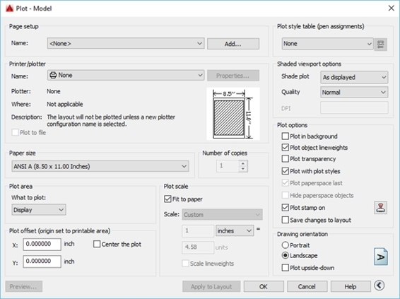
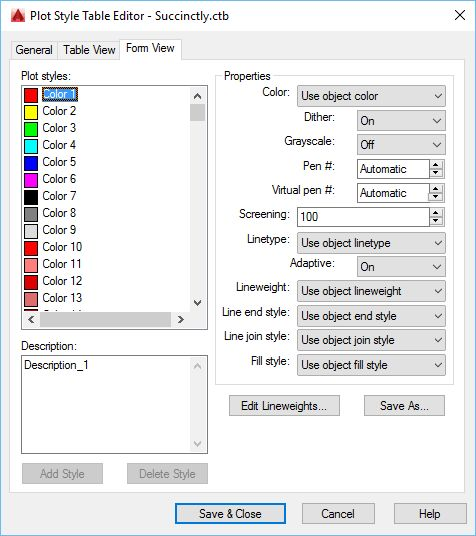
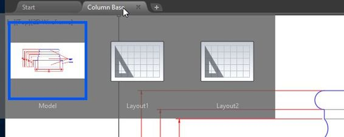
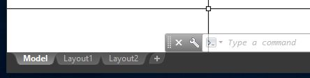
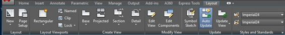
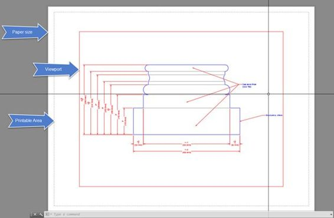

在本章中，您将学习如何准备绘图以供客户审阅或制作。

到目前为止，您创建的所有内容都是在模型空间中完成的。当考虑绘图和打印时，您应该在图纸空间工作。虽然您可以从模型空间打印绘图，但图纸空间布局是创建要打印的图纸的正确空间。

模型空间和图纸空间中的绘图过程相同。单击位于`Quick Access`栏的`Plot` 工具，或按`Ctrl+P`显示绘图对话框:

 115:绘图对话框

您可以使用操作系统或 AutoCAD 打印机配置(PC3)文件中配置的打印机进行打印。

在`Printer/Plotter`列表中，您可以通过以下方式区分系统打印机和 PC3 文件:

表示系统打印机

表示 PC3 打印机

PC3 文件允许您自定义配置绘图仪或打印机，并将设置保存(到 pc3 文件)以供以后使用，即使在其他图形中也是如此。根据您的需要，同一台绘图仪或打印机可以有许多不同的配置。例如，您可以创建一个 PC3 文件，其唯一目的是绘制矢量图形，另一个目的是绘制图形图像。

要从图纸空间绘制图形，请执行以下步骤:

1.  在打印机/绘图仪区域，选择 `DWG to PDF.pc3.`
2.  在纸张尺寸中，选择`ANSI B (17.00 X 11.00 Inches)`
3.  在绘图区域，选择`Extents`
4.  在绘图偏移区域，勾选`Center the plot`
5.  在绘图比例中:
6.  取消勾选`Fit to paper`
7.  在比例列表中选择`6” = 1’-0”`。请注意，这与注释比例相同。

|  | 注意:不要求您匹配打印比例和注释比例，但是如果它们不相同，生成的打印注释可能比您计划的要小或大。 |

在“比例”列表下方的两个字段中，您可以输入自定义比例。对于选定的刻度(6" = 1'-0 ")，它显示 6 英寸= 12 个单位(12 "等于 1'-0 ")。在相应的字段中输入`1`和`2`将产生相同的比例，但表示为自定义。

在内部，AutoCAD 是无单位的；绘图比例表示 6 英寸(纸张单位)等于 12 个绘图单位，这意味着在纸张文档中测量的每 6 英寸相当于现实世界中的 12 英寸。

1.  如果绘图对话框没有显示所有选项，单击对话框右下角的`More Options` 按钮。
2.  在“打印样式表(笔分配)”区域，选择`monochrome.ctb`。
3.  在关于将该打印样式分配给所有布局的问题中选择`No`。
4.  在绘图选项中:

6.  单击`Apply to Layout`允许在任何模型空间图中重复使用该设置。
7.  点击`OK`进行出图。
8.  浏览到要保存 PDF 的位置。默认情况下，AutoCAD 将 PDF 命名为以布局名称为后缀的图形名称。文件名输入`Column Base-Model_1.pdf`。
9.  点击`Save`。
10.  假设您的计算机中有一个 PDF 阅读器，打印完成后，打印的 PDF 会打开。

|  | 提示:AutoCAD 在打印到 PDF 时保存图层信息。您可以关闭 PDF 阅读器中的图层。 |

打印出来的效果不错，但是所有的线条，虽然因为单色. ctb 文件中的设置而变成黑色，但是都具有相同的线宽。为了纠正这一点，我们将创建一个新的打印样式表。

打印样式表是颜色映射配置，您可以在其中定义如何打印每个 AutoCAD 颜色索引。对于许多不同的目的和设置，可以有任意多的打印样式。我们将创建一种更适合我们需求的剧情风格:

1.  点击绘图或按`Ctrl+P`显示绘图对话框。
2.  确保绘图参数与上次绘图相同。如果没有，在`Page Setup Name`中选择`<Previous plot>`。
3.  在打印样式(笔分配)列表中，选择`New`。
4.  在“添加颜色相关打印样式表”中选择`Start from scratch` ，然后单击`Next`。
5.  在`File nam` e 栏中输入`Succinctly`，点击`Next`。
6.  勾选`Use this plot style table for the current drawing`并取消勾选`Use this plot style for new and pre-AutoCAD drawings.`
7.  `Click Plot Style Table Editor`.

    

    图 116:打印样式表编辑器

8.  如果未激活，激活`Form View`标签。
9.  在`Plot styles`列表中，选择`Color 1`，按住`Shift`，选择`Color 9`选择范围。
10.  在`Properties`面板中，在颜色列表中选择`Black`。
11.  在`Plot styles`列表中，选择`Color 1`。
12.  在`Properties`面板中，选择`Lineweight`列表中的`0.1000 mm`。
13.  继续使用其余颜色:

15.  选择颜色 8:

17.  选择颜色 9:

19.  点击`Save & Close`。
20.  点击`Finish`。
21.  点击`Apply to Layout`，然后点击`OK`进行出图。
22.  将文件保存为`Column Base-Model_2.pdf`。
23.  该图现在具有不同的线宽。
24.  保存您的绘图。

打印样式保存为单独的文件，并且在创建后可用于任何图形。

布局是 2D 图纸布局环境，您可以在其中定义图纸尺寸、创建图形的多个视图(视口)以及添加标题栏和其他注释。每个绘图视口可能具有不同的比例、视图方向和视觉样式，您可以定义要隐藏的图层，甚至可以指定不同的图层颜色。

要激活布局，请将鼠标移到“绘图”选项卡上并暂停，直到显示布局缩略图，如下图所示:

图 117:从绘图选项卡激活布局

或者，您可以通过从绘图区域底部的“布局”选项卡中选择来激活布局:

图 118:布局选项卡

|  | 提示:您可以从“选项”对话框的“显示”选项卡中控制“图形文件”选项卡和“布局”选项卡的可见性。要打开选项对话框，请在命令窗口中键入操作，然后按回车键。 |

让我们配置一个绘图布局:

1.  让我们继续学习您在本章的“打印样式”部分中使用的柱基图形。
2.  激活`Layout1`布局。

激活布局时，“布局”面板将添加到功能区，您可以在其中创建新的布局和视口:

图 119:布局选项卡

1.  右键单击`Layout1 tab`并从上下文菜单中选择`Rename`。
2.  键入`D-101`并按下`Enter`。
3.  单击布局选项卡的`Layout`面板中的`Page Setup`工具。
4.  在`Page setups`列表中，选择`*D-101*`，点击`Modify`，出现`Page Setup`对话框，类似于出图对话框。
5.  在“页面设置”对话框中:
6.  将`Printer/Plotter Name`设置为`DWG To PDF.pc3`。
7.  将`Paper size`设置为`ANSI B` `(17.00 X 11.00 Inches)`。
8.  将`What to plot`设置为`Layout`。

10.  单击`OK`应用更改并关闭对话框。
11.  单击`Apply to Layout`，然后单击`Cancel`关闭对话框，不打印。
12.  点击`Close`关闭`Page Setup Manager`对话框。

## 视埠

视口的工作方式类似于模型的窗口。每个布局中可能有多个视口，每个视口具有不同的比例和图层可见性。使用三维对象时，除其他选项外，还可以将视口设置为显示着色或更逼真的视觉样式。

每当您创建一个新的布局时，一个视口被包含到缩放到绘图范围的布局中(图 120)。要调整比例或编辑图形，请在视口中双击。

在进行视口调整之前，让我们向图纸添加一个标题栏:

1.  新建一个名为`A-Anno-Title`的图层，给`green`上色，使其成为活动图层。
2.  在“块”面板中，单击`Insert`，然后单击`More options`。
3.  在`Insert`对话框中，点击`Browse…`
4.  导航至`Chapter 07`文件夹，选择`Title Block 11x17`图纸，点击`Open`。
5.  确保取消选中`Insertion point`、`Scale`和`Rotation`的`Specify On-screen`。
6.  点击`OK`插入标题栏。

 120:纸张空间布局

标题栏就位后，我们现在可以调整视口。我喜欢做的一件事是将视口分配给非打印图层，以便在输出中不显示视口边框:

1.  通过单击视口的一条边来选择视口。
2.  从`Home`选项卡的`Layers`面板中，从`Layers list`中选择`Defpoints`。定义在标注尺寸时自动创建的非打印图层。
3.  拖动夹点以调整视口，使其最适合标题栏。
4.  在视口中双击将其激活；或者，您可以在命令窗口中键入`MS`，后跟`Enter`或`Spacebar`。
5.  现在，您可以在视口内平移和缩放，还可以像平时一样编辑对象。
6.  缩放至`Extents`以适应视口中的绘图。
7.  从`Annotation Scale`(状态栏中)中，选择`3” = 1’-0”`设置视口比例。请注意，尺寸从视口中消失了。这是因为尺寸与 6" = 1'-0 "刻度相关联。
8.  从注释性比例列表中选择`6” = 1’-0”`比例。尺寸正在显示，但一些注释和尺寸被裁剪。
9.  从视窗右侧浮动的`Navigation Bar`中，单击`Pan`(手图标)。
10.  按住`Shift`键，点击并向左拖动鼠标，直到可以看到所有尺寸。按下`Enter`、`Spacebar`或`Esc`完成命令。
11.  In the `Status Bar`, click the `Maximize Viewport` button shown in the following figure:

    

     121:状态栏中的锁定和最大化按钮

12.  选择需要拉伸的多重引线，并选择中间的夹点，然后移近图形。
13.  双击要编辑的文本，将光标移动到“结构”一词的末尾，按`Enter`。按`Delete`删除字母“b”前的空格，并在文本框外单击以应用更改，或按`Ctrl+Enter`。
14.  点击`Maximize Viewport`返回布局。
15.  通过点击任意一个边框选择视口，然后点击`Lock Viewport`按钮(见图 121)。这将锁定视口比例，在解锁视口之前，无法更改注释性比例。
16.  在视口中双击以激活它。随机缩放和平移。由于视口比例被锁定，现在整个布局都会受到影响。
17.  如前所述绘制布局。
18.  保存并关闭您的绘图。

|  | 提示:如果由于标题栏框重叠而无法选择视口，请将十字箭头放在重叠边的顶部，按 Ctrl+Space 在对象之间循环，并在所需对象高亮显示时单击。 |

您可以为每个视口选择要冻结的图层，而不影响彼此或模型:

1.  打开位于`Chapter 07`文件夹中的`Residence`图。
2.  图形打开时，101 布局处于活动状态。在视口中双击以激活视口。
3.  在`Home`选项卡的`Layers`面板中，单击`Layer Properties`。
4.  在左侧面板(过滤器)中，通过单击组名称左侧的微小`+`符号来展开外部参照组。
5.  选择`Electrical`过滤图层列表。
6.  Freeze all layers for the current layout by clicking on the `VP Freeze` (see the following figure) icon. You can widen the column by dragging the separator line in the column header.

    

7.  对结构外部参照重复步骤 6。如果需要，您可以关闭或最小化图层管理器。
8.  从`Layers`面板，点击`Freeze` 。
9.  单击圆形(绿色)符号、门窗标签和其他妨碍此视图的图层。您可以根据需要使用鼠标滚轮进行平移和缩放，完成后按下`Enter`、`Spacebar`或`Esc`完成命令。
10.  绘制视口。
11.  保存您的绘图。

在本章中，您学习了如何准备要分发的绘图。您可以通过生成硬拷贝或可移植数字格式(PDF)文件来分发图形。AutoCAD 允许用户生成其他数字格式，如 DWF(图形交换格式)和图像文件(jpg、png、tiff 等)。).与您选择的输出格式无关，使用标准打印样式来有效管理输出外观，并确保输出可读且不显示不符合规程的元素，这一点非常重要。

AutoCAD 为管理图形输出提供了出色的工具，可以提高生产率并防止误导性信息的传播。