# 第 2 章使用 SSAS 表格实例开发数据模型

在本章中，我们将从使用 SQL Server 数据工具(SSDT，以前称为 BI 开发工作室)设计和开发具有 SSAS 表格实例的数据模型开始。

如前一章所述，与多维模型方法不同，表格数据模型不一定要求数据在数据仓库中以维度或事实来组织。这使得表格数据建模成为相对较小的数据仓库设计的首选方法，其中数据可能在不同的数据源中可用，这些数据源可以直接加载到 SSAS 表格数据模型中进行分析。但是，在星型或雪花型模式中设计数据仓库仍然是推荐的方法，因为它存储整合的历史数据，这将数据与原始(并且可能改变的)数据分离。

在本章中，我们将使用 AdventureWorksDW2012 数据库作为表格数据模型的数据源。AdventureWorksDW2012 数据库是可从[www.codeplex.com](http://www.codeplex.com)获得的示例数据仓库数据库。样本数据库可从[链接](http://msftdbprodsamples.codeplex.com/releases/view/55330)下载。

## 场景

AdventureWorks 是一家销售自行车、自行车配件、自行车部件和服装的虚拟公司。该公司通过在线门户和经销商销售产品。通过互联网或经销商进行的每笔销售交易都被捕获到一个 OLTP 数据库(AdventureWorks2012)中，而 AdventureWorksDW2012 是该 OLTP 数据库的相应数据仓库，其中数据以星型模式组织成维度表和事实表。

组织中的业务分析师需要按地理位置分析经销商销售情况；按产品尺寸、颜色和重量；由其雇员；以及动态按日期维度。对于给定的需求，我们在 AdventureWorksDW2012 数据仓库数据库中设计了以下星型模式。

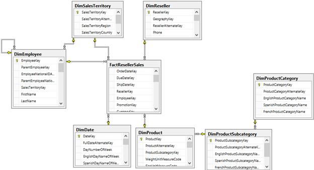

图 12: AdventureWorksDW2012 模式

要求是为经销商销售数据集市设计一个表格数据模型，以便业务分析师可以使用 Power View 或 Excel 对销售数据进行动态排序，以获取报告进行分析。

让我们从在 SSDT 开发我们的分析服务表格项目开始，了解数据建模的方法。

## 开始分析服务表格项目

与多维数据集类似，SQL Server 数据工具(SSDT)用于设计和开发 SSAS 表格模型多维数据集。在安装 SSAS 期间，当我们到达分析服务的服务器配置页面时，可以选择多维模式或表格模式。给定的 SQL Server 实例可以让分析服务处于多维模式或表格模式。但是，如果我们需要在服务器上安装两种模式的 SSAS，我们将需要安装两个 SQL Server 实例(再次运行安装程序来安装另一个实例)。

在我的开发工作站上，我安装了一个默认的 SQL Server 实例，其中包含数据库引擎、多维模式下的 SSAS、SSRS 和共享组件，我还安装了一个命名的 SQL Server 实例(table)来安装 SSAS table 模型。

安装完成后，当我们启动 SSDT 并点击**新建项目**时，我们会看到以下可供商业智能使用的模板:


图 13:商业智能项目模板

**分析服务表格项目**是 SSDT 提供的新模板。

在**新项目**窗口中，我们命名我们的项目 **AdventureWorks 经销商销售**并点击**确定**创建项目。将出现以下窗口。


图 14:表格模型设计器

**表格模型设计器**要求我们提供 SSAS 表格实例名称，在项目开发过程中，该名称将用作工作区服务器。在开发阶段，当我们将数据处理到数据模型中时，它实际上会存储在工作区 SSAS 实例中创建的临时数据库中。

理解工作区服务器不是将部署表格模型多维数据集的实例很重要；部署实例将是独立的，需要单独指定，我们将在部署期间进一步讨论。

无论何时创建或打开表格项目，工作区数据库都会保存在服务器的 OLAP \数据目录中。随着时间的推移，该文件夹可能会因临时数据库而变得臃肿。有时你需要扔掉那些你不再需要的东西。为此，您需要文件系统访问权限。因此，最好选择一个可以清理的工作区数据库服务器。这不是必需的，但您的服务器管理员会感谢您。

在表格模型设计器的第一个屏幕中，我们提供我们的 SSAS 表格实例名称，并单击**测试连接**以确保我们能够连接到工作区服务器。如果测试连接失败，或者提供的服务器名称不正确，或者由于防火墙或其他原因无法访问服务器，或者您登录时使用的 Windows 凭据没有 SSAS 实例的权限。

在此屏幕中，我们还有一个**兼容级别**菜单，其中有两个可用值(在撰写本书时):

*   SQL Server 2012 RTM (1100)
*   SQL Server 2012 SP1 (1103)

每个表格模型数据库都与它所兼容的一个版本的 SQL Server 相关联，并且可以部署到该版本的 SQL Server。如果我们正在开发将被部署到 SQL Server 2012 SP1 实例的表格数据模型，我们应该选择兼容级别为 SQL Server 2012 SP1 (1103)，反之亦然。

指定工作区服务器和兼容级别详细信息后，点击**确定**。创建解决方案，打开一个名为 Model.bim 的空文件，如下图所示。

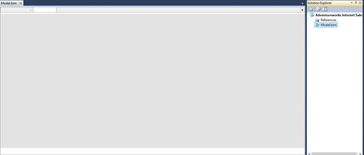

图 15:新项目

## 将数据导入表格模型

如前所述，设计数据模型的第一步是确定数据的数据源。对于给定的需求，AdventureWorksDW2012 文件中提供了所有必需的数据。

要从数据源导入数据，在 SSDT，点击**从数据源导入**按钮，这是左上角工具栏中的第一个选项，如下图所示。

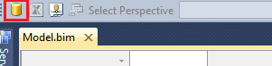

图 16:从数据源导入按钮

点击**从数据源导入**按钮，弹出**表导入向导**，显示所有支持的数据源。


图 17:表格模型支持的数据源

如上图所示，表格模型项目支持多种数据源，包括关系数据库、SQL Azure、多维数据集、平面文件和数据馈送。

选择**微软 SQL Server** ，点击**下一步**。在下一个屏幕中，我们通过提供服务器名称并在**数据库名称**下拉列表中选择**adventureworksdnli**(这是我们的 AdventureWorksDW2012 数据库)来提供 SQL Server 的连接字符串。我们提供了一个**友好连接名称**作为**adventureworkdw**，以便于识别数据源。

|  | 注意:在我的所有演示和实验中，我都使用了 AdventureWorksDWDenali 数据库，该数据库在 SQL 2012 的 CTP 版本中作为示例数据库提供。当您从 CodePlex 站点下载最新的 AdventureWorksDW2012 时，数据库名称将是 AdventureWorksDW2012，并且数据可能与本书中显示的演示和实验不同。 |

在进入下一个屏幕之前，单击**测试连接**以确保与数据库的连接成功并且不会导致任何错误，这一点很重要。


图 18:设置数据库连接

接下来，我们需要提供 Windows 凭据，这些凭据将存储在表格模型多维数据集中，并将用于连接到 AdventureWorksDW2012 数据库，以将数据移动到数据模型的表中。

如果 SSAS 服务帐户具有从数据源读取数据的权限，我们可以选择**服务帐户**选项，该选项不需要我们显式提供凭据。如果服务帐户是域帐户并且对数据源(可能在远程服务器上)具有权限，这可能是首选方法。


图 19:设置分析服务凭据

下一个屏幕允许我们通过选择表或编写 SQL 查询来直接导入数据，如果我们想要连接多个表并将数据导入到单个表中，这可能会很有用。点击**从表格**列表中选择进入下一步。

在这一步中，我们选择要导入的单个表，并提供一个用户友好的名称，这将是数据模型中导入的表的名称。

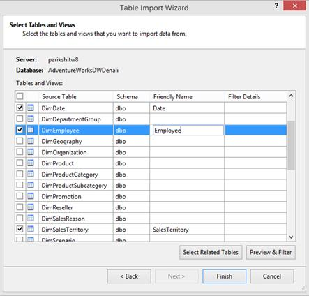

图 20:选择要导入的表

对于我们的数据模型，我们选择以下表格并提供以下名称。

| 源表 | 名字 |
| DimDate | 日期 |
| 维度员工 | 雇员 |
| DimSalesTerritory | 销售区域 |
| FactResellerSales | ResellerSales |

对于销售区域，我们通过点击**销售区域**表，选择**预览和过滤**选项，过滤出销售区域可选列，如下图所示。

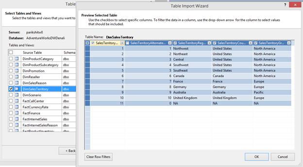

图 21:从 DimSalesTerritory 表中筛选列

在同一个窗口中，我们可以通过单击每个列标题旁边的下拉列表并选择需要过滤的框来设置行过滤器。

为了提高处理时间和节省存储空间，总是建议过滤掉不需要的列和行。

在我们的场景中，我们也有许多这样的列可以在每个表中过滤掉，但是为了简单起见，我们将只过滤掉 DimSalesTerritory 中的一列，如下图所示。

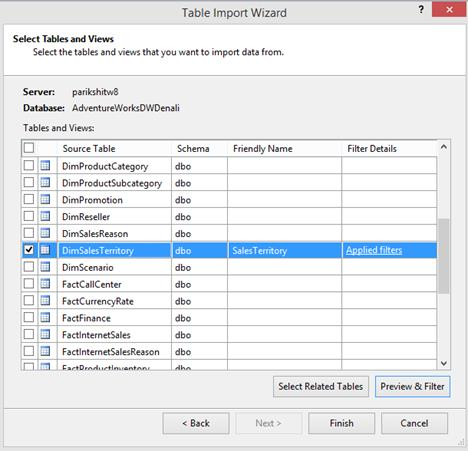

图 22:过滤后的销售区域来源

一旦我们选择了所有需要的表并应用了必要的过滤器，我们就可以单击**完成**将数据导入数据模型中的表中。对于 SQL Server 数据源，我们还将关系与数据一起导入，这在最后一步数据准备中是可见的。对于其他数据源，我们需要在数据模型中手动创建关系。

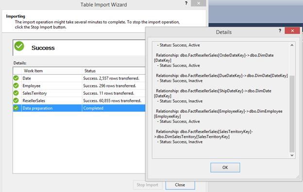

图 23:导入数据

接下来我们需要导入表 **DimProduct** 、 **DimProductSubCategory** 和 **DimProductCategory** ，但是我们不需要将它们作为三个单独的表导入。相反，我们希望将这三个表反规范化为一个称为列的表。

为此，我们需要再次启动**表导入向导**，通过编写一个连接三个表并导入所需列的 SQL 查询来导入表。

由于我们已经创建了到 AdventureWorksDW2012 的连接，我们可以单击工具栏上的**现有** **连接**选项来启动表格导入向导，如下图所示。


图 24:现有连接按钮


图 25:现有连接列表

选择**adventureworkdw**，然后点击**打开**。下一个窗口将为您提供如何导入数据的选项。选择**写一个查询，指定要导入的数据**选项。


图 26:数据导入选项

接下来，我们键入以下 TSQL 查询，该查询从多个表(DimProduct、DimProductCategory 和 DimProductSubCategory)中导入数据。

```
    SELECT
    DimProduct.ProductKey
    ,DimProduct.EnglishProductName
    ,DimProduct.Color
    ,DimProduct.[Size]
    ,DimProduct.Weight
    ,DimProduct.LargePhoto
    ,DimProductCategory.EnglishProductCategoryName
    ,DimProductSubcategory.EnglishProductSubcategoryName
    FROM
    DimProductSubcategory
    INNER JOIN DimProduct
    ON DimProductSubcategory.ProductSubcategoryKey = DimProduct.ProductSubcategoryKey
    INNER JOIN DimProductCategory
    ON DimProductSubcategory.ProductCategoryKey = DimProductCategory.ProductCategoryKey

```

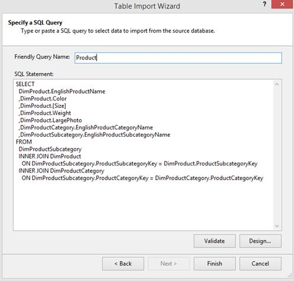

图 27:键入查询从多个表中导入数据

命名表格**产品**，点击**完成**导入数据。

|  | 注意:出于开发目的，在 SSDT 设计表格模型时，建议只导入原始数据库的子集，因为所有数据处理都驻留在工作区服务器实例上的临时工作区数据库中。 |

我们现在已经将以下五个表从数据源导入到表格模型中:


图 28:导入的表

## 修改或删除导入的表

如果您对从表中导入的表或列不满意，可以删除表或修改其列。首先，单击窗口底部要更改的表格选项卡。下图显示了所选的经销商销售表。接下来，点击菜单中的**表格**选项。顾名思义，**删除表格**选项允许您删除表格，而选择**表格属性**允许您修改表格或用于导入表格的 TSQL 查询。


图 29:删除表格

## 修改或删除表中的一列

我们可以在导入列后对其进行重命名、过滤或删除，方法是选择该列并右键单击它，如下图所示。

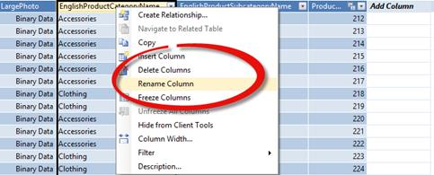

图 30:修改列

在我们的数据模型中，我们导入了所有的表，但是我们不能提供列名(我们可以通过使用列别名在 SQL 查询中提供列名，这在之前的查询中是没有的)。将数据导入表中后，将列重命名为用户友好的名称非常重要，因为数据模型将按原样向最终用户公开。

我们将用新的、用户友好的名称重命名以下列:

| 桌子 | 源列名 | 用户友好的列名 |
| --- | --- | --- |
| 产品 | 英语产品类别名称 | 积范畴 |
| 产品 | 英语产品子类别名称 | 产品子类别 |
| 产品 | 英语产品名称 | 产品 |
| 销售区域 | SalesTerritoryRegion | 地区 |
| 销售区域 | 销售地区国家 | 国家 |
| 销售区域 | 销售区域组 | 组 |
| 日期 | 英语月名称 | 月 |

同样，使用表导入向导，我们可以从各种其他数据源导入数据。

以下是表格数据模型支持的数据源列表:

| 来源 | 版本 | 文件类型 | 提供者 |
| --- | --- | --- | --- |
| 访问数据库 | 微软 Access 2003，2007，2010 | 。accdb 或。mdb 文件 | ACE 14 OLE 数据库提供程序 |
| 关系数据库 | 微软 SQL Server 2005、2008、2008 R2；SQL Server 2012，微软 SQL Azure 数据库 2 | 不适用的 | SQL 服务器的 OLE 数据库提供程序SQL Server 本机客户端 OLE 数据库提供程序SQL Server 本机 10.0 客户端 OLE 数据库提供程序。面向 SQL 客户端的. NET 框架数据提供程序 |
| SQL Server 并行数据仓库(PDW) 3 | 2008 年 R2 | 不适用的 | PDW 的 OLE 数据库提供程序 |
| Oracle 关系数据库 | Oracle 9i、10g、11g | 不适用的 | Oracle OLE 数据库提供程序。面向甲骨文客户端的. NET 框架数据提供程序。的. NET 框架数据提供程序奥拉奥莱德MSDASQL |
| Teradata 关系数据库 | Teradata V2R6，V12 | 不适用的 | 提供程序。Teradata 的. NET 数据提供程序 |
| Informix 关系数据库 |  | 不适用的 | Informix OLE 数据库提供程序 |
| IBM DB2 关系数据库 | Eight point one | 不适用的 | DB2OLEDB(数据库服务器) |
| Sybase 关系数据库 |  | 不适用的 | Sybase OLE 数据库提供程序 |
| 其他关系数据库 | 不适用的 | 不适用的 | OLE 数据库提供程序或 ODBC 驱动程序 |
| 文本文件 | 不适用的 | .txt、.tab、.csv | 面向微软访问的 ACE 14 OLE 数据库提供程序 |
| Microsoft Excel 文件 | excel 97–2003、2007、2010 | 。xlsx，xlsm .，。xlsb .，。xltx ..。xltm | ACE 14 OLE 数据库提供程序 |
| PowerPivot 工作簿 | 微软 SQL Server 2008 R2 分析服务 | xlsx，xlsm .，。xlsb .，。xltx ..。xltm | ASOLEDB 10.5(仅用于发布到安装了 SharePoint PowerPivot 的 SharePoint 场的 power pivot 工作簿) |
| 分析服务多维数据集 | 微软 SQL Server 2005，2008，2008 R2 分析服务 | 不适用的 | ASOLEDB 10 |
| 数据馈送(用于从报告服务报告、Atom 服务文档、Microsoft Azure Marketplace 数据市场和单一数据馈送中导入数据) | Atom 1.0 格式作为视窗通信基金会(WCF)数据服务(前 ADO.NET 数据服务)公开的任何数据库或文档。 | 。用于定义一个或多个提要的服务文档的 atomsvc。atom 网页提要文档的 Atom | Microsoft power pivot 数据馈送提供程序。NET 框架数据馈送数据提供程序 |
| 办公室数据库连接文件 |  | 。其它直接费用(other direct costs) |  |

在本节中，我们将数据从数据源导入到数据模型中。在下一节中，我们将设计层次结构、关系和关键绩效指标，以增强报告模型。

## 定义关系

一旦在数据模型中导入了所有需要的数据，并且应用了相关的过滤器之后，我们接下来应该定义表之间的关系。

与使用关系定义约束(主键或外键)的关系数据库管理系统不同，我们将在表格数据模型中定义关系，以便在定义计算列和度量时在 DAX 公式中使用它们。在定义纯粹依赖于关系的计算时，会用到一些 DAX 公式，如 USERELATIONSHIP、RELATED 和 RELATEDTABLE。

从 SQL server 数据源导入数据时，当我们从 SQL 数据库中选择多个表时，表导入向导会自动检测数据库中定义的关系，并在数据准备阶段将其与数据一起导入。对于其他数据源，我们需要在数据导入后手动创建关系。

在本例中，由于我们通过再次运行表导入向导导入了产品表，因此不会自动导入产品表的关系。我们需要手动创建关系。

有两种方法可以建立关系。

第一种方式，我们点击**经销商销售**表，该表有外键 ProductKey 列，点击**表**选项卡，选择**创建关系**，如下图所示。


图 31:创建关系菜单项

这将打开“创建关系”窗口。我们可以提供**相关查找表**和**相关查找列**，如下图所示。

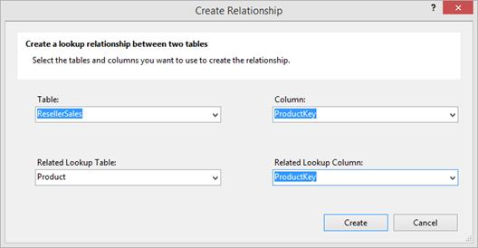

图 32:创建关系窗口

我们也可以使用图表视图定义关系。我们可以通过点击项目右下角的**图**选项切换到图视图，如下图所示。

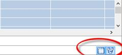

图 33:图表视图选项

在图表视图中，我们可以将 **ResellerSales** 表中的 **ProductKey** 列拖动到 **Product** 表中的 **ProductKey** 列，将创建如下图所示的关系。

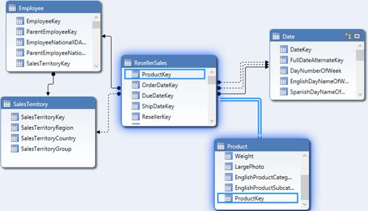

图 34:使用图表视图创建关系

图表视图对于查看所有表及其关系非常有用，尤其是当我们处理大型复杂的数据集市时。

在图表视图中，连接表的实线称为活动关系，连接表的虚线称为非活动关系。

当一个表与具有多个关系的另一个表相关联时，我们会看到不活动的关系。例如，在前面的图表中，日期表是一个角色扮演维度，因此它与经销商销售表有多种关系(订单日期键、到期日期键和关闭日期键)。在这种情况下，只有一个关系可以被认为是活动的，它将被 RELATED 和 RELATEDTABLE DAX 函数使用，而另外两个关系被认为是不活动的，可以与 UseRelationship DAX 函数一起使用。

我们可以通过右键点击点状非活动关系，选择**标记为活动**，将非活动关系切换为活动关系，如下图所示。

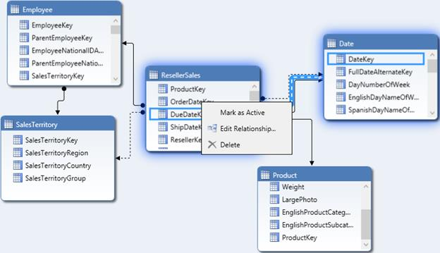

图 35:将关系更改为活动的

既然我们已经定义了关系，我们将学习如何定义层次结构。

## 定义层次

当用户从高级聚合数据导航到详细数据时，层次结构对于分析非常有用。因此，多维数据集或数据模型支持创建层次结构以允许用户向下钻取或向上滚动数据是很重要的。大多数维度表都包含分层数据。

例如，时间维度可以有层次结构:年>学期>季度>月>周>日。地理维度的层次结构可以是国家>州>城市。

层级的特征是:

*   它包含从父级到子级的多个级别。
*   每个家长可以有多个孩子，但一个孩子只能属于一个家长。

在我们的数据模型中，我们可以有以下层次结构:

| 桌子 | 等级制度 |
| --- | --- |
| 产品 | 产品类别>产品子类别>产品 |
| 日期 | 日历年>日历学期>日历季度 |
| 日期 | 财政年度>财政学期>财政季度 |
| 销售区域 | 组>国家>地区 |

为了创建层次结构，我们需要切换到图表视图。在图表视图中每个表的标题处，我们看到一个创建层次结构的选项。

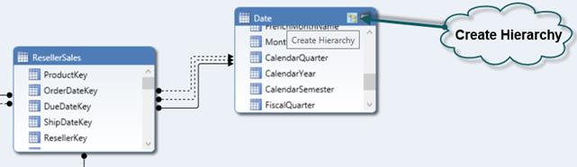

图 36:在图表视图中创建层次按钮

当我们点击**创建层次**时，它会创建一个新的层次对象，我们将其命名为**日历层次**，如下图所示。

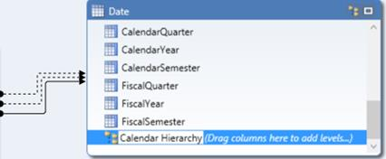

图 37:创建新的层次结构

接下来，我们将**日历年**列从表中拖动到**日历层次结构**中，然后是**日历月份**和**日历季度**组成日历层次结构，如下图所示。

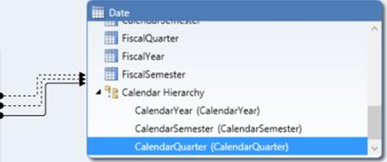

图 38:创建日历层次结构

同样，我们创建了财务、产品和地理层次结构。


图 39:财政、地理和产品层次结构

## 定义计算列

计算列只不过是使用 DAX 公式定义的派生列。计算列在行上下文中计算，或者换句话说，在表的每一行中计算。

在我们的数据模型中，我们有一个雇员表，其中每个雇员的名字、中间名和姓氏被捕获在一个单独的列中。然而，对于报告和分析来说，用全名(名字+中间名+姓氏)代表员工是有意义的。为此，我们在员工表中定义了一个名为“姓名”的计算列来连接每个员工的名字、中间名和姓氏。

要添加计算列，我们转到 Employee 表并向右滚动，直到到达最后一列。在最后一列之后的列中，我们可以开始键入我们的 DAX 公式来定义计算列。

```
    =Employee[FirstName] & " " & Employee[MiddleName] & " " & Employee[LastName]

```

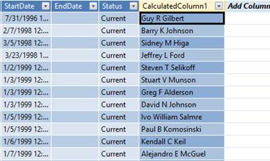

图 40:添加计算列

默认情况下，该列将被命名为 CalculatedColumn1，如前所述，我们需要通过右键单击该列将其重命名为 **Name** 。

在我们的数据模型中，日历季度和财政季度由数值 1、2、3 和 4 表示；但是，从报告的角度来看，季度表示为 Q1、Q2、第三季度和第四季度。因此，我们使用以下 DAX 公式定义计算列:

```
    ="Q" & 'Date'[FiscalQuarter]
    ="Q" & 'Date'[CalendarQuarter]

```

## 定义计算度量

计算度量是在维度层次结构的不同维度和级别上聚合的感兴趣的度量。

在我们的数据模型中，ResellerSales 表源自一个事实表，该事实表由用于查找维度表的键列和需要聚合的度量列组成。经销商销售额表中的一个重要指标是销售额，它需要在各个维度上进行汇总。因此，我们需要定义一个名为“销售额”的计算度量来计算销售额的总和。

需要在度量网格中定义计算度量，如图 41 所示，该网格在表选项卡下面的部分可见。我们使用以下 DAX 公式来定义计算的度量销售。

```
    Sales:=SUM(ResellerSales[SalesAmount])

```

|  | 注意:此时不要担心 DAX 语法。我们将在下一章详细介绍 DAX。 |

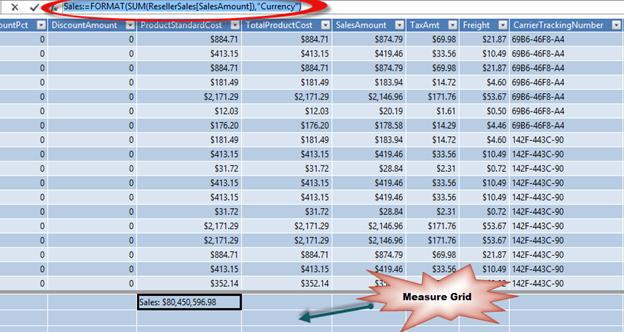

图 41:在度量网格中定义计算度量

接下来，我们使用以下 DAX 公式定义计算的度量成本、利润和利润。

```
    Cost:=SUM(ResellerSales[TotalProductCost])
    Profit:=[Sales]-[Cost]
    Margin:=([Profit]/[Cost])*100

```

如下图所示，将计算度量格式化为货币和百分比格式将在本书后面解释。

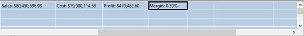

图 42:带有单位格式的度量

我们将在下一章学习 DAX 时定义更多的计算度量。在下一节中，我们将学习如何定义关键绩效指标。

## 定义关键绩效指标

关键绩效指标是衡量标准和目标之间关系的图形和直观表示。

如下图所示，关键绩效指标是状态或趋势指标，可用于突出衡量指标与目标的偏差。

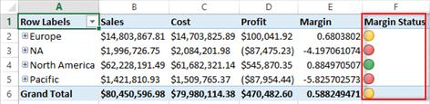

图 43:kris

在我们的数据模型中，我们定义了计算度量 Margin，它计算利润占成本的百分比。现在，组织希望建立一个 KPI，这样，如果利润超过成本的 0.8%，则被认为是好的，如果利润在 0.4%到 0.8%之间，则利润适度良好或平均，如果利润低于 0.2%，则被认为是差的。

为了分析利润，我们通过选择定义利润的单元格来定义一个关键绩效指标，右键单击它，然后选择**创建关键绩效指标**，如下图所示。


图 44:创建关键绩效指标选项

在 KPI 窗口中，已经选择了 Margin 度量，我们可以通过点击**绝对值**选项，将目标值设置为“1”，将目标或指标设置为绝对值，如下图所示。然后，我们将状态阈值选择为下带 0.2，上带 0.8，并将关键绩效指标图标样式选择为红色、黄色和绿色圆形指示器。


图 45:设置关键绩效指标

一旦我们单击**确定**，就在数据模型中为利润度量创建了关键绩效指标。为了验证关键绩效指标，我们可以点击项目左上角工具栏中的 **Excel** 图标，在 Excel 中浏览数据模型:


图 46:在 Excel 中分析选项

这将打开一个身份验证窗口，如下图所示。我们需要使用**当前窗口用户**选项登录并打开 Excel，点击**确定**。本书后面将介绍身份验证和安全性。

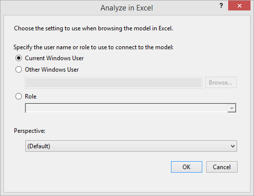

图 47:在 Excel 中分析数据模型的用户选项

Excel 将打开一个数据透视表和一个到模型的数据连接。在**数据透视表字段**窗口中，我们可以将地理层次拖动到**行**区域，并将销售、成本、关键绩效指标值、利润和关键绩效指标状态拖动到**值**区域，如下图所示。生成的 Excel 报告如下:

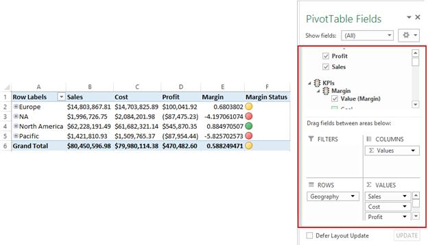

图 48:在 Excel 中分析的数据模型

## 过滤数据模型

有两种方法可以过滤行数据:

*   从数据源导入时筛选数据
*   从表中导入后过滤数据

第一种选择是首选方法；从数据源导入时过滤数据将有助于减少处理时间和存储需求。在[导入数据](#_Import_data_to)部分，我们讨论了各种过滤器选项。在本节中，我们将讨论在数据加载到数据模型中之后对数据进行过滤。

加载数据后，根据列的数据类型，我们可以有以下过滤器:

*   数字过滤器
*   文本过滤器
*   日期过滤器

要根据任何列筛选行，我们需要单击列旁边的下拉箭头来查看筛选选项。


图 49:数字过滤器选项


图 50:日期过滤器选项


图 51:文本过滤器选项

如前图所示，当我们单击数字列“日期键”时，我们会看到数字过滤器，当我们单击日期列“完整日期”时，我们会看到日期过滤器，当我们单击文本列“英语日期名称”时，我们会看到文本过滤器。

如果我们为表中的任何列定义一个筛选器，我们会在列标题旁边看到以下图标:

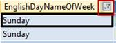

图 52:过滤后的列标题

如果我们想为某个需求暂时过滤数据并在以后删除它，那么过滤数据模型中的数据可能是一个不错的选择。

## 对数据模型进行排序

如上图所示，单击列标题上的下拉列表会打开一个选项，以升序或降序对列进行排序。

根据列的数据类型，下列选项可用于排序。

| 数据类型 | 升序选项 | 降序选项 |
| --- | --- | --- |
| 数字 | 最小到最大 | 从大到小 |
| 文本 | 手册 | 从 z 到 A |
| 日期 | 从老到新 | 从最新到最老 |

除了这些排序选项，我们还有其他选项可以根据另一列的值对一列进行排序。这些非常有用，事实上在某些场景中是必需的。

在我们的数据模型中，日期表中有一个月列。“月”列是文本数据类型，如果我们尝试根据其自身的数据值对“月”列进行排序，我们将看到以下报告:

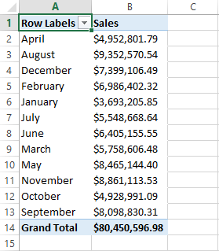

图 53:排序的月份列

在此报告中，数据按月值以升序排序，四月在顶部，九月在底部，但这不是我们想要的。我们希望“月份”列根据全年月份的顺序进行排序，而不是按字母顺序。为此，我们需要基于 MonthNumberOfYear 列进行排序。

为此，我们使用**按列排序**选项，如下图所示:


图 54:按列排序按钮


图 55:按列排序选项

我们选择**月**列，点击**按列**排序，选择**月**作为**按列**。这将按月对月份列进行排序，并按预期顺序给出报告。


图 56:月列按月数年列排序

## 总结

在这一章中，我们学习了使用 SSDT 用 SSAS 表格模型开发数据模型。在下一章中，我们将关注 DAX 语言，它用于定义计算列和度量，以及表格模型的查询语言。