# 第五章用权力视角探索数据模型

在前几章中，我们学习了如何使用 SSAS 表格模型来设计、开发和部署数据模型。在本章中，我们将学习如何使用 SQL 2012: Power View 中引入的报告工具来探索数据模型。Power View 是一个新的、基于 Silverlight 的特别报告工具，它有一套丰富的可视化工具，可用于数据探索和分析。

当 SQL 2012 引入 Power View 时，它仅在 SharePoint 2010 和 SharePoint 2013 支持的 SharePoint 集成模式下可用。随着 Excel 2013 的推出，Power View(和 PowerPivot)现在作为 COM 外接程序本机集成到 Excel 中，并可用于报告。带有高级视图报告的 Excel 2013 工作表可以上载到 SharePoint 2013 文档库，也可以由浏览器中带有 SharePoint 的 Excel Services (Excel Web 应用程序)呈现。

SharePoint 和 Excel 2013 中 Power View 的界面类似。在本章中，我们将使用 Excel 2013 设计 Power View 报告，但这里讨论的大多数步骤也适用于 SharePoint。

## 在 Excel 2013 中创建到数据模型的连接

设计报表的第一步总是创建到模型的数据连接。在 Excel 2013 中，我们点击工具栏中的**数据**选项卡，从**其他来源**按钮中选择**分析服务**，如下图所示。

图 115:将 Excel 连接到分析服务

在数据连接向导中，我们在**服务器名称**下提供 SSAS 实例名称，并使用 Windows 身份验证。在下一个屏幕上，我们从下拉列表中选择数据库，并从我们打算连接的数据模型中选择立方体或透视图，如下图所示。

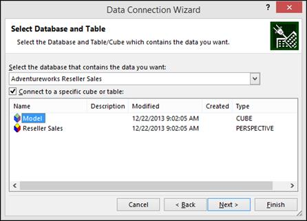

图 116:连接到立方体

向导的最后一个屏幕用于为。odc 文件，以及关于数据模型的简要描述。如果 Excel 文件上传到 SharePoint 文档库中，并且要在浏览器中使用 Excel web 应用程序进行查看，我们还可以选择要使用的身份验证设置。

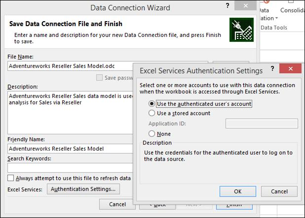

图 117:设置身份验证细节

当我们单击**完成**时，我们可以选择将数据模型导入到 Excel 工作簿中。在 Excel 2013 之前，我们只能选择创建数据透视表或数据透视图。使用 Excel 2013，我们还可以看到电源视图报告选项。选择**电源视图**，如下图所示。

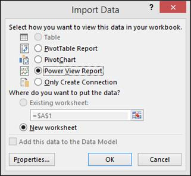

图 118:在 Excel 中创建电源视图报告

我们可以点击**属性**按钮修改数据刷新设置，在 Excel 工作表中指定何时刷新数据，在使用选项卡中修改其他 OLAP 设置。在“定义”选项卡中，我们可以看到前面指定的连接字符串。

图 119:连接属性

单击**确定**关闭属性窗口，然后再次单击**确定**，选择**电源视图报告**选项，在单独的工作表中创建电源视图报告，如下图所示。

图 120:新电源视图报告

对于 SharePoint 中的 Power View，我们需要创建一个 BISM 连接文件，该文件再次定义了数据模型的连接字符串。

## 电源视图可视化

Power View 设计为具有丰富的可视化功能，非常直观，因此用户只需点击几下鼠标就能设计出一份报告，而且数据格式本身应该能够识别出最好的可视化来表示它。只有设置正确的属性，包括默认字段集、表行为、格式、汇总和数据类别，这才是可能的，我们在[第 4 章](4.html#_Setting_the_Default)中讨论过。

在接下来的章节中，我们将讨论 Power View 提供的所有可视化选项，以及哪种数据类型最适合每种可视化。

### 在电源视图中用表格可视化数据

报表中最简单和最重要的数据可视化工具之一是表格可视化，因为大多数结构化数据可以以表格格式进行最佳分析和解释。默认情况下，Power View 以表格格式表示大多数数据类型，如果需要，我们可以在以后切换到其他可视化方法。

为了可视化数据，我们首先需要从 Power View 报告右侧的字段列表中按顺序选择数据。首先，我们选择产品层次结构，然后选择销售和利润指标，如下图所示。

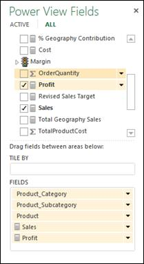

图 121:选择要可视化的数据

“电源视图”工作区窗口中的结果表报告如图 122 所示。

图 122:电源视图中的表格可视化

默认情况下，表格可视化会汇总行，并在表格底部显示总计，如下图所示。

图 123:表格数据可视化中的汇总行

如果不想要报表中的总计，可以打开功能区的**设计**选项卡，点击**总计**，选择**无**。

图 124:关闭总计

如果我们需要根据任何一列对表格进行排序，我们可以点击列标题，它会按升序对表格进行排序。再次单击列标题，按降序对表格进行排序。

图 125:对列进行排序

我们还可以表示 KPI 数据，这是仪表板报告的常见要求。

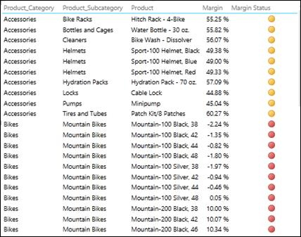

图 126:电源视图表报告中的关键绩效指标

### 在电源视图中使用矩阵可视化数据

矩阵可视化是另一种流行的可视化方法，用于使用行分组和列分组跨多个维度分析度量。为了使用它，我们首先从字段列表中选择我们想要在矩阵中可视化的所有数据字段。

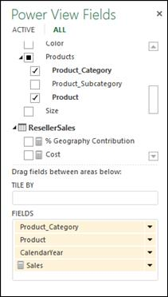

图 127:选择要可视化的数据

正如我们之前了解到的，默认情况下，从字段列表中选择数据会创建一个表格报告。切换到矩阵可视化，选择表格，打开功能区**设计**选项卡，点击**表格**，选择**矩阵**。

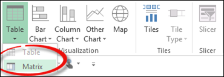

图 128:矩阵可视化选项

切换到矩阵可视化将度量值放在字段列表的值区域，所有维度列放在行区域。我们现在将 CalendarYear 移动到 Columns 区域，形成一个矩阵报表，如下图所示。

图 129:电源视图中的矩阵报告

默认情况下，Power View 汇总行和列的度量，以计算行总计和列总计，行总计和列总计用粗体表示，如上图所示。如前所述，我们可以使用“设计”选项卡和“总计”选项卡关闭行总计和/或列总计。

如果需要在行层次中启用向下钻取来初始隐藏子级别，可以点击**设计**选项卡中的**显示级别**按钮，选择**行–启用向下钻取** **一次一个级别**，如下图所示。

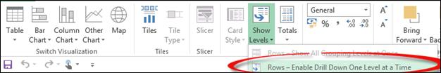

图 130:最初隐藏子级

这将创建一个展开报告，该报告最初是折叠的，隐藏了层次结构的所有子级。在我们的矩阵报告中，最初我们只在行级别看到产品类别。当我们单击“附件”值时，我们会看到一个向下钻取的箭头，如下图所示。当我们单击箭头时，数据被钻取到子级，在我们的例子中是产品级，带有向上钻取箭头，允许我们向上钻取到父级。

图 131:向下钻取和向上钻取选项

### 在电源视图中用卡片可视化数据

卡片可视化是一种独特而创新的可视化，可用于可视化实体的相关数据、属性或属性。例如，员工姓名、年龄、性别和婚姻状况字段可以一起显示在卡片中。同样，产品名称、重量、尺寸、颜色和照片可以以卡片格式可视化，在报告中显示为目录。

要使用卡片可视化，我们首先从字段列表中选择我们希望在卡片视图中看到的所有字段。

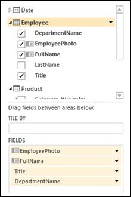

图 132:字段列表

接下来，我们打开功能区的**设计**选项卡，点击**表格**项，选择**卡片**。

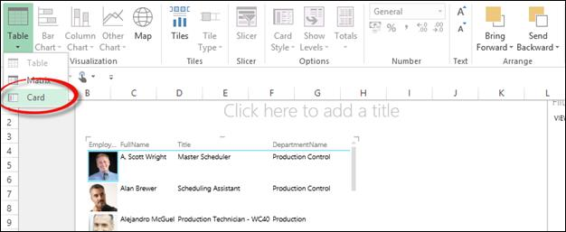

图 133:选择卡片可视化

在卡片可视化中，数据如下图所示:

图 134:卡片可视化

如果需要调出报表中的这些字段，可以点击**设计**页签中的**卡片样式**按钮，选择**标注**，将卡片样式切换到标注模式，如下图所示。

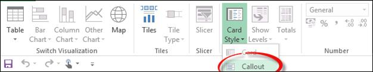

图 135:将卡片样式更改为标注模式

图 136:启用标注模式的卡片可视化

### 在电源视图中使用图表可视化数据

Power View 提供了一套丰富的图表可视化工具，从柱形图和条形图到散点图。不同的图表对于分析和比较不同维度的数据非常有用。在本节中，我们将探讨各种可用的图表可视化方法。

首先，我们从字段列表中选择所有需要可视化的字段，如下图所示。

图 137:选择要绘制的字段

我们切换到如下图所示的**设计**选项卡中的**堆叠柱**图表。

图 138:选择堆叠柱形图

我们将**年**、**季度**、**月**字段拖入**轴**框，将**图例**选项设置为**国家**，如下图所示。

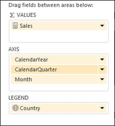

图 139:为图表设置轴、图例和值字段

结果图如图 140 所示。

图 140:电源视图中的堆叠柱形图

在横轴中，我们有年、季度和月的层次结构；但是，默认情况下，我们只能可视化父级。为了深入到季度级别，我们需要双击一个列栏。当我们双击 2003 栏时，我们会看到下图。

图 141:在 2003 列中向下钻取(向上钻取箭头被圈起来)

这些数据现在分布在 2003 年的各个季度。我们可以通过单击上图中圈出的箭头向上钻取。我们可以通过双击一个季度的列栏来进一步深入到月份级别。

在这种数据表示中，我们可以比较同一层级成员之间的销售额。例如，我们可以使用柱形图来比较给定年份的年份或季度水平，但不能比较不同年份的季度。

如果需要比较不同年份各季度的销售额，可以将**日历年**移到**水平倍数**部分，如下图所示。

图 142:重新组织柱形图

结果图形如下图所示。

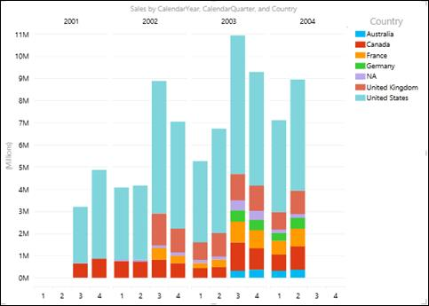

图 143:柱状图中不同年份之间的季度比较

如果我们需要关闭图例，改变图例的位置，或者打开数据标签，我们可以从顶部的**布局**选项卡进行。

图 144:启用数据标签

如果我们不关心绝对销售额，但希望可视化每个国家对每个季度销售额的贡献，我们可以切换到 100%堆叠柱形图来比较每个国家的相对贡献。生成的图形是:

图 145: 100%堆叠柱形图

这张图表解释了 2003 年销售额的增长是由于包括德国、澳大利亚和法国在内的某些国家对总销售额的贡献增加。

我们可以切换到聚集柱形图，它不太紧凑，因为它将图例移动到顶部以节省一些水平空间，但对于比较每个国家的绝对销售额非常有用。要将图例移到顶部，请单击**布局**选项卡，单击**图例**，并选择**在顶部显示图例**。

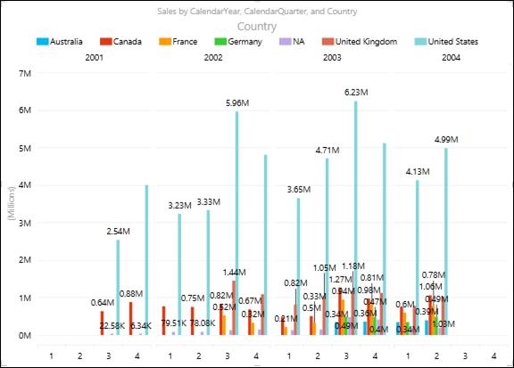

图 146:图表顶部的图例

从图 146 的图表中，我们了解到美国第三季度的销售额很高，2003 年第三季度的销售额最高。

与柱形图类似，我们也有水平条形图，即堆积条形图、100%堆积条形图和聚集条形图。我们用柱形图绘制的相同信息在下图中显示为条形图。

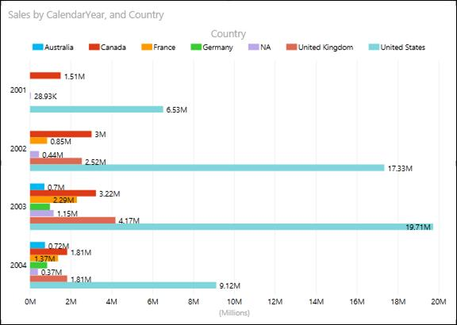

图 147:条形图

如果我们观察条形格式的相同信息，我们会发现它看起来没有列格式那么杂乱。条形图更容易用于视觉比较。

同样，如果我们需要研究不同产品类别的销售、成本和利润值在几个月内的趋势，我们可以使用如图 148 所示的带有字段的折线图。

图 148:为折线图选择字段

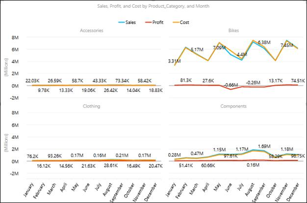

图 149:折线图

这张图表显示了自行车有趣的统计数据；尽管自行车图表显示 5 月至 8 月销售良好，但在此期间自行车的成本也较高，这解释了这一产品类别的损失。折线图在类似的趋势分析和图表报告中很受欢迎。

饼图是另一种图形工具，可用于分析每个部门在总量中的份额或贡献。在设计数据模型时，我们为“地理贡献百分比”创建了一个计算度量，以衡量每个地区对总销售额的贡献。这一衡量标准最好用饼图来表示。

图 150:在饼图中选择要绘制的度量

图 151:饼图

目前，饼图的主要局限性之一是缺少数据标签。

最令人印象深刻的图表可视化工具之一，气泡和散点图，允许我们跨多个维度或轴同时测量数据。考虑一个场景，其中我们需要衡量 AdventureWorks 各个产品类别中每个员工的销售额、销售目标和利润趋势的环比情况。这里，我们需要在员工、日期和产品维度上同时对销售、销售目标和利润度量进行切片和切片。我们可以使用如下图所示的气泡和散点图来实现这一点。

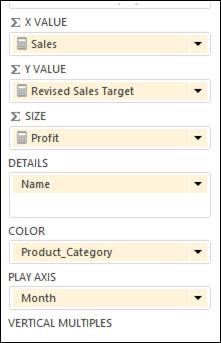

图 152:选择要在气泡图和散点图中绘制的字段

图 153:气泡图和散点图

在散点图中，x 轴显示一个数字字段，y 轴显示另一个数字字段，这样可以很容易地看到图表中所有项目的两个值之间的关系。

在气泡图中，第三个数字字段控制数据点的大小。为了查看数据随时间的变化，我们在散点图和气泡图中添加了一个带有“播放轴”的时间字段“月”

当我们单击图表中的播放按钮时，气泡会穿过月轴，不断增长和收缩，以显示利润如何根据播放轴而变化。我们可以在任何时候停下来更详细地研究数据。当我们点击图表上的一个气泡时，我们会在气泡随时间流逝的轨迹中看到它的历史，如上图所示。

我们将“产品类别”字段添加到散点图或气泡图的“颜色”框中，根据类别的不同值对气泡或散点进行不同的着色，覆盖气泡颜色。

### 在电源视图报告中使用地图可视化数据

使用 Power View 报告中的地图可以最好地可视化地理或空间数据。Power View 可以解释表格模型多维数据集中定义的每个字段的“数据类别”属性，我们在上一章中讨论过。数据类别为“国家”、“城市”和“地区”的字段非常适合以地图形式查看。

超级视图中的地图使用必应地图切片，因此您可以像缩放任何其他必应地图一样缩放和平移。为了使地图工作，Power View 必须通过安全的网络连接将数据发送给 Bing 进行地理编码，因此它要求您启用内容。因此，我们需要有一个互联网连接，以可视化地图在电力视图。

考虑这样一个场景，我们需要报告 AdventureWorks 在不同产品类别的不同销售区域的地理贡献百分比。我们选择所需的所有字段，并使用功能区上的设计选项卡切换到地图可视化。我们可以将数据表示如下:

图 154:选择要映射的字段

添加位置和字段会在地图上放置点。值越大，点越大。当您添加多值序列时，您会在地图上看到饼图，饼图的大小显示总计的大小，如下图所示:

图 155:地图可视化

在地图可视化中，除了图例和数据标签选项，我们还可以在布局选项卡中更改地图背景:

图 156:改变地图背景的选项

## 电源视图报告中的过滤和切片

### 通过图表可视化进行交互式过滤和突出显示

“超级视图”的一个独特功能是交互式过滤和图表可视化突出显示，这适用于报告中的所有其他可视化。

由于底层模型中的这些关系，图表可以充当过滤器。这是交互式筛选，意味着我们可以直接在图表上选择值，并让它筛选视图中的其他数据区域。如果我们在柱形图中选择一列，这将自动:

*   筛选报告中所有表格、切片和气泡图中的值。
*   为条形图和柱形图添加突出显示。它突出显示了其他条形图和柱形图中与该值相关的部分，显示了筛选值对原始值的贡献。

我们可以按住 Ctrl 键选择多个值。要清除过滤器，请在过滤器内部单击，但不要在值上单击。

交互式过滤也适用于具有多个系列的图表。单击条形图中的某个小节会过滤出该特定值。单击图例中的项目会过滤该系列中的所有部分。

请考虑 Power View 中的以下报告，其中我们在柱形图中按产品类别显示销售额，在条形图中按日历年显示销售额，在饼图中显示地理位置对销售额的百分比贡献。

图 157:带有柱形图、条形图和饼图的报表

现在，如果我们想知道组件类别每年的销售额以及每个国家对组件类别销售额的贡献，我们可以单击柱形图中的组件栏，报告将动态分割和过滤其他图表，仅突出显示组件类别的销售额。结果如下图所示。

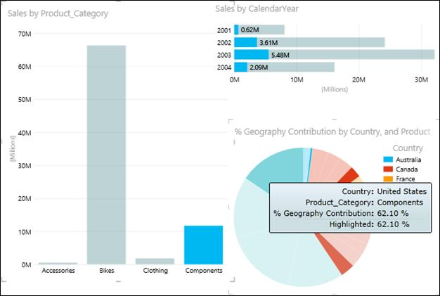

图 158:过滤后的图表数据

每个可视化中的这种交互式过滤适用于报告中的所有其他可视化，对于即席分析和报告是非常有用的功能。

### 过滤器

除了交互式过滤，我们还可以在“高级视图”报告的“过滤器”区域定义过滤器。我们可以对报告中的单个可视化应用过滤器，也可以对整个报告应用过滤器。要添加过滤器，我们需要将字段从**字段**列表拖放到**过滤器**区域。

让我们在过滤器区域添加产品类别作为过滤器，如下图所示。

图 159:向过滤器区域添加一个类别

在过滤器区域，我们为每个过滤器列出了不同的字段值，如图 159 所示。默认情况下，在过滤器中选择所有值。我们可以使用复选框来选择要查看的单个产品类别字段。如果需要重置过滤器，可以点击**清除过滤器**选项。要删除过滤器，我们可以点击**删除过滤器**选项，如下图所示。

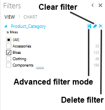

图 160:过滤器选项

我们还有一个高级筛选模式选项，当我们需要筛选具有大量唯一值的字段，并且通过单独选择值来筛选值是不切实际的时候，这个选项非常有用。

如果点击**高级过滤模式**，出现如下画面。

图 161:高级过滤器选项

在高级筛选模式中，我们可以使用 And 和 Or 运算符指定多个筛选条件。如果字段值满足条件，数据将显示在报告中。高级筛选选项根据要筛选的字段的数据类型而变化。

如果我们将高级筛选器应用于文本数据类型的字段，我们会看到以下选项。

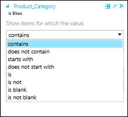

图 162:文本数据类型过滤器选项

我们可以在文本字段的可视化级别或视图级别的筛选器中搜索一个值，然后选择是否对其应用筛选器。匹配搜索文本的字段值部分在搜索结果列表中突出显示。搜索不区分大小写，因此搜索“自行车”会得到与“自行车”相同的结果。

我们也可以使用通配符，如问号(？)和星号(*)。问号匹配任何单个字符；星号匹配任何字符序列。如果我们想找到一个真正的问号或星号，我们需要在字符前键入一个波浪号(~)。

如果我们搜索具有日期数据类型的字段，我们会看到以下选项。

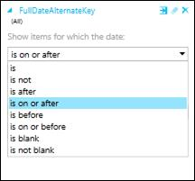

图 163:日期数据类型过滤器选项

对于数字数据类型的字段，我们看到以下选项。

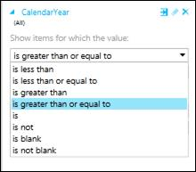

图 164:数字数据类型过滤器选项

### 切片机

切片器是另一种过滤器。他们过滤页面上的所有内容。Power View 切片器看起来非常像 Excel power pivot 中的切片器。我们可以从任何属性字段创建一个单列表，然后将该表转换为切片器。每个值都是一个按钮，右上角的按钮清除(重置)过滤器。要选择一个值，只需单击该按钮。数据会立即在报告中过滤。

点击时按住 **Ctrl** 键可以选择多个值。

我们也可以通过右上角的按钮重置过滤器，然后使用 **Ctrl** +单击清除特定值，来选择除某组值之外的所有内容。这将显示整体值，不包括未选择的值。

您可以向报表中添加多个切片器。切片器相互过滤；例如，如果我们有两个切片器，一个用于产品类别，一个用于产品，当我们单击前者中的一个类别时，它会过滤后者，只显示该类别中的产品。所有切片器的过滤效果结合在一起。

与图表过滤器不同，切片器:

*   过滤图表。它们不会突出显示图表。
*   与报告一起保存。保存、关闭和重新打开报表时，切片器中会选择相同的值。
*   可以使用图像字段。在幕后，Power View 使用该图像的行标识符字段作为切片器中的过滤器。

为了在报告中创建切片器，我们需要从字段列表中选择要用作切片器的字段，然后单击功能区上**设计**选项卡中的**切片器**选项。

图 165:功能区上的切片器选项

如下图所示，“产品类别”字段的切片器显示在“电源视图”报告中。当我们单击切片器(在本例中为附件)中的单个值时，会针对该值过滤整个报告。

图 166:将切片器应用于报表

当我们需要使用不太明确的值来筛选整个报表时，切片器可以用作筛选器。当字段中唯一值的数量很多时，我们可以在“过滤器”区域选择高级过滤器模式。

在我们可以过滤和突出显示报告中的数据的不同方法中，保存报告时每种方法的行为都不同:

*   如果我们在设计视图中设置了筛选器或切片器，切片器或筛选器的状态将与报表一起保存。
*   如果我们在设计视图中突出显示图表，其状态不会与报表一起保存。

## 在电源视图中设计仪表板

在前面几节中，我们学习了 Power View 提供的所有可视化和过滤选项，以及每种可视化可以最好地表示哪些数据。将它们整合在一起，我们可以为最终用户和分析师创建交互式仪表板，使他们能够更好、更快地做出明智的决策。

在本节中，我们将设计 AdventureWorks 销售仪表板，以提供销售、利润、同比比较以及每个地区贡献的执行级摘要。

我们使用前面讨论的可视化创建了以下仪表板。

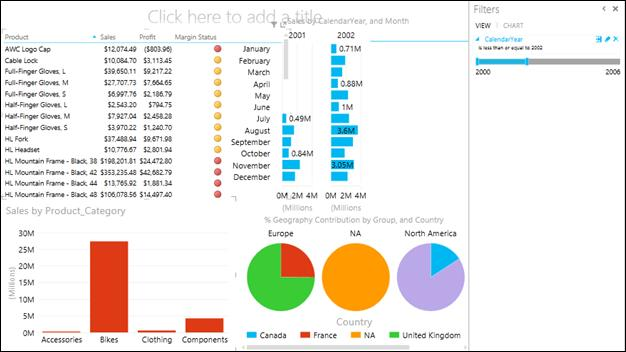

图 167:电源视图仪表板

在仪表板中，最好以表格形式表示详细级别的数据和关键绩效指标。因此，我们使用表格可视化来表示产品级别的详细信息以及销售、利润和利润关键绩效指标。

为了展示产品销售的同比对比，我们选择用条形图表示月销售额，以日历年为水平倍数。我们本可以使用柱形图可视化来表示相同的图表，但是由于水平空间的限制，我们选择用条形图来表示它(这对于年度比较来说在视觉上也更好)。

为了表示区域贡献，我们使用饼图作为水平倍数来表示地理贡献的百分比。饼图最能代表这样的数据。

我们选择使用柱形图按产品类别表示销售额，这对于交互式筛选和突出显示非常有用，特别是对于筛选“产品详细信息”表。

图 168:对仪表板应用过滤器

我们在“过滤器”区域添加了日历年过滤器，这有助于限制条形图中的数据，以便进行年度比较。

一旦我们为仪表板准备好了所有的可视化和过滤器，我们就给报告添加一个标题，并使用**文本**选项卡调整它的位置和字体。仅当鼠标指针位于文本框中时，“文本”选项卡才会出现。

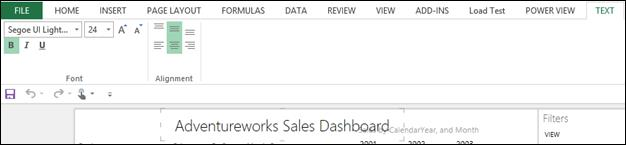

图 169:文本选项

接下来，我们通过单击功能区上**电源视图**选项卡中的**图片**按钮来添加 AdventureWorks 徽标图像:

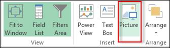

图 170:图片选项

我们将徽标定位如下图所示。

图 171:向仪表板添加图像和标题

接下来，我们可以通过单击功能区上**电源视图**选项卡中的**设置图像**选项来设置报告背景中的图像。

图 172:设置图像选项

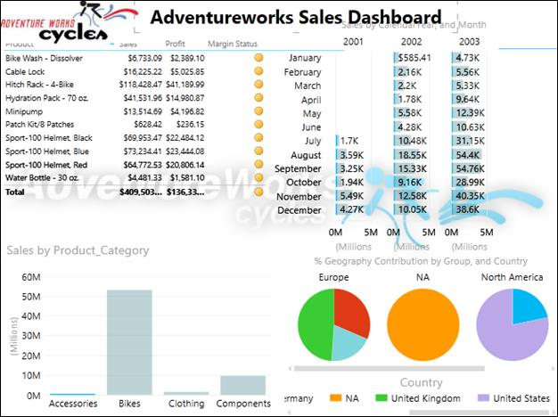

图 173:向仪表板添加背景图像

我们还可以在**力量视图**选项卡的**背景图像**区域将图像的透明度及其位置设置为适合、拉伸、平铺或居中。

图 174:背景图像选项

最后，为了使 Power View 报告在视觉上更具吸引力，我们可以使用**主题**选项更改 Power View 报告的主题和背景，如下图所示。

图 175:电源视图仪表板中的主题选项

仪表板现已准备好用于报告和分析。

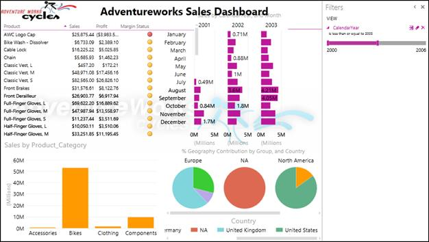

图 176:完整的电源视图仪表板

利用您的创造力和用户界面专业知识，您可以为分析和报告创建视觉上吸引人且丰富多彩的报告。

## 总结

总之，Power View 是一款出色的报告和分析工具，为数据探索和商业智能提供了丰富的可视化选项。

新的 SSAS 表格模型为商业智能开发人员提供了以最小的复杂性轻松创建数据模型的灵活性，而这种复杂性可以被 Power View 报告所消耗。

希望您现在会对探索微软商业智能堆栈中引入的这些和其他新产品感到兴奋和好奇。