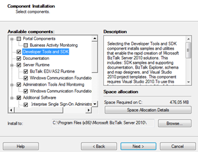

# 第 2 章开始使用 BizTalk 服务器

## 安装 BizTalk 开发人员版

系统需求

为了让您开始练习从这本电子书中学到的一切，您可以安装由微软提供的免费 BizTalk 服务器开发人员版(到目前为止，它仅在 BizTalk 服务器 2010 中免费提供)。我们将使用 BizTalk 服务器 2010，尽管 BizTalk 服务器 2013 R2 版已经推出。2010 版本仍然是最常用的版本之一，并且还有更多与这个版本相关的资源，所以如果你是从这个平台开始的，它比 2013 年或 2013 年的 r 2 更容易找到教程、视频和例子。

你可以在这里找到软件[或者在这里](http://www.microsoft.com/en-us/download/details.aspx?id=24433)下载评估虚拟机[。](http://www.microsoft.com/en-us/download/details.aspx?id=18969)

要安装它，请确保您满足以下所有硬件和软件要求。

要运行 BizTalk 服务器 2010，您需要:

*   32 位(x86)平台:采用英特尔奔腾兼容 CPU 的计算机，单处理器为 1 GHz 或更快，双处理器为 900 MHz 或更快，四处理器为 700 MHz 或更快。
*   64 位(x64)平台:CPU 与 AMD64 和扩展内存 64 位技术(EMT64T)兼容的计算机，1.7 GHz 或更快的处理器建议用于 BizTalk Server 2010。
*   最小 2 GB 内存(建议更多)。
*   10 GB 可用硬盘空间。
*   VGA 显示器(1024 x 768)或更高分辨率的显示器。

要使用和开发 BizTalk 服务器 2010，您需要以下软件:

*   微软视窗:可以是视窗 7，视窗服务器 2008 R2，视窗服务器 2008 SP2，或带有服务包 2 的视窗 Vista)。
*   R2 2008 或 SP1 2008
*   微软。NET 框架 4 和。NET 框架 3.5 和服务包 1 (SP1)
*   Microsoft Visual Studio 2010(仅选定功能需要)
*   Microsoft Office Excel 2010 或 2007(仅选定功能需要)
*   SQL Server 2005 通知服务(仅选定功能需要)
*   带有服务包 1 的 SQLXML 4.0(仅选定功能需要)
*   互联网信息服务(IIS)7.5 和 7.0 版(仅适用于选定功能)

|  | 注意:BizTalk 是一个企业产品，应该安装在类似于 Windows 服务器的服务器操作系统中。 |

这些要求来自微软的网页；但是，我建议您安装 Visual Studio——否则您将无法开发 BizTalk 项目。

装置

假设所有机器都已经安装了具有微软最新关键 Windows 更新的操作系统，并且满足所有其他先决条件，那么让我们开始安装 BizTalk Server 2010 免费版。

在这本电子书中，我将帮助你进行一个基本的安装，这样你就可以自己尝试你将在以下章节中看到的例子。虽然看起来可能很简单，但您应该知道，这是一个可以访问多个公司的多个数据源的平台，因此，如果您想在生产环境中安装 BizTalk，我建议您更彻底地研究它。

### 安装 BizTalk

当您开始设置时，您将看到一个欢迎页面，其中有几个选项。请选择**安装 Microsoft BizTalk Server 2010** 初始化基本安装。

图 2:安装 BizTalk 服务器

选择安装 Microsoft BizTalk Server 2010 的选项后，将提示您几个配置选项。对于此安装，您可以保留默认选项。只要确保选择了**开发工具和 SDK** 选项，因为它是允许我们在 Visual Studio 中开发映射和编排的功能。

图 3:选择工具和软件开发工具包选项

### 配置 BizTalk 服务器

安装完成后，系统将提示您显示 BizTalk 服务器 2010 的配置屏幕；这是您配置数据库连接和访问数据库凭据的地方，BizTalk Server 将在该数据库中存储应用程序的所有元数据。

第一个屏幕允许您在基本和自定义配置之间进行选择，正如您在选项描述中看到的，您应该选择**基本**配置。您还需要配置您的数据库服务器名称，在我的例子中是 **ADMIN-PC** ，以及访问该数据库服务器的服务凭证，如图 4 所示:

图 4:配置 BizTalk 服务器 2010

配置好数据库服务器连接后，点击**配置**选项，设置将为您进行连接和配置，如下图所示:

图 5:完成配置

配置结束时，会在临时目录中创建一个日志文件。任何时候出现错误，您都可以在该文件中查找有关该问题的更多信息。