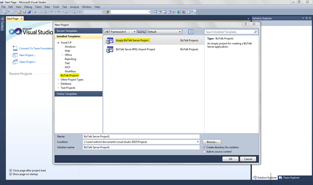

# 第 3 章开发者环境

### 简介

如您所见，Visual Studio 是您的主要开发工具，允许您创建要在 BizTalk 服务器平台上进一步部署和安装的应用程序。第一次启动新的空 BizTalk 服务器项目时，您可能会有点迷路，因为工具箱中会出现一个没有选项的空页面。这是因为 Visual Studio 将根据您想要创建的 BizTalk 工件向您展示不同的工具和选项。

完成所有配置项目后，您就可以开始在 BizTalk 服务器 2010 中进行开发了。打开 Visual Studio 并启动一个新的 BizTalk 服务器项目(空的 BizTalk 服务器项目)。

图 6:创建一个新项目

要查看工件的完整列表，请在解决方案资源管理器中右键单击项目，然后单击**添加** > **新项目**。这将提示带有以下选项的新屏幕:

*   BizTalk 业务流程
*   地图
*   接收管道
*   发送管道
*   平面文件模式
*   属性架构
*   (计划或理论的)纲要
*   平面文件架构向导

图 7:开发工件

### 解释开发人员工件

在开发过程中，您会经常看到“添加新项目”屏幕，因为您需要几个项目来完成最终的解决方案。在接下来的章节中，我将更详细地讨论这些项目中的每一个，但这里有一个简短的概述:

表 1: BizTalk 服务器项目工件

| 项目 | 描述 |
| --- | --- |
| 地图 | 映射是可扩展样式表语言转换(XSLT)文档的图形表示，它允许我们以简单直观的方式在 XML 消息之间执行转换 |
| 接收管道 | 一种管道，在消息被适配器接收之后，发布到 MessageBox 数据库之前，对消息执行该管道。 |
| 发送管道 | 在消息发送出 BizTalk 服务器之前对其执行的管道；他们负责发出“结束系统就绪”的信息。 |
| 平面文件模式 | 用 XML Schema 中的注释形式的所有必要信息定义平面文件模式的结构。 |
| 属性架构 | 属性架构是特定于 BizTalk 的架构，它定义了要向 BizTalk 消息引擎公开的字段元素。属性架构与消息架构相关联，值将从该消息架构提升到消息上下文中。消息引擎可以访问这些属性，用于路由、关联和跟踪 |
| (计划或理论的)纲要 | 这是一个 XML 文件的抽象，指定了它的节点、数据类型和名称空间。定义 XML 文件的框架，例如面向对象编程中对象框架的类。一个模式也可以被看作是一个特定应用程序的通用词汇表的协议，它涉及到交换文档。Microsoft BizTalk Server 使用 XML 模式定义(XSD)语言来定义它处理的所有消息的结构，并将这些消息结构定义称为模式。除了少数例外，结构化消息是任何应用程序的核心。 |
| 管弦乐编曲 | 流程编排是业务流程的可视化可执行实现，也就是说，为了实现一个目标，一组逻辑的、按时间顺序排列的活动。 |

我们现在将探索这些开发项目中的每一个，以便在您完成本书时，您可以开始使用微软 BizTalk 服务器 2010 开发您自己的应用程序集成解决方案。