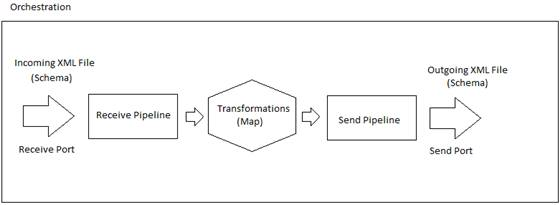

# 第 4 章所有工件如何协同工作

BizTalk 服务器是微软开发的一款产品，是对各种不同系统以及它们之间交换消息的需求的回应。

对这种工具的需求很容易理解，因为基于计算机的信息系统有自己的数据结构、文档结构和工作流，公司之间或单独的系统之间交换文档需要业务流程之间的协调。我们需要集成这些，以便当消息到达时，它可以完全集成到它要触发的工作流中。

这种一致性要求中间件工具能够捕获需要交换的消息，应用目标所需的所有转换和业务规则，并确保消息被集成到其系统中正确的业务流程中。BizTalk Server 正好适合这个中间件平台，它的主要作用就是响应这种业务流程集成的需求。

在进行系统集成时，有几个挑战需要完成和理解，包括文档的格式和结构。当中间件平台捕获一条消息时，它不知道它的结构，它包含哪些节点，或者目标系统。但是还有很多潜在的问题，比如文档结构是否符合目标的预期结构以及它需要遵循的工作流程。

所有这些问题以及更多问题都可以通过使用您可以开发和组合的几个对象来开发 BizTalk 服务器应用程序来解决。在本书中，我们将带您参观每一组文物，它们是:

*   计划
*   港口
*   管道
*   地图
*   编排

除了 BizTalk 服务器应用程序工件之外，还有几个工件，如适配器，它们基本上是软件组件，使您能够使用符合公认标准的传递机制轻松地向 BizTalk 服务器发送消息或从 BizTalk 服务器接收消息。它们将在整本书中得到更详细的解释。图 8 概述了所有这些工件如何在一个 BizTalk 服务器应用程序中协同工作。

图 8:简单应用程序