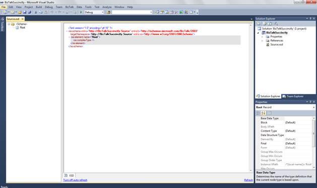
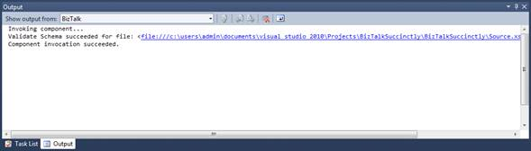
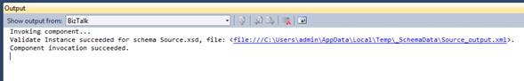
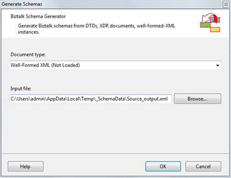
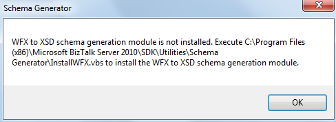

# 第五章图式

### 简介

模式是定义 XML 文件层次结构的文件，就像面向对象编程中的类定义对象一样。这些文件具有 XML 模式定义(XSD)扩展名，必须有一个根节点和您希望的任何其他元素和属性。为应用程序定义 XSD 后，BizTalk 将使用它来验证通过接收端口进入的任何 XML 文件，如果匹配，该 XML 将被转换并发送给该 XSD 格式的任何订阅者。

模式是 BizTalk 的核心基本构件，因为它们描述和标识了 BizTalk 将处理的消息的类型，您必须知道，通常 BizTalk 只处理它知道的消息。它们被其他人工制品引用，比如管弦乐和地图。

BizTalk 服务器支持以下四种模式:

1.  **XML 模式**。XML 模式定义了一类 XML 实例消息的结构。因为这种类型的模式使用 XSD 语言来定义 XML 实例消息的结构。这是 XSD 的预期目的，因为这样的模式直接使用 XSD。
2.  **平面文件模式**。平面文件模式定义了一类实例消息的结构，这些消息使用平面文件格式，或者是分隔的，或者是位置的，或者是它们的某种组合。因为 XSD 的本机语义功能不能满足定义平面文件实例消息结构的所有要求，例如平面文件中不同记录和字段可能使用的各种类型的分隔符，所以 BizTalk 服务器使用 XSD 的注释功能将这些额外信息存储在 XSD 模式中。BizTalk Server 定义了一组丰富的特定注释标签，可用于存储所有必需的附加信息。
3.  **包络模式**。信封模式是一种特殊类型的 XML 模式。信封模式用于定义 XML 信封的结构，信封用于将一个或多个 XML 业务文档包装成单个 XML 实例消息。当您将 XML 模式定义为信封模式时，需要一些附加的属性设置，具体取决于信封模式中是否定义了多个根记录。
4.  **属性模式**。属性架构与 BizTalk 服务器中存在的两种机制之一一起用于所谓的属性提升。属性提升是将实例消息中的特定值复制到消息上下文的过程。从消息上下文来看，这些值更容易被各种 BizTalk 服务器组件访问。这些组件使用这些值来执行消息路由等操作。提升的属性值也可以从另一个方向复制，从更容易访问的消息上下文复制回实例消息的深处，就在实例消息发送到其目的地之前。属性架构是 BizTalk 架构的简单版本，在实例消息和消息上下文之间来回复制提升的属性的过程中发挥作用。

除了 XML 文件，BizTalk 还使用模式来描述平面文件和任何其他格式。要向项目中添加新模式，请在 Visual Studio 中选择**模式**选项，单击**添加**，然后选择**新项目**。

图 9:添加新模式

BizTalk 使用*命名空间#rootnode* 的组合来定义消息的模式类型，从而使消息类型唯一(例如:[http://my namespace . com # MyRootNode](http://mynamespace.com#MyRootNode))。换句话说，BizTalk 使用这种组合来识别和解析架构引用。

### 管理模式节点

向项目添加新架构后，Visual Studio 将打开架构配置屏幕，您可以在其中定义该 XSD 文件的节点、记录和属性。一个重要的注意事项是，您应该始终更改模式的根名称，以便 BizTalk 可以正确地识别它。

图 10:模式创建者屏幕

在此 Visual Studio 屏幕中，您可以向架构中添加项(节点)。为此，右键单击屏幕左侧的根节点，并根据您的需求选择正确的选项。

图 11:向模式添加节点

对于这个模式，我将创建基本的员工信息，包括姓名、地址、国家、电话号码、出生日期和工资。产生的模式将如图 12 所示:

图 12:员工模式

### 模式节点的属性

虽然这个模式包含了表示我们的员工所需的所有节点，但是 BizTalk 允许您用更多的定义来丰富您的模式，比如数据类型，或者哪些字段是必需的。这样，您可以选择一个节点(字段元素或属性)，并使用“属性”窗口定义所有节点设置。图 13 显示了选择模式节点后所有可用的属性。

图 13:模式节点属性窗口

表 2 更详细地描述了模式节点属性:

表 2:模式节点属性

| 财产 | 描述 |
| --- | --- |
| 基本数据类型 | 确定当前节点类型所基于的类型定义的名称。使用**基础数据类型**属性指定基础数据类型值，所选记录、字段元素或字段属性节点的数据类型将从该基础数据类型值中导出(例如，“xs:string”)。 |
| 代码列表 | 指定用于所选**字段元素**或**字段属性**节点的代码列表的参考编号，并提供对**代码列表**对话框的访问。 |
| 数据类型 | 节点的数据类型。(主要类型有十进制、日期时间、字符串、整数和布尔值，但 BizTalk 提供了更多选项。)为选定的字段元素或字段属性节点指定简单数据类型；例如，字符串、整型、布尔型等等。 |
| 缺省值 | 指定所选**字段元素**或**字段属性**节点的默认值(如 0 表示数量)。 |
| 派生者 | 指示字段的基础简单类型是如何从其基础数据类型派生的。 |
| 字段类型 | 将所选节点标识为**字段元素**节点或**字段属性**节点。 |
| 最后的 | 指定为选定的**记录**、**字段元素**或**字段属性**节点定义的数据类型的派生限制。 |
| 固定的；不变的 | 为实例消息中的元素或属性指定一个固定值，该值对应于选定的**字段元素**或**字段属性**节点(如果存在数据)。 |
| 实例 XPath | 向您展示了访问 XML 文件中节点的 Xpath 代码。 |
| 最大/最小发生次数 | 节点的最大和最小出现次数 |
| 命名空间 | 节点的命名空间 |
| Nillable | 指示该值是否可以为空(默认值为假)。 |
| 节点名 | 节点的名称 |
| 笔记 | 关于该节点的任何注释 |

### 模式文件属性

在您管理了与**记录**、**字段元素**或**字段属性**相关的设置后，BizTalk 还允许您定义模式本身的属性，这些属性在定义 BizTalk 引擎如何识别模式时应始终进行检查。要访问这些属性，只需在解决方案资源管理器中单击您的架构文件。

图 14:模式的属性

选择要设置的架构后，Visual Studio 将在“属性”窗口中显示其属性。

图 15:模式定义的属性

表 3 列出并解释了模式的所有属性。

表 3:模式属性

| 财产 | 描述 |
| 构建操作 | 指定如何在应用程序生成操作中处理文件。(您可以指定在构建项目时不会编译架构。) |
| 默认属性架构名称 | 指定为提升的属性生成的文件的名称 |
| 文件名 | 架构文件的名称。您可以使用此属性检查和设置所选架构文件的名称。 |
| 全称路径 | 架构文件的位置。您可以使用**完整路径**属性来检查存储所选模式文件的文件系统位置。 |
| 完全限定名 | 这是命名空间和类型名的串联。它们一起构成了用于唯一标识中的类型的完全限定名。NET 框架。您必须确保在整个 BizTalk 环境中没有两种类型具有相同的完全限定名，因为它们用于标识传入和传出的消息，以及哪些消息针对哪些订阅方。 |
| 生成实例输出类型 | 指定生成实例选项的输出类型。 |
| 输入实例文件名 | 使用验证实例输入类型时，输入实例验证的文件名。 |
| 命名空间 | 那个。编译后的架构将属于的命名空间。 |
| 输出实例文件名 | 生成实例选项的文件名。 |
| 类型名 | 。已编译架构的。 |
| 验证实例输入类型 | 指定验证实例选项的输出类型。 |

### Visual Studio 中的模式操作

#### 验证架构

BizTalk 提供了几个选项来评估模式的一致性，告诉您它们是否构造良好或者是否有错误。为此，请使用验证架构选项，当您在解决方案资源管理器中右键单击架构文件并选择**验证架构**时，该选项可用。

图 16:验证模式

BizTalk 将返回一条消息，说明模式是否定义良好。BizTalk 还将返回文件名，以便您可以使用它进行进一步评估。如图 17 所示，模式没有错误:

图 17:验证模式的输出窗口

#### 生成实例

“生成实例”功能用于根据您之前创建和验证的模式为平面文件生成 XML 文件或本机类型的实例。尽管此选项也验证模式，但验证模式然后生成实例是常见的最佳实践。该选项与“验证架构”选项位于同一菜单中。

一旦点击**生成实例**选项，BizTalk 将生成一个示例 XML 文件，文件名在具有生成实例输出类型的模式的输出实例文件名属性中定义。图 18 显示了我们的员工模式的一个 XML 实例。

图 18:为员工模式生成实例

这个生成的实例现在可以作为一个例子，使用验证实例选项来评估我们的模式。

#### 验证实例

“验证实例”功能允许您验证平面文件的 XML 文件或本机类型是否具有架构文件的结构，以及是否属于该格式。该选项与“验证架构”菜单位于同一菜单中。

要使用此选项，您需要更改架构属性“输入实例文件名”，定义 XML 文件名(完整路径)，以便架构使用使用此“验证实例”选项时要验证的 XML 文件。更改属性并运行验证程序后，BizTalk 将在输出窗口中显示结果。如图 19 所示，BizTalk 成功验证了我们的 XML 文件。

图 19:验证实例

### 从 XML 文件生成模式

BizTalk 的一个很好的特性是能够从一个 XML 实例生成 XSD 文件。这对于 BizTalk 开发人员来说很重要，因为它允许他们向他们的客户端请求一个集成文件的 XML 示例，然后生成一个模式用于他们的地图。(这种方法有一些限制，可能需要您手动设置一些属性或元素。)

要使用该选项，在解决方案资源管理器面板中右键单击您的项目，然后选择**添加**、**添加生成项**，然后选择选项**生成模式**，如图 20 所示。

图 20:生成模式

出现“生成模式”屏幕后，您需要选择文档格式。由于您使用的是我们的员工 XML，我们需要选择**格式良好的 XML** 并指定 XML 文件路径。

图 21:生成模式规范

指定完文档类型和输入文件路径后，点击**确定**，BizTalk 将生成 XSD 文件。如果您收到一个指示模块未加载的错误，您需要在消息框中显示的路径上执行模块安装程序(您可能需要使用具有提升权限的 CMD 来执行它)。之后，你就可以走了。

图 22:生成模式错误

在生成结束时，您将能够在解决方案资源管理器窗口中看到全新的架构。在我们的例子中，名称是 Source_output.xsd:

图 23:新生成的模式

### 物业推广

BizTalk 提供两种类型的属性提升:可分辨字段和属性字段。

以一种简化的方式，可分辨字段只能在业务流程中使用，而升级的属性字段可以通过 BizTalk 消息处理的所有阶段来访问，可以在业务流程中，也可以从自定义代码、路由和管道中访问。

#### 区分字段

BizTalk 服务器有一些机制，允许您使用模式中的元素，根据 XML 实例在这些元素中的值来执行路由或逻辑操作。我想谈的第一个机制是区分字段。

这些可分辨字段是消息中已在 BizTalk 架构编辑器中使用此功能标记为可分辨的字段。当这些字段被标记为可区分字段时，可以在业务流程中通过点符号来使用，并且可以用来访问该特定字段的值和设置该字段的值。它们不同于提升的属性，因为它们不像提升的属性那样被写入 MessageBox 订阅表进行路由；相反，它们本质上是 XPATH 别名(简单的指针或 XPath 查询的抽象)，它只是指向适当的 XML 数据字段。

要区分字段，只需右键点击要标记的节点，选择**提升**，然后**显示提升**。

图 24:显示促销

当促销画面打开时，选择要区分的节点，选择**区分字段**选项卡，然后点击**添加**。图 25 显示了这个操作的一个例子。在本例中，我们将使用“薪资”属性。

图 25:区分薪资节点

#### 提升的属性

区分属性和提升属性之间的主要区别在于它们可以使用的上下文。虽然可分辨属性用于设置或获取业务流程内部消息的值，但提升属性用于根据消息的值路由消息。它们允许消息引擎根据消息的值路由消息，并且在消息上下文中允许这样做，而不必查看消息负载。提升属性是启用基于内容的路由的最常见方式。它们可用于管道、适配器、消息总线和编排。

提升字段的最佳方式是使用“快速提升”选项(在与“显示提升”相同的菜单中)。使用此选项，BizTalk 将在架构属性的默认属性架构名称中定义的属性架构中自动创建升级的属性。如果我们的项目中不存在这种情况，Visual Studio 将自动生成属性架构并将其添加到您的项目中。