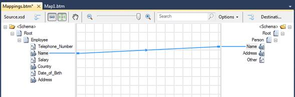
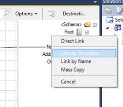
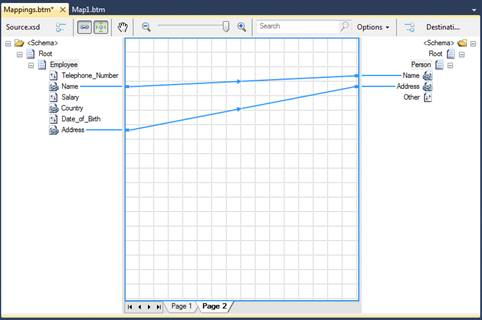
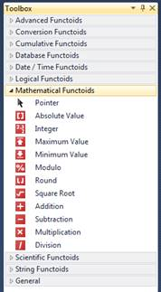
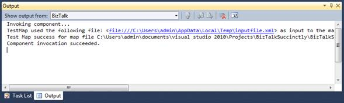
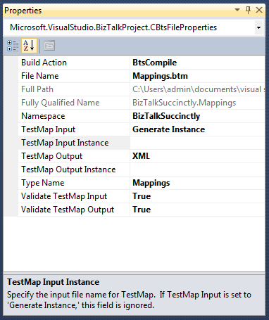
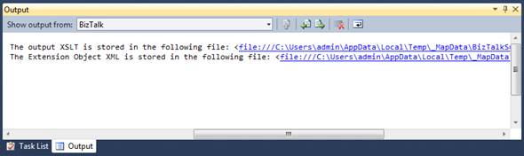
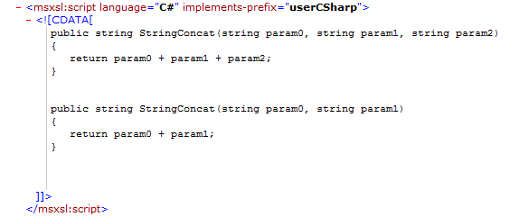
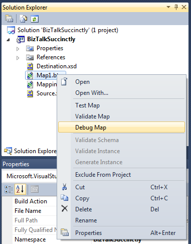

# 六、映射

## 简介

用一种非常简单的方式，一张地图(。BTM 文件)是使用一种称为 XSLT 的转换语言从一个可扩展标记语言文档转换成另一个或多个可扩展标记语言文档。这些映射在 BizTalk 中用于以下位置:

*   接收端口
*   发送端口
*   内部管弦乐队

地图是 BizTalk 的核心概念；他们负责对消息数据进行任何必要的转换，这些转换由您想要集成的不同系统进行交换。这些映射是在 Visual Studio 2010 中使用 BizTalk 映射器工具开发的。该工具有一个开发人员友好的界面，允许您拥有地图使用的输入和输出模式的树形结构视图。

图 26: BizTalk 映射器工具

## 制图仪概述

映射器编辑器分为七个不同的区域，每个区域代表映射和模式节点的不同行为和配置。可用区域包括:

1.  **Functoids** 面板，其中有所有可用的 functoid 供您在地图中使用。
2.  **网格**面板，这里显示了所有的映射和转换。对于逻辑组织，BizTalk 允许您将映射分成页面，这些页面位于网格的底部。
3.  **源模式结构**。这代表您在此地图上收到的消息。让所有节点都可供您映射和转换。
4.  **目标模式结构**。这代表您在此地图上的外发邮件。让所有节点都可用，您将从这些节点映射转换后的节点。
5.  **输出**面板。在这里，您将看到地图验证和测试的结果。这个工具是一种非常重要的调试形式，您可能已经从。NET 项目。
6.  **解决方案浏览器**。这是所有 Visual Studio 项目的通用面板。它代表您的 BizTalk 应用程序的解决方案结构。
7.  **属性**窗口。这也是所有 Visual Studio 项目的共享窗口。它显示选定对象的所有可用属性。

图 27:映射器概述

## 向项目添加地图

将地图添加到项目中非常容易，因为地图是 SDK 工件。要添加地图，请在解决方案资源管理器中右键单击您的项目，选择**添加** > **添加新项目**，然后选择**地图**。不要忘记在**添加新项目**画面中给它一个描述性的名称。一旦添加了新的映射，BizTalk 将打开映射编辑器，没有任何模式和转换，如图 28 所示。

图 28:空地图

创建空映射后，是时候将源和目标模式添加到其中，以便开始映射和转换。重要的是回顾一下，这两个模式现在都应该已经创建或添加到您的项目中了。

## 将模式添加到地图

如图 28 所示，空映射在源和目标模式中都有链接，允许您不仅从项目中选择模式，还可以从解决方案中引用的任何其他项目中选择模式。当您点击**开源模式**或**开放目标模式**时，系统会提示您选择模式的位置。

图 29:向项目添加模式

对于我们的例子，我们将简单地添加我们的**biztalk。源**模式作为源模式和**商务对话简洁。目的地**作为我们的目的地模式。值得注意的是，我们已经用名称空间**配置了我们的模式，因此 BizTalk 创建了两种新类型的消息，这个名称空间与模式名连接在一起，创建了所谓的模式的完全限定名。这用于标识订户订阅的消息类型。**

## 链接节点

将源模式和目标模式添加到映射后，可以通过将节点从源模式链接到目标模式来开始实现简单的转换规则。链接是将源架构中的数据项与目标架构中的数据项相关联的方式。通常，在完整的映射中，源模式和目标模式之间有许多链接。所有这些链接一起指定了如何将源实例消息中的数据转换成语义等价但语法不同的目标实例消息。

在 BizTalk 中链接节点是一个非常简单的操作，这是一个拖放事件，将自动在一个源节点和另一个目标节点之间创建链接。要链接节点，请单击鼠标指针并将其拖动到目标节点。图 30 表示地图中两个节点之间的链接。

图 30:链接节点

BizTalk 还为您提供了加速映射的机制。在这种情况下，我们只是映射一个节点，但是假设您有包含数百个节点的源和目标模式，并且它们都有相同的名称，我们会失去将它们一个接一个地连接起来的想法。为了加速映射，您可以在执行链接时单击**CTRL**；完成拖放后，BizTalk 将为您提供以下选项:

图 31:链接选项

这些选项可能会成为您在节点映射中最好的朋友，因为它们会为您节省大量时间。表 4 总结了这些链接选项。

表 4:链接选项

| 名字 | 描述 |
| --- | --- |
| 直接链路 | 使用这种技术，BizTalk 映射器将源架构中的记录链接到目标架构中的选定记录。 |
| 按名称链接 | 使用这种技术，BizTalk Mapper 会尝试根据链接的记录节点中相应节点的名称来匹配链接的记录节点中的记录和字段节点，而不管它们的结构如何。 |
| 按结构链接 | 使用这种技术，BizTalk Mapper 会尝试根据记录节点的结构匹配被链接的记录节点中的记录和字段节点，而不考虑这些结构中对应节点的名称。 |
| 批量复制 | “批量复制”functoid 使您的映射可以使用包含任何和任何属性元素的模式。 |

例如，让我们使用“按名称链接”选项。图 32 显示了使用这个选项只映射一个节点的结果；两个节点都是自动链接的。

图 32:按名称链接

## Functoids

有时，BizTalk 映射中的直接链接不足以尊重目标模式格式，我们需要应用一些数据转换或转换。它可以是节点到特定类型的连接或转换，可能需要几个操作来满足这些目标模式的要求。

Functoids 是对这个问题的响应，封装了用于对源节点值执行所有必需处理的转换逻辑，以便与目标节点格式和值一起工作。BizTalk 有许多 functoidss，这些 functoid 可以简单到连接字符串来相乘值，或者循环遍历 XML 文件中的重复记录。

在映射器中，您可以在工具箱中找到所有可用的 functoidss，您可以在地图编辑器工具的左侧识别这些 functoid。当您打开工具箱时，您会发现这些 functoid 被划分为代表该 functoid 响应的操作类型的类别。

图 33:Functoid 类别

一旦您确定了要使用的 functoid，将其添加到地图并配置其行为的过程对于所有 functoid 都是相同的；您只需要将该 functoid 拖放到映射中，将源节点链接到该 functoid，双击该 functoid 以配置任何其他设置，并将该 functoid 链接到目标节点。

在下面的示例中，我们希望将员工的地址与国家/地区连接起来，但用分号分隔，然后将其连接到目标节点。第一步是通过将 concatenate functoid 拖到地图的中心来添加它，如图 34 所示。

图 34:添加连接运算质

添加“连接”functoid 后，BizTalk 将在其顶部显示一条警告，指示该 functoid 没有输出节点。理解 functoid 可能不需要输入节点，但它必须链接到至少一个输出节点，这一点很重要。现在我们需要将“地址”和“国家”节点链接到“连接”functoid，并将该 functoid 链接到目标节点。如图 35 所示，警告不再存在。

图 35:正确链接的 functoid

最后，您需要在两个节点之间添加分号作为分隔符。为此，双击 functoid 的顶部，您将看到配置屏幕。请记住，所有 functoids 都有此行为；如果您需要配置任何其他设置，请双击它并配置您需要的设置。双击它后，您将看到类似图 36 的内容，其中您可以看到我在节点之间添加了分号。

图 36:设置连接 functoid

该 functoid 不仅允许您将字符串添加到连接逻辑中，还允许您对节点重新排序，甚至从中删除一些节点或字符串。

这种 BizTalk functoid 机制允许开发人员非常容易地维护和开发映射和消息转换。

### 可用 Functoids

虽然 concatenate functoid 很容易使用，但是还有其他更复杂的 functoid。下表将显示所有可用的现成 functoids 及其类别。

字符串函数

此类 functoid 表示所有可用于字符串操作的 functoid。所有这些 functoid 都有一个字符串作为返回对象，它们的输入可能是来自源架构的输入节点或静态字符串，在 functoid 配置屏幕中配置为输入参数。表 5 描述了此类别中可用的 functoids。

表 5:字符串 Functoids

| 形状 | 名字 | 描述 |
| --- | --- | --- |
|  | 字符串查找 | 返回在第一个参数中找到的第二个参数的第一个实例。 |
|  | 左弦 | 返回字符串左侧第二个参数中指定的字符数。 |
|  | 右弦 | 返回字符串右侧第二个参数中指定的字符数。 |
|  | 大写字母 | 以大写形式返回输入字符串。 |
|  | 小写字母 | 以小写形式返回输入字符串。 |
|  | 大小 | 返回输入字符串的长度(int)。 |
|  | 字符串提取 | 接受三个参数(字符串、开始位置和结束位置)，并返回第一个输入的子字符串。 |
|  | 字符串连接 | 接受 1 到 100 个字符串，并按添加顺序返回它们的串联。 |
|  | 左侧装饰 | 接收一个字符串，并从左边修剪它。 |
|  | 右侧修剪 | 接收一个字符串，并从右边修剪它。 |

高级功能

这类 functoids 允许您对其输入执行高级操作。其中一些函数返回的输出可以用作另一个 functoid 的输入，或者直接发送到目标。在此类别中，您有以下可用 functoids:

表 6:高级函式

| 形状 | 名字 | 描述 |
| --- | --- | --- |
|  | 脚本 | 允许您执行自定义代码。可以是 C#，Inline JScript。内联 Visual Basic。NET、内联 XSLT 或内联调用模板。 |
|  | 记录计数 | 返回节点的总出现次数。 |
|  | 索引 | 使用源架构中的一个节点作为第一个参数，所有其他输入作为节点的级别，返回由其他参数的值索引的节点值。 |
|  | 循环 | 使用源架构中的一个节点作为第一个参数，返回该节点的迭代，表示该节点的当前出现次数。 |
|  | 值映射 | 如果第二个参数为真，则输出其第一个参数。 |
|  | 维护 | 允许您确保某些条件始终为真，如普通 C#代码中的断言。 |
|  | 值映射(平面化) | 此 functoid 与“值映射”functoid 的不同之处在于，它尝试将输入展平为输出。 |
|  | 环 | 使用源模式中的一个节点作为输入，迭代它的出现。必须连接到目标节点。 |
|  | 批量复制 | 递归地将源节点(输入)下的所有节点复制到目标节点。 |
|  | 表格循环 | 在内存中构建一个表，用于在输出中创建具有输入中不存在的某种结构的记录。 |
|  | 表格提取器 | 该 functoid 接受两个参数:第一个参数必须是“表循环”functoid，第二个参数是一个数字，指示要从中获取值的表中的列。 |
|  | 零值 | 如果输入为真，则允许您返回空值。 |

转换 Functoids

这类 functoid 允许您对输入参数执行转换，并将返回输出用作另一个 functoid 的输入，或者直接发送到目标架构。在此类别中，您有以下可用 functoids:

表 7:转换函式

| 形状 | 名字 | 描述 |
| --- | --- | --- |
|  | ascii 到字符 | 返回转换为 ASCII 表中包含该数字的字符的数字 |
|  | 字符到 ASCII | 返回转换为 ASCII 表示形式的输入参数(字符串)的第一个字符 |
|  | 十六进制的 | 返回转换为十六进制值的输入的整数部分。假设输入是十进制的。 |
|  | 八进制的 | 返回转换为八进制值的输入的整数部分。假设输入是十进制的。 |

累积 Functoids

累积 functoids 允许您对源架构中重复出现的节点执行操作，并根据输入节点的所有出现情况输出一个值。在此类别中，您有以下可用 functoids:

表 8:累计 Functoids

| 形状 | 名字 | 描述 |
|  | 累计平均值 | 对输入值执行平均计算，并将结果作为十进制值返回 |
|  | 累积连接 | 串联字符串输入的所有匹配项，将输出作为一个字符串返回 |
|  | 累积最大值 | 返回输入值的最大值 |
|  | 累积最小值 | 返回输入值数量的最小值 |
|  | 累计总和 | 返回所有输入值的总和 |

数据库功能

此 functoid 类别允许您对数据库执行查找操作，以便从中获取存储值，然后在映射中添加和使用它们。在此类别中，您有以下可用 functoids:

表 9:数据库 functoids

| 形状 | 名字 | 描述 |
| --- | --- | --- |
|  | 数据库查找 | 有四个输入，一个查找值(通常是一个标识)、一个连接字符串和要查找的表的名称，以及用于查找具有该标识的值的列名。然后，BizTalk 将查询数据库并返回找到的行。 |
|  | 错误返回 | 使用“数据库查找”functoid 输入的内容，返回对数据库执行查询时出现的任何错误。 |
|  | 值提取器 | 有两个输入，数据库查找 functoid 和从数据集中提取的列名，然后返回该列的值。 |
|  | 格式化消息 | 使用参数替换以及可能的标识和值交叉引用返回格式化的本地化字符串。 |
|  | 获取应用程序标识 | 检索应用程序对象的标识符。 |
|  | 获得应用价值 | 检索应用程序值。 |
|  | 获取公共标识 | 检索公共对象的标识符。 |
|  | 获取公共值 | 检索一个公共值。 |
|  | 删除应用程序标识 | 移除应用程序对象的标识符。 |
|  | 设置公共标识 | 设置并返回公共对象的标识符。 |

日期/时间 Functoids

这些类型的 functoids 允许您对输入参数执行日期/时间操作，或者生成要添加到目标节点的日期/时间对象类型。它们的输出可以用作另一个 functoid 的输入，或者直接发送到目标。在此类别中，您有以下可用 functoids:

表 10:日期/时间函式

| 形状 | 名字 | 描述 |
| --- | --- | --- |
|  | 添加天数 | 使用它们的两个输入参数，并将第二个参数中指定的天数与第一个参数中指定的日期相加，从而返回一个新日期。 |
|  | 日期 | 返回当前日期，没有输入参数。 |
|  | 时间 | 返回当前时间，没有输入参数。 |
|  | 日期和时间 | 返回当前日期和时间，没有输入参数。 |

逻辑 Functoids

这类 functoid 对其输入执行逻辑运算，并返回一个布尔值，该值可以在以后用作另一个 functoid 的输入，或者指示编译器如何构造生成的 XSLT。它们通常用于定义映射内部的规则。

表 11:逻辑函式

| 形状 | 名字 | 描述 |
| --- | --- | --- |
|  | 大于 | 如果第一个参数大于第二个参数，则返回 true，否则返回 false。 |
|  | 大于或等于 | 如果第一个参数大于或等于第二个参数，则返回 true，否则返回 false。 |
|  | 不到 | 如果第一个参数小于第二个参数，则返回 true，否则返回 false。 |
|  | 小于或等于 | 如果第一个参数小于或等于第二个参数，则返回 true，否则返回 false。 |
|  | 平等的 | 如果两个参数相等，则返回 true，否则返回 false。 |
|  | 不平等 | 如果参数不相等，则返回 true，否则返回 false。 |
|  | 逻辑字符串 | 如果输入参数是字符串，则返回 true，否则返回 false。 |
|  | 逻辑日期 | 如果输入参数是日期，则返回 true，否则返回 false。 |
|  | 逻辑数字 | 如果输入参数是数字，则返回 true，否则返回 false。 |
|  | 逻辑或 | 返回所有输入参数的逻辑或。 |
|  | 逻辑与 | 返回所有输入参数的逻辑与。 |
|  | 逻辑存在 | 返回节点存在的评估。 |
|  | 逻辑非 | 返回布尔值的否定结果。 |
|  | 是吗 | 如果该节点在架构中设置为零，则返回 true，否则返回 false。 |

数学函数

这些 functoids 几乎就是你的转换计算器；它们允许您对其输入执行数学运算，并返回可用作另一 functoid 的输入或直接发送到目标架构的输出。在此类别中，您有以下可用 functoids:

表 12:数学函式

| 形状 | 名字 | 描述 |
| --- | --- | --- |
|  | 绝对值 | 接受一个值，并返回该值的绝对值。 |
|  | 整数 | 接受一个参数并返回该值的整数部分，有效地删除了小数点和所有小数。 |
|  | 最大值 | 最少接受两个参数，最多接受 100 个参数，并返回最大值。 |
|  | 最小值 | 至少接受两个参数，最多接受 100 个参数，并返回最低的值。 |
|  | 以…为模 | 返回第一个参数除以第二个参数所得的余数。 |
|  | 轮次 | 接受两个参数，并返回第一个参数，第一个参数按第二个参数定义的小数位数舍入。 |
|  | 平方根 | 返回输入参数的平方根。 |
|  | 添加 | 对参数求和并返回结果。 |
|  | 减法 | 减去参数并返回结果。 |
|  | 增加 | 将参数相乘并返回结果。 |
|  | 分开 | 划分参数并返回结果。 |

科学功能

这些 functoid 用于对其输入执行科学的数学运算，并返回一个输出，该输出可用作另一个 functoid 的输入或直接发送到目标架构。这些是数学范畴 functoids 的补充，它们被分开是因为它们代表高级数学运算。在此类别中，您有以下可用 functoids:

表 13:科学功能

| 形状 | 名字 | 描述 |
| --- | --- | --- |
|  | 反正切 | 返回对参数执行反正切函数的结果 |
|  | 余弦 | 返回对参数执行余弦函数的结果 |
|  | X^Y | 将第一个输入提升到第二个输入的幂(例如:23^7) |
|  | 正弦 | 返回对参数执行正弦函数的结果 |
|  | 正切 | 返回对参数执行正切函数的结果 |
|  | 自然指数函数 | 返回自然对数的底数，该底数等于参数的幂。 |
|  | 自然对数 | 返回参数的自然对数 |
|  | 10^n | 返回 10 乘以参数的幂(例如:10^4) |
|  | 普通对数 | 返回参数的从 10 开始的对数 |
|  | 指定底数的对数 | 使用第二个参数作为底数并对第一个参数执行函数，返回以底数指定的对数函数 |

## Visual Studio 中的地图操作

### 测试图

在开发我们的映射时，我们将对输入模式执行转换，以尊重我们的输出模式。这意味着将通过我们的应用程序接收端口接收或在业务流程中处理的每个 XML 文档都将根据相同的转换进行转换。

可以想象，在没有任何测试的情况下部署我们的映射是危险的，因为我们可能会向我们的贸易伙伴发送无效消息。BizTalk 提供了一种机制来模拟我们的地图的执行，基于输入的 XML 或平面文件文档，并在 Visual Studio 中检索预期的 XML 或平面文件。您还可以检查映射引擎生成的 XSLT。重要的是要理解，尽管 BizTalk 验证了 XSLT 的结构和语法，但作为开发人员，您的工作是验证生成的 XML 文档是否符合您的贸易伙伴的要求。

要使用此工具，您只需在解决方案资源管理器中右键单击您的地图，然后选择**测试地图**选项。

图 37:测试图菜单

然后，BizTalk 将生成一个输出文档，您可以通过单击输出窗口中的文件位置来访问该文档。

图 38:测试图

虽然您可以直接使用该工具而无需定制，但是映射属性允许您在不同的条件下执行测试，例如定制的输入 XML 来测试真实的示例场景。为此，您可以访问地图属性并将属性**测试地图输入**更改为 **XML** ，然后在**测试地图输入实例**属性中配置您的测试 XML 文件路径。

图 39:定制测试图执行

### 验证地图

映射验证是开发 BizTalk 映射时常用的简单操作。虽然测试映射有助于可视化 XML 文档上的映射转换结果，但此功能会验证转换的一致性(例如，如果有一个必需的节点没有链接，或者如果有多个链接指向同一个节点)。要使用此选项，请在解决方案资源管理器中右键单击地图，然后选择**验证地图**。

图 40:验证地图

映射验证执行结束后，BizTalk 将生成一个输出，指示是否有错误或警告，如果成功，则指示没有错误或警告，并生成 XSLT 来执行映射。无论成功与否，这个 XSLT 都会提供给你。在输出窗口中查找包含路径的行，您可以打开它:

图 41:XSLT 文档的输出

打开文件后，如果您已经处理过 XSLT 文档，那么语法会很熟悉。它将模式中的所有节点用作输出，并为每个节点提供转换逻辑，以及用于从源模式中获取所需节点的 XPath 引用。

图 42:图 43 XSLT 生成

因为 BizTalk 基于。NET 框架，您还会发现用于任何转换或编程逻辑的 C#代码块。因为我在这个映射中只使用了连接 functoid，XSLT 代码只有 C#代码函数来执行它的逻辑。

图 43:在 XSLT 中连接 functoid C#代码

### 调试图

当验证和测试不足以发现错误或评估输出文档时，通常使用地图编辑器中的调试选项。这样，您就可以通过执行映射中定义的所有映射转换，逐步调试 XML 文档的构建。这个特性非常类似于 C#/中的任何调试。NET 应用程序开发，所以如果您熟悉断点、单步执行和观察者，这对于您来说几乎是一样的。要使用该功能，在解决方案资源管理器中右键单击地图，然后选择**调试地图**选项，如图 44 所示:

图 44:调试图

单击调试映射选项后，BizTalk 将打开一个新窗口，您可以在其中定义断点，并在结果面板中查看步骤执行的结果。图 45 显示了这个调试窗口。

图 45:调试窗口

上图显示了调试窗口中的两个独立面板。在面板 A 上，基于为映射生成的 XSLT，您可以定义断点(调试器将在下一次执行时停止)。在面板 B 上，您有一个结果面板，其中您的 XML 文档是根据您在 XSLT 代码执行中的步骤创建的。