# 八、编排

## 简介

业务流程是您的 BizTalk 项目中的一个可选组件，因为您可以简单地用业务流程来响应需要更复杂逻辑的集成。

很简单，编排是业务流程的可视化表示(形状之间的链接关联、端口的表示和一些配置)，可以通过 MessageBox 数据库订阅(接收)和发布(发送)消息，比文本语言(C#、Java)更容易管理和阅读。它简化了创建业务流程编排模型的过程，这些模型被编译成可执行代码。或者，我们可以说它是一个表示业务流程任意部分的 BizTalk 工件。

使用 BizTalk 业务流程的重要优势包括:

*   处理不同类型的交易。
*   更好的错误处理。
*   为异步进程定义消息之间的相关类型。

向项目中添加编排很容易；只需在解决方案资源管理器中右键单击您的项目，然后选择**添加** > **添加新项目** > **编排**。BizTalk 将打开一个业务流程编辑器，以便您可以开始开发您的业务流程。

图 51:编排编辑器

如图 51 所示，编排编辑器分为四个主要工作区域。这些领域是:

工具箱

这是创建业务流程(工作流)的业务逻辑的所有可用工具都可用的地方。将它们拖放到业务流程设计器中使用。

编排设计器

这是您以可视化方式设计编排或业务流程的地方。使用拖放操作，您可以添加构建业务流程所需的工具。这是一个非常有用的组件，因为它允许您查看您的编排工作流。

流程编排概述

在这里，您可以创建消息、端口、变量和任何其他允许在业务流程中使用的对象。

属性窗口

“属性”窗口是每个基于 Visual Studio 的项目所共有的；它允许您设置选定的对象属性。

## 可用形状

业务流程编辑器可用的工具箱显示了多个形状，供您设置业务流程时使用。有了这些形状，您将能够将智能添加到业务流程中，应用业务规则和条件，以便在运行时消息能够正确流动。下表显示了工具箱中可用的形状。

表 14:可供编排使用的形状

| 形状 | 名字 | 描述 |
| --- | --- | --- |
|  | 组 | 使您能够将操作分组到一个可折叠和可扩展的单元中，以方便查看。 |
|  | 发送 | 使您能够从业务流程发送消息。 |
|  | 接收 | 使您能够在业务流程中接收消息。 |
|  | 港口 | 定义消息传输的位置和方式。 |
|  | 角色链接 | 使您能够创建与同一逻辑伙伴通信的端口集合，可能通过不同的传输或端点。 |
|  | 改变 | “转换”形状只能出现在“构造消息”形状中。使您能够将现有消息中的字段映射到新消息中。 |
|  | 消息分配 | “消息分配”形状只能出现在“构造消息”形状中。使您能够分配消息值。 |
|  | 构建消息 | 使您能够构建消息。 |
|  | 呼叫流程编排 | 使您的业务流程能够同步调用另一个业务流程。 |

表 15:管弦乐队二的可用形状

| 形状 | 名字 | 描述 |
| --- | --- | --- |
|  | 决定 | 使您能够在业务流程中有条件地分支。 |
|  | 耽搁 | 使您能够基于超时间隔在业务流程中建立延迟。 |
|  | 听 | 使您的业务流程能够根据收到的消息或超时期限的到期情况有条件地进行分支。 |
|  | 平行行动 | 使您的编排能够彼此独立地执行两个或多个操作。 |
|  | 环 | 允许您的业务流程循环，直到满足某个条件。 |
|  | 范围 | 为事务和异常处理提供框架。 |
|  | 抛出异常 | 使您能够在发生错误时显式引发异常。 |
|  | 赔偿 | 使您能够在发生错误时调用代码来撤消或补偿业务流程已经执行的操作。 |

表 16:编排三的可用工具

| 形状 | 名字 | 描述 |
| --- | --- | --- |
|  | 启动业务流程 | 使您的业务流程能够异步调用另一个业务流程。 |
|  | 呼叫规则 | 使您能够配置要在业务流程中执行的业务规则策略。 |
|  | 表示 | 使您能够为变量赋值或创建。NET 调用。 |
|  | 暂停 | 暂停业务流程的操作，以便在出现错误情况时进行干预。 |
|  | 结束的 | 使您能够在出现某些错误情况时立即结束业务流程的操作。 |

## 创建简单的编排

我们将逐步创建一个简单的编排，在这个编排中，您接收一条消息，应用一个预先创建的映射，然后通过一个发送端口发送它。创建业务流程后，我们将部署项目，并使用 BizTalk 服务器管理员设置应用程序。

为了创建我们的项目，我们必须从输入和输出模式开始。这些非常简单，因为我们要将包含只有三个元素(名字、中间名和姓氏)的记录的模式转换为只包含一个全名记录的模式。我们的模式如图 52 和 53 所示:

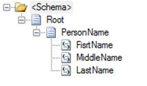

图 52:目标模式

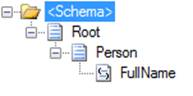

图 53:源模式

我们的地图也会很简单。在下面的映射中，您可以看到我们将遍历 XML 文档中的所有人员记录，然后评估名称是否是字符串，如果是，将其映射到 concatenate functoid，并将 concatenate functoid 的结果与我们的目标节点链接起来。

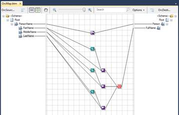

图 54:地图示例

在开发完所有的模式和映射之后，我们就可以开始编排开发了。为此，在解决方案资源管理器中右键单击您的项目，然后单击**添加新项**。在新项目选择屏幕中，选择**流程编排**。然后，BizTalk 将打开业务流程编辑器。

编辑器打开后，将接收形状拖放到设计器中，如图 55 所示。最好的做法是将形状重命名为能暗示其功能和执行的名称。

图 55:添加接收形状

接下来，将转换形状添加到设计器中，并添加发送形状。这将允许您设置一个过程，在该过程中，接收消息，使用地图进行转换，并使用发送形状将其发送到某个位置。然而，正如您在这个非常简单的例子中所看到的，当您开始向它们添加智能时，编排可能会变得复杂。一旦添加了这三个形状，就应该有一个如图 56 所示的编排。

图 56:流程编排示例

在设计了我们的编排之后，现在是时候配置它了，设置它将使用的消息和端口。让我们从信息开始。正如我们有一个源模式和一个目标模式一样，我们也将有两条消息——一条基于源模式，另一条基于目标模式。要创建新消息，右键单击编排视图面板中的**消息**文件夹，并选择**新消息**。

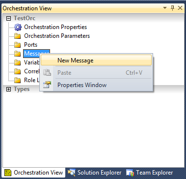

图 57:新消息

BizTalk 将在“属性”窗口中打开“新消息”属性。给消息一个名称，在**消息类型**属性中，选择它应该基于的模式，如图 58 所示。

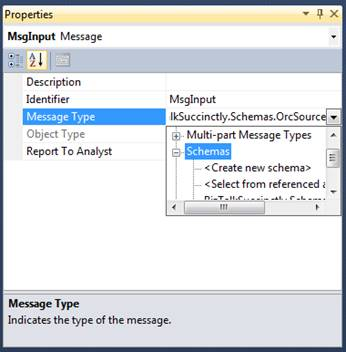

图 58:配置新消息

在本例中，我们将创建两条消息:一条称为 MsgInput，用于源模式消息类型，另一条称为 MsgOutput，用于目标模式消息类型。当您完成两者的创建和配置时，您的消息文件夹应该具有如图 59 所示的消息。

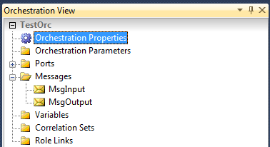

图 59:创建的消息

创建消息后，是时候告诉我们的接收/发送形状，当文档到达它们的一个端口时，它们应该期望哪种消息类型。在这个例子中，我们有一个接收形状和一个发送形状。要开始接收形状，请在设计器中单击它，并在属性窗口中将**消息**属性配置为**移动输入**。将**发送形状**属性设置为**发送形状**。

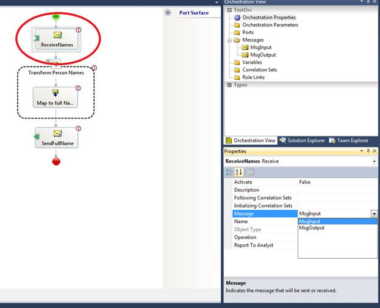

图 60:配置接收/发送形状消息

现在，让我们设置我们的转换形状。双击它，将出现转换配置窗口。图 61 显示了这个屏幕。

图 61:转换配置

在这个配置屏幕中，您将告诉编排当 MsgInput 到达时应该如何转换它。选择屏幕顶部的**现有地图**单选按钮，这样我们就可以选择我们创建的地图。接下来，在**完全限定地图名称**属性中选择我们的地图。最后，我们需要告诉转换形状哪个是输入消息，哪个是输出消息。在各自的**变量名**组合框中选择我们已经创建的消息。

如您所见，我们没有定义任何接收或发送端口，只有形状。请注意，这些只是逻辑端口，不是物理端口；这些将在以后的 BizTalk 服务器管理员中进行配置。

要在编排中配置这些逻辑端口，您需要将端口形状拖放到编排设计器的**端口表面**通道。有两个端口曲面，一个用于左侧的接收端口，另一个用于右侧的发送端口。图 62 显示了接收端口通道。

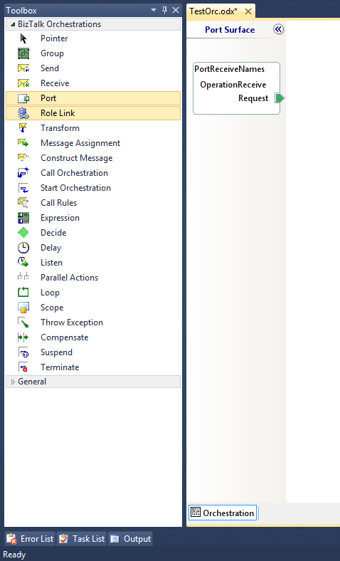

图 62:接收端口通道

现在，让我们将第一个端口添加到编排中——接收端口。为此，请将其拖放到左侧的港口地面车道。一旦删除它，BizTalk 将启动端口配置向导，如图 63 所示。

图 63:端口配置向导

该向导的第一步是命名端口。

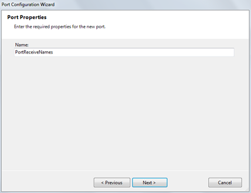

图 64:端口配置向导—名称

一旦点击**下一步**，向导将带您进入端口配置向导中最重要的屏幕之一，在此您可以设置端口类型，它定义了您的端口方向(单向或双向)和访问限制。图 65 显示了这个端口配置屏幕。

图 65:配置端口类型

第一个配置项允许您在创建新端口类型和使用现有端口类型之间进行选择。例如，选择**创建新的端口类型**。

接下来，为您的端口类型命名，并选择**单向**作为通信模式。此单向选项定义您的端口将只接收或发送消息。我们将选择这个端口，因为我们将转换接收到的消息，并且仅在此之后发送它，所以我们需要创建两个不同的端口——一个用于接收，另一个用于发送。但是，如果您想在没有任何转换的情况下接收和发送给合作伙伴，或者甚至与发送请求和接收响应的 web 服务进行通信，您可以使用 Request-Response 模式。

可用的访问限制允许您定义谁可以使用此端口类型:只有此模块(私有)、只有允许在此项目中使用端口类型的工件(内部)或每个人(公共)。让我们为我们的例子选择内部选项，因为这将是一个单一的项目端口类型。虽然我们将选择内部选项，但正如您所见，有三种类型的访问限制:

*   **私有**—此端口类型只能在此业务流程中使用
*   **内部**—该端口类型可用于本项目内的不同业务流程
*   **公共**—该端口类型可由任何项目中的任何人使用

定义端口类型后，选择**下一步**打开配置向导的端口绑定屏幕。如您所见，您还没有定义这是接收端口还是发送端口；该配置在该屏幕中设置。现在，当我们正在创建一个接收端口时，让我们选择**我将一直在这个端口**上接收消息，在**通信端口方向**下。在**端口绑定**下，选择**稍后指定**，因为我们稍后会与 BizTalk 管理员绑定端口。点击**下一步**。

图 66:配置接收端口类型

**端口绑定**是决定消息将在何处以及如何发送或接收的配置信息。根据其类型，端口绑定可能引用物理位置、管道或其他编排。有三种类型的端口绑定用于接收消息:

*   **立即指定**—允许您在设计时指定要使用的管道以及要与之通信的位置。它也被称为“设计时绑定”
*   **稍后指定**—如果没有指定物理位置所需的全部信息，可以在编排设计器中选择“稍后指定端口绑定”选项，只需指定描述端口的端口类型。也称为“部署时绑定”
*   **直接**—您的业务流程可以使用直接绑定直接与另一个业务流程进行通信。在这种情况下，消息由引擎在内部处理，不会发生消息的外部传输。

最后一种端口绑定类型被限制为发送消息:

*   **动态**—如果在运行时才知道通信的位置，可以对发送端口使用动态绑定。例如，可以根据传入消息的属性来确定位置。

向导完成后，BizTalk 将带您回到业务流程设计器。现在是时候将这个最近创建的接收端口链接到我们的接收形状了。这就是如何告诉业务流程这些接收的消息将从这个端口和端口类型到达。

图 67 显示了您的编排应该如何看待这一点:

图 67:将端口链接到接收形状

现在，对发送端口重复这个过程。将端口形状拖放到设计器右侧的端口表面，并使用端口创建向导配置端口，注意定义端口是接收端口还是发送端口的步骤。图 68 显示了端口绑定步骤。

图 68:配置发送端口

为了完成我们的编排设计，将最近创建的发送端口链接到发送形状，您的编排应该如图 69 所示。

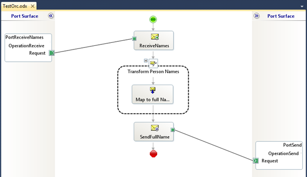

图 69:最终的编排示例

即使它看起来很完整，在编译应用程序并将其部署到 BizTalk 服务器之前，您仍然需要进行一些配置。第一个强制步骤是设置一个活动的接收形状，因为 BizTalk 要求至少有一个接收形状正在监听我们的业务流程中的消息到达。对于那些刚接触 BizTalk 服务器的人来说，这是一个常见的错误。图 70 显示了在没有活动接收形状的情况下试图编译应用程序时的错误消息。

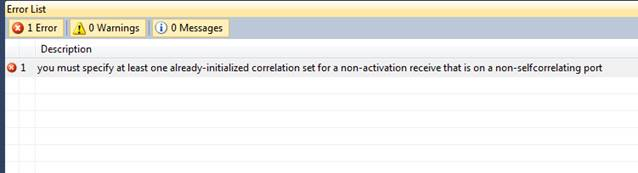

图 70:没有活动接收形状时的错误

为了避免这个问题，您应该选择您想要激活的接收形状，并在接收形状的属性窗口中，将**激活**属性设置为**真**。

图 71:激活接收形状

现在，您的应用程序可以编译并部署到 BizTalk 服务器了。下一章将告诉你如何做。