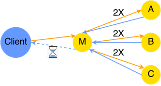
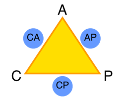
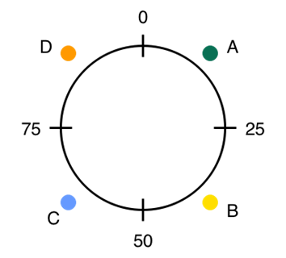
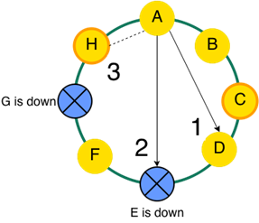
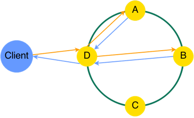
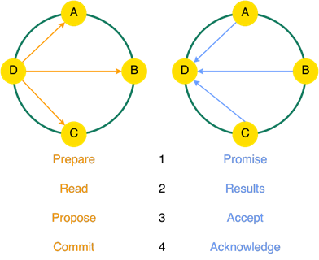
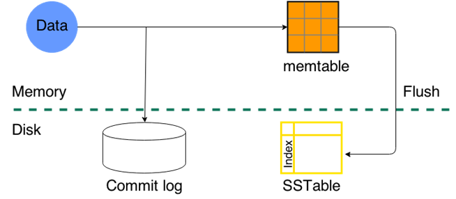
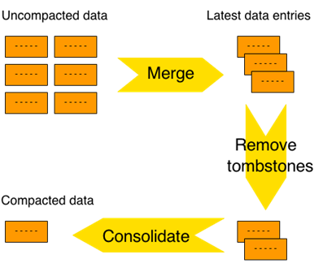
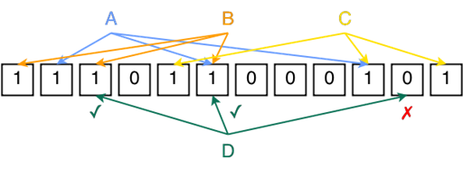

# 第一章引言

Apache Cassandra 是一个非常可扩展的 NoSQL 开源数据库，设计为一个对等分布式系统，其中所有节点都是相同的，数据分布在集群中的节点之间。由于不存在单点故障，集群中的节点出现故障对 Cassandra 来说并不是什么大问题。在正常工作时间添加节点和从集群中取出节点是一件常见的事情，而不必在夜间等待系统负载下降。此外，卡珊德拉的一个关键特性是它可以在商品硬件上工作，并且可以轻松部署在基于云的基础设施上。

|  | 注意:在 Cassandra 术语中，节点是一个 Cassandra 实例。集群是由两个或多个节点组成的一组，这些节点一起工作，并使用流言协议进行通信。 |

## 卡珊德拉这个名字

先说名字。卡桑德拉是特洛伊国王普里阿摩斯和王后赫库巴的美丽女儿。阿波罗，希腊音乐、诗歌、艺术、神谕、射箭、瘟疫、医学、太阳、光和知识之神，第一次见到卡珊德拉就爱上了她。他给了她预言的礼物来交换一个吻。卡珊德拉同意了，她收到了预言的礼物，但她随后拒绝了阿波罗。礼物无法收回，所以阿波罗诅咒她，这样就没有人会相信她的预言。

名字背后的故事并不像一开始看起来那么简单。有人说，选择的名字实际上与一种流行的存储技术的名字有关，并认为脸书的工程师选择卡珊德拉这个名字是因为卡珊德拉是一个被诅咒的先知。

## 阿帕奇·卡珊德拉的历史

卡珊德拉所依赖的许多概念来自于 2005 年开发的谷歌 BigTable 和 2007 年的亚马逊 Dynamo。迪纳摩论文的作者之一阿维纳什·拉克什曼和[普拉尚特·马利克](https://www.linkedin.com/in/prmalik)在脸书开发了卡珊德拉的第一个版本，以支持收件箱搜索功能。

2008 年，脸书在谷歌代码上发布了它。2009 年成为 Apache 孵化器项目；2010 年晋升为顶级项目。从那以后，卡珊德拉已经发布了八次以上，被 39 个国家的 400 多家公司使用。卡珊德拉对 NoSQL 的影响是非常显著的，尤其是考虑到 25%的财富 100 强公司使用卡珊德拉，尽管现在几乎有数百种其他 NoSQL 解决方案可用。

让我们来看看一些使用 Cassandra 的公司和组织。网飞用卡珊德拉存储客户观看数据，易贝用它来检测欺诈和他们平台的社交组件，Expedia 用它来缓存酒店房间价格，SoundCloud 用它来存储用户的仪表盘，CERN 用它来监控 ATLAS 实验的数据采集系统(发现希格斯玻色子的两个系统之一)。

如前所述，Cassandra 是一个开源项目，有许多提交者在从事这项工作。卡桑德拉委托人受雇于脸书、苹果、推特和诺基亚西门子通信等公司，其中大多数委托人来自数据税。DataStax 的商业模式是基于为企业级版本的 Cassandra 提供分销和支持。DataStax 还支持并主持许多与 Cassandra 社区相关的活动。

## 卡珊德拉背后的基础理论

为了理解卡珊德拉和分布式系统背后的原理(以及导致其发展的动机)，我们必须后退一步，看看这一切是如何在没有像今天的系统那样处理大规模数据的系统中完成的。

### 垂直缩放

过去，大型集中式服务器管理所有存储。如果系统需要扩展，可以购买性能更好的服务器，并将数据转移到新的硬件上。这种类型的缩放称为垂直或向上缩放。

图 1:垂直缩放

这种扩展方法受到当前可用硬件的限制，更不用说硬件越大，价格就越高。另一个问题是，例如，如果只需要增加 10%的容量(或该范围内的容量)，仍然需要购买新的硬件。现在，这种方法没有错；几十年来，它的功能一直很好，并且在日常生活中仍然被大量使用。然而，随着各种系统的发展和这些系统规模的增加，垂直扩展方法碰壁了，更不用说，即使是系统上最小的变化，也很难移动千兆字节的数据。此外，丢失服务器通常意味着丢失数据，或者需要复杂的过程来恢复数据。

### 关系数据库

几十年来，关系数据库是处理数据的主要技术。在关系数据库中，对数据库执行的工作单元称为事务。关系数据库通常被称为事务系统，关系数据库基本上必须提供执行事务的环境。

交易属性有:

*   原子性:如果事务的一部分失败，整个事务都会失败。
*   一致性:每一个变化都必须符合约束、触发器等。
*   隔离:正在进行的事务不会相互干扰。
*   持久性:事务完成后，数据仍会保存，以防出现故障。

当数据分布在多个物理机器上时，事务属性(通常称为 ACID)更难提供。例如，ACID 需要分布式锁定资源。当事务数量增加，系统开始花费越来越多的时间进行协调，而节点等待其他节点完成并确认操作时，这种锁定就会成为一个问题。

通常，使用某种主/从架构。主机决定数据的存储位置，等待从机响应。扩展问题是双重的:吞吐量取决于主机的容量，并且系统中包含的节点越多，维护事务的 ACID 属性所需的通信就越多。

图 2:在带有主节点的 ACID 分布式系统中等待操作完成的客户端

考虑到在上图中，从主设备到从设备的请求数量实际上是原来的两倍，因为在第一阶段，主设备通知从设备将要发生的变化；然后每个奴隶都承认是否可以。然后，主节点必须通知其他节点同意，并且事务通过，并且它必须再次等待它们的响应。

### CAP 定理

2000 年，埃里克·布鲁尔发表了 CAP 定理。麻省理工学院的赛斯·吉尔伯特和南希·林奇在 2002 年正式证明了这个定理。简而言之，该定理指出分布式系统可以同时提供以下三种保证中的两种:

*   一致性:每次读取都从最近一次写入中获取数据。
*   可用性:每个运行的节点总是响应一个查询。
*   分区容差:尽管节点中断，系统仍继续运行。

这种选择通常用下面的三角形来描述。

图 3: CAP 定理的选择

虽然这个“三分之二”的规则背后有很多理论，但布鲁尔在 2012 年表示，这有点被误解了。首先，大多数系统没有分区，因此在 A 和 C 之间进行选择通常不是真正必要的，因为 P 在单节点系统中是不相关的。其次，A 和 C 之间的选择可以发生在系统本身的许多层面。最后，这三个属性都比二进制更连续。布鲁尔还指出，CAP 一致性与 ACID 一致性并不相同，CAP 仅指单拷贝一致性，是 ACID 一致性的纯子集。

|  | 注意:在分布式系统中，它归结为可用性或一致性。 |

以前围绕 CAP 中被误解的概念进行的推理可能看起来有点复杂，但“三选二”，实际上归结为“二选一”，所以更像是在“A”和“C”之间进行选择。为了获得可用性，数据被复制到不同的机器上。一致性是通过在允许进一步读取之前更新其他节点来实现的。因此，允许在其他节点更新之前读取的系统获得高“A”。在允许读取之前锁定其他节点的系统具有高“C”。对于卡珊德拉来说，这个选择更倾向于“A”。

### 一致哈希

Cassandra 是一个对等系统。我们已经提到过几次，当我们通过一个特定大小的集群时，让某个节点或其他中心位置在集群内分发数据本身是非常低效的。因此，基本思想是为节点提供某种方式来知道在集群中的哪个节点上放置数据。现在，让我们假设数据键将是一个非常大的数字——大到足以让我们随机选择它，而不用担心这个数字再次出现。我们称之为“RowID”。

将这些数据分配给 *N* 个节点的最简单的算法是将 RowID 除以 *N* ，然后查看余数。剩余部分的范围将始终从 0 到 *N* -1。如果我们将剩余部分为 0 的所有键分配给节点 A，将 1 分配给节点 B，将 2 分配给节点 C，以此类推，我们将有一个很好的方法来知道一行属于哪个节点。尽管这听起来很棒，但这种分发数据的方式有一个非常严重的缺点，即当节点数量发生变化时，存储在集群中的所有数据实际上都开始属于某个其他节点。实际上，这意味着在系统运行时关闭任何节点都将导致集群无响应，并且可能变得无用，直到所有数据都转移到适当的服务器。

避免以这种规模移动数据的一种方法是将可能的 RowID 值的整个空间划分为相等的大小。

图 4:用一系列值进行分区

图 4 显示了从 0 到 99 的行标识值。请记住，RowID 是一个代表一行的非常大的数字，但是为了简单起见，我们使用的范围是从 0 到 99。前 25 个 RowID 值属于 A，后 25 个属于 B，依此类推。如果由于某种原因，另一个节点加入了集群，那么只有一部分数据会在节点之间转移，而不是全部。卡珊德拉长期以来都是这样工作的。一个没有指定从 0 到 99 的数字，而是使用特殊工具为节点生成这些边界值，边界值保存在配置文件中。这种方法的缺点是必须手动完成，因此容易出错。

在进入解释什么是一致哈希以及为什么使用它的最后一轮之前，让我们后退一步。以前，我们有一个很大的数字 RowID 来标识数据。我们以为这只是一个随机数，但事实并非如此。Cassandra 中的每一条数据都有一个行键，一些确定性的值，用来标识我们想要存储和操作的行。

该值在应用程序级别确定，并在必要时用于检索数据。通常它被称为一把钥匙。这个键值是唯一的，但是因为它可能不是一个数字(也就是说，它是一个用户名或电子邮件地址)，所以不可能将其直接映射到一个唯一的数字，我们可以用它来确定这个数据属于哪个节点。能够从应用程序密钥中确定性地获得一个用于存储数据的数字是非常重要的。使我们能够将任意大小的键转换成固定大小的数字来处理数据的函数称为散列函数。在卡珊德拉的例子中，使用了 mur3 散列函数，其范围从-2 63 到 2 63 -1。

为了避免手动将散列函数范围分配给节点，可以使用简单的算法。例如，我们可以取一个节点的名称并计算它的哈希值，这将产生一个数字。如果我们对集群中的每个节点都这样做，我们可以用边界标记值来划分可能的散列范围，边界标记值由作为节点名称的散列值产生的数字来定义。

图 5:使用节点名哈希值的动态分区

上图中显示的技术称为一致哈希。请注意，对分区大小或它们的顺序没有任何保证。该算法非常简单，任何参与集群的节点都可以重建它，并知道具有某个哈希值的行属于哪里。无论散列函数对行关键字的结果是什么，通过顺时针或逆时针移动找到节点，直到找到属于该节点的标记。计算出的行标识属于找到的节点的标记值。

哈希函数的输出不能保证落入任何对称范围。如上图所示，一些节点(在我们的例子中是节点 D)可能比其他节点保存更多的数据。这可能导致一个节点未得到充分利用，另一个节点在高负载下工作。为了在节点之间平均分配这些数据，可以创建许多更小的分区。理论上，我们在这个范围内设置多少标记没有实际限制。如果我们简单地将一些预定义的数字或字母前缀或后缀与节点的名称结合起来，并将结果散列放在前面的范围中作为标记，我们可能会得到更好的范围分布。算法保持不变:顺时针或逆时针移动，直到找到标记。默认情况下，Cassandra 为范围内的每个节点放置 256 个标记。

图 6:具有三个节点的 Cassandra 集群上 mur3 哈希分布的示例

如果我们想让一些节点保存更少量的数据，我们可以给它们分配更少的标记(或者为更大量的数据分配更多的标记)。散列输出分布中有更多的标记意味着获得更多数据的概率更大，反之亦然。这种技术提供了许多优势，因为如果我们向集群添加一个节点，所有节点都将向新节点分发一点数据。如果一个节点离开集群，其余节点将几乎均等地分割其数据。稍后我们将介绍 Cassandra 的虚拟节点技术。虽然看起来很复杂，但虚拟节点只是 mur3 哈希函数输出范围上的许多标记，如前所述。

## 架构概述

Cassandra 是一个面向行的数据库。每一行都由其关键字标识。卡珊德拉的限制之一是，一行必须适合一个节点。行在节点上的放置是自动发生的，因为没有确定行存储位置的中心节点。所有节点都使用相同的算法来确定数据分布，基本上是计算行关键字的哈希值并查找最近的标记。

这个散列函数有范围，根据集群中可用的节点，节点负责一定数量的行。如果某个节点离开群集，密钥哈希保持不变，但其他某个或多个节点将负责故障节点负责的哈希范围。当一个新节点被添加到集群中时，情况类似。

需要注意的是，由于系统的容错性，单行通常不会只存储在一个节点上。在开发和测试环境中，一行通常只存储在一个节点上。将行存储在多个节点上很重要，因为任何节点都可能随时被取出或出现某种故障。

### 复制因子

谈到数据复制，首先要考虑的一个问题是，实际上需要一行的多少份拷贝？这个问题不好回答；这取决于很多情况。讨论数据复制时，要记住的最重要的术语是复制因子，即存储同一行的节点数。

例如，复制因素二保证集群中的节点上有两个数据副本。选择两个节点对于覆盖单节点故障来说很好，对于生产级部署来说是最低限度的(尽管这并不可取，因为如果一个节点发生了任何事情，剩下的节点必须处理所有的请求，这总是一个坏主意)。

当节点更频繁地出现故障时，需要更高的复制因子。此外，在某些情况下，更高的复制因子将提高读取速度，因为多个节点对数据部分的响应速度将比单个节点传输所有所需数据的速度更快。另一方面，从一个节点到另一个节点的数据复制需要更长的时间。根据经验，低于或高于 3 必须由设计或环境环境来证明。

### 键空间和列族

通常，不是所有的数据都同等重要。一些历史记录信息可能不如测量数据有价值。Cassandra 允许将数据分组到所谓的键空间中。一般来说，键空间是应用程序数据的容器。通常，一个集群每个应用程序有一个键空间。但从卡珊德拉的角度来看，关键空间的主要问题是控制复制。

|  | 注意:复制是在键空间级别定义的。 |

存储数据的下一个子单元称为列族。列族是行的有序集合的容器。每一行都是有序的列集合。大多数关于卡珊德拉的文献将列族描述为类似于关系世界中的表。

### 复制策略

前面我们介绍了节点以及确定数据将存储在哪个节点上。要获得特定的复制因子，最简单的策略是将数据复制到哈希分布环上的下一个节点，直到获得所需的复制因子。这种策略在卡珊德拉被称为 SimpleStrategy。这种策略对于许多较小规模的系统来说很好，但有时仅仅在数据中心复制数据是不够的。有些系统可能有不同的拓扑结构，如果每一毫秒都有价值，那么不断地从一个海岸到另一个海岸复制数据并不是最好的解决方案。

卡珊德拉的第二个复制策略叫做网络拓扑策略。如果您计划在多个数据中心之间分发数据，此策略是最佳选择。网络拓扑系统策略和简单策略之间的主要区别在于，确定保存复制数据的下一个节点继续顺时针进行，直到找到同一机架之外的节点。机架中的节点通常会因为电源故障或设施条件(如空调损坏或网络设备故障)而一起出现故障。

这里最重要的问题是确定数据中心内满足读取需求所需的副本数量，而无需前往其他数据中心获取数据。在每个数据中心有两个副本的情况下，一个节点随时可能出现故障，并且行仍然是可读的。三个副本使两个节点掉出，以此类推。其他数据中心也可能有不同的复制因素；例如，在一个数据中心有三个副本来服务实时请求，在另一个数据中心有一个副本来进行批处理或分析。

### 八卦协议和飞贼

用于共享节点位置和参与 Cassandra 集群的节点的状态信息的协议称为流言。卡珊德拉节点不断说三道四；每个节点大约每秒钟发起一次与集群中多达三个节点的流言交换。

图 7:八卦互动

为了防止鸡和蛋的故事，初始主机列表存储在配置文件中。通常会选择初始主机，以便它们成为集群中相对稳定的节点。在上图中，集群中的初始节点是 H 和 C；它们周围有轻微的边框。

存储在这个初始列表中的节点称为种子。需要注意的是，种子节点在集群中没有特殊处理。种子节点更多的是一个八卦协议，更快的初始化和恢复类型的东西。此外，八卦信息由每个节点本地保存，以便节点在重启的情况下恢复得更快。与任何协议一样，节点向其他节点发送请求也有规则。八卦协议很简单；它由三个步骤组成(第三步是可选的)。每个活动节点总是重复这三个步骤:

1.  八卦到随机直播节点。
2.  向随机的下行节点发起流言。
3.  如果第一步中选择的节点不是种子节点，则闲言碎语改为随机种子节点。

数据在节点之间移动和通信，然后被称为飞贼的 Cassandra 组件使用。基本上，这个组件会根据一些试探法选择其他节点进行查询和复制。飞贼配置对集群中的所有节点都是相同的。根据配置的不同，告密者可以了解数据中心和机架。

飞贼配置:

*   简单飞贼:用于单一数据中心部署；以这种方式配置的飞贼不使用关于机架或数据中心的信息。这是一种简单的“寻找下一个”行为。
*   动态告密:根据历史记录监控副本的性能，并根据一个简单的度量标准选择最佳副本，该度量标准会缩短长响应时间，并避免查询正在压缩其数据的节点。
*   使用 IP 地址八位字节来确定节点位置。IP 地址的最后一部分标识节点。倒数第二个标识机架，倒数第三个标识数据中心。
*   属性文件组:允许在属性文件中定义集群拓扑。如果由于随机和非结构化的 IP 地址，RackInferringSnitch 不适用，则最常用。
*   GossipingPropertyFileSnitch:使用属性文件进行初始配置，并继续使用 GossipingPropertyFileSnitch 将该信息传递给其他节点。
*   EC2Snitch:用于亚马逊 EC2 上相对简单的部署，所有节点都在一个区域内。
*   EC2MultiRegionSnitch:与上一个相同，但将亚马逊的区域视为数据中心，将可用性区域视为机架。

### 协调器节点

在 Cassandra 的架构中，所有节点都是一样的；没有任何类型的专门节点。群集中的任何节点都可以处理客户端的读写请求。通常表示卡珊德拉集群的方式是一个环，这主要是因为卡珊德拉的内部工作方式和前面提到的一致散列函数。

客户端可以向集群中的任何节点请求信息，或者向其发送写请求。客户端选择哪个节点并不重要；所有客户端的列表中通常都有多个节点。如果一个客户端在列表中只有一个节点，当第一次从列表中联系该节点时，它会获得其他节点的列表。

在 Cassandra 术语中，执行响应当前请求所需的操作和请求的节点称为协调器节点。协调器节点充当客户端请求和群集中实际存储了所请求数据的节点之间的代理。根据网络拓扑，协调器节点将联系其他数据中心的一个或多个节点，使联系的节点成为联系的数据中心的协调器。在单个数据中心级别，这可能看起来像下图。

图 8:处理客户端请求的协调器节点

发送到其他节点的请求数量取决于复制因素。复制因子越大，协调器节点查询的节点就越多。但是，为了响应客户端请求，协调器节点不必总是等待所有请求。客户端可能对来自任何节点的第一个也是最快的响应感到满意。这取决于客户端希望读取或写入的一致性级别。

|  | 注意:一致性级别由应用程序在请求级别上指定。 |

当写入时，协调器有时无法到达负责记录的节点；例如，当节点关闭或出现某种网络问题时。有时甚至副本节点都不可用。如果由请求一致性级别指定，则协调器节点可以保存该记录，并等待节点再次恢复。这种技术被称为暗示切换。请记住，只要该记录没有写入负责该记录的节点，任何查询都不会看到该记录。保存提示切换数据的节点从不使用该数据响应查询。该提示包含将数据传输到不可用节点所需的所有信息。

提示包括:

*   不可用节点的位置。
*   需要重播的行。
*   正在写入的实际数据。

默认情况下，提示存储三个小时。如果副本长时间不可用，那么它可能会严重损坏。在这种情况下，数据必须在卡珊德拉修复工具的帮助下重新复制。提示数据存储在 system.hints 表中。

|  | 注意:在提示切换中，协调器节点保存不可用节点的写入。 |

此外，协调器节点检查从副本接收的数据。具有最新时间戳的数据被发送到客户端。有时可能会发生某些副本具有旧数据的情况。如果协调器节点注意到副本具有过期数据，它将发送该行的更新。这个过程称为读取修复。

### 一致性

一致性级别基本上是需要响应来自客户端的写或读请求的节点数量。自 Cassandra 2.0 以来，有两种类型的一致性:

*   可调一致性:所需的一致性由发出请求的客户端指定。
*   可线性化一致性:类似于主/从系统中的两阶段提交。允许在不干扰其他操作的情况下按顺序执行操作。

当谈到可调一致性时，读和写请求类型之间存在差异。

在进一步讨论一致性之前，了解什么是法定人数很重要。从本质上讲，法定人数只是一个数字，它决定了为使请求被认为是成功的，响应请求所需的副本的最小数量。

|  | 注意:法定人数是通过向下舍入(replication_factor / 2) + 1 来计算的。 |

复制因子为 3 时，法定人数为 2。因此，在复制因子为 3 的情况下，仲裁一致性级别允许一个节点宕机。对于 5 的复制因子，法定人数为 3，允许 2 个节点宕机。

让我们从读一致性级别开始，然后看看写一致性级别。

卡珊德拉读取一致性级别为:

*   `ALL`:返回带有最新时间戳的记录。如果一个副本没有响应，则失败。
*   `EACH_QUORUM`:在每个数据中心的节点达到法定数量后，返回最新的一行。
*   `QUORUM`:在副本法定数量响应后返回记录。
*   `LOCAL_QUORUM`:返回当前数据中心法定人数的最新时间戳。
*   `SERIAL`:用于可线性化的一致性水平。
*   `LOCAL_SERIAL`:用于在数据中心内实现可线性化的一致性水平。
*   `ONE`:返回飞贼确定的最近副本。
*   `LOCAL_ONE`:返回飞贼确定的本地数据中心最近的副本。
*   `TWO`:从两个最近的副本中返回最近的数据。
*   `THREE`:从三个最近的副本中返回最近的数据。

卡珊德拉写一致性级别是:

*   `ANY`:必须写入至少一个副本，或者必须写入提示切换。
*   `ALL`:写操作必须写入所有副本节点上的提交日志和 memtable。
*   `EACH_QUORUM`:写操作必须写入所有中心的法定节点上的提交日志和 memtable。
*   `QUORUM`:写操作必须由法定数量的副本确认。
*   `LOCAL_QUORUM`:写入必须由本地数据中心的法定副本确认。
*   `SERIAL`:用于实现可线性化的一致性。
*   `LOCAL_SERIAL`:用于在本地数据中心实现可线性化的一致性。
*   `ONE`:写操作必须由一个副本确认。
*   `LOCAL_ONE`:写操作必须得到本地数据中心至少一个节点的确认。
*   `TWO`:一次写入必须得到两个副本的确认。
*   `THREE`:一次写入必须得到三个副本的确认。

请记住，根据读取或写入时的复制因素，数据仍将发送到所有副本。一致性级别设置为确定协调器必须响应多少个副本才能将响应发送回客户端。

通过可线性化的一致性，故事有点不同。这与分布式系统中的强一致性有关。换句话说，读者总是看到最新的书面价值。但有时有些操作必须按顺序执行，不能有其他操作的干扰。这被称为可线性化一致性。可线性化一致性的最简单情况是系统中具有唯一用户名或电子邮件的问题。在将用户名写入集群之前，我们必须确保没有其他具有该用户名的记录。此外，从我们检查到我们发出写请求，没有数据可以用这个用户名写入。卡珊德拉的这个问题是通过使用 Paxos 共识协议解决的。

在 Paxos 共识协议中，任何节点都可以提出一个值；这个节点称为引线。多个节点可以同时充当领导者，但是在成为领导者之前，每个副本节点都必须处理领导者的请求。该协议分四个阶段运行，并且是请求密集型的，但是很少有必须使用它的情况。如前所述，这是为了确保全球唯一的用户名、电子邮件或其他数据的唯一性。

图 9:可线性化一致性的四个阶段

## 卡珊德拉内部

传统的关系数据库存储系统花费大量资源来构造数据和维护关系完整性。在 Cassandra 中，维护关系完整性不是问题，因为 Cassandra 的表是不相关的，关系的解决由应用程序决定。在大多数情况下，Cassandra 的写入速度比传统数据库系统快得多。这都与卡珊德拉的内部运作有关。

### 写路径

在 Cassandra 中写入数据的相关过程有:

*   将数据写入提交日志。
*   将数据写入 memtable。
*   从 memtable 中刷新数据。
*   将刷新的数据存储到表中。
*   压缩数据。

图 10:卡珊德拉写路径

当卡珊德拉将数据存储到 memtable 和提交日志中时，数据被确认为已写入。提交日志以仅追加的方式存储对节点的每次写入，而不对磁盘进行任何随机搜索。memtable 将写入的数据保持在一定的可配置限度内。达到限制后，memtable 数据被刷新到磁盘上的表中。当将 memtable 刷新为 SSTable 时，SSTable 保持不变；数据通常存储在多个表中。将数据刷新到 SSTable 后，Cassandra 创建了两个内存中的数据结构:带有主键的分区索引和 SSTable 文件中行的起始位置。分区摘要是主键集的子集，通常每 128 个键。

### 数据更新、删除和压缩

Cassandra 不对写入的数据执行任何插入或更新操作。这需要随机的输入/输出操作，效率不是很高。如果数据被更新或插入，卡珊德拉只需将新数据和新时间戳写入 memtable，然后写入 SSTable。随着时间的推移，冗余数据不断累积；然后在一个称为压缩的过程中删除这些冗余数据。

删除操作也没有做到位，只是故事有点不一样。卡珊德拉只是简单地将数据标记为删除。这个标记叫做墓碑。标有墓碑的数据存在一段预先配置的时间，通常为 10 天。数据不会立即删除，因为其他节点可能仍然没有用墓碑标记这些数据。一旦接收到删除请求的节点收到一个读取请求，它就会响应说它没有记录。但是，由于其他节点可能仍然存储着该记录，协调器节点会得出结论，该数据需要复制到实际删除该数据的节点。这就是墓碑发挥作用的地方。当协调器接收到带有墓碑标记的数据时，它通知其他节点该数据被删除，然后其他节点也用墓碑标记它。

|  | 注意:由于 Cassandra 的分布式特性，删除的行会被标记为墓碑，并且不会被完全删除。如果没有墓碑，其他节点可能会认为某个节点错过了写入，并重新创建已删除的行。 |

插入新数据和用墓碑标记数据最终会填满磁盘空间。卡珊德拉不时对数据进行压缩，从表中删除已删除和冗余的数据。

图 11:压实过程

压缩的缺点是，Cassandra 实例通常被配置为仅使用最多一半的可用存储空间来实现压缩过程。在压缩过程中，系统会将现有数据翻倍，然后对其进行优化。

### 读取路径

读取数据时，可以在多个位置找到数据，例如:

*   内存中的记忆表。
*   正在刷新内存表。
*   一个或多个表。

所有这些位置都需要检查，然后与时间戳进行比较，以确定相关数据是什么。在 memtable 中查找数据相对简单，并且从性能方面来说不会花费很多。通常，数据实际上会位于一个或多个表中。

表现在已经被提到过几次了，但是我们还没有详细讨论它们——除了它们是刷新到磁盘的 memtables。我们还提到了 SSTable 文件。实际上，为每个柱族创建了三个单独的文件:

*   布隆过滤器
*   索引
*   数据

布隆过滤器是用于确定元素是否在集合中的相对较老且众所周知的技术。伯顿·霍华德·布鲁姆在 1970 年引进了这项技术。布隆过滤器背后有很多理论和统计数据，但基本上它是一个最初用零填充的长位数组。要向布隆过滤器添加元素，需要计算其哈希值。由于布隆过滤器要求每个元素有多个位，因此该结构可能相对较大，但仍然只是原始数据集大小的一小部分，并且适合保存在内存中。数据被散列，结果位 1 被放入这个长位数组。大多数散列函数的输出为 128 位或该范围内的某个值，因此在计算布隆过滤器的值时，通常会在键上调用多个散列函数，以在过滤器中均匀分布位，并使散列输出等于布隆过滤器的大小。

此外，布隆过滤器更注重概率。如果在过滤器中找到哈希值，那么这意味着搜索到的值可能在那里。如果在筛选器中找不到哈希值，这意味着元素肯定不在集合中。

图 12:值为 A、B 和 c 的布隆过滤器示例。过滤器中找不到值 D。

上图显示了在过滤器中如何找不到元素 D。尽管如此，有时搜索到的值可能会在过滤器中找到，但实际上进入表并查找该值不会返回任何数据。这种情况被称为假阳性。

|  | 注意:布隆过滤器不是 100%确定的。假阳性是可能的。 |

确定搜索到的行是否在表的布隆过滤器中只是读取数据的第一步。在进一步讨论之前，有必要提及两个 Cassandra 数据缓存:

*   分区键缓存:具有分区(行)键的索引。
*   行缓存:对于每一个读行，一整行被放入内存(多个表)。

现在，缓存似乎总是一个好主意，但是关于何时以及如何在 Cassandra 中使用缓存有一些指导原则:

*   不应该缓存很少读取的数据和行很长的数据。
*   尽量保持每个节点的负载尽可能低。
*   将大量读取的数据分成多个列族。

现在让我们回到布隆过滤器返回搜索数据的结果之后会发生什么。

图 13:卡珊德拉中的数据读取

如果布隆过滤器返回请求的数据不可用，则响应将返回给客户端，表示没有与请求匹配的数据。如果布隆过滤器说有数据，它会在缓存中查找。如果缓存包含数据，则根据压缩偏移量计算数据的位置，然后从磁盘中检索数据。如果数据不在缓存中，Cassandra 会读取分区摘要，并尝试根据分区摘要来近似搜索到的数据的位置。之后，进行磁盘寻道以读取索引并确定数据的确切位置。在实际从磁盘加载数据之前，该过程需要检查压缩偏移量。

## 总结

本章介绍部分将 Cassandra 与关系数据库进行了比较。需要注意的是，经典关系数据库没有任何问题，但是当涉及到水平扩展时，它们确实有问题。大多数经典系统只是达到了添加新节点对系统性能影响很小或没有影响的程度。简而言之，有些领域像卡珊德拉这样的存储系统更适合。

卡珊德拉的优势是:

*   快速读写。
*   添加新机器会导致性能线性增长。
*   轻松可靠地设置跨数据中心复制流程。

Cassandra 使用并依赖于很多通常在关系数据库中找不到的原则。这一章更多的是关于卡珊德拉背后的概念和想法，而不是关于实际使用或与卡珊德拉互动。开始接触卡珊德拉可能不需要了解卡珊德拉在遇到挑战时使用的每一种方法，但是许多读者已经在关系世界呆了很长一段时间，有些人甚至想马上和卡珊德拉做点什么。了解卡珊德拉的背景为更好地吸收即将到来的信息提供了坚实的基础。