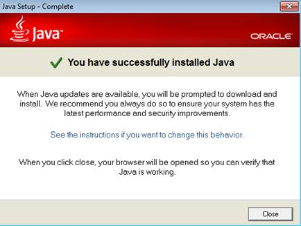
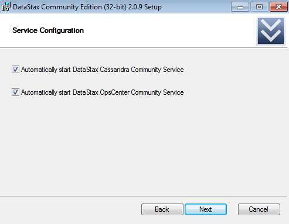
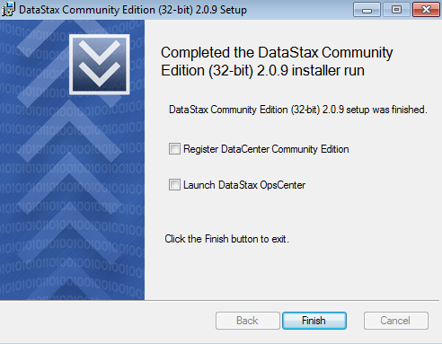
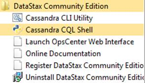
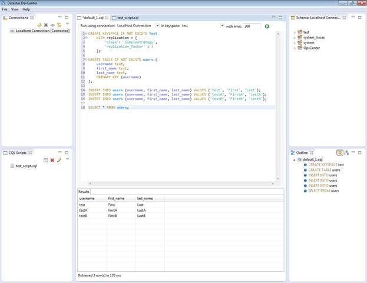
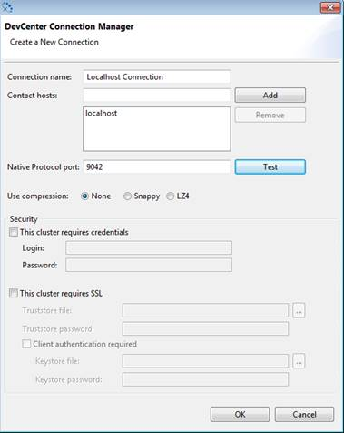
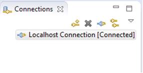
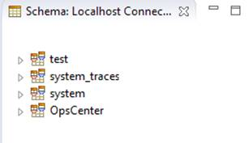
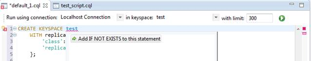
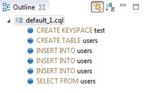

# 二、Cassandra 入门

Cassandra 是开源软件。Cassandra 入门是完全免费的。足以进入 Cassandra 的最基本版本是数据税社区版。下载链接会不时更改，但在撰写本文时，它目前在[这里](http://planetcassandra.org/cassandra)可用。

Cassandra 的数据税社区版支持以下系统:

*   CentOS 5。x 和 6。X
*   红帽企业版 Linux 5。x，6。X
*   Debian 6。X
*   Ubuntu 10.X、11.X、12.X
*   Mac OSX 10。x 个
*   Windows 操作系统系列

能够安装 Cassandra 的系统范围相当广泛，涵盖了当今所有最流行的操作系统。开始时，甚至可以下载包含所有必要软件的 DataStax 沙盒虚拟机来试用预装的 Cassandra。但是，注册是必需的，并且有用户必须接受的许可条款。企业级发行版也是可用的，但这里不涉及。数据税社区版的大多数下载链接都有一个 tarball 下载选项。在下一节中，我们将介绍如何在 CentOS 6.X 上安装 Cassandra。其他系统非常相似。Windows 平台有自己的安装程序，我们也将描述它。

## 用 Tarball 在 Linux 上安装 Cassandra

本节将向您展示如何在 CentOS 6 上安装 Cassandra。x 从零开始。Cassandra 实际上运行在 Java 之上，所以我们首先必须安装 Java。大多数 Linux 发行版实际上都预装了 Java，但我们将介绍安装 Java 以防万一。

### 安装 Java

如果系统安装了适当版本的 Java，请跳过此步骤。最简单的检查方法是使用`java –version`命令。应该安装最新版本的 Oracle Java 7。要下载 Java，使用`wget`命令。如果系统上没有`wget`命令，请安装它。对于 CentOS 来说，就像`yum install wget`一样简单。如果以下`wget`命令因任何原因失败，请手动下载档案并从那里继续。

```sql
    # cd /opt/
    # wget --no-check-certificate -c --header "Cookie: oraclelicense=accept-securebackup-cookie" http://download.oracle.com/otn-pub/java/jdk/7u60-b19/jdk-7u60-linux-i586.tar.gz
    # tar xzf jdk-7u60-linux-i586.tar.gz
    # cd /opt/jdk1.7.0_60/
    # alternatives --install /usr/bin/java java /opt/jdk1.7.0_60/jre/bin/java 2
    # alternatives --install /usr/bin/javaws javaws /opt/jdk1.7.0_60/jre/bin/javaws 2
    # alternatives --install /usr/bin/javac javac /opt/jdk1.7.0_60/bin/javac 2
    # alternatives --config java
    There are 2 programs which provide 'java'.
      Selection    Command
    -----------------------------------------------
    *  1           /opt/jdk1.7.0_60/bin/java
    + 2           /opt/jdk1.7.0_60/jre/bin/java
    Enter to keep the current selection[+], or type selection number: 2 [ENTER]
    # java –version
    java version "1.7.0_60"
    Java(TM) SE Runtime Environment (build 1.7.0_60-b19)
    Java HotSpot(TM) Client VM (build 24.60-b09, mixed mode)
    # export JAVA_HOME=/opt/jdk1.7.0_60
    # export JRE_HOME=/opt/jdk1.7.0_60/jre
    # export PATH=$PATH:/opt/jdk1.7.0_60/bin:/opt/jdk1.7.0_60/jre/bin
    [Add these to ~/.bashrc or the exports will not be set on the next boot]

```

代码清单 1

### 安装 Cassandra 的数据税社区版

一旦安装了 Oracle Java 7，我们就需要下载 Cassandra。下载 Cassandra 后，我们需要检查一些东西，包括 Cassandra 存储数据的目录位置。

```sql
    # cd /opt/
    # wget http://downloads.datastax.com/community/dsc.tar.gz
    # tar xzf dsc.tar.gz
    # sudo mkdir /var/lib/cassandra
    # sudo mkdir /var/log/cassandra
    # sudo chown -R  $USER: $GROUP /var/lib/cassandra
    # sudo chown -R  $USER: $GROUP /var/log/cassandra
    # cd /opt/dsc-cassandra-2.0.9/bin

    [Starting Cassandra in foreground mode]
    # ./cassandra –f
    [If you don’t see error or fatal stack traces you are running Cassandra, but there will be a lot of logging. To stop Cassandra, simply press Ctrl + C]
    [Or start Cassandra in daemon mode. Log will jump out, but pressing Ctrl + C gets out of it and Cassandra will continue to work]
    # ./cassandra
    [To shut down daemon Cassandra use]
    # pkill -f CassandraDaemon

```

代码清单 2

从前面的代码示例中可以看出，启动 Cassandra 通常只需要几分钟，仅此而已。考虑到这是安装 Cassandra 的一个更复杂的版本，并且有包括系统包管理器的更简单的解决方案。这里显示了 tarball 的安装，因为它可以在当今大多数可用的 Linux 环境中工作。

## 在 Windows 上安装 Cassandra

在撰写本文时，最流行的微软视窗版本是视窗 7。其余的视窗系统要么没有官方支持，要么市场份额比视窗 7 小得多。

将解释 Windows 7 的安装过程。如果您要在 32 位系统上安装 Cassandra，请从微软[网站](http://www.microsoft.com/download/details.aspx?id=29)下载并安装微软 Visual C++ 2008 可再发行软件包(x86)。Cassandra 附带的网络实用程序不支持 Internet Explorer 如果你想使用这些工具，请安装 Chrome 或 Firefox。然而，你并不需要这些工具来完成这本书。

还有一些硬件先决条件。面向 Windows 的 Cassandra datatax 社区版已预配置为使用 1 GB 内存。像 Windows 7 这样的操作系统通常至少需要 1 GB 才能顺利运行，因此建议有一个至少有 2 GB 可用内存的环境。请非常小心，不要给系统分配太少的内存，因为安装可能会在没有警告您内存需求的情况下完成，当您尝试运行它时，Cassandra 将不会启动。

|  | 提示:面向 Windows 的 Cassandra datatax 社区版需要 1 GB 或更多内存。 |

### 安装 Java

Windows 的 Java 在这里就有了。同意该页上的条款和条件，下载 Java 安装程序，然后运行下载的软件。


图 14:Windows Java 安装程序的初始屏幕



图 15:在 Windows 上成功安装 Java

在 Windows 上安装某些东西时，前面的数字是相当标准的屏幕。请注意，在安装过程中，可能会显示一条安全消息，通知您即将对系统进行更改。要成功安装 Java，请允许应用程序对系统进行更改。

安装 Java 后，设置 JAVA_HOME 环境变量很重要。Cassandra 安装将在不给出任何关于缺少环境变量的警告的情况下运行，但是如果没有设置该变量，Cassandra 实际上不会启动。要检查或设置 JAVA_HOME 变量:

1.  右键单击**我的电脑**。
2.  从上下文菜单中选择**属性**。
3.  打开**高级系统设置**。
4.  在系统属性窗口中，单击**高级**选项卡。
5.  点击**环境变量**。
6.  添加或更新 **JAVA_HOME** 变量，如下图所示。


图 16:添加 Java 环境变量

JAVA_HOME 变量的值可能因系统而异，因为系统磁盘的名称可能与“C:”不同，或者您在运行 JAVA 安装程序时选择了不同的目标。确保变量中的路径值与安装 Java 的路径相匹配。如果此变量设置不正确，Cassandra 将不会启动。

### 安装 Cassandra 的数据税社区版

数据税社区版在这里提供。根据您运行的是 32 位还是 64 位 Windows，为您的计算机下载版本。唯一的其他选项是 MSI Installer 2.x。下载文件后，以管理员身份运行安装。下图显示了 Windows 7 操作系统上安装程序的步骤。


图 17:数据税社区版安装程序的初始屏幕


图 18:数据税社区版安装程序的许可协议


图 19:目标文件夹选择



图 20:设置 Cassandra 自动启动


图 21:授权对系统的更改



图 22:数据税社区版安装程序的最终屏幕

安装过程类似于任何 Windows 应用程序安装。安装本身不会超过几分钟。如果所有的安装步骤都成功了，那么您的系统现在应该运行 Apache Cassandra 了。此外，一些新项目应该会出现在“开始”菜单中，如下图所示。



图 23:Windows 上数据税社区版的新开始菜单项

确保 Cassandra 已安装的最后一项检查是单击开始菜单中**数据税社区版**文件夹内的**Cassandra CQL 外壳**。如果屏幕上出现类似下图的内容，那么您就可以在 Windows 上使用 Cassandra 了。


图 24:Windows 上的 Cassandra·CQL 外壳

CQL shell 是一个命令行实用程序，用于与 Cassandra 数据库进行交互。运行数据库的指令是用一种叫做 CQL 的语言给出的，它代表 Cassandra 查询语言。使用 CQL 将在后面的章节中介绍。目前，我们不会讨论如何在与 CQL 外壳交互时使用 CQL。CQL 炮弹对大多数任务来说都没问题。与 CQL 一起开发的一个更图形化的工具是数据税开发中心。

## 安装和使用数据税开发中心

Cassandra 附带的基本工具为管理员和开发人员需要执行的大多数日常操作提供了足够的功能集。一个免费的可视化工具，具有更高级的功能和更友好的用户界面，用于创建 CQL 报表，这是一个名为数据税开发中心的独立应用程序。

要安装数据税开发中心:

1.  前往[http://www.datastax.com/download](http://www.datastax.com/download)的数据税网站下载部分。
2.  单击数据税开发中心链接。
3.  选择您正在使用的操作系统，并注意选择正确的 32 位或 64 位选项。下载将自动开始。
4.  下载的应用程序被压缩。将其提取到所需位置。
5.  转到提取的位置，运行**DevCenter.exe**可执行文件。



图 25:数据税开发中心

数据税开发中心基于 Eclipse 富客户端平台。该工具有几个窗格，用户可以自定义其组织。图 25 所示的布局是默认的。最初，界面不会显示太多信息。

要连接到 Cassandra 实例或集群，我们需要通过单击**连接**窗格中的新建连接按钮(称为连接管理器)来添加新连接。



图 26:添加本地连接

在新的连接窗口中加载的初始端口参数对于标准的 Cassandra 安装来说是合适的。为确保连接参数有效，点击**测试**按钮。如果连接成功，将显示确认对话框。


图 27:成功的 Cassandra 连接测试

在 DevCenter 中添加连接后，不会发生太多事情。为了连接到 Cassandra，我们必须使用连接管理器，该管理器用于创建、编辑、删除、打开和关闭集群连接。



图 28:开发中心连接管理器

单击打开连接图标后，开发中心连接到选定的 Cassandra 集群。前面我们提到了键空间，即 Cassandra 中定义复制的顶级数据容器。开发中心在右上角的模式导航器中为用户提供了一个很好的键空间概述。



图 29:开发中心模式导航器

模式导航器可用于向下浏览 Cassandra 的对象结构到列级别。这对于检查列的名称或特定列的数据类型非常有用。

随着时间的推移，用户将积累大量的脚本来对 Cassandra 数据库执行各种操作。开发中心还有一个管理 CQL 脚本的面板。


图 30:开发中心 CQL 脚本

您可能最常使用的窗格是查询编辑器，即开发中心的中上窗格。它具有语法突出显示和自动完成等功能，可以通过按 Ctrl+空格键来调用。如果多个连接同时打开，您可以在“查询编辑器”窗格顶部的“使用连接运行”下拉列表中选择要在哪个连接上运行命令。默认情况下不选择任何连接，因此您必须在运行查询之前选择一个连接。选择连接后，还可以从键空间下拉菜单中选择将在其中执行命令的键空间。

我之前提到过，Cassandra 通常会处理大量的数据。为了防止用户试图从系统中获取太多数据并可能导致集群中的性能问题，查询编辑器运行所有读取语句都有限制。初始限制设置为 300。最终的极限调整由用户决定。

运行查询的方法是选择一个脚本，然后点击**带限制**文本框右侧的执行 CQL 脚本按钮，或者按 Alt+F11。多个打开的脚本将在编辑器中显示为选项卡，如下图所示。


图 31:带有多个脚本的开发中心查询编辑器

查询编辑器还会在您键入时检测错误，并提出可能的解决方案。



图 32:开发中心查询编辑器错误检测和纠正

有些命令会以表格形式产生结果。这些结果显示在“结果”窗格中，您可以在其中看到最新查询的结果。结果窗格非常简单；它显示选定的列及其值。二进制值将显示一个标记，在开发中心查询编辑器中还不能进入单个字节。


图 33:开发中心结果窗格

当浏览大型脚本时，很容易丢失整个脚本的概述。在开发中心的右下角，“大纲”窗格可用于纠正这种情况。双击其中的语句会将用户带到当前打开的脚本中的相应语句。



图 34:开发中心大纲窗格

## 总结

在本章中，我们讨论了如何在当今最流行的两种操作系统上安装 Cassandra:Linux 和微软 Windows。我们看到 Cassandra 的基本安装很简单，通常只需要几分钟就可以设置好一切。

Cassandra 的核心是一个 Java 应用程序，因此我们介绍了如何设置运行 Cassandra 所需的基本 Java 环境。Java 的安装需要一些调整，尤其是在 Windows 平台上，但总的来说，Java 是一个非常稳定、可扩展、经得起考验的平台，被许多公司用于无数生产系统中。

Cassandra 包括一些有用且强大的工具，如`cqlsh`和`nodetool`。我们在本章中没有涉及这些，因为要使用它们，没有必要设置与 Cassandra 交互所需的相同环境。

在本章中，我们还介绍了如何安装和使用名为 DataStax DevCenter 的工具。DevCenter 适合没有命令行经验的用户，对于初入 Cassandra 的人来说，它有很多符合人体工程学的特性。它使用户能够更容易地对查询进行更改，并且它具有不错的上下文感知自动完成能力，例如在使用 CQL 时对大多数常见错误的快速修复。