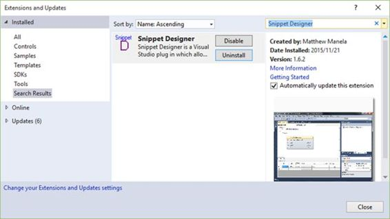
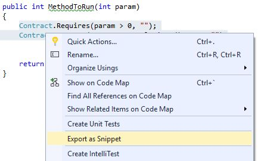
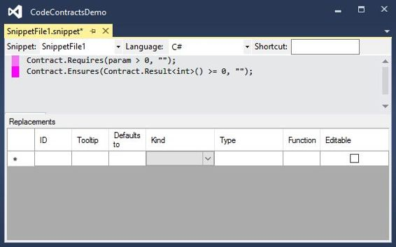
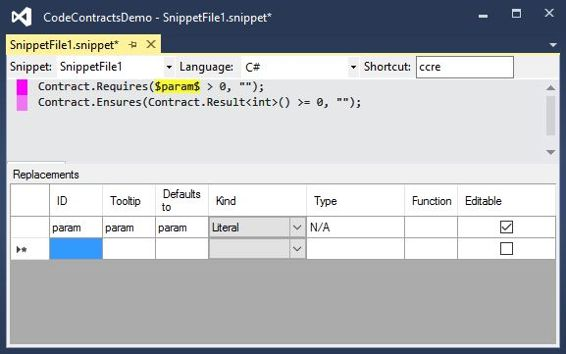
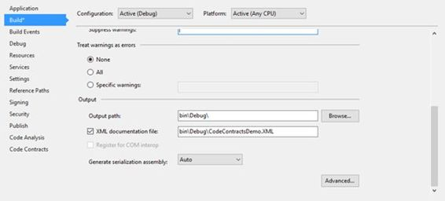
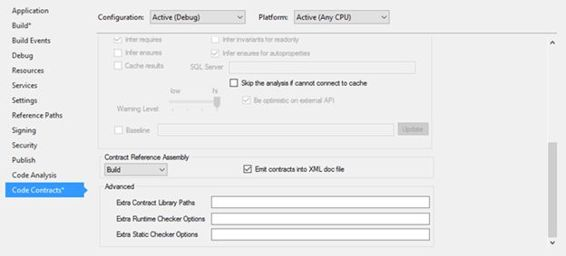
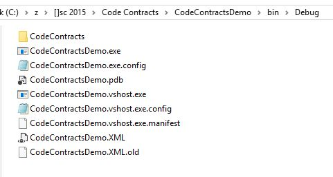
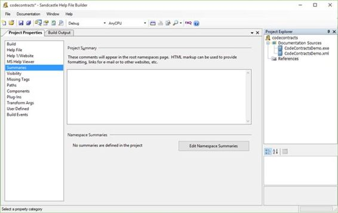
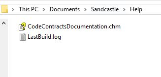
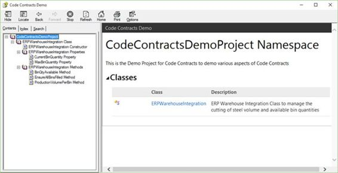

# 三、一些实用提示

您可能已经熟悉了 Visual Studio 中的代码片段；代码契约也提供了这个特性。安装代码契约时，会添加代码片段。如果您使用的是 C#，只需键入快捷方式并按两次 Tab 键。

在 Visual Basic 中，代码片段的使用略有不同。键入快捷方式，然后按 Tab 键。C# 和 Visual Basic 中的快捷键有细微的区别。例如，`Contract.Requires`快捷键在 C# 中是通过键入`cr`来调用的，但是在 Visual Basic 中是通过键入`creq`来调用的。

### C# 代码片段

下面的代码清单说明了 C# 代码片段快捷方式。使用的快捷方式是注释掉的第一行，然后是代码片段生成的代码。

```cs
    //cr
    Contract.Requires(false);

```

代码清单 27:合同。需要代码段

```cs
    //ce
    Contract.Ensures();

```

代码清单 28:合同。确保代码片段

```cs
    //ci
    Contract.Invariant(false);

```

代码清单 29:合同。不变片段

```cs
    //crr
    Contract.Result<int>()

```

代码清单 30:合同。结果片段

```cs
    //co
    Contract.OldValue(x)

```

代码清单 31:合同。旧值片段

```cs
    //cim
    [ContractInvariantMethod]
    [System.Diagnostics.CodeAnalysis.SuppressMessage(
        "Microsoft.Performance", "CA1822:MarkMembersAsStatic",
        Justification = "Required for code contracts.")]
    private void ObjectInvariant()
    {
        Contract.Invariant(false);
    }

```

代码清单 32:收缩变量方法片段

```cs
    //crn
    Contract.Requires(arg != null);

```

代码清单 33:合同。要求非空代码段

```cs
    //cen
    Contract.Ensures(Contract.Result<string>() != null);

```

代码清单 34:合同。确保合同。结果片段

```cs
    //crsn
    Contract.Requires(!String.IsNullOrEmpty(arg));

```

代码清单 35:合同。需要带值段的字符串

```cs
    //cesn
    Contract.Ensures(!String.IsNullOrEmpty(Contract.Result<string>()));

```

代码清单 36:合同。确保合同。带有字符串值片段的结果

```cs
    //cca
    Contract.Assert(false);

```

代码清单 37:合同。断言片段

```cs
    //cam
    Contract.Assume(false);

```

代码清单 38:合同。假设片段

```cs
    //cre
    Contract.Requires<ArgumentException>(false);

```

代码清单 39:合同。需要带参数的异常代码段

```cs
    //cren
    Contract.Requires<ArgumentNullException>(arg != null, "arg");

```

代码清单 40:合同要求参数不为空代码段

```cs
    //cresn
    Contract.Requires<ArgumentException>(!String.IsNullOrEmpty(arg));

```

代码清单 41:合同。需要带值的字符串参数

```cs
    //cintf
    #region IFoo contract binding
    [ContractClass(typeof(IFooContract))]
    public partial interface IFoo
    {

    }

    [ContractClassFor(typeof(IFoo))]
    abstract class IFooContract : IFoo
    {
    }
    #endregion

```

代码清单 42:接口模板和相关的合同类片段

严格来说，下一部分并不仅限于代码契约，但是如果我没有提到扩展代码片段的能力，那我就失职了。我总是发现扩展代码片段有点麻烦。对开发人员来说幸运的是，有一些非常慷慨的社区成员为 Visual Studio 创建了优秀的扩展。代码片段设计器就是这样一个扩展。

在使用之前，您需要从`Tools`菜单下的`Extensions and Updates`安装代码片段设计器。


图 27: Visual Studio 扩展和更新菜单项

一旦安装了代码段设计器，它将出现在您安装的扩展下。



图 28:代码片段设计器扩展

最基本的是，代码片段设计器让您能够动态生成代码片段。关于代码契约，我总是想在我的方法中包含一些集合。我希望能够在单个代码片段下将它们链接在一起，对于这一点，片段设计器非常适合。

突出显示要创建代码段的代码合同，打开上下文菜单，然后单击`Export as Snippet`。



图 29:导出为片段

“代码片段设计器”窗口现在显示在 Visual Studio 2015 集成开发环境中的一个新选项卡中。



图 30:代码片段设计器编辑器

请注意，粉色高亮不是代码片段设计器的功能；这是另一个伟大的延伸，叫做《热度边缘》。然而，这超出了本书的范围。

在“代码片段设计器”窗口中，您可以看到在编辑器窗口中高亮显示的代码。

选择要在生成时替换的代码部分。然后，右键单击并从上下文菜单中选择`Make Replacement`。


图 31:进行更换



图 32:完成的新片段

您将看到参数被一个占位符替换，该占位符的属性在替换网格中定义。剩下要做的就是给快捷方式起一个名字(我把我的名字`ccre`叫做“代码契约要求确保”)，然后保存你的代码片段。

在 Visual Studio 的代码编辑器中，键入`ccre`快捷键并按两次 Tab 键。我的代码片段为我插入，参数被标识为突出显示的替换项，以便我可以立即编辑它。


图 33:插入的代码片段

这是一个非常容易使用的工具，我甚至还没有开始探索它为开发人员提供的可能性。我在这里的重点只是说明代码片段对开发人员非常有用，并且可以在开发过程中进行扩展以满足您的特定需求。

我确信大多数(如果不是全部的话)开发人员不喜欢的一件事是创建文档。在许多项目会议中，它已经变得有些像房间里的大象。每个人都知道文档是必不可少的，我确信有很多开发人员确实创建了简洁而丰富的文档。这显然导致了许多工具和扩展，旨在使这个过程更容易。

因此，代码契约也可以集成包含的契约的文档是有意义的。要启用文档生成，您需要打开项目属性的`Build`选项卡。



图 34:启用 XML 文档文件

这里需要选择`XML documentation file`选项。如果不启用此选项，将不会创建文档 XML 文件。在这里，您还可以为文档文件指定输出路径和名称。

下一个需要修改的选项在`Code Contracts`选项卡。如果你滚动到代码合同标签的底部，你会看到`Contract Reference Assembly`值没有被指定。把这个改成`Build`。

最后，您必须确保选择了`Emit contracts into XML doc file`选项。这将使代码合同注释成为生成的文档文件的一部分。



图 35:启用代码合同文档

然后，您需要确保已经为代码添加了良好的注释。当你创建一个逻辑不明显的新方法或新代码行时，你需要养成这个习惯。另一方面，代码中有太多注释也不是一个好主意。那么什么时候该评论，什么时候不该评论呢？一个好的经验法则是，当代码背后的逻辑不明显时，只对代码进行注释。

在下面的代码清单中，逻辑在第一个清单(代码清单 43)中是显而易见的，所以实际上不需要注释。然而，在代码清单 44 中，应该在注释中解释模数运算符的使用，因为这样做的原因并不明显。

```cs
    //Bad comment: Calculate the available quantity
    int QtyAvailable = MaxBinQuantity - CurrentBinQuantity;

```

代码清单 43:不必要的代码注释

```cs
    //Good comment: Use modulus to determine if the factor produces any scrap
    return volumeToCut % factor;

```

代码清单 44:注释清楚地解释了逻辑

一个注释良好的方法可能如下所示。

```cs
    /// <summary>
    /// Calculate any remainder after the modulus operation between volume and factor
    /// </summary>
    /// <param name="volumeToCut"></param>
    /// <param name="factor"></param>
    /// <returns>Remainder after cutting</returns>
    private int CutSteel(int volumeToCut, int factor)
    {
        // Use modulus to determine if the factor produces any scrap
        return volumeToCut % factor;
    }

```

代码清单 45:注释良好的方法

添加相关注释后，您需要构建您的解决方案。在生成文档文件时，您需要注意在构建过程中可能收到的任何警告。这些通常与源代码中缺少 XML 注释有关。通过在方法和属性中添加清晰相关的代码注释来解决这些问题是个好主意。

生成完成后，将在配置生成设置时指定的路径中找到您的 XML 文档。在这个例子中，生成的 XML 文档包括代码契约描述。

```cs
    <?xml version="1.0"?>
    <doc>
    <assembly>
        <name>CodeContractsDemo</name>
    </assembly>
    <members>
        <member name="T:ERPWarehouseIntegration">
        <summary>
                ERP Warehouse Integration class to manage the cutting of steel volume and available bin quantities
                </summary>
        </member>
        <member name="P:ERPWarehouseIntegration.MaxBinQuantity">
        <summary>
                The maximum bin quantity for bins
                </summary>
        </member>
        <member name="P:ERPWarehouseIntegration.CurrentBinQuantity">
        <summary>
                The current bin quantity available
                </summary>
        </member>
        <member name="M:ERPWarehouseIntegration.ProductionVolumePerBin(System.Int32,System.Int32)">
        <summary>
                Calculate the production volume of steel per bin
                </summary>
        <param name="binVolume" />
        <param name="factor" />
        <returns>Bin Volume less Remainder</returns>
        <ensures description="The factor used will result in scrap. Please modify the cutting factor." csharp="result == binVolume" vb="result = binVolume">result == binVolume</ensures>
        </member>
        <member name="M:ERPWarehouseIntegration.CutSteel(System.Int32,System.Int32)">
        <summary>
                Calculate any remainder after the modulus operation between volume and factor
                </summary>
        <param name="volumeToCut" />
        <param name="factor" />
        <returns>Remainder after cutting</returns>
        </member>
        <member name="M:ERPWarehouseIntegration.BinQtyAvailable">
        <summary>
                Ensure that a non-negative value is returned for available bin quantity
                </summary>
        <returns>Available bin quantity</returns>
        <ensures csharp="result &gt;= 0" vb="result &gt;= 0">result &gt;= 0</ensures>
        </member>
        <member name="M:ERPWarehouseIntegration.EnsureAllBinsFilled(System.Int32@,System.Int32,System.Int32)">
        <summary>
                Ensure that all bins are filled and that the steel volume does not exceed the maximum bin volume
                </summary>
        <param name="binOverCount" />
        <param name="binVol" />
        <param name="steelVol" />
        <ensures description="The steel volume exceeds the bin volume" csharp="binOverCount == 0" vb="binOverCount = 0">binOverCount == 0</ensures>
        </member>
    </members>
    </doc>

```

代码清单 46:生成的 XML 文档文件

我们轻松地为代码生成了简洁的 XML 文档，没有任何繁重的工作。如果您定期对您的代码进行注释，您生成的文档将是最新的，并且是您的代码状态的真实反映。

### 创建用户友好的文档

生成的 XML 文件很棒，但是它需要另一个步骤来创建格式良好、人类可读的 HTML 类型的文档。对于这个任务，我将使用 Sandcastle 帮助文件构建器，您可以从 GitHub 的[github.com/EWSoftware/SHFB](https://github.com/EWSoftware/SHFB)下载。在引导安装过程中，请仔细阅读每个屏幕的说明和注释，因为其中包含您需要了解的重要信息。

我建议阅读更多关于使用 Sandcastle 帮助文件构建器的教程。这个工具有如此多的东西可以提供，以至于人们需要真正了解这个优秀的工具。然而，为了这本书的目的，除了向你展示如何创建一个基本的。chm 帮助文件。

在使用 Sandcastle 帮助文件生成器之前，您必须确保您的项目有一个命名空间。否则，您将在帮助文件版本中看到以下错误。


图 36:构建输出错误

```cs
    SHFB: Error BE0033: No APIs found to document. See error topic in help file for details.
    at SandcastleBuilder.Utils.BuildEngine.BuildProcess.Build()

```

代码清单 47: Sandcastle 帮助文件构建器错误

我只是给我的类添加了一个名称空间，如代码清单 48 所示。

```cs
    namespace CodeContractsDemoProject
    {
        /// <summary>
        /// ERP Warehouse Integration class to manage the cutting of steel volume and available bin quantities
        /// </summary>
        public class ERPWarehouseIntegration
        {

```

代码清单 48:名称空间添加到类中

完成后，如果尚未打开`Sandcastle Help File Builder`，请将其打开。在`Project Explorer`中，右键单击`Documentation Sources`节点并添加。dll 或。您的项目构建到的位置(通常是您的 bin 文件夹)。我选择将我的 XML 文档输出到我的 bin 文件夹中。



图 37:项目箱文件夹

一旦我选择了。. exe 文件，XML 文档文件也会被 Sandcastle 帮助文件生成器自动拾取并添加为文档源。添加的文件将显示在`Documentation Sources`节点下的`Project Explorer`中。



图 38:文档来源和摘要

`Project Properties`选项卡中还有各种其他部分可以修改和设置。需要记住配置的一点是`Summaries`部分。您需要确保已经在`Project Properties`选项卡的`Summaries`页面中添加了名称空间摘要注释。点击`Edit Namespace Summaries`按钮打开`Namespace Summaries`窗口。


图 39:名称空间摘要窗口

选择要添加摘要的名称空间，并在`Edit the summary for the selected namespace`文本框中输入摘要描述。完成后，点击`Close`按钮，保存项目。

现在，您已经准备好构建您的 Sandcastle 帮助文件生成器项目，该项目将生成您指定的帮助文件。

支持的帮助文件格式类型:

*   HTML 帮助 1
*   微软帮助查看器
*   开启 XML (docx)
*   Markdown (md)
*   网站(HTML/ASP。NET)


图 40: Sandcastle 帮助文件构建器成功构建

生成完成后，导航到生成的帮助文件的输出目录。我的默认路径`Documents\Sandcastle\Help`。



图 41:帮助文件输出路径

打开生成的帮助文件，您会看到编译采用了前面`Summaries`部分中添加的名称空间摘要，并将其添加为生成的帮助文件的摘要文本。



图 42:生成的帮助文件

一旦知道如何做，从代码契约注释创建文档就非常容易了。有了像`Sandcastle Help File Builder`这样的优秀工具和代码契约提供的紧密集成，将注释输出到您生成的 XML 文件中，开发人员就拥有了为他们的项目创建丰富文档所需的一切。

正如您可能期望的那样，为抽象类和接口创建代码契约需要稍微有所不同。这是因为抽象类和接口不能包含方法体。许多开发人员仍然想知道抽象类和接口之间有什么区别。我听到的最好的解释之一是区分何时使用抽象类和何时使用接口。

### 抽象类

如果你有许多类可以组合在一起，用一个名词来描述，你很可能是在处理一个抽象类。抽象类被命名为这个名词。另一个需要考虑的非常重要的事情是，这些继承的类共享某种功能，并且您永远不会创建名词(抽象类)的实例。

想想下面的例子，你有一个类型为`Human`的抽象类。你永远不会只实例化一个`Human`，而是一种`Human`，比如`Female`或者`Male`。因此`Male`和`Female`都是继承自抽象类`Human`。抽象类将实现一个方法`void Sleep()`，所有人都必须这样做(共享功能)。

要在抽象类上实现代码契约，您需要创建一个单独的`ContractClass`类，并通过使用属性将契约类与抽象类相关联。

```cs
    using System.Diagnostics.Contracts;

    /// <summary>
    /// Human Abstract Class
    /// </summary>
    [ContractClass(typeof(HumanContract))]
    public abstract class Human
    {
        public abstract void Run(int distance);
        public abstract void Sleep(int hours);
    }

    /// <summary>
    /// Human Contract Class
    /// </summary>
    [ContractClassFor(typeof(Human))]
    public abstract class HumanContract : Human
    {
        public override void Sleep(int hours)
        {
            Contract.Requires(hours >= 8,
                "You need more than 8 hours of sleep each night.");
        }
    }

```

代码清单 49:抽象类和契约类

抽象类`Human`使用属性`[ContractClass(typeof(HumanContract))]`，契约类`HumanContract`使用属性`[ContractClassFor(typeof(Human))]`。

抽象类`Human`基本上规定了所有人类都会睡觉和奔跑。在`Sleep()`方法(在`HumanContract`中定义)的合同中，我们定义所有人每晚必须至少睡八个小时。

让我们创建一个继承自我们的`Human`抽象类的`Male`类。

```cs
    public class Male : Human
    {
        public override void Run(int distance)
        {
            Console.Write("The distance run was " + distance);
            Console.ReadLine();
        }

        public override void Sleep(int hours)
        {
            Console.Write("The hours slept were " + hours);
            Console.ReadLine();
        }
    }

```

代码清单 50:继承自人类的男性类

从`Male`类我们可以看到它根本不包含代码契约。它所做的就是继承`Human`抽象类。

```cs
    namespace CodeContractsDemo
    {
        class Program
        {
            static void Main(string[] args)
            {
                try
                {
                    Male oMan = new Male();
                    oMan.Sleep(5);
                }
                catch (Exception ex)
                {
                    Console.Write(ex.Message);
                    Console.ReadLine();
                }
            }
        }
    }

```

代码清单 51:有五个小时睡眠的男性类的实例化

如果我们必须实例化`Male`类并用五个小时调用`Sleep`方法，我们的代码契约就会生效，告诉我们人类每晚需要八个小时的睡眠。


图 43:违反了男性类睡眠方法契约

修改我们的调用代码来指定一个美好的周六早晨小睡九个小时，描绘了一幅不同的画面。

```cs
    namespace CodeContractsDemo
    {
        class Program
        {
            static void Main(string[] args)
            {
                try
                {
                    Male oMan = new Male();
                    oMan.Sleep(9);
                }
                catch (Exception ex)
                {
                    Console.Write(ex.Message);
                    Console.ReadLine();
                }
            }
        }
    }

```

代码清单 52:有九个小时睡眠的男性类的实例化

代码合同通过验证，`Sleep()`方法通过验证。


图 44:男性类睡眠方法合同通过

代码契约和抽象类完美地结合在一起，为开发团队创建了一个真正稳定和健壮的代码库。

### 接口

我们用前面`Male`和`Female`类的例子。20 年后，我们在火星上发现了外星人。它们与我们惊人地相似，使它们成为人类，但它们既不是雄性也不是雌性。我们现在有了一个新的类型，`Alien`，它继承了抽象类`Human`。

现在把接口想象成动词。一般来说，哪个动词可以用在我的课上？所有的人类都需要学习新的东西，都是可以被教授的，所以现在我们可以创建一个叫做`ITeachable`的界面。我们将在`Human`抽象类上实现`ITeachable`接口，因为所有人都是可教的。然而，外星人比`Male`或`Female`稍微先进一点，可以将它们的分子重新排列成不同的结构，使外星人能够变形。因此，我们可以创建一个名为`IShapeShiftable`的界面，只适用于`Alien`。

创建接口很像抽象类。它还需要包含一个协定类，接口和协定类都需要通过它们的属性相互指向。

```cs
    using System.Diagnostics.Contracts;

    [ContractClass(typeof(IShapeShiftableContract))]
    public interface IShapeShiftable
    {
        void Man(int shapeDuration);
        void Woman(int shapeDuration);
        void InanimateObject(int shapeDuration);
    }

    [ContractClassFor(typeof(IShapeShiftable))]
    abstract class IShapeShiftableContract : IShapeShiftable
    {
        void IShapeShiftable.InanimateObject(int shapeDuration)
        {
            Contract.Requires(shapeDuration <= 12);
        }

        void IShapeShiftable.Man(int shapeDuration)
        {
            Contract.Requires(shapeDuration <= 4);
        }

        void IShapeShiftable.Woman(int shapeDuration)
        {
            Contract.Requires(shapeDuration <= 4);
        }
    }

```

代码清单 53:实现代码契约类的接口

我们现在可以通过契约类`IShapeShiftableContract`为接口创建契约，就像我们之前为抽象类所做的那样。

### 抽象类与接口

总结抽象类和接口的例子，所有这些都归结到你想要实现的地方。如果您想在所有派生类之间共享实现，您将创建一个抽象类。如果您需要实现特定于单个类或几个类，但不是所有类，请使用接口。

代码契约很容易满足两者。

一本关于代码契约的书如果没有提到纯度就不完整。当提到代码契约时，方法纯度到底意味着什么？好吧，代码契约有一个名为`[Pure]`的属性，你可以用它来修饰方法。这基本上是方法质量的一种表达，并且该方法不能改变调用方看到的任何对象的状态。换句话说，纯方法只允许更改在输入方法后创建的对象。

代码契约要求契约中调用的所有方法都是纯方法。原因很简单:

*   避免前置条件和后置条件中使用的方法的副作用。
*   使静态检查器的任务更容易，因为它可以假设对象状态在方法被调用后是相同的。
*   通过明确阐明方法在方法调用结束后不会改变对象状态的意图来改进设计。

为了说明非纯方法对静态检查器的影响，请考虑下面的代码清单。

```cs
    public class DemoPurity
    {
        /// <summary>
        /// Property for cutting factor
        /// </summary>
        public int CutFactor { get; private set; }

        /// <summary>
        /// Public Constructor
        /// </summary>
        /// <param name="cutFactor"></param>
        public DemoPurity(int cutFactor)
        {
            CutFactor = cutFactor;
        }

        /// <summary>
        /// Calculate the volume cut
        /// </summary>
        /// <param name="volumeSteel"></param>
        /// <param name="factorModifier"></param>
        /// <returns></returns>
        public int VolumeCut(int volumeSteel, int factorModifier)
        {
            Contract.Requires(CalculatedCutFactor(factorModifier) >= 0);

            return volumeSteel / (CutFactor * factorModifier);
        }

        /// <summary>
        /// This is not a pure method
        /// </summary>
        /// <param name="factorModifier"></param>
        /// <returns></returns>
        public int CalculatedCutFactor(int factorModifier)
        {
            CutFactor = CutFactor * factorModifier;
            return CutFactor;
        }    
    }

```

代码清单 54:方法纯度不合格

属性`CutFactor`在`DemoPurity`的构造函数中指定。方法`VolumeCut`包括一个关于`CalculatedCutFactor`方法的必需合同。如你所见，`CalculatedCutFactor`方法肯定不纯，因为它修改了`CutFactor`属性。这也是草率的代码。静态检查器将在生成时失败，因为该方法不是纯的。

```cs
    1>------ Rebuild All started: Project: CodeContractsDemo, Configuration: Debug Any CPU ------
    1>C:\z\[]sc 2015\Code Contracts\CodeContractsDemo\ERPIntegration.cs(197,9): warning CC1036: Detected call to method 'DemoPurity.CalculatedCutFactor(System.Int32)' without [Pure] in contracts of method 'DemoPurity.VolumeCut(System.Int32,System.Int32)'.
    CodeContracts: CodeContractsDemo: Run static contract analysis.
    C:\z\[]sc 2015\Code Contracts\CodeContractsDemo\ERPIntegration.cs(197,9): warning CC1036: CodeContracts: Detected call to method 'DemoPurity.CalculatedCutFactor(System.Int32)' without [Pure] in contracts of method 'DemoPurity.VolumeCut(System.Int32,System.Int32)'.
    14.0\Common7\IDE\CodeContractsDemo.exe(1,1): message : CodeContracts: Checked 15 assertions: 13 correct (2 masked)
    CodeContracts: CodeContractsDemo:
    CodeContracts: CodeContractsDemo: Static contract analysis done.
    ========== Rebuild All: 0 succeeded, 1 failed, 0 skipped ==========

```

代码清单 55:缩短的输出结果

我已经从输出文本中删除了所有与纯度讨论无关的多余行。你可以看到静态检查者对`CalculatedCutFactor`不纯粹不满意。很明显，我们可以直接将`[Pure]`属性添加到`CalculatedCutFactor`方法中，但这并不是很好的编程实践。如果我们这样做，它将导致一个成功的构建，因为我们已经基本上告诉静态检查器我们的方法`CalculatedCutFacor`是纯的。如果我们因此修改了代码，如代码清单 56 所示，静态检查器将假设该方法是纯的。

```cs
    public class DemoPurity
    {
        /// <summary>
        /// Property for cutting factor
        /// </summary>
        public int CutFactor { get; private set; }

        /// <summary>
        /// Public Constructor
        /// </summary>
        /// <param name="cutFactor"></param>
        public DemoPurity(int cutFactor)
        {
            CutFactor = cutFactor;
        }

        /// <summary>
        /// Calculate the volume cut
        /// </summary>
        /// <param name="volumeSteel"></param>
        /// <param name="factorModifier"></param>
        /// <returns></returns>
        public int VolumeCut(int volumeSteel, int factorModifier)
        {
            Contract.Requires(CalculatedCutFactor(factorModifier) >= 0);

            return volumeSteel / (CutFactor * factorModifier);
        }

        /// <summary>
        /// This is still not a pure method
        /// </summary>
        /// <param name="factorModifier"></param>
        /// <returns></returns>
        [Pure]
        public int CalculatedCutFactor(int factorModifier)
        {
            CutFactor = CutFactor * factorModifier;
            return CutFactor;
        }    
    }

```

代码清单 56:向方法添加纯属性

如果我们必须构建我们的项目，结果输出将表明构建成功。

```cs
    1>------ Rebuild All started: Project: CodeContractsDemo, Configuration: Debug Any CPU ------
    1> elapsed time: 886,9984ms
    1> elapsed time: 177,9426ms
    1> elapsed time: 1120,0034ms
    CodeContracts: CodeContractsDemo: Run static contract analysis.
    1> CodeContractsDemo -> C:\z\[]sc 2015\Code Contracts\CodeContractsDemo\bin\Debug\CodeContractsDemo.exe
    CodeContracts: CodeContractsDemo: Validated: 100,0%
    CodeContracts: CodeContractsDemo: Checked 15 assertions: 13 correct (2 masked)
    CodeContracts: CodeContractsDemo: Contract density: 0,98
    CodeContracts: CodeContractsDemo: Total methods analyzed 6
    CodeContracts: CodeContractsDemo: Methods analyzed with a faster abstract domain 0
    CodeContracts: CodeContractsDemo: Methods with 0 warnings 5
    CodeContracts: CodeContractsDemo: Time spent in internal, potentially costly, operations
    CodeContracts: CodeContractsDemo: Overall time spent performing action #KarrPutIntoRowEchelonForm: 00:00:00.0140007 (invoked 784 times)
    Overall time spent performing action #KarrIsBottom: 00:00:00.0120029 (invoked 1515 times)
    Overall time spent performing action #WP: 00:00:00.2000032 (invoked 5 times)
    Overall time spent performing action #CheckIfEqual: 00:00:00.0080005 (invoked 29 times)
    Overall time spent performing action #ArraysAssignInParallel: 00:00:00.1430061 (invoked 1 times)
    Overall time spent performing action #Simplex: 00:00:00.0810009 (invoked 19 times)
    CodeContracts: CodeContractsDemo: Total time 7,821sec. 1303ms/method
    CodeContracts: CodeContractsDemo: Generated 2 callee assume(s)
    CodeContracts: CodeContractsDemo: Retained 0 preconditions after filtering
    CodeContracts: CodeContractsDemo: Inferred 0 object invariants
    CodeContracts: CodeContractsDemo: Retained 0 object invariants after filtering
    CodeContracts: CodeContractsDemo: Discovered 3 postconditions to suggest
    CodeContracts: CodeContractsDemo: Retained 1 postconditions after filtering
    CodeContracts: CodeContractsDemo: Detected 1 code fixes
    CodeContracts: CodeContractsDemo: Proof obligations with a code fix: 3
    C:\Program Files (x86)\Microsoft Visual Studio 14.0\Common7\IDE\CodeContractsDemo.exe(1,1): message : CodeContracts: Checked 15 assertions: 13 correct (2 masked)
    CodeContracts: CodeContractsDemo:
    CodeContracts: CodeContractsDemo: Static contract analysis done.
    ========== Rebuild All: 1 succeeded, 0 failed, 0 skipped ==========

```

代码清单 57:成功构建

这里的问题是，简单地将`[Pure]`属性添加到`CalculatedCutFactor`方法中并不能使其纯净。这就是我在这个关于方法纯度的章节中想要表达的观点。我们需要确保在契约中调用的方法是纯粹的，因为它们是设计出来的，而不是因为我们用`[Pure]`属性来修饰它们。我们再来看看我们的`CalculatedCutFactor`方法，稍微修改一下，这样就不违反方法纯度规定的规则了。

```cs
    public class DemoPurity
    {
        /// <summary>
        /// Property for cutting factor
        /// </summary>
        public int CutFactor { get; private set; }

        /// <summary>
        /// Public Constructor
        /// </summary>
        /// <param name="cutFactor"></param>
        public DemoPurity(int cutFactor)
        {
            CutFactor = cutFactor;
        }

        /// <summary>
        /// Calculate the volume cut
        /// </summary>
        /// <param name="volumeSteel"></param>
        /// <param name="factorModifier"></param>
        /// <returns></returns>
        public int VolumeCut(int volumeSteel, int factorModifier)
        {
            Contract.Requires(CalculatedCutFactor(factorModifier) >= 0);

            return volumeSteel / (CutFactor * factorModifier);
        }

        /// <summary>
        /// This is a pure method
        /// </summary>
        /// <param name="factorModifier"></param>
        /// <returns></returns>
        [Pure]
        public int CalculatedCutFactor(int factorModifier)
        {
            return CutFactor * factorModifier;        
        }    
    }

```

代码清单 58:标记为纯的纯方法

`CalculatedCutFactor`方法现在是纯方法，因为它不改变`CutFactor`或`factorModifier`的值。它现在可以适当地用`[Pure]`属性来修饰。我们的`VolumeCut`方法中的`Contract.Requires`现在可以使用这个纯方法来检查`CalculatedCutFactor`的结果是否不为零，因为这将在返回时导致被零除的异常。

方法纯度是一个非常值得遵循的实践，不仅在使用代码契约时，而且在您编写的每一个方法中都是如此。

我确信那些经常使用代码契约的人遇到了在多个方法中重复类似的代码契约集的问题。代码契约对此有一个解决方案，它们被称为`abbreviator methods`。概念真的很简单。您可以看到代码清单 59 中的代码包含重复的代码契约集。

```cs
    public class AbbreviatorDemo
    {
        /// <summary>
        /// The factor for the cutting volume
        /// </summary>
        public int Factor { get; private set; }
        /// <summary>
        /// The maximum volume a bin can contain
        /// </summary>
        public int MaxVolume { get; private set; }

        /// <summary>
        /// Fill the bin with the volume of steel
        /// </summary>
        /// <param name="steelVolume"></param>
        public void FillBin(int steelVolume)
        {
            Contract.Requires(steelVolume > 0);
            Contract.Ensures(steelVolume <= this.MaxVolume);
        }

        /// <summary>
        /// Empty the bin of all steel contained
        /// </summary>
        /// <param name="steelVolume"></param>
        /// <returns></returns>
        public bool PurgeBin(int steelVolume)
        {
            Contract.Requires(steelVolume > 0);
            Contract.Ensures(steelVolume <= this.MaxVolume);
            Contract.Ensures(Contract.Result<bool>() == true);

            // Purge bin and return successful result
            return true;
        }

        /// <summary>
        /// Perform a partial bin fill
        /// </summary>
        /// <param name="steelVolume"></param>
        /// <returns></returns>
        public bool FillBinPartially(int steelVolume)
        {
            Contract.Requires(steelVolume > 0);
            Contract.Ensures(steelVolume < this.MaxVolume);
            Contract.Ensures(Contract.Result<bool>() == true);

            return true;
        }    
    }

```

代码清单 59:重复合同

我们现在可以利用`Abbreviator`方法简化代码，并在多个方法中引用它们。使用`Abbreviator`方法，代码可以重构如下。

```cs
    public class AbbreviatorDemo
    {
        /// <summary>
        /// The factor for the cutting volume
        /// </summary>
        public int Factor { get; private set; }
        /// <summary>
        /// The maximum volume a bin can contain
        /// </summary>
        public int MaxVolume { get; private set; }

        /// <summary>
        /// Fill the bin with the volume of steel
        /// </summary>
        /// <param name="steelVolume"></param>
        public void FillBin(int steelVolume)
        {
            ValidSteelAndMaxVolume(steelVolume);
        }

        /// <summary>
        /// Empty the bin of all steel contained
        /// </summary>
        /// <param name="steelVolume"></param>
        /// <returns></returns>
        public bool PurgeBin(int steelVolume)
        {
            ValidSteelAndMaxVolume(steelVolume);
            EnsurePositiveResult();

            // Purge bin and return successful result
            return true;
        }

        /// <summary>
        /// Perform a partial bin fill
        /// </summary>
        /// <param name="steelVolume"></param>
        /// <returns></returns>
        public bool FillBinPartially(int steelVolume)
        {
            ValidSteelAndMaxVolume(steelVolume);
            EnsurePositiveResult();

            return true;
        }    

        /// <summary>
        /// Abbreviator method for steel and max volume
        /// </summary>
        /// <param name="steelVolume"></param>
        [ContractAbbreviator]
        private void ValidSteelAndMaxVolume(int steelVolume)
        {
            Contract.Requires(steelVolume > 0);
            Contract.Ensures(steelVolume <= this.MaxVolume);
        }

        /// <summary>
        /// Abbreviator method for successful result
        /// </summary>
        [ContractAbbreviator]
        private void EnsurePositiveResult()
        {
            Contract.Ensures(Contract.Result<bool>() == true);
        }
    }

```

代码清单 60:使用缩写方法

我增加了两个新方法，`ValidSteelAndMaxVolume`和`EnsurePositiveResult`，并给它们增加了`[ContractAbbreviator]`属性。这使我能够在我的方法中减少重复的代码契约集。当查看合同下的方法时，它使阅读更容易，功能更清晰。需要记住的另一点是`Abbreviator`方法可以包含对其他`Abbreviator`方法的调用(如果需要的话)。