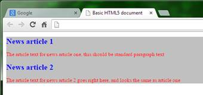

# 第二章基本 CSS 复习

在开始讨论本书的主要核心之前，让我们先来看一个基本的 CSS 复习。

如果你以前使用过 CSS，或者对这种语言及其工作原理很熟悉，那么你可以放心地跳过这一部分。如果你的 CSS 技能有点生疏，或者你对 CSS 的概念还很陌生，那么你应该阅读这一章，因为它将为后面的章节提供基本的基础。

## 定义 CSS

那么到底什么是 CSS 呢？

CSS 代表级联样式表，它们背后的思想非常简单。创建 CSS 文档的唯一目的是为 HTML 文档的内容设置样式(即管理颜色、大小、布局、位置等等)。

虽然 HTML 代码的目的是定义文档的结构，但 CSS 是用来定义内容如何呈现给最终用户的。

CSS 最初是为了减少 HTML 文档中用来指示特定 HTML 块外观的标记数量而创建的。

许多现代 web 开发人员可能从未见过这种较旧的语法，因此，为了举例说明过去是如何做事情的，请查看代码清单 2:

```css
          <body>
              <font family="serif" size="20pt" color="#FF0000">
                  <i>
                      <b>
                          <h1>This is my header in bold italic, 20 point red serif font</h1>
                      </b>
                  </i>
              </font>
          </body>

```

代码清单 2:预 CSS 样式的典型例子

今天的浏览器仍将遵循这一点，并对其进行适当的样式设置，如下图所示:


图 2:代码清单 2 中的 CSS 前代码示例产生的输出

从代码清单 2 中显示的 HTML 代码中可以看出，生成一个简单的单行粗体红色标题所需的标记比现在大多数人习惯的要多得多。

这只是一行——想象一下，每当你想为你的页面生成一个类似样式的标题时，你都必须这样做。

CSS 规则可以立即解决其中两个问题。首先，它们通常定义了定义文本在单独文件中的外观的规则。这立即意味着设计者或只做图形的人可以轻松地改变这些规则，而不必担心 HTML 文件中的代码。

其次，它们通过使用 class 属性来促进对多个元素的规则的重用，这意味着您只需指定一次设置，然后告诉标记何时使用这些设置。

现在让我们重温代码清单 2，并检查我刚才描述的差异。

```css
          <h1 class="boldred">This is my header in bold italic, 20 point red serif font</h1>

```

代码清单 3a:我们新的红色粗体标记

```css
          .boldred
          {
            font-family: serif;
            font-size: 20pt;
            color: red;
          }

```

代码清单 3b:粗体红色样式规则现在在 styles.css 中定义

您可以立即看到这里的区别，要在另一行上重用该规则，我们只需将`class="boldred"`作为属性添加到我们的标签中。如果我们接着将样式规则从红色更改为绿色，那么使用该规则的每个元素都将突然更改为绿色，而无需接触任何 HTML 标记。

所以现在我们知道为什么定义 CSS 了；接下来我们将开始研究如何。

## 层叠规则

精明的读者可能已经在问自己，CSS 的“层叠”部分代表什么。层叠就是向下流动，这正是 CSS 样式表的作用。

暂时不考虑本书后面会谈到的特殊性这个主题，在链条更下游被遵守或发现的规则会凌驾于链条更上游的任何东西之上。如果你不习惯这样，它会给你带来一些有趣的错误和挑战，尤其是当你第一次开始探索什么是可用的，什么是不可用的。

然而，一旦你看到它在行动，这个概念就相当简单了。

采用以下样式规则:

```css
          .mystyle
          {
            font-size: 10pt;
            color: green;
          }

```

代码清单 4:简单的绿色文本 CSS 规则

如果你把它附加到一个元素上，你会正确地期望文本大小为 10 点，颜色为绿色。

现在假设这个规则是在一个样式表中定义的，这个样式表已经在一个 CSS 文档中实现了，包含在项目的其他地方(例如，作为内容管理系统的一部分)。

此外，假设您被要求使用该规则使所有文本变成红色，但不能更改之前创建的样式文件。

您可能无法更改原始文件的原因多种多样；例如，样式表也可以由第二个站点使用，在那里文本必须保持绿色，或者样式可以动态生成。不管是什么原因，这种情况发生的比你预期的要多得多。

但是，如果您简单地创建第二个样式文件(让我们称之为 **styles2.css** ，然后复制链接标签(如前一章中的基本 HTML 代码所示)并适当地更改文件名，我们就可以继续向这个新文件添加以下 css 规则。

```css
          .mystyle
          {
            color: red;
          }

```

代码清单 5:我们在“styles2.css”中创建的重复规则

如果你做的事情是正确的，那么浏览器中应该会出现红色文本，而不是绿色文本。

为了继续使用绿色版本，您只需省略加载**style 2 . CSS**的第二个链接，并将其包含在内以将您的规则“调整”为红色。

如果您更改原始文件中的字体大小，您会看到，一次更改将同时影响红色和绿色版本的文本。

这种风格的层叠可以用于许多不同的方式；然而，在我解释之前，你需要先了解一个更重要的复习主题。

## CSS 选择器

到目前为止，您只看到了基于“类”属性的 CSS 规则的使用，但是还有许多其他的方法可以定义规则。

以下面的 HTML 为例。

```css
          <p id="importantInfo">This is a standard text paragraph, with no explicit style rule defined, all it has is an 'id' attribute that essentially gives the HTML parser a name for it</p>

```

代码清单 6a:带有标识属性的 HTML 标记

```css
          #importantInfo
          {
            color: red;
            font-size: 14pt;
          }

```

代码清单 6b:以给定标识为目标的 CSS 样式规则

在代码清单 6a 中，我定义了一个标准的 HTML 段落标记。它没有关联的样式信息或应用于它的类选择器；它所拥有的只是一个简单的`id`属性，本质上允许我们给元素取一个名字。

但是，如果您查看代码清单 6b 中定义的 CSS 规则，您将看到它而不是句点[。]放在规则名称前面，我们现在在它前面有一个数字符号[ `#` ]。

定义规则时，CSS 可以使用许多不同的符号。这些符号被称为 CSS 选择器，如何定义选择器决定了如何使用规则。

在代码清单 6 中，我们使用了标识选择器。标识选择器的目的是针对文档中一个特定的命名元素。

在代码清单 4 和 5 中，类选择器旨在用于许多不同的元素，只需添加一个`class`属性。因为一个给定的标识一次只能应用于一个元素，所以当我们指定一个以标识为目标的 CSS 规则时，我们总是说这个规则适用于那个元素，只适用于那个元素，而不适用任何其他元素。

然而(稍后您将会看到)，ID 选择器经常被故意用来控制 CSS 文档中的层次结构，并充分利用该技术的级联特性。

当我们将选择器链接在一起时，级联可以发挥很大的作用，因为它允许我们深入到 HTML 标记中，而不必确保我们规定标记应该是什么样子。

让我们想象一下，我们正在创建一个包含新闻帖子的 HTML 文档。

文档中的每个新闻帖子都必须遵守相同的一套风格规则，因此，每个帖子的外观和感觉都是相同的。

每篇文章应该显示在与页面其余部分不同的颜色背景上，并且应该总是有蓝色的粗体标题和较小的红色段落文本。

根据我们到目前为止所看到的，我们可能会尝试编写以下代码。

```css
          <div id="newspost">
              <h1 class="newsheader">News article 1</h1>
              <p class="newstext">The article text for news article one, this should be standard paragraph text<p>
                  <h1 class="newsheader">News article 2</h1>
              <p class="newstext">The article text for news article 2 goes right here, and looks the same as article one</p>
          </div>

```

代码清单 7a:可能的新闻文章 HTML 代码

```css
          #newspost
          {
            background-color: silver;
          }

          .newsheader
          {
            color: blue;
            font-size: 15pt;
          }

          .newstext
          {
            color: red;
            font-size: 10pt;
          }

```

代码清单 7b:可能的新闻文章 CSS 代码

虽然这将非常好地工作并产生期望的输出，但我们实际上可以在这里利用 CSS 的级联特性，并实际上使事情变得更加明显——甚至到了我们的 HTML 和 CSS 几乎都在描述自己意图的地步。

如果我们更改代码清单 7a 中的 HTML，以便从每个`h1`和`p`元素中移除所有的类标签，我们应该会得到下面的代码:

```css
          <div id="newspost">
              <h1>News article 1</h1>
              <p>The article text for news article one, this should be standard paragraph text<p>
                  <h1>News article 2</h1>
              <p>The article text for news article 2 goes right here, and looks the same as article one</p>
          </div>

```

代码清单 8:清单 7a 中删除了类属性的代码

如您所见，我们现在剩下的就是定义`div`元素的`newspost`名称的 ID，该元素包装了我们所有的文章。

现在更改 CSS 代码如下:

```css
          #newspost
          {
            background-color: silver;
          }

          #newspost h1
          {
            color: blue;
            font-size: 15pt;
          }

          #newspost p
          {
            color: red;
            font-size: 10pt;
          }

```

代码清单 9:来自清单 7b 的带有改变的选择器的 CSS 代码

您应该会发现，当您在浏览器中渲染它时，仍然会得到以下输出:



图 3:代码清单 8 和 9 产生的输出

让级联特性处理这类事情的一个真正的好处是，你可以通过适当地插入`h1`和`p`元素，轻松地在你的`newspost` `div`中添加另一篇文章。添加时，您根本不需要担心为每个`h1`和`p`元素分配正确的类名，也不需要一直检查这两个元素是否使用了正确的样式。

只要元素在具有命名标识的部分中，它们就会被相应地着色。还要注意，我们刚才看到的级联行为并不仅仅适用于基于标识的选择器；例如，您可以为`newspost` `div`准备一个基于类的选择器，您可能打算重用它，并且您仍然可以级联其他元素的样式，如下面的代码所示:

```css
          .newspost
          {
            background-color: silver;
          }

          .newspost h1
          {
            color: blue;
            font-size: 15pt;
          }

          .newspost p
          {
            color: red;
            font-size: 10pt;
          }

```

代码清单 10:清单 9 中使用类选择器的 CSS 代码

像这样使用一个级联的、基于类的选择器允许你在你的 HTML 中的许多不同地方重用你的`newspost`类，任何`h1`或`p`元素放在所述元素里面会自动呈现带有红色文本的蓝色标题的外观。

## 伪选择器

在进行基本复习时，我们必须考虑的下一种基本选择器是简单的伪选择器。就像“伪代码”一样，伪选择器本身不是完整的选择器，而是现有选择器的扩展。

这方面最著名的例子是现在世界闻名的悬停选择器，用于 HTML 锚标签。

伪选择器的工作方式是修改现有规则，使其仅在给定特定场景下有效，在悬停的情况下，用户的鼠标悬停在所讨论的元素上，如代码清单 11a 所示:

```css
          <a href="#" class="hoverClass">Hover over me I'll change color</a>

```

代码清单 11a:演示伪悬停选择器的 HTML

```css
          .hoverClass
          {
            font-size: 20pt;
            color: red;
          }

          .hoverClass:hover
          {
            color: blue;
          }

```

代码清单 11b:演示伪悬停选择器的 CSS 代码

如果在浏览器中呈现包含此代码的页面，您应该会看到如下内容:


图 4:处于默认状态的伪悬停选择器


图 5:处于悬停状态的伪悬停选择器

在 CSS3 之前，只有少数几个伪选择器可以依赖于跨所有浏览器工作；通常这些仅适用于 HTML 锚标签，并且是悬停(正如您刚刚看到的)、访问、活动和链接，这些标签用于为视觉反馈设置锚标签的样式，具体取决于用户之前是否访问过有问题的链接。不幸的是，从 CSS3 开始，即使这些风格仍然存在并如预期的那样工作，它们可以改变的选项的数量也受到了严重限制。这是对在野外发现的隐私黑客的回应，肆无忌惮的网站所有者正在使用它们来跟踪用户是否访问过给定的网站。

## 直接选择器

刷新列表中的最后一个选择器是直接选择器。这是所有可用的选择器中最简单的，顾名思义，它用于直接选择已知的元素名称。您可能还会遇到*术语类型选择器、元素选择器、*和*标签选择器；*对于这种类型的选择器，没有一致的术语，使用哪一种在很大程度上取决于浏览器制造商。出于我们的目的，我们使用*直接选择器*仅仅是因为我们直接针对一个命名实体。

例如，如果您想要定位给定文档中的所有`p`元素，您只需执行以下操作:

```css
          p
          {
            color: green;
          }

```

代码清单 12:使用直接选择器

一旦将其添加到样式表中，文档的 HTML 标记中包含`<p> </p>`标记的任何内容都将以绿色显示，而不管其类别、标识或其他任何内容。

别忘了，你可以很容易地组合基本选择器，所以你可以很容易地只选择`h1`元素，它们是`divs`的后代；例如，`h1`类型元素应用了`boxout`类，并且嵌套在`div`元素中。这可以使用选择器来实现，例如`div .boxout h1` `.`

## 总结

CSS3 引入了许多新的选择器类型，允许更精确地控制如何定位 HTML 文档的各个部分。当我们开始探索 CSS3 为现代 web 开发人员带来的新东西时，我们将在下一章讨论这些内容。

在这一章中，我们快速了解了作为技术/语言的 CSS，并快速复习了它是如何工作的。从这里开始，我们将开始深入研究这个新版本 CSS 的特定主题。如果你在理解 CSS 的一般意义上仍然有问题，那么我建议你浏览一下现在互联网上的各种网站。

我可以衷心推荐的一个特别的网站是 [HTML 狗](http://www.htmldog.com/)。这个网站不仅塞满了你可能需要知道的所有基本信息，而且它还提供了一些教程、参考指南和到互联网上其他有用地方的资源链接，这些应该会帮助你进一步扩展你的知识。