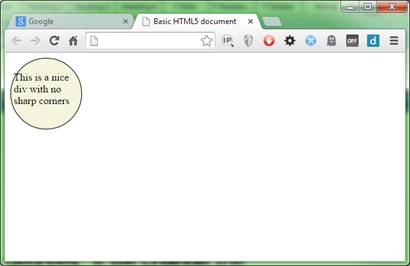
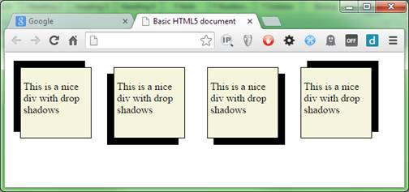
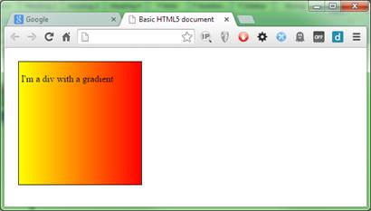
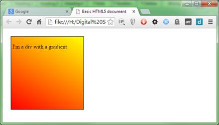
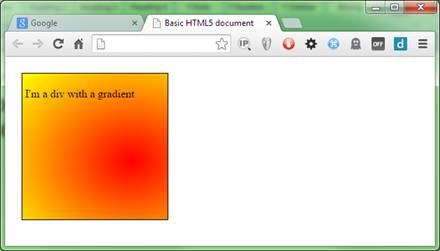
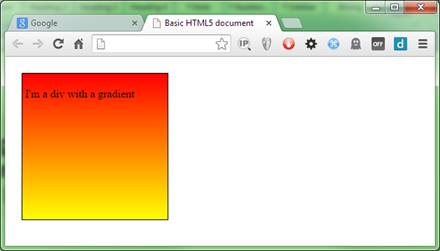
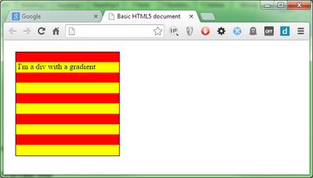

# 第五章眼糖

CSS3 有一个非常丰富的东西，那就是让事物看起来漂亮的方法。

对于开发人员(尤其是那些把大部分时间花在服务器端的开发人员)来说，他们可能会想知道这些大惊小怪是为了什么；我们受雇生产软件，这正是我们正在做的。

不幸的是，在客户端和浏览器中，事情并非如此。那些不了解我们做什么或如何做的同事喜欢看到华而不实、五彩缤纷、闪闪发光的东西。

当他们看到进展时，他们会评估视觉反馈，以此证明应用程序上已经完成了工作。

非信息技术人群最喜欢看的是眼影和圆角的主食。

我相信，如果你过去做过任何严肃的 CSS 或设计工作，你会非常熟悉使用 Photoshop 创建部分透明的 PNG 图形文件的难度，然后你必须在一个精心放置的`div`元素的边缘排队。

如果你偏离了一个像素，你经常不得不从头再来，一次测量一个像素，将页面布局限制在固定的大小，这样之后就不会出错。

如果你是这个游戏的新手，那就去找网络开发行业的老手，我相信他们会告诉你更多的恐怖故事。

CSS3 解决了所有这些问题，它增加了定义规则的能力，规定了角现在应该有多圆，并允许您描述投影应该是什么样子。然后，CSS3 引擎将根据您提供的选择器规则和所有需要的训练，自动将这些指令应用到您的 HTML 标记中。

## 圆角

网络是方形的——或者至少直到最近还是方形的。

在 CSS3 出现之前，我们只有边缘锋利的盒子。`Div`元素总是方的平行的，桌子也是方的平行的，我们不能让事物看起来更柔和更友好(嗯，至少不能没有大量的图像黑客)。

为了改变这一点，CSS3 在所有可以使用边框的块元素上引入了`border-radius`属性。

使用它很简单。

给定以下 HTML 标记:

```css
          <div class="niceDiv">
              <p>This is a nice div with no sharp corners</p>
          </div>

```

代码清单 61a:演示边界半径的 HTML 标记

这条 CSS 规则:

```css
          .niceDiv
          {
            width: 100px;
            height: 100px;
            background-color: beige;7
            padding: 4px;
            border: 1px solid black;
            border-radius: 5px;
          }

```

代码清单 61b:给 51a 中的 HTML 赋予圆角的 CSS 规则

我们在浏览器中获得了一个非常漂亮的`div`元素:


图 58:圆角 Div

在代码清单 61b 中的规则中，我们使用了边界半径的常规默认值，并且只指定了一个值。当您以这种方式定义规则时，所有四个角都使用相同的值，因此如图 58 所示，每个角看起来都是相同的。

指定的值是曲线的角度有多陡；在我们的例子中，我们使用了 5 个像素。如果您将其更改为 25 像素，您应该会得到如图 59 所示的结果:


图 59:25 像素圆角的 Div

因为每个角是四分之一，圆的四分之一是 90 度，如果我们把值改为 90 像素，我们就得到一个完美的圆。



图 60:90 像素圆角 Div

我们在上面的演示中使用了一个值的格式，但是如果您愿意，您也可以指定所有四个值(每个角一个)，更改代码清单 61b 中的`border-radius`行，使其看起来如下所示:

```css
          border-radius: 5px 10px 15px 20px;

```

代码清单 61c:代码清单 61b 的更改的边界半径线

渲染时，你应该得到一个有四个不同大小角的`div`:


图 61:四个不同尺寸角的 Div

第一个值是左上角，然后是右上角，然后是右下角，最后是左下角。

如果您愿意，也可以使用四种不同的规则，并写出如下尺寸规格:

```css
          border-top-left-radius: 5px;
          border-top-right-radius: 10px;
          border-bottom-right-radius: 15px;
          border-bottom-left-radius: 20px;

```

代码清单 61d:从代码清单 61c 写出来的变化

你选择如何做完全取决于你自己；有些人喜欢冗长的长时间做事情，说实话，我发现在开发过程中，它有助于维护代码。然而，当你运送到生产时，你真的想把这些东西做得越小越好。

一个好的 CSS 编辑器是优化样式文件的必备工具，尤其是当你在开发过程中使用长格式的时候。

|  | 注意:缩小 CSS 缩小是将文件变得比实际更小而不失去任何原始意图的过程。与压缩或 zip 文件不同，缩小的文件仍然以其最初的预期方式运行，只是变得更小、更紧凑。拥有一个好的迷你程序来压缩你的文件是网络开发的必备条件。当你的网站被加载的时候，你能得到的最大的加速之一，就是你的样式、代码、标记和图像尽可能的小和少。有太多的工具可以帮助你做到这一点。一个好的开始是咕噜任务跑者。Grunt 有大量的模块来压缩 CSS、JavaScript、图像，甚至是 HTML，让你可以在任何地方削减宝贵的字节。了解如何使用这些工具对于任何 web 开发人员来说都是一项非常重要的技能。 |

你也不必只给每个角落一个角度。如果你这样做了，那么相同的角度将应用于两侧，给你一个统一和平等的圆为基础的曲线。

如果在每个角上指定两个值，则可以使用椭圆来确定边框的曲线半径。这样做给了你一些有趣的可能性。

将边框半径规则更改如下:

```css
          border-top-left-radius: 50px 15px;
          border-top-right-radius: 50px 15px;
          border-bottom-right-radius: 15px 50px;
          border-bottom-left-radius: 15px 50px;

```

代码清单 61e:扩展边界半径规则以显示基于椭圆的曲线

您应该会得到类似于图 62 的结果:


图 62:我们的基于椭圆的角的 div

## 投影

创建阴影是另一个容易掌握的眼中钉，它可以产生一些有趣的效果。

阴影是通过使用盒阴影规则创建的，该规则采用四个整数测量值和一个颜色值。

在提供的四个测量值中，只需要前两个；其余两个将默认为浏览器默认值，如果被忽略。

前两个测量值是偏移 x 和偏移 y 值，顾名思义，这两个值设置了阴影从元素突出的距离。如果提供正值，则阴影从右下角突出；如果使用负值，阴影会从左上角突出。要获得其他角上的阴影，可以根据需要混合正负偏移。

创建一个 HTML 5 文档并添加以下标记(或者重复使用上一节中关于边框半径的代码，但重复四次):

```css
          <div class="niceDiv">
              <p>This is a nice div with drop shadows</p>
          </div>
          <div class="niceDiv">
              <p>This is a nice div with drop shadows</p>
          </div>
          <div class="niceDiv">
              <p>This is a nice div with drop shadows</p>
          </div>
          <div class="niceDiv">
              <p>This is a nice div with drop shadows</p>
          </div>

```

代码清单 62a:演示投影的 HTML 标记

创建以下样式规则作为本节其余部分的基础:

```css
          .niceDiv
          {
            width: 100px;
            height: 100px;
            background-color: beige;
            padding: 4px;
            border: 1px solid black;
            display: inline-block;
            margin: 15px;
          }

```

代码清单 62b:在 62a 中设置 HTML 样式的 CSS 规则

这将为我们提供您在上一节中看到的默认米色 div，没有额外的样式。

|  | 注意:到目前为止，您已经看到了许多规则从它们上面的不太具体的规则向下级联的例子。这是 CSS3(以及之前的版本)最大的特点之一，我没有过多的赘述。在前面的部分中，我们直接添加了边界半径“尼西迪夫”规则；在本节中，我将开始使用层叠更多，以保持基础样式(在本例中是我们的米色矩形)与我们目前正在探索的规则分开。你可以随意多次使用同一个选择器，效果永远是累积的。例如，如果您指定' '。niceDiv 和。尼西迪夫。然后，您总是可以选择使用基本样式，方法是为元素指定一个“niceDiv”类，并通过将它作为辅助 ID 添加到类列表中来应用阴影。如果你愿意的话，通过重复类和 ID 选择器将事物分成组没有错，但是如果你这样做了，请确保你记住了特定性的规则，并且正确地对事物进行了排序。 |

和前面的例子一样，我们将首先渲染这个，这样在开始之前您就可以看到它是什么样子了。


图 63:造型前的阴影部分

一旦我们做到了这一点，我们将创建一些示例规则来对元素应用不同的阴影。

```css
          .niceDiv.topLeftShadow
          {
            box-shadow: -10px -10px;
          }

          .niceDiv.bottomLeftShadow
          {
            box-shadow: -10px 10px;
          }

          .niceDiv.bottomRightShadow
          {
            box-shadow: 10px 10px;
          }

          .niceDiv.topRightShadow
          {
            box-shadow: 10px -10px;
          }

```

代码清单 62b:对 62a 中的 HTML 应用不同阴影的 CSS 规则

现在我们需要对 HTML 做一个小小的修改，在代码清单 62a 中的 HTML 中给每个新类名`topLeftShadow`、`bottomLeftShadow`加上一个`div`，如下所示:

```css
          <div class="niceDiv topLeftShadow">
              <p>This is a nice div with drop shadows</p>
          </div>
          <div class="niceDiv bottomLeftShadow">
              <p>This is a nice div with drop shadows</p>
          </div>
          <div class="niceDiv bottomRightShadow">
              <p>This is a nice div with drop shadows</p>
          </div>
          <div class="niceDiv topRightShadow">
              <p>This is a nice div with drop shadows</p>
          </div>

```

代码清单 62c:向 div 添加四个投影类

以防你想知道这里发生了什么，我们利用了 CSS 的级联特性，这样我们就不必在四个规则中的每一个中键入四次基本的米色`div`样式；以这种方式做事意味着减少打字，更好地重复使用。

如果我们重新渲染，你现在应该看到我们的每个`div`元素上的每个方向都有四个默认的块状阴影。



图 64:默认阴影下的 div 元素

然而，阴影的默认设置非常大胆和坚实；改变这一点就是剩下的两个可选测量值进入等式的地方。

第一个值是模糊半径；您不能在此使用负值，但是您提供的任何正值都会越来越模糊阴影，随着每个值的增加，外观会变得更加柔和。

将代码清单 62b 中的规则更改如下:

```css
          .niceDiv.topLeftShadow
          {
            box-shadow: -10px -10px 5px;
          }

          .niceDiv.bottomLeftShadow
          {
            box-shadow: -10px 10px 5px;
          }

          .niceDiv.bottomRightShadow
          {
            box-shadow: 10px 10px 5px;
          }

          .niceDiv.topRightShadow
          {
            box-shadow: 10px -10px 5px;
          }

```

代码清单 62d:改变了 CSS 规则来模糊阴影

重新渲染您的测试 HTML 文档，您现在应该看到阴影变得稍微柔和了。


图 65:我们添加了小模糊的 div 元素

模糊越大，阴影的边缘就越柔和。


图 66:模糊半径为 30px 的 div 元素

第四个参数控制模糊从边缘扩散的程度，称为扩散半径。

如果我们在模糊半径上增加 10 个像素，我们的阴影将增加到总共 20 个像素(我们已经有了 10 个像素的偏移)，但是最后的 10 个像素将用于模糊及其相关的淡出。按如下方式更改阴影规则:

```css
          .niceDiv.topLeftShadow
          {
            box-shadow: -10px -10px 30px 10px;
          }

          .niceDiv.bottomLeftShadow
          {
            box-shadow: -10px 10px 30px 10px;
          }

          .niceDiv.bottomRightShadow
          {
            box-shadow: 10px 10px 30px 10px;
          }

          .niceDiv.topRightShadow
          {
            box-shadow: 10px -10px 30px 10px;
          }

```

代码清单 62e: CSS 规则被改变以模糊阴影

然后重新渲染，你会得到一些非常大，非常模糊的阴影，边缘非常柔和:


图 67:我们应用了可选扩展半径的 div 元素

为可选值获得合适的值可能是一个反复试验的过程，但一般来说，扩散半径越大，模糊需要淡出的空间就越大，因此可以进行更平滑的过渡。

|  | 注意:如果你有一些特定的 Z 排序(也就是说，如果你使用的是 div 层)，那么有可能在兄弟元素上投射阴影。出于这个原因，通常最好尽量将阴影在元素栈中保持在尽可能低的位置，或者调整模糊和偏移的大小，使其保持在元素上定义的任何边距内。 |

最终值是颜色值，像元素上的任何其他颜色属性一样，它可以采用任何标准颜色值。现在，我们将只使用标准的 6 位数#符号方式来指定颜色，因为我们将在下一章中更仔细地研究定义颜色。

更改您的规则，使其看起来如下所示:

```css
          .niceDiv.topLeftShadow
          {
            box-shadow: -10px -10px 20px 5px #FF0000;
          }

          .niceDiv.bottomLeftShadow
          {
            box-shadow: -10px 10px 20px 5px #00FF00;
          }

          .niceDiv.bottomRightShadow
          {
            box-shadow: 10px 10px 20px 5px #0000FF;
          }

          .niceDiv.topRightShadow
          {
            box-shadow: 10px -10px 20px 5px #FFFF00;
          }

```

代码清单 62e: CSS 规则改变了阴影的颜色

当重新加载 HTML 时，您应该会看到您的阴影现在变得更加明亮，更加丰富多彩，并且看起来更加漂亮。


图 68:我们的阴影现在更加丰富多彩

通过在规则上指定可选的`inset`关键字，可以使阴影出现在元素内部(而不是像我们一直在做的那样出现在外部)。但是，如果使用 inset，则必须在任何值之前提供它。最后一次修改我们的规则:

```css
          .niceDiv.topLeftShadow
          {
            box-shadow: inset -10px -10px 20px 5px #FF0000;
          }

          .niceDiv.bottomLeftShadow
          {
            box-shadow: inset -10px 10px 20px 5px #00FF00;
          }

          .niceDiv.bottomRightShadow
          {
            box-shadow: inset 10px 10px 20px 5px #0000FF;
          }

          .niceDiv.topRightShadow
          {
            box-shadow: inset 10px -10px 20px 5px #FFFF00;
          }

```

代码清单 62e: CSS 规则更改为插入阴影

并重新渲染以查看效果。


图 69:带有嵌入阴影的 div 元素

### 在文本上投射阴影

CSS3 还支持给常规文本元素添加阴影。当您这样做时，阴影的形状将跟随文本的形状，而不仅仅是元素边框的轮廓。

这里的区别在于，虽然参数是相同的(或多或少)，但它们的指定顺序与框形阴影的参数大不相同。

指定文本阴影时，规则的布局如下:

`text-shadow: <color> <offsetx> <offsety> <blurRadius>`

文本阴影不支持扩散半径，颜色必须排在列表的第一位，而不是最后一位。

举个简单的例子，在你的文档中添加以下的 HTML:

```css
          <h1>Drop Shadow Text</h1>

```

代码清单 63a:演示投影文本的 HTML

然后添加以下样式规则:

```css
          h1
          {
            text-shadow: red 10px 10px 10px;
          }

```

代码清单 63b:在代码 63a 中为文本添加阴影的 CSS 规则

您应该会得到类似图 70 的结果:


图 70:带有红色阴影的文本

参数的工作方式与盒子阴影相同，因此我们将不进行任何冗长的描述；相反，我会把它作为一个练习留给读者去实验。

关于这两个影子规则，您需要知道的最后一件事是，您可以向一个元素添加多个影子声明，用逗号分隔。

当您这样做时，效果将是累积的，任何相互重叠的阴影将按照 CSS 规则中指定的顺序从前到后绘制。这可以用来在元素周围创造一些相当奇怪的类似光环的效果。然而，请记住，要谨慎使用它们:即使现在的浏览器可能变得越来越快，像这样的效果仍然需要消耗功率和中央处理器能量，移动设备用户可能不会感谢你以看起来漂亮的名义耗尽他们的设备电池。

## 渐变填充

我确信在您开发 HTML 文档的某个阶段，您已经遇到了在页面设计中逐步填充一些描述的需求。

这可能是颜色的微妙变化，也可能是短时间内的大胆变化。正确使用颜色刻度会有很大不同。

与许多图形效果一样，在过去，您通常会借助图像编辑软件包(如 Photoshop)来创建颜色分级。然后，您可以将生成的毕业作为背景图像，并根据需要重复它，以覆盖您所瞄准的元素的全部大小。

有了 CSS3，你现在可以使用渐变填充类型来动态创建颜色范围，再也不用使用图像编辑器了。

请注意，在上一段中，我将渐变填充称为“类型”与我们目前所看到的一切不同，渐变填充并不像阴影和弯曲的边框那样完全是一种规则。它们实际上是 CSS 引擎为我们创建的一种图像类型，通常(但不总是)与您通常可能指定图像的任何规则一起使用。

这意味着您的样式表中没有称为渐变规则的规则；相反，您可以使用正常的 CSS 属性(如颜色、背景色、背景图像和许多其他属性)为给定的目标创建 CSS 规则。然后，用要应用渐变的区域替换或覆盖已经定义的全部或部分规则。

这对于向后兼容性很重要，因为这意味着您将总是有一个后退，这意味着 CSS 颜色渐变是您可以使用的许多新东西之一，而不必做任何太特殊的事情来支持旧浏览器。

在典型的用法中，您将创建您的规则(记住特定顺序)以一种看起来适合旧浏览器的方式来设计元素的样式。然后，您可以添加特定于类的可选规则来扩展原始规则，或者在基本属性已经设置好之后，向有问题的规则的底部添加渐变生成器。

以这种方式生成渐变允许浏览器中的 CSS 引擎为您完成所有艰苦的工作，这意味着没有聚合文件或 JavaScript 黑客来提供向后兼容性。

既然您已经了解了基本知识，让我们看看如何应用它。

首先我们需要一些 HTML 标记来玩，所以让我们创建一个简单的，单一的`div`并把它放在一个 HTML 文档中。

```css
          <div class="gradDiv">
              <p>I'm a div with a gradient</p>
          </div>

```

代码清单 64a:我们的分级填充的 HTML

让我们定义以下规则作为实验的起点:

```css
          .gradDiv
          {
            width: 200px;
            height: 200px;
            background-color: salmon;
            padding: 4px;
            border: 1px solid black;
            display: inline-block;
            margin: 15px;
          }

```

代码清单 64b:我们的分级分区的基本样式

这个的初始渲染应该如下所示:


图 71:我们的未分级 div 元素

渐变有三种类型:线性、放射状和重复，每种都有自己的语法和格式。

|  | 注意:直到最近，许多主要的浏览器都使用供应商前缀来定义渐变之类的东西。值得庆幸的是，它们现在都支持无前缀版本的渐变填充，并且每个浏览器都决定使用标准语法。如果你的任务是支持旧的浏览器(这里我说的旧是指适度的旧:IE9、FF20 等)。)，那么您可能会发现您需要不止一次地指定渐变填充(就此而言，其他 CSS3 特性也是如此)，并且以几种不同的形式指定。在这本书里，我坚持使用属性和功能，这些属性和功能可以以无前缀的方式使用，以保持简单。渐变填充还有一点需要注意:指定填充的实际语法在不同的前缀版本之间有很大的不同，并且只有标准化的非前缀版本。 |

我们从最简单的开始，线性梯度。

将以下内容添加到您的样式文件中(但不要替换我们已经定义的规则):

```css
          .gradDiv
          {
            background-image: linear-gradient(red, yellow);
          }

```

代码清单 64b:我们的分级分区样式的扩展

当您在浏览器中渲染时，应该会看到它更改为:


图 72:我们的第一个分级部门

如您所见，线性渐变使用起来非常简单。我们已经告诉 CSS 引擎从红色开始，以黄色结束，它就是这样做的，在目标元素的整个大小上创建一个相等的渐变。

我们也可以使用`to`关键字改变方向。更改 64b 中的规则，使其内容如下:

```css
          .gradDiv
          {
            background-image: linear-gradient(to left, red, yellow);
          }

```

代码清单 64c:方向改变的 CSS 规则

当我们刷新 HTML 时，我们应该会发现我们的渐变现在从右边开始，并向左移动。



图 73:我们的渐变现在从右向左运行

你可以组合方向，这样你就可以有“到左上角”或“到右下角”，让你从一个角落到另一个角落，而不仅仅是从上到下或从左到右。

也可以提供一个角度。例如:

```css
          .gradDiv
          {
            background-image: linear-gradient(30deg, red, yellow);
          }

```

代码清单 64c:方向改变的 CSS 规则

这将给你一个从红色到黄色的渐变，与 0 轴成 30 度角。



图 74:我们在 30 度的梯度

|  | 注意:根据您需要支持的范围，您可能仍然需要使用供应商前缀。我注意到供应商前缀版本使用不同的语法来指定渐变。然而，我还没有提到的是旋转是如何计算的。标准语法在目标元素的中间底部看到 0 度，从 0 到 360 度的正增量顺时针移动。您可以在前面示例中的 30 度旋转中看到这一点，因为红色从左下角开始。在带有浏览器前缀的版本中，使用了两种不同的方案——现在的标准方案，以及 0 度是中间偏右，正旋转从 0 度逆时针到 360 度的方案。 |

线性渐变也可以包含两种以上的颜色；事实上，它们可以包含任意多的颜色。还记得以前人们对彩虹色的背景充满热情吗？尝试以下扩展的 CSS 规则。

```css
          background-image: linear-gradient(red, orange, yellow, green, blue, indigo, violet);

```

代码清单 64d:带有明显彩虹味道的 CSS 规则

在浏览器中渲染可能会伤害你的眼睛！


图 75:我们的 div 现在看起来像彩虹

您会注意到颜色分布仍然均匀地分布在元素的高度上。我们可以使用色标轻松改变这一点。

如果你曾经使用过像 Photoshop 或 Gimp 这样的图像编辑器，那么你很可能知道什么是颜色停止。它们是设定值，告诉图形引擎在比例中的给定点改变颜色。

为了说明我的意思，请更改您的扩展规则，如下所示:

```css
          .gradDiv
          {
            color: white;
            background-image: linear-gradient(black 0%, black 20%, green 30%, black 40%, black 100%);
          }

```

代码清单 64e: CSS 规则现在使用颜色停止

您应该会发现，当您现在渲染您的 HTML 时，您有一个黑色背景，上面有一个绿色的渐变条。


图 76:我们的 div 现在看起来相当暗

您可以使用您喜欢的任何值类型来指定止损点，但是为了便于阅读，我建议您坚持使用百分比值，尤其是如果您需要像我在图 76 中所做的那样精细地控制这些值。

### 径向梯度

像线性渐变一样，辐射从一个定义的点(通常是元素的中心)开始，并在向外的运动中产生颜色刻度。它们也采用与线性渐变相同的一组颜色设置(和颜色停止)。

从一个简单的例子开始(并重新使用上一节中的 HTML)，按照如下方式更改您的 CSS 规则:

```css
          .gradDiv
          {
            background-image: radial-gradient(red, yellow);
          }

```

代码清单 65a:我们的 CSS 规则被修改为径向渐变

这将产生如图 77 所示的输出:


图 77:我们已经将渐变改为径向渐变

就像线性渐变一样，我们可以改变起始位置。例如，我们可以通过执行以下操作轻松地从右上角开始毕业:

```css
          .gradDiv
          {
            background-image: radial-gradient(at top right, red, yellow);
          }

```

代码清单 65b:径向渐变变为右上角

这给了我们以下信息:


图 78:来自右上角的径向渐变

您也可以使用任何有效的 CSS 值来提供 x 和 y 偏移。这里使用百分比很有趣，因为您可以根据目标元素的大小制作位置辐射线。在下面的规则中，我们沿着 x 轴开始 75%(0 为左)，沿着 y 轴开始 60%(0 为上)。

```css
          .gradDiv
          {
            background-image: radial-gradient(at 75% 60%, red, yellow);
          }

```

代码清单 65c:径向渐变变为 75% X 和 60% Y

呈现这个应该会给你类似下面这样的东西:



图 79:我们的 div 有一个以 75%乘 60%为中心的梯度

如果您一直在仔细观察渲染输出，您可能已经注意到实际的渐变是非常圆形的。

默认情况下，CSS3 引擎会产生椭圆形的径向渐变，而不是平衡的圆形。

如果你需要你的径向渐变是圆形的，那么你可以使用`circle`修改器强制 CSS3 引擎产生圆形渐变，如下所示:

```css
          .gradDiv
          {
            background-image: radial-gradient(circle at 75% 50%, red, yellow);
          }

```

代码清单 65d:将圆形修改器应用到我们的规则中

如果您使用的是我们到目前为止使用的 200px 乘 200px 元素，您可能无法在这里区分，因此您可能想要尝试将父规则中的宽度更改为类似 400px 的值，然后尝试在应用和不应用圆形修改器的情况下进行渲染。

在应用`circle`修改器的情况下，在 400 乘 200 时，您应该会看到如下内容:


图 80:应用了圆形修改器的渐变

也可以添加其他修改器；这些大多是用来控制基于宽度的东西。例如，如果您有一个短而宽的元素，并且您正在指定`circle`修改器，那么最大的颜色范围将沿着最长的边。这意味着从上到下，你可能只看到你的起始颜色，但整个宽度上的完全褪色是可见的。为了克服这一点，你可以提供的一个修改器是`closest-side`，它将迫使你的大部分渐变进入最小的边维度，同时让刻度在更宽的边上提前用完。与所有可用的不同设置一样，您可以在 Mozilla 开发者网络上找到这些设置及其说明。

### 重复渐变

重复渐变的语法与线性渐变的语法相同，唯一的区别是您使用`repeating-linear-gradient`而不仅仅是`linear-gradient`来指定它们，但是您需要注意一个警告，那就是您必须为您的颜色提供颜色停止值。

如果您试图通过仅提供非颜色停止值来指定重复渐变，那么您最终得到的只是看起来像标准线性渐变的东西

```css
          .gradDiv
          {
            background-image: repeating-linear-gradient(red, yellow);
          }

```

代码清单 66:重复的线性渐变

这将产生以下图像:



图 81:我们的重复渐变无法正常工作

如果我们改变渐变填充，使它看起来像这样:

```css
          .gradDiv
          {
            background-image: repeating-linear-gradient(red 0%, red 10%, yellow 10%, yellow 20%);
          }

```

代码清单 67:正确工作的重复线性渐变

您会发现，当您渲染它时，会得到以下结果:



图 82:我们的梯度现在重复

这里发生的事情很简单:我们从 0%开始，确保我们有红色到 10%，然后我们从 10%的标记开始黄色，到 20%结束。

CSS3 引擎查看规则，发现元素宽度中 20%的颜色用完了，因此它重复前 20%来填充剩余的 80%。

那么这是否意味着我们永远不能用 100%的毕业率来复读呢？不，一点也不；虽然我们示例中的 100%宽度是元素的宽度，但是渐变的计算实际上是背景的宽度。

在 CSS3 中，现在可以使用`background-size`规则设置背景的大小。

与我们在这里所做的相关是，如果我们将背景大小设置为 10px 乘以 10px，那么就我们的重复渐变而言，10px 将是大小的 100%。如果 10px 乘 10px 的背景被应用于 200px 乘 200px 的元素，背景将在 X 和 Y 方向重复 20 次，除非另有指示。

在我们的示例中，我们将 100%视为元素宽度的唯一原因是，我们将背景宽度和高度保留为默认值，这恰好是目标元素的 100%。

考虑到这一点，无论你在哪里结束一个颜色停止，你的重复渐变将在它自己里面重复。这意味着，如果您正在调整背景大小，您需要确保您所做的任何颜色停止重复也在平铺图像边界上重复，除非您的目标是未对齐。

## 总结

在这一章中，您已经看到了 CSS3 介绍的一些眼中钉。接下来，我们将更仔细地研究 CSS3 中指定颜色的不同方法，并了解一些我们现在可以使用的东西，例如 alpha 通道。