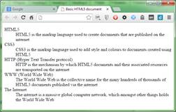
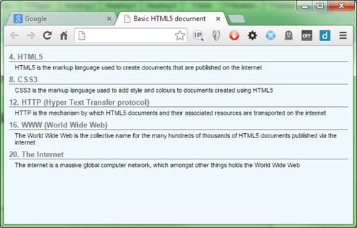
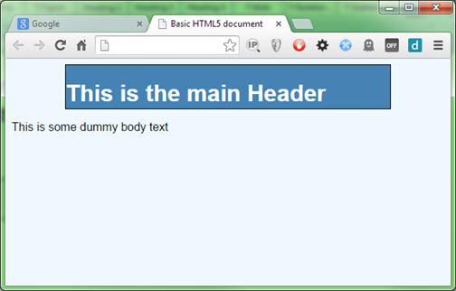
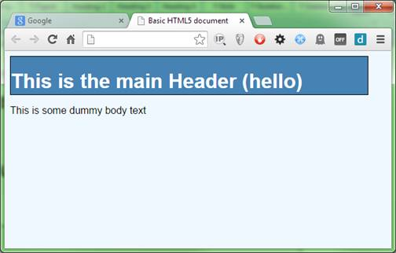

# 第 8 章生成的内容和计算

您已经看到了生成的内容可以以伪选择器的形式做些什么:然而，生成的内容模块可以用一些简单的 CSS 规则做得更多。

例如，您可以从父元素中读取属性值，然后在链的更下游的规则中使用它。

您还可以初始化和使用计数器，允许您对从列表编号到元素索引的所有内容使用自动生成的序列号。

最后，通过计算模块，您实际上可以让您的 CSS 规则执行基本的数学运算，并计算出精确的屏幕大小、边框宽度和各种其他有用的测量值，而无需考虑 JavaScript。

## 计数器

计数器由正常的 CSS 规则控制，虽然它们本质上非常简单，但它们有很多用途。

计数器使用`counter-reset` CSS 规则初始化，并使用`counter-increment`规则递增。

使用`counter()`函数可以得到计数器的值。

让我们假设您有以下 HTML 标记(如果您已经阅读了本书的剩余部分，您将从代码清单 58 中认识到这一点)。

```css
          <dl>
              <dt>HTML 5</dt>
              <dd>HTML 5 is the markup language used to create documents that are published on the internet</dd>
              <dt>CSS3</dt>
              <dd>CSS3 is the markup language used to add style and colors to documents created using HTML 5</dd>
              <dt>HTTP (Hyper Text Transfer protocol)</dt>
              <dd>HTTP is the mechanism by which HTML 5 documents and their associated resources are transported on the internet</dd>
              <dt>WWW (World Wide Web)</dt>
              <dd>The World Wide Web is the collective name for the many hundreds of thousands of HTML 5 documents published via the internet</dd>
              <dt>The Internet</dt>
              <dd>The internet is a massive global computer network, which amongst other things holds the World Wide Web</dd>
          </dl>

```

代码清单 69a:计数器演示的定义列表标记

如果我们渲染它，我们会得到以下结果。



图 91:我们的定义列表已经准备好了。

首先，让我们添加一点默认样式，只是为了稍微整理一下。

将以下规则添加到样式表中。

```css
          body
          {
            background-color: aliceblue;
            font-family: sans-serif;
            font-size: 12px;
          }

          dt
          {
            font-weight: bold;
            font-size: 1.1em;
            border-bottom: 1px solid grey;
            margin-bottom: 4px;
            margin-top: 8px;
            color: grey;
          }

          dd
          {
            font-size: 0.9em;
            margin-top: 2px;
            margin-bottom: 2px;
            margin-left: 10px;
          }

```

代码清单 69b:我们生成的内容的默认样式规则

这里没有什么特别新的，我们正在为页面设置默认字体样式、大小和背景颜色，然后我们正在为我们的定义列表项设置一些默认样式。

输出应该如下所示:


图 92:默认样式的定义列表

然而，如果我们能给每个定义标题编号，那就好了。

现在我们可以仔细检查每一个定义，并在上面加上适当的数字前缀，但这将是乏味且容易出错的，如果这些定义是从事先没有数字的数据库中发布的呢？

我们也可以将`dl`元素更改为`ol`元素，然后将所有内部列表项更改为`li`元素，但是我们必须开始使用第 n 个子设置来突出显示每一个替代行作为标题。我们还会遇到从定义文本中删除数字的问题，只留下带有数字的标题。

这两种方法都可行，但必须进行大量的开发和管理工作。CSS 计数器可以通过对我们已经开发的样式进行一些小的添加来解决这个问题。

首先，让我们在每次遇到`dl`元素时将计数器重置为`0`。将它附加到现有的样式表中:

```css
          dl
          {
            counter-reset: dtcount 0
          }

```

代码清单 69c:重置我们的计数器

然后我们需要增加计数器，并将其添加到我们的`dt`元素的内容之前:

```css
          dt:before
          {
            content: counter(dtcount)". ";
            counter-increment: dtcount;
          }

```

代码清单 69d:递增和增加我们的计数器

如果您现在刷新浏览器，您应该会看到我们的每个`dt`元素旁边都有一个数字。


图 93:标题旁边有数字的定义列表

无论列表中有多少对`dt` / `dd`，数字都会增加，并且会正确编号。你也不必使用`content:before`伪选择器；在任何可以使用整数值的地方，都可以使用`counter()`函数来获取计数器的值。这意味着你可以使用它来改变颜色，调整字体大小，增加间距，以及所有其他方式的事情。

递减计数器怎么样？嗯，你也可以这么做，但不是你想象的那样。

要递减计数器，您仍然使用`counter-increment`规则，但使用负偏移。

计数器增量规则可以取两个参数:第一个是要更改的计数器的名称，第二个是按多少。

更改代码列表 69d 中的代码，使其现在为:

```css
          dt:before
          {
            content: counter(dtcount)". ";
            counter-increment: dtcount 4;
          }

```

代码清单 69e:从 69d 开始添加偏移量的代码

如果您现在渲染它，您会看到您的定义列表现在每次都增加 4。



图 94:我们的计数器现在递增 4

同样，如果你把 4 变成负数，你会看到`dt`元素旁边的数字向后移动。

我相信你能想到更多你能用这些做的事情——我会把它作为一个实验练习。

## 计算值

多年来，CSS 最大的问题之一是精确计算元素大小。主要是因为缺乏做这种简单任务的能力，所以才有了这么多的 JavaScript UI 框架和工具，比如 Sass 和 Less。

在 CSS3 中，标准委员会引入了`calc()`功能，顾名思义，这个超好用的小宝石可以为你计算数值。

它能做的大部分实际上只是基本的数学——正是你能把它和它结合在一起，才使它如此特别。

您可以将`calc`函数中的值与基于百分比的值相结合:em、px、pt 以及 CSS 理解的任何其他类型的值或度量，这打开了一些惊人的可能性。

请考虑以下 HTML 标记:

```css
          <div class="header">
              <h1>This is the main Header</h1>
          </div>
          <p>This is some dummy body text</p>

```

代码清单 70a:演示计算功能的 HTML 标记

在大多数 HTML 文档中看到这种类型的模式并不罕见，通常您会标记标题类，以便标题具有固定的大小，使用百分比值(可能是 75%)覆盖预期的文档最小宽度。

```css
          body
          {
            background-color: aliceblue;
            font-family: sans-serif;
          }

          .header
          {
            width: 75%;
            height: 60px;
            background-color: steelblue;
            border: 1px solid black;
            color: white;
          }

```

代码清单 70b:基本的正文和标题规则

代码清单 70b 中的基本规则将为您提供以下内容:


图 95:应用于标题的基本规则

因为我们对标题元素的宽度使用了一个百分比值，所以它将始终设置为 75%。这很好，但是如果我们想让头部居中呢？这也不难。将以下两行添加到。基本样式中的标题规则:

```css
          margin-left: auto;
          margin-right: auto;

```

代码清单 70c:使标题居中的附加规则

不出所料，这集中了我们的头部。



图 96:我们的标题现在居中了

不幸的是，我们现在在标题的每一侧都有相当多的空白空间，并且因为这是基于百分比的测量，当它被调整到宽屏幕显示器的大小时，这些空白看起来会很大，更不用说它们在移动设备上看起来有多拥挤了。

您可以决定通过更改百分比值进行补偿。所以你把它变成 95%，100%，或者 98%。你可能会花很多时间来调整它，然后在各种不同的屏幕尺寸和不同的设备上进行测试，但是无论你怎么努力，你都不能让它在所有可能的设备上看起来完全一致。

如果你有一种说法就好了，“我希望我的标题总是 100%宽，但总是在左右两边有正好 20 个像素的空间，不管我的显示器有多小或多大。”

这正是`calc`功能发挥作用的地方。

如果你想两边正好有 20 个像素，那么总共就是 40 个像素。如果你把一个 100%宽度的物体放在中心，减去 40 个像素，你就能得到你所需要的。

更改**中的`width`规则。标题**这样写道:

```css
          width: calc(100% - 40px);

```

代码清单 70d:宽度规则现在使用 calc 计算它的宽度

渲染时，您应该会看到以下内容:


图 97:我们的头部两边各有 20px

现在，它两边都用 20px 渲染，宽度是多少并不重要，因为 CSS 引擎总是知道目标宽度的 100%，所以可以自动为我们计算。

像`counter()`一样，你可以在任何地方使用`calc()`你可以使用一个直发号码。不过，需要警告的是:并不是所有的浏览器都在所有的属性中实现它。从实现的角度来看，目前所有的浏览器都支持它，但并不是所有的浏览器都支持颜色值或旋转。

最好检查的地方是[我可以使用](http://caniuse.com/)吗，它将列出所有新功能标准化后的当前兼容性图表。要知道的一个有用技巧是，你可以经常在谷歌搜索中键入类似**“cani use calc()”**或**“cani use web font”**的内容，并获得一个即时链接，指向你想了解更多信息的功能的兼容性图表。

## 元素属性

为了结束这一章，我将介绍获取元素属性的能力，以便在您正在使用的规则中使用它。

如果你还记得，在书的前面，我提到了一些叫做数据属性的东西；数据属性的一大优点是能够在 HTML 5 元素中嵌入自定义属性数据，并且仍然让它验证。

下面的 HTML 显示了如何使用它:

```css
          <div class="header">
              <h1 data-headersuffix=" (Hello)">This is the main Header</h1>
          </div>
          <p>This is some dummy body text</p>

```

代码清单 71a:演示父属性的 HTML 标记

如果您渲染它，您将获得完全相同的输出，如图 97 所示(假设您仍然有相同的样式规则)。如果你没有相同的样式，或者你已经开始了一个新的文件，那么你会得到一个白色背景的纯黑色文本。

这里的要点是，这些额外的数据属性对 HTML 或 CSS 中的任何东西都没有意义，并且会被默默忽略。

这真的很方便——尤其是对于许多可用的 JavaScript 库来说——因为这意味着 HTML 开发人员可以向页面添加自定义属性，然后 JavaScript 代码会以某种方式处理这些属性。引导用户界面框架广泛使用了这一工具，因此创建页面的 HTML 开发人员永远不需要知道任何 JavaScript。他或她只需描述意图是什么，Bootstrap 库会处理其余的事情。

确保您的样式文件与代码清单 70b 相同，并且您使用的是代码清单 71a 中的 HTML 代码。在浏览器中呈现 HTML，并确保输出如图 95 所示。

现在将以下扩展规则添加到样式表中(您应该会看到标题文本变为蓝色):

```css
          .header h1:after
          {
            content: " (Hiya)";
          }

```

代码清单 71b:将“(Hiya)”放在标题文本后面的扩展标题规则

渲染它，并确保标题文本现在已经附加了“(你好)”。如果是，现在更改规则，以便它查找名为`headersuffix`的数据属性，并使用该属性中的参数作为其数据源。

```css
          .header h1
          {
            color: attr(data-headersuffix);
          }

```

代码清单 71c:使用数据属性设置文本的扩展标题规则

结果应该是现在使用选择器目标的`h1`元素上存在的自定义数据属性的内容来扩展标题文本。



图 98:带有数据属性文本的标题

不幸的是，有一些坏消息。如果您仔细阅读规范，您会发现读取父属性并将其放入生成的内容字段的能力实际上是在 CSS2.1 中定义的，并且可以使用`attr()`函数来设置属性，如颜色、大小等。，是在 CSS3 中定义的。因此，所有主要的浏览器都可以使用`attr()`在一个:before 或:after 伪选择器中设置内容，但是到目前为止，还没有一个浏览器在一般的属性设置场景中实现了它们。

这并不是说他们不会；可能很多人都知道，W3C 标准轨道上最受欢迎的特性是开发人员要求的特性，`attr()`目前并没有得到太多关注。总有一天这一点会最终确定下来，浏览器生产者会觉得它得到了足够的关注，从而实际上完成了它的实现。目前，它只可用于内容生成，不管文档怎么说。

然而，它对于一个场景很有用(也是我以前使用过的场景)，那就是将问候附加到标题和欢迎横幅上，这些标题和横幅是针对给定地区本地化的。因为该值取自一个属性，所以在 JavaScript 中更改该属性非常容易，因为有访问数据属性的本机调用。

它变得有用的另一个地方是印刷。如果您有一个仅在打印页面时使用的样式表，您可以使用它从锚点元素中抓取`href`的内容，然后在锚点标签后将其打印出来。这样做意味着打印到 PDF 或纸上的链接页面仍然可见，而屏幕上的页面仍然可以点击。

## 总结

在这一章中，我们学习了如何只使用 CSS 规则来生成任意内容，这是一项以前需要大量 JavaScript 才能完成的任务。我们已经了解了更多关于数据属性是如何工作的，以及如何使用它们来保存自定义内容。

在下一章中，我们将总结一些我们没有篇幅讨论的事情，以及一些较小的新规则。