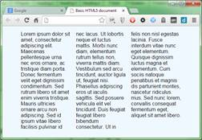
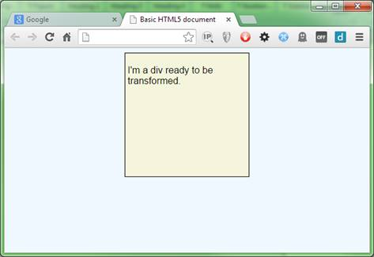
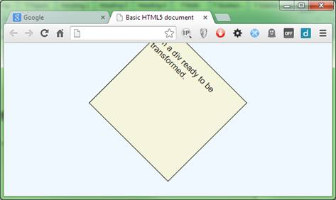

# 第九章花样百出

所以我们来到了这本书的最后一章。

当你读到这样一本书的结尾时，总是很悲伤，尤其是在像 CSS3 这样多样化的主题上，但这不是结尾。事实上，我们离终点已经很远了——我们仍然刚刚开始这场冒险。

到目前为止，我给你看的只是冰山一角。如果你有任何疑问，看看 [Mozilla 开发者网络](https://developer.mozilla.org/en-US/docs/Web/CSS/Reference)上的主要 CSS 索引。我甚至还没有开始探索 CSS 布局或者 CSS 动画；这两个主题将很容易占据整本书，就像详尽的规则/属性后面跟着描述列表样式的文本一样。

然而，*简洁地说*系列的书被设计得紧凑且易于阅读，只有足够的信息才能让你找到正确的方向，决定遗漏什么总是一个困难的决定。

和任何新技术一样，学习它的最好方法就是玩它。游戏是一种无价的技能和学习工具，但在现代信息技术行业，它经常会在紧迫的截止日期和精心设计的发布时间表中丢失。我希望我在这里展示的是足够的信息，至少可以防止你浪费时间去理解你在玩什么。

在这一章的剩余部分，我将通过一些值得一提的简单易懂的 CSS3 功能来结束这一章。

## CSS 列

我们都经历过这种情况，竭尽全力让列宽完美，这样我们就可以在页面设计中获得一个漂亮而平衡的多列布局。

几个小时被花费在调整、测量和再调整上，直到我们得到一个规则和内容的近乎完美的组合。然后有人决定在侧边栏中放一张图片，把东西推出 1 个像素，然后 BAM！整个布局瓦解成一个闷烧堆。

好了，这应该不会再影响你了，感谢 CSS 专栏。

创建一段很长的文本`div`，如下所示:

```css
          <div class="container">
              <p>Lorem ipsum dolor sit amet, consectetur adipiscing elit. Maecenas pellentesque urna nec eros ornare, ac tristique diam porta. Donec fermentum velit eget dignissim condimentum. Sed rutrum libero sit amet enim viverra tristique. Mauris ultricies ornare arcu non adipiscing. Sed id ipsum vitae libero facilisis pulvinar id nec lacus. Ut lobortis neque et luctus mattis. Morbi nunc diam, elementum rutrum tellus non, viverra mattis diam. Vestibulum sed arcu tincidunt, auctor ligula ut, feugiat nisi. Phasellus adipiscing eros ut iaculis sagittis. Sed posuere vehicula elit vel tincidunt. Duis feugiat feugiat libero bibendum consectetur. Ut in felis non nisl egestas lacinia. Fusce interdum vitae nunc eget elementum. Quisque dignissim luctus magna et elementum. Cum sociis natoque penatibus et magnis dis parturient montes, nascetur ridiculus mus. Sed nunc lorem, convallis consequat fermentum eget, aliquet sit amet libero.</p>
          </div>

```

代码清单 72:div 元素中一段漂亮的长文本

如果您渲染这个，您应该会看到类似这样的内容:


图 99:默认样式的一个相当大的段落

这当然不是最好的布局，但如果你调整显示器的大小，它会正确流动和自动换行。如果你想把它分成三个专栏(就像报纸可能会做的那样)，你会有一个相当困难的工作要做。

您几乎肯定需要使用 JavaScript，因为您需要计算出每个框中可以容纳多少文本。然后你需要确保这些列被适当地调整大小，这个任务`calc()`可以帮助你——但是仍然有很多工作要做。

相反，您可以使用 CSS3 列规则。将以下两个规则添加到样式表中，并将其附加到以前的 HTML 中。

```css
          .container
          {
            width: 500px;
            margin: 0 auto;
          }

          .container p
          {
            -moz-columns:3;
            -webkit-columns:3;
            columns:3;
          }

```

代码清单 73:支持多列布局的 CSS 规则

渲染这个会立即为您处理布局和流程。但是，请注意，该规则仍然需要供应商前缀，虽然总体布局是可行的，但模块中的一些扩展规则要么不完整，要么尚未实现。你可以在这里找到全部细节[。](http://caniuse.com/#feat=multicolumn)

如果您有一个兼容的浏览器，那么用代码清单 73 中的规则来呈现代码清单 72 中的 HTML 应该会给你这样的结果:



图 100:多列布局变得简单

## CSS 转换

虽然转换是另一个可以填满整本书的话题，但是有一些基础知识很容易尝试。创建一个 HTML 文档，并向其中添加以下标记和 CSS 规则:

```css
          <div class="transDiv">
              <p>I'm a div ready to be transformed.</p>
          </div>

          body
          {
            background-color: aliceblue;
            font-family: sans-serif;
          }

          .transDiv
          {
            width: 200px;
            height: 200px;
            background-color: beige;
            border: 1px solid black;
            padding: 4px;
            margin-left: auto;
            margin-right: auto;
          }

```

代码清单 74:创建米色居中 div 的 HTML 和 CSS 规则

渲染时，这将为您提供以下信息:



图 101:这只是一个标准的米色分区

现在将以下扩展规则添加到样式表中，并重新呈现输出:

```css
          .transDiv
          {
            transform: rotate(45deg);
            -webkit-transform: rotate(45deg);
          }

```

代码清单 75:扩展 CSS 规则来旋转我们的 div

您应该将`div`旋转 45 度:



图 102:我们的 div 现在被旋转了。

与 CSS 列一样，仍然有一种情况需要供应商前缀，那就是在 Safari 上。IE、火狐和 Chrome 在当前版本中都可以工作，不需要前缀。

您也可以应用以下内容:

*   刻度(x，y)
*   scalex(值)
*   比例(值)
*   偏斜(值)
*   偏斜(值)
*   翻译（x，y）
*   translatex(值)
*   平移(值)

每个函数用途的实际定义可以在 MDN 上找到，但是缩放允许您增长和收缩元素，倾斜允许您倾斜元素，平移允许您移动元素。还有一些属性可以让你产生各种各样的效果，其中许多属性也可以被动画化，从而实现更多的效果。

还有更多，比如多背景、分层元素、三维变换、伸缩框、CSS 形状等等。

然而，就目前而言，我希望你已经了解了你现在在浏览器中所拥有的一些能力。当这与新的元素类型、布局可能性和完整的 HTML 5 规范中可用的 JavaScript API 相结合时，很容易看出 HTML 平台取得了多大的进步。

就在不久前，大多数网站还相当静态，黑白分明；现在，我们开始看到一些真正令人惊叹的视觉效果成为可能，开发人员每天都在寻找新的、引人入胜的方法来弯曲这项功能。

这是一个只会变得更好的平台，也注定会成为大多数软件的通用用户界面。CSS3 是每个网络开发者现在和将来都需要学习的东西——如果你不学，那么你就有被甩在后面的风险。