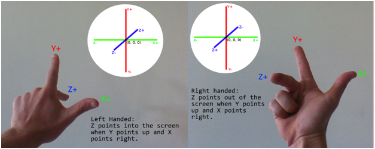
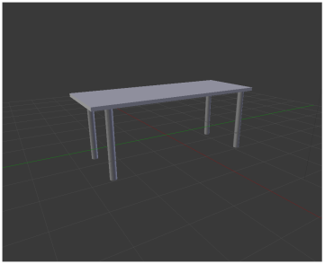
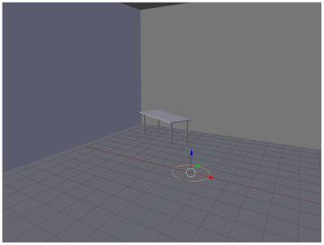
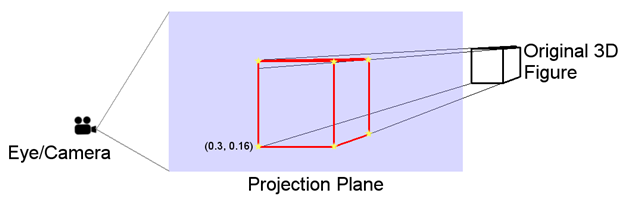
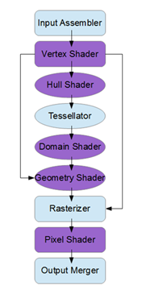
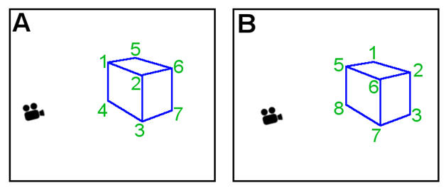

# 二、三维图形介绍

在我们深入研究 DirectX 之前，了解一下三维图形背后的一些术语和概念是很重要的。在本章中，我们将研究适用于所有图形应用编程接口的三维图形的一些基本概念。

三维图形是一种视错觉，或者说是创造视错觉技术的集合。彩色像素在二维屏幕上被照亮，这样屏幕上的图像就像透视的物体。较近的物体重叠并阻挡较远的物体，就像它们在现实世界中一样。

## 坐标系

坐标系是描述几何空间中的点的方法。我们将为我们的三维图形使用标准的笛卡尔坐标系。在二维图形中，使用两个坐标来指定点，X 和 Y 维度各一个。X 坐标通常指定点的水平位置，Y 坐标指定点的垂直位置。我们稍后会看到，在使用二维纹理时，使用能指 U 和 V 来描述二维纹理坐标也是很常见的。

在三维空间中，使用三个坐标(X、Y 和 Z)来指定点。任何两个坐标定义了一个垂直于其他两个坐标的平面。通过在三维场景中放置虚拟摄像机，可以任意选择每个轴相对于监视器的正方向和负方向。例如，Y 轴可以指向上方，X 轴可以指向右侧，Z 轴可以指向屏幕。如果旋转相机，Y 轴可以指向屏幕外，X 轴可以指向下方，Z 轴可以指向右侧。

当使用三维笛卡尔坐标系时，可以选择每个轴相对于彼此指向哪个方向。任意两个轴定义一个二维平面。例如，X 轴和 Y 轴定义一个平面，而 Z 轴和 X 轴定义另一个平面。如果你想象一台摄像机的方向是 X 轴和 Y 轴定义了一个平行于监视器的平面，Y 轴指向上，X 轴指向右，那么就可以选择 Z 轴指向哪个方向。它可以指向屏幕内外。记忆这两个坐标系常用的助记符是惯用手，即右手坐标和左手坐标。当你以与*图 2.1* 中描述的相同方式握住你的手时，手指指向轴的正方向。

图 2.1:左手和右手坐标

使用左手坐标系时，正 Z 轴指向屏幕，Y 轴指向上方，X 轴指向右侧。使用右手坐标系时，正 Z 轴指向屏幕之外，Y 轴指向上方，X 轴指向右侧。我们将在代码中使用右手坐标，但是 DirectX 可以使用其中任何一种。

知道轴的正方向仅部分由坐标的惯用手定义是非常重要的。轴的正方向可以指向相对于监视器的任何方向，因为虚拟摄像机或观看者能够上下颠倒、向后或任何方向旋转。

## 模型、世界和视图空间

模型通常使用三维建模应用程序作为单独的资产创建。我在这本书的例子中使用了 Blender 搅拌机可从[http://www.blender.org/](http://www.blender.org/)下载。模型可以从建模应用程序导出到文件中，并加载到我们的程序中。当模型在三维建模器中设计时，它们是用自己的本地原点设计的。例如，如果您设计了一个表格模型，它可能看起来像建模应用程序中的*图 2.2* 。

图 2.2:搅拌机建模器中的表格

*图 2.2* 是 Blender 工作区的裁剪屏幕截图。红线和绿线在对象的局部原点相交。在 Blender 中，红线是 X 轴，绿线是 Y 轴。Z 轴没有画出来，但它会指向上方，并与 X 轴和 Y 轴相交的同一点相交。它们相遇的点是 Blender 坐标中的位置(0，0，0)，它是模型坐标中的原点。当我们将对象导出到一个可以读入应用程序的文件中时，文件中的坐标将相对于本地原点进行指定。

*图 2.3* 显示的是同型号的另一张截图，不过现在已经放入了一个房间。

图 2.3:世界空间中的表格

一旦我们将模型文件加载到我们的应用程序中，我们就可以将对象放置在三维世界中的任何位置。它是使用自己的局部坐标建模的，但是当我们将它放入世界中时，我们是通过指定它相对于世界坐标原点的位置来实现的。世界坐标的原点可以在上图中看到。这实际上是 Blender 的另一个屏幕截图，通常轴是不可见的。桌子被放在一个简单的房间里，房间有地板、天花板和几面墙。表格坐标从其本地坐标到世界坐标的转换是在 DirectX 中使用矩阵乘法实现的。我们将表格的坐标乘以一个矩阵，该矩阵将表格定位在我们的三维世界空间中。我将这个矩阵称为模型矩阵，因为它用于定位单个模型。

一旦对象相对于世界原点定位，表示世界坐标空间的最后一步是在虚拟世界的某个点放置摄像机或眼睛。在三维图形中，摄像机被定位并给定一个面向的方向。摄像机看到虚拟世界中有一个非常特殊形状的区域。该形状称为平截头体。平截头体是几何形状的一部分，通常是位于切割该形状的两个平行平面之间的金字塔或圆锥。三维图形中的平截头体是一个正方形的底部金字塔形状，其顶点在摄像机处。金字塔在近、远剪裁平面处切割(*图 2.4* )。

图 2.4:平截头体

*图 2.4* 描绘了视平截头体。相机能够看到黄色阴影平截头体中的对象，但它看不到该区域之外的对象。比蓝色着色平面(称为近剪裁平面)更靠近相机的对象不会被渲染，因为它们离相机太近。同样，超出橙色着色平面(称为远剪裁平面)的对象也不会渲染，因为它们离相机太远。相机在三维世界中移动，任何落在视平截头体中的对象都会被渲染。落在视锥内的物体通过乘以另一个矩阵(通常称为投影矩阵)投影到二维屏幕上。

*图 2.5* 显示了将三维形状投影到二维平面上的图示。在 DirectX 中，投影的实际过程不过是少数矩阵乘法，但图示可能有助于将运算概念化。

图 2.5:三维投影

*图 2.5* 显示了二维平面上的三维投影。场景的观察者，被描绘成照相机，在图像的左侧。中间的蓝色阴影区域是投影平面。它是一个平面，这意味着它是二维的，平坦的。它代表观众可以看到的区域。在最右边，我们可以看到一个三维立方体。这是照相机正在看的物体。右边的立方体是真实的三维物体，投影到平面上的立方体是二维的。

### 颜色

显示器或屏幕上的每一个像素都有三个非常靠近的小灯。每个像素都有红、绿、蓝光，一个在另一个旁边。这三种光中的每一种都可以以不同的强度水平发光，我们的眼睛看到这三种强度的混合作为像素的颜色。人类认为颜色是三种原色的混合:红色、绿色和蓝色。

颜色在 Direct3D 中使用归一化的 RGB 或 RGBA 分量进行描述。每个像素都有一个红、绿、蓝变量，用于指定三原色的强度。这些分量是归一化的，因此它们的范围应该从 0.0f 到 1.0f(包括 0.0f 和 1.0f)。0.0f 表示特定成分的 0%，1.0f 表示 100%。

使用三个(RGB)或四个(RGBA)浮点值指定颜色，红色第一，绿色第二，蓝色第三。如果有阿尔法分量，它是最后一个。

要创建 100%红色、13%绿色和 25%蓝色的红色，我们可以使用(`1.0f, 0.13f, 0.25f`)。

如果存在，alpha 分量通常用于透明度。在本书中，我们不会使用 alpha 通道，它的值无关紧要，但我会将其设置为 100%或 1.0f。

## 图形管道

图形管道是一组步骤，这些步骤对对象进行某种表示，通常是三维坐标、颜色和纹理的集合，并将它们转换为像素以显示在屏幕上。每个图形应用编程接口都有自己的管道。例如，OpenGL 管道与 DirectX 图形管道非常不同。管道总是在更新，每一代新的 DirectX 应用编程接口都会增加新的功能。

在早期版本的 DirectX 中，管道是固定的，它是由应用编程接口的程序员设计的一组预先设计的阶段。程序员可以选择几个选项来改变图形处理器渲染最终图形的方式，但整个过程基本上是一成不变的。今天的图形管道非常灵活，它具有许多可直接编程的阶段。这意味着管道要复杂得多，但也更加灵活。*图 2.6* 是当前 DirectX 11 图形流水线各阶段的大致轮廓。

图 2.6: DirectX 11 图形管道

*图 2.6* 中的矩形框表示必要的阶段，椭圆表示可选的阶段。紫色阶段可以使用 HLSL 语言编程，蓝色框是固定的或不可编程的阶段。黑色箭头表示管道的执行流程。例如，域着色器通向几何着色器，顶点着色器有三个可能的后续阶段。顶点着色器之后可以是外壳着色器、几何着色器或像素着色器。

每个流水线阶段都被设计成允许一些特定的功能。在本书中，我们将集中讨论两个最重要的阶段:顶点着色器阶段和像素着色器阶段。以下是所有阶段的概述。

**输入汇编器:**

流水线的这个阶段从图形处理器的缓冲区读取数据，并将其传递给顶点着色器。它根据数据及其布局的描述为顶点着色器组装输入。

**顶点明暗器:**

这个阶段处理顶点。它可以导致外壳、几何或像素着色器，这取决于程序员需要做什么。我们将在后面的章节中详细研究这个阶段。顶点着色器是一个必需的阶段，它也可以使用 DirectX 中的 HLSL 语言完全编程。

**Hull 明暗器:**

这个阶段和接下来的两个阶段都用于镶嵌，它们是可选的。镶嵌可以用来从简单的形状近似复杂的形状。船体着色器为镶嵌器阶段创建几何面片或控制点。

**镶嵌师:**

镶嵌师从外壳着色器中获取几何面片，并将图元分成更小的部分。

**域着色器:**

域着色器从镶嵌器获取输出，并从中生成顶点。

**几何着色器:**

几何着色器是管道的可编程部分，用于处理整个图元。这些可以是三角形、点或线。如果不使用镶嵌，几何着色器阶段可以跟随顶点着色器。

**光栅化器:**

光栅化器从前面的阶段获取由顶点组成的输出，并决定哪些是可见的，哪些应该传递给像素着色器。任何不可见的像素都不需要由后续像素着色器阶段处理。一个不可见的像素可能在屏幕之外，或者位于不面对摄像机的物体的背面。

**像素着色器:**

像素着色器是流水线的另一个可编程部分。它对场景中的每个可见像素执行一次。这个阶段是必需的，我们将在后面的章节中更详细地研究像素着色器。

**输出合并:**

这个阶段从其他阶段获取输出，并创建最终图形。

## 渲染目标、交换链和后台缓冲区

图形处理器将像素数据写入内存中的阵列，然后发送到显示器进行显示。图形处理器写入像素的内存缓冲区称为渲染目标。通常有两个或多个缓冲区；一个正在屏幕上显示，而 GPU 将下一帧写入另一个看不见的帧。用户可以看到的缓冲区称为前缓冲区。图形处理器写入的渲染目标称为后台缓冲区。当图形处理器完成向后台缓冲区渲染帧时，缓冲区会交换。后缓冲区成为前缓冲区并显示在屏幕上，前缓冲区成为后缓冲区。图形处理器将下一帧渲染到新的后缓冲区，该缓冲区以前是前缓冲区。将数据反复写入后台缓冲区和交换缓冲区可以实现流畅的图形。这些缓冲器都是 RGB 像素数据的二维阵列。

缓冲区被称为交换链的对象依次渲染和交换多次。它被称为交换链，因为不需要只有两个缓冲区；可能有一个由许多缓冲区组成的链，每个缓冲区依次呈现并翻转到屏幕上。

## 深度缓冲区

当图形处理器渲染许多对象时，它必须渲染离观看者更近的对象，而不是后面的对象或被这些更近的对象遮挡的对象。看起来，如果有两个对象，一个在另一个前面，查看者将看到前面的对象，隐藏的对象不需要渲染。在图形编程中，顶点和像素都是使用着色器彼此独立渲染的。图形处理器不知道它何时渲染一个顶点，如果这个特定的顶点在场景中所有其他顶点的前面或后面。

我们使用 z 缓冲器来解决这个问题。z 缓冲区是一个二维数组，通常由浮点值组成。这些值指示从管道的光栅化器阶段中当前光栅化的每个像素到观看者的距离。当图形处理器渲染离观察者一定距离(Z)的对象的像素时，它首先检查当前像素的 Z 是否比它先前渲染的 Z 更近。如果像素已经被渲染，并且对象上次更接近，则不需要渲染新像素；否则像素应该被更新。

图 2.7:深度缓冲区和面

*图 2.7* 举例说明了一个框被栅格化或变成像素的两个例子。左边有一架照相机在看盒子。在这个例子中，我们将逐步光栅化盒子的两个面:离相机最近的面和离相机最远的面。实际上，一个盒子有六个面，这个过程应该很容易推断出剩余的面。

想象一下，在示例 A 中，栅格化的盒子的第一个面由标记为 1、2、3 和 4 的角来描述。这是离相机最近的脸。图形处理器将光栅化这个面上的所有点。当它将光栅化的像素写入像素缓冲区时，它将在深度缓冲区中记录每个点到相机的距离。

最终，离摄像机最远的那张脸也将被读取。这个面由角 5、6、7 和 8 描述。图中看不到角 8。图形处理器将再次查看构成面部的点，并确定每个点离摄像机有多远。它将查看深度缓冲区，并注意到这些点已经光栅化。它先前记录在深度缓冲器中的距离比来自远面的距离更靠近相机。来自远面的点不能被摄像机看到，因为它们被正面挡住了。光栅化正面时写入的像素不会被覆盖。

将此与*图 2.7* 右侧的例子 B 进行对比。假设首先光栅化的面是由角 1、2、3 和 4 描述的面。图中没有描绘拐角 4。这一次，首先光栅化的是远离相机的面。GPU 将确定从这个面上的每个点到摄像机的距离。它会将这些距离写入深度缓冲区，同时将光栅化的像素写入像素缓冲区。过一会儿，它会来到更近的面，由角 5、6、7 和 8 描述。GPU 将计算面部上每个点的距离，并将其与写入深度缓冲区的距离进行比较。它将注意到，当前的点，包括更近的面，比之前光栅化的点更靠近相机。因此，它将用新的像素覆盖先前光栅化的像素，并将更近的深度记录在深度缓冲器中。

以上描述是流水线光栅化阶段中深度缓冲器使用的简化版本。可以想象，用这种方式光栅化一个简单的盒子是很容易的，但是通常三维场景是由成千上万张脸组成的，而不是像前面的例子中那样由两张脸组成。广泛而持续的研究正在不断地寻找新的方法来改进这样的操作，并减少对深度和像素缓冲区的读写次数。在 DirectX 中，图表中离相机最远的面实际上会被 GPU 忽略，原因很简单，它们正背对着相机。它们是背面，将在称为背面剔除的过程中被剔除。

## 设备和设备上下文

设备和设备上下文都是机器中显卡或支持 Direct3D 的硬件的软件抽象。这两个类都有许多在 GPU 上创建和使用资源的重要方法。设备往往比设备上下文更低级。设备创建上下文和许多其他资源。设备上下文负责渲染场景，并创建和管理比设备更高级别的资源。