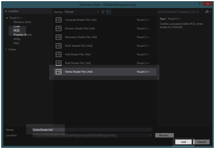
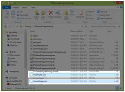

# 四、基本 Direct3D

## 使用 Direct3D 清除屏幕

我们将从清除屏幕到`CornflowerBlue`开始我们对 Direct3D 的探索。这个确切的功能目前由 Direct2D 在我们的框架中通过调用`SimpleTextRenderer::Render`方法中的`m_d2dContext->Clear`来完成。要用 Direct3D 代替 Direct2D，我们可以调用`m_d3dContext->ClearRenderTargetView`方法。该方法采用两个参数；第一个参数是指向`ID3D11RenderTargetView`的指针，第二个参数是由归一化 RGB 浮点值指定的颜色。下面的代码表中列出了`Render`方法代码的修改版本。

```cpp
    void SimpleTextRenderer::Render()
    {
    m_d3dContext->ClearRenderTargetView(m_d3dRenderTargetView.Get(),
    (float*) &XMFLOAT3(0.39f, 0.58f, 0.93f)); // Clear to cornflower blue

    m_d2dContext->BeginDraw();

    HRESULT hr = m_d2dContext->EndDraw();
    if (hr != D2DERR_RECREATE_TARGET)
    {
    DX::ThrowIfFailed(hr);
    }
    }

```

您可以将代码中的浮点值(在对 ClearRenderTargetView 的调用中)更改为您喜欢的任何颜色，但不建议您将其更改为黑色(`0.0f, 0.0f, 0.0f`)。总是选择一些容易识别的，颜色鲜艳的，无论所有像素是否被覆盖，在`Render`方法中总是首先清除屏幕。清晰到矢车菊蓝在调试时告诉程序员很多。例如，如果屏幕似乎在随机闪烁颜色，而不是显示浅蓝色，这意味着它没有正确显示缓冲区；要么没有显示正在写入的缓冲区，要么根本没有任何内容正在写入缓冲区，包括清除到矢车菊蓝色。如果程序运行并清除为浅蓝色，但似乎没有渲染任何其他对象，这可能意味着相机没有面对对象，或者对象根本没有渲染到渲染目标。如果您的对象出现在矢车菊蓝色的背景上，而另一个背景应该覆盖矢车菊蓝色，这意味着对象正在被渲染，但背景没有。

## 渲染三角形

根据前一章，我们现在将渲染一个三维三角形。本章将介绍缓冲区的使用。注意本章中介绍的 DirectX 编程流程是非常重要的。数据通常在主存储器中表示，然后根据该表示在图形处理器上创建。

微软决定在许多 DirectX 函数调用中使用数据结构而不是长参数列表。这个决定会导致代码冗长，但并不复杂。当我们为 GPU 创建许多其他资源时，也会出现相同的基本步骤。

### 基础模型类

我们将把我们的模型封装在一个名为`Model`的新类中。最初，这将是一个非常基础的课程。给你的项目添加两个文件， **Model.h** 和 **Model.cpp** 。Model.h 代码显示为下面的代码表，Model.cpp 文件的代码显示在第二个代码表中。

```cpp
    // Model.h
    #pragma once

    #include "pch.h"

    // Constant buffer which will hold the matrices
    struct ModelViewProjectionConstantBuffer
    {
    DirectX::XMFLOAT4X4 model;
    DirectX::XMFLOAT4X4 view;
    DirectX::XMFLOAT4X4 projection;
    };

    // Definition of our vertex types
    struct Vertex
    {
    DirectX::XMFLOAT3 position;
    DirectX::XMFLOAT3 color;
    };

    class Model
    {
    // GPU buffer which will hold the vertices
    Microsoft::WRL::ComPtr<ID3D11Buffer> m_vertexBuffer;

    // Record of the vertex count
    uint32 m_vertexCount;

    public:
    // Constructor creates the vertices for the model
    Model(ID3D11Device* device, Vertex* vertices, int vertexCount);

    // Getters
    ID3D11Buffer** GetAddressOfVertexBuffer() { return m_vertexBuffer.GetAddressOf(); }
    uint32 GetVertexCount() { return m_vertexCount; }
    };

```

在这个文件中，您将看到定义了两个结构:`ModelViewProjectionConstantBuffer`和`Vertex`结构。第一种结构保存矩阵来定位物体和相机，并将我们的三维场景投影到二维监视器上。第二个结构描述了我们将用来渲染模型的点的类型。在本章中，我们将使用位置坐标和颜色来渲染一个三角形，因此每个`vertex`结构由一个`position`和一个`color`元素组成。我们将在后面看到，这种结构必须准确地描述为它在这里出现的图形处理器。我们在这里描述的版本是存储在主内存中的版本。

```cpp
    // Model.cpp
    #include "pch.h"
    #include "Model.h"

    Model::Model(ID3D11Device* device, Vertex* vertices, int vertexCount)
    {
    // Save the vertex count
    this->m_vertexCount = vertexCount;

    // Create a subresource which points to the data to be copied
    D3D11_SUBRESOURCE_DATA vertexBufferData = {0};
    vertexBufferData.pSysMem = vertices;
    vertexBufferData.SysMemPitch = sizeof(Vertex);
    vertexBufferData.SysMemSlicePitch = 0;

    // Create a description of the buffer we're making on the GPU
    CD3D11_BUFFER_DESC vertexBufferDesc(sizeof(Vertex)*vertexCount, D3D11_BIND_VERTEX_BUFFER);

    // Copy the data from *vertices in system RAM to the GPU RAM:
    DX::ThrowIfFailed(device->CreateBuffer(&vertexBufferDesc, &vertexBufferData, &m_vertexBuffer));
    }

```

前面代码表中构造函数的主体说明了一种非常常见的模式。它为 GPU 描述了一个数据结构和一些数据数组，并且它可以在 GPU 上复制或创建数据。

在前面的代码表中，我们首先需要做的是创建一个`D3D11_SUBRESOURCE_DATA`结构。这用于指向必须复制到图形处理器的数据，或者指向本例中的`vertices`指针。大多数情况下，CPU 从磁盘加载数据或创建数据，就像我们将要做的那样。中央处理器使用系统内存，而图形处理器没有系统内存的访问权限，所以中央处理器加载或创建的数据必须复制到图形处理器内存。

`D3D11_SUBRESOURCE_DATA`结构需要指向正在复制的数据。它指向顶点，`sysMemPitch`是被复制的每个元素的大小。

正在创建的缓冲区的描述必须提供正在创建的缓冲区的类型和要从`D3D11_SUBRESOURCE_DATA`结构中指定的指针复制的数据的大小。

### 创建三角形

我们将在`SimpleTextRenderer::CreateDeviceResources`方法中创建一个模型三角形，因为顶点缓冲区是设备相关的资源。打开 **SimpleTextRenderer.h** 文件，添加一个引用，在顶部包含“Model.h”标题。请参见下面的代码表，其中附加参考以蓝色突出显示。

```cpp
    // SimpleTextRenderer.h
    #pragma once

    #include "DirectXBase.h"
    #include "Model.h"

```

向我们将要创建的模型添加一个新的成员变量，一个指针。我已经将其标记为私有，并在下面的代码表中的 SimpleTextRenderer 类的代码末尾声明了它。

```cpp
    // Method for updating time-dependent objects.
    void Update(float timeTotal, float timeDelta);

    private:
    Model *m_model;
    };

```

下一步是定义三角形的顶点。打开 **SimpleTextRenderer.cpp** 文件，用`CreateDeviceResources`方法定义一个三角形。这些更改在下面的代码表中突出显示。

```cpp
    void SimpleTextRenderer::CreateDeviceResources()
    {
    DirectXBase::CreateDeviceResources();

    // Define the vertices with the CPU in system RAM
    Vertex triangleVertices[] =
    {
    { XMFLOAT3(-1.0f, 0.0f, 0.0f), XMFLOAT3(1.0f, 0.0f, 0.0f) },
    { XMFLOAT3(0.0f, 1.0f, 0.0f), XMFLOAT3(0.0f, 1.0f, 0.0f) },
    { XMFLOAT3(1.0f, 0.0f, 0.0f), XMFLOAT3(0.0f, 0.0f, 1.0f) }
    };

    // Create the model instance from the vertices:
    m_model = new Model(m_d3dDevice.Get(), triangleVertices, 3 );
    }

```

在前面的代码表中，顶点是使用系统内存中的中央处理器创建的。请记住，`Model`类的构造函数将在 GPU 上创建该缓冲区的副本。临时的`triangleVertices`数组将在这个方法结束时脱离范围，但是顶点缓冲区将在 GPU 上保持不变。

此时，您应该能够运行您的应用程序。它看起来没有任何不同，但它正在图形处理器上创建一个彩虹色的三角形。

### 创建恒定缓冲区

我们需要在 GPU 上创建一个恒定的缓冲区来保存对象位置、相机位置和投影矩阵的变换矩阵。恒定缓冲区相对于图形处理器来说是恒定的。中央处理器能够通过更新缓冲区来改变这些值。

恒定缓冲区背后的思想是，CPU 需要频繁地向 GPU 传递信息。不是传递许多单独的小变量，而是将变量一起收集到一个结构中，并一次全部传递。

打开 **SimpleTextRenderer.h** 文件，添加两个新变量:`m_constantBufferCPU`和`m_constantBufferGPU`。这些更改在下面的代码表中突出显示。

```cpp
    private:
    Model *m_model;
    Microsoft::WRL::ComPtr<ID3D11Buffer> m_constantBufferGPU;
    ModelViewProjectionConstantBuffer m_constantBufferCPU;
    };

```

打开 **SimpleTextRenderer.cpp** 文件，用 CreateDeviceResources 方法在设备上创建`m_constantBufferGPU`。下面的代码表中突出显示了创建该缓冲区的代码。

```cpp
    // Create the model instance from the vertices:
    m_model = new Model(m_d3dDevice.Get(), triangleVertices, 3);

    // Create the constant buffer on the device
    CD3D11_BUFFER_DESC constantBufferDesc(sizeof(ModelViewProjectionConstantBuffer), D3D11_BIND_CONSTANT_BUFFER);
    DX::ThrowIfFailed(m_d3dDevice->CreateBuffer(&constantBufferDesc, nullptr, &m_constantBufferGPU));
    }

```

上表中的代码用于在图形处理器上为精确到`ModelViewProjectionConstantBuffer`结构大小的缓冲区预留空间。它设置`m_constantBufferGPU`指向这个空间。

接下来，我们需要设置恒定缓冲区的中央处理器版本的值，该版本存储在系统内存中。投影矩阵在我们的应用程序中不会改变，所以我们可以为这个矩阵设置一次中央处理器的值。投影矩阵的值取决于屏幕的大小和分辨率，因此最好在`SimpleTextRenderer::CreateWindowSizeDependentResources`方法中这样做。设置投影矩阵的代码在下面的代码表中突出显示。

```cpp
    void SimpleTextRenderer::CreateWindowSizeDependentResources()
    {
    DirectXBase::CreateWindowSizeDependentResources();

    // Store the projection matrix
    float aspectRatio = m_windowBounds.Width / m_windowBounds.Height;
    float fovAngleY = 70.0f * XM_PI / 180.0f;
    XMStoreFloat4x4(&m_constantBufferCPU.projection,
    XMMatrixTranspose(XMMatrixPerspectiveFovRH
    (fovAngleY,aspectRatio,0.01f,500.0f)));
    }

```

屏幕的长宽比是宽度除以高度。`fovAngleY`是我们的相机在 Y 轴上可以看到的角度。这里的计算意味着 70 度将是可见的；这是摄像机中心的左右 35 度。`0.01f`参数将摄像机前方的近剪裁平面设置为 0.01 个单位。作为`500.0f`传递的参数在摄像机前将远剪裁平面设置为 500 个单位。这意味着在 70 度视场(FOV)之外，距离摄像机小于 0.01f 或大于 500.0f 的任何东西都不会被渲染。还要注意，我们更新的是 CPU 版本的常量缓冲区(m_constantBufferCPU)，而不是 GPU 的版本。

接下来，我们可以定位我们的相机。在许多游戏中，相机可以移动，但我们的相机将是静态的。我们将在`SimpleTextRenderer::Update`方法中定位它。用于定位摄像机的代码在下面的代码表中突出显示。

```cpp
    void SimpleTextRenderer::Update(float timeTotal, float timeDelta)
    {
    (void) timeTotal; // Unused parameter.
    (void) timeDelta; // Unused parameter.

    // View matrix defines where the camera is and what direction it looks in
    XMStoreFloat4x4(&m_constantBufferCPU.view, XMMatrixTranspose(
    XMMatrixLookAtRH(
    XMVectorSet(0.0f, 0.0f, 2.0f, 0.0f),// Position
    XMVectorSet(0.0f, 0.0f, 0.0f, 0.0f),// Look at
    XMVectorSet(0.0f, 1.0f, 0.0f, 0.0f) // Up vector
    )));
    }

```

上面的代码为 CPU 的常量缓冲区设置了视图矩阵。我们将使用`XMMatrixLookAtRH`所以我们的坐标系将是右旋的。这些参数定义了摄像机的位置、它看向哪一点以及摄像机的向上矢量。图 4.1 说明了这三个向量的含义。


图 4.1: LookAtMatrix

*图 4.1* 描绘了一个摄像头在看一个立方体。两点用亮绿色突出显示，还有一个突出的绿色箭头。A 点对应摄像机的位置；它定义了摄像机在世界坐标中的位置。这是从前面的代码表中调用 XMMatrixLookAtRH 的三个向量中的第一个向量。

B 点定义了摄像机正朝向的点；它决定了相机面对的方向。这对应于前面代码表中对 XMMatrixLookAtRH 的调用中的第二个向量。此时，图中恰好有一个方框，但无论某个点上是否有物体，摄像机都可以朝这个点看。

点 C 对应向上向量；它是摄像机顶部指向的方向。请注意，在没有指定向上向量的情况下，相机可以自由地向左或向右滚动，并且仍然从相同的位置查看小框。向上向量是从前面的代码表调用 XMMatrixLookAtRH 的第三个也是最后一个向量。通过指定所有这三个向量，我们准确地定义了摄像机的位置、朝向和方向。请注意，向上向量是一个方向，而不是一个点，并且它是相对于相机的。

### 顶点和像素着色器

现在我们来看 DirectX API 最强大和灵活的部分:着色器。我们在图形处理器上有一个缓冲区，我们希望告诉图形处理器渲染它的内容。我们通过编写小程序来做到这一点。第一个是顶点着色器。顶点着色器的代码对顶点缓冲区中的每个顶点执行一次。像素着色器的代码对场景中的每个像素执行一次。

#### 顶点明暗器

在我们深入研究顶点着色器之前，我们应该花一些时间来了解顶点着色器的用途。在标题为*三维图形介绍*的章节中，在“模型、世界和视图空间”一节下，我们研究了将模型的坐标从其原始局部坐标转换为世界坐标。我们可以把模型放在场景中我们喜欢的任何地方。我们可以重用同一个模型，并在不同的位置放置多个副本。我们也可以改变物体的大小，把它们颠倒过来，等等。

下一步，一旦我们所有的模型都被放置到世界的某个地方，就是放置一个观察器:一个相机或眼睛，一些看场景的东西。当我们将查看器放入 DirectX 场景中时，我们实际上所做的是旋转和移动整个世界，这样我们就可以确定相机可见的对象并对其进行渲染。

顶点着色器负责上述变换。它将模型从局部坐标转换到视图空间。在放置模型和相机定向之后，顶点着色器通常会再次变换所有的点，以便场景的投影是正确的。它使用投影矩阵来实现。顶点着色器完成放置所有模型后，将应用查看器和投影，并将生成的顶点发送到下一个着色器。在我们的例子中，下一个阶段是像素着色器，尽管光栅化管道阶段将在幕后被隐式调用，以将顶点着色器的向量转换为像素着色器的像素。

了解顶点着色器如何工作的最好方法是创建一个顶点着色器。要向项目中添加新的顶点着色器，请在解决方案资源管理器中右键单击项目名称，并从上下文菜单中选择**添加新项目**(参见*图 4.2* )。


图 4.2:添加新项目



图 4.3:添加顶点着色器

从侧面板选择 HLSL 和**顶点着色器文件(。hlsl)** 从中间面板(见*图 4.3* )。我把文件名留为 **VertexShader.hlsl** 。完成后，点击**添加**。Visual Studio 将为我们编写一个小的顶点着色器示例，并将其添加到我们的项目中。用下面代码表中的代码替换该代码。

```cpp
    // VertexShader.hlsl

    // The GPU version of the constant buffer
    cbuffer ModelViewProjectionConstantBuffer : register(b0)
    {
    matrix model;
    matrix view;
    matrix projection;
    };

    // The input vertices
    struct VertexShaderInput
    {
    float3 position : POSITION;
    float3 color : COLOR0;
    };

    // The output vertices as the pixel shader will get them
    struct VertexShaderOutput
    {
    float4 position : SV_POSITION;
    float3 color : COLOR0;
    };

    // This is the main entry point to the shader:
    VertexShaderOutput main(VertexShaderInput input)
    {
    VertexShaderOutput output;
    float4 pos = float4(input.position, 1.0f);

    // Use constant buffer matrices to position the vertices:
    pos = mul(pos, model); // Position the model in the world
    pos = mul(pos, view); // Position the world with respect to a camera
    pos = mul(pos, projection);// Project the vertices
    output.position = pos;

    // Pass the color of the vertices to the pixel shader
    output.color = input.color;

    return output;
    }

```

这个文件是用 HLSL 语写的。这种语言与 C++非常相似。稍后我们将更详细地研究这种语言。简而言之，您将看到在文件顶部定义了一个常量缓冲区(`cbuffer`)。这是我们之前创建的常量缓冲区的着色器版本。`m_constantBufferGPU`指向这个缓冲区。

定义了两种结构:`VertexShaderInput`和`VertexShaderOutput`。顶点着色器的输入是顶点缓冲区。我们已经创建并复制了我们的三角形到图形处理器作为顶点缓冲。需要特别注意的是，这个结构(`VertexShaderInput`)与我们在`Model`类中定义的`Vertex`结构完全相同。中央处理器和图形处理器之间相同数据类型的协调可能会非常混乱。CPU 的`XMFLOAT3`和 GPU 的`FLOAT3`完全一样。

第二个结构是顶点着色器的输出；这将传递给我们将要编写的像素着色器。这个着色器的真正魔力在于对`mul`内在的三次调用。这是标准矩阵乘法的本质。该方法将顶点的位置相乘，首先乘以`model`矩阵，然后乘以`view`矩阵。最后，将它们乘以`projection`矩阵，这将产生在视平截头体中可见的三维顶点的最终位置。定位顶点后，将每个顶点的颜色复制到输出中。无论顶点着色器返回什么，都将被赋予像素着色器。请注意，像素着色器的位置元素有一个浮点数 4，而不是浮点数 3。

像素着色器

像素着色器对管道的光栅化器阶段传递给它的每个像素执行一次代码。这些像素完全依赖于顶点着色器，因为是顶点着色器决定了模型的位置和相机的位置。顶点着色器还使用投影矩阵来指定视角有多宽、摄像机可以看到多近和多远等。可见像素将由光栅化器阶段确定，并传递给像素着色器。管道的光栅化阶段被传递来自顶点着色器的输出。它确定哪些像素将在用户屏幕上可见，并为每个可见像素调用像素着色器。光栅化器将顶点着色器的输出传递给像素着色器。像素着色器可以用不同的色调对像素进行着色；他们也可以对像素应用纹理和灯光效果。

要添加像素着色器，请遵循与*图 4.2* 和*图 4.3* 相同的步骤，只选择一个**像素着色器文件(。hlsl)** 从窗口而不是顶点着色器。我再次将文件的名称保留为默认名称，因此我的名称将被称为 PixelShader.hlsl。再次，Visual Studio 将创建新的着色器并编写一些示例 hlsl 代码。用下面的代码表替换代码。

```cpp
    // PixelShader.hlsl

    // Input is exactly the same as
    // vertex shader output!
    struct PixelShaderInput
    {
    float4 position : SV_POSITION;
    float3 color : COLOR0;
    };

    // Main entry point to the shader
    float4 main(PixelShaderInput input) : SV_TARGET
    {
    // Return the color unchanged
    return float4(input.color,1.0f);
    }

```

像素着色器非常简单；它从输入类型的结构定义开始。这必须与顶点输出完全匹配，因为它们是一回事。顶点着色器的输出是像素着色器的输入。

像素着色器的主体除了传递像素的颜色之外，几乎什么也不做。它还向 RGB 添加了第四个分量，即 Alpha 通道(`1.0f`)。

此时，您应该能够运行您的应用程序。看起来不会有什么不同，但是如果你导航到输出目录，你会看到两个新文件已经编译好了:VertexShader.cso 和 PixelShader.cso(见*图 4.4* )。



图 4.4:客户服务组织文件

这些文件是我们的着色器的中间版本。Visual Studio 已经使用 FXC.exe 编译器将我们的 HLSL 源代码文件编译为二进制格式。代表编译的着色器对象文件。从这里，我们需要我们的显卡驱动程序将 CSO 文件编译成计算机内部特定硬件能够理解的二进制格式。这很好，因为所有的图形处理器都理解不同的机器代码，但是我们可以用 HLSL 语言创建着色器，显卡驱动程序将它们编译成特定的机器代码。这样，它们将在 AMD 显卡以及 NVidia 或集成显卡上运行。

#### 添加着色器类

渲染三角形的下一步是从 CSO 文件中编译着色器。我们需要一个读取文件的方法；这可以放在任何地方，但我选择将其放在 DirectXHelper.h 文件中。下面的代码表突出显示了对 DirectXHelper.h 文件的更改。

```cpp
    // DirectXHelper.h
    #pragma once

    using namespace Microsoft::WRL;
    using namespace Windows::ApplicationModel;
    using namespace Windows::Graphics::Display;

    namespace DX
    {
    inline void ThrowIfFailed(HRESULT hr)
    {
    if (FAILED(hr))
    {
    // Set a breakpoint on this line to catch Win32 API errors.
    throw Platform::Exception::CreateException(hr);
    }
    }

    // Reads bytes from the specified file in the current folder
    inline Platform::Array<byte>^ ReadData(_In_ Platform::String^ filename)
    {
    CREATEFILE2_EXTENDED_PARAMETERS extendedParams = {0};
    extendedParams.dwSize = sizeof(CREATEFILE2_EXTENDED_PARAMETERS);
    extendedParams.dwFileAttributes = FILE_ATTRIBUTE_NORMAL;
    extendedParams.dwFileFlags = FILE_FLAG_SEQUENTIAL_SCAN;
    extendedParams.dwSecurityQosFlags = SECURITY_ANONYMOUS;
    extendedParams.lpSecurityAttributes = nullptr;
    extendedParams.hTemplateFile = nullptr;

    Platform::String ^path = Platform::String::Concat(Package::Current->InstalledLocation->Path, "\\");

    Wrappers::FileHandle file(CreateFile2(Platform::String::Concat(path, filename)->Data(),
    GENERIC_READ, FILE_SHARE_READ, OPEN_EXISTING, &extendedParams));

    if (file.Get() == INVALID_HANDLE_VALUE)
    throw ref new Platform::FailureException();

    FILE_STANDARD_INFO fileInfo = {0};
    if (!GetFileInformationByHandleEx(file.Get(), FileStandardInfo, &fileInfo, sizeof(fileInfo)))
    throw ref new Platform::FailureException();

    if (fileInfo.EndOfFile.HighPart != 0)
    throw ref new Platform::OutOfMemoryException();

    Platform::Array<byte>^ fileData = ref new Platform::Array<byte>(fileInfo.EndOfFile.LowPart);

    if (!ReadFile(file.Get(), fileData->Data, fileData->Length, nullptr, nullptr))
    throw ref new Platform::FailureException();

    return fileData;
    }
    }

```

以前使用的方法从指定为参数的文件中读取二进制数据并返回。文件必须位于应用程序的目录中，并且该方法不接受完整的文件路径。这段代码会引起一个微妙的问题。目前，在 pch.h 文件中，我们可能引用了 wrl/client.h 头。我们需要引用 wrl.h 头，因为这个头定义了一些在`ReadData`方法中使用的结构，比如`file`和`Wrappers`名称空间。按照以下代码表更改 pch.h 文件中的标题。

```cpp
    // pch.h
    #pragma once

    // #include <wrl/client.h>
    #include <wrl.h>
    #include <d3d11_1.h>
    #include <d2d1_1.h>
    #include <d2d1effects.h>
    #include <dwrite_1.h>
    #include <wincodec.h>
    #include <agile.h>
    #include <DirectXMath.h>
    #include "App.xaml.h"

```

接下来，我们可以添加两个类:一个用于包装顶点着色器，另一个用于包装像素着色器。首先我们将添加名为`VertexShader`的类。向项目中添加两个新文件， **VertexShader.h** 和 **VertexShader.cpp** 。这些文件的代码在以下两个代码表中指定。

```cpp
    // VertexShader.h
    #pragma once

    #include "DirectXHelper.h"

    class VertexShader {
    private:
    ID3D11VertexShader*m_vertexShader;
    Microsoft::WRL::ComPtr<ID3D11InputLayout> m_inputLayout;

    public:
    // Loads a compiled vertex shader from a CSO file
    void LoadFromFile(ID3D11Device *device,
    _In_ Platform::String^ filename);

    // Returns pointer to vertex shader
    ID3D11VertexShader* GetVertexShader() { return m_vertexShader; }

    // Returns pointer to input layout
    ID3D11InputLayout* GetInputLayout() { return m_inputLayout.Get(); }
    };

```

```cpp
    // VertexShader.cpp
    #include "pch.h"
    #include "VertexShader.h"

    void VertexShader::LoadFromFile(ID3D11Device *device,
    _In_ Platform::String^ filename)
    {
    // Read the file
    Platform::Array<unsigned char, 1U>^ fileDataVS = DX::ReadData(filename);

    // Crreate the vertex shader from the file's data
    DX::ThrowIfFailed(device->CreateVertexShader(fileDataVS->Data,
    fileDataVS->Length, nullptr, &m_vertexShader));

    // Describe the layout of the data
    const D3D11_INPUT_ELEMENT_DESC vertexDesc[] =
    {
    { "POSITION", 0, DXGI_FORMAT_R32G32B32_FLOAT, 0, 0,
    D3D11_INPUT_PER_VERTEX_DATA, 0 },
    { "COLOR", 0, DXGI_FORMAT_R32G32B32_FLOAT, 0, 12,
    D3D11_INPUT_PER_VERTEX_DATA, 0 },
    };

    DX::ThrowIfFailed(device->CreateInputLayout
    (vertexDesc,ARRAYSIZE(vertexDesc), fileDataVS->Data,
    fileDataVS->Length, &m_inputLayout));
    }

```

上面的代码读取一个 CSO 文件，并从中创建一个名为`m_vertexShader`的顶点着色器。`D3D_INPUT_ELEMENT_DESCRIPTION`用于指定该着色器将接受的顶点的精确布局。每个元素都用下面的描述。

*   LPCSTR 语义 name；
*   UINT 语义索引：
*   DXGI_FORMAT 格式：
*   UINT InputSlot;
*   UINT 对齐字节偏移：
*   d3d 11 _ input _ class input _ class 分类：
*   uint instancedatasteprate：

**语义名称**:这是一个字符串，表示元素的预期用途。这应该与 VertexShader.hlsl 文件中的`VertexShaderInput`结构相匹配。

**语义索引**:当语义名称相同的元素不止一个时使用；我们只有一个`POSITION`和`COLOR`，所以不使用这个指标。

**格式**:这必须是每个元素数据的确切格式。我们使用`XMFLOAT3`来创建顶点缓冲区，因此颜色和位置元素的格式都是`DXGI_FORMAT_R32G32B32_FLOAT`。有关所有可能格式的完整列表，右键单击该常量，并从上下文菜单中选择**转到定义**。同样，这需要与我们在 Model.h 文件中定义的 CPU 上的`Vertex`结构以及在 VertexShader.hlsl 文件中定义的`VertexShaderInput`结构相匹配。

**对齐** **字节** **偏移**:这是元素落在结构内的偏移。`POSITION`元素在我们的结构中是第一个，所以它的偏移量是 0。`COLOR`元素在位置元素之后，位置元素是 3 个浮点或 12 字节宽。`COLOR`元素在结构中的偏移量是 12。为方便起见，您可以使用`D3D11_APPEND_ALIGNED_ELEMENT`获取该值，数据将自动打包。要知道`D3D11_APPEND_ALIGNED_ELEMENT`不可能知道所有数据的正确打包方式，它依赖于使用标准对齐打包的中央处理器。

**输入槽类**:这是数据的类。每个顶点都有一个位置和颜色，所以我们在这里使用`D3D11_INPUT_PER_VERTEX_DATA`。

当有多个汇编程序或进行实例化时，使用`InputSlot`和`InstanceDataStep`；这些暂时可以忽略。

接下来，我们将添加一个类来包装我们的像素着色器。添加两个文件， **PixelShader.h** 和 **PixelShader.cpp** 。这些文件的代码在以下两个代码表中指定。

```cpp
    // PixelShader.h
    #pragma once

    #include "DirectXHelper.h"

    class PixelShader
    {
    private:
    ID3D11PixelShader* m_pixelShader;

    public:
    // Loads a compiled pixel shader from a CSO file
    void LoadFromFile(ID3D11Device *device,
    _In_ Platform::String^ filename);

    // Returns pointer to pixel shader
    ID3D11PixelShader* GetPixelShader() { return m_pixelShader; }
    };

```

```cpp
    // PixelShader.cpp
    #include "pch.h"
    #include "PixelShader.h"

    void PixelShader::LoadFromFile(ID3D11Device *device,
    _In_ Platform::String^ filename)
    {
    // Read the file
    Platform::Array<unsigned char,
    1U>^ fileDataPS = DX::ReadData(filename);

    // Create a pixel shader from the data in the file:
    DX::ThrowIfFailed(device->CreatePixelShader(fileDataPS->Data,
    fileDataPS->Length, nullptr, &m_pixelShader));
    }

```

`PixelShader`类比`VertexShader`类简单一点，因为我们不需要描述数据的布局。它只是读取文件并从中创建一个着色器。

接下来，我们需要向 SimpleTextRenderer.h 文件添加对着色器头(PixelShader.h 和 VertexShader.h)的引用。这些更改在下面的代码表中突出显示。

```cpp
    // SimpleTextRenderer.h
    #pragma once

    #include "DirectXBase.h"
    #include "Model.h"
    #include "VertexShader.h"
    #include "PixelShader.h"

```

向这个类添加两个新的成员变量来保存我们的着色器。我称它们为`m_vertexShader`和`m_pixelShader,`，并将其添加到类声明的末尾。

```cpp
    private:
    Model *m_model;
    Microsoft::WRL::ComPtr<ID3D11Buffer> m_constantBufferGPU;
    ModelViewProjectionConstantBuffer m_constantBufferCPU;

    // Shaders
    VertexShader m_vertexShader;
    PixelShader m_pixelShader;
    };

```

现在我们已经声明了我们的着色器，我们需要让它们加载适当的文件。着色器是一个依赖于设备的资源，所以这应该在简单文本渲染器. cpp 文件中的`SimpleTextRenderer`类的`CreateDeviceResources`方法中完成。我已经在创建常量缓冲区之后放置了这个，并在下面的代码表中突出显示了更改。

```cpp
    // Create the constant buffer on the device
    CD3D11_BUFFER_DESC constantBufferDesc(sizeof
    (ModelViewProjectionConstantBuffer), D3D11_BIND_CONSTANT_BUFFER);
    DX::ThrowIfFailed(m_d3dDevice->CreateBuffer(&constantBufferDesc,
    nullptr, &m_constantBufferGPU));

    // Load the shaders from files (note the CSO extension, not hlsl!):
    m_vertexShader.LoadFromFile(m_d3dDevice.Get(), "VertexShader.cso");
    m_pixelShader.LoadFromFile(m_d3dDevice.Get(), "PixelShader.cso");
    }

```

我们应该通过设置`m_constantBufferCPU.model`矩阵来定位我们在世界空间中的三角形。我会把三角形放在原点(`0.0f, 0.0f, 0.0f`)。三角形的位置可以在`SimpleTextRenderer::Update`方法中设置。下面的代码表突出显示了定位模型的代码。

```cpp
    XMVectorSet(0.0f, 0.0f, 0.0f, 0.0f),// Look at
    XMVectorSet(0.0f, 1.0f, 0.0f, 0.0f) // Up vector
    )));

    // Position the triangle model
    XMStoreFloat4x4(&m_constantBufferCPU.model,
    XMMatrixTranspose(
    XMMatrixTranslation(0.0f, 0.0f, 0.0f)));
    }

```

### 渲染模型

最后，我们现在可以使用着色器渲染三角形了。渲染有几个步骤，但大多数都是每次调用`Render`调用一次。渲染步骤如下:

*   清除深度模板缓冲区:我们已经开始新一轮渲染，深度模板中的深度数据必须重置。对于当前一轮渲染，图形处理器还没有检查任何像素，目前没有任何像素在任何其他像素的前面或后面。
*   设置渲染目标:GPU 需要知道渲染目标；这是它的渲染目标。在我们当前的示例中，我们正在渲染一个目标，该目标将很快翻转到屏幕上并显示给用户。
*   重置当前渲染顶点的索引:图形处理器将保持上一轮渲染中渲染的最后一个顶点的索引。我们希望它从顶点编号 0 开始再次渲染我们的模型。
*   设置资源以指向我们的三角形和着色器:我们需要设置所有资源(输入布局、子顶点、当前顶点和像素着色器、常量缓冲区)以指向我们的三角形、伴随缓冲区和着色器。

将所有这些更改添加到`SimpleTextRenderer`类后，最终的`Render`方法如下代码表所示。

```cpp
    void SimpleTextRenderer::Render() {
    m_d3dContext->ClearRenderTargetView(m_d3dRenderTargetView.Get(),
    (float*) &XMFLOAT3(0.39f, 0.58f, 0.93f)); // Clear to cornflower blue

    // Clear the depth stencil
    m_d3dContext->ClearDepthStencilView(m_d3dDepthStencilView.Get(), D3D11_CLEAR_DEPTH, 1.0f, 0);

    // Set the render target
    m_d3dContext->OMSetRenderTargets(1, m_d3dRenderTargetView.GetAddressOf(), m_d3dDepthStencilView.Get());

    // Set to render triangles
    UINT stride = sizeof(Vertex); // Reset to the frist vertices in the buffer
    UINT offset = 0;
    m_d3dContext->IASetPrimitiveTopology(D3D11_PRIMITIVE_TOPOLOGY_TRIANGLELIST);

    // Set the input layout
    m_d3dContext->IASetInputLayout(m_vertexShader.GetInputLayout());

    // Set the vertex shader
    m_d3dContext->VSSetShader(m_vertexShader.GetVertexShader(), nullptr, 0);

    // Set the vertex shader's constant buffer
    m_d3dContext->VSSetConstantBuffers(0, 1, m_constantBufferGPU.GetAddressOf());

    // Set the pixel shader
    m_d3dContext->PSSetShader(m_pixelShader.GetPixelShader(), nullptr, 0);

    // Load the data from the CPU into the GPU's constant buffer
    m_d3dContext->UpdateSubresource(m_constantBufferGPU.Get(), 0, NULL, &m_constantBufferCPU, 0, 0);

    // Set the vertex buffer
    m_d3dContext->IASetVertexBuffers(0, 1, m_model->GetAddressOfVertexBuffer(), &stride, &offset);

    // Render the vertices
    m_d3dContext->Draw(m_model->GetVertexCount(), 0);

    m_d2dContext->BeginDraw();

    HRESULT hr = m_d2dContext->EndDraw();
    if (hr != D2DERR_RECREATE_TARGET) {
    DX::ThrowIfFailed(hr);
    }
    }

```

此时，您应该能够编译和运行应用程序，并在屏幕的上半部分看到一个相当吸引人的彩色三角形。