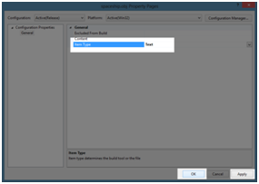

# 第 5 章加载模型

如果模型非常简单，比如上一章的三角形，手工编码模型并不难。使用这种技术创建复杂的模型是不切实际的。使用三维建模应用程序创建模型要好得多。本书中的示例是使用 Blender 2.66 创建的，Blender 2.66 是一个开源的三维建模应用程序，可从 http://www.blender.org/.模型公司获得，可以使用 Blender 或许多其他三维建模器创建，并导出为各种三维文件格式。然后这些文件可以被加载到我们的应用程序中。这允许更复杂的模型，因为可视化创建模型远比处理顶点本身简单。

## 对象模型文件格式

有许多三维文件格式，每种格式都有其优缺点。在本章中，我们将研究一种简单但灵活的格式，这种格式相当通用和标准化。它被称为目标文件格式，最初由波前技术公司开发。目标文件扩展名为“obj”。我们将编写一个类来解析目标文件，并根据其中的顶点信息创建网格。

|  | 注意:网格是形成三维模型的三角形的集合。网格和模型在当前上下文中是可互换的术语。在 DirectX 的过去版本中有一个网格接口，但是 DirectX 11 不包含这个接口，所以网格必须手动加载和操作。这是一点额外的工作，但它更灵活。 |

目标文件格式有几个优点。它是纯文本，易于阅读和解析。这些文件是人类可读和可写的；它们不是二进制的。人类可读的纯文本需要更多的存储空间，并且通常比二进制格式更慢。例如，值 3.14159f 在纯文本中取 8 个字节，但在二进制中作为 32 位浮点只有 4 个字节。对于我们将要处理的小模型来说，数据的大小可以忽略不计，CPU 将文本解析为变量所需的时间也是如此。对于模型更复杂或有很多模型的大型项目，您可以考虑使用二进制文件格式或编写自己的格式。

我们将使用的文件格式也是整个目标文件规范的简化版本。我们将编写一个只加载专门为其设计的目标文件的类。可以编写对象文件解析器来忽略文件中的任何未知语法。我们可以编写一个包含纹理坐标和法线信息以及顶点位置的对象文件，我们的程序可以忽略任何它不需要的规范，直到我们检查纹理和光照。

该格式的另一个缺点是顶点缓冲区没有以有效的方式进行索引。在上一本书中，我们研究了在 GPU 上使用索引缓冲区多次引用顶点，这为我们节省了一些 GPU 内存。我们将检查的方法不推荐用于复杂的几何图形，因为如果不使用索引拓扑，图形处理器必须存储比实际需要多很多倍的顶点。例如，我们只需要 8 个顶点就可以在图形处理器上存储一个立方体。我们可以使用索引缓冲区高效地索引顶点。然而，我们将要加载的对象文件将一个立方体存储为 12 个顶点:每个三角形 3 个顶点，每个面 2 个三角形，以及 6 个面。

|  | 注意:当您对这种简单的基于文本的 OBJ 格式感到满意时，您可以开发自己的格式，专门用于以最适合独特环境的方式存储模型。我们正在研究 OBJ 文件格式，作为阅读基本模型的一个例子。您可以轻松地编写自己的自定义三维文件格式，它可以按照您的需要准确地存储信息，并且比 OBJ 格式更小，解析速度更快。 |

### 向项目添加模型

目标文件是用一种小的脚本语言存储的，语法非常简单。它是一个纯文本文件，包含顶点位置和其他信息的列表或数组。数组的每个元素都在自己的行中指定。有顶点位置、纹理坐标、顶点法线和面的数组。这里的面是一个平面。面由引用每个数组(顶点位置、纹理坐标或法线数组)中的值的索引集合定义。面定义可以引用每个数组中的任何值，具有很大的灵活性。还有许多其他的关键字可以用在目标文件中。以下只是对我们将在程序中使用的程序的简要描述。


图 5.1:搅拌机里的宇宙飞船

*图 5.1* 是我们将加载的飞船模型在 Blender 中出现时的截图。你可以看到一个光源和一个相机以及模型。光源和相机不会导出到对象文件，只有飞船本身。

以下代码是 Blender 2.66 导出的*图 5.1* 中飞船的目标文件。宇宙飞船模型非常简单，但即使是这种简单的模式也会创建一个相当长的对象文件。下面的代码表显示了宇宙飞船的代码。

```cpp
    # Blender v2.66 (sub 0) OBJ File: 'spaceship.blend'
    # www.blender.org
    v 0.245036 -0.277313 -3.008238
    v 1.000000 -0.277313 0.638722
    v -1.000000 -0.277313 0.638721
    v -0.245036 -0.277313 -3.008238
    v 0.332394 0.200748 -0.653899
    v 0.999999 0.200748 0.638722
    v -1.000000 0.200748 0.638721
    v -0.332394 0.200748 -0.653899
    v 0.924301 -0.171645 0.476444
    v 0.294592 -0.171645 -1.523556
    v 2.173671 -0.171645 0.066711
    v 2.173671 -0.171645 0.476444
    v 0.924301 -0.071908 0.476444
    v 0.294592 -0.071908 -1.523556
    v 2.173671 -0.071908 0.066711
    v 2.173671 -0.071908 0.476444
    v -0.921304 -0.073625 0.467630
    v -0.288946 -0.073625 -1.532370
    v -2.170674 -0.073627 0.057897
    v -2.170674 -0.073627 0.467630
    v -0.921304 -0.173363 0.467630
    v -0.288946 -0.173363 -1.532370
    v -2.170674 -0.173364 0.057897
    v -2.170674 -0.173364 0.467630
    vt 0.585247 0.203295
    vt 0.000325 0.320701
    vt 0.000323 0.000323
    vt 0.800338 0.208366
    vt 0.693343 0.208366
    vt 0.585894 0.000324
    vt 0.606542 0.475453
    vt 0.219632 0.475452
    vt 0.027282 0.321348
    vt 0.929796 0.869160
    vt 0.929795 0.946102
    vt 0.607903 0.869160
    vt 0.007848 0.968632
    vt 0.000323 0.892059
    vt 0.607257 0.968632
    vt 0.585894 0.213707
    vt 0.972548 0.227766
    vt 0.972548 0.306642
    vt 0.607189 0.747112
    vt 0.810796 0.747112
    vt 0.608702 0.773718
    vt 0.577718 0.698455
    vt 0.577718 0.477807
    vt 0.606542 0.476099
    vt 0.465133 0.534562
    vt 0.399188 0.534562
    vt 0.399188 0.518510
    vt 0.557042 0.517863
    vt 0.400036 0.517863
    vt 0.399188 0.497305
    vt 0.819439 0.606656
    vt 0.999676 0.321348
    vt 0.999677 0.717546
    vt 0.626993 0.719207
    vt 0.607189 0.656306
    vt 0.818792 0.658818
    vt 0.607189 0.719854
    vt 0.810834 0.719854
    vt 0.812349 0.746465
    vt 0.830351 0.868513
    vt 0.609613 0.868513
    vt 0.828641 0.839677
    vt 0.531725 0.534562
    vt 0.465780 0.534562
    vt 0.531725 0.518510
    vt 0.399188 0.476099
    vt 0.556194 0.476099
    vt 0.557042 0.496658
    vt 0.153905 0.688352
    vt 0.439413 0.868513
    vt 0.000323 0.818146
    vt 0.000323 0.495980
    vt 0.063200 0.476099
    vt 0.060943 0.687706
    vt 0.584527 0.121258
    vt 0.907786 0.000323
    vt 0.000323 0.393413
    vt 0.607903 0.946102
    vt 0.233352 0.869160
    vt 0.585894 0.320701
    vt 0.812309 0.773718
    vt 0.606542 0.696746
    vt 0.465133 0.518510
    vt 0.556194 0.497305
    vt 0.949339 0.760147
    vt 0.818792 0.321348
    vt 0.608703 0.746465
    vt 0.607903 0.839677
    vt 0.465780 0.518510
    vt 0.400036 0.496658
    vt 0.042889 0.868513
    vt 0.398542 0.687706
    vn 0.000000 -1.000000 -0.000000
    vn -0.000000 1.000000 0.000000
    vn 0.757444 0.633792 -0.156800
    vn -0.000000 -0.000001 1.000000
    vn -0.979238 -0.000001 -0.202714
    vn 0.000000 0.980001 -0.198995
    vn -0.953839 0.000000 0.300320
    vn 0.646008 0.000000 -0.763331
    vn 1.000000 -0.000000 0.000000
    vn 0.000000 0.000000 1.000000
    vn 0.953476 0.000000 0.301469
    vn -0.645477 0.000000 -0.763779
    vn -1.000000 -0.000000 -0.000000
    vn -0.000001 1.000000 -0.000000
    vn 0.000001 -1.000000 0.000000
    vn 0.888496 0.000002 -0.458885
    vn -0.382358 0.902665 -0.197479
    s off
    f 1/1/1 2/2/1 3/3/1
    f 5/4/2 8/5/2 7/6/2
    f 1/7/3 5/8/3 2/9/3
    f 2/10/4 6/11/4 3/12/4
    f 3/13/5 7/14/5 4/15/5
    f 5/16/6 1/17/6 4/18/6
    f 13/19/7 14/20/7 9/21/7
    f 14/22/8 15/23/8 11/24/8
    f 15/25/9 16/26/9 12/27/9
    f 16/28/10 13/29/10 9/30/10
    f 9/31/1 10/32/1 11/33/1
    f 16/34/2 15/35/2 13/36/2
    f 21/37/11 22/38/11 18/39/11
    f 22/40/12 23/41/12 18/42/12
    f 23/43/13 24/44/13 19/45/13
    f 24/46/10 21/47/10 17/48/10
    f 17/49/14 18/50/14 20/51/14
    f 24/52/15 23/53/15 21/54/15
    f 4/55/1 1/1/1 3/3/1
    f 6/56/2 5/4/2 7/6/2
    f 5/8/16 6/57/16 2/9/16
    f 6/11/10 7/58/10 3/12/10
    f 7/14/17 8/59/17 4/15/17
    f 8/60/6 5/16/6 4/18/6
    f 14/20/7 10/61/7 9/21/7
    f 10/62/8 14/22/8 11/24/8
    f 11/63/9 15/25/9 12/27/9
    f 12/64/10 16/28/10 9/30/10
    f 12/65/1 9/31/1 11/33/1
    f 15/35/2 14/66/2 13/36/2
    f 17/67/11 21/37/11 18/39/11
    f 23/41/12 19/68/12 18/42/12
    f 24/44/13 20/69/13 19/45/13
    f 20/70/10 24/46/10 17/48/10
    f 18/50/14 19/71/14 20/51/14
    f 23/53/15 22/72/15 21/54/15

```

有几种方法可以将此代码添加到项目中。您可以向解决方案中添加一个文本文件并复制上面的代码，但是通常模型是作为对外部文件的引用添加的。复制上面的代码，保存到名为**宇宙飞船. obj** 的文本文件中。在解决方案资源管理器中右键单击项目名称，并选择**添加现有项目**。找到宇宙飞船. obj 文件并将其添加到项目中。

由于 obj 扩展名，Visual Studio 将假设该文件是一个常规的可重定位的机器代码对象文件。这样不行，我们的文件是模型，不是二进制代码文件。右键单击解决方案资源管理器中的**宇宙飞船. obj** 文件，并从上下文菜单中选择**属性**。您将看到文件属性表单，您可以在其中将项目**类型值**从**对象**更改为**文本**(参见*图 5.2* )。



图 5.2:更改对象文件项目类型

如果不更改文件类型，Visual Studio 将认为该文件已损坏，因为它显然不包含标准二进制对象文件应该包含的信息。更改项目类型设置后，点击**应用**，然后点击**确定**。

### OBJ 文件语法

**注释**:任何以交叉影线或散列符号(#)开头的行都是注释。宇宙飞船. obj 文件的第一行是 Blender 2.66 为识别建模应用程序而写的注释，第二行是 Blender 网站的注释。

**顶点**:以“v”关键字开头的线指定顶点位置。上面的宇宙飞船. obj 文件在初始注释之后直接指定了顶点，但是实际的顺序无关紧要。顶点可以与面、法线和纹理坐标混合。“v”后面是由三个或四个浮点值组成的空格分隔的序列。这些值使用带有可选 W 分量的 X、Y、Z 顺序来指定顶点在三维空间中的位置。例如，以下规范是位于 X=0.245036 的顶点；y =-0.277313；和 Z=-3.008238:

```cpp
    v 0.245036 -0.277313 -3.008238

```

如果有 W 成分，我们的模型阅读器会忽略它。W 通常用于辅助矩阵乘法和其他操作。现代计算机处理四个浮点值就像处理三个浮点值一样容易，因为它们是以 SIMD 方式处理的。如果包含 W 分量，它几乎总是被设置为全部 1.0f 或全部 0.0f

**纹理坐标**:纹理坐标使用“vt”关键字指定。“vt”后面是两个或三个代表 U、V 和可选的纹理 W 坐标的值。出于我们的目的，纹理只使用(U，V)坐标，它们将是标准的归一化 UV 纹理空间。这些值的范围将从 0.0f 到 1.0f。我们稍后将详细查看紫外线坐标和纹理。纹理坐标已经包含在这个文件中，尽管在本章中我们不会在模型周围缠绕纹理。下面一行指定了一个纹理坐标，U=0.585247，V=0.203295:

```cpp
    vt 0.585247 0.203295

```

**顶点法线:**使用“vn”关键字指定顶点法线。“vn”后面是三个用空格分隔的浮点值。稍后当我们研究照明时，我们将研究什么是法线以及法线的一个非常常见的用法。这些值的顺序是(X，Y，Z)，所以下面的线指定了一个法线，该法线指向 X=0.757444 的方向；Y = 0.633792 和 Z=-0.156800:

```cpp
    vn 0.757444 0.633792 -0.156800

```

对象文件格式中法线定义的值指定顶点法线，或顶点指向的方向。它们不是面法线或曲面法线。该值被归一化，并将定义长度为 1.0f 的法线。从顶点法线集合中提取面法线的常见策略是对定义面的顶点的法线求平均值。顶点法线的归一化平均值用作面法线。

**面**:面定义在以“f”关键字开始的线上。以“f”关键字开头的行可以分解成由空格分隔的顶点，每个顶点都用一个斜线分隔的引用列表来描述，引用到上述数组中。定义属性的顺序是位置、纹理和法线。一个面可以用三个或更多的这些规格来描述，但是为了我们的目的，我们将假设所有的面都是三角形。这意味着每个“f”关键字将有三个规格:

```cpp
    f 16/34/2 15/35/2 13/36/2

```

上面的线指定了三个顶点，每个顶点都有自己的位置、纹理坐标和法线。这些顶点在我们的模型中创建了一个三维三角形。第一个元素，我把它涂成蓝色，16/34/2，表示第 16 <sup>个</sup>顶点位置，第 34 <sup>个</sup>纹理坐标，以及指定的第 2 <sup>个</sup>法线。

|  | 注:索引使用基于“1”的计数系统引用数组。每个数组中的第一个元素的下标为 1。C++引用数组使用基于“0”的系统，因此当我们的程序读取这些行时，我们必须能够从每个索引中减去一个，以便在两个系统之间转换。或者，我们可以在位置 0 向 C++数组添加一个伪值，它永远不会被面引用。 |
|  | 注意:目标文件可以附带一个带有 MTL 扩展名的材料文件。该文件描述了 OBJ 文件中描述的每个对象所使用的材料。对于我们的目的，材料将被硬编码，除了紫外线纹理坐标。 |

### 搅拌机导出设置

如果你使用的是 Blender 2.66，或者是类似的版本，有相同的 OBJ 导出器，你可能会想要导出你自己的模型，其设置与我用来导出这艘宇宙飞船的设置相同。为 OBJ 文件导出选择类似的选项将创建可以使用我们的`ModelReader`类加载的模型。*图 5.3* 显示了 Blender OBJ 出口商的屏幕截图。左侧面板是更改这些设置的地方。


图 5.3:设置 OBJ 模型导出选项

下表(*表 5.1* )是我选择导出飞船模型的设置。

表 5.1:搅拌机 OBJ 出口设置

| 环境 | 价值 |
| --- | --- |
| 仅选择 | 错误的 |
| 动画 | 错误的 |
| 应用修改器 | 错误的 |
| 包括边 | 错误的 |
| 包括法线 | 真实的 |
| 包括紫外线 | 真实的 |
| 写材料 | 错误的 |
| 三角化面 | 真实的 |
| 写 Nurbs | 错误的 |
| 多组 | 错误的 |
| 作为 OBJ 物体的物体 | 错误的 |
| 作为 OBJ 组的对象 | 错误的 |
| 材料组 | 错误的 |
| 保持顶点顺序 | 错误的 |
| 规模 | One |
| 向前 | 向前 |
| 向上 | 向上 |
| 路径模式 | 汽车 |

|  | 注意:对象文件可以包含多个对象。在我们的例子中，只有宇宙飞船模型，但是格式允许在一个文件中定义许多模型。文件中的每个对象都有一个名称，每个对象都有自己的顶点、法线、纹理坐标和面的列表。如果有多个对象，则在“o”关键字后指定每个对象。“o”关键字后面是特定对象的名称。直到下一个“o”关键字的所有顶点信息都对应于最后一个命名的对象。 |

|  | 注意:OBJ 文件语法允许指定非三角形面。例如，正方形面可以用四个顶点构成，五边形面可以用五个顶点构成。这种格式允许更简洁的面部定义。当使用此功能加载模型时，面必须转换为三角形的集合，因为 DirectX 使用三角形列表渲染网格。在下面的例子中，我假设面都是三角形，并使用“三角化面”选项导出模型，该选项将在许多三维建模应用程序中可用。 |

## 模型类

现在我们已经检查了对象文件格式的基础，我们可以编写一个类来加载和解析这些文件，从而在我们的应用程序中为一个`Model`对象创建网格。我已经调用了新类`ModelReader`，它可以像我们在上一章结束时留下的那样添加到项目中。给你的项目添加两个文件， **ModelReader.h** 和 **ModelReader.cpp** 。下面两个代码表显示了这个新类的代码。

```cpp
    // ModelReader.h
    #pragma once

    #include <Windows.h>
    #include <string>
    #include "Model.h"

    using namespace DirectX;

    class ModelReader
    {
    // Reads and returns the data from a text file in the current folder
    // this method also returns the size of the file in bytes
    static char* ReadFile(char* filename, int& filesize);

    // Methods for reading an int or float from a string
    static float ReadFloat(std::string str, int &start);
    static int ReadInt(std::string str, int &start);

    public:
    static Model* ReadModel(ID3D11Device* device, char* filename);

    static std::string ReadLine(char* data, int length, int &start);
    };

```

```cpp
    // ModelReader.cpp

    #include "pch.h"
    #include "ModelReader.h"
    #include <fstream>
    #include <vector>

    using namespace DirectX;

    // Reads a 32 bit float from a substring starting from character index &start
    float ModelReader::ReadFloat(std::string str, int &start)
    {
    std::string t;
    while(str.data()[start] != ' ' && str.data()[start] != '/' &&
    str.data()[start] != '\n' && start < (int) str.length())
    t.push_back(str.data()[start++]);

    start++;
    // Parse to float and return
    return (float)atof(t.data());
    }

    // Reads an int from a substring starting from the character index &start
    int ModelReader::ReadInt(std::string str, int &start)
    {
    std::string t;
    while(str.data()[start] != ' ' && str.data()[start] != '/' &&
    str.data()[start] != '\n' && start < (int) str.length())
    t.push_back(str.data()[start++]);

    start++;
    // Parse to int and return
    return atoi(t.data());
    }

    char* ModelReader::ReadFile(char* filename, int &filesize)
    {
    filesize = 0;
    std::ifstream filestream;

    // Open the file for reading
    filestream.open(filename, std::ifstream::in);

    // If the file could not be opened, return NULL
    if(!filestream.is_open()) return NULL; // The file could not be opened

    // Find the file's length
    filestream.seekg(0, std::ios::end);
    filesize = (int) filestream.tellg();

    // Allocate space for the file's data in RAM
    char* filedata = new char[filesize]; // Throws bad_alloc if there's problems

    // Read the data from the file into the array
    filestream.seekg(0, std::ios::beg); // Reset the file back to the start
    filestream.read(filedata, filesize); // Read the whole file
    filestream.close();

    return filedata;
    }

    Model* ModelReader::ReadModel(ID3D11Device* device, char* filename)
    {
    // Read the file
    int filesize = 0;
    char* filedata = ReadFile(filename, filesize);

    // Parse the data into vertices and indices
    int startPos = 0;
    std::string line;

    std::vector<float> vertices;
    std::vector<int> vertexIndices;

    int index; // The index within the line we're reading

    while(startPos < filesize) {
    line = ReadLine(filedata, filesize, startPos);
    if(line.data()[0] == 'v' && line.data()[1] == ' ')
    {
    index = 2;
    // Add to vertex buffer
    vertices.push_back(ReadFloat(line, index)); // Read X
    vertices.push_back(ReadFloat(line, index)); // Read Y
    vertices.push_back(ReadFloat(line, index)); // Read Z
    // If there's a "W" it will be ignored
    }
    else if(line.data()[0] == 'f' && line.data()[1] == ' ')
    {
    index = 2;
    // Add triangle to index buffer
    for(int i = 0; i < 3; i++)
    {
    // Read position of vertex
    vertexIndices.push_back(ReadInt(line, index));

    // Read and ignore the texture and normal indices:
    ReadInt(line, index);
    ReadInt(line, index);
    }
    }
    }

    delete[] filedata; // Deallocate the file data

    // Subtract one from the vertex indices to change from base 1
    // indexing to base 0:
    for(int i = 0; i < (int) vertexIndices.size(); i++)
    {
    vertexIndices[i]--;
    }

    // Create a collection of Vertex structures from the faces
    std::vector<Vertex> verts;
    int j = vertexIndices.size();
    int qq = vertices.size();
    for(int i = 0; i < (int) vertexIndices.size(); i++)
    {
    Vertex v;

    // Create a vertex from the referenced positions
    v.position = XMFLOAT3(
    vertices[vertexIndices[i]*3+0],
    vertices[vertexIndices[i]*3+1],
    vertices[vertexIndices[i]*3+2]);
    // Specify random colors for our vertices:
    v.color = XMFLOAT3(
    (float)(rand()%10) / 10.0f,
    (float)(rand()%10) / 10.0f,
    (float)(rand()%10) / 10.0f
    );

    verts.push_back(v); // Push to the verts vector
    }

    // Create a an array from the verts vector.
    // While we're running through the array reverse
    // the winding order of the vertices.
    Vertex* vertexArray = new Vertex[verts.size()];
    for(int i = 0; i < (int) verts.size(); i+=3)
    {
    vertexArray[i] = verts[i+1];
    vertexArray[i+1] = verts[i];
    vertexArray[i+2] = verts[i+2];
    }

    // Construct the model
    Model* model = new Model(device, vertexArray, verts.size());

    // Clear the vectors
    vertices.clear();
    vertexIndices.clear();
    verts.clear();

    // Delete the array/s
    delete[] vertexArray;

    return model; // Return the model
    }

    // This method reads and returns a single '\n' delimited line
    // from the *data array beginning at the index start. It reads
    // the line and advances the start index.
    std::string ModelReader::ReadLine(char* data, int length, int &start)
    {
    std::string str;
    int index = 0;
    while(data[start] != '\n')
    {
    // Ignore whitespace at the start of the string:
    if((data[start] == ' ' || data[start] == '\t') && index == 0)
    {
    start++;
    if(start == length) break;
    else continue;
    }

    index = 1;
    str.push_back(data[start++]);
    if(start == length) break;
    }
    start++;

    return str;
    }

```

模型阅读器类被设计为静态使用；使用 ReadModel 方法从文件中读取模型。它是一个助手类，从文件中加载文本，并将其解析为顶点结构的简单数组，然后用于生成模型对象。宇宙飞船. obj 文件包含纹理坐标和法线，但这些目前被模型加载器忽略，只有顶点位置从文件中读取。`ReadModel`方法返回一个新的模型对象，该对象具有文件中指定的顶点。目前，我们的顶点结构(在模型类中定义)包含位置和颜色。我们将很快研究纹理，但目前我使用 rand()方法生成随机颜色，并忽略了 UV 坐标。这将允许我们看到我们的对象的形状，而不需要读取和映射纹理。

关于`ModelReader::ReadModel`方法的代码，有一些有趣的事情需要注意，这可能会帮助您编写一个定制的模型阅读类。它将模型的顶点读入一个`std::vector`中，因为我们不知道文件中有多少顶点，它们是动态调整大小的。从文件中读取顶点和索引后，所有的索引都必须减少 1，因为 OBJ 文件使用基数为 1 的计数系统来引用数组中的元素，而 C++使用前面提到的基数为 0 的计数系统。

在此之后，我制作了一个额外的临时向量`verts`，用于将位置、紫外线和法线的单独数组转换为我们的`Vertex`结构的实例。这一步和下一步可以结合成一个单一的`for`循环。为了清晰起见，我在示例代码中将它们分开了。

最后，需要特别注意的是三维程序的缠绕顺序和三维文件格式。对于网格中的每个三角形，DirectX 使用顺时针缠绕顺序来知道哪个面是正面，哪个面是背面。OBJ 文件格式使用相反的逆时针缠绕顺序。出于这个原因，如果我们希望正确渲染 OBJ 文件，我们必须颠倒三角形的缠绕顺序。这是一个简单的交换创建每个三角形的任意两个点的问题。我选择在最终副本从`verts std::vector`到`Vector`结构数组的`for`循环中交换它们。如果我们不这样做，DirectX 会认为三角形的背面正对着观察者，它会剔除三角形并为模型渲染黑色。

要加载一个模型，首先在 **SimpleTextRenderer.h** 文件中包含 ModelReader.h 头，见下面的代码表。

```cpp
    // SimpleTextRenderer.h
    #pragma once

    #include "DirectXBase.h"
    #include "Model.h"
    #include "VertexShader.h"
    #include "PixelShader.h"
    #include "ModelReader.h"

    // This class renders simple text with a colored background.
    ref class SimpleTextRenderer sealed : public DirectXBase

```

在 SimpleTextRenderer.cpp 文件的`SimpleTextRenderer::LoadDeviceResources`方法中，我们可以创建我们的模型。我已经删除了我们用来硬编码三角形的代码，并用调用`ModelReader::ReadModel`方法的新代码替换它。下面的代码表显示了对代码的更改。我已经注释掉了要替换的代码，但是这个代码实际上可以删除。

```cpp
    void SimpleTextRenderer::CreateDeviceResources()
    {
    DirectXBase::CreateDeviceResources();

    // Define the vertices with the CPU in system RAM
    //Vertex triangleVertices[] =
    // {
    // { XMFLOAT3(-1.0f,0.0f, 0.0f), XMFLOAT3(1.0f, 0.0f, 0.0f) },
    // { XMFLOAT3(0.0f, 1.0f, 0.0f), XMFLOAT3(0.0f, 1.0f, 0.0f) },
    // { XMFLOAT3(1.0f, 0.0f, 0.0f), XMFLOAT3(0.0f, 0.0f, 1.0f) }
    // };

    // Create the model instance from the vertices:
    //m_model = new Model(m_d3dDevice.Get(), triangleVertices, 3);

    // Read the spaceship model
    m_model = ModelReader::ReadModel(m_d3dDevice.Get(), "spaceship.obj ");

    // Create the constant buffer on the device

```

此时您应该能够运行应用程序，并看到一个彩色的宇宙飞船模型；它看起来不会像一艘宇宙飞船，因为相机离得相当近，而且正对着模型的背面。让我们把摄像机调高一点，这样我们可以更好地观察网格。在`SimpleTextRenderer::Update`方法中设置摄像机的位置；将 Y 值更改为`5.0f`，这样相机在网格上方和后方向下看。这一变化在下面的代码表中突出显示。

```cpp
    // View matrix defines where the camera is and what direction it is looking in
    XMStoreFloat4x4(&m_constantBufferCPU.view, XMMatrixTranspose(
    XMMatrixLookAtRH(
    XMVectorSet(0.0f, 5.0f, 2.0f, 0.0f),// Position
    XMVectorSet(0.0f, 0.0f, 0.0f, 0.0f),// Look at
    XMVectorSet(0.0f, 1.0f, 0.0f, 0.0f) // Up vector
    )));

```

现在当你运行应用程序的时候，你会在*图 5.4* 中看到彩色飞船。这看起来有点奇怪，因为它是用随机颜色的三角形渲染的。实际上仅应用原始模型中的顶点。


图 5.4:带有顶点的宇宙飞船模型