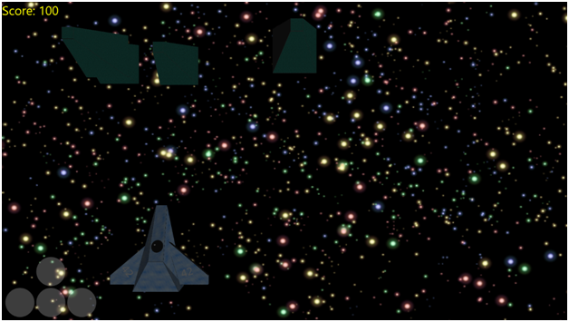

# 第十章把所有的都放在一起

在最后一章中，我们将看看如何将我们在本书和上一本书中看到的许多概念简洁地放在一起。目前，我们看起来离拥有任何类似游戏的东西都很遥远，但实际上，我们很接近拥有一个可以创建许多简单三维游戏的引擎。这本书和前一本书的目的是介绍图形编程的一般技术。到目前为止，我忽略了几乎所有会引导我们走上某种特定游戏类型编程道路的方面。在这一点上，我认为最好是举例说明一个游戏，并表明我们已经检查了足够的概念来创建三维游戏。我们将制作一些类似太空射手的东西，比如太空入侵者。

在下面的代码表中，我忽略了任何细节，因为这些都是基本的 C++编程或 DirectX 代码，我们在本书和上一本书中已经讨论过了。

### 坏蛋和子弹

我们需要做的第一件事是加载更多的模型，一个用于坏人，一个用于子弹。这些都是极其简单的模型，只是为了节省本书的篇幅。下面的代码表是 baddie.obj 的对象文件。

```cpp
    # Blender v2.66 (sub 0) OBJ File: 'baddie.blend'
    # www.blender.org
    o Cube
    v -1.000000 -1.000000 1.000000
    v -1.000000 -1.000000 -1.000000
    v 1.000000 -1.000000 -1.000000
    v 1.000000 -1.000000 1.000000
    v -0.231813 1.000000 0.231813
    v -0.231813 1.000000 -0.231813
    v 0.231813 1.000000 -0.231813
    v 0.231813 1.000000 0.231813
    vt 0.976658 0.674214
    vt 0.651396 0.674214
    vt 0.651396 0.348953
    vt 0.075574 0.424353
    vt 0.000175 0.424353
    vt 0.000175 0.348953
    vt 0.325436 0.000175
    vt 0.200505 0.348604
    vt 0.000175 0.000175
    vt 0.651047 0.000175
    vt 0.526116 0.348604
    vt 0.450716 0.348604
    vt 0.325786 0.697382
    vt 0.450716 0.348953
    vt 0.526116 0.348953
    vt 0.999825 0.200505
    vt 0.651396 0.325436
    vt 0.999825 0.125106
    vt 0.976658 0.348953
    vt 0.075574 0.348953
    vt 0.125106 0.348604
    vt 0.325786 0.000175
    vt 0.651047 0.697382
    vt 0.651396 0.000175
    vn -0.000000 -1.000000 0.000000
    vn 0.000000 1.000000 0.000000
    vn -0.933509 0.358555 0.000000
    vn 0.000000 0.358554 -0.933509
    vn 0.933509 0.358555 0.000000
    vn -0.000000 0.358555 0.933509
    vn 0.000000 0.358555 -0.933509
    s off
    f 1/1/1 2/2/1 3/3/1
    f 5/4/2 8/5/2 7/6/2
    f 1/7/3 5/8/3 2/9/3
    f 2/10/4 6/11/4 7/12/4
    f 3/13/5 7/14/5 8/15/5
    f 5/16/6 1/17/6 8/18/6
    f 4/19/1 1/1/1 3/3/1
    f 6/20/2 5/4/2 7/6/2
    f 5/8/3 6/21/3 2/9/3
    f 3/22/7 2/10/7 7/12/7
    f 4/23/5 3/13/5 8/15/5
    f 1/17/6 4/24/6 8/18/6

```

这个物体的纹理，叫做 baddie.png，是下面的紫外线贴图(图 10.1 )。

>

图 10.1: baddie.png

对象文件和纹理应该保存为 baddie.obj 和 baddie.obj，并导入到 Visual Studio 项目中，就像我们添加 spacehip.obj 和 spacehip.obj 文件一样。我们将要改变应用程序加载这些模型的方式，但是文件的导入是相同的。不要忘记将 obj 文件的文件类型从对象更改为文本。

项目符号模型对象文件如下代码表所示。

```cpp
    # Blender v2.67 (sub 0) OBJ File: ''
    # www.blender.org
    v 0.086050 -0.086050 -0.086050
    v 0.086050 -0.086050 0.086050
    v -0.086050 -0.086050 0.086050
    v -0.086050 -0.086050 -0.086050
    v 0.086050 0.086050 -0.086050
    v 0.086050 0.086050 0.086050
    v -0.086050 0.086050 0.086050
    v -0.086050 0.086050 -0.086050
    vt 0.666467 0.666467
    vt 0.333533 0.666467
    vt 0.333533 0.333533
    vt 0.333134 0.333133
    vt 0.000200 0.333134
    vt 0.000200 0.000200
    vt 0.666467 0.000200
    vt 0.666467 0.333133
    vt 0.333533 0.333134
    vt 0.999800 0.333533
    vt 0.999800 0.666467
    vt 0.666867 0.666467
    vt 0.000200 0.999800
    vt 0.000200 0.666867
    vt 0.333134 0.999800
    vt 0.333134 0.333533
    vt 0.333134 0.666467
    vt 0.000200 0.666467
    vt 0.666467 0.333533
    vt 0.333133 0.000200
    vt 0.333533 0.000200
    vt 0.666867 0.333533
    vt 0.333134 0.666867
    vt 0.000200 0.333533
    vn 0.000000 -1.000000 0.000000
    vn -0.000000 1.000000 0.000000
    vn 1.000000 -0.000000 0.000001
    vn -0.000000 -0.000000 1.000000
    vn -1.000000 -0.000000 -0.000000
    vn 0.000000 0.000000 -1.000000
    vn 1.000000 0.000000 -0.000000
    s off
    f 1/1/1 2/2/1 3/3/1
    f 5/4/2 8/5/2 7/6/2
    f 1/7/3 5/8/3 6/9/3
    f 2/10/4 6/11/4 7/12/4
    f 3/13/5 7/14/5 4/15/5
    f 5/16/6 1/17/6 4/18/6
    f 4/19/1 1/1/1 3/3/1
    f 6/20/2 5/4/2 7/6/2
    f 2/21/7 1/7/7 6/9/7
    f 3/22/4 2/10/4 7/12/4
    f 7/14/5 8/23/5 4/15/5
    f 8/24/6 5/16/6 4/18/6

```

子弹的 UV 布局如下图(*图 10.2* )。


图 10.2: bullet.png

这两个项目可以像飞船和巴迪一样保存和导入到项目中。我称这两个文件为子弹和 bullet.obj 如果给它们起了不同的名字，一定要改变代码中的文件名引用。

### 游戏对象类

`GameObject`类是一个简单的包装类。它保存着我们游戏中物体(玩家、子弹和坏蛋)的模型和位置。游戏引擎不需要它，但它确实有助于创建一个`GameObject`类或类似的东西来封装我们虚拟世界中物理对象的所有复杂性。下面的类是专门为游戏所需而设计的，但是通常`GameObject`类应该是灵活的，并且包含一套更统一和完整的操作对象的方法。向项目中添加两个文件， **GameObject.h** 和 **GameObject.cpp** 。以下两个代码表显示了这些文件的代码。

```cpp
    // GameObject.h
    #pragma once

    #include "pch.h"
    #include "Model.h"
    #include "ModelReader.h"
    #include "Texture.h"

    using namespace DirectX;

    class GameObject {
    XMFLOAT3 m_objectPosition; // Object's position
    XMFLOAT3 m_objectMovement; // Object's movement
    Model *m_model; // Object's model
    Texture m_texture; // Object's texture
    float m_objectSize; // Object's size in units
    bool m_isActive; // Is the object active?

    public:
    GameObject();

    // For use when multiple objects use the sme texture and model
    void SetModelAndTexture(Model* model, Texture* texture)
    {
    m_model = model;
    m_texture = *texture;
    }

    void SetObjectSize(float size) { this->m_objectSize = size; }

    void SetActive( bool active) { m_isActive = active; }

    bool IsActive() { return m_isActive; }

    void LoadModelFileAndTexture(ID3D11Device* device,
    IWICImagingFactory2* wicFactory, char* modelFilename,
    LPCWSTR texturefilename, float objectSize);

    XMMATRIX GetTranslationMatrix() {
    return XMMatrixTranslation(m_objectPosition.x,
    m_objectPosition.y, m_objectPosition.z);
    }

    // Reverse the direction of the object's movement
    void ReverseDirection() {
    m_objectMovement.x = -m_objectMovement.x;
    m_objectMovement.y = -m_objectMovement.y;
    m_objectMovement.z = -m_objectMovement.z;
    }

    void SetPosition(float x, float y, float z) {
    m_objectPosition.x = x;
    m_objectPosition.y = y;
    m_objectPosition.z = z;
    }

    XMFLOAT3 GetPosition() { return m_objectPosition; }

    XMFLOAT3 GetSpeed() { return m_objectMovement; }

    void SetSpeed(float x, float y, float z) {
    m_objectMovement.x = x; m_objectMovement.y = y;
    m_objectMovement.z = z; }

    void SetPosition(XMFLOAT3 pos) { m_objectPosition = pos; }

    void SetYPosition(float y) { m_objectPosition.y = y; }

    void Move();

    void Accelerate(float amountX, float amountY, float amountZ, float max);

    void Render(ID3D11DeviceContext1* context);

    bool Overlapping(GameObject *obj);
    };

```

```cpp
    // GameObject.cpp

    #include "pch.h"
    #include "GameObject.h"

    GameObject::GameObject()
    {
    m_objectPosition = XMFLOAT3(0.0f, 0.0f, 0.0f);
    m_objectMovement = XMFLOAT3(0.0f, 0.0f, 0.0f);
    }

    void GameObject::LoadModelFileAndTexture(ID3D11Device* device, IWICImagingFactory2* wicFactory, char* modelFilename, LPCWSTR texturefilename, float objectSize)
    {
    // Read the spaceship model
    m_model = ModelReader::ReadModel(device, modelFilename);

    // Read the texture:
    m_texture.ReadTexture(device, wicFactory, texturefilename);

    // Record the radius of the the object's bounding sphere
    m_objectSize = objectSize;
    }

    void GameObject::Render(ID3D11DeviceContext1* context)
    {
    if(!m_isActive) return; // If the object's not active, return

    // Set to render triangles
    UINT stride = sizeof(Vertex); // Reset to the frist vertices in the buffer
    UINT offset = 0;
    // Set the vertex buffer
    context->IASetVertexBuffers(0, 1, m_model->GetAddressOfVertexBuffer(), &stride, &offset);
    // Set the resource view which points to the texture
    context->PSSetShaderResources(0, 1, m_texture.GetResourceView().GetAddressOf());
    // Render the vertices
    context->Draw(m_model->GetVertexCount(), 0);
    }

    void GameObject::Move()
    {
    m_objectPosition.x += m_objectMovement.x;
    m_objectPosition.y += m_objectMovement.y;
    m_objectPosition.z += m_objectMovement.z;
    }

    void GameObject::Accelerate(float amountX, float amountY, float amountZ, float max)
    {
    m_objectMovement.x += amountX;
    m_objectMovement.y += amountY;
    m_objectMovement.z += amountZ;

    if(m_objectMovement.x > max) m_objectMovement.x = max;
    if(m_objectMovement.y > max) m_objectMovement.y = max;
    if(m_objectMovement.z > max) m_objectMovement.z = max;
    if(m_objectMovement.x < -max) m_objectMovement.x = -max;
    if(m_objectMovement.y < -max) m_objectMovement.y = -max;
    if(m_objectMovement.z < -max) m_objectMovement.z = -max;
    }

    bool GameObject::Overlapping(GameObject *obj)
    {
    // If either of the two objects are not active, return false
    if(!m_isActive) return false;
    if(!obj->m_isActive) return false;

    // Find distance in each axis
    float distX = m_objectPosition.x - obj->m_objectPosition.x;
    float distY = m_objectPosition.y - obj->m_objectPosition.y;
    float distZ = m_objectPosition.z - obj->m_objectPosition.z;

    // Find total distance from axis distances
    float dist = sqrt(distX*distX + distY*distY + distZ * distZ);

    // The models overlap if theie distance is less or equal
    // to either of the object's sizes
    return dist <= (m_objectSize + obj->m_objectSize);
    }

```

前一个类保存游戏中每个对象的位置、移动、活动或非活动状态、纹理和模型。我为这个类编写的方法集合非常具体地描述了这个游戏的操作方式。它们是移动物体，分配纹理和模型，测试两个物体是否碰撞的方法。

### 背景

我们将通过在三维物体后面绘制一个星域的二维图像，将我们的宇宙飞船放置在太空的中间。下面的图片(*图 10.3* )应该保存为**starfieldbackground.png**并导入到您的项目中，就像我们之前对 UV 纹理所做的那样。它将构成我们游戏的背景。


图 10.3: starfieldbackground.png

下面这个类加载并渲染背景，取自上一本书 *Direct2D 简洁*。为了方便起见，这里包含了它，但是关于这个类的描述，请参见另一本书。为位图背景类添加两个文件，**位图背景. h** 和**位图背景. cpp** 。以下两个代码表显示了这些文件的代码。

```cpp
    // BitmapBackground.h
    #pragma once
    #include "DirectXBase.h"

    // Defines a background consisting of a bitmap image
    class BitmapBackground {
    private:
    ID2D1Bitmap * m_bmp; // The image to draw
    D2D1_RECT_F m_screenRectangle; // Destination rectangle

    public:
    // Constructor for bitmap backgrounds
    BitmapBackground();

    // Release dynamic memory
    ~BitmapBackground();

    void CreateDeviceDependentResources
    (Microsoft::WRL::ComPtr<ID2D1DeviceContext> context,
    IWICImagingFactory2 *wicFactory, LPCWSTR filename);
    void CreateWindowSizeDependentResources(
    Microsoft::WRL::ComPtr<ID2D1DeviceContext> context);
    void Render(Microsoft::WRL::ComPtr<ID2D1DeviceContext> context);
    };

```

```cpp
    // BitmapBackground.cpp
    #include "pch.h"
    #include "BitmapBackground.h"

    // This constructor must be called at some point after the
    // WIC factory is initialized!
    BitmapBackground::BitmapBackground() { }

    BitmapBackground::~BitmapBackground(){
    m_bmp->Release();
    }

    void BitmapBackground::CreateDeviceDependentResources
    (Microsoft::WRL::ComPtr<ID2D1DeviceContext> context,
    IWICImagingFactory2 *wicFactory, LPCWSTR filename) {
    // Create a WIC decoder
    IWICBitmapDecoder *pDecoder;

    // Decode a file, make sure you've added the file to the project first:
    DX::ThrowIfFailed(wicFactory->CreateDecoderFromFilename(filename,
    nullptr, GENERIC_READ, WICDecodeMetadataCacheOnDemand, &pDecoder));

    // Read a frame from the file (png, jpg, bmp etc. images only have one frame so
    // the index is always 0):
    IWICBitmapFrameDecode *pFrame = nullptr;
    DX::ThrowIfFailed(pDecoder->GetFrame(0, &pFrame));

    // Create format converter to ensure data is the correct format despite the
    // file's format.
    // It's likely the format is already perfect but we can't be sure:
    IWICFormatConverter *m_pConvertedSourceBitmap;
    DX::ThrowIfFailed(wicFactory->CreateFormatConverter(&m_pConvertedSourceBitmap));
    DX::ThrowIfFailed(m_pConvertedSourceBitmap->Initialize(
    pFrame, GUID_WICPixelFormat32bppPRGBA,
    WICBitmapDitherTypeNone, nullptr,
    0.0f, WICBitmapPaletteTypeCustom));

    // Create a Direct2D bitmap from the converted source
    DX::ThrowIfFailed(context->CreateBitmapFromWicBitmap(
    m_pConvertedSourceBitmap, &m_bmp));

    // Release the dx objects we used to create the bmp
    pDecoder->Release();
    pFrame->Release();
    m_pConvertedSourceBitmap->Release();
    }

    void BitmapBackground::CreateWindowSizeDependentResources(
    Microsoft::WRL::ComPtr<ID2D1DeviceContext> context) {
    // Save a rectangle the same size as the area to draw the background
    m_screenRectangle = D2D1::RectF(0, 0, context->GetSize().width, context->GetSize().height);
    }

    void BitmapBackground::Render(Microsoft::WRL::ComPtr<ID2D1DeviceContext> context) {
    context->DrawBitmap(m_bmp, &m_screenRectangle);
    }

```

### 像素着色器

顶点着色器可以保持不变，但是像素着色器中的照明应该稍微暗一点，以帮助模型看起来更像在暗星场中。下面的代码表是 pixelshader.hlsl 文件中的主要方法。

```cpp
    // Main entry point to the shader
    float4 main(PixelShaderInput input) : SV_TARGET
    {
    float4 emissive = float4(0.0f, 0.0f, 0.0f, 1.0f);

    float materialReflection = 0.9f;
    float4 ambientLightColor = float4(0.1f, 0.1f, 0.1f, 1.0f);
    float4 ambient = ambientLightColor * materialReflection;

    float diffuseIntensity = 0.9f;
    float4 diffuseLightColor = float4(1.0f, 1.0f, 1.0f, 1.0f);
    float4 diffuseLightDirection = float4(-1.0f, -1.0f, -1.0f, 1.0f);
    float4 materialColor = shaderTexture.Sample(samplerState, input.tex);
    float4 diffuse = diffuseIntensity * diffuseLightColor *
    saturate(dot(-diffuseLightDirection, input.normal));
    diffuse = diffuse * materialColor;

    float4 finalColor = emissive + ambient + diffuse;

    finalColor = normalize(finalColor);

    return finalColor;
    }

```

### 简单文本发送器

游戏的大部分改动都在`SimpleTextRenderer`类。下面的代码表显示了更新后的 SimpleTextRenderer.h 文件。它现在包括 GameObject.h 文件、BitmapBackground.h 文件和字符串头。成员变量也发生了变化，因为我们不再想要一个单一的宇宙飞船模型，而是几个不同的模型。

```cpp
    // SimpleTextRenderer.h
    #pragma once

    #include "DirectXBase.h"
    #include "VertexShader.h"
    #include "PixelShader.h"
    #include "Keyboard.h"
    #include "GameObject.h"
    #include "BitmapBackground.h"
    #include "Model.h"
    #include "ModelReader.h"
    #include "Texture.h"
    #include <string>

    // This class renders simple text with a colored background.
    ref class SimpleTextRenderer sealed : public DirectXBase
    {
    public:
    SimpleTextRenderer();

    // DirectXBase methods.
    virtual void CreateDeviceIndependentResources() override;
    virtual void CreateDeviceResources() override;
    virtual void CreateWindowSizeDependentResources() override;
    virtual void Render() override;

    // Method for updating time-dependent objects.
    void Update(float timeTotal, float timeDelta);

    // Keyboard methods:
    void KeyDown(Windows::System::VirtualKey key);
    void KeyUp(Windows::System::VirtualKey key);

    private:
    Microsoft::WRL::ComPtr<ID3D11Buffer> m_constantBufferGPU;
    ModelViewProjectionConstantBuffer m_constantBufferCPU;

    ID3D11SamplerState *m_samplerState;

    // Shaders
    VertexShader m_vertexShader;
    PixelShader m_pixelShader;

    Keyboard m_keyboard;

    // Game objects and background
    GameObject m_spaceship;
    GameObject m_baddies[5];
    GameObject m_bullet;
    BitmapBackground m_bitmapbackground;
    Texture m_baddieTexture;

    // Variables for printing the user's score
    int m_playerScore; // The player's score
    Microsoft::WRL::ComPtr<IDWriteTextFormat> m_textFormat;
    Microsoft::WRL::ComPtr<ID2D1SolidColorBrush> m_scoreBrush;
    };

```

其余的更改将对 SimpleTextRenderer.cpp 文件进行。`CreateDeviceIndependent`资源方法可用于初始化`m_textFormat`对象，以存储将呈现玩家分数的文本方面。我们也可以用这种方法把玩家的分数设置为 0。下面的代码表显示了这些变化。

```cpp
    void SimpleTextRenderer::CreateDeviceIndependentResources()
    {
    DirectXBase::CreateDeviceIndependentResources();

    m_playerScore = 0;

    DX::ThrowIfFailed(
    m_dwriteFactory->CreateTextFormat(L"Segoe UI",
    nullptr, DWRITE_FONT_WEIGHT_NORMAL,
    DWRITE_FONT_STYLE_NORMAL,
    DWRITE_FONT_STRETCH_NORMAL,
    42.0f,L"en-US",
    &m_textFormat));
    }

```

`CreateDeviceResources`方法将所有模型和纹理加载到`GameObject`成员变量中，并设置它们的初始值。它还创建了画笔(`m_scoreBrush`)，我们将使用它来渲染玩家的分数。此方法的更改代码如下代码表所示。

```cpp
    void SimpleTextRenderer::CreateDeviceResources()
    {
    DirectXBase::CreateDeviceResources();

    // Load the spaceship model and texture
    m_spaceship.LoadModelFileAndTexture(m_d3dDevice.Get(), m_wicFactory.Get(), "spaceship.obj", L"spaceship.png", 3.0f);
    m_spaceship.SetPosition(0.0f, 0.0f, 5.0f);
    m_spaceship.SetActive(true);

    // Load the bullet
    m_bullet.LoadModelFileAndTexture(m_d3dDevice.Get(), m_wicFactory.Get(), "bullet.obj", L"bullet.png", 0.09f);
    m_bullet.SetActive(false);

    // Read the baddie model and texture
    Model *baddieModel = ModelReader::ReadModel(m_d3dDevice.Get(), "baddie.obj");
    m_baddieTexture.ReadTexture(m_d3dDevice.Get(), m_wicFactory.Get(), L"baddie.png");

    for(int i = 0; i < 5; i++)
    {
    m_baddies[i].SetModelAndTexture(baddieModel, &m_baddieTexture);
    m_baddies[i].SetPosition((float)(i-2.5f)* 3.0f, 0.0f, -5.0f);
    m_baddies[i].SetObjectSize(1.0f);
    m_baddies[i].SetActive(true);
    }

    // Load the background file
    m_bitmapbackground.CreateDeviceDependentResources(m_d2dContext, m_wicFactory.Get(), L"starfieldbackground.png");

    // Create the constant buffer on the device
    CD3D11_BUFFER_DESC constantBufferDesc(sizeof(ModelViewProjectionConstantBuffer), D3D11_BIND_CONSTANT_BUFFER);
    DX::ThrowIfFailed(m_d3dDevice->CreateBuffer(&constantBufferDesc, nullptr, &m_constantBufferGPU));

    // Load the vertex and pixel shaders from their files (note the CSO extension, not hlsl!):
    m_vertexShader.LoadFromFile(m_d3dDevice.Get(), "VertexShader.cso");
    m_pixelShader.LoadFromFile(m_d3dDevice.Get(), "PixelShader.cso");

    // Create the sampler state
    D3D11_SAMPLER_DESC samplerDesc;
    ZeroMemory(&samplerDesc, sizeof(D3D11_SAMPLER_DESC));
    samplerDesc.Filter = D3D11_FILTER_MIN_MAG_MIP_LINEAR;
    samplerDesc.AddressU = D3D11_TEXTURE_ADDRESS_WRAP;
    samplerDesc.AddressV = D3D11_TEXTURE_ADDRESS_WRAP;
    samplerDesc.AddressW = D3D11_TEXTURE_ADDRESS_WRAP;
    samplerDesc.MipLODBias = 0.0f;
    samplerDesc.MaxAnisotropy = 1;
    samplerDesc.ComparisonFunc = D3D11_COMPARISON_ALWAYS;
    samplerDesc.BorderColor[0] = 0;
    samplerDesc.BorderColor[1] = 0;
    samplerDesc.BorderColor[2] = 0;
    samplerDesc.BorderColor[3] = 0;
    samplerDesc.MinLOD = 0;
    samplerDesc.MaxLOD = D3D11_FLOAT32_MAX;

    DX::ThrowIfFailed(m_d3dDevice->CreateSamplerState(&samplerDesc, &m_samplerState));

    // Create the solid brush for the text
    DX::ThrowIfFailed(m_d2dContext->CreateSolidColorBrush(ColorF(ColorF::Yellow),&m_scoreBrush));
    }

```

我们应该在`SimpleTextRenderer::CreateWindowSizeDependentResources`方法中为`m_bitmapbackground`对象调用`CreateWindowSizeDependentResources`。位图背景类依赖于窗口的大小，因为它必须在整个窗口上拉伸图像。下面的代码表突出显示了这个额外的调用。

```cpp
    void SimpleTextRenderer::CreateWindowSizeDependentResources()
    {
    DirectXBase::CreateWindowSizeDependentResources();

    m_bitmapbackground.CreateWindowSizeDependentResources(m_d2dContext);

    // Store the projection matrix
    float aspectRatio = m_windowBounds.Width / m_windowBounds.Height;
    float fovAngleY = 70.0f * XM_PI / 180.0f;
    XMStoreFloat4x4(&m_constantBufferCPU.projection,
    XMMatrixTranspose(XMMatrixPerspectiveFovRH(fovAngleY,aspectRatio,0.01f,500.0f)));
    }

```

对`SimpleTextRenderer`的`Update`方法有许多改变，以允许我们的模型移动并相互作用。正是这种方法响应用户输入并移动周围的所有对象。它确定子弹是否击中了坏人，并增加玩家的分数。我还把相机移高了一点。更新方法的修改版本如下代码表所示。请注意，我已经从这个方法的末尾移除了我们模型的静态定位。

```cpp
    void SimpleTextRenderer::Update(float timeTotal, float timeDelta) {
    // View matrix defines where the camera is and what direction it looks in
    XMStoreFloat4x4(&m_constantBufferCPU.view, XMMatrixTranspose(
    XMMatrixLookAtRH(
    XMVectorSet(0.0f, 10.0f, 0.01f, 0.0f), // Position
    XMVectorSet(0.0f, 0.0f, 0.0f, 0.0f), // Look at
    XMVectorSet(0.0f, 1.0f, 0.0f, 0.0f) // Up vector
    )));

    // Accelerate player left and right when the keys are down
    (m_keyboard.IsKeyDown(Windows::System::VirtualKey::Left))
    m_spaceship.Accelerate(-2.0f * timeDelta, 0.0f, 0.0f, 0.25f);
    else if(m_keyboard.IsKeyDown(Windows::System::VirtualKey::Right))
    m_spaceship.Accelerate(2.0f * timeDelta, 0.0f, 0.0f, 0.25f);

    // Check if the ship hit the side of the screen:
    (m_spaceship.GetPosition().x < -10.0f && m_spaceship.GetSpeed().x < 0.0f)
    m_spaceship.ReverseDirection();
    (m_spaceship.GetPosition().x > 10.0f && m_spaceship.GetSpeed().x > 0.0f)
    m_spaceship.ReverseDirection();

    // Move the spaceship
    m_spaceship.Move();
    // Store the ship's model buffer
    XMStoreFloat4x4(&m_constantBufferCPU.model,
    XMMatrixTranspose(m_spaceship.GetTranslationMatrix()));

    // Check if the player is shooting:
    ( m_keyboard.IsKeyDown(Windows::System::VirtualKey::Up)) {
    // If the bullet's not active, fire it
    if(!m_bullet.IsActive()) {
    m_bullet.SetPosition(m_spaceship.GetPosition());
    m_bullet.SetSpeed(0.0f, 0.0f, -20.0f * timeDelta);
    m_bullet.SetActive(true);
    }
    }

    // If the bullet's active, move it
    (m_bullet.IsActive()) {
    m_bullet.SetSpeed(0.0f, 0.0f, -20.0f * timeDelta);
    m_bullet.Move();

    // If the bullet goes out of the screen, deactivate it
    if(m_bullet.GetPosition().z < -10.0f)
    m_bullet.SetActive(false);
    }

    // Move the baddies
    for(int i = 0; i < 5; i++) {
    // Make the baddies bob up and down like real aliens
    m_baddies[i].SetYPosition(1.0f * sin(timeTotal*5 + i));

    if(m_baddies[i].GetSpeed().x == 0.0f) // Set the initial speed if the baddie is not moving
    m_baddies[i].SetSpeed(4.0f*timeDelta, 0.0f, 0.0f);

    // If they hit the side of the screen, reverse their direction
    if(m_baddies[i].GetSpeed().x < 0.0f && m_baddies[i].GetPosition().x < -10.0f)
    m_baddies[i].ReverseDirection();
    if(m_baddies[i].GetPosition().x > 10.0f && m_baddies[i].GetSpeed().x > 0.0f)
    m_baddies[i].ReverseDirection();

    // Move this baddie
    m_baddies[i].Move();

    // If the bullet hits a baddie, set it as inactive
    if(m_baddies[i].Overlapping(&m_bullet)) {
    m_baddies[i].SetActive(false);
    m_bullet.SetActive(false);
    m_playerScore += 100;
    }
    }
    }

```

上一个码表设置了坏人相对于第一个`timeDelta`值的速度。这不是移动模型的统一方式，因为第一个`timeDelta`值可能会比后续的慢；它可以用于这个演示代码，但是你通常不会这样做。

`Render`方法的变化相当广泛。基本上，我们渲染二维背景，然后是宇宙飞船、坏蛋和子弹。然后我们渲染玩家的分数，使其出现在对象和背景之上。我没有在下面的代码表中突出显示这些变化，因为几乎所有的代码都是从我们最后一次看到这个方法时开始变化的。

```cpp
    void SimpleTextRenderer::Render() {
    m_d3dContext->ClearRenderTargetView(m_d3dRenderTargetView.Get(),
    (float*) &XMFLOAT3(0.39f, 0.58f, 0.93f)); // Clear to cornflower blue

    // Render 2-D background so it appears behind everything
    m_d2dContext->BeginDraw();
    m_bitmapbackground.Render(m_d2dContext);
    HRESULT hr = m_d2dContext->EndDraw();
    if (hr != D2DERR_RECREATE_TARGET) DX::ThrowIfFailed(hr);

    // Clear the depth stencil
    m_d3dContext->ClearDepthStencilView(m_d3dDepthStencilView.Get(), D3D11_CLEAR_DEPTH, 1.0f, 0);

    // Set the render target
    m_d3dContext->OMSetRenderTargets(1, m_d3dRenderTargetView.GetAddressOf(), m_d3dDepthStencilView.Get());

    // Set to render a triangle list
    m_d3dContext->IASetPrimitiveTopology(D3D11_PRIMITIVE_TOPOLOGY_TRIANGLELIST);

    // Set the input layout
    m_d3dContext->IASetInputLayout(m_vertexShader.GetInputLayout());

    // Set the vertex shader
    m_d3dContext->VSSetShader(m_vertexShader.GetVertexShader(), nullptr, 0);

    // Set the vertex shader's constant buffer
    m_d3dContext->VSSetConstantBuffers(0, 1, m_constantBufferGPU.GetAddressOf());

    // Set the pixel shader
    m_d3dContext->PSSetShader(m_pixelShader.GetPixelShader(), nullptr, 0);

    // Set the sampler state for the pixel shader
    m_d3dContext->PSSetSamplers(0, 1, &m_samplerState);

    // Load the data from the CPU into the GPU's constant buffer
    m_d3dContext->UpdateSubresource(m_constantBufferGPU.Get(), 0, NULL, &m_constantBufferCPU, 0, 0);

    // Render the spaceship
    m_spaceship.Render(m_d3dContext.Get());

    // Render the baddies
    for(int i = 0; i < 5; i++) {
    XMStoreFloat4x4(&m_constantBufferCPU.model,
    XMMatrixTranspose(
    m_baddies[i].GetTranslationMatrix()
    ));
    m_d3dContext->UpdateSubresource(m_constantBufferGPU.Get(), 0, NULL, &m_constantBufferCPU, 0, 0);
    m_baddies[i].Render(m_d3dContext.Get());
    }

    // Render the bullet
    XMStoreFloat4x4(&m_constantBufferCPU.model,
    XMMatrixTranspose(
    m_bullet.GetTranslationMatrix()
    ));
    m_d3dContext->UpdateSubresource(m_constantBufferGPU.Get(), 0, NULL, &m_constantBufferCPU, 0, 0);
    m_bullet.Render(m_d3dContext.Get());

    // Render 2-D background so it appears behind everything
    m_d2dContext->BeginDraw();

    // Print the player's score:
    m_d2dContext->SetTransform(m_orientationTransform2D);
    // Set up the string to print:
    std::wstring s = std::wstring(
    L"Score: ") + std::to_wstring(m_playerScore);
    // Render the string in the top left corner
    m_d2dContext->DrawText(s.c_str(), s.length(), m_textFormat.Get(),
    D2D1::RectF(0, 0, 600, 32), m_scoreBrush.Get());

    hr = m_d2dContext->EndDraw();
    if (hr != D2DERR_RECREATE_TARGET) DX::ThrowIfFailed(hr);
    }

```

最后，也是最重要的一步，点击 F5 进行调试。你应该看到一个三维空间射手(*图 10.3* )。



图 10.3:太空射手

太空射手可能有点夸张，但我们肯定有 3d 射手的雏形。用左右键移动飞船，用向上键射击。您也可以使用鼠标点击屏幕上的 dpad，或者使用触摸屏(如果您有 Windows Surface 或其他 WinRT 设备)。