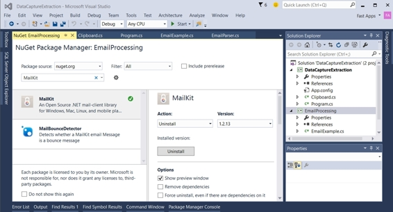
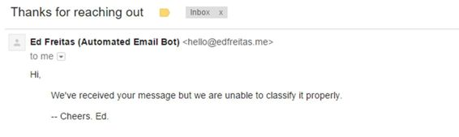

# 一、从电子邮件提取数据

电子邮件已经成为我们现代互联社会的一个支柱，现在它是一种主要的交流方式。因为每封电子邮件都充满了有价值的信息，所以在当今的商业世界中，数据提取已经成为开发人员的一项有价值的技能。如果你能解析一封电子邮件并从中提取数据，自动化流程的公司，例如服务台系统，将会重视你的专业知识。

电子邮件可以分为几个部分:主题、正文、附件、发件人和收件人。我们还应该注意到，标题部分揭示了有关发送和接收电子邮件过程中所涉及的邮件服务器的重要信息。

在讨论如何从电子邮件的每个部分提取信息之前，我们应该理解邮箱可以被视为一个半结构化的数据库，它不使用本地查询语言(例如，SQL)来提取信息。


*表 1:典型的邮件结构*

表 1 描述了一个典型的电子邮件结构，可以使用 C#进行查询。请注意，电子邮件的结构是分层的，一些元素包含在其他元素中。例如，附件属于内容，它是正文的一部分。这种内部结构可能略有不同，但这种分层视图使概念更容易理解。

考虑到这个结构，我们可以寻找从每个元素中提取数据并使其有意义的方法。我们将在第 1 章后面讨论这个问题。

请记住，这些元素将始终包含数据:标题、内容、收件人、发件人和收件人。这些是必不可少的——没有它们，电子邮件就无法转发。但是，其他电子邮件元素，如抄送、密件抄送、主题、正文、内容和附件，可能不包含数据。

本章将介绍如何连接到 POP3 或 IMAP 邮件服务器，如何从电子邮件中检索、解析和提取数据，以及如何使用带有 C#的 MailKit 库通过 SMTP 发送响应。

现在我们知道了电子邮件的结构包括几个元素，我们需要了解每个电子邮件元素中存在哪些类型的数据。

表 2 显示了电子邮件元素的数据类型。

| 发报机 | 包含 | 1 个电子邮件地址(字符串) |
| 听筒 | 包含 | 1 个或多个电子邮件地址(字符串) |
| 抄送 | 包含 | 1 个或多个电子邮件地址(字符串) |
| 秘送 | 包含 | 1 个或多个电子邮件地址(字符串) |
| 科目 | 包含 | 1 行文本(字符串) |
| 内容 | 包含 | 1 行或多行文本或 HTML(字符串) |
| 附件 | 包含 | 一个或多个文件 |

*表 2:电子邮件元素数据类型*

利用我们对电子邮件元素的数据类型的了解，我们可以确定如何处理每个元素，并预测我们期望提取的数据类型。为了连接到邮件服务器并提取数据，我们将使用一个名为 MailKit 的跨平台 C#库。

MailKit 是跨平台的。基于 MimeKit 构建的 IMAP、POP3 和 SMTP 的. NET 库。Mailkit 是由来自 Xamarin 的 Jeffrey Stedfast 开发的，关于它的更多信息可以在[https://components.xamarin.com/view/mailkit](https://components.xamarin.com/view/mailkit)或[https://github.com/jstedfast/MailKit](https://github.com/jstedfast/MailKit)的 GitHub 上找到。

您可以使用 Visual Studio 将 MailKit 作为 NuGet 包安装。



*图 1:用 Visual Studio 2015* 将 MailKit 作为 NuGet 包安装

MailKit 支持 IMAP4、POP3、SMTP 客户端、SASL 身份验证以及客户端邮件排序和线程。支持功能的完整列表可在 MailKit 网站上找到。

由于 MailKit 是一个 C#库，下面的代码示例是使用 Visual Studio 2015 编写的，它的目标是。NET 4.5.2，可能会使用 C# 6.0 的一些功能。

连接到 POP3 或 IMAP 服务器以便以后检索电子邮件是使用邮件工具包的一个基本组成部分。让我们看看这是如何做到的。

代码清单 1:从 POP3 服务器读取消息主题

```cs

  //
  EmailParser.cs: Using MailKit to Retrieve Email Data.
  Using
  System;
  using MailKit.Net.Pop3;
  using MimeKit;

  namespace EmailProcessing
  {

  public class EmailParser : IDisposable

  {

  protected string User { get; set; }

  protected string Pwd { get; set;
  }

  protected string MailServer { get; set; }

  protected int
  Port { get; set;
  }
          public Pop3Client Pop3 { get; set;
  }

  public EmailParser(string user, string pwd,
  string mailserver, 

  int port)

  {

  User = user;

  Pwd = pwd;

  MailServer = mailserver;

  Port = port;

  Pop3 = null;

  }        

  public void OpenPop3()

  {

  if (Pop3 == null)

  {

      Pop3 = new Pop3Client();

  Pop3.Connect(this.MailServer, this.Port, false);

  Pop3.AuthenticationMechanisms.Remove("XOAUTH2");

  Pop3.Authenticate(this.User, this.Pwd);

  }

  }

  public void
  ClosePop3()

  {

  if (Pop3 != null)

  {

      Pop3.Disconnect(true);

  Pop3.Dispose();

  Pop3 = null;

  }

  }

  public void DisplayPop3Subjects()

  {

  for (int
  i = 0; i < Pop3?.Count; i++)

  {

      MimeMessage message = Pop3.GetMessage(i);

  Console.WriteLine("Subject: {0}", message.Subject);

  }

  }

  public void
  Dispose() { }

  }
  }
  //
  EmailExample.cs: Email Wrapper Class
  using System;

  namespace EmailProcessing
  {

  public class EmailExample

  {

  private const string cPopUserName = "test@popserver.com";

  private const string cPopPwd = "testPwd123";

  private const string cPopMailServer = "mail.popserver.com";

  private const int cPopPort = 110;

  public static void ShowPop3Subjects()

  {

  using (EmailParser ep = 

   new EmailParser(cPopUserName, 

   cPopPwd, cPopMailServer, cPopPort))

  {

  ep.OpenPop3();

   ep.DisplayPop3Subjects();

  ep.ClosePop3();

    }

  }

  }
  }
  //
  Program.cs: Show Subjects from POP3 Messages.
  using EmailProcessing;

  namespace DataCaptureExtraction
  {

  class Program

  { 

  static void
  Main(string[] args)

  {

  EmailExample.ShowPop3Subjects();

   }

  }
  }

```

主逻辑包含在 Program.cs 的 main 方法中，该方法调用 ShowPop3Subjects 方法。然后，ShowPop3Subjects 执行 EmailParser 类的 OpenPop3、DisplayPop3Subjects 和 ClosePop3 方法。

为了充分理解 MailKit 是如何使用的，让我们关注 EmailParser 类，它包含对 MailKit 方法的调用。三种方法执行到邮件服务器的连接、检索电子邮件和关闭连接。让我们看看每一个。

顾名思义，OpenPop3 使用邮件工具包库打开与 Pop3 服务器的连接。

代码清单 2:连接到 POP3 服务器

```cs

  public void
  OpenPop3()
  {

  if (Pop3 == null)

  {

  Pop3 = new Pop3Client();

  Pop3.Connect(this.MailServer, this.Port, false);

  Pop3.AuthenticationMechanisms.Remove("XOAUTH2");

  Pop3.Authenticate(this.User, this.Pwd);

  }    
  }

```

在代码清单 2 中，创建了一个 Pop3Client 实例。接下来，使用保存实例的 Pop3 变量，对 Connect 方法的调用传递 POP3 邮件服务器的名称、POP3 端口和指示是否将使用 SSL 的第三个参数。在这种情况下，不使用 SSL，因此设置为 false。

我们接下来调用身份验证机制。因为我们没有 OAuth2 令牌，所以禁用``XOAUTH2`` 认证机制。

然后，为了建立与 POP3 服务器的连接，调用 Authenticate，它传递用户名(通常与被查询邮箱的电子邮件地址名称相同)及其相应的密码。

有了与 POP3 服务器的开放连接，我们接下来可以遍历电子邮件消息并检索每个消息的信息。在这种情况下，我们将获取每封电子邮件的主题。代码清单 3 演示了如何实现这一点。

代码清单 3:获取电子邮件主题

```cs

  public void
  DisplayPop3Subjects()
  {

  for (int
  i = 0; i < Pop3?.Count; i++)

  {

  MimeMessage message = Pop3.GetMessage(i);

  Console.WriteLine("Subject:
  {0}", message.Subject);

  }
  }

```

每个电子邮件都由一个 MimeMessage 类的实例表示。Pop3 对象中的方法 GetMessage 负责检索 MimeMessage 对象。MimeMessage 对象包含一个名为 Subject 的属性，该属性返回电子邮件的主题。

表 3 显示了 MimeMessage 对象中可用的属性。

| 。附件 | 不计其数〔t0〕 |
| 。体形立方晶格 | 互联网地址列表 |
| 。身体 | MimeEntity |
| . BodyParts | 不计其数〔t0〕 |
| 。复写的副本 | 互联网地址列表 |
| 。日期 | 日期时间偏移量 |
| 。从 | 互联网地址列表 |
| 。头球 | 标题列表 |
| . HtmlBody | 线 |
| 。重要 | 消息重要性 |
| 。在普里托 | 线 |
| 。MessageId(消息 Id) | 线 |
| 。MimeVersion | 版本 |
| 。优先 | 消息优先级 |
| 。参考 | 消息列表 |
| 。回复 | 互联网地址列表 |
| 。ResentBcc | 互联网地址列表 |
| 。重新计算 | 互联网地址列表 |
| 。重新开始日期 | 日期时间偏移量 |
| 。代表来自 | 互联网地址列表 |
| 。重新显示消息 Id | 线 |
| 。重新回复至 | 互联网地址列表 |
| 。重新发送 | 邮箱地址 |
| 。怨恨 | 互联网地址列表 |
| 。发报机 | 邮箱地址 |
| 。科目 | 线 |
| 。文本正文 | 线 |
| 。到 | 互联网地址列表 |

*表 3:mimom message properties*

如您所见，MimeMessage 对象的属性是自我描述的，理解它们的含义非常容易。请务必注意，邮件工具包使用互联网地址列表对象来表示电子邮件地址列表，它使用邮箱地址来表示单个电子邮件地址。

一些属性，如发件人`,` 到`,` 回复到`,` 发件人`,` 抄送、和密件抄送，都使用了与“重新发送”相同的前缀。该前缀在电子邮件被重新发送时使用，允许邮件工具包从已重新发送和未重新发送的电子邮件中识别发件人和收件人数据。

既然我们已经探索了使用邮件工具包的基础，让我们看看如何从电子邮件中提取更多信息。

MailKit 是一个非常棒的、易于使用的处理电子邮件的库。让我们看看它提供的其他有趣的电子邮件数据操作。

代码清单 4 演示了如何检索任何电子邮件的标题字段和值。

代码清单 4:提取标题字段和值

```cs

  public void
  DisplayPop3HeaderInfo()
  {

  for (int
  i = 0; i < Pop3?.Count; i++)

  {

  MimeMessage message = Pop3.GetMessage(i);

  Console.WriteLine("Subject:
  {0}",
  message?.Subject);

  foreach (Header h in message?.Headers)

  {

  Console.WriteLine("Header
  Field: {0} = {1}",

  h.Field, h.Value);

  }

  }
  }

```

当这段代码运行时，生成的输出类似于图 2。


*图 2:邮件头数据输出*

MailKit 的一个很棒的特性是它的每个电子邮件标题都有一个字段属性，该属性指示实际标题的名称以及一个值。

在代码清单 4 中，每个头字段的对应值被写入到 Windows 控制台。例如，标题“交货至”的值为[x15468019@homiemail-mx18.g.dreamhost.com](mailto:x15468019@homiemail-mx18.g.dreamhost.com)。这个特殊的标题使我们可以轻松地确定目标电子邮件地址是由 Dreamhost 的邮件服务器托管的。

我们可以很容易地看到，Received 头出现了几次，并且该头通常描述了通过几个服务器的电子邮件，例如，mail.google.com(源服务器)和 dreamhost.com(目的服务器)。

如代码列表 4 所示，所有的电子邮件头都存储在 MimeMessage 对象的 HeaderList 中。这个列表可以用 foreach 循环遍历 Header 对象。因为邮件头包含有关发送和接收电子邮件过程的有价值的信息，所以它们可以用来追踪每封电子邮件的原始来源。我们不会在这里讨论跟踪的细节，但是我们可以通过检查电子邮件头数据来了解可能的情况。MailKit 使检索这些数据变得非常容易。那么这取决于你或你的业务逻辑来理解它。

现在让我们处理一封至少有一个附件的电子邮件，以便提取正文并将每个附件保存在 Windows 文件系统的本地文件夹中。

代码清单 5:提取和保存电子邮件附件

```cs

  public void
  SavePop3BodyAndAttachments(string
  path)
  {

  for (int
  i = 0; i < Pop3?.Count; i++)

  {

  MimeMessage msg = Pop3.GetMessage(i);

           if (msg != null)

  {

  string b =
  msg.GetTextBody(MimeKit.Text.TextFormat.Text);

  Console.WriteLine("Body:
  {0}", b);

  if (msg.Attachments != null)

  {

  foreach (MimeEntity att in msg.Attachments)

  {

               if (att.IsAttachment)

  {

  if (!Directory.Exists(path))

  Directory.CreateDirectory(path);

  string fn = Path.Combine(path,

                     att.ContentType.Name);

  if (File.Exists(fn))

  File.Delete(fn);

  using (var
  stream = File.Create(fn))

  {

               var mp = ((MimePart)att);

  mp.ContentObject.DecodeTo(stream);

  }

  }

  }

  }

  }

  }
  }

```

与我们前面的示例一样，前面的代码演示了使用 GetMessage 检索电子邮件(MimeMessage 对象)。为了以纯文本的形式检索电子邮件的正文，我们可以使用参数 MimeKit.Text.TextFormat.Text 调用 GetTextBody。为了以 HTML 格式检索正文，我们可以使用 GetTextBody 来绕过参数 MimeKit.Text.TextFormat.Html，或者使用属性 HtmlBody。

检索到电子邮件正文后，我们接下来检查 MimeMessage 对象是否有任何附件。如果附件存在，我们遍历每个附件并检索一个 MimeEntity 对象。在尝试保存附件(由 MimeEntity 对象持有)之前，我们应该首先通过检查其 IsAttachment 属性来检查它实际上是一个真实的附件，以查看其评估结果是否为``true`` 。如果是，附件将保存到磁盘上调用 WriteTo 时作为参数传递的位置。

现在让我们看看如何根据收到的电子邮件内容，使用 MailKit 创建自动响应系统。这个演示程序基于前面提供的代码片段。回复系统将分析电子邮件的正文、主题和任何纯文本附件的内容，将搜索特定的关键词，并根据找到的关键词类型，发回预定义的回复。可以遵循类似的流程来自动化几乎任何涉及接收和处理电子邮件的业务流程。

代码清单 6:发送自动响应

```cs

  //
  Program.cs: Send Automated SMTP Responses.

  using EmailProcessing;

  namespace DataCaptureExtraction
  {

  class Program

  { 

  static void
  Main(string[] args)

  {

  EmailExample.AutomatedSmtpResponses();

      }

  }
  }
  //
  EmailExample.cs: Email Wrapper Class
  using System;
  using System.Collections.Generic;
  using System.Linq;
  using System.Text;
  using System.Threading.Tasks;

  namespace EmailProcessing
  {

  public class EmailExample

  {

  private const string cSmtpUserName = "hello@smtpserver.com";

  private const string cSmtpPwd = "1234";

  private const string cSmtpMailServer = "mail.smtpserver.com";

  private const int cSmptPort = 465;

  public static void AutomatedSmtpResponses()

  {

  using (EmailParser ep = new 

         EmailParser(cPopUserName, cPopPwd, 

  cPopMailServer, cPopPort))

  {

  ep.OpenPop3();

  ep.AutomatedSmtpResponses(cSmtpMailServer,

            cSmtpUserName, cSmtpPwd, cSmptPort, 

  "receiver@someserver.com", "Some
  Person");

  ep.ClosePop3();

  }

  }

  }
  }

  //
  EmailParser.cs: Use MailKit to Retrieve Email Data.

  using System;
  using System.Collections.Generic;
  using System.Linq;
  using MailKit.Net.Pop3;
  using MimeKit;
  using MailKit.Net.Smtp;

  namespace EmailProcessing
  {

  public class EmailParser : IDisposable

  {

  private const string cStrInvoice = "Invoice";

   private const string cStrMarketing = "Marketing";

  private const string cStrSupport = "Support";

  private const string cStrDftMsg = @"Hi,

  We've received your message but we are unable to 

  classify it properly.

  -- Cheers. Ed.";

  private const string cStrMktMsg = @"Hi,

  We've received your message and we've relayed 

  it to the Marketing department.

  -- Cheers. Ed.";

  private const string cStrAptMsg = @"Hi,

  We've received your message and we've relayed 

  it to the Payment department.

  -- Cheers. Ed.";

  private const string cStrSupportMsg = @"Hi,

  We've received your message and we've relayed 

  it to the Support department.

  -- Cheers. Ed.";

  protected string[] GetPop3EmailWords(ref
  MimeMessage m)

  {

  List<string> w = new List<string>();

  string b = String.Empty, s = String.Empty, c = String.Empty;

  b = m.GetTextBody(MimeKit.Text.TextFormat.Text);

  s = m.Subject;

  if (m.Attachments != null)

  {

  foreach (MimeEntity att in m.Attachments)

  {

  if (att.IsAttachment)

  {

                        if      

  (att.ContentType.MediaType.

  Contains("text"))

  {

  c = ((MimeKit.TextPart)att).Text;

    }

  }

  }

  w = CleanMergeEmailWords(w, b, s, c);

  }

  return w.ToArray();

  }

  private static List<string> CleanMergeEmailWords(List<string> w, 

  string b, string s, string c)

  {

  if (b != String.Empty || s != String.Empty || c != 

  String.Empty)

  {

  List<string> bl = new List<string>();

  List<string> sl = new List<string>();

  List<string> cl = new List<string>();

  if (b != String.Empty)

      bl = b.Split(new string[] { "
  ", "\r", "\n" },

  StringSplitOptions.RemoveEmptyEntries).ToList();

  if (s != String.Empty)

  sl = s.Split(new string[] { "
  ", "\r", "\n" },

  StringSplitOptions.RemoveEmptyEntries).ToList();

  if (c != String.Empty)

  cl = c.Split(new string[] { "
  ", "\r", "\n" },

  StringSplitOptions.RemoveEmptyEntries).ToList();

  if (bl.Count > 0 || sl.Count > 0
  || cl.Count > 0)

  {

      bl = bl.Union(sl).ToList();

  w = bl.Union(cl).ToList();

  }

  }

  return w;

  }

  public void
  SendSmtpResponse(string smtp, string user, string 

  pwd, int port, string toAddress, string
  toName, string msgTxt)

  {

  var message = new MimeMessage();

  message.From.Add(new MailboxAddress(

      "Ed Freitas
  (Automated Email Bot)", 

  "hello@edfreitas.me"));

  message.To.Add(new MailboxAddress(toName, toAddress));

  message.Subject = "Thanks
  for reaching out";

  message.Body = new TextPart("plain")

  {

      Text = msgTxt

  };

  using (var
  client = new SmtpClient())

  {

  client.Connect(smtp, port, true);

  client.Authenticate(user, pwd);

         client.Send(message);

  client.Disconnect(true);

  }

  }

  protected int
  DetermineResponseType(string[] w)

  {

  int res = -1;

  foreach (string ww in w)

  {

  if
  (ww.ToUpper().Contains(cStrInvoice.ToUpper()))

  {

  res = 1;

  break;

  }

  else if

  (ww.ToUpper().Contains(cStrMarketing.ToUpper()))

  {

                res = 0;

  break;

  }

  else if

  (ww.ToUpper().Contains(cStrSupport.ToUpper()))

  {

  res = 2;

  break;

  }

      }

  return res;

  }

  protected void
  SendResponses(string[] w, string smtp, string 

  user, string pwd, int
  port, string toAddress, string toName)

  {

  switch (DetermineResponseType(w))

  {

             case 0: // Marketing

  SendSmtpResponse(smtp, user, pwd, port, 

  toAddress, toName, cStrMktMsg);

  break;

  case 1: // Payment

  SendSmtpResponse(smtp, user, pwd, port, 

  toAddress, toName, cStrAptMsg);

  break;

              case 2: // Support

  SendSmtpResponse(smtp, user, pwd, port, 

  toAddress, toName, cStrSupportMsg);

  break;

  default: // Anything Else

      SendSmtpResponse(smtp, user, pwd, port, 

  toAddress, toName, cStrDftMsg);

  break;

  }

  }
          public void
  Dispose() { }

  public void
  AutomatedSmtpResponses(string smtp, string user, 

  string pwd, int
  port, string toAddress, string toName)

  {

  for (int
  i = 0; i < Pop3?.Count; i++)

  {

  MimeMessage message = Pop3.GetMessage(i);

  if (message != null)

  {

  string[] words = GetPop3EmailWords(ref message);

  if (words?.Length > 0)

  SendResponses(words, smtp, user, pwd, port, 

  toAddress, toName);

  }

  }

  }

  }
  }

```

这个演示程序根据以前收到的电子邮件的内容发送一封自动回复电子邮件。



*图 3:根据收到的邮件内容自动回复邮件*

图 3 描绘了到 POP3 服务器和特定电子邮件收件箱的连接，并且基于找到的电子邮件的内容，检查每个电子邮件主题、正文和附件内容，提取所有关键词并检查匹配特定预定义词集(例如，支持、营销或发票)的任何关键词。如果是这样，连接将使用 SMTP 发送自动响应。让我们深入了解细节。

从主程序中调用 AutomatedSmtpResponses 方法。这个方法只是一个 EmailExample 类的包装器，它从 EmailParser 类调用 AutomatedSmtpResponses 方法。

AutomatedSmtpResponses 循环遍历 POP3 收件箱中的所有电子邮件，并对每封电子邮件调用 GetPop3EmailWords 方法，该方法负责获取位于电子邮件主题、正文和附件中的所有单词。如果有任何单词重复出现，那么在 GetPop3EmailWords 返回的字符串数组结果中只剩下一个特定单词的实例。

来自 GetPop3EmailWords 的这个字符串数组结果然后被传递给 SendResponses，SendResponses 也接收 SMTP 服务器、用户名、密码和端口，以便发回自动响应。在继续发送响应之前，让我们再分析一下 GetPop3EmailWords 的功能。

GetPop3EmailWords 使用 GetTextBody 检索电子邮件正文，它还通过调用 subject 属性来检索电子邮件主题。GetPop3EmailWords 接下来检索每个附件的内容，这需要遍历 MimeMessage 对象的 Attachments 属性，因为每个单独的附件代表一个 MimeEntity。

MimeEntity 对象包含一个名为 IsAttachment 的属性，当设置为``true`` 时，表示可以将 MimeEntity 视为附件。为了从附件中提取关键词，我们必须知道附件是否确实是文本文件。我们可以通过使用 ContentType 属性来发现这一点。MediaType，它将指示一个带有单词“text”的文本文件如果附件是文本文件，可以通过调用((MimeKit)轻松提取内容。文本部分)。

当检索到电子邮件主题、正文和附件中出现的所有单词时，CleanMergeEmailWords 会将其合并，并从返回给调用者的最终字符串数组中删除任何重复的单词。

提取和过滤的单词被传递给 SendResponses 方法，该方法循环遍历所有单词，并检查是否有匹配的预定义单词集。当产生匹配时，通过调用 SendSmtpResponse 方法发送预定义的固定响应。

SendSmtpResponse 创建一个 MimeMessage 对象，并为其分配相应的子属性对象，如 MailboxAddress(接收者详细信息)和 TextPart(正文)。然后创建一个新的 SmtpClient 对象作为 SMTP 服务器，并分配用户凭据。成功调用连接和身份验证后，最终使用发送方法发送消息。

MailKit 是一个简单但功能强大的库，用于管理和处理电子邮件。我们已经学习了如何连接到 POP3 服务器，并从邮件头和内容(如正文和附件)中检索电子邮件数据。我们还研究了如何使用 SMTP 发送响应。最后，让我们检查一下如何使用 IMAP 代替 POP3。

我们提到的每种 POP3 方法都在演示程序源代码中使用了相应的 IMAP 等价物。

您会发现在 MailKit 中使用 IMAP 类似于连接和使用 POP3 服务器。但是，在 IMAP 中，您必须指明要打开哪个文件夹以及要对该文件夹执行何种操作，例如``Read`` 或``ReadWrite`` 操作。

要使用 IMAP 打开收件箱文件夹，您需要调用:(剪切)Imap.Inbox.Open。打开文件夹后，您可以像使用 POP3 一样循环访问 MimeMessage 对象，直到到达 Imap.Inbox.Count。

下面的代码清单显示了使用 IMAP 实现的 POP3 方法的等价物。

代码清单 POP3 方法的 IMAP 等价物

```cs

  public
  ImapClient Imap { get; set; }

  public void
  DisplayImapSubjects()
  {

  var folder =
  Imap?.Inbox.Open(FolderAccess.ReadOnly);

  for (int
  i = 0; i < Imap?.Inbox.Count; i++)

  {

  MimeMessage message = Imap.Inbox.GetMessage(i);

  Console.WriteLine("Subject:
  {0}",
  message?.Subject);

  }
  }

  public void
  DisplayImapHeaderInfo()
  {

  var folder =
  Imap?.Inbox.Open(FolderAccess.ReadOnly);

  for (int
  i = 0; i < Imap.Inbox?.Count; i++)

  {

  MimeMessage message = Imap.Inbox.GetMessage(i);

  Console.WriteLine("Subject:
  {0}",
  message?.Subject);

  foreach (Header h in message?.Headers)

  {

  Console.WriteLine("Header
  Field: {0} = {1}",

  h.Field, h.Value);

  }

  }
  }

  public void
  AutomatedSmtpResponsesImap(string
  smtp, string user,
  string pwd, int
  port, string toAddress, string toName)
  {

  var folder =
  Imap?.Inbox.Open(FolderAccess.ReadOnly);

  for (int
  i = 0; i < Imap?.Inbox.Count; i++)

  {

  MimeMessage message = Imap.Inbox.GetMessage(i);

  if (message != null)

      {

  string[] words = GetPop3EmailWords(ref message);

  if (words?.Length > 0)

  SendResponses(words, smtp, user, pwd, port,

  toAddress, toName);

  }

  }
  }

  public void
  SaveImapBodyAndAttachments(string
  path)
  {

  var folder =
  Imap?.Inbox.Open(FolderAccess.ReadOnly);

  for (int
  i = 0; i < Imap?.Inbox.Count; i++)

  {

  MimeMessage message = Imap.Inbox.GetMessage(i);

  if (message != null)

  {

  string b = message.GetTextBody(

  MimeKit.Text.TextFormat.Text);

  Console.WriteLine("Body:
  {0}", b);

  if (message.Attachments != null)

  {

  foreach (MimeEntity att in

  message.Attachments)

  {

  if (att.IsAttachment)

  {

  if (!Directory.Exists(path))

  Directory.CreateDirectory(path);

  string fn = Path.Combine(path,

                           att.ContentType.Name);

  if (File.Exists(fn))

     File.Delete(fn);

  using (var
  stream = File.Create(fn))

  {

  var mp = ((MimePart)att);

  mp.ContentObject.DecodeTo(stream);

               }

  }

  }

  }

  }

  }
  }

```

代码清单 7 指出了与 POP3 等效方法的两个主要区别。首先，用 IMAP 打个电话给 Imap。收件箱。打开需要指定需要哪种类型的收件箱文件夹访问权限。第二，循环考虑了通过调用 Imap.Inbox.Count 打开的收件箱文件夹上的计数，其余过程本质上是相同的，每封电子邮件由一个``MimeMessage`` 对象表示。

要了解更多关于 MailKit 的信息，请访问该项目的 GitHub 网站，查看代码示例和进一步的文档。

下面的代码清单包含前面使用邮件工具包描述的所有示例的完整源代码。

代码清单 8:使用邮件工具包的演示程序源代码

```cs

  //
  Program.cs: Main Program

  using EmailProcessing;

  namespace DataCaptureExtraction
  {

  class Program

  { 

  static void
  Main(string[] args)

  {

  //EmailExample.ShowPop3Subjects();

  //EmailExample.DisplayPop3HeaderInfo();

  //EmailExample.SavePop3BodyAndAttachments(

  //  @"C:\Attach");

  //EmailExample.AutomatedSmtpResponses();

  //EmailExample.ShowImapSubjects();

  //EmailExample.DisplayHeaderInfoImap();

  //EmailExample.
  SaveImapBodyAndAttachments(

  //  @"C:\Attach");

  EmailExample.AutomatedSmtpResponsesImap();

  }

  }
  }

  //
  EmailExample.cs: Email Wrapper Class
  using System;

  namespace EmailProcessing
  {

  public class EmailExample

  {

  private const string cPopUserName = "test@popserver.com";

  private const string cPopPwd = "1234";

  private const string cPopMailServer = "mail.popserver.com";

  private const int cPopPort = 110;

  private const string cImapUserName = "test@imapserver.com";

  private const string cImapPwd = "1234";

  private const string cImapMailServer = "mail.imapserver.com";

  private const int cImapPort = 993;

  private const string cSmtpUserName = "test@smtpserver.com";

  private const string cSmtpPwd = "1234";

  private const string cSmtpMailServer = "mail.smtpserver.com";

  private const int cSmptPort = 465;

  public static void ShowPop3Subjects()

  {

  using (EmailParser ep = new EmailParser(cPopUserName, 

  cPopPwd, cPopMailServer, cPopPort))

  {

          ep.OpenPop3();

  ep.DisplayPop3Subjects();

  ep.ClosePop3();

  }

  }

  public static void ShowImapSubjects()

  {

  using (EmailParser ep = new EmailParser(cImapUserName, 

      cImapPwd, cImapMailServer, cImapPort))

  {

  ep.OpenImap();

  ep.DisplayImapSubjects();

  ep.CloseImap();

  }

  }

  public static void DisplayHeaderInfo()

  {

    using (EmailParser ep = new EmailParser(cPopUserName, 

  cPopPwd, cPopMailServer, cPopPort))

  {

  ep.OpenPop3();

  ep.DisplayPop3HeaderInfo();

  ep.ClosePop3();

      }

  }

  public static void DisplayHeaderInfoImap()

  {

  using (EmailParser ep = new EmailParser(cImapUserName, 

  cImapPwd, cImapMailServer, cImapPort))

  {

  ep.OpenImap();

     ep.DisplayImapHeaderInfo();

  ep.CloseImap();

  }

  }

  public static void AutomatedSmtpResponses()

  {

  using (EmailParser ep = new EmailParser(cPopUserName,  

  cPopPwd, cPopMailServer, cPopPort))

  {

  ep.OpenPop3();

  ep.AutomatedSmtpResponses(cSmtpMailServer, 

  cSmtpUserName, cSmtpPwd, 

  cSmptPort, "user@server.com", "Some Person");

  ep.ClosePop3();

  }

  }

  public static void AutomatedSmtpResponsesImap()

  {

  using (EmailParser ep = new EmailParser(cImapUserName, 

   cImapPwd, cImapMailServer, cImapPort))

  {

  ep.OpenImap();

   ep.AutomatedSmtpResponsesImap(cSmtpMailServer, 

  cSmtpUserName, cSmtpPwd, 

  cSmptPort, "user@server.com", "Some Person");

  ep.CloseImap();

  }

  }

  public static void SavePop3BodyAndAttachments(string path)

  {

  using (EmailParser ep = new EmailParser(cPopUserName, 

   cPopPwd, cPopMailServer, cPopPort))

  {

  ep.OpenPop3();

  ep.SavePop3BodyAndAttachments(path);

  ep.ClosePop3();

  }

  }

  public static void SaveImapBodyandAttachments(string path)

  {

  using (EmailParser ep = new EmailParser(cImapUserName, 

   cImapPwd, cImapMailServer, cImapPort))

  {

  ep.OpenImap();

  ep.SaveImapBodyAndAttachments(path);

  ep.CloseImap();

  }

  }

  public static void OpenClosePop3()

  {

    using (EmailParser ep = new EmailParser(cPopUserName, 

   cPopPwd, cPopMailServer, cPopPort))

  {

  ep.OpenPop3();

  ep.ClosePop3();

  }

  }

  public static void OpenCloseImap()

  {

  using (EmailParser ep = new EmailParser(cImapUserName, 

   cImapPwd, cImapMailServer, cImapPort))

  {

  ep.OpenImap();

  ep.CloseImap();

  }

  }

  }
  }

```

完整的 Visual Studio 项目源代码可以从以下网址下载:

[https://bit bucket . org/syncfusiontech/data-capture-and-extraction-with-c-简洁地](https://bitbucket.org/syncfusiontech/data-capture-and-extraction-with-c-succinctly)