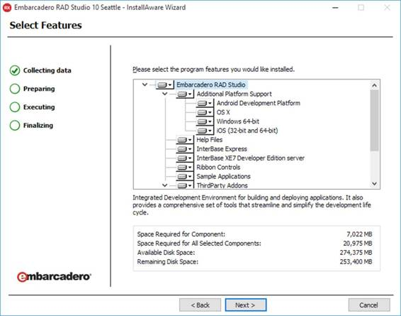

Delphi 是由著名的 Turbo Pascal 编译器背后的软件公司 Borland 在 1995 年发布的。

Borland 的想法是创建一个基于组件使用的快速应用程序开发(RAD)环境，或者更好地重用，将著名的 Turbo Pascal 编译器向前推进了一步。

当时，德尔福是微软 Visual Basic 的直接竞争对手——一度有人称之为“VB-黑仔”得益于对面向对象编程(OOP)、多线程和组件对象模型(COM)支持的全面支持，以及许多其他独有的特性，Delphi 可以实现比 Visual Basic 6 更复杂、结构更好的项目。VB 开发人员不得不等待。NET 框架技术，以便拥有具有高级语言和现代企业级业务素质的可比工具。

如今，德尔福由专注于高级企业数据管理和开发工具的公司 [Embarcadero Technologies](http://www.embarcadero.com) 拥有和维护。德尔福作为独立产品出售，或者在 RAD Studio 内部出售，RAD Studio 是一个更广泛的套件，其中德尔福与 C++Builder 捆绑在一起(德尔福可以使用的相同技术和库的不同风格，但基于 C++语言和编译器)。

在本书中，我们将参考德尔福 10 西雅图，这是在撰写本文时可用的最新版本，但是我们将看到的所有内容对于任何旧版本或新版本都应该是可以的。

本书的目的是概述您可以使用 Delphi 做什么以及如何做，面对其环境的工作原理和 Object Pascal 语言为大量异构设备和平台构建本机解决方案的巨大潜力。

德尔福可以作为单独的产品，也可以作为 [RAD Studio](http://www.embarcadero.com/products/rad-studio) 的一部分，这是一个更完整的开发套件，包括一个共享德尔福相同库的 C++语言环境。

德尔福包括:

*   集成开发环境。
*   针对不同目标平台的一组编译器。
*   核心运行时和设计时库(RTL、VCL、FMX)。
*   几个第三方组件和包。
*   离线产品文档和应用编程接口参考。
*   很多例子和演示都有源代码。

在接下来的章节中，我们将详细研究这些部分，看看如何使用它们构建任何类型的应用程序。

Delphi 中的开发过程利用三个库来实现运行时和设计时的目的。

这些库包含完整的源代码，因此您可以查看并了解一些功能是如何实现的，或者如果有 bug，有时会设置一个变通方法。

[运行时库(RTL)](http://docwiki.embarcadero.com/RADStudio/Seattle/en/Using_the_RTL_(Run-Time_Library)) 是一个可移植的软件，充满了例程、类型和类，用于一般目的，如字符串和日期/时间操作、内存和输入/输出管理、列表和其他容器以及 RTTI(在中称为反射。NET 和 Java)仅举几个例子。

[可视化组件库(VCL)](http://docwiki.embarcadero.com/RADStudio/Seattle/en/Introducing_the_Visual_Component_Library_(VCL)) 利用 RTL 提供了一套可视化控件和非可视化组件，旨在为 Windows 平台创建应用程序和服务。自 1995 年成立以来，VCL 就存在于该产品中，经过 20 多年的改进，它已经成长为一个坚实而成熟的框架。它被积极维护，以包含微软发布的每个版本的 Windows 上最突出的功能。

[火猴](http://www.embarcadero.com/products/rad-studio/firemonkey)类似于 VCL，意思是提供组件和视觉控制，但在很多方面与前者不同。首先，它是一个图形库:组成用户界面的元素是利用图形处理器和向量从头开始设计的。它也是完全跨平台的:用它创建的每个应用程序都可以被编译成在不同的操作系统上运行，包括 Windows、Mac OSX、Android 和 iOS。

德尔福提供了许多其他库来解决常见的任务，如网络和互联网通信、数据访问和云支持。仅举几个例子，`FireDAC`是一个库，它允许您连接到各种不同格式的数据源和数据库，包括 NoSQL 数据库(如 MongoDB)。`Indy`是一组类和组件，支持为最流行的网络协议创建客户端和服务器；`HTTP Client Library`提供工具和组件来调用 RESTful APIs 和交换数据，`Cloud API`是一个可扩展的框架，用于连接和消费云服务，其中包含微软 Azure 和亚马逊 EC2 服务的最新组件。

Delphi 可以创建各种各样的项目。这里有一个表格总结了它们，但是新的种类是在每个版本之后基于产品包含的新平台添加的。

表 1:德尔福主要项目类型

| 项目类型 | 描述 |
| 控制台应用程序 | 一个基本的跨平台应用程序，没有图形用户界面，可从命令提示符或终端窗口运行。 |
| VCL 表格申请 | 基于可视化组件库(VCL)的经典 Windows 原生桌面应用程序。 |
| 多设备应用 | 基于火猴库(FMX)的丰富的跨平台客户端应用，面向多种设备和不同外形。 |
| 动态链接库 | 一个跨平台的本地共享库，用于将函数导出到其他应用程序和编程语言，如老式的普通窗口动态链接库文件。 |
| 控制面板应用 | 向 Windows 控制面板添加一个新图标，单击该图标时将启动完全可自定义的应用程序。 |
| 安卓服务 | 在安卓平台上执行后台任务。 |

在开始我们的旅行之前，你必须下载并安装在你的电脑上。

Delphi 可以为很多平台生产应用程序，然而它实际上是一个 Windows 本机可执行文件，所以你必须有一台配备 Windows (Vista 或更高版本)的 PC 才能运行它，如果你使用的是 Mac，则必须有一台 Windows 虚拟机。

你可以从[恩巴卡德罗的网站](http://www.embarcadero.com/products/delphi)下载一个免费试用版的德尔福。

下载安装包后，启动安装包开始安装过程，包括以下步骤。

1.  在此之前，您必须检查`License Agreement`和`Privacy Policy`的接受度，然后您可以选择加入`Embarcadero Customer Experience Program`，这是一个提供数据帮助改进产品的计划。
2.  `Setup Personalities`步骤允许您选择要安装的编程语言(称为“个性”)。可以选择同时安装 Delphi 和 C++Builder，也可以只安装其中一个；如果你打算开始试用期，你可以评估这两款产品，否则你应该坚持使用从恩巴卡德罗购买的许可证中包含的语言。
3.  `Setup Languages`步骤允许您安装不同语言的产品(默认为英语)。
4.  `Select Features`步骤允许您选择希望在产品中安装哪些功能(即库、帮助、示例、附加组件)。您可以选择一个功能并阅读树下方的简短描述。

图 1:功能选择

1.  `Android SDK`步骤让你在产品中安装安卓 NDK/SDK；如果您已经安装了它们，并且想要为 Android 平台开发，请取消选中这些选项，稍后按照官方文档中的详细说明进行配置。
2.  `Start Menu`步骤是您可以编辑“开始菜单”组的名称，并决定是为您自己还是为您机器的所有用户创建它。
3.  `Destination Folder`步骤允许您更改程序文件、演示和公共资源的目标路径。
4.  `Update File Associations`允许您选择哪些文件扩展名应该与 Delphi 相关联；您可以根据需要选择所有文件类型，也可以取消选择其他编程工具和环境(如 Visual Studio)也使用的文件类型。
5.  `Download File Location`步骤要求您输入一个路径，安装程序可以在该路径中保存根据所选功能必须下载的媒体包；如果您在恩巴卡德罗有活动的更新订阅，您也可以订购“媒体工具包”(DVD)或下载完整的 ISO 发行版。
6.  最后一步是安装本身。等待它完成，然后你就可以开始使用 Delphi 了。

安装过程完成后，您可以通过单击窗口开始菜单中的相应链接来启动德尔福。

如果您看到出现注册窗口，您可以选择创建一个新的恩巴卡德罗开发者网络(EDN)帐户，或者登录(如果您已经有一个)。下载安装程序后，您应该已经通过电子邮件收到了进一步的说明。

将出现一个闪屏，显示核心组件和附加组件的加载过程信息。

当一切都加载完毕后，全屏 Delphi IDE 主窗口将会打开。

在主窗口的中心，你可以找到`Welcome page`，这是一个有用的资源，通过教程、例子和操作步骤来加深你的知识，你可以在读完这本书后立即查看，周围有许多可停靠的面板，每个面板都有自己的范围。

在本章中，我们介绍了 Delphi 中可用的库:用于 Windows 开发的可视化组件库(VCL)和用于多设备、跨平台应用程序的 FireMonkey (FMX)。我们将在本书的其余部分深入研究这些库，看看您如何成功地使用它们。

我们还看了一下安装过程。我们刚刚介绍了一些广泛的信息，但是请记住，您可以随时从产品的官方文档中查看[安装说明](http://docwiki.embarcadero.com/RADStudio/Seattle/en/Installation_Notes)以了解更多详细信息。