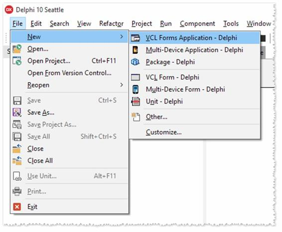
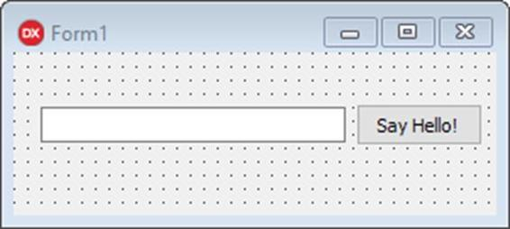

我希望你现在期待着用 Delphi 创建你的第一个项目。我们可以跳过“你好世界”的演示，但为什么不遵循传统呢？

首先，我们将从头开始创建一个 Windows 桌面应用程序。为此，将鼠标指针移至主菜单，指向`[File|New]`项并选择`VCL Forms Application`。



图 2:德尔福主菜单

德尔福将创建新项目，并为开始工作准备环境。

当您创建一个新项目时，Delphi 会自动将新的空表单(称为主表单)插入到项目中并打开，以便您可以开始设计应用程序的用户界面。

您可以删除该项目或稍后向其中添加新表单。现在，我们将尝试一些基本操作，并在接下来的章节中探索细节。

从`Tool Palette`窗口中，通过单击加号(+)展开“标准”类别，然后单击`TEdit`控件并将其拖动到您的表单中，将其放在空窗口区域。接下来，重复选择`TButton`控件的过程。

如果您想更改刚刚添加的按钮上的文本，请左键单击您放置在表单内的控件，并指向`Object Inspector`窗口。在网格中滚动找到`Caption`属性并点击它输入新文本，用新标签替换默认值(按钮 1)。按回车键或点按“对象检查器”面板外的其他位置以完成更改。


图 3:按钮属性

您也可以这样做来清除文本框`TEdit`的内容:选择控件并将属性`Text`更改为空值。

如果要移动控件，可以按住鼠标左键单击并移动它，或者使用蓝点来更改它的大小。我们最终的主表单应该如下所示:



图 4:“你好世界”表单

如果双击`TButton`控件，Delphi 将切换到*代码编辑器*，并创建一个例程来处理用户单击按钮时引发的事件。Delphi 负责编写大量样板代码，具体实现由您决定。

假设我们想在用户插入他(或她)的名字并点击按钮时说“你好”。您可以编写如下内容:

代码清单 1:你好，世界

```delphi
          procedure TForm1.Button1Click(Sender: TObject);
          begin     ShowMessage('Hello, ' + Edit1.Text + '!');
          end;

```

不要太关注语法——我们将用一整章的时间来讨论对象帕斯卡。

要运行应用程序，选择`[Run|Run Without Debugging]`(或按 CTRL+F9)，Delphi 将开始构建您的项目。


图 5:构建进度窗口

如果在构建过程中没有检测到错误，Delphi 将启动应用程序可执行文件(该文件包含。. exe "扩展)。

|  | 注意:Delphi 是一种本机编译语言，所以当您需要运行应用程序时，它总是会创建一个可执行文件，并查看它是否如您所期望的那样工作。你无法避免。您只能选择在不调试的情况下运行程序，这样一旦构建完成，Delphi 就不会附加到进程上，两个进程将继续独立运行。 |

如果您正确执行了所有步骤，主窗体应该会出现，当您输入姓名并单击按钮时，您应该会看到以下消息。


图 6:“你好，世界”跑步

通过调用 ShowMessage 函数调用的消息框是一个模态对话框。这意味着在您单击确定或右上角的关闭按钮关闭窗口之前，执行不会继续。

|  | 注意:只要主窗体在屏幕上可见，应用程序就会一直运行。您可以最小化它或在桌面上移动它，当您关闭它时，应用程序会终止。 |

恭喜你，你刚刚创建了你的第一个 Delphi 程序！

当您运行或构建项目时，Delphi 会生成一个本机应用程序。

我们用来创建“Hello World”应用程序的可视化组件库(VCL)以 Windows 平台为目标，该平台的编译器实际上编写了一个可执行文件(。exe)程序文件。

术语“本机”意味着您的程序包含可由目标 CPU 和操作系统执行的机器代码，而不需要运行时和虚拟机。

部署程序不需要安装程序或打包工具:您可以简单地将可执行文件复制到目标机器并启动它。

|  | 提示:有时您的应用程序可能需要使用外部文件、资源或数据库；在这些情况下，我建议使用安装工具来确保所有必需的文件都被复制到目标机器上。这让用户可以自定义过程，如程序目标目录、可选组件的选择、帮助手册和示例。如果你想要一个简单易用的工具，看看 [Inno Setup](http://www.jrsoftware.org) (顺便说一下，它是用 Delphi 构建的！) |

在这里，我们只触及了用德尔福可以实现的表面，我想你已经可以清楚地知道快速应用程序开发(RAD)方法在多大程度上加快了开发过程。

使用 Delphi，您可以专注于应用程序的关键部分，如用户界面和业务逻辑，而不必过多关注内部机制。

我知道这个例子可能看起来过于简单，但接下来的章节将说明如何使用 Delphi 来制作复杂得多的应用程序。在此之前，我们应该熟悉 IDE 中可用的工具。