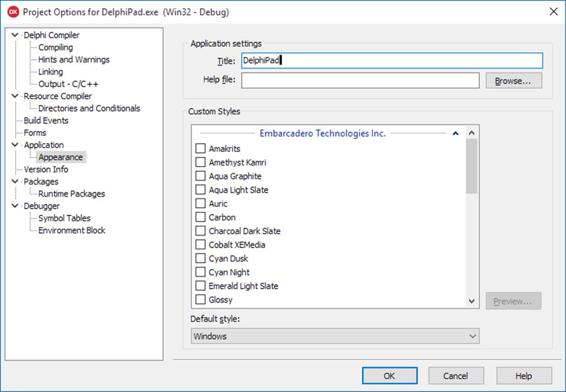
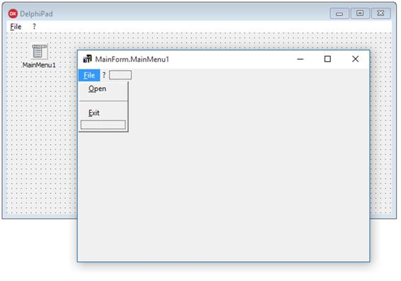
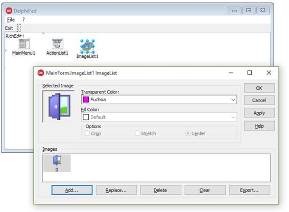
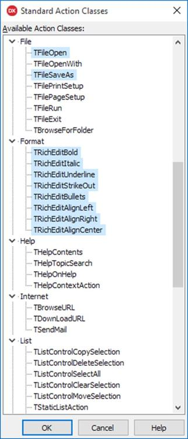
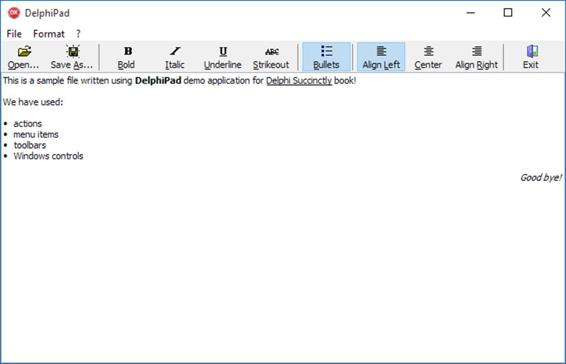

我们已经看到了基本的 IDE 工具，构建了“Hello World”应用程序，并探索了 Object Pascal 语言及其语法的基础。

现在是时候深入研究构建真实应用程序的有趣方面了。我们将探索创建一个几乎没有代码的全功能、类似写字板的应用程序的主要步骤！

您可以尝试使用本章作为逐步教程来构建演示项目，也可以[从 GitHub](https://bitbucket.org/syncfusiontech/delphi-succinctly-sample-project/branch/master) 下载完整的示例。

`Visual Component Library` (VCL)从它的第一个版本开始就是产品的一部分，主要被设计成将 Windows 本地 API 包装成一个可重用和可扩展的类、组件和可视控件的层次结构。

使用 VCL 构建的应用程序仅针对 Windows 平台。如果你想跨平台，你必须使用火猴库(FMX)，下一章专门介绍这个。幸运的是，最常用的 VCL 组件已经跨平台，因此 VCL 和 FMX 都可以使用。

VCL 首字母缩略词的“V”代表“可视化”，不仅指可视化控件，还指德尔福构建用户界面和添加业务逻辑的“可视化方式”。

既然要建一个 [VCL 表单应用](http://docwiki.embarcadero.com/RADStudio/XE5/en/VCL_Forms_Application)，从主菜单中选择`[File|New|VCL Forms Application]`新建一个项目，点击`[File|Save all]`保存 Delphi 生成的所有文件。

我通常倾向于为我的项目创建一个单独的文件夹。对于这个示例，您可以创建一个名为“DelphiPad”的文件夹。然后将主窗体保存为“Main.pas”，替换默认的无意义的建议名称(通常为“Unit1.pas”或类似名称)，并将主项目文件保存为“DelphiPad.dproj”名称，将它们放入之前创建的文件夹中。

您可以从“项目管理器”窗口访问项目文件，并通过双击打开它们，但是如果您使用窗口资源管理器导航到项目目录，您会看到 Delphi 在其中存储了几个文件。

以下是每种文件类型的摘要及其目的的简要描述。

表 10:德尔福项目文件类型

| 名字 | 名称/扩展名 | 描述 |
| 德尔福项目文件 | 。dpr，请回答。dpk(消歧义) | 该文件包含程序或库的主要源代码。dpr)或包(。dpk ),它通常是应用程序的入口点 |
| 德尔福项目文件(扩展) | 。dproj | 引入这种文件类型是为了存储所有无法放入的项目元数据”。dpr "文件。如果您想打开一个项目，您可以选择。民主党“或 a”。dpr "文件。如果”。dproj”文件丢失，例如，当您打开一个相当旧的项目时，Delphi 会自动创建它。 |
| 德尔福表格文件 | 。面向制造的设计 | 该文件包含单个德尔菲表单或数据模块(一种非可视化容器)的定义。这里是 Delphi 存储表单和组件属性值的地方。数据通常使用人类可读的文本格式存储，但是您可以切换到更紧凑的二进制格式。当您在设计时在 ide 中加载表单时，Delphi 会读取该文件，并将其作为资源嵌入到可执行文件中，以便它可以在运行时加载和恢复表单。 |
| Pascal 队列文件 | 。不要 | 这个纯文本文件包含对象帕斯卡源代码，可以选择链接一个”。如果它包含窗体的代码隐藏。正如我们在对象帕斯卡一章中看到的，这个文件只包含一个单位。 |
| 资源文件 | 。表示留数 | 这种二进制文件包含位图、图标、字符串和光标等资源。它是一种被广泛采用的标准格式，由特定的编译器创建，并在构建时直接嵌入到可执行文件中。德尔福创建了一个来存储关于你的项目的版本信息(标题、公司名称、版本和内部版本号等)。)，但可以包含其他资源文件。 |
| 临时文件和缓存文件 | 。本地
。identcache | 这些文件由 Delphi 在开发过程中用来存储快速访问信息。如果你使用版本控制系统(我希望你真的在使用！)将这些文件添加到“忽略列表”中，并在将您的源代码解决方案分发给其他人之前将其删除(当 Delphi 未运行时)。 |
| 统计文件 | 。斯达 | 这个文件包含关于您的项目的统计信息，比如您花了多少秒编写代码、编译和调试。 |

|  | 注意:请记住，您总是可以在“项目管理器”窗口中看到组成项目的主要文件。 |

你可能想做的第一件事是给你的项目分配一个主标题。选择`[Project|Options]`(或按 Ctrl+Shift+F11)调出项目选项对话框。



图 22:项目选项对话框

您可以使用左侧的导航树从对话框中选择一个页面，并更改项目的设置。选择`[Application|Appearance]`页面，影响应用程序的视觉外观。例如，我在“标题”框中键入了“DelphiPad”，这样标题就会显示在窗口任务栏、任务列表以及任何有您正在运行的应用程序证据的地方。

|  | 提示:Delphi 完全支持主题。从“外观”页面中，您可以选择一个或多个要嵌入到项目中的主题。启动时可以选择其中一个作为默认主题，但是您可以在代码中切换到另一个加载的主题，或者从外部文件加载它。 |

但是，一旦提交，标题信息将何去何从？尝试查看项目文件(。dpr)源代码从主菜单中选择`[Project|View Source]`。你应该看到一个类似这样的片段:

代码清单 51: VCL 应用程序主程序

```delphi
          program DelphiPad;

          uses
            Vcl.Forms,
            Main in 'Main.pas' {Form2};

          {$R *.res}

          begin
            Application.Initialize;
            Application.MainFormOnTaskbar := True;
            Application.Title := 'DelphiPad';
            Application.CreateForm(TForm2, Form2);
            Application.Run;
          end.

```

请参阅该应用程序。职称分配？一旦您键入标题并确认“项目选项”对话框，Delphi 就会自动插入它。

在许多情况下，德尔福会修改代码以响应在集成开发环境中执行的操作。要再次更改应用程序标题，可以直接在项目源文件中编辑字符串，也可以使用“项目选项”对话框。

|  | 提示:我建议您尽可能多地使用 IDE 中可用的工具，因为直接手工编辑代码更容易出错，即使您已经成为专家。 |

主窗体对我们的应用程序有着核心作用，这适用于用 Delphi 创建的大多数项目。让我们看看有哪些选项可以定制它。

双击项目管理器中的“主表单”文件，打开主表单(如果不可见)。如果显示代码编辑器，按 F12(或选择`[View|Toggle Form/Unit]`)切换到表单设计器窗口。你应该已经很熟悉了。


图 23:空的主窗体

首先，通过转到对象检查器并将“名称”属性设置为“主窗体”，更改窗体的名称，使其更有意义

|  | 注意:如果您切换到代码编辑器，您会注意到德尔福已经为您重命名了表单类名，将其更改为天猫通知。这是另一种情况，在这种情况下，德尔福保持代码与您在集成开发环境中的更改同步。 |

然后我们更改标题，用应用程序的名称替换默认文本(“Form1”或类似的东西)。单击表单空白区域，移动到“对象检查器”面板，单击“标题”，然后插入标题。


图 24:表单属性

您可以在项目的每个表单上更改许多有趣的属性，包括主表单。这里有一个最常用的列表。

表 11:表单属性

| 名字 | 描述 |
| 边框样式 | 更改边框的外观和行为。您可以通过选择“相当大”值(默认值)或使用“对话框”对其进行限制，来使表单具有完全可调整的大小；使用 bsToolWindow 和 bsSizeToolWin 可以达到相同的效果，但会使标题栏变小，就像工具窗口一样。 |
| 密钥预览 | 启用(设置为真)时，按键事件会先在窗体上引发，然后在焦点控件上引发。 |
| 位置 | 设置表单在屏幕上显示时的默认位置。您可以保持窗口动态分配的默认位置，或者将表单置于屏幕中央。 |
| 屏幕快照 | 设置为 true 时，当您在屏幕边框附近拖动时，窗体会捕捉到屏幕边框；您可以使用 SnapBuffer 属性调整效果。 |
| Windows 状态 | 设置影响屏幕上窗体大小的窗口状态；例如，将其设置为 wsMaximized 以在启动时最大化窗口。 |

还有许多其他可用的属性。它们实际上被许多可视化控件共享，因为它们是在一个共同的祖先类 TControl 中引入的。表 12 列出了其中的一些。

表 12:控件属性

| 名字 | 描述 |
| 排列 | 设置此属性，您可以将任何控件停靠到其父控件的上、下、左和右边框；当调整父控件的大小时，该控件保持其位置。 |
| 对齐带边距 | 影响 Align 属性的工作方式，在目标控件和相邻控件之间应用边距。 |
| 锚 | 允许您将虚拟“大头针”放在控件的左侧、顶部、底部或上侧，以便在调整父控件的大小时，它跟随父控件的等效边框。 |
| 限制 | 定义控件大小(宽度和高度)的最小值和最大值。 |
| 光标 | 允许您指定当鼠标指向控件时必须显示的光标。 |
| 高度/宽度 | 设置控件的大小。 |
| 暗示 | 您可以指定一个提示字符串，如果将鼠标停留在控件工作区上，该字符串将显示在工具提示中。 |
| 左侧/顶部 | 设置控件的位置。 |
| 利润 | 当使用对齐方式且启用了对齐边距属性时，定义边框和外部控件之间的间距。 |
| 填料 | 当控件使用对齐方式时，定义边框和包含的控件之间的间距。 |
| ParentColor | 指示控件使用与其父控件相同的背景控件。 |
| 父字体 | 指示控件使用与父控件相同的字体。 |

我们现在已经准备好构建自定义写字板类应用程序的用户界面。

要完成演示，我们需要:

*   主菜单。
*   工具栏。
*   富文本编辑区。

要向表单添加主菜单，请从工具选项板的“标准”页面中选择`TMainMenu`组件，并将其放置在表单上。

|  | 注意:即使主菜单有可视化表示，TMainMenu 也不是一个控件，而是一个存储菜单配置的简单组件。 |

要定义主菜单的内容，双击`TMainMenu`组件实例调出`Menu Designer`编辑器。



图 25:菜单设计器

|  | 注意:许多组件支持“组件编辑器”，这是一种特殊的向导，一旦组件和控件被添加到表单中，就可以通过双击它们来启动。它们有助于一次加快更多属性值的设置，自动生成子组件或使用更合适、更直观的界面执行高级定制。 |

单击`Menu Designer`中的空白项目，并使用对象检查器输入标题，然后您可以在其上方或下方添加更多项目。如果右键单击任何菜单项，将出现一个弹出菜单，将预定义菜单加载或保存为模板，或将任何项目转换为子菜单。

如果要创建菜单分隔符，请创建一个菜单项，并在“标题”属性中插入“-”。

|  | 提示:顺便说一下，不要将 TMainMenu 和 TPopupMenu 组件混淆:两者都使用 Menu Designer 来定义菜单项，但是虽然 TMainMenu 在表单的上侧创建了一个菜单，但是 TPopupMenu 可以“附加”到一些可视控件和组件上，以便在用户右键单击目标时出现。 |

您总是可以通过按下 Shift+Ctrl+F9 或选择`[Run|Run Without Debugging]`来启动程序，以查看主菜单是否真的如预期的那样工作。

许多应用程序提供了一个工具栏，可以快速执行最常用的命令。

在 Delphi 中也可以这样做:只需从工具选项板的 *Win32* 页面中选择`TToolBar`控件，并将其添加到表单中。请注意，默认情况下，控件与顶部对齐，它是空的，可以进行配置。

右键单击工具栏以显示弹出菜单。选择`New Button`和`New Separator`快速添加命令按钮和组分隔符。添加几个项目只是为了测试它:我们将在以后添加更多的按钮和进一步的配置。

将`AutoSize`属性设置为真，将工具栏调整到与其按钮相同的高度，并启用`ShowCaptions`属性使按钮标题可见。

支持`Actions`是我最喜欢的 Delphi 特性之一，一分钟后你就知道为什么了。

可视化应用程序通常使“命令”对最终用户可用(即打开文件，使所选文本加粗等)。).许多开发人员经常将命令逻辑直接放在响应可视控件上的用户操作的事件处理程序中。

这种方法会导致代码重复，或者在最好的情况下，当您考虑需要通过单击菜单项和工具栏按钮来执行同一命令时，会增加复杂性。当某些命令对用户不可用时，如果必须启用(或禁用)这些命令控件，情况会变得更糟。

这就是德尔福“行动”拯救的地方。

从工具选项板的`Standard`页面拖动`TActionList`组件，并将其放入您的表单中。该组件充当一个中心点，您可以在其中定义当窗口显示并处于焦点时用户可用的所有命令。

双击组件，调出`Action List`编辑器。

|  | 注意:动作列表组件编辑器实际上是一个标准的集合编辑器。它看起来很相似，对于每个具有从 TCollection 类型继承的属性的组件来说，它的工作方式是相同的。 |

点击`New Action`按钮(或按下插入按钮)向`Actions (VCL)`列表框添加新动作。每个动作都是`TAction`类型的一个实例，代表一个可执行的命令。


图 26:动作列表编辑器

以下是一些值得一提的`TAction`属性:

表 13:操作主要属性

| 属性名称 | 描述 |
| 标题 | 此属性包含绑定到操作并能够执行它的任何控件的显示文本(如菜单项、标准按钮和工具栏按钮)。 |
| 种类 | 此属性允许您对操作进行分类，根据它们的上下文将它们分成组。例如，您可以将“文件”类别分配给“打开文件”和“关闭文件”等命令类别名称可以手动输入，也可以从已经分配给其他操作的类别列表中选取。 |
| 检查 | 此属性保存操作的“选中状态”。您可以在设计时或运行时更改该值。当操作链接到复选框或菜单项时，控件会显示状态，并反映任何更改。如果启用了“自动检查”属性，则该操作在执行时会自动切换“已检查”属性。 |
| 使能够 | 此属性允许开发人员启用或禁用该操作。当操作被禁用时，用户无法执行它。绑定到此操作的每个控件也将显示为禁用。 |
| 暗示 | 此属性设置当用户将鼠标指向并按住链接控件时将显示的工具提示文本。 |
| ImageIndex(图像索引) | 此属性包含将在链接控件(如按钮和工具栏)上显示的图像的索引。索引是指存储在`TImageList`组件内的图像的偏移量。 |
| 捷径 | 此属性为动作分配一个键盘快捷键。如果操作没有被禁用，用户可以通过选择的组合键执行操作。 |

例如，假设我们想要添加一个动作，让用户退出我们的应用程序，或者通过单击`[File|Exit]`主菜单项，或者单击工具栏上的“退出”按钮。我们如何完成这项任务？

首先，向列表中添加一个新操作，并为其属性设置以下值:

| 属性名称 | 价值 |
| 标题 | 出口 |
| 种类 | 文件 |
| 暗示 | 退出应用程序 |
| 名字 | 文件索引 |
| 捷径 | Ctrl+Alt+X |

切换到对象检查器中的`Event`选项卡，双击`OnExecute`事件以创建新的处理程序方法。方法将包含以下代码，该代码在用户执行操作时作为响应。

代码清单 52:退出操作执行代码

```delphi
          procedure TMainForm.FileExitActionExecute(Sender: TObject);
          begin
            // Closes the main form and ends the application.
            Self.Close;
          end;

```

事件处理程序是`TMainForm`的一种方法，作为`FileExitAction`的`OnExecute`事件的参考。

|  | 注:VCL 表格申请通常在主表格关闭时终止。您应该总是求助于这种做法，避免任何其他残忍或异常的方式来关闭您的应用程序。 |

我们如何将`FileExitAction`链接到点击时必须执行的视觉控件？

打开`TMainMenu`组件上的菜单设计器，选择`[File|Exit]`菜单项，并通过从对象检查器中显示的下拉列表中选择`FileExitAction`来设置`Action`属性。任务完成了！

对主工具栏重复此过程。使用弹出菜单向`TToolBar`控件添加一个新的工具按钮，并像您刚才对主菜单项所做的那样更改`Action`属性。

您会注意到菜单项或工具按钮反映了在`FileExitAction`组件中指定的`Caption`。如果您改变主意，决定设置不同的标题，控件将反映这一变化。这就是行动的隐藏力量！

工具栏不是没有任何图标的真正工具栏，菜单项也应该有一些漂亮的图形。

您可以使用工具选项板的`Win32`页面中的`TImageList`组件添加图像。

`TImageList`是一个组件，它保存一组通过`Height`和`Width`属性表示的预定义大小的图像。默认大小为 16x16 像素，但您可以将其增加到 24x24、32x32、48x48 或您想要的任何大小值。

双击组件调出`ImageList Editor`。此对话框允许您从文件系统中选择图像，并将其分配给动作、菜单、工具栏、按钮和其他视觉控件。



图 27:图像列表编辑器

编辑器通常会识别加载图像的背景颜色，并将其视为透明颜色。

如果您想要显示图标，您应该像往常一样使用对象检查器将`TActionList`、`TToolBar`和`TMainMenu`的`Images`属性链接到`TImageList`组件。

每个图像都分配给一个索引。将`TMenuItem`组件、`TToolButton`控件和`TAction`实例的`ImageIndex`属性设置为要分配给每个元素的图像索引。

可视化组件库提供了一个开箱即用的富文本编辑器，称为`TRichEdit`控件。

你可以在`Win32`工具面板页面找到它。将它拖到窗体上，并将控件放在空白区域的某个地方。

使用对象检查器，将`Align`属性设置为自动客户端，控件将自动展开，填满工作区的所有可用空间。当窗体调整大小时，每个控件将保留其位置，并根据`Align`属性中指定的值适应新的大小。

`TRichEdit`控件提供了一个类似于写字板的可编辑区域。您可以输入一行文本，更改字体大小，将单词和段落格式化为粗体、斜体和下划线，创建项目符号列表等。

在这一点上，我们真的必须编码我们希望在写字板应用程序上支持的任何单个命令吗？感谢`Standard Actions`，你不用！

标准动作是`TAction`的后代，实现在许多业务应用程序中广泛使用的现成命令。

回到`TActionList`组件，双击调用动作列表编辑器。

请注意`New Action`按钮有一个下拉菜单，您可以从`New Action`(我们已经使用的命令)和`New Standard Action`中进行选择。

选择`New Standard Action`，Delphi 将显示一个对话框，选择一个或多个您可以添加到项目中的内置动作。



图 28:标准动作类

使用 Ctrl+Click 从可用的动作类列表中选择更多动作，然后按 OK 将它们添加到动作列表组件中。现在，它们将成为项目的一部分，并可分配给菜单项和工具按钮。

|  | 提示:如果您将图像列表链接到操作列表，当您添加标准操作时，默认图标会自动插入到图像列表中。您可以随时用自己选择的图像替换新图标。 |

标准操作附带一组分配给其属性的默认值，并且它们比默认操作具有更多的属性和事件，以自定义其行为并满足您的特定业务需求。


图 29:标准动作属性

下面是运行完成的应用程序的截图。



图 30: DelphiPad 示例运行

在这一章中，我们刚刚开始探索真正的潜力，德尔福和 VCL 可以提供快速开发一个完整和功能齐全的应用程序在短短几分钟内。

我们只创建了一个主表单，以使演示尽可能简单，但是您可以添加任意数量的表单，并创建数据模块(不可见的表单)来托管您的组件。示例包括数据访问组件、操作列表、图像列表和任何其他组件，并与组成应用程序的所有模块和表单共享它们。

您也可以从`New Items`窗口添加框架，以插入可重用的用户界面片段，并在需要时将它们从工具选项板拖到表单设计器中。

请记住，表单、数据模块和框架基于对象帕斯卡类类型，因此您可以像添加其他类一样向它们添加自己的字段、属性和方法。德尔福甚至允许你从他们的视觉上创造新的后代。

阅读[官方德尔福文档](http://docwiki.embarcadero.com/RADStudio/Seattle/en/VCL)来扩展您对所有可以用来构建 VCL 表单应用程序的智能工具的了解。