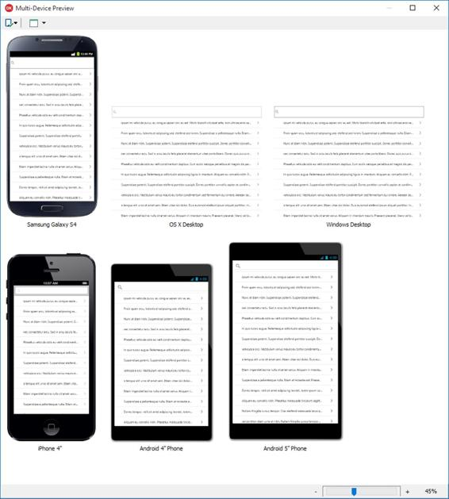
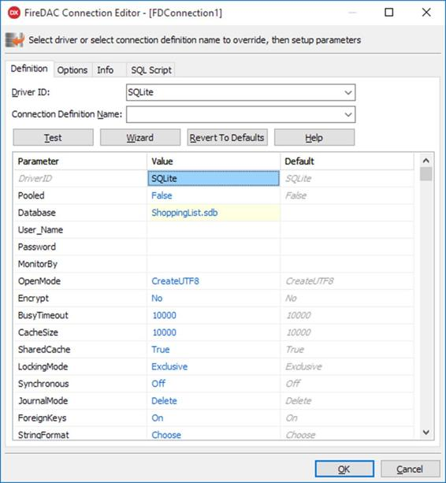

[FireMonkey](http://www.embarcadero.com/products/rad-studio/firemonkey) 是使在 Delphi 中创建跨平台应用程序成为可能的库的名称，但实际上远不止于此。

事实上，火猴(缩写为 FMX)是一个为开发下一代商业应用而诞生的全新框架:

*   这是一个*图形库*，因为组成用户界面的元素是矢量，并且倾向于 GPU。
*   它是*原生的*，因为它的代码直接编译成可执行文件，不需要任何运行时就能工作。
*   它是*多平台*，因为用它创建的应用程序可以针对不同的操作系统进行编译，比如 Windows、Mac OSX、Android 和 iOS。
*   它是*抽象*，意味着它不仅仅是目标平台公开的 API 的包装器。
*   它附带了*源代码*，不像其他具有类似功能的竞争对手库，如 Windows Presentation Framework(WPF)、Silverlight 和 Flex。

FMX 还为窗口、菜单、对话框、控件、定时器和传感器等功能提供了一个抽象层。

您可以使用 FireMonkey 创建 2D(或高清)应用程序和 3D 应用程序，提供对强大矢量图形引擎的特定对象的访问，支持实时抗锯齿、分辨率无关、alpha 混合、实体和渐变填充、画笔、钢笔、图形效果、动画和变换等高级功能。

由于有大量现成的原始对象和可视控件(形状、按钮、文本框、列表和组合框等)，FMX 方便了复杂用户界面的构建。)你可以把每一个放在其他的里面。

像 VCL 一样，火猴支持 Unicode，支持蒙皮、主题化和最流行的图像格式(JPEG、PNG、TIFF 和 GIF)。但是，它与 VCL 不兼容，因为后者与 Windows 原生 API 捆绑和耦合，而 RTL 是 FMX 和 VCL 的跨平台基础。

多设备应用程序是德尔福让您使用火猴库构建针对不同设备(台式机、平板电脑和智能手机)和操作系统(Windows、Mac OS、Android 和 iOS)的单源跨平台项目的方式。

在这一段的剩余部分，我们将构建一个示例购物清单应用程序。

要创建新的多设备应用程序，从德尔福主菜单中选择`[File|New|Multi-Device Application]`。这将打开一个向导对话框，允许您选择要用作起点的应用程序类型。您可以从以下选项中进行选择:

*   *空白应用*，启动新的空高清(2D)原始项目。
*   *3D 应用程序*，从准备托管三维对象的 3D 表单开始。
*   *页眉/页脚*，以带有顶部和底部工具栏的 2D 表单开始。
*   *带导航的页眉/页脚*，与之前的模板类似，但包含一个页面控件。
*   *主-细节*，启动一个 2D 项目，该项目使用 TMultiView 控件，支持在项目列表和所选项目的细节之间切换。
*   *选项卡式*，用选项卡和手势支持在它们之间切换来启动一个 2D 项目。
*   *选项卡式导航*，类似于上一个模板，但增加了导航按钮，可以移动到下一个和上一个选项卡。


图 31:多设备应用程序模板

对于我们的示例应用程序，选择`Blank Application`模板并单击确定。

与 VCL 表单应用程序一样，德尔福将创建一个默认的主空表单。

现在我们需要添加一个视觉控件来显示我们的购物清单项目。您应该已经熟悉了工具选项板。从`Standard`页面找到 TListView 组件，并将其拖动到您的空表单中。移动到对象检查器，并将其名称设置为购物列表视图。

配置外观后，TListView 控件可用于显示任何类型的项目列表。可以在运行时通过代码或通过将列表视图绑定到数据源来添加项。

将控件添加到表单后，将`Align`属性设置为`Client`，使控件填满可用的客户端空间。然后启用`SearchVisible`属性，一个小搜索框将出现在列表控件的顶部。这将允许用户输入一个字符串来过滤列表视图中显示的内容。

|  | 提示:TListView 支持“拉取刷新”功能。要启用它，请将 PullToRefresh 属性设置为 True，并处理 OnPullRefresh 事件以实现您对手势的自定义响应(即重新加载更新的项目)。 |

现在我们已经建立了项目列表，我们应该将它绑定到一个数据源，以查看控件内部的一些东西，并测试应用程序是如何工作的。

最好有一些自动生成的样本数据，并将`TListView`控件绑定到它。`LiveBindings`页面中的`TPrototypeBindSource`组件可以帮助您完成此任务。

将`TPrototypeBindSource`添加到主窗体中，并将其命名为`ShoppingBindSource`。

现在是时候添加一些字段了。右键单击组件，选择`Add Field…`在组件产生的虚拟数据表中插入一个新字段。将弹出`Add Field`对话框。


图 32:原型绑定源新字段

浏览`Field Data`列表中的可用字段，了解您可以为多少类型的字段制作数据原型，包括颜色和位图图像。

选择与`LoremIpsum: ftString`生成器相关联的字段，然后单击确定添加该字段。然后，将字段的`Name`属性设置为`Title`。

LiveBindings 是一项适用于 VCL 和火猴框架的技术。

它基于将对象属性链接在一起的绑定表达式。例如，您可以将切换开关按钮的`Checked`属性绑定到任何视觉控件的`Enabled`属性，以根据按钮的状态启用或禁用它，而无需编写一行代码。

|  | 注意:VCL 包括一个特殊的标准视觉控件家族，称为“数据控件”，支持数据绑定，而火猴依赖于 LiveBindings。 |

您可以通过工具面板的 LiveBindings 页面中提供的一组组件来访问 LiveBindings 功能，但是更好的方法是通过`LiveBindings Designer`来访问它们。您可以从主菜单中选择`[View|LiveBindings Designer]`项来打开它。

将`Title`字段从`TPrototypeBindingSource`元素拖动到`TListView`元素的`Item.Text`字段。


图 33:实时绑定设计器

这将告诉控件使用每个原型记录的`Title`属性值作为每个列表项的文本。您应该已经在表单设计器和多设备预览面板中看到了预览。



图 34:多设备预览

`TPrototypeBindingSource`组件——顾名思义——在您构建应用程序的原型时是很好的，但是如果您想要向市场发布您的产品，迟早您将不得不使用真实的数据库来存储您的数据。

`FireDAC`是一个跨平台的数据访问库，为各种数据库系统和格式提供一套组件和驱动程序，包括:

*   微软 SQL 服务器。
*   MySQL。
*   甲骨文。
*   SQLite。
*   MongoDB。
*   PostgreSQL。
*   IBM DB2。
*   InterBase(来自恩巴尔卡德罗的数据库服务器)。
*   FireBird(一个从 InterBase 分叉中诞生的开源数据库)。
*   SQL Anywhere。
*   Informix。
*   进入。

`FireDAC`安卓和 iOS 都支持 SQLite 和 InterBase (ToGo edition)，而客户端平台上的其他数据库则需要本机客户端库。

由于我们想要构建一个移动应用程序，我们使用 SQLite 是为了简单和大可用性。

第一步是创建到数据库的连接。从工具选项板的`FireDAC`页面选择`TFDConnection`组件，然后双击该组件打开`FireDAC Connection Editor`。



图 35:防火墙连接编辑器

从`Driver ID`列表中选择 *SQLite* ，在`Database`字段输入路径“ShoppingList.sdb”。将`LockingMode`参数设置为`Normal`，允许连接多个数据库。选择确定以确认连接参数。记得禁用登录提示，在对象检查器中将`LoginPrompt`属性设置为假。

要打开连接，请将`Connected`属性设置为真。如果数据库文件不存在，不用担心；组件会自动为您创建它。

现在我们已经连接到了我们的数据库，我们可以使用`TFDQuery`组件对其执行 SQL 查询。您甚至可以在设计时实时执行 SQL 语句。

在表单上放置一个`TFDQuery`组件，并在`SQL`属性中插入以下语句。

代码清单 53:创建表 SQL 语句

```delphi
          CREATE TABLE IF NOT EXISTS ShoppingItem (Title TEXT NOT NULL)

```

右键点击查询组件，选择`Execute`菜单项，立即执行语句。

现在是时候将我们的`TListView`连接到示例 SQLite 数据库的`ShoppingItem`表了。

实时绑定设计器可以再次提供帮助。点击`LiveBindings Wizard`按钮，打开一个特殊的向导，通过一步一步的引导过程创建所需绑定组件的实例。


图 36:实时绑定向导

点击`LiveBindings Wizard`后:

1.  选择`Create Data Source`作为`Binding Task`执行，点击`Next`。
2.  选择`FireDAC`作为`Data Source`，点击`Next`。
3.  选择`Query`作为`Command Type`，然后输入`SELECT * FROM ShoppingItem`作为`Command Text`，点击`Test Command`检查 SQL 语句是否正确。如果一切正常，则点击`Next`。
4.  点击`Finish`结束向导。

如果一切都做得正确，向导将向您的表单中添加:

*   一个`TFDQuery`组件，能够对数据库执行之前输入的 SQL 命令。
*   一个`TBindSourceDB`组件，它使通过使用查询检索的数据对 LiveBindings 可用，从而对`TListView`控件可用。

剩下唯一要做的就是将数据源链接到`TListView`控件。要执行该操作，再次调用`LiveBindings Wizard`并:

1.  选择`Link a control with a field`作为`Binding Task`执行，点击`Next`。
2.  选择`Existing Control`并点击列表中的列表视图实例，因为它是数据源必须链接的`Control`，然后点击`Next`。
3.  选择`TBindSourceDB`组件作为必须链接到先前选择的控件的`Data Source`，然后单击`Next`。
4.  选择`Title`作为字段名，再次点击`Next`。
5.  点击`Finish`结束向导。

|  | 注意:向导可能会要求您删除现有链接。这是因为我们的 TListView 已经链接到了 TPrototypeBindSource 组件，并且只允许一个链接将控件绑定到任何数据源。 |

为了完成我们的示例应用程序，我们应该添加一些命令按钮，以允许用户向列表中添加新项目或删除现有项目。

从工具选项板的`Standard`页面选择`TToolBar`控件，并将其放到主窗体上。我们将添加几个按钮和一个标题标签。

从`Standard`页面拖动一个`TButton`控件，并通过对象检查器对其进行配置，作为向购物列表添加新项目的命令，设置:

*   将`Align`属性设置为`Left`。
*   将`Name`属性设置为`AddButton`。
*   将`StyleLookup`属性设置为`addtoolbutton`。

在`TToolBar`控件中添加另一个`TButton`。这将删除当前选定的项目，并设置:

*   将`Align`属性设置为`Right`。
*   将`Name`属性设置为`DeleteButton`。
*   将`StyleLookup`属性设置为`deleteitembutton`。

|  | 提示:FireMonkey 附带了一组预定义的样式，您可以通过 StyleLookup 属性将其分配给控件。 |

最后，在工具栏中添加一个`TLabel`控件作为标题栏，并设置:

*   将`Align`属性设置为`Client`。
*   将`Name`属性设置为`TitleLabel`。
*   将`StyleLookup`属性设置为`toollabel`。
*   将`Text`属性设置为`Shopping List`。

我们已经完成了用户界面设计。您必须添加响应用户操作的代码。

假设您想向列表中添加一个新项目，并将数据保存到我们之前创建的表中。为此，您需要执行一个 INSERT 命令。

在表单中添加一个`TFDQuery`组件，将其命名为`InsertQuery`，并将`SQL`属性设置为以下语句。

代码清单 54:插入 SQL 语句

```delphi
          INSERT INTO ShoppingItem (Title) VALUES (:Title)

```

当您使用 FireDAC 编写 SQL 语句时，可以使用冒号(:)字符来表示参数。在执行 SQL 语句之前，必须记住给参数赋值。

选择`TFDQuery`组件，点击对象检查器中`Params`属性旁的省略号按钮，打开集合编辑器。选择`Title`参数配置其属性。因为我们将向这个参数传递一个文本字符串——一个新的购物清单项目的标题——在执行 INSERT 查询之前将`DataType`属性设置为`ftString`。

将以下私有方法添加到主窗体类中。

代码清单 55:输入查询事件处理程序

```delphi
          procedure TMainForm.OnInputQueryClose(const AResult: TModalResult;
            const AValues: array of string);
          var
            Title: string;
          begin
           Title := string.Empty;
            if AResult <> mrOk then
              Exit;
            Title := AValues[0];
            try
              if (Title.Trim <> '') then
              begin
                InsertQuery.ParamByName('Title').AsString := Title;
                InsertQuery.ExecSQL();
                SelectQuery.Close();
                SelectQuery.Open;
                DeleteButton.Visible := ShoppingListView.Selected <> nil;
              end;
            except
              on e: Exception do
              begin
                ShowMessage(e.Message);
              end;
            end;
          end;

```

当要求插入新项目的标题时，这段代码将处理对用户输入的响应。

双击`AddButton`控件，为其默认事件`OnClick`创建一个处理程序方法，并插入以下代码。

代码清单 56:添加按钮点击事件处理程序

```delphi
          procedure TMainForm.AddButtonClick(Sender: TObject);
          var
            Values: array[0..0] of string;
          begin
             Values[0] := String.Empty;
             InputQuery('Enter New Item', ['Name'], Values,
              Self.OnInputQueryClose);
          end;

```

这将显示一个输入文本框，让用户输入新项目的标题。如果用户确认操作，将调用回调方法`OnInputQueryClose`，通过执行包装在`TFDQuery`组件中的 INSERT 语句，将项目添加到列表中。

要从列表中删除一个项目，第一步是添加一个新的`TFDQuery`组件。这类似于前面的实例，但是用 DELETE 替换了 INSERT 命令。

代码清单 57:删除 SQL 语句

```delphi
          DELETE FROM ShoppingItem WHERE Title = :Title

```

然后必须处理用户点击`Delete`时引发的事件。

代码清单 58:删除按钮点击事件处理程序

```delphi
          procedure TMainForm.DeleteButtonClick(Sender: TObject);
          var
            Title: String;
          begin
            Title := TListViewItem(ShoppingListView.Selected).Text;
            try
              DeleteQuery.ParamByName('Title').AsString := Title;
              DeleteQuery.ExecSQL();
              SelectQuery.Close;
              SelectQuery.Open;
              DeleteButton.Visible := ShoppingListView.Selected <> nil;
            except
              on e: Exception do
              begin
                ShowMessage(e.Message);
              end;
            end;
          end;

```

当没有从列表中选择任何项目时，应避免显示“删除”按钮。为了确保这一点，只需在用户点击`TListView`控件时添加以下事件处理程序，您就完成了。

代码清单 59:列表视图点击事件处理程序

```delphi
          procedure TMainForm.ShoppingListViewClick(Sender: TObject);
          begin
            DeleteButton.Visible := ShoppingListView.Selected <> nil;
          end;

```

当您开发多设备应用程序时，您可以随时在您的 Windows 桌面上运行它来测试它是否如预期的那样工作。视窗平台的德尔福编译器速度很快，让你快速看到你的结果。

如果您想了解应用程序在移动平台中的表现，您应该安装一个模拟器或将您的应用程序部署到物理设备上，将安卓设备连接到您的 Windows 机器上，或者在通过 Mac OS 机器连接的 iOS 设备上安装并运行应用程序。

官方文档提供了设置您的[安卓设备](http://docwiki.embarcadero.com/RADStudio/Seattle/en/Android_Mobile_Application_Development)和 [iOS 设备](http://docwiki.embarcadero.com/RADStudio/Seattle/en/IOS_Mobile_Application_Development)的程序。

假设你有一个安卓设备。要在移动设备上运行应用程序，您应该将设备连接到 USB 端口，在设备上启用 USB 调试功能，并安装 Windows 设备驱动程序。

如果你做的都很好，你应该会在项目管理器窗口中看到你的安卓设备，在安卓目标平台的目标文件夹下。


图 37:安卓目标平台

选择安卓设备后，选择`[Run|Run Without Debugging]`开始构建过程。在你的安卓设备上部署应用，安装并运行它。选择`[Run|Run]`运行应用程序，同时将调试器附加到进程并执行受控执行。

在这最后一章中，我们已经看到了如何使用 Delphi 从单个源代码构建跨平台应用程序。

得益于 FireMonkey，统一桌面和移动开发成为可能，fire monkey 是新一代图形库，它可以构建复杂的用户界面，同时照顾到风格和行为方面的差异。

LiveBindings 技术来帮助将控件连接到其他组件，反之亦然，并且是 FireMonkey 中数据绑定的核心基础，它允许您创建绑定，将数据源中的数据连接到您的可视化控件，而无需编写任何代码。

访问数据的任务被委托给 FireDAC，这是一个高性能的数据访问库，提供许多组件来连接各种数据库。

这一章结束了我们在德尔福和对象帕斯卡开发的奇妙世界中的旅程，但是请记住，还有许多我们没有涵盖的附加功能仍然为产品增加了无价的价值。其中包括 Windows 10 支持、手势管理、信标和蓝牙支持、应用共享、应用分析、企业移动服务(EMS)以及许多其他技术和库。