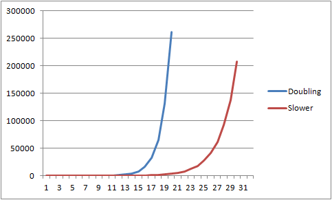
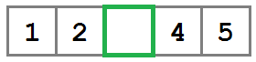

# 第三章阵榜

## 概述

有时，您希望链表具有灵活的大小和易用性，但需要对数组进行直接(恒定时间)索引。在这些情况下，一个`ArrayList`可以提供一个合理的中间地带。

`ArrayList`是实现`IList<T>`接口的集合，但是由数组而不是链表支持。像链表一样，可以添加任意数量的项(仅受可用内存的限制)，但在所有其他方面都像数组。

## 类别定义

`ArrayList`类实现了`IList<T>`接口。`IList<T>`提供了`ICollection<T>`的所有方法和属性，同时还增加了直接索引和基于索引的插入和移除。下面的代码示例使用 Visual Studio 2010 的**实现接口**命令生成存根。

下面的代码示例还包括对生成的存根的三个补充:

*   一排`T (_items)`。该数组将保存集合中的项。
*   将数组初始化为大小 0 的默认构造函数。
*   接受整数长度的构造函数。该长度将成为阵列的默认容量。记住数组的容量和集合`Count`不是一回事。当使用非默认构造函数时，可能会有一些场景允许用户向`ArrayList`类提供大小调整提示，以最小化需要重新分配内部数组的次数。

```cs
    public class ArrayList<T> : System.Collections.Generic.IList<T>
    {
        T[] _items;

        public ArrayList()
            : this(0)
        {
        }

        public ArrayList(int length)
        {
            if (length < 0)
            {
                throw new ArgumentException("length");
            }

            _items = new T[length];
        }

        public int IndexOf(T item)
        {
            throw new NotImplementedException();
        }

        public void Insert(int index, T item)
        {
            throw new NotImplementedException();
        }

        public void RemoveAt(int index)
        {
            throw new NotImplementedException();
        }

        public T this[int index]
        {
            get
            {
                throw new NotImplementedException();
            }
            set
            {
                throw new NotImplementedException();
            }
        }

        public void Add(T item)
        {
            throw new NotImplementedException();
        }

        public void Clear()
        {
            throw new NotImplementedException();
        }

        public bool Contains(T item)
        {
            throw new NotImplementedException();
        }

        public void CopyTo(T[] array, int arrayIndex)
        {
            throw new NotImplementedException();
        }

        public int Count
        {
            get { throw new NotImplementedException(); }
        }

        public bool IsReadOnly
        {
            get { throw new NotImplementedException(); }
        }

        public bool Remove(T item)
        {
            throw new NotImplementedException();
        }

        public System.Collections.Generic.IEnumerator<T> GetEnumerator()
        {
            throw new NotImplementedException();
        }

        System.Collections.IEnumerator System.Collections.IEnumerable.GetEnumerator()
        {
            throw new NotImplementedException();
        }
    }

```

## 插入

将一个项目添加到`ArrayList`中是数组和链表之间真正的区别所在。这有两个原因。第一个是`ArrayList`支持在集合的中间插入值，而链表支持在列表的开头或结尾添加项目。第二个是，向链表添加一个项目总是一个 *O* (1)操作，但是向一个`ArrayList`添加项目不是一个 *O* (1)就是一个 *O* ( *n* )操作。

### 增长数组

随着项被添加到集合中，内部数组最终可能会变满。发生这种情况时，需要执行以下操作:

1.  分配一个更大的数组。
2.  将元素从较小的数组复制到较大的数组。
3.  将内部数组更新为更大的数组。

在这一点上，我们唯一需要回答的问题是新阵列应该有多大？这个问题的答案由`ArrayList`增长政策来定义。

我们将研究两种增长策略，对于每种策略，我们将研究阵列增长的速度以及它对性能的影响。

#### 加倍(单声道和转子)

我们可以在线查看`ArrayList`类的两个实现: [Mono](https://github.com/mono/mono/blob/master/mcs/class/corlib/System.Collections/ArrayList.cs) 和 [Rotor](http://www.123aspx.com/rotor/RotorSrc.aspx?rot=39823) 。它们都使用一种简单的算法，每次需要分配时，该算法会将数组的大小增加一倍。如果阵列大小为 0，默认容量为 16。算法是:

```cs
    size = size == 0 ? 1 : size * 2;

```

该算法的分配和数组副本较少，但平均比 Java 方法浪费更多的空间。换句话说，它偏向于有更多的 *O* (1)个插入，这应该会减少集合执行耗时的分配和复制操作的次数。这是以更大的平均内存占用以及平均更多的空阵列插槽为代价的。

#### 增长放缓(Java)

Java 使用了类似的方法，但是数组的增长稍微慢一点。它用来增长数组的算法是:

```cs
    size = (size * 3) / 2 + 1;

```

该算法的增长曲线较慢，这意味着它偏向于以更多分配为代价来减少内存开销。让我们看看这两种算法对于一个增加了 20 多万个项目的`ArrayList`的增长曲线。



图 6:200，000 多个项目的 Mono/Rotor 与 Java 的增长曲线

在这个图中可以看到，倍增算法需要 19 次分配才能跨越 200，000 的边界，而较慢的(Java)算法需要 30 次分配才能到达相同的点。

那么哪一个是正确的呢？答案没有对错。加倍执行更少的 *O* ( *n* )操作，但平均内存开销更大。较慢的增长算法执行更多的 *O* ( *n* )操作，但内存开销较少。对于通用集合，两种方法都是可以接受的。您的问题域可能有特定的要求，使一个更有吸引力，或者它可能要求您创建另一种方法。无论您采取什么方法，集合的基本行为都将保持不变。

我们的`ArrayList`课将使用加倍(单声道/转子)方法。

```cs
    private void GrowArray()
    {
        int newLength = _items.Length == 0 ? 16 : _items.Length << 1;

        T[] newArray = new T[newLength];

        _items.CopyTo(newArray, 0);

        _items = newArray;
    }

```

### 插入

| 行为 | 在集合中的指定索引处添加提供的值。如果指定的索引等于或大于`Count`，将引发异常 |
| 表演 | *O* ( *n* ) |

在特定索引处插入需要将插入点后的所有项目向右移动一个。如果后备阵列已满，则需要先增加它，然后才能进行转移。

在下面的示例中，有一个容量为五项的数组，其中四项正在使用中。值“3”将作为数组中的第三项插入(索引 2)。


图 7:插入前的阵列(末端有一个开放的插槽)



图 8:向右移动后的数组


图 9:在开放插槽中添加了新项目的数组

```cs
    public void Insert(int index, T item)
    {
        if (index >= Count)
        {
            throw new IndexOutOfRangeException();
        }

        if (_items.Length == this.Count)
        {
            this.GrowArray();
        }

        // Shift all the items following index one slot to the right.
        Array.Copy(_items, index, _items, index + 1, Count - index);

        _items[index] = item;

        Count++;
    }

```

### 添加

| 行为 | 将提供的值追加到集合的末尾。 |
| 表演 | *O* (1)当阵容量大于`Count`时； *O* ( *n* )需要成长的时候。 |

```cs
    public void Add(T item)
    {
        if (_items.Length == Count)
        {
            GrowArray();
        }

        _items[Count++] = item;
    }

```

## 删除

### 删除

| 行为 | 移除指定索引处的值。 |
| 表演 | *O* ( *n* ) |

在索引处移除本质上是`Insert`操作的反向。该项将从数组中移除，数组将向左移动。


图 10:移除值 3 之前的数组


图 11:移除了值 3 的数组


图 12:阵列向左移动，释放了最后一个插槽

```cs
    public void RemoveAt(int index)
    {
        if (index >= Count)
        {
            throw new IndexOutOfRangeException();
        }

        int shiftStart = index + 1;
        if (shiftStart < Count)
        {
            // Shift all the items following index one slot to the left.
            Array.Copy(_items, shiftStart, _items, index, Count - shiftStart);
        }

        Count--;
    }

```

### 移除

| 行为 | 移除集合中值与提供的值匹配的第一项。如果某个值被删除，则返回`true`。否则返回`false`。 |
| 表演 | *O* ( *n* ) |

```cs
    public bool Remove(T item)
    {
        for (int i = 0; i < Count; i++)
        {
            if (_items[i].Equals(item))
            {
                RemoveAt(i);
                return true;
            }
        }

        return false;
    }

```

## 索引

### 指数

| 行为 | 返回集合中第一个索引，其值等于提供的值。如果没有找到匹配的值，返回`-1`。 |
| 表演 | *O* ( *n* ) |

```cs
    public int IndexOf(T item)
    {
        for (int i = 0; i < Count; i++)
        {
            if (_items[i].Equals(item))
            {
                return i;
            }
        }

        return -1;
    }

```

### 项

| 行为 | 获取或设置指定索引处的值。 |
| 表演 | *O* (1) |

```cs
    public T this[int index]
    {
        get
        {
            if(index < Count)
            {
                return _items[index];
            }

            throw new IndexOutOfRangeException();
        }
        set
        {
            if (index < Count)
            {
                _items[index] = value;
            }
            else
            {
                throw new IndexOutOfRangeException();
            }
        }
    }

```

### 包含

| 行为 | 如果集合中存在提供的值，则返回`true`。否则返回`false`。 |
| 表演 | *O* ( *n* ) |

```cs
    public bool Contains(T item)
    {
        return IndexOf(item) != -1;
    }

```

## 列举

### 获取分子

| 行为 | 返回一个`IEnumerator<T>`实例，该实例允许按照从第一个到最后一个的顺序枚举数组列表值。 |
| 表演 | 返回枚举器实例是一个 *O* (1)操作。枚举每一项都是一个 *O* ( *n* )操作。 |

请注意，我们不能简单地遵从`_items`数组的`GetEnumerator`，因为这也将返回当前没有填充数据的项目。

```cs
    public System.Collections.Generic.IEnumerator<T> GetEnumerator()
    {
        for (int i = 0; i < Count; i++)
        {
            yield return _items[i];
        }
    }

    System.Collections.IEnumerator System.Collections.IEnumerable.GetEnumerator()
    {
        return GetEnumerator();
    }

```

## 剩余 IList < T >方法

### 晴

| 行为 | 从数组列表中移除所有项。 |
| 表演 | *O* (1) |

实现`Clear`时有两种选择。该数组可以单独使用，也可以作为 0 长度数组重新分配。这个实现重新分配一个长度为 0 的新数组。当使用`Add`或`Insert`方法将一个项目添加到数组中时，将分配一个更大的数组。

```cs
    Public void Clear()
    {
        _items = new T[0];
        Count = 0;
    }

```

### 抄

| 行为 | 从指定的数组索引开始，将内部数组的内容从头到尾复制到提供的数组中。 |
| 表演 | *O* ( *n* ) |

请注意，该方法不是简单地遵从`_items`数组的`CopyTo`方法。这是因为我们只想复制从索引`0`到`Count`的范围，而不是整个阵列容量。使用`Array.Copy`允许我们指定要复制的项目数量。

```cs
    public void CopyTo(T[] array, int arrayIndex)
    {
        Array.Copy(_items, 0, array, arrayIndex, Count);
    }

```

### 计数

| 行为 | 返回一个整数，该整数指示集合中当前的项数。列表为空时，值为`0`。 |
| 表演 | *O* (1) |

`Count`只是一个带有公共 getter 和私有 setter 的自动实现的属性。真正的行为发生在操作集合内容的函数中。

```cs
    public int Count
    {
        get;
        private set;
    }

```

### 只读

| 行为 | 返回`false`，因为集合不是只读的。 |
| 表演 | *O* (1) |

```cs
    public bool IsReadOnly
    {
        get { return false; }
    }

```