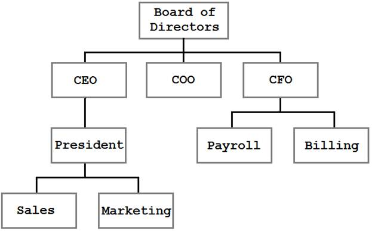
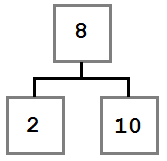
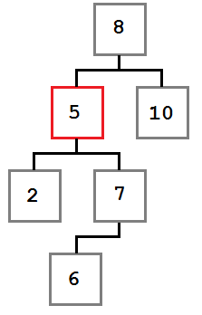

# 五、二叉搜索树

到目前为止，我们已经看到了以线性方式组织数据的数据结构。链表包含从单个起始节点到单个终止节点的数据。数组将数据保存在连续的一维块中。

在本章中，我们将看到增加一个维度将如何允许我们引入一个新的数据结构:树。具体来说，我们将看到一种被称为二叉搜索树的树。二分搜索法树采用一般的树结构，并应用一组简单的规则来定义树的结构。

在我们了解这些规则之前，让我们先了解一下什么是树。

## 树概述

树是一种数据结构，其中每个节点都有 0 个或更多的子节点。例如，我们可能有这样一棵树:



图 22:组织树结构

在这个树中，我们可以看到企业的组织结构。块代表公司内部的人员或部门，线代表报告关系。树是呈现和存储这些信息的一种非常有效、合乎逻辑的方式。

上图所示的树是一个普通的树。它代表父/子关系，但是结构没有规则。首席执行官有一个直接下属，但也可能没有或有二十个。在图中，**销售**显示在**营销**的左边，但是那个点单没有意义。事实上，唯一可观察到的约束是每个节点最多有一个父节点(而最顶层的节点**董事会**没有父节点)。

## 二叉搜索树概况

二叉搜索树使用与上图所示的普通树相同的基本结构，但增加了一些规则。这些规则是:

1.  每个节点可以有 0、1 或 2 个子节点。
2.  任何小于节点值的值都将传递给左子节点(或左子节点的子节点)。
3.  大于或等于节点值的任何值都将传递给正确的子节点(或其子节点)。

让我们看看使用这些规则构建的树:


图 23:二叉搜索树

请注意我们指定的约束是如何在图中实施的。根节点(8)左边的每个值都小于 8，右边的每个值都大于或等于根节点。这条规则递归地应用于沿途的每个节点。

考虑到这棵树，让我们想想建造它的步骤。当进程开始时，树是空的，然后添加了一个值 8。因为是第一次增值，所以被放到了根(最终母公司)的位置。

我们不知道添加其余节点的确切顺序，但是我将给出一个可能的路径。将使用接受该值的名为`Add`的方法添加值。

```cs
    BinaryTree<int> tree = new BinaryTree<int>();
    tree.Add(8);
    tree.Add(4);
    tree.Add(2);
    tree.Add(3);
    tree.Add(10);
    tree.Add(6);
    tree.Add(7);

```

让我们浏览一下前几项。

先加 8，成为根。接下来，添加了 4。由于 4 小于 8，需要按照[规则#2](#Rule2) 到 8 的左边。因为 8 的左边没有孩子，所以 4 成为 8 的最左边的孩子。

接下来添加 2。2 小于 8，所以它向左。8 左边已经有一个节点，所以再次执行比较逻辑。2 小于 4，4 没有左子，所以 2 成为 4 的左子。

接下来添加 3，并将其放在 8 和 4 的左边。与 2 节点相比，它更大，因此根据[规则#3](#Rule3) ，在 2 的右侧添加 3。

在每个节点比较值，然后一遍又一遍地检查每个子节点，直到找到合适的槽的循环对每个值重复，直到创建最终的树结构。

## 节点类

`BinaryTreeNode`代表树中的单个节点。它包含对左右子节点(如果没有，则为空)、节点值和`IComparable.CompareTo`方法的引用，该方法允许比较节点值，以确定该值应该在当前节点的左边还是右边。这是整个`BinaryTreeNode`班——如你所见，非常简单。

```cs
    class BinaryTreeNode<TNode> : IComparable<TNode>
        where TNode : IComparable<TNode>
    {
        public BinaryTreeNode(TNode value)
        {
            Value = value;
        }

        public BinaryTreeNode<TNode> Left { get; set; }
        public BinaryTreeNode<TNode> Right { get; set; }
        public TNode Value { get; private set; }

        /// <summary>
        /// Compares the current node to the provided value.
        /// </summary>
        /// <param name="other">The node value to compare to</param>
        /// <returns>1 if the instance value is greater than
        /// the provided value, -1 if less, or 0 if equal.</returns>
        public int CompareTo(TNode other)
        {
            return Value.CompareTo(other);
        }
    }

```

## 二叉搜索树班

`BinaryTree`类提供了操纵树所需的基本方法:`Add`、`Remove`、一个`Contains`方法来确定树中是否存在一个项目、几种遍历和枚举方法(这些方法允许我们以各种明确定义的顺序枚举树中的节点)以及正常的`Count`和`Clear`方法。

要初始化树，有一个 [`BinaryTreeNode`](#_The_Node_Class) 引用代表树的头(根)节点，还有一个整数记录树中有多少项。

```cs
    public class BinaryTree<T> : IEnumerable<T>
        where T : IComparable<T>
    {
        private  BinaryTreeNode<T> _head;
        private int _count;

        public void Add(T value)
        {
            throw new NotImplementedException();
        }

        public bool Contains(T value)
        {
            throw new NotImplementedException();
        }

        public bool Remove(T value)
        {
            throw new NotImplementedException();
        }

        public void PreOrderTraversal(Action<T> action)
        {
            throw new NotImplementedException();
        }

        public void PostOrderTraversal(Action<T> action)
        {
            throw new NotImplementedException();
        }

        public void InOrderTraversal(Action<T> action)
        {
            throw new NotImplementedException();
        }

        public IEnumerator<T> GetEnumerator()
        {
            throw new NotImplementedException();
        }

        System.Collections.IEnumerator System.Collections.IEnumerable.GetEnumerator()
        {
            throw new NotImplementedException();
        }

        public void Clear()
        {
            throw new NotImplementedException();
        }

        public int Count
        {
            get;
        }
    }

```

### 添加

| 行为 | 将提供的值添加到树中的正确位置。 |
| 表演 | *O* (对数 *n* )平均； *O* ( *n* )最坏的情况。 |

向树中添加一个节点并不十分复杂，当问题被简化为递归算法时，它会变得更加容易。有两种情况需要考虑:

*   树是空的。
*   树不是空的。

在第一种情况下，我们只需分配新节点并将其添加到树中。在第二种情况下，我们将该值与节点的值进行比较。如果我们试图添加的值小于该节点的值，将对该节点的左子节点重复该算法。否则，将对节点的右子节点重复该操作。

```cs
    public void Add(T value)
    {
        // Case 1: The tree is empty. Allocate the head.
        if (_head == null)
        {
            _head = new BinaryTreeNode<T>(value);
        }
        // Case 2: The tree is not empty, so recursively
        // find the right location to insert the node.
        else
        {
            AddTo(_head, value);
        }

        _count++;
    }

    // Recursive add algorithm.
    private void AddTo(BinaryTreeNode<T> node, T value)
    {
        // Case 1: Value is less than the current node value
        if (value.CompareTo(node.Value) < 0)
        {
            // If there is no left child, make this the new left,
            if (node.Left == null)
            {
                node.Left = new BinaryTreeNode<T>(value);
            }
            else
            {
                // else add it to the left node.
                AddTo(node.Left, value);
            }
        }
        // Case 2: Value is equal to or greater than the current value.
        else
        {
            // If there is no right, add it to the right,
            if (node.Right == null)
            {
                node.Right = new BinaryTreeNode<T>(value);
            }
            else
            {
                // else add it to the right node.
                AddTo(node.Right, value);
            }
        }
    }

```

### 移除

| 行为 | 移除找到的具有指示值的第一个节点。 |
| 表演 | *O* (对数 *n* )平均； *O* ( *n* )最坏的情况。 |

从树中移除一个值是一个概念上简单的操作，但实际上变得异常复杂。

在高层次上，操作很简单:

1.  找到要移除的节点。
2.  把它拿走。

第一步很简单，正如我们将看到的，使用 [`Contains`](#_Contains) 方法使用的相同机制来完成。然而，一旦识别出要移除的节点，该操作可以采取由要移除的节点周围的树的状态指示的三个路径之一。这三种状态将在以下三种情况中描述。

#### 情况 1:要删除的节点没有合适的子节点。


图 24:案例 1—要删除的节点没有合适的子节点

在这种情况下，移除操作可以简单地将左边的子节点(如果有)移动到被移除节点的位置。生成的树如下所示:



图 25:案例 1—删除后的树状态

#### 情况 2:要移除的节点有一个右子节点，而右子节点没有左子节点。


图 26:案例 2—要移除的节点有一个没有左子节点的右子节点

在这种情况下，我们希望将被移除节点的右子节点(6)移动到被移除节点的位置。生成的树如下所示:


图 27:案例 2—删除后的树状态

#### 情况 3:要移除的节点有一个右子节点，而右子节点又有一个左子节点。



图 28:案例 3—要移除的节点有一个右子节点和一个左子节点

在这种情况下，被移除节点的最左边的子节点必须放入被移除节点的插槽中。

让我们花一分钟来思考为什么这是真的。关于从被移除的节点开始的子树(即根是值为 5 的节点的子树)，我们知道两个事实。

*   节点右侧的每个值都大于或等于 5。
*   右边子树中的最小值是最左边的节点。

我们需要在被移除节点的槽中放置一个值，该值小于或等于它右边的每个节点。为此，我们需要在右侧获得最小值。因此我们需要右边孩子最左边的节点。

删除节点后，树将如下所示:


图 29:案例 3—移除节点后的树

现在我们已经理解了三个删除场景，让我们来看看实现它的代码。

需要注意的是:`FindWithParent`方法(参见[包含](#_Contains)部分)返回要移除的节点以及被移除节点的父节点。这样做是因为当节点被移除时，我们需要更新父节点的`Left`或`Right`属性以指向新节点。

如果所有节点都保持对其父节点的引用，我们可以避免这样做，但这将引入每个节点的内存开销和簿记成本，而这些仅在这种情况下需要。

```cs
    public bool Remove(T value)
    {
        BinaryTreeNode<T> current, parent;

        // Find the node to remove.
        current = FindWithParent(value, out parent);

        if (current == null)
        {
            return false;
        }

        _count--;

        // Case 1: If current has no right child, current's left replaces current.
        if (current.Right == null)
        {
            if (parent == null)
            {
                _head = current.Left;
            }
            else
            {
                int result = parent.CompareTo(current.Value);
                if (result > 0)
                {
                    // If parent value is greater than current value,
                    // make the current left child a left child of parent.
                    parent.Left = current.Left;
                }
                else if (result < 0)
                {
                    // If parent value is less than current value,
                    // make the current left child a right child of parent.
                    parent.Right = current.Left;
                }
            }
        }
        // Case 2: If current's right child has no left child, current's right child
        //         replaces current.
        else if (current.Right.Left == null)
        {
            current.Right.Left = current.Left;

            if (parent == null)
            {
                _head = current.Right;
            }
            else
            {
                int result = parent.CompareTo(current.Value);
                if (result > 0)
                {
                    // If parent value is greater than current value,
                    // make the current right child a left child of parent.
                    parent.Left = current.Right;
                }
                else if (result < 0)
                {
                    // If parent value is less than current value,
                    // make the current right child a right child of parent.
                    parent.Right = current.Right;
                }
            }
        }
        // Case 3: If current's right child has a left child, replace current with current's
        //         right child's left-most child.
        else
        {
            // Find the right's left-most child.
            BinaryTreeNode<T> leftmost = current.Right.Left;
            BinaryTreeNode<T> leftmostParent = current.Right;

            while (leftmost.Left != null)
            {
                leftmostParent = leftmost;
                leftmost = leftmost.Left;
            }

            // The parent's left subtree becomes the leftmost's right subtree.
            leftmostParent.Left = leftmost.Right;

            // Assign leftmost's left and right to current's left and right children.
            leftmost.Left = current.Left;
            leftmost.Right = current.Right;

            if (parent == null)
            {
                _head = leftmost;
            }
            else
            {
                int result = parent.CompareTo(current.Value);
                if (result > 0)
                {
                    // If parent value is greater than current value,
                    // make leftmost the parent's left child.
                    parent.Left = leftmost;
                }
                else if (result < 0)
                {
                    // If parent value is less than current value,
                    // make leftmost the parent's right child.
                    parent.Right = leftmost;
                }
            }
        }

        return true;
    }

```

### 包含

| 行为 | 如果树包含提供的值，返回`true`。否则返回`false`。 |
| 表演 | *O* (对数 *n* )平均； *O* ( *n* )最坏的情况。 |

`Contains`遵从`FindWithParent`，执行简单的树行走算法，从头节点开始执行以下步骤:

1.  如果当前节点是`null`，返回`null`。
2.  如果当前节点值等于搜索值，则返回当前节点。
3.  如果查找的值小于当前值，则将当前节点设置为左子节点，并转到步骤#1。
4.  将当前节点设置为右子节点，然后转到步骤#1。

由于`Contains`返回`Boolean`，返回值由`FindWithParent`是返回非空的`BinaryTreeNode`(真)还是空的(假)决定。

`FindWithParent`方法也被 [`Remove`](#_Remove) 方法所使用。`out`参数父项不被`Contains`使用。

```cs
    public bool Contains(T value)
    {
        // Defer to the node search helper function.
        BinaryTreeNode<T> parent;
        return FindWithParent(value, out parent) != null;
    }

    /// <summary>
    /// Finds and returns the first node containing the specified value. If the value
    /// is not found, it returns null. Also returns the parent of the found node (or null)
    /// which is used in Remove.
    /// </summary>
    private BinaryTreeNode<T> FindWithParent(T value, out BinaryTreeNode<T> parent)
    {
        // Now, try to find data in the tree.
        BinaryTreeNode<T> current = _head;
        parent = null;

        // While we don't have a match...
        while (current != null)
        {
            int result = current.CompareTo(value);

            if (result > 0)
            {
                // If the value is less than current, go left.
                parent = current;
                current = current.Left;
            }
            else if (result < 0)
            {
                // If the value is more than current, go right.
                parent = current;
                current = current.Right;
            }
            else
            {
                // We have a match!
                break;
            }
        }

        return current;
    }

```

### 计数

| 行为 | 返回树中的值的数量(如果为空，则为 0)。 |
| 表演 | *O* (1) |

`count`字段通过`Add`方法递增，通过`Remove`方法递减。

```cs
    public int Count
    {
        get
        {
            return _count;
        }
    }

```

### 晴

| 行为 | 从树中移除所有节点。 |
| 表演 | *O* (1) |

```cs
    public void Clear()
    {
        _head = null;
        _count = 0;
    }

```

## 遍历

树遍历是允许以明确定义的顺序处理树中每个值的算法。对于所讨论的每种算法，下面的树将用作样本输入。

下面的例子都接受一个`Action<T>`参数。此参数定义遍历处理每个节点时将应用于该节点的操作。

每次遍历的`Order`部分将指示下一棵树遍历的顺序。


图 30:遍历排序结果的示例树

### 预订

| 行为 | 对预订单中的每个值执行提供的操作(参见下面的描述)。 |
| 表演 | *O* ( *n* ) |
| 命令 | 4, 2, 1, 3, 5, 7, 6, 8 |

前序遍历处理当前节点，然后移动到左子节点和右子节点。从根节点 4 开始，执行值为 4 的操作。然后处理左节点及其所有子节点，接着处理右节点及其所有子节点。

前序遍历的一个常见用法是创建一个树的副本，它不仅包含相同的节点值，还包含相同的层次结构。

```cs
    public void PreOrderTraversal(Action<T> action)
    {
        PreOrderTraversal(action, _head);
    }

    private void PreOrderTraversal(Action<T> action, BinaryTreeNode<T> node)
    {
        if (node != null)
        {
            action(node.Value);
            PreOrderTraversal(action, node.Left);
            PreOrderTraversal(action, node.Right);
        }
    }

```

### 邮政编码

| 行为 | 对后序中的每个值执行提供的操作(参见下面的描述)。 |
| 表演 | *O* ( *n* ) |
| 命令 | 1, 3, 2, 6, 8, 7, 5, 4 |

后序遍历递归访问节点的左右子节点，然后在子节点完成后对当前节点执行操作。

后置遍历通常用于删除整个树，例如在编程语言中，每个节点都必须被释放，或者用于删除子树。这是因为根节点是最后处理(删除)的，并且其子节点的处理方式将使`Remove`算法需要执行的工作量最小化。

```cs
    public void PostOrderTraversal(Action<T> action)
    {
        PostOrderTraversal(action, _head);
    }

    private void PostOrderTraversal(Action<T> action, BinaryTreeNode<T> node)
    {
        if (node != null)
        {
            PostOrderTraversal(action, node.Left);
            PostOrderTraversal(action, node.Right);
            action(node.Value);
        }
    }

```

### 哼哼哼

| 行为 | 依次对每个值执行提供的操作(请参见下面的描述)。 |
| 表演 | *O* ( *n* ) |
| 命令 | 1, 2, 3, 4, 5, 6, 7, 8 |

有序遍历按照排序顺序处理节点——在前面的示例中，节点将按照从最小到最大的数字顺序进行排序。它通过找到最小的(最左边的)节点，然后在处理较大的(右边的)节点之前处理它来实现这一点。

在必须按排序顺序处理节点的任何时候，都会使用有序遍历。

下面的例子展示了执行有序遍历的两种不同方法。第一种实现递归方法，为每个遍历的节点执行回调。第二个通过使用`<u>[Stack](4.html#_Stack_1)</u>`数据结构移除递归，并返回一个`IEnumerator`以允许直接枚举。

```cs
    Public void InOrderTraversal(Action<T> action)
    {
        InOrderTraversal(action, _head);
    }

    private void InOrderTraversal(Action<T> action, BinaryTreeNode<T> node)
    {
        if (node != null)
        {
            InOrderTraversal(action, node.Left);

            action(node.Value);

            InOrderTraversal(action, node.Right);
        }
    }

    public IEnumerator<T> InOrderTraversal()
    {
        // This is a non-recursive algorithm using a stack to demonstrate removing
        // recursion.
        if (_head != null)
        {
            // Store the nodes we've skipped in this stack (avoids recursion).
            Stack<BinaryTreeNode<T>> stack = new Stack<BinaryTreeNode<T>>();

            BinaryTreeNode<T> current = _head;

            // When removing recursion, we need to keep track of whether
            // we should be going to the left node or the right nodes next.
            bool goLeftNext = true;

            // Start by pushing Head onto the stack.
            stack.Push(current);

            while (stack.Count > 0)
            {
                // If we're heading left...
                if (goLeftNext)
                {
                    // Push everything but the left-most node to the stack.
                    // We'll yield the left-most after this block.
                    while (current.Left != null)
                    {
                        stack.Push(current);
                        current = current.Left;
                    }
                }

                // Inorder is left->yield->right.
                yield return current.Value;

                // If we can go right, do so.
                if (current.Right != null)
                {
                    current = current.Right;

                    // Once we've gone right once, we need to start
                    // going left again.
                    goLeftNext = true;
                }
                else
                {
                    // If we can't go right, then we need to pop off the parent node
                    // so we can process it and then go to its right node.
                    current = stack.Pop();
                    goLeftNext = false;
                }
            }
        }
    }

```

### 获取分子

| 行为 | 返回使用`InOrder`遍历算法枚举的枚举数。 |
| 表演 | *O* (1)返回枚举器。列举所有项目的是 *O* ( *n* )。 |

```cs
    public IEnumerator<T> GetEnumerator()
    {
        return InOrderTraversal();
    }

    System.Collections.IEnumerator System.Collections.IEnumerable.GetEnumerator()
    {
        return GetEnumerator();
    }

```