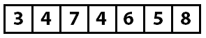
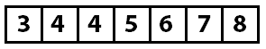
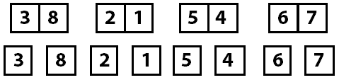
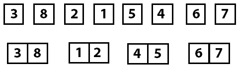
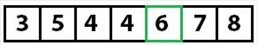
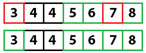

# 第七章排序算法

在本章中，我们将了解用于对数组中的数据进行排序的五种算法。我们将以天真的算法[冒泡排序](#_Bubble_Sort_1)开始，以最常见的通用排序算法[快速排序](#_Quick_Sort_1)结束。

对于每种算法，我将解释排序是如何完成的，并提供关于性能和内存使用的最佳、平均和最坏情况复杂性的信息。

## 互换

为了使排序算法代码更容易阅读，任何需要按索引交换数组中的值的排序算法都将使用一个通用的`Swap`方法。

```cs
    void Swap(T[] items, int left, int right)
    {
        if (left != right)
        {
            T temp = items[left];
            items[left] = items[right];
            items[right] = temp;
        }
    }

```

## 冒泡排序

| 行为 | 使用冒泡排序算法对输入数组进行排序。 |
| 复杂性 | **最佳情况** | **平均情况** | **最坏情况** |
| 时间 | *O* ( *n* ) | *O* ( *n* <sup>2</sup> ) | *O* ( *n* <sup>2</sup> ) |
| 空间 | *O* (1) | *O* (1) | *O* (1) |

冒泡排序是一种天真的排序算法，它通过多次遍历数组来操作，每次都将最大的未排序值移动到数组的右侧(末尾)。

考虑以下未排序的整数数组:


图 36:未排序的整数数组

在第一次通过数组时，比较值 3 和 7。由于 7 大于 3，因此不执行交换。接下来，比较 7 和 4。7 大于 4，因此值被交换，从而将 7 移近数组的末尾一步。该阵列现在如下所示:



图 37:4 和 7 交换了位置

重复这个过程，7 最终会与更大的 8 进行比较，因此无法执行交换，传递会在数组的末尾结束。在第 1 遍结束时，数组如下所示:


图 38:第 1 遍结束时的数组

因为至少执行了一次交换，所以将执行另一次传递。第二次传球后，6 号位已经就位。


图 39:第 2 遍结束时的数组

同样，因为至少执行了一次交换，所以执行了另一次传递。

然而，下一遍发现没有必要交换，因为所有的项目都是按顺序排列的。由于没有执行交换，因此已知数组已被排序，并且排序算法已完成。

```cs
    public void Sort(T[] items)
    {
        bool swapped;

        do
        {
            swapped = false;
            for (int i = 1; i < items.Length; i++)
            {
                if (items[i - 1].CompareTo(items[i]) > 0)
                {
                    Swap(items, i - 1, i);
                    swapped = true;
                }
            }
        } while (swapped != false);
    }

```

## 插入排序

| 行为 | 使用插入排序算法对输入数组进行排序。 |
| 复杂性 | **最佳情况** | **平均情况** | **最坏情况** |
| 时间 | *O* ( *n* ) | *O* ( *n* <sup>2</sup> ) | *O* ( *n* <sup>2</sup> ) |
| 空间 | *O* (1) | *O* (1) | *O* (1) |

插入排序通过对数组进行一次遍历并将当前值插入数组中已经排序的(开始)部分来工作。处理完每个索引后，已知到目前为止遇到的所有内容都已排序，后面的内容都是未知的。

等等什么？

重要的概念是，插入排序是通过对遇到的项目进行排序来工作的。因为它从左到右处理数组，所以我们知道当前索引左边的所有内容都是排序的。此图演示了遇到每个索引时数组是如何排序的:


图 40:通过插入排序处理的数组。

随着处理的继续，数组变得越来越有序，直到它被完全排序。

我们来看一个具体的例子。下面是一个未排序的数组，将使用插入排序进行排序。


图 41:未排序的整数数组

当排序过程开始时，排序算法从索引 0 开始，值为 3。因为在此之前没有任何值，所以已知会对索引 0 以下的数组进行排序。

然后，该算法转到值 7。由于 7 大于已知排序范围(目前仅包括 3)中的所有值，因此已知 7 以下的值是按排序顺序排列的。

此时，已知数组索引 0–1 已排序，2–*n*处于未知状态。

接下来检查索引 2 (4)处的值。因为 4 小于 7，所以已知 4 需要移动到排序数组区域中的适当位置。现在的问题是该值应该插入到排序数组的哪个索引中。这样做的方法是图 43 下面的代码示例中所示的`FindInsertionIndex`。此方法将待插入的值(4)与排序范围内的值进行比较，从索引 0 开始，直到找到应插入该值的点。

此方法确定索引 1(在 3 和 7 之间)是合适的插入点。然后，插入算法(图 43 后面的代码示例中的`Insert`方法)通过从数组中移除要插入的值并将所有值从插入点向右移动移除的项来执行插入。该阵列现在如下所示:


图 42:第一次插入后的数组算法

从索引 0 到 2 的数组现在已知是已排序的，从索引 3 到结尾的所有内容都是未知的。该过程现在再次从索引 3 开始，索引 3 的值为 4。随着算法的继续，在对数组进行排序之前，会出现以下插入。


图 43:进一步插入算法后的数组

当没有要执行的进一步插入时，或者当数组的排序部分是整个数组时，算法完成。

```cs
    public void Sort(T[] items)
    {
        int sortedRangeEndIndex = 1;

        while (sortedRangeEndIndex < items.Length)
        {
            if (items[sortedRangeEndIndex].CompareTo(items[sortedRangeEndIndex - 1]) < 0)
            {
                int insertIndex = FindInsertionIndex(items, items[sortedRangeEndIndex]);
                Insert(items, insertIndex, sortedRangeEndIndex);
            }

            sortedRangeEndIndex++;
        }
    }

    private int FindInsertionIndex(T[] items, T valueToInsert)
    {
        for (int index = 0; index < items.Length; index++)
        {
            if (items[index].CompareTo(valueToInsert) > 0)
            {
                return index;
            }
        }

        throw new InvalidOperationException("The insertion index was not found");
    }

    private void Insert(T[] itemArray, int indexInsertingAt, int indexInsertingFrom)
    {
        // itemArray =       0 1 2 4 5 6 3 7
        // insertingAt =     3
        // insertingFrom =   6
        // actions
        //  1: Store index at in temp     temp = 4
        //  2: Set index at to index from  -> 0 1 2 3 5 6 3 7   temp = 4
        //  3: Walking backward from index from to index at + 1.
        //     Shift values from left to right once.
        //     0 1 2 3 5 6 6 7   temp = 4
        //     0 1 2 3 5 5 6 7   temp = 4
        //  4: Write temp value to index at + 1.
        //     0 1 2 3 4 5 6 7   temp = 4

        // Step 1.
        T temp = itemArray[indexInsertingAt];

        // Step 2.

        itemArray[indexInsertingAt] = itemArray[indexInsertingFrom];

        // Step 3.
        for (int current = indexInsertingFrom; current > indexInsertingAt; current--)
        {
            itemArray[current] = itemArray[current - 1];
        }

        // Step 4.
        itemArray[indexInsertingAt + 1] = temp;
    }

```

## 选择排序

| 行为 | 使用选择排序算法对输入数组进行排序。 |
| 复杂性 | **最佳情况** | **平均情况** | **最坏情况** |
| 时间 | *O* ( *n* ) | *O* ( *n* <sup>2</sup> ) | *O* ( *n* <sup>2</sup> ) |
| 空间 | *O* (1) | *O* (1) | *O* (1) |

选择排序是冒泡排序和插入排序的混合。像冒泡排序一样，它通过从头到尾反复迭代来处理数组，选择一个值并将其移动到正确的位置。然而，与冒泡排序不同，它选择最小的未排序值，而不是最大的值。像插入排序一样，数组的排序部分是数组的开始，而冒泡排序的排序部分是在末尾。

让我们看看如何使用我们一直在使用的相同的未排序数组。


图 44:未排序的整数数组

在第一遍中，算法将尝试找到数组中的最小值，并将其放在第一个索引中。这由`FindIndexOfSmallestFromIndex`执行，它从提供的索引开始查找最小未排序值的索引。

有了这样一个小数组，我们可以知道第一个值 3 是最小值，所以它已经在正确的位置。此时，我们知道数组索引 0 中的值是最小值，因此排序顺序正确。所以现在我们可以开始传递 2 了——这次只看数组条目 1 到 *n* -1。

第二遍将确定 4 是未排序范围中的最小值，并将第二个插槽中的值与 4 所在插槽中的值进行交换(交换 4 和 7)。第二遍完成后，值 4 将被插入其排序位置。


图 45:第二遍后的数组

排序后的范围现在是从索引 0 到索引 1，未排序的范围是从索引 2 到 *n* -1。随着每个后续通道的结束，数组中已排序的部分变大，未排序的部分变小。如果在整个过程中的任何一点都没有执行插入操作，那么就知道数组已经被排序了。否则，该过程将继续，直到知道整个数组已被排序。

再经过两次后，数组被排序:




图 46:排序数组

```cs
    public void Sort(T[] items)
    {
        int sortedRangeEnd = 0;

        while (sortedRangeEnd < items.Length)
        {
            int nextIndex = FindIndexOfSmallestFromIndex(items, sortedRangeEnd);
            Swap(items, sortedRangeEnd, nextIndex);

            sortedRangeEnd++;
        }
    }

    private int FindIndexOfSmallestFromIndex(T[] items, int sortedRangeEnd)
    {
        T currentSmallest = items[sortedRangeEnd];
        int currentSmallestIndex = sortedRangeEnd;

        for (int i = sortedRangeEnd + 1; i < items.Length; i++)
        {
            if (currentSmallest.CompareTo(items[i]) > 0)
            {
                currentSmallest = items[i];
                currentSmallestIndex = i;
            }
        }

        return currentSmallestIndex;
    }

```

## 合并排序

| 行为 | 使用合并排序算法对输入数组进行排序。 |
| 复杂性 | **最佳情况** | **平均情况** | **最坏情况** |
| 时间 | *O* ( *n* log *n* | *O* ( *n* log *n* | *O* ( *n* log *n* |
| 空间 | *O* ( *n* ) | *O* ( *n* ) | *O* ( *n* ) |

### 分治

到目前为止，我们已经看到了线性处理数组的算法。这些算法的优点是以很少的内存开销运行，但代价是运行时间的二次复杂性。使用合并排序，我们将看到我们的第一个分治算法。

分治算法通过将大问题分解成更小、更容易解决的问题来运行。我们在日常生活中看到这些类型的算法。例如，我们在搜索电话簿时使用分治算法。

如果你想在电话簿里找到艾琳·约翰逊这个名字，你不会从 *A* 开始，一页一页地向前翻。相反，你可能会把电话簿翻到中间。如果你打开 M，你会向后翻几页，也许有点太远——也许是 H。然后你会向前翻。你会不断地以越来越小的增量来回翻页，直到最终找到你想要的页面(或者非常接近，向前翻页是有意义的)。

分治算法有多高效？

假设电话簿有 1000 页长。当你打开中间时，你已经把问题分成了两个 500 页的问题。假设你不在正确的页面上，你现在可以选择合适的一面来搜索，并再次将问题分成两半。现在你的问题空间是 250 页。随着问题越来越深入地被切成两半，我们可以看到一本 1000 页的电话簿只需 10 页就可以搜索到。这是执行线性搜索时可能需要的总页数的 1%。

### 合并排序

合并排序的操作是将数组一次又一次地切成两半，直到每一块只有 1 个项目长。然后这些项目按照排序顺序放回一起(合并)。

让我们从下面的数组开始:


图 47:未排序的整数数组

现在我们把阵列切成两半:


图 48:未排序的数组被切成两半

现在，这两个阵列都被反复切成两半，直到每个项目都独立出来:



图 49:未排序的数组被切成两半，直到每个索引都独立出来

现在数组被分成尽可能小的部分，按照排序顺序将这些部分合并在一起的过程就发生了。



图 50:数组分为两组

单个项目变成了两个有序的组，这两个组合并成四个有序的组，然后它们最终全部合并成一个最终的有序数组。


图 51:排列成四组的数组(顶部)和完成的排序(底部)

让我们花点时间思考一下我们需要实施的各个操作:

1.  递归拆分数组的一种方法。`Sort`方法就是这样做的。
2.  一种按排序顺序将项目合并在一起的方法。`Merge`方法就是这样做的。

合并排序的一个性能考虑是，与线性排序算法不同，合并排序将执行其整个拆分和合并逻辑，包括任何内存分配，即使数组已经按排序顺序排列。虽然它比线性排序算法具有更好的最坏情况性能，但它的最好情况性能总是更差。这意味着在对已知接近排序的数据进行排序时，它不是理想的候选项；例如，当向已经排序的数组中插入数据时。

```cs
    public void Sort(T[] items)
    {
        if (items.Length <= 1)
        {
            return;
        }

        int leftSize = items.Length / 2;
        int rightSize = items.Length - leftSize;

        T[] left = new T[leftSize];
        T[] right = new T[rightSize];

        Array.Copy(items, 0, left, 0, leftSize);
        Array.Copy(items, leftSize, right, 0, rightSize);

        Sort(left);
        Sort(right);
        Merge(items, left, right);
    }

    private void Merge(T[] items, T[] left, T[] right)
    {
        int leftIndex = 0;
        int rightIndex = 0;
        int targetIndex = 0;

        int remaining = left.Length + right.Length;

        while(remaining > 0)
        {
            if (leftIndex >= left.Length)
            {
                items[targetIndex] = right[rightIndex++];
            }
            else if (rightIndex >= right.Length)
            {
                items[targetIndex] = left[leftIndex++];
            }
            else if (left[leftIndex].CompareTo(right[rightIndex]) < 0)
            {
                items[targetIndex] = left[leftIndex++];
            }
            else
            {
                items[targetIndex] = right[rightIndex++];
            }

            targetIndex++;
            remaining--;
        }
    }

```

## 快速排序

| 行为 | 使用快速排序算法对输入数组进行排序。 |
| 复杂性 | **最佳情况** | **平均情况** | **最坏情况** |
| 时间 | *O* ( *n* log *n* | *O* ( *n* log *n* | *O* ( *n* <sup>2</sup> ) |
| 空间 | *O* (1) | *O* (1) | *O* (1) |

快速排序是另一种分治排序算法。该算法通过递归执行以下算法来工作:

1.  选择一个透视索引，并将数组划分为两个数组。这是使用示例代码中的随机数完成的。虽然还有其他策略，但我更喜欢这个示例的简单方法。
2.  将小于枢轴值的所有值放在枢轴点的左侧，将枢轴值上方的值放在右侧。枢轴点现在被排序了——右边的所有东西都变大了；左边的东西都比较小。枢轴点处的值位于正确的排序位置。
3.  对未排序的左分区和右分区重复透视和分区算法，直到每个项目都处于已知的排序位置。

让我们对以下数组执行快速排序:


图 52:未排序的整数数组

第一步说我们使用随机索引选择分割点。在示例代码中，这是在这一行完成的:

`int pivotIndex = _pivotRng.Next(left, right);`


图 53:选择随机分区索引

现在我们知道了分区索引(4)，我们查看该点的值(6)，并移动数组中的值，使得小于该值的所有内容都在数组的左侧，而其他所有内容(大于或等于的值)都移动到数组的右侧。请记住，移动这些值可能会改变存储分区值的索引(我们将很快看到)。

在图 57 所示的示例代码中，通过`partition`方法交换值。



图 54:将值移动到分区值的左侧和右侧

此时，我们知道 6 在数组中的正确位置。我们知道这一点是因为左边的每个值都小于分区值，右边的所有值都大于或等于分区值。现在，我们在阵列的两个未排序的分区上重复这个过程。

通过递归调用每个数组分区的`quicksort`方法，在示例代码中完成重复。请注意，这一次左数组在索引 1 处被分区，值为 5。将值移动到适当位置的过程会将值 5 移动到另一个索引。我指出这一点是为了强调您选择的是分区值，而不是分区索引。


图 55:重复枢轴和分区

再次快速排序:



图 56:再次重复枢轴和分区

最后一次快速排序:


图 57:再次重复枢轴和分区

只剩下一个未排序的值，因为我们知道每隔一个值都会排序，所以数组是完全排序的。

```cs
    Random _pivotRng = new Random();

    public void Sort(T[] items)
    {
        quicksort(items, 0, items.Length - 1);
    }

    private void quicksort(T[] items, int left, int right)
    {
        if (left < right)
        {
            int pivotIndex = _pivotRng.Next(left, right);
            int newPivot = partition(items, left, right, pivotIndex);

            quicksort(items, left, newPivot - 1);
            quicksort(items, newPivot + 1, right);
        }
    }

    private int partition(T[] items, int left, int right, int pivotIndex)
    {
        T pivotValue = items[pivotIndex];

        Swap(items, pivotIndex, right);

        int storeIndex = left;

        for (int i = left; i < right; i++)
        {
            if (items[i].CompareTo(pivotValue) < 0)
            {
                Swap(items, i, storeIndex);
                storeIndex += 1;
            }
        }

        Swap(items, storeIndex, right);
        return storeIndex;
    }

```