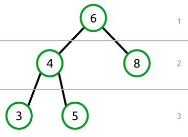
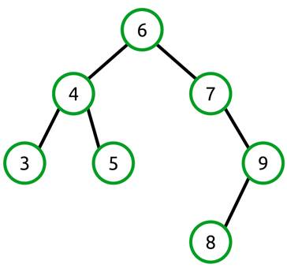
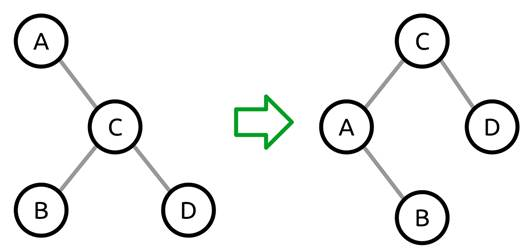
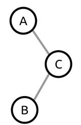
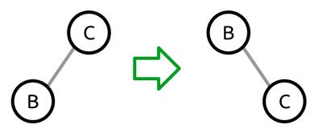
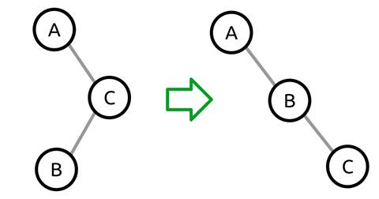
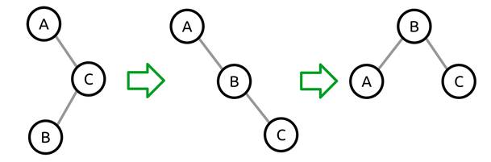
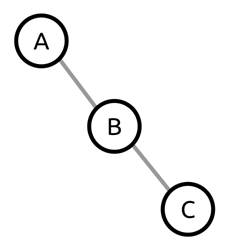

# 第四章 AVL 树

## 平衡树概述

AVL 树是一个自平衡的二叉查找树。它是以它的发明者 G. M .阿德尔森-维尔斯基和 E. M .兰迪斯的名字命名的，他们在 1962 年首次描述了结构和相关的算法。像本系列第一本书中介绍的二叉查找树一样，AVL 树维护这三个简单的规则:

*   树中的每个节点最多有两个子节点(“左”和“右”子节点)。
*   小于当前节点的值将向左移动。
*   大于或等于当前节点的值将位于右侧。

此外，AVL 树添加了一个新规则:

*   左右节点的高度相差不会超过 1。

### 什么是节点高度？

可以测量任何两个相关节点之间的距离。



图 30:节点高度

上图显示了一个二叉树，其中的线表示每组节点的级别。根节点 6 没有父节点，因此处于级别 1。节点 4 和 8 是同级节点，都处于级别 2。节点 3 和 5 处于第 3 级。

使用这些级别，我们可以很容易地找到任何两个相关节点之间的距离。例如，6 和 5 之间的距离是 2(因为节点 6 是级别 1，节点 5 是级别 3；3 减 1 等于 2)。也可以测量非根节点之间的距离。节点 4 和 3 之间的距离是 1。

当谈论一个节点的子树的高度时，我们通常指的是整个子树的最大高度。

例如，在图 30 中，根节点的高度为 2，因为根(级别 1)和最深叶节点(级别 3)之间的最大距离为 2。

有了这样的理解，让我们重新审视新的规则:左右节点的高度差永远不会超过 1。

这意味着左边的子节点和右边的子节点的最大高度相差不超过一个，并且该规则适用于树中的每个节点。看到一些无效的平衡树可能有助于使这一点更加清晰。


图 31:根节点的左侧高度为 2，右侧高度为 0。

这个树是不平衡的，因为根节点的右边子节点的高度是 2，左边子节点的高度是 0(因为没有左边子节点)。

请注意，节点 4 本身是平衡的，因为它的左右高度都是一。



图 32:根节点是平衡的，但是它的右子节点不是

在本例中，根节点的左侧高度为 2，右侧高度为 3。虽然这看起来是平衡的，但是请记住，规则需要递归地应用于树中的每个节点。节点 7 不平衡。它的右侧高度为 2，左侧高度为 0。

## 平衡算法

了解了平衡的含义后，我们现在需要了解确保树平衡的机制。这有两个步骤。第一个决定操作是否会使树处于不平衡状态。这是通过在更改树结构的操作(例如，添加或删除)期间调查左右子节点高度来完成的。第二种方法通过一个称为节点旋转的过程来平衡树。

AVL 树使用两个基本的节点旋转(左和右)和两个使用基本旋转的复合旋转。

### 右旋转

右旋转是从左向右旋转节点的行为，如下图所示:


图 33:右旋转将根的左子级移动到根位置


图 34:右旋转将根的左子级的右子级移动到旧根的左子级

右旋转的算法有三个步骤。这些步骤都是从原根节点(B)的角度出发的。

1.  将当前根替换为它最左边的子根(这将成为新根)。
    *   节点 B 将其左子节点(A)移动到其位置。
2.  将新根的右子级移动到旧根的左子级。
    *   这将把“乙”改为“丁”
3.  将旧根(D)指定为新根(B)的右子。

### 向左旋转

向左旋转是旋转一个向右运行的节点系列的行为，这样系列的中间部分就变成了新的根。


图 35:向左旋转将 B 节点从序列的中间移到根



图 36:向左旋转，新根的左子级移动到旧根的右子级

向左旋转的算法有三个步骤。这些步骤都是从原根节点(A)的角度出发的。

1.  将当前根替换为其直接的右子根(新根)。
    *   这会将 A 节点的右子节点 C 移动到它的位置。
2.  将新根的(C)左子级(B)移动到旧根的(A)右子级。
    *   这将 C > B 更改为 A > B
3.  将旧根(A)指定为新根(C)的左子。

### 左右旋转

左右旋转对根节点的右子节点应用右旋转，然后在根节点应用左旋转。我们究竟为什么要这样做？考虑以下树结构:



图 37:需要左右旋转的不平衡树

特别要注意的是，这棵树的右边的孩子有左边的孩子，没有右边的孩子。这就是这种情况与前面左右旋转示例中显示的示例树的区别。

树太重了，所以我们的本能反应是向右旋转。使用前面描述的右旋转算法，我们执行以下操作:

1.  将 C 节点移动到根位置。
2.  把 B 从 C 的左孩子移到 A 的右孩子。
3.  将 A 指定为 C 的左子级。

不幸的是，当我们这样做时，结果树仍然是不平衡的。


图 38:应用左旋转后，树仍然不平衡

在这一点上，天真的解决方案是应用右旋转，这将使我们回到我们开始的地方。相反，我们需要通过首先对正确的子对象执行正确的旋转来改变树结构。

因为我们正在执行右子节点(C)的右旋转，所以我们可以暂时忽略根节点(A)。



图 39:右旋转前后的右子树。

右旋转将 B 节点移动到根位置，将 C 移动到其右子节点，并将旧根(C)指定为新根(B)的新右子节点。

在较大的树的上下文中，我们的旋转变换了树，如下所示:



图 40:在右边的孩子身上进行的右旋转

结果树(A > B > C)是我们知道如何使用左旋转算法旋转的东西。整个过程如下所示:



图 41:整个左右旋转过程

### 左右旋转

左右旋转只是与左右旋转相反。我们从一个不平衡的树开始，其中根节点有一个左子节点，它有一个右子节点，但没有左子节点。一旦我们确定了这种情况，解决方案是对左子对象应用左旋转，然后对根对象应用右旋转。整个左右旋转过程如下图所示:


图 42:整个左右旋转过程

### 重量和平衡系数

现在我们已经知道了四种旋转类型，我们需要知道当一棵树被确定为不平衡时，应该选择哪一种。这是通过两种测量完成的:

*   重量
*   平衡系数

沉重很简单，就是左右子节点高度之差。如果一棵树的左高较大，则称之为“左重”。反之，如果它有较大的右高，则称之为“右重”。

平衡系数是左右高度之差。例如，如果树的右子节点高度为 5，左子节点高度为 3，则平衡因子为 2。同样，如果高度颠倒，平衡系数将为-2。


图 43:右重节点(A)。它的右边的孩子(C)有一个平衡因子-1，因为平衡因子是 C (0)的右边高度和左边高度(1)的差值。



图 44:一个右重节点(A)。它的右孩子(B)的平衡系数为 1，因为它的右孩子身高(1)和左孩子身高(0)之差为 1。

我们将在[平衡](#heading_id_89)和[旋转方法](#heading_id_90)部分看到这一切是如何结合在一起的，其中显示了用于确定运行哪个旋转和实际旋转的代码。

## 反斜线 Class

`AVLTreeNode`是 AVL 树中的单个节点。它提供属性来访问节点的左右子节点、节点的值以及节点所在的树的引用。

此外，它还提供了确定左右儿童身高、其[重量和平衡系数](#heading_id_89)所需的所有方法，并提供了执行[四旋转](#heading_id_90)类型的方法。

```cs
    public class AVLTreeNode<TNode> : IComparable<TNode>
        where TNode : IComparable
    {
        AVLTree<TNode> _tree;
        AVLTreeNode<TNode> _left;
        AVLTreeNode<TNode> _right;

        public AVLTreeNode(TNode value, AVLTreeNode<TNode> parent, AVLTree<TNode> tree)
        {
            Value = value;
            Parent = parent;
            _tree = tree;
        }

        public AVLTreeNode<TNode> Left
        {
            get
            {
                return _left;
            }
            internal set
            {
                _left = value;
                if (_left != null)
                {
                    _left.Parent = this;
                }
            }
        }

        public AVLTreeNode<TNode> Right
        {
            get
            {
                return _right;
            }
            internal set
            {
                _right = value;
                if (_right != null)
                {
                    _right.Parent = this;
                }
            }
        }

        public AVLTreeNode<TNode> Parent { get; internal set; }
        public TNode Value { get; private set; }

        /// <summary>
        /// Compares the current node to the provided value.
        /// </summary>
        /// <param name="other">The node value to compare to.</param>
        /// <returns>1 if the instance value is greater than the provided value, -1 if less, or 0 if equal.</returns>
        public int CompareTo(TNode other)
        {
            return Value.CompareTo(other);
        }

        // The rest of the code for the AVLTreeNode class is
        // in the subsequent sections of this chapter.
    }

```

### 平衡

平衡算法确定是否需要旋转，如果需要，需要执行什么旋转。它首先检查树是否不平衡。

不平衡是通过检查树是右重还是左重来确定的。如果一棵树的右高比左高多 1，它就是右重。相反，如果它的左高度比右高度大 1 以上，则它是左重的。

如果树被确定为不平衡，我们接下来需要确定简单的向右或向左旋转是否足够，或者是否需要向右-向左或向左-向右旋转。

这个决定是通过查看根节点的左或右子节点做出的，这取决于它是右还是左重。接下来，看看平衡因素。这两个比较用于选择旋转算法。

|  | 注意:在这个实现中，树的高度是通过遍历树以找到最长的路径来确定的。这在概念上很简单，但却没有它应有的效率。作为一个练习，考虑可以更有效地确定任何节点高度的其他方法。 |

```cs
    internal void Balance()
    {
        if (State == TreeState.RightHeavy)
        {
            if (Right != null && Right.BalanceFactor < 0)
            {
                LeftRightRotation();
            }
            else
            {
                LeftRotation();
            }
        }
        else if (State == TreeState.LeftHeavy)
        {
            if (Left != null && Left.BalanceFactor > 0)
            {
                RightLeftRotation();
            }
            else
            {
                RightRotation();
            }
        }
    }

    private int MaxChildHeight(AVLTreeNode<TNode> node)
    {
        if (node != null)
        {
            return 1 + Math.Max(MaxChildHeight(node.Left), MaxChildHeight(node.Right));
        }

        return 0;
    }

    private int LeftHeight
    {
        get
        {
            return MaxChildHeight(Left);
        }
    }

    private int RightHeight
    {
        get
        {
            return MaxChildHeight(Right);
        }
    }

    private TreeState State
    {
        get
        {
            if (LeftHeight - RightHeight > 1)
            {
                return TreeState.LeftHeavy;
            }

            if (RightHeight - LeftHeight > 1)
            {
                return TreeState.RightHeavy;
            }

            return TreeState.Balanced;
        }
    }

    private int BalanceFactor
    {
        get
        {
            return RightHeight - LeftHeight;
        }
    }

    enum TreeState
    {
        Balanced,
        LeftHeavy,
        RightHeavy,
    }

```

### 旋转方法

旋转是在[平衡算法](#heading_id_34)部分讨论的算法的实现。`ReplaceRoot`方法处理将子节点移动到根节点位置的机制。原始根的父节点需要更新以指向新的根节点。如果没有父节点，则需要让包含树知道新的树根节点。

```cs
    private void LeftRotation()
    {
        //     a
        //      \
        //       b
        //        \
        //         c
        //
        // becomes
        //       b
        //      / \
        //     a   c

        AVLTreeNode<TNode> newRoot = Right;

        // Replace the current root with the new root.
        ReplaceRoot(newRoot);

        // Take ownership of right's left child as right (now parent).
        Right = newRoot.Left;

        // The new root takes this as its left.
        newRoot.Left = this;
    }

    private void RightRotation()
    {
        //     c (this)
        //    /
        //   b
        //  /
        // a
        //
        // becomes
        //       b
        //      / \
        //     a   c

        AVLTreeNode<TNode> newRoot = Left;

        // Replace the current root with the new root.
        ReplaceRoot(newRoot);

        // Take ownership of left's right child as left (now parent).
        Left = newRoot.Right;

        // The new root takes this as its right.
        newRoot.Right = this;
    }

    private void LeftRightRotation()
    {
        Right.RightRotation();
        LeftRotation();
    }

    private void RightLeftRotation()
    {
        Left.LeftRotation();
        RightRotation();
    }

    private void ReplaceRoot(AVLTreeNode<TNode> newRoot)
    {
        if (this.Parent != null)
        {
            if (this.Parent.Left == this)
            {
                this.Parent.Left = newRoot;
            }
            else if (this.Parent.Right == this)
            {
                this.Parent.Right = newRoot;
            }
        }
        else
        {
            _tree.Head = newRoot;
        }

        newRoot.Parent = this.Parent;
        this.Parent = newRoot;
    }

```

## AVLTree 类

AVL 树类提供了基本的集合方法来添加、移除、枚举和检查树中是否存在值。此外，它还提供了清除树和获取树中节点数的功能。

```cs
    public class AVLTree<T> : IEnumerable<T>
        where T : IComparable
    {
        public AVLTreeNode<T> Head { get;  internal set; }

        public void Add(T value);

        public bool Contains(T value);

        public bool Remove(T value);

        public IEnumerator<T> GetEnumerator();

        System.Collections.IEnumerator System.Collections.IEnumerable.GetEnumerator();

        public void Clear();

        public int Count { get;  private set; }
    }

```

### 添加

| 行为 | 将特定值添加到树中，确保方法完成时树处于平衡状态。 |
| 表演 | *O* (日志 *n* ) |

AVL 树`Add`操作与二叉查找树加法操作几乎相同。它使用本章前面描述的[规则](#Rules)在树上行走。一旦找到合适的节点位置，该节点就被插入到树中。由于树现在可能是不平衡的，节点执行平衡操作以确保当`Add`方法返回时树是平衡的。

```cs
    public void Add(T value)
    {
        // Case 1: The tree is empty--allocate the head.
        if (Head == null)
        {
            Head = new AVLTreeNode<T>(value, null, this);
        }
        // Case 2: The tree is not empty--find the right location to insert.
        else
        {
            AddTo(Head, value);
        }

        Count++;
    }

    // Recursive add algorithm.
    private void AddTo(AVLTreeNode<T> node, T value)
    {
        // Case 1: Value is less than the current node value.
        if (value.CompareTo(node.Value) < 0)
        {
            // If there is no left child, make this the new left.
            if (node.Left == null)
            {
                node.Left = new AVLTreeNode<T>(value, node, this);
            }
            else
            {
                // Else, add it to the left node.
                AddTo(node.Left, value);
            }
        }
        // Case 2: Value is equal to or greater than the current value.
        else
        {
            // If there is no right, add it to the right.
            if (node.Right == null)
            {
                node.Right = new AVLTreeNode<T>(value, node, this);
            }
            else
            {
                // Else, add it to the right node.
                AddTo(node.Right, value);
            }
        }

        node.Balance();
    }

```

### 包含

| 行为 | 如果树中包含特定值，则返回`true`。否则返回`false`。 |
| 表演 | *O* (日志 *n* ) |

一个传统的二叉查找树有 *O* ( *n* )最坏情况的复杂性，因为一个病态的不平衡树基本上是一个链表。因为一个 AVL 树是平衡的，所以我们有保证的复杂性 *O* (日志 *n* )。

```cs
    public bool Contains(T value)
    {
        return Find(value) != null;
    }

    /// <summary>
    /// Finds and returns the first node containing the specified value. If the value
    /// is not found, it returns null. It also returns the parent of the found node (or null)
    /// which is used in Remove.
    /// </summary>
    /// <param name="value">The value to search for.</param>
    /// <param name="parent">The parent of the found node (or null).</param>
    /// <returns>The found node (or null).</returns>
    private AVLTreeNode<T> Find(T value)
    {
        // Now, try to find data in the tree.
        AVLTreeNode<T> current = Head;

        // While we don't have a match...
        while (current != null)
        {
            int result = current.CompareTo(value);

            if (result > 0)
            {
                // If the value is less than current, go left.
                current = current.Left;
            }
            else if (result < 0)
            {
                // If the value is greater than current, go right.
                current = current.Right;
            }
            else
            {
                // We have a match!
                break;
            }
        }

        return current;
    }

```

### 移除

| 行为 | 如果树内存在指定的值，则该值被移除，并且该方法返回`true`。否则返回`false`。 |
| 表演 | *O* (日志 *n* ) |

和`Add`一样，`Remove`方法的工作原理和传统的二叉查找树`Remove`算法一样；但是，它会添加在已删除节点的父节点上执行的平衡操作。

二叉查找树删除算法有些复杂，在 [*数据结构第 1 部分*](http://www.syncfusion.com/resources/techportal/ebooks/datastructurespart1) 中有详细描述。

```cs
    /// <summary>
    /// Removes the first occurrence of the specified value from the tree.
    /// </summary>
    /// <param name="value">The value to remove.</param>
    /// <returns>True if the value was removed; false otherwise.</returns>
    public bool Remove(T value)
    {
        AVLTreeNode<T> current;
        current = Find(value);

        if (current == null)
        {
            return false;
        }

        AVLTreeNode<T> treeToBalance = current.Parent;

        Count--;

        // Case 1: If current has no right child, then current's left replaces current.
        if (current.Right == null)
        {
            if (current.Parent == null)
            {
                Head = current.Left;
                if (Head != null)
                {
                    Head.Parent = null;
                }
            }
            else
            {
                int result = current.Parent.CompareTo(current.Value);
                if (result > 0)
                {
                    // If the parent value is greater than the current value,
                    // make the current left child a left child of parent.
                    current.Parent.Left = current.Left;
                }
                else if (result < 0)
                {
                    // If the parent value is less than the current value,
                    // make the current left child a right child of parent.
                    current.Parent.Right = current.Left;
                }
            }
        }
        // Case 2: If current's right child has no left child, then current's right child
        //         replaces current.
        else if (current.Right.Left == null)
        {
            current.Right.Left = current.Left;

            if (current.Parent == null)
            {
                Head = current.Right;
                if (Head != null)
                {
                    Head.Parent = null;
                }
            }
            else
            {
                int result = current.Parent.CompareTo(current.Value);
                if (result > 0)
                {
                    // If the parent value is greater than the current value,
                    // make the current right child a left child of parent.
                    current.Parent.Left = current.Right;
                }
                else if (result < 0)
                {
                    // If the parent value is less than the current value,
                    // make the current right child a right child of parent.
                    current.Parent.Right = current.Right;
                }
            }
        }
        // Case 3: If current's right child has a left child, replace current with current's
        //         right child's leftmost child.
        else
        {
            // Find the right's leftmost child.
            AVLTreeNode<T> leftmost = current.Right.Left;

            while (leftmost.Left != null)
            {
                leftmost = leftmost.Left;
            }

            // The parent's left subtree becomes the leftmost's right subtree.
            leftmost.Parent.Left = leftmost.Right;

            // Assign leftmost's left and right to current's left and right children.
            leftmost.Left = current.Left;

            leftmost.Right = current.Right;

            if (current.Parent == null)
            {
                Head = leftmost;
                if (Head != null)
                {
                    Head.Parent = null;
                }
            }
            else
            {
                int result = current.Parent.CompareTo(current.Value);
                if (result > 0)
                {
                    // If the parent value is greater than the current value,
                    // make leftmost the parent's left child.
                    current.Parent.Left = leftmost;
                }
                else if (result < 0)
                {
                    // If the parent value is less than the current value,
                    // make leftmost the parent's right child.
                    current.Parent.Right = leftmost;
                }
            }
        }

        if (treeToBalance != null)
        {
            treeToBalance.Balance();
        }
        else
        {
            if (Head != null)
            {
                Head.Balance();
            }
        }

        return true;
    }

```

### 获取分子

| 行为 | 返回一个枚举数，该枚举数执行 AVL 树的有序遍历。 |
| 表演 | *O* (1)返回枚举器。 *O* ( *n* )为调用者枚举每个节点。 |

本系列的第一本书更详细地描述了 inorder(最小到最大值)遍历算法。下面的实现使用一个堆栈来演示在没有递归的情况下执行遍历。

```cs
    /// <summary>
    /// Enumerates the values contained in the binary tree in inorder traversal order.
    /// </summary>
    /// <returns>The enumerator.</returns>
    public IEnumerator<T> InOrderTraversal()
    {
        // This is a non-recursive algorithm using a stack to demonstrate removing
        // recursion to make using the yield syntax easier.
        if (Head != null)
        {
            // Store the nodes we've skipped in this stack (avoids recursion).
            Stack<AVLTreeNode<T>> stack = new Stack<AVLTreeNode<T>>();

            AVLTreeNode<T> current = Head;

            // When removing recursion, we need to keep track of whether
            // we should be going to the left nodes or the right nodes next.
            bool goLeftNext = true;

            // Start by pushing Head onto the stack.
            stack.Push(current);

            while (stack.Count > 0)
            {
                // If we're heading left...
                if (goLeftNext)
                {
                    // Push everything but the leftmost node to the stack.
                    // We'll yield the leftmost after this block.
                    while (current.Left != null)
                    {
                        stack.Push(current);
                        current = current.Left;
                    }
                }

                // Inorder is left -> yield -> right
                yield return current.Value;

                // If we can go right, then do so.
                if (current.Right != null)
                {
                    current = current.Right;

                    // Once we've gone right once, we need to start
                    // going left again.
                    goLeftNext = true;
                }
                else
                {
                    // If we can't go right we need to pop off the parent node
                    // so we can process it and then go to its right node.
                    current = stack.Pop();
                    goLeftNext = false;
                }
            }
        }
    }

    /// <summary>
    /// Returns an enumerator that performs an inorder traversal of the binary tree.
    /// </summary>
    /// <returns>The inorder enumerator.</returns>
    public IEnumerator<T> GetEnumerator()
    {
        return InOrderTraversal();
    }

    /// <summary>
    /// Returns an enumerator that performs an inorder traversal of the binary tree.
    /// </summary>
    /// <returns>The inorder enumerator.</returns>
    System.Collections.IEnumerator System.Collections.IEnumerable.GetEnumerator()
    {
        return GetEnumerator();
    }

```

### 晴

| 行为 | 从树中移除所有节点。 |
| 表演 | *O* (1) |

```cs
    public void Clear()
    {
        Head = null;
        Count = 0;
    }

```

### 计数

| 行为 | 返回树中当前包含的节点数。 |
| 表演 | *O* (1) |

```cs
    public int Count
    {
        get;
        private set;
    }

```