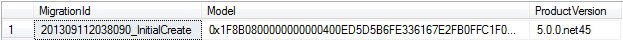
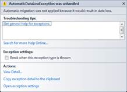
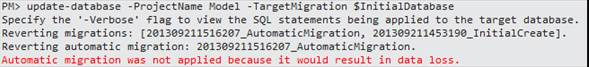
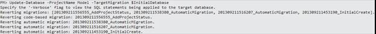
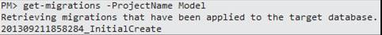

# 三、数据库

## 配置连接字符串

就像我们在第 2 章的部分看到的那样， [DbContext](http://msdn.microsoft.com/en-us/library/system.data.entity.dbcontext.aspx) 类有一些构造函数将应该出现在配置文件中的连接字符串的名称或者完整的连接字符串作为参数。如果使用公共的无参数构造函数，按照惯例，实体框架将在配置文件中查找与上下文类同名的连接字符串。让我们看一些例子。

```cs
public class ProjectsContext : DbContext
{
  public ProjectsContext() { }

  public ProjectsContext(bool alternateConnection) : 
  base(alternateConnection ? "Name=Succinctly" : "Name=ProjectsContext") { }

  public ProjectsContext(String nameOrConnectionString)
  : base(nameOrConnectionString) { }
}

```

如果使用第一个构造函数，配置文件中必须有如下条目。

```cs
<connectionStrings>
  <add name="ProjectsContext" 
  connectionString="Data Source=.\SQLEXPRESS;Integrated Security=SSPI;
  Initial Catalog=Succinctly;MultipleActiveResultSets=true"
  providerName="System.Data.SqlClient"/>
</connectionStrings>

```

|  | 提示:实际的连接字符串格式和提供程序名称取决于数据库引擎。 |

## 生成数据库

### 显式创建

顾名思义，代码优先于数据库。然而，我们仍然需要它，并且必须创造它。EFCF 提供了一些方法来做到这一点。

我们可以检查由连接字符串指定的数据库是否已经存在。我们有一个方法叫做[存在](http://msdn.microsoft.com/en-us/library/gg696588.aspx)就是为了这个目的。

```cs
//check if the database identified by a named connection string exists
var existsByName = Database.Exists("Name=ProjectsContext");

//check if the database identified by a connection string exists
var existsByConnectionString = Database.Exists(@"Data Source=.\SQLEXPRESS;Integrated Security=SSPI;Initial Catalog=Succinctly;MultipleActiveResultSets=true");

```

如果我们决定应该创建它，我们需要启动一个新的上下文，并通过调用 [Create](http://msdn.microsoft.com/en-us/library/system.data.entity.database.create.aspx) 让它为我们这样做。

```cs
using (var ctx = new ProjectsContext())
{
  //create a database explicitly
  ctx.Database.Create();
}

```

也可以通过 [CreateIfNotExists](http://msdn.microsoft.com/en-us/library/system.data.entity.database.createifnotexists.aspx) 一步完成。

```cs
using (var ctx = new ProjectsContext())
{
  //will create the database if it doesn’t already exist
  var wasCreated = ctx.Database.CreateIfNotExists();
}

```

|  | 提示:连接字符串指定的用户，甚至可以是当前的 Windows 用户，需要有创建数据库的访问权限。 |

|  | 提示:如果数据库已经存在，创建将失败，并且 CreateIfNotExists 将返回 false。 |

### 数据库初始化器

让实体框架为我们创建数据库的另一种方法是使用所谓的数据库初始化器。这是一个实现[IDatabaseInitializer<T>](http://msdn.microsoft.com/en-us/library/gg696323.aspx)的类，它可以与上下文的类相关联，并且将执行初始化。初始化是创建数据库及其表的过程。实体框架代码首先附带一些实现:

*   [CreateDatabaseIfNotExists<T>](http://msdn.microsoft.com/en-us/library/gg679221.aspx):只有在数据库和表还不存在的情况下才会创建；这是默认的初始值设定项。
*   [DropcreateDatabaSe always<t context>](http://msdn.microsoft.com/en-us/library/gg679506.aspx):将一直删除并创建数据库，小心！
*   [DropCreateDatabaseifModelChanges<Tcontext>](http://msdn.microsoft.com/en-us/library/gg679604.aspx):如果数据库中存储的模型与当前上下文不匹配，数据库将被删除并重新创建(见下文)。
*   [migrated tabasetlatestversion<t context，tmigratinconfiguration>](http://msdn.microsoft.com/en-us/library/hh829293.aspx):将运行自定义迁移，将当前数据库更新为当前模型(稍后将对此进行详细介绍)。

前两个初始值设定项是不言自明的。最后两个需要一些解释。

每个上下文都有一个支持模型，该模型表示所有映射的实体、它们的属性和关联，以及它们如何绑定到数据库。当实体框架创建数据库时，它将这个模型存储在一个名为 __MigrationHistory 的系统表中。




图 23:_ _ 迁移历史表

该表只有三列，其用途如下:

*   MigrationId 列显示数据库的创建时间。
*   模型列将包含实体数据模型定义 XML (EDMX)的压缩表示。每当模型中发生变化时，比如添加新的属性或新的实体，改变属性的属性，这个定义也会改变。
*   产品版本描述了实体框架的版本和。. NET 框架。

[DropCreateDatabaseifModelChanges<Tcontext>](http://msdn.microsoft.com/en-us/library/gg679604.aspx)数据库初始化器加载该表的内容，并将其与上下文的模型进行匹配。如果它看到更改，可能是因为类模型已经更改，它会删除数据库并重新创建它。

|  | 提示:实体框架永远不会检测数据库中的更改，只会检测代码中的更改。 |

[migrated tabasetlatestversion<t context，tmigratinconfiguration>](http://msdn.microsoft.com/en-us/library/hh829293.aspx)相当强大，而且因为它也比较复杂，所以将在*T3Migrations*部分进行介绍。

推出我们自己的初始化器当然是可能的。为此，我们有两个选择:

*   继承一个已有的初始值设定项:问题是包含的初始值设定项有一个定义良好且不可改变的行为，我们不能真正改变；然而，通过重写 Seed 方法，我们可以在初始化器运行时向数据库添加初始数据，但仅此而已。
*   创建我们自己的初始化器:为此我们需要实现[IDatabaseInitializer<T>](http://msdn.microsoft.com/en-us/library/gg696323.aspx)，因为没有基类可以继承；所有的工作都由我们来做，可能会很麻烦。

要用数据库创建初始数据，只需覆盖您选择的初始值设定项的 Seed 方法。

```cs
public class CreateProjectsDatabaseWithInitialData : 
CreateDatabaseIfNotExists<ProjectsContext>
{
  protected override void Seed(ProjectsContext context)
  {
    var developmentTool = new DevelopmentTool() { Name = "Visual Studio 2012", 
      Language = "C#" };
    var managementTool = new ManagementTool() { Name = "Project 2013", 
      CompatibleWithProject = true };
    var testingTool = new TestingTool() { Name = "Selenium", Automated = true };

    context.Tools.Add(developmentTool);
    context.Tools.Add(managementTool);
    context.Tools.Add(testingTool);

    //don’t forget to save changes, as this doesn’t happen automatically
    context.SaveChanges();

    base.Seed(context);
  }
}

```

|  | 注:种子方法不是[IDatabaseInitializer<T>T1】合同的一部分；如果我们编写自己的自定义初始化器，我们需要显式地定义和调用它。](http://msdn.microsoft.com/en-us/library/gg696323.aspx) |

虽然初始化器可以自己显式运行，只需创建它的一个实例，并以上下文作为参数调用它的 [InitializeDatabase](http://msdn.microsoft.com/en-us/library/gg696632.aspx) ，但将其与上下文的类型相关联通常是有用的，这样无论何时构建上下文，它都将继承初始化器，而无需进一步的工作。这是通过[设置初始化器](http://msdn.microsoft.com/en-us/library/gg679461.aspx)方法实现的。

```cs
//run the initializer explicitly
new CreateDatabaseIfNotExists<ProjectsContext>().InitializeDatabase(ctx);

//set an automatic initializer for all instances of ProjectsContext
Database.SetInitializer(new CreateDatabaseIfNotExists<ProjectsContext>);

//run the initializer configured for this context type, even if it has already run
ctx.Database.Initialize(true);

```

放置初始化代码的好地方是上下文的静态构造函数。这样，当上下文的第一个实例被创建时，它将运行一次，我们确信它不会被忘记。

```cs
public class ProjectsContext : DbContext
{
  //the static constructor runs a single time with the first instance of a class
  static ProjectsContext()
  {
    Database.SetInitializer(new CreateDatabaseIfNotExists<ProjectsContext>);
  }
}

```

这也可以通过配置(App.config 或 Web.config)来完成。这样做的优点是，无需重新编译代码就可以更改数据库初始化策略。

```cs
<configuration>
  <configSections>
    <section name="entityFramework" 
    type="System.Data.Entity.Internal.ConfigFile.EntityFrameworkSection,
EntityFramework" requirePermission="false" />
  </configSections>
  <entityFramework>
    <defaultConnectionFactory type="System.Data.Entity.Infrastructure.
SqlConnectionFactory, EntityFramework" />
    <contexts>
      <context type="Succinctly.Model.ProjectsContext, Succinctly.Model">
        <databaseInitializer type="System.Data.Entity.
CreateDatabaseIfNotExists`1[[Succinctly.Model.ProjectsContext, Succinctly.Model]], 
EntityFramework">
          <!-- only required if the initializer constructor takes parameters -->
          <!-- must follow the order they are specified in the constructor -->
          <!--parameters>
            <parameter value="MyConstructorParameter" type="System.Int32"/>
          </parameters-->
        </databaseInitializer>
      </context>
    </contexts>
  </entityFramework>
</configuration>

```

|  | 提示:请注意指定泛型类名称时必须使用的有点奇怪的语法。 |

最后，您可以禁用上下文中的任何初始值设定项。如果你这样做了，你就只能靠自己了。您可能需要使用实体框架的功能自己创建数据库及其所有对象。对于给定的上下文，禁用初始值设定项的方法是将其显式设置为 null。

```cs
//disable initializers for all instances of ProjectsContext
Database.SetInitializer<ProjectsContext>(null);

```

也可以通过配置来实现。

```cs
<entityFramework>
  <contexts>
    <context type="Succinctly.Model.ProjectsContext, Succinctly.Model" 
disableDatabaseInitialization="true" />
  </contexts>
</entityFramework>

```

|  | 提示:别忘了，默认初始化器是 CreateDatabaseIfNotExists <tcontext>。</tcontext> |

### 生成脚本

如果出于某种原因，您需要查看并可能调整用于创建数据库的 SQL 脚本，您可以将其导出到文件中；为此，需要访问上下文的 [ObjectContext](http://msdn.microsoft.com/en-us/library/system.data.objects.objectcontext.aspx) 。

```cs
var octx = (ctx as IObjectContextAdapter).ObjectContext;

File.WriteAllText("ProjectsContext.sql", octx.CreateDatabaseScript());

```

|  | 提示:生成的 SQL 将特定于我们正在使用其提供者的数据库引擎。 |

## 迁徙

我们都知道模式和数据会随着时间的推移而变化，无论是添加另一列还是修改基本记录。实体框架代码首先提供了一种基于代码的方法来处理这类场景。这叫做迁移，它实际上是作为数据库初始化器来实现的，并且有一个基类[migrated tabasetlatestversion<TContext，tmigrationconfiguration>](http://msdn.microsoft.com/en-us/library/hh829293.aspx)。

迁移可以是两种类型之一:

*   自动:每当在模型中检测到更改(添加或删除属性，映射新实体)时，实体框架代码首次迁移将自动更新数据库以反映这些更改。
*   版本化或命名:显式更改模式(例如，向现有表添加列、索引或约束)，并存储检查点，以便可以回滚。

如您所见，这比其他数据库初始化器有了很大的改进。当模型改变时，不需要删除数据库。

### 自动迁移

通过在 NuGet 控制台上执行**启用-迁移** PowerShell 命令来调用自动迁移。


|  | 注意:如果您的模型是在非启动程序集中定义的，那么您只需要传递 ProjectName 参数。 |

该命令将创建一个名为**配置**的配置类，从[数据库迁移配置](http://msdn.microsoft.com/en-us/library/system.data.entity.migrations.dbmigrationsconfiguration.aspx)继承到**迁移**文件夹。


图 24:自动迁移配置类

系统表**_ _ 迁移历史记录**将被更新，以反映自动迁移已创建的事实。


图 25:创建自动迁移后的 __MigrationHistory 表

现在我们可以告诉实体框架开始使用这些元数据进行数据库初始化。

```cs
Database.SetInitializer(
new MigrateDatabaseToLatestVersion<ProjectsContext, Configuration>());

```

为了看到这一点，我们可以在模型类中添加一个新的属性，任何事情都可以。

```cs
public class Project
{
  public int? X { get; set; }
}

```

|  | 提示:不要向现有模型添加必需的属性，因为如果表已经有记录，迁移将会失败。 |

当我们实例化上下文并运行任何查询时，例如`ctx.Projects.ToList()`，我们不会注意到它，但是数据库在场景后面被修改了。


图 26:添加新列后修改的表

你看到新的 X 柱了吗？它是自动迁移的结果。__MigrationHistory 表将包含它的证据。


图 27:自动迁移后的 __MigrationHistory 表

|  | 注意:请记住，“模型”列包含实体定义模型 XML 的压缩版本。 |

如果我们想搬走这个新房子呢？我们有两个选择:

*   从模型中删除它，让自动迁移也负责从数据库中删除它的列。
*   恢复到模型的初始状态。

如果我们尝试第一个选项，我们会得到一个[AutomaticDataLossException](http://msdn.microsoft.com/en-us/library/system.data.entity.migrations.infrastructure.automaticdatalossexception.aspx)。



图 28:自动迁移引发的异常

第二个选项是通过运行 Update-Database 命令实现的，但它会产生相同的结果。



图 29:更新数据库引发的异常

|  | 提示:特殊关键字$ InitialDatabase 允许我们返回模型的初始版本，因为它存储在 __MigrationHistory 表中。 |

这实际上是自动迁移警告我们可能做错了什么的方式。在本例中，我们删除了一个可能有价值数据的列。

如果不是这样，我们可以告诉它忘记这些警告，方法是转到我们启用自动迁移时生成的**配置**类，并在其构造函数中将[automaticmigratingndatalossallowed](http://msdn.microsoft.com/en-us/library/system.data.entity.migrations.dbmigrationsconfiguration.automaticmigrationdatalossallowed.aspx)设置为 true，旁边是[automaticmigratenabled](http://msdn.microsoft.com/en-us/library/system.data.entity.migrations.dbmigrationsconfiguration.automaticmigrationsenabled.aspx)。

```cs
public Configuration()
{
  this.AutomaticMigrationsEnabled = true;
  this.AutomaticMigrationDataLossAllowed = true;
}

```

|  | 提示:小心使用 automaticmigratingndatalossallowed，否则您可能会丢失重要信息。 |

如果我们再次运行相同的代码，然后查看数据库，我们会看到新的列实际上已经被删除了。


图 30:删除新列后修改的表

它出现在 __MigrationHistory 中。


图 31:还原后的 _ _ 迁移历史表

### 版本化迁移

另一种类型的迁移提供了更细粒度的控制，但涉及更多的工作。我们从创建一个名称描述我们目的的迁移开始。


图 32:添加版本化迁移

我们现在在**迁移**文件夹中有了一个新类，它的名称反映了传递给添加迁移的名称以及它从[数据库迁移](http://msdn.microsoft.com/en-us/library/system.data.entity.migrations.dbmigration(v=vs.103).aspx)继承的创建时间戳。


图 33:版本化的迁移类

这个新类是空的，除了两个方法声明，它们是从基类重写的。

*   [Up](http://msdn.microsoft.com/en-us/library/system.data.entity.migrations.dbmigration.up.aspx) :将指定运行迁移时将应用于数据库的更改。
*   [Down](http://msdn.microsoft.com/en-us/library/system.data.entity.migrations.dbmigration.down.aspx) :将包含在 [Up](http://msdn.microsoft.com/en-us/library/system.data.entity.migrations.dbmigration.up.aspx) 方法中声明的变更的反向，用于回滚该迁移的情况。

|  | 注意:这个类不特定于任何实体框架代码优先上下文；它只关心数据库。 |

让我们看一个简单的例子。

```cs
public partial class AddProjectStatus : DbMigration
{
  public override void Up()
  {
    this.AddColumn("dbo.Project", "Status", x => 
      x.Int(nullable: false, defaultValue: 0));
    this.CreateIndex("dbo.Project", "Status");
  }

  public override void Down()
  {
    this.DropIndex("dbo.Project", "Status");
    this.DropColumn("dbo.Project", "Status");
  }
}

```

如您所见，在 [Up](http://msdn.microsoft.com/en-us/library/system.data.entity.migrations.dbmigration.up.aspx) 方法中，我们正在做两件事:

1.  向 **dbo 添加新列**、**状态，类型为 INT，不可为空，默认值为 1。项目**表。
2.  在此新列上创建索引。

在[向下](http://msdn.microsoft.com/en-us/library/system.data.entity.migrations.dbmigration.down.aspx)方法中，所有操作都是相反的。

[DbMigration](http://msdn.microsoft.com/en-us/library/system.data.entity.migrations.dbmigration(v=vs.103).aspx) 类包含大多数典型数据库操作的助手方法，但是如果我们需要不同的东西，我们可以一直使用 [Sql](http://msdn.microsoft.com/en-us/library/system.data.entity.migrations.dbmigration.sql.aspx) 方法。

```cs
this.Sql("-- some SQL command");

```

既然我们已经有了这个迁移，我们不妨执行它。


图 34:执行命名迁移

输出中提到了一个种子方法。该方法在**迁移**文件夹的配置类中定义，当前为空。在上面，您可以添加业务逻辑所需的任何初始数据。

```cs
protected override void Seed(ProjectsContext context)
{
  context.Projects.AddOrUpdate(p => p.Name, new Project { Name = "Big Project", 
Customer = new Customer { CustomerId = 1 }, Start = DateTime.Now });
}

```

|  | 提示:注意，Seed 方法可能会被调用多次，每次运行一个迁移，因此您必须小心不要插入重复的数据；这就是 AddOrUpdate 方法的作用。 |

我们可以再次看到 __MigrationHistory 表已经更新。


图 35:命名迁移后的 __MigrationHistory 表

当然，我们总是可以通过使用更新数据库返回到以前的状态，或者由任何已命名迁移标识的状态已经运行。



图 36:返回到初始数据库版本

如果要恢复到命名迁移，只需将其名称作为参数传递给 Update-Database。


图 37:恢复到命名版本

通过调用 Get-Migrations 命令，您可以随时看到数据库中执行了哪些迁移。



图 38:列出所有应用的迁移