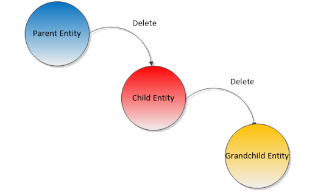
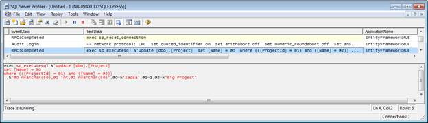

# 五、将数据写入数据库

## 保存、更新和删除实体

### 保存实体

因为 EF 与 POCOs 一起工作，创建一个新的实体只是用**新的**操作符实例化它的问题。如果我们希望它最终到达数据库，我们需要将它附加到现有的上下文中。

```cs
var developmentTool = new DevelopmentTool() { Name = "Visual Studio 2012", 
Language = "C#" };

ctx.Tools.Add(developmentTool);

```

新实体必须添加到同类型的 [DbSet < T >](http://msdn.microsoft.com/en-us/library/gg696460.aspx) 属性中，这也是您查询的网关。

|  | 提示:在我们的上下文中，只有当我们已经公开了实体的类型或其基础时，我们才能添加实体，作为 [DbSet < T >](http://msdn.microsoft.com/en-us/library/gg696460.aspx) 属性。 |

但是，这个新实体不会立即发送到数据库。英孚上下文实现了工作单元模式，这是马丁·福勒创造的一个术语，你可以在这里读到更多:[http://martinfowler.com/eaaCatalog/unitOfWork.html](http://martinfowler.com/eaaCatalog/unitOfWork.html)。简而言之，这种模式声明工作单元容器将在内部保留一个需要持久化的项目列表(新的、修改的或删除的实体)，并将以原子方式保存它们，考虑它们之间的任何最终依赖关系。当我们调用[数据库上下文](http://msdn.microsoft.com/en-us/library/system.data.entity.dbcontext.aspx)的[保存更改](http://msdn.microsoft.com/en-us/library/system.data.entity.dbcontext.savechanges.aspx)方法时，这些实体首先被保存在实体框架代码中。

```cs
var affectedRecords = ctx.SaveChanges();

```

此时，所有挂起的更改都被发送到数据库。实体框架采用第一级(或本地)缓存，所有“脏”实体(如添加到上下文中的实体)都在这里等待时间的到来。 [SaveChanges](http://msdn.microsoft.com/en-us/library/system.data.entity.dbcontext.savechanges.aspx) 方法返回成功插入的记录数，如果过程中出现错误，将抛出异常。在这种情况下，所有的更改都会回滚，您真的应该考虑这个场景。

### 更新实体

至于更新，实体框架会自动跟踪对已加载实体的更改。对于每个实体，它“知道”它们的初始值是什么，如果它们与当前值不同，则该实体被认为是“脏的”下面是一个示例代码。

```cs
//load some entity
var tool = ctx.Tools.FirstOrDefault();

//change something
t.Name += "_changed";

//send changes
var affectedRecords = ctx.SaveChanges(); //1

```

如您所见，不需要单独的更新方法，因为所有类型的更改(插入、更新和删除)都是由[保存更改](http://msdn.microsoft.com/en-us/library/system.data.entity.dbcontext.savechanges.aspx)方法自动检测和执行的。仍然需要调用 [SaveChanges](http://msdn.microsoft.com/en-us/library/system.data.entity.dbcontext.savechanges.aspx) 方法，它将返回所有插入和更新的实体的合并计数。如果违反了某种完整性约束，那么就会抛出异常，这需要适当地处理。

### 向上插入实体

有时您可能想要插入一条记录或更新它，这取决于它是否已经存在；这有时被称为 UPSERT。实体框架代码首先提供了一个有趣的方法，从一个实体的属性，检查它的存在，并相应地采取行动。这个方法就是[addrup date](http://msdn.microsoft.com/en-us/library/system.data.entity.migrations.idbsetextensions.addorupdate.aspx)，这里有一个快速的例子。

```cs
ctx.Customers.AddOrUpdate(x => x.Name, new Customer { Name = "Big Customer" });

```

因为有可能会插入新记录，所以必须提供其所有必需的属性，否则会出现错误。

### 删除实体

当您拥有对加载实体的引用时，您可以将其标记为已删除，这样当更改被持久化时，EF 将删除相应的记录。在 EF 中删除一个实体包括将其从[数据库集< T >](http://msdn.microsoft.com/en-us/library/gg696460.aspx) 集合中删除。

```cs
//load some entity
var tool = ctx.Tools.FirstOrDefault();

//remove the entity
ctx.Tools.Remove(tool);

//send changes
var affectedRecords = ctx.SaveChanges(); //1

```

当然，仍然需要调用 [SaveChanges](http://msdn.microsoft.com/en-us/library/system.data.entity.dbcontext.savechanges.aspx) 来使更改永久化。如果违反了任何完整性约束，将引发异常。

|  | 注意:实体框架将以适当的顺序应用所有挂起的更改(插入、更新和删除)，包括依赖于其他实体的实体。 |

### 检查被跟踪的实体

我们谈到了本地缓存，您可能会问自己这个缓存在哪里，可以用它做什么。

您可以使用[条目](http://msdn.microsoft.com/en-us/library/gg696578.aspx)方法访问实体的本地缓存条目。这将返回一个[数据库实体尝试](http://msdn.microsoft.com/en-us/library/gg696410.aspx)的实例，其中包含大量有用的信息，例如实体的当前状态(如上下文所见)、初始值和当前值等等。

```cs
//load some entity
var tool = ctx.Tools.FirstOrDefault();

//get the cache entry
var entry = ctx.Entry(tool);

//get the entity state
var state = entry.State; //EntityState.Unchanged

//get the original value of the Name property
var originalName = entry.OriginalValues["Name"] as String; //Visual Studio 2012

//change something
t.Name += "_changed";

//get the current state
state = entry.State; //EntityState.Modified

//get the current value of the Name property
var currentName = entry.CurrentValues["Name"] as String; //Visual Studio 2012_changed

```

如果您想检查当前正在跟踪的所有条目，有 [ChangeTracker](http://msdn.microsoft.com/en-us/library/system.data.entity.dbcontext.changetracker.aspx) 属性。

```cs
//get all the added entities of type Project
var addedProjects = ctx.ChangeTracker.Entries()
.Where(x => x.State == EntityState.Added).OfType<Project>();

```

## 级联删除

可以在数据库中创建两个相关的表，这样，当父表的一条记录被删除时，子表中所有相应的记录也会被删除。这被称为级联删除。



图 40:级联删除

这对于自动保持数据库完整性非常有用。如果数据库不为我们这样做，我们将不得不手动这样做，否则我们将最终得到孤立记录。这仅适用于父子或主从关系，其中一个端点不能与另一个端点分开存在；不是所有的关系都应该这样创建，例如，当父端点是可选的时，我们通常不会级联。想想客户和项目的关系:没有客户的项目是没有意义的。另一方面，在没有指定开发人员的情况下有一个 bug 是有意义的。

当实体框架创建数据库时，它将根据映射创建适当的级联约束。


图 41:级联删除

到目前为止，英孚对此应用了一个惯例，但这可能会被流畅的映射所覆盖。

表 2:关系级联

| 关系 | 默认级联 |
| --- | --- |
| 一对一 | 号码 |
| 一对多 | 仅当需要一个端点时。 |
| 多对一 | 号码 |
| 多对多 | 号码 |

我们在 fluent 配置中这样配置级联选项。

```cs
//when deleting a Customer, delete all of its Projects
modelBuilder.Entity<Project>().HasRequired(x => x.Customer)
.WillCascadeOnDelete(true);

//when deleting a ProjectResource, do not delete the Project 
modelBuilder.Entity<ProjectResource>().HasRequired(x => x.Project)
.WithMany(x => x.ProjectResources).WillCascadeOnDelete(false);

//when deleting a Project, delete its ProjectResources 
modelBuilder.Entity<Project>().HasMany(x => x.ProjectResources)
.WithRequired(x => x.Project).WillCascadeOnDelete(false);

```

|  | 提示:你可以有多级级联，只要确保你没有循环引用。 |

|  | 注意:级联删除发生在数据库级别；实体框架不为此发布任何 SQL。 |

## 刷新实体

当 EF 作为查询结果加载记录时，会创建一个实体并将其放入本地缓存中。当执行一个新的查询，返回与已经在本地缓存中的实体相关联的记录时，不会创建新的实体；而是返回缓存中的一个。这有时会产生不良的副作用:即使实体记录中发生了变化，本地实体也不会更新。这是 Entity Framework 所做的优化，但有时会导致意想不到的结果。

如果我们想确保拥有最新数据，我们需要强制进行显式刷新。

```cs
var project = ctx.Projects.Find(1);

//time passes…

ctx.Entry(project).Reload();

```

## 并发控制

### 概述

乐观并发控制是一种使用数据库的方法，它假设多个事务可以在不相互影响的情况下完成；不需要锁定。提交记录时，每个事务都将检查数据库中的记录是否已被修改，并将失败。这对于在 web 应用程序的上下文中处理对数据的多次访问非常有用。

有两种方法可以处理数据被更改的情况:

*   第一个成功:第二个事务将检测到数据已经被更改，并将抛出一个异常。
*   最后一个获胜:当它检测到数据已经改变时，第二个事务选择覆盖它。

实体框架支持这两种方法。

### 第一名获胜

我们有一个从数据库获得的实体实例，我们改变它，并告诉 EFCF 上下文保持它。由于乐观并发性， [SaveChanges](http://msdn.microsoft.com/en-us/library/system.data.entity.dbcontext.savechanges.aspx) 方法会抛出一个[dbupdateconcurrency exception](http://msdn.microsoft.com/en-us/library/system.data.entity.infrastructure.dbupdateconcurrencyexception.aspx)如果数据发生了变化，那么一定要把它包装在一个 try…catch 中。

```cs
try
{
  ctx.SaveChanges();
}
catch (DbUpdateConcurrencyException)
{
  //the record was changed in the database, notify the user and fail
}

```

第一个成功的方法是这样的:万一发生了变化就失败。

### 最后一名获胜

对于这一个，我们将检测到已经进行了更改，并显式覆盖它。

```cs
//assume the operation failed
var failed = true;

//loop until succeeded
do
{                                                   
  try
  {
    ctx.SaveChanges();

    //if succeeded, exit the loop
    failed = false;
  }
  catch (DbUpdateConcurrencyException ex)
  {
    var entity = ex.Entries.Single();

    //get the current values from the database
    var databaseValues = entity.GetDatabaseValues();

    //set the current database values as the original values
    //the original values are the ones that will be compared with the current ones                                                
    entity.OriginalValues.SetValues(databaseValues);
  }
}
while (failed);

```

### 应用乐观并发

默认情况下，实体框架不执行乐观并发检查。您可以通过选择其值将与当前数据库值进行比较的一个或多个属性来启用它。这是通过在属性映射时应用[并发检查属性](http://msdn.microsoft.com/en-us/library/system.componentmodel.dataannotations.concurrencycheckattribute.aspx)来完成的。

```cs
public class Project
{
  [Required]
  [MaxLength(50)]
  [ConcurrencyCheck]
  public String Name { get; set; }
}

```

或者通过代码映射。

```cs
protected override void OnModelCreating(DbModelBuilder modelBuilder)
{
  modelBuilder.Entity<Project>().Property(x => x.Name).IsConcurrencyToken();
}

```

发生的情况是这样的:当 EF 为 UPDATE 操作生成 SQL 时，它不仅会包含主键的 WHERE 限制，还会包含标记为并发检查的任何属性的 WHERE 限制，将它们的列与原始值进行比较。



图 42:带有并发控制检查的更新

如果受影响记录的数量不是 1，这可能是因为数据库中的值与 Entity Framework 已知的原始值不匹配。

SQL Server 有一种数据类型，其值不能显式设置，而是在它们所属的记录发生更改时自动更改: [ROWVERSION](http://technet.microsoft.com/en-us/library/ms182776.aspx) 。其他数据库提供类似的功能。

因为实体框架与 SQL Server 有很好的集成，所以乐观并发检查支持类型为 [ROWVERSION](http://technet.microsoft.com/en-us/library/ms182776.aspx) 的列。为此，我们需要将一个这样的列作为时间戳映射到我们的模型中。首先是属性，方法是将 [TimestampAttribute](http://msdn.microsoft.com/en-us/library/system.componentmodel.dataannotations.timestampattribute.aspx) 应用于属性，该属性需要是字节数组类型，并且不需要公共 setter。

```cs
[Timestamp]
public Byte [] RowVersion { get; protected set; }

```

并且，为了完整，具有流畅的配置。

```cs
modelBuilder.Entity<Project>().Property(x => x.RowVersion).IsRowVersion();

```

[TimestampAttribute](http://msdn.microsoft.com/en-us/library/system.componentmodel.dataannotations.timestampattribute.aspx) 的行为与[concurrency checkattribute](http://msdn.microsoft.com/en-us/library/system.componentmodel.dataannotations.concurrencycheckattribute.aspx)的行为完全相同，但是每个实体只能有一个属性被标记为时间戳。

## 分离的实体

web 应用程序中的一个常见场景是这样的:从数据库中加载某个实体，将其存储在会话中，然后在后续请求中，从那里获取它并继续使用它。这一切都很好，除了，如果您使用的是实体框架代码优先，您将不会在两个请求上使用相同的上下文实例。这个新的上下文对这个实例一无所知。在这种情况下，据说实体相对于上下文是分离的。这样做的效果是，不会跟踪对此实例的任何更改，也不会加载在会话中存储时未加载的任何延迟加载属性。

我们需要做的是将这个实例与新的上下文相关联。

```cs
//retrieve the instance from the ASP.NET context 
var project = HttpContext.Current.Session["StoredProject"] as Project;
var ctx = new  ProjectsContext();
//attach it to the current context with a state of unchanged
ctx.Entry(project).State = EntityState.Unchanged;

```

在这之后，一切都会如预期的那样运转。

## 验证

实体框架代码中的验证首先总是在实体即将被保存时发生，这通常是由 [SaveChanges](http://msdn.microsoft.com/en-us/library/system.data.entity.dbcontext.savechanges.aspx) 方法触发的过程。这可以通过在上下文中设置[有效保存启用](http://msdn.microsoft.com/en-us/library/system.data.entity.infrastructure.dbcontextconfiguration.validateonsaveenabled.aspx)属性来防止。

```cs
//disable validation upon saving
ctx.Configuration.ValidateOnSaveEnabled = false;

```

我们可以通过显式调用 [GetValidationErrors](http://msdn.microsoft.com/en-us/library/system.data.entity.dbcontext.getvalidationerrors.aspx) 来查看当前由上下文跟踪的条目是否有效。

```cs
//all validation errors
var allErrors = ctx.GetValidationErrors();

//validation errors for a given entity
var errorsInEntity = ctx.Entry(p).GetValidationResult();

```

验证结果由[数据库实体验证结果](http://msdn.microsoft.com/en-us/library/system.data.entity.validation.dbentityvalidationresult.aspx)的实例组成，其中每个无效实体只有一个实例。此类提供以下属性。

表 3:验证结果属性

| 财产 | 目的 |
| [条目](http://msdn.microsoft.com/en-us/library/system.data.entity.validation.dbentityvalidationresult.entry.aspx) | 该验证所引用的实体。 |
| [IsValid](http://msdn.microsoft.com/en-us/library/system.data.entity.validation.dbentityvalidationresult.isvalid.aspx) | 指示实体是否有效。 |
| [验证错误](http://msdn.microsoft.com/en-us/library/system.data.entity.validation.dbentityvalidationresult.validationerrors.aspx) | 个别错误的集合。 |

[验证错误](http://msdn.microsoft.com/en-us/library/system.data.entity.validation.dbentityvalidationresult.validationerrors.aspx)属性包含一组[数据库验证错误](http://msdn.microsoft.com/en-us/library/system.data.entity.validation.dbvalidationerror.aspx)条目，每个条目公开以下内容。

表 4:结果错误属性

| 财产 | 目的 |
| --- | --- |
| [错误消息](http://msdn.microsoft.com/en-us/library/system.data.entity.validation.dbvalidationerror.errormessage.aspx) | 错误消息。 |
| [属性 Name](http://msdn.microsoft.com/en-us/library/system.data.entity.validation.dbvalidationerror.propertyname.aspx) | 实体上被认为无效的属性的名称(如果被认为无效的是整个实体，则可以为空)。 |

如果我们试图保存一个具有无效值的实体，将会抛出一个[DbEntityValidationException](http://msdn.microsoft.com/en-us/library/system.data.entity.validation.dbentityvalidationexception.aspx)，在它的内部有一个 [EntityValidationErrors](http://msdn.microsoft.com/en-us/library/system.data.entity.validation.dbentityvalidationexception.entityvalidationerrors.aspx) 集合，该集合公开了所有找到的 [DbEntityValidationResult](http://msdn.microsoft.com/en-us/library/system.data.entity.validation.dbentityvalidationresult.aspx) 。

```cs
try
{
  //try to save all changes
  ctx.SaveChanges();
}
catch (DbEntityValidationException ex)
{
  //validation errors were found that prevented saving changes
  var errors = ex.EntityValidationErrors.ToList();
}

```

### 验证属性

类似于我们可以使用属性来声明映射选项的方式，我们也可以使用属性来声明验证规则。验证属性必须继承自[系统中的](http://msdn.microsoft.com/en-us/library/system.componentmodel.dataannotations.aspx)[验证属性](http://msdn.microsoft.com/en-us/library/system.componentmodel.dataannotations.validationattribute.aspx)。component model . DataAnnotations命名空间并覆盖其中一个[是有效的](http://msdn.microsoft.com/en-us/library/dd730022.aspx)方法。有一些简单的验证属性，我们可以立即使用，并且与实体框架没有任何关系。

表 5:验证属性

| 验证属性 | 目的 |
| --- | --- |
| 比较属性 | 比较两个属性，如果不同，则失败。 |
| [自定义验证属性](http://msdn.microsoft.com/en-us/library/system.componentmodel.dataannotations.customvalidationattribute.aspx) | 执行自定义验证函数并返回其值。 |
| [最大长度属性](http://msdn.microsoft.com/en-us/library/system.componentmodel.dataannotations.maxlengthattribute.aspx) | 检查字符串属性的长度是否大于给定值。 |
| minlengthttribute | 检查字符串属性的长度是否小于给定值。 |
| 范围属性 | 检查属性的值是否包含在给定的范围内。 |
| [正则表达式属性](http://msdn.microsoft.com/en-us/library/system.componentmodel.dataannotations.regularexpressionattribute.aspx) | 检查字符串是否匹配给定的正则表达式。 |
| [要求属性](http://msdn.microsoft.com/en-us/library/system.componentmodel.dataannotations.requiredattribute.aspx) | 检查属性是否有值；如果属性的类型为 string，还会检查它是否为空。 |
| [字符串属性](http://msdn.microsoft.com/en-us/library/system.componentmodel.dataannotations.stringlengthattribute.aspx) | 检查字符串属性的长度是否包含在给定的阈值内。 |
| [会员资格单词属性](http://msdn.microsoft.com/en-us/library/system.web.security.membershippasswordattribute.aspx) | 检查字符串属性(通常是密码)是否符合默认成员资格提供程序的要求。 |

实现自定义验证属性很容易。这里我们可以看到一个简单的例子，检查一个数字是否为偶数。

```cs
[Serializable]
[AttributeUsage(AttributeTargets.Property, AllowMultiple = false, Inherited = true)]
public sealed class IsEvenAttribute : ValidationAttribute
{
  protected override ValidationResult IsValid(Object value, 
ValidationContext validationContext)
  {
    //check if the value is not null or empty
    if ((value != null) && (String.IsNullOrWhiteSpace(value.ToString()) == false))
    {
      TypeConverter converter = TypeDescriptor.GetConverter(value);
      //check if the value can be converted to a long
      if (converter.CanConvertTo(typeof(Int64)) == true)
      {
        Int64 number = (Int64) converter.ConvertTo(value, typeof(Int64));
        //fail if the number is even
        if ((number % 2) != 0)
        {
          return (new ValidationResult(this.ErrorMessage, new String[]  { validationContext.MemberName }));
        }
      }
    }
    return (ValidationResult.Success);
  }
}

```

它可以应用于任何类型可以转换为 long 的属性——在预算的情况下可能没有意义，但是让我们假设它有意义。

```cs
[IsEven(ErrorMessage = "Number must be even")]
public Int32 Number { get; set; }

```

我们还可以通过应用[customvalidation attribute](http://msdn.microsoft.com/en-us/library/system.componentmodel.dataannotations.customvalidationattribute.aspx)来提供自定义验证方法。让我们看看如何使用这种技术实现相同的验证——“是偶数”。首先，使用以下属性声明。

```cs
[CustomValidation(typeof(CustomValidationRules), "IsEven", ErrorMessage = "Number must be even")]
public Int32 Number { get; set; }

```

接下来，使用下面的实际验证规则实现。

```cs
public static ValidationResult IsEven(Object value, ValidationContext context)
{
  //check if the value is not empty
  if ((value != null) && (String.IsNullOrWhiteSpace(value.ToString()) == false))
  {
    TypeConverter converter = TypeDescriptor.GetConverter(value);
    //check if the value can be converted to a long
    if (converter.CanConvertTo(typeof(Int64)) == true)
    {
      Int64 number = (Int64) converter.ConvertTo(value, typeof(Int64));
      //fail if the number is even
      if ((number % 2) != 0)
      {
        return (new ValidationResult("Number must be even", new String[] { context.MemberName }));
      }
    }
  }
  return (ValidationResult.Success);
}

```

我选择将验证函数实现为静态的，但这不是必需的。在这种情况下，声明函数的类必须可以安全实例化(而不是用公共的无参数构造函数进行抽象)。

### 实施自我验证

执行自定义验证的另一个选项位于 [IValidatableObject](http://msdn.microsoft.com/en-us/library/system.componentmodel.dataannotations.ivalidatableobject.aspx) 界面。通过实现这个接口，实体可以自我验证；也就是说，所有的验证逻辑都包含在自身中。让我们看看如何。

```cs
public class Project : IValidatableObject
{
  //other members go here
  public IEnumerable<ValidationResult> Validate(ValidationContext context)
  {
    if (this.ProjectManager == null)
    {
      yield return (new ValidationResult("No project manager specified"));
    }
    if (this.Developers.Any() == false)
    {
      yield return (new ValidationResult("No developers specified"));
    }
    if ((this.End != null) && (this.End.Value < this.Start))
    {
      yield return (new ValidationResult("End of project is before start"));
    }
  }
}

```

### 收尾

您可能已经注意到，所有这些自定义验证技术——自定义属性、自定义验证函数和[新表对象](http://msdn.microsoft.com/en-us/library/system.componentmodel.dataannotations.ivalidatableobject.aspx)实现——都返回[验证结果](http://msdn.microsoft.com/en-us/library/system.componentmodel.dataannotations.validationresult.aspx)实例，而实体框架代码首先将验证结果公开为[数据库实体验证结果](http://msdn.microsoft.com/en-us/library/system.data.entity.validation.dbentityvalidationresult.aspx)和[数据库验证错误](http://msdn.microsoft.com/en-us/library/system.data.entity.validation.dbvalidationerror.aspx)的集合。别担心，实体框架会帮你搞定的！

那么，什么样的验证选项是最好的呢？在我看来，都有优点，肯定都可以一起使用。我只留下一些结束语:

*   如果验证属性足够通用，它可以在许多地方重用。
*   当我们看一个使用属性来表达验证问题的类时，很容易看出我们想要什么。
*   让通用验证函数作为静态方法可用也是有意义的，静态方法可以从验证属性或其他方式调用。
*   最后，一个类可以用很难甚至不可能用属性表达的方式自我验证。例如，考虑其值依赖于其他属性值的属性。

## 交易

实体框架代码中的事务首先有两种形式:

*   隐式:方法 [SaveChanges](http://msdn.microsoft.com/en-us/library/system.data.entity.dbcontext.savechanges.aspx) 创建一个事务，用于包装它将发送到数据库的所有更改集，如果不存在环境事务的话；这对于正确地实现工作单元是必要的，在工作单元中，要么全部改变，要么根本不改变。
*   显式:实体框架自动登记由[事务范围](http://msdn.microsoft.com/en-us/library/system.transactions.transactionscope.aspx)创建的环境事务。

环境事务很好，因为如果任何 ADO.NET 代码在其范围内试图访问多个数据库服务器(或同一物理服务器中的实例)，它们可以自动升级为分布式事务。为此，必须启动分布式事务协调器服务。


图 43:分布式事务协调器服务

它们也是。NET 世界，支持从数据库到网络服务。

使用事务主要有两个原因:

*   为了在执行必须同时成功的操作时保持一致性(考虑银行转账，离开一个账户的钱必须进入另一个账户)。
*   用于确保读取操作的相同结果，其中数据可以被第三方同时访问和更改。

理论够了。中的事务范围。NET 是这样创建的。

```cs
using (var tx = new TransactionScope())
{
  using (var ctx = new ProjectsContext())
  {
    //do changes

    //submit changes
    ctx.SaveChanges();
  }

  using (var ctx = new ProjectsContext())
  {
    //do more changes

    //submit changes
    ctx.SaveChanges();
  }

  //must be explicitly marked as complete
  tx.Complete();
}

```

此示例显示了包装两个上下文的事务范围。只有成功执行 [Complete](http://msdn.microsoft.com/en-us/library/system.transactions.transactionscope.complete.aspx) 方法，这些上下文中的任何一个提交的更改才会被提交，否则所有更改都会回滚。因为没有回滚方法， [TransactionScope](http://msdn.microsoft.com/en-us/library/system.transactions.transactionscope.aspx) 在调用其 [Dispose](http://msdn.microsoft.com/en-us/library/system.transactions.transactionscope.dispose.aspx) 方法而不调用 [Complete](http://msdn.microsoft.com/en-us/library/system.transactions.transactionscope.complete.aspx) 时假设回滚。

|  | 提示:始终将 TransactionScope 包装在一个使用块中，并使其尽可能短。 |