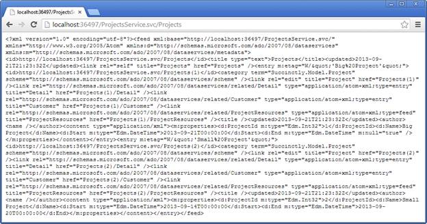
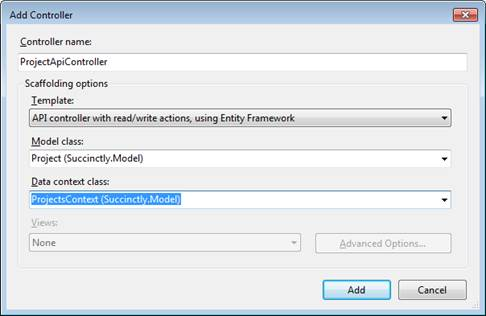
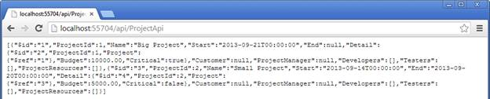
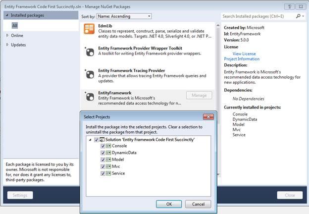

# 第九章向世界展示数据

## 概述

我们生活在一个互联的世界里，如今分布式应用程序很常见。微软。NET 堆栈提供了一些有趣的技术，通过利用实体框架向外部世界公开实体。在接下来的几页中，我们将讨论两种 web 服务技术和一种动态 CRUD 接口技术。

[WCF 数据服务](http://msdn.microsoft.com/en-us/library/cc668792.aspx)是微软实施的 [OData](http://www.odata.org) 标准。基本上，这是发布、查询和交换来自实体的数据的标准，例如 REST web 服务，它是在 WCF 之上实现的。您可以通过 URL 发出查询，甚至可以生成使用 LINQ 查询发布模型的强类型代理。

Visual Studio 在 Web 项目中有一个名为 WCF 数据服务的项类型。


图 44: WCF 数据服务项目类型

当添加这种类型的项目时，Visual Studio 会创建一个[数据服务<T>](http://msdn.microsoft.com/en-us/library/cc646779.aspx)-派生类，该类将成为 OData 服务的端点。我们需要用上下文来替换 T 参数，但是现在我们必须使用 [ObjectContext](http://msdn.microsoft.com/en-us/library/system.data.objects.objectcontext.aspx) 来代替我们的 [DbContext](http://msdn.microsoft.com/en-us/library/system.data.entity.dbcontext.aspx) 类，因为不幸的是它仍然没有将其识别为有效的上下文。作为补充，我们需要返回一个 [ObjectContext](http://msdn.microsoft.com/en-us/library/system.data.objects.objectcontext.aspx) 的实例，我们可以通过覆盖 [CreateDataSource](http://msdn.microsoft.com/en-us/library/cc646746.aspx) 从自己的上下文中获取该实例。

```cs
public class ProjectsService : DataService<ObjectContext>
{
  public static void InitializeService(DataServiceConfiguration config)
  {
    config.SetEntitySetAccessRule("*", EntitySetRights.AllRead);
    config.SetServiceOperationAccessRule("*", ServiceOperationRights.All);
    config.DataServiceBehavior.MaxProtocolVersion = DataServiceProtocolVersion.V3;
  }

  protected override ObjectContext CreateDataSource()
  {
    ProjectsContext ctx = new ProjectsContext();
    ObjectContext octx = (ctx as IObjectContextAdapter).ObjectContext;

    return (octx);
  }
}

```

之后，我们准备查询我们的数据服务。


图 45:WCF 数据服务

|  | 提示:在 WCF 数据服务的当前版本中，不支持枚举或空间类型的属性。 |

如您所见，当您访问服务 URL 时，您将获得由您的上下文以 XML 格式公开的所有集合。然后，我们可以导航到这些集合中的每一个，并查看其所有记录。



图 46:WCF 数据服务返回实体的所有数据

通过网址查询模型是可能的，但我在这里不做介绍。完整规格请见此处:[http://www . odata . org/documentation/odata-v3-documentation/URL-convents/](http://www.odata.org/documentation/odata-v3-documentation/url-conventions/)。

## ASP.NET 网页空气污染指数

另一项备受关注的技术是[ASP.NET 网络应用编程接口](http://www.asp.net/web-api)。它提供了另一个用于公开实体模型的 REST API，但是这一个是作为 MVC 4 的一部分引入的，并且是基于它构建的，这意味着它是基于控制器和动作的。对于网络服务来说，它有时被认为就像实体框架代码优先于数据访问一样。

我们在 MVC 项目中的**控制器**文件夹上创建一个网络应用编程接口控制器。



图 47:基于实体框架上下文的网络应用编程接口控制器

Visual Studio 已经为我们设置了一些配置，但是我们通常需要一些调整才能让一切正常工作。其中一个是以 JSON 格式得到结果，另一个是在模型实体中实现循环引用的适当序列化(例如，在我们的模型中，一个客户有一组项目，每个项目引用该客户)。

让我们访问 **App_Start** 方法中的**网络配置**类，并添加以下行。

```cs
//remove the XML formatter – skip this if you prefer XML over JSON
GlobalConfiguration.Configuration.Formatters.XmlFormatter.SupportedMediaTypes
.Clear();

//add support for circular references to the JSON serializer – do the same for XML
GlobalConfiguration.Configuration.Formatters.JsonFormatter.SerializerSettings
.ReferenceLoopHandling = ReferenceLoopHandling.Serialize;
GlobalConfiguration.Configuration.Formatters.JsonFormatter.SerializerSettings
.PreserveReferencesHandling = PreserveReferencesHandling.Objects;

```

我们现在可以导航到为网络应用编程接口控制器配置的路由。



图 48:网络应用编程接口端点

网络应用编程接口还有很多，我建议你导航到它的主页，在[http://www.asp.net/web-api](http://www.asp.net/web-api)，自己去看看。这当然值得。

## ASP.NET 动态数据

[ASP.NET 动态数据](http://msdn.microsoft.com/en-us/library/cc488545.aspx)到现在已经有些年头了；对于不熟悉它的人来说，它是一种为实体模型自动生成 Create Read Update Delete(CRUD)web 接口的技术，例如为 Entity Framework Code First 创建的接口。当我们快速需要以简单的方式实现一个编辑记录的站点时，这可能是一个很大的帮助。

我们自己创建了一个 ASP.NET 动态数据项目。


图 49:ASP.NET 动态数据项目

创建新项目后，我们需要:

1.  把它变成. NET 4.5 项目。


图 50:ASP.NET 动态数据项目属性

2.  向**实体框架**包添加一个 NuGet 引用。



图 51:添加 NuGet 引用

3.  添加对包含实体框架代码优先上下文的项目的引用(在我们的例子中，它是**模型**项目)。
4.  将连接字符串复制到新项目的 **Web.config** 文件中。

现在我们必须告诉动态数据使用我们的上下文。为此，打开**全局**类，转到其**注册路线**方法。添加以下一行。

```cs
DefaultModel.RegisterContext(() => (new ProjectsContext() as IObjectContextAdapter)
.ObjectContext, new ContextConfiguration() { ScaffoldAllTables = true });

```

我们准备好出发了！开始项目，你会看到进入页面。


图 52:ASP.NET 动态数据输入页面

然后导航到某个实体。


图 53:ASP.NET 动态数据实体项目

您会很高兴知道枚举和空间类型得到了完全支持。先不说动态数据，还有很多要说的，希望引起大家的注意！欲了解更多信息，请前往[http://msdn.microsoft.com/en-us/library/cc488545.aspx](http://msdn.microsoft.com/en-us/library/cc488545.aspx)。