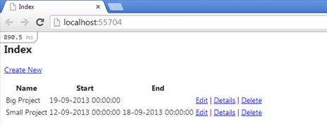

# 第十章追踪和分析

## 获取查询的 SQL

LINQ 和实体 SQL 查询由实体框架翻译成 SQL。它们都提供了一种查看生成的 SQL 是什么样子的方法；这是通过 [ToTraceString](http://msdn.microsoft.com/en-us/library/system.data.objects.objectquery.totracestring.aspx) 方法实现的，该方法是 [ObjectQuery < T >](http://msdn.microsoft.com/en-us/library/system.data.objects.objectquery.aspx) 类的公共方法。代码优先的 LINQ 实现也有办法达到这个[目标查询<T>T5】，但是需要反思。这是一个通用跟踪方法的可能实现。](http://msdn.microsoft.com/en-us/library/system.data.objects.objectquery.aspx)

```cs
public static String ToSqlString<TEntity>(this IQueryable<TEntity> queryable) 
where TEntity : class
{
  ObjectQuery<TEntity> objectQuery = null;

  if (queryable is ObjectQuery<TEntity>)
  {
    objectQuery = queryable as ObjectQuery<TEntity>;
  }
  else if (queryable is DbQuery<TEntity>)
  {
    var dbQuery = queryable as DbQuery<TEntity>;
    var iqProp = dbQuery.GetType().GetProperty("InternalQuery", 
BindingFlags.Instance | BindingFlags.NonPublic | BindingFlags.Public);
    var iq = iqProp.GetValue(dbQuery); 
    var oqProp = iq.GetType().GetProperty("ObjectQuery", BindingFlags.Instance | 
BindingFlags.NonPublic | BindingFlags.Public);

    objectQuery = oqProp.GetValue(iq) as ObjectQuery<TEntity>;
  }
  else
  {
    throw (new ArgumentException("queryable"));
  }

  var sqlString = objectQuery.ToTraceString();

  foreach (var objectParam in objectQuery.Parameters)
  {
    if ((objectParam.ParameterType == typeof(String)) 
    || (objectParam.ParameterType == typeof(DateTime)) 
    || (objectParam.ParameterType == typeof(DateTime?)))
    {
      sqlString = sqlString.Replace(String.Format("@{0}", objectParam.Name), 
      String.Format("'{0}'", objectParam.Value.ToString()));
    }
    else if ((objectParam.ParameterType == typeof(Boolean)) 
    || (objectParam.ParameterType == typeof(Boolean?)))
    {
      sqlString = sqlString.Replace(String.Format("@{0}", objectParam.Name), 
String.Format("{0}", Boolean.Parse(objectParam.Value.ToString()) ? 1 : 0));
    }
    else
    {
      sqlString = sqlString.Replace(String.Format("@{0}", objectParam.Name), 
String.Format("{0}", objectParam.Value.ToString()));
    }
  }

  return (sqlString);
}

```

该方法将提取[返回的 SQL 字符串到字符串](http://msdn.microsoft.com/en-us/library/system.data.objects.objectquery.totracestring.aspx)，并用实际参数值替换参数占位符。您可以在任何[IQueryable<T>T3】实现上使用它。如果该参数已经是一个](http://msdn.microsoft.com/en-us/library/bb351562.aspx)[对象查询< T >](http://msdn.microsoft.com/en-us/library/system.data.objects.objectquery.aspx) ，那么它是直接了当的，如果它是一个[数据库查询<T>T7】(一个来自代码优先的 LINQ 查询)，它首先从中提取底层的](http://msdn.microsoft.com/en-us/library/gg696530.aspx)[对象查询<T>T9】。](http://msdn.microsoft.com/en-us/library/system.data.objects.objectquery.aspx)

```cs
//get the SQL for an Entity SQL query
var finishedProjectsSQL = octx.CreateQuery<Project>(
"SELECT VALUE p FROM Projects AS P WHERE p.[End] IS NOT NULL").ToTraceString();

//get the SQL for an Entity SQL query
var projectsStartingAWeekAgoSQL = (from p in ctx.Projects where p.Start == 
DateTime.Today.AddDays(-1) select p).ToSqlString();

//get the SQL for all the Projects using the ToSqlString extension method
var allProjectsSQL = ctx.Projects.ToSqlString();

```

## 微型先验仪

[MiniProfiler](http://miniprofiler.com/) 是一个开源项目，为 ASP.NET MVC 和实体框架提供了一个代码分析器。我将演示如何在 MVC 项目中使用它，但是除了 MVC 控制台之外，它还可以用在 Windows 窗体、控制台甚至 Web 窗体应用程序中。

要使用它，需要先从 [NuGet](http://www.nuget.org/packages/MiniProfiler/) 获取它的核心包。


然后是 [MVC](http://www.nuget.org/packages/MiniProfiler.MVC3/) 和 [EF](http://www.nuget.org/packages/MiniProfiler.EF/) 套餐。


在你的 web 应用的**全局**类中，你需要在 **Application_Start** 方法中添加以下几行。

```cs
MiniProfilerEF.Initialize();
MiniProfiler.Settings.SqlFormatter = new SqlServerFormatter();

```

在布局视图(或母版页，取决于您选择的视图引擎)中，您需要添加一个特定的方法调用来添加所需的 JavaScript。

对于 Razor，将是**~ view \ Shared \u layout . cshtml**文件。

```cs
@StackExchange.Profiling.MiniProfiler.RenderIncludes()

```

而对于 ASPX 来说，它将是主页**~视图\共享\站点。主**。

```cs
<%@: StackExchange.Profiling.MiniProfiler.RenderIncludes() %>

```

完成后，您将开始在每个页面的左上角看到 MiniProfiler 控制台。



图 54: MiniProfiler 指示器

通过点击它，它将展开并显示当前请求的一些统计数据。


图 55: MiniProfiler MVC 控制台

到目前为止，这与实体框架无关，但是如果你点击 **sql** 链接，那么所有的乐趣都开始了。


图 56:迷你分析器 SQL 控制台

MiniProfiler 将向您显示作为当前 web 请求的一部分执行的所有查询，将检测重复的查询，还将显示一些其他问题，如 SELECT N+1。

如果不想使用 MVC 控制台，仍然可以从当前的探查器实例中获取相关信息。

```cs
//some statistics        
var nonQueriesCount = MiniProfiler.Current.ExecutedNonQueries;
var readersCount = MiniProfiler.Current.ExecutedReaders;
var scalarsCount = MiniProfiler.Current.ExecutedScalars;
var duration = MiniProfiler.Current.DurationMillisecondsInSql;

//all queries executed as part of the current request     
var timings = MiniProfiler.Current.GetSqlTimings();
var sql = timings.First().FormattedCommandString;
var isDuplicate = timings.First().IsDuplicate;
var stackTrace = timings.First().StackTraceSnippet;
var parameters = timings.First().Parameters;

```

## SQL Server 事件探查器

[SQL Server Profiler](http://technet.microsoft.com/en-us/library/ms181091.aspx) 是一个无价的工具，从 2005 年开始包含在 SQL Server 的商业版本中。简而言之，它允许您实时监控发送到数据库的 SQL。

通过使用 SQL Server Profiler，您可以了解实体框架在背后做什么。对于`ctx.Projects.OrderBy(x => x.Start).ToList()`这样的简单查询，会发出如下的 SQL。


图 57: SQL Server 事件探查器输出

您注意到“应用程序名称”栏了吗？实体框架总是将应用程序名称设置为“EntityFrameworkMUE”，这样您总是可以知道它发送了哪些 SQL 查询，并且您可以在 SQL Server Profiler 上创建一个过滤器来仅显示这些条目。如果需要，可以通过在连接字符串中提供应用程序名称参数来指定不同的应用程序名称。

```cs
<connectionStrings>
  <add name="ProjectsContext" 
  connectionString="Data Source=.\SQLEXPRESS;Integrated Security=SSPI;
  Initial Catalog=Succinctly;MultipleActiveResultSets=true;Application Name=ProjectsContext"
  providerName="System.Data.SqlClient"/>
</connectionStrings>

```