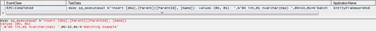

# 第 11 章性能优化

## 过滤数据库中的实体

您肯定知道实体框架适用于两种风格的 LINQ:

*   LINQ 到对象:操作在内存中执行。
*   LINQ 到实体:操作在数据库中执行。

返回集合的 LINQ 到实体查询在调用“终端”方法后立即执行——从[到列表](http://msdn.microsoft.com/en-us/library/bb342261.aspx)、[到数组](http://msdn.microsoft.com/en-us/library/bb298736.aspx)或[到列表](http://msdn.microsoft.com/en-us/library/bb548657.aspx)之一。之后，结果被具体化，并因此存储在进程的内存空间中。作为 [IEnumerable < T >](http://msdn.microsoft.com/en-us/library/9eekhta0.aspx) 的实例，它们可以被 LINQ 对象标准操作符操纵，而我们甚至没有注意到。这意味着，发出这两个查询是完全不同的，因为一个将完全由数据库执行，而另一个将由当前进程执行。

```cs
//LINQ to Objects: all Technologies are retrieved from the database and filtered in memory
var technologies = ctx.Technologies.ToList().Where(x => x.Resources.Any());

//LINQ to Entities: Technologies are filtered in the database, and only after retrieved into memory
var technologies = ctx.Technologies.Where(x => x.Resources.Any()).ToList();

```

当心，你带来的唱片可能比你预期的要多得多！

## 不要跟踪不打算变更的实体

实体框架有一个一级(或本地)缓存，其中存储了 EF 上下文已知的、从查询加载的或显式添加的所有实体。发生这种情况是为了在需要保存对数据库的更改时，EF 会通过这个缓存检查哪些需要保存，也就是说哪些需要插入、更新或删除。当 EF 必须保存时，如果从查询中加载大量实体会发生什么？它需要浏览所有这些，看看哪些发生了变化，这就构成了记忆的增长。

如果您不需要跟踪查询产生的实体，因为它们仅用于显示，那么您应该应用[作为不跟踪](http://msdn.microsoft.com/en-us/library/gg679352.aspx)扩展方法。

```cs
//no caching
var technologies = ctx.Technologies.AsNoTracking().ToList();

var technologiesWithResources = ctx.Technologies.Where(x => x.Resources.Any())
.AsNoTracking().ToList();

var localTechnologies = ctx.Technologies.Local.Any();  //false

```

这甚至会导致查询执行速度更快，因为 EF 不必将每个结果实体存储在缓存中。

## 禁用自动检测更改

另一个优化与实体框架运行变更跟踪算法的方式有关。默认情况下， [DetectChanges](http://msdn.microsoft.com/en-us/library/system.data.entity.infrastructure.dbchangetracker.detectchanges.aspx) 方法会在很多情况下被自动调用，例如当一个实体被显式添加到上下文中时，当查询运行时，等等。每当跟踪大量实体时，这会导致性能下降。

解决方法是通过适当设置[自动检测变更启用](http://msdn.microsoft.com/en-us/library/system.data.entity.infrastructure.dbcontextconfiguration.autodetectchangesenabled.aspx)属性来禁用自动变更跟踪。

```cs
//disable automatic change tracking
ctx.Configuration.AutoDetectChangesEnabled = false;

```

不要惊慌:每当 [SaveChanges](http://msdn.microsoft.com/en-us/library/system.data.entity.dbcontext.savechanges.aspx) 被调用时，它就会调用 [DetectChanges](http://msdn.microsoft.com/en-us/library/system.data.entity.infrastructure.dbchangetracker.detectchanges.aspx) ，一切都会好起来。禁用此功能是安全的。

## 在适当的地方使用惰性、显式或急切加载

正如你在 *[【懒惰、显式和渴望加载】](04.html#LEnE)* 一节中看到的那样，在加载导航属性时，你有很多选项。一般来说，当您确定需要访问引用属性或遍历集合中存在的所有子实体时，您应该急切地向它们加载包含它们的实体。有一个已知的问题叫做 SELECT N + 1，它说明了这一点:您发出一个返回 N 个元素的基本查询，然后发出另外 N 个查询，每个查询对应于您想要访问的引用/集合。

通过应用[包含](http://msdn.microsoft.com/en-us/library/system.data.entity.dbextensions.include.aspx)扩展方法来实现快速加载。

```cs
//eager load the Technologies for each Resource   

var resourcesIncludingTechnologies = ctx.Resources.Include(x => x.Technologies)
.ToList();

//eager load the Customer for each Project        
var projectsIncludingCustomers = ctx.Projects.Include("Customer").ToList();

```

通过这种方式，您可以潜在地节省大量查询，但是它也可以带来比您需要的更多的数据。

## 使用投影

如您所知，通常 LINQ 和实体 SQL 查询返回完整的实体；也就是说，对于每个实体，它们都带来了它的所有映射属性(引用和集合除外)。有时我们不需要完整的实体，而只需要它的某些部分，甚至是从实体的某些部分计算出来的东西。为此，我们使用投影。

通过预测，我们可以大大减少手工挑选所需的数据。这里有一些 LINQ 和实体 SQL 的例子。

```cs
//return the resources and project names only with LINQ
var resourcesXprojects = ctx.Projects.SelectMany(x => x.ProjectResources)
.Select(x => new { Resource = x.Resource.Name, Project = x.Project.Name }).ToList();

//return the customer names and their project counts with LINQ
var customersAndProjectCount = ctx.Customers
.Select(x => new { x.Name, Count = x.Projects.Count() }).ToList();

//return the project name and its duration with ESQL
var projectNameAndDuration = octx.CreateQuery<Object>("SELECT p.Name, 
DIFFDAYS(p.Start, p.[End]) FROM Projects AS p WHERE p.[End] IS NOT NULL").ToList();

//return the customer name and a conditional column with ESQL
var customersAndProjectRange = octx.CreateQuery<Object>(
"SELECT p.Customer.Name, CASE WHEN COUNT(p.Name) > 10 THEN 'Lots' ELSE 'Few' END AS 
Amount FROM Projects AS p GROUP BY p.Customer").ToList();

```

使用 LINQ 的投影依赖于匿名类型，但是您也可以将结果选择到. NET 类中，以便更好地访问其属性。

```cs
//return the customer names and their project counts into a dictionary with LINQ
var customersAndProjectCountDictionary = ctx.Customers
.Select(x => new { x.Name, Count = x.Projects.Count() })
.ToDictionary(x => x.Name, x => x.Count);

```

## 保存时禁用验证

我们在部分讨论了验证 API。当上下文要保存它们时，会为每个实体触发验证，如果有很多实体，这可能需要一些时间。

当您 100%确定要保存的实体都有效时，您可以通过禁用[有效保存启用](http://msdn.microsoft.com/en-us/library/system.data.entity.infrastructure.dbcontextconfiguration.validateonsaveenabled.aspx)属性来禁用它们的验证。

```cs
//disable automatic validation upon save
ctx.Configuration.ValidateOnSaveEnabled = false;

```

这是一个全球性的环境，所以要小心！

## 处理断开的实体

保存实体时，如果您需要在属性中存储对另一个实体的引用，而您知道该实体的主键，那么，与其用实体框架加载它，不如只为它分配一个填充了标识符属性的空白实体。

```cs
//save a new project referencing an existing Customer
var newProject = new Project { Name = "Some Project", Customer = 
new Customer { CustomerId = 1 } /*ctx.Customers.Find(1)*/ };

ctx.Projects.Add(newProject);
ctx.SaveChanges();

```

这很好，因为实体框架只需要外键集。

同样对于删除，不需要预先加载实体，它的主键就可以了。

```cs
//delete a Customer by id
//ctx.Customers.Remove(ctx.Customers.Find(1));
ctx.Entry(new Customer { CustomerId = 1 }).State = EntityState.Deleted;
ctx.SaveChanges();

```

## 不要对批量插入使用标识

虽然 [IDENTITY](http://technet.microsoft.com/en-us/library/ms186775.aspx) 标识符生成策略对于那些来自 SQL Server 世界的人来说可能是最明显的，但是当涉及到 ORM 时，它确实有一些问题；它不适合批处理场景。由于主键是在数据库中生成的，并且每个插入的实体必须在持久化后立即水合，也就是说，必须设置其标识符，因此，SQL Server 需要在插入后立即发出额外的 SELECT 来获取生成的键。让我们看一个使用[身份](http://technet.microsoft.com/en-us/library/ms186775.aspx)的例子。

```cs
ctx.Save(new Parent { Name = "Batching Example" });
ctx.SaveChanges();

```

我们可以在 SQL Server Profiler 中看到生成的 SQL(注意 INSERT 后面跟着一个 SELECT)。


图 58:插入记录并获取生成的密钥

如果我们将生成策略改为手动，并预先显式设置主键，那么我们只有一个 INSERT。



图 59:用手动分配的键插入记录

如果您正在插入大量实体，这可能会产生巨大的不同。当然，由于并发访问，有时使用手动插入可能是不合适的，但是在这种情况下，它可能可以通过使用 Guids 作为主键来解决。

|  | 注意:请记住，一般来说，表单不适合批量插入。 |

## 在适当的地方使用 SQL

如果您已经查看了为某些查询生成的 SQL，并且如果您了解您的 SQL，您可能会发现它远未优化。这是因为 EF 使用一种通用算法来构建 SQL，该算法从指定的查询中自动提取参数，并将其盲目地放在一起。当然，了解我们想要什么以及数据库是如何设计的，我们可能会找到更好的方法来达到同样的目的。

当你绝对确定你可以用比 EF 更好的方式编写你的 SQL 时，请随意尝试 [SqlQuery](http://msdn.microsoft.com/en-us/library/gg696332.aspx) 并比较响应时间。您应该多次重复测试，因为其他因素可能会影响结果，例如对数据库的其他访问、Visual Studio 调试器、测试计算机中运行的进程数量，所有这些都会造成影响。

有一点肯定有更好的性能，那就是批量删除或更新。总是用 SQL 来做，而不是加载实体，逐个更改/删除它们，然后保存更改。为此，使用 [ExecuteSqlCommand](http://msdn.microsoft.com/en-us/library/gg679456.aspx) 方法。