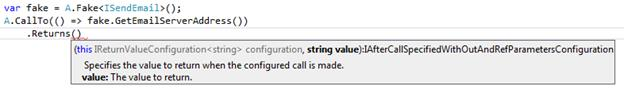
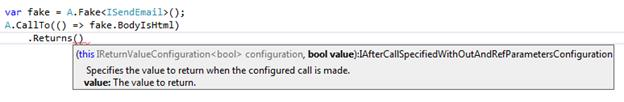
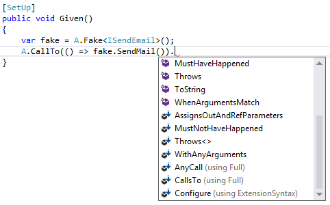

# 第 5 章将呼叫配置为假呼叫

## A .叫声

现在我们知道了如何创建一个伪，是时候开始指定调用来配置这个伪了。这是什么意思？当我们创建一个赝品时，我们这样做是有一个明确的目的，即定义我们想要或期望在赝品上的某种类型的行为。为了获得期望的行为，我们必须配置调用。

我们通过调用静态`A`类上的`CallTo`方法来配置调用:

```cs
    A.CallTo(() => [theFake].[aFakesMember])

```

代码清单 23:调用方法

代码清单 23 中的`theFake`是我们配置的一个伪代码。从那里我们应该能够指定哪个成员在假货上打电话(`aFakesMember`)。如果你看一下当你输入`A.CallTo`时呈现给你的智能感知，你会看到许多重载；让我们来探索这些过载。

### 探索过载

如果我们在 IDE 中查看`CallTo`的重载，我们将看到以下内容:

```cs
    public static class A
    {
        public static IVoidArgumentValidationConfiguration
            CallTo(Expression<Action> callSpecification);
        public static IReturnValueArgumentValidationConfiguration<T>
            CallTo<T>(Expression<Func<T>> callSpecification);
        public static IAnyCallConfigurationWithNoReturnTypeSpecified
            CallTo(object fake); }

```

代码清单 24:调用重载

暂时不要担心接口是从`CallTo`方法返回的，而是看看方法取什么。`A.CallTo`是让 FakeItEasy 做任何事情的“门户”。在继续之前，让我们快速探索每个方法调用:

*   `CallTo (Expression<Action> callSpecification)`:我们将使用这个`CallTo`重载来配置不返回值的成员。
*   `CallTo<T> (Expression<Func<T>> callSpecification)`:我们将使用这个`CallTo`重载来配置返回值的成员。
*   `CallTo(object fake)`:这是三个重载中最简单的签名。我们将使用这个`CallTo`重载来伪造一个类的成员。

|  | 注意:伪造类在第 9 章“伪造 Sut”中有所介绍。现在，我们将集中讨论两个重载，它们分别采用。NET 委托类型。 |

在我们继续之前，让我们介绍一个抽象，我们将在整本书中断断续续地使用它。发送电子邮件是当今大多数系统普遍存在的需求，因此让我们对发送电子邮件的功能进行抽象:

```cs
    public interface ISendEmail
    {   
        string GetEmailServerAddress();
        bool BodyIsHtml { get; set; }
        void SendMail();
    }

```

代码清单 25: ISendEmail 及其成员

`ISendEmail`接口有三个成员:两个方法(一个返回字符串，一个返回 void)和一个属性 getter/setter。

### 调用方法

以下是如何在伪造的`ISendEmail`界面上使用`A.CallTo`配置`GetEmailServerAddress`方法:

```cs
    var emailSender = A.Fake<ISendEmail>();
    A.CallTo(() => emailSender.GetEmailServerAddress());

```

代码清单 26:配置对返回值的方法的调用

|  | 注意:我们故意不在这些代码清单中包含返回行为。我们将在第 6 章“配置对伪造的调用”中探讨返回值 |

以下是如何在伪造的`ISendEmail`界面上使用`A.CallTo`配置`SendMail`方法:

```cs
    var emailSender = A.Fake<ISendEmail>();
    A.CallTo(() => emailSender.SendMail());

```

代码清单 27:配置对不返回值的方法的调用

请注意，这两种方法的配置是相同的，但是如果您在每个配置的方法的`CallTo`定义中按 F12，您会看到不同。

当我们建立到`SendMail`的呼叫时，您提供到`A.CallTo`的`Expression<Action>`，当您建立到`GetEmailServerAddress`的呼叫时，您提供到`A.CallTo`的`Expression<Func<T>>`。

|  | 注意:这是因为 SendMail 不返回值，而 GetEmailServerAddress 返回值，这是。NET 框架。更多关于动作<t>和功能<t>的区别可以在[这里](http://stackoverflow.com/questions/4317479/func-vs-action-vs-predicate)找到。</t></t> |

### 调用属性

以下是如何使用`A.CallTo`在伪造的`ISendEmail`界面上配置`BodyIsHtml`属性:

```cs
    var emailSender = A.Fake<ISendEmail>();
    A.CallTo(() => emailSender.BodyIsHtml);

```

代码清单 28:配置对属性的调用

|  | 注意:也可以调用受保护的成员。我们将在第 9 章“伪造 Sut”中讨论如何做到这一点 |

### 仔细看看 A.CallTo

让我们更深入地研究一下在伪造的`ISendEmail`接口上配置调用时将看到的智能感知。

造出赝品后，这就是我们在开始输入`A.CallTo`时从赝品中可以看到的:


图 18:假冒会员

我们将一次查看一个`BodyIsHtml`、`GetEmailServerAddress`和`SendMail`方法，看看有哪些智能感知可供我们使用。

配置 GetEmailServerAddress

当我们从创建的赝品中键入`GetEmailServerAddress`时，系统不会提示我们提供任何参数，因为该方法不接受任何参数。当我们结束`A.CallTo`的最后一个括号时，您将看到其他可用的 FakeItEasy 调用列表。现在，选择`Returns`。当我们选择`Returns`时，我们可以在智能感知中看到 FakeItEasy 已经知道`GetEmailServerAddress`返回什么类型并提示我们输入一个值。



图 19:配置 GetEmailServerAddress

配置 BodyIsHtml

对于配置 BodyIsHtml，智能感知看起来是一样的。



图 20:配置 BodyIsHtml

配置发送邮件

当我们配置`SendEmail`时，事情看起来就不一样了:



图 21:配置发送邮件

注意这里缺少`Returns`调用。FakeItEasy 足够聪明，知道不要在可用选项中显示`Returns`，因为`SendMail`不返回任何东西。

FakeItEasy 是怎么做到的？如果你再看一下`CallTo`，你会看到三个重载中有两个取了一个表达式。FakeItEasy 使用这个表达式来为它在 IDE 中的 IntelliSense 中向您公开的 API 选择提供动力。

|  | 提示:学习表达式树的一个很好的入门资源是斯科特·艾伦关于 LINQ 基础的 [PluralSite 教程](http://www.pluralsight.com/courses/linq-fundamentals)。 |

谢天谢地，FakeItEasy 完成了所有繁重的工作，并编写了负责解析表达式的代码，为我们消费者提供了一个流畅的应用编程接口。我们需要做的就是指定假货，然后使用 FakeItEasy 的指导，对其进行配置。

## 总结

在这一节中，我们学习了如何配置假货，探索了`A.CallTo`的重载，并展示了假货上不同类型成员的一些配置。

为了让假货有用，我们想要控制一些东西。我们现在知道如何配置赝品，但我们还不能对配置好的赝品做太多——这就是 FakeItEasy 的真正力量所在。我们将在下一章“指定假货的行为”中学习如何做到这一点