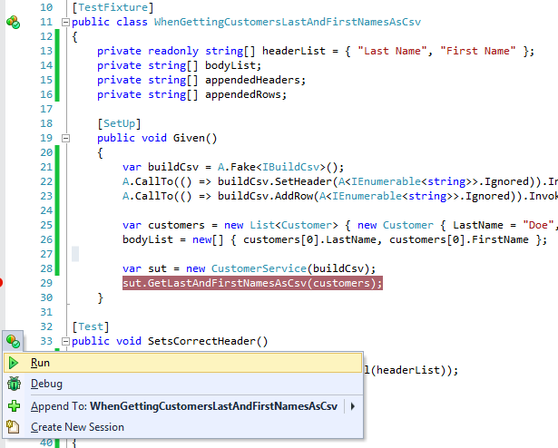
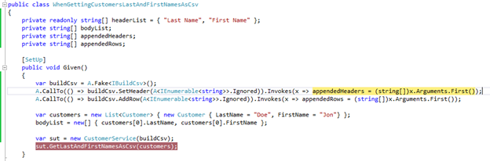

# 第六章指定假货的行为

为了让任何配置的赝品有用，我们需要控制一些东西。通过指定配置的赝品的行为，我们将能够在我们的 SUT 测试所有可能的执行路径，因为我们通过使用 FakeItEasy 控制注入到 SUT 的依赖项。

## 返回值

返回值将是最常见的行为之一，你会想要控制你的假货。让我们探索一些常用的方法来指定返回值。

### 返回

`Returns`调用可能是指定假货行为最广泛使用的调用。让我们更改第 5 章中介绍的`ISendEmail`界面。首先，让我们让它定义一个方法，`GetEmailServerAddress`:

```cs
    public interface ISendEmail
    {   
        string GetEmailServerAddress();
    }

```

代码清单 ISendEmail 接口

下面是如何指定`GetEmailServerAddress`的返回值:

```cs
    A.CallTo(() => emailSender.GetEmailServerAddress()).Returns("SMTPServerAddress");

```

代码清单 30:返回硬编码值

硬编码值以及您在单元测试中设置的任何变量都可以正常工作:

```cs
    A.CallTo(() => emailSender.GetEmailServerAddress()).Returns(smtpServerAddress);

```

代码清单 31:返回在单元测试中设置的变量

`Returns`也可以搭配收藏品使用。让我们在我们的`ISendEmail`界面中添加一个`GetAllCcRecipients`方法，该方法返回一个`List<string>`，该 T3 代表我们想要在我们的`ISendEmail`界面中发送电子邮件的任何电子邮件地址:

```cs
    public interface ISendEmail
    {   
        string GetEmailServerAddress();
        List<string> GetAllCcRecipients();
    }

```

代码清单 32:向 ISendEmail 接口添加 GetAllCcRecipients

这里是`Returns`呼叫:

```cs
    A.CallTo(() => emailSender.GetAllCcRecipients()).Returns(new List<string> {    
        "CcRecipient1@somewhere.com", "CcRecipient2@somewhere.com" });

```

代码清单 33:测试 GetAllCcRecipients 的返回调用

我们在这里使用硬编码的值，但是我们可以很容易地插入在测试设置中声明和填充的变量。`Returns`查看已配置调用的返回类型，并强制您提供与该类型匹配的内容。

接下来让我们来看看处理返回值的一些更有用的方法。

### 返回 sNextFromSequence

当使用 FakeItEasy 时，有时在运行时确定的返回值在设计时是未知的。实现 IEnumerable 的伪类型就是一个例子。另一个例子是多次调用同一个伪实例，每次在相同的调用上下文中为 SUT 返回不同的结果。

对于这种情况，有`ReturnsNextFromSequence`。为了更具体地了解这个功能，让我们通过一个例子来再次探讨这个调用。对于这个示例，我们将使用三个独立的接口。

我们将介绍一个名为`IProvideNewGuids`的界面:

```cs
    public interface IProvideNewGuids
    {
        Guid GenerateNewId();
    }

```

代码清单 34:生成新标识的抽象

这种抽象的作用非常简单——它从需要功能的代码中抽象出新的全局唯一标识符(GUIDs)的创建。这个原因可能是基于环境、使用等生成 GUIDs 的不同方式；但是，这又是示例代码，所以如果抽象起来似乎有点奇怪，请耐心等待，直到示例结束。

下一个界面是`ICustomerRepository`:

```cs
    public interface ICustomerRepository
    {
        List<Customer> GetAllCustomers();
    }

```

代码清单 ICustomerRepository 接口

`ICustomerRepository`简单的让我们得到一份客户名单。最后一个界面`ISendEmail`，允许我们发送电子邮件。

```cs
    public interface ISendEmail
    {
        void SendMail(Email email);
    }

```

代码清单 ISendEmail 接口

注意`SendMail`取一个`Email`对象。我们来看看`Email`:

```cs
    public class Email
    {
        public Guid Id { get; set; }
        public string To { get; set; }
    }

```

代码清单 37:电子邮件类

电子邮件接受一个标识，它是一个 GUID，以及一个代表“收件人”地址的字符串。举个例子，假设业务的一个要求是能够唯一地识别系统中发送的每一封电子邮件，即使是同一客户。在这种情况下，`Id`字段采用一个 GUID，每当我们使用`ISendEmail`发送电子邮件时，我们都会填充这个 GUID。

现在我们已经了解了这个例子中涉及的依赖关系，以及业务需求，下面是一个`CustomerService`类，展示了它们的使用情况:

```cs
    public class CustomerService
    {
        private readonly ISendEmail emailSender;
        private readonly ICustomerRepository customerRepository;
        private readonly IProvideNewGuids guidProvider;

        public CustomerService(ISendEmail emailSender, ICustomerRepository
            customerRepository, IProvideNewGuids guidProvider)
        {
            this.emailSender = emailSender;
            this.customerRepository = customerRepository;
            this.guidProvider = guidProvider;
        }

        public void SendEmailToAllCustomers()
        {
            var customers = customerRepository.GetAllCustomers();
            foreach (var customer in customers)
            {
                var email = new Email { Id = guidProvider.GenerateNewId(),
                    To = customer.Email };
                emailSender.SendMail(email);
            }
        }
    }

```

代码清单 38:使用所有三个依赖项的客户服务类

当我们调用`SendEmailToAllCustomers`时，该方法将到达`ICustomerRepository`上的`GetAllCustomers`方法，对于返回的每个客户，使用我们的`IProvideNewGuids`提供程序创建一个新的`Email`对象来填充`Id`字段。然后，代码使用最终的依赖项`ISendEmail`，通过调用`SendMail`并将`Email`对象传递给它来发送电子邮件。

在这一节的开始，我提到我们可以使用`ReturnsNextFromSequence`来测试仅在运行时可用的值。回顾我刚才提供的示例代码，您能找到仅在运行时可用的值吗？如果您回答“GUID 是由`IProvideNewGuids`依赖项生成的”，那么您是正确的。

现在我们已经确定了在运行时必须处理的值，下面是`CustomerService`类的单元测试:

```cs
    [TestFixture]
    public class WhenSendingEmailToAllCustomers
    {
        private readonly Guid guid1 = Guid.NewGuid();
        private readonly Guid guid2 = Guid.NewGuid();

        [SetUp]
        public void Given()
        {
            var customerRepository = A.Fake<ICustomerRepository>();
            A.CallTo(() => customerRepository.GetAllCustomers()).Returns(new List<Customer>
            {
                new Customer { Email = "customer1email@somewhere.com" },
                new Customer { Email = "customer2email@somewhere.com" }
            });

            var guidProvider = A.Fake<IProvideNewGuids>();
            A.CallTo(() => guidProvider.GenerateNewId())
                .ReturnsNextFromSequence(guid1, guid2);

            var emailSender = A.Fake<ISendEmail>();

            var sut = new CustomerService(emailSender, customerRepository, guidProvider);
            sut.SendEmailToAllCustomers();
        }
    }

```

代码清单 39:使用 ReturnsNextFromSequence

我们在测试设置中提前提供了两个 GUIDs，然后在对伪造的`IProvideNewGuids`依赖项的`ReturnsNextFromSequence`调用中使用这些值。当`CustomerService`类循环遍历`ICustomerRepository`返回的每个客户时，将依次用每个 GUID 创建一个新的`Email`。然后`Email`将通过`ISendEmail`发送到正确的客户电子邮件地址。

|  | 注意:到目前为止，我们只讨论了在测试设置中使用 FakeItEasy。您可能想知道这个单元测试的断言在哪里。现在，因为这一章的重点是指定假货的行为，所以我们在测试设置中关注这一点；我们还没有准备好进入断言。我们将在第 7 章中学习使用 FakeItEasy 的断言。 |

### 无数次返回

`ReturnsLazily`是一个非常强大的方法，当`ReturnsNextFromSequence`不能为你提供你需要的东西时，你可以用它来配置假货的行为。`ReturnsLazily`在您试图测试在对 SUT 的同一个调用中返回不同对象的代码时非常有用。

假设我们希望在给定此接口定义的情况下获得一个 CSV 字符串形式的客户名称列表:

```cs
    public interface ICustomerRepository
    {
        Customer GetCustomerById(int id);
    }

```

代码清单 ICustomerRepository 接口

这个客户类别:

```cs
    public class Customer
    {
        public int Id { get; set; }
        public string FirstName { get; set; }
        public string LastName { get; set; }
    }

```

代码清单 41:客户类

下面是一个`CustomerService`类的实现，它展示了如何做到这一点:

```cs
    public class CustomerService
    {
        private readonly ICustomerRepository customerRepository;

        public CustomerService(ICustomerRepository customerRepository)
        {
            this.customerRepository = customerRepository;
        }

        public string GetCustomerNamesAsCsv(int[] customerIds)
        {
            var customers = new StringBuilder();
            foreach (var customerId in customerIds)
            {
                var customer = customerRepository.GetCustomerById(customerId);
                customers.Append(string.Format("{0} {1},",
                    customer.FirstName, customer.LastName));
            }
            RemoveTrailingComma(customers);
            return customers.ToString();
        }

        private static void RemoveTrailingComma(StringBuilder stringBuilder)
        {
            stringBuilder.Remove(stringBuilder.Length - 1, 1);
        }
    }

```

代码清单 42:客户服务类

在`CustomerService`类中，您可以看到我们正在遍历提供给`GetCustomerNamesAsCsv`方法的每个`customerId`，并调用我们的`customerRepository`在`foreach`循环中通过`Id`获得每个客户。我们将名称格式化为*名字姓氏*，然后使用`stringBuilder`将格式化的名称附加到逗号分隔的字符串中。

|  | 注意:实现 CustomerService 类有一个更好的方法，那就是为您需要的所有客户调用一次存储库，而不是按 Id 为每个客户单独调用一次存储库。这将导致对数据库的读取调用减少。此外，我们可以使用 LINQ 投影轻松地返回格式化客户的名和姓，而不是使用 StringBuilder 在 GetCustomerNamesAsCsv 方法中将其分开。因为这段代码演示了如何简单地使用 return，所以我们暂时保持不变。 |

下面是使用`ReturnsLazily`的单元测试:

```cs
    [TestFixture]
    public class WhenGettingCustomerNamesAsCsv
    {
        private string result;

        [SetUp]
        public void Given()
        {
            var customers = new List<Customer>
            {
                new Customer { Id = 1, FirstName = "FirstName1", LastName = "LastName1" },
                new Customer { Id = 2, FirstName = "FirstName2", LastName = "LastName2" }
            };

            var employeeRepository = A.Fake<ICustomerRepository>();
            A.CallTo(() => employeeRepository.GetCustomerById(A<int>.Ignored))
                .ReturnsLazily<Customer, int>(
                    id => customers.Single(customer => customer.Id == id));

            var sut = new CustomerService(employeeRepository);
            result = sut.GetCustomerNamesAsCsv(customers.Select(x => x.Id).ToArray());
        }

        [Test]
        public void ReturnsCustomerNamesAsCsv()
        {
            Assert.That(result, Is.EqualTo("FirstName1 LastName1,FirstName2 LastName2"));
        }
    }

```

代码清单 43:使用 ReturnsLazily 的客户服务类的单元测试

如果对`ReturnsLazily`的调用让你摸不着头脑，让我们首先检查一下我们在这个单元测试中使用的`ReturnsLazily`的签名。

```cs
    // Summary:
    //     Specifies a function used to produce a return value when the configured call
    //     is made.  The function will be called each time this call is made and can
    //     return different values each time.
    //
    // Parameters:
    //   configuration:
    //     The configuration to extend.
    //
    //   valueProducer:
    //     A function that produces the return value.
    //
    // Type parameters:
    //   TReturnType:
    //     The type of the return value.
    //
    //   T1:
    //     Type of the first argument of the faked method call.
    //
    // Returns:
    //     A configuration object.
    public static IAfterCallSpecifiedWithOutAndRefParametersConfiguration ReturnsLazily<TReturnType, T1>(this IReturnValueConfiguration<TReturnType> configuration,
    Func<T1, TReturnType> valueProducer);

```

代码清单 44:返回的超级霸主

注意`ReturnsLazily<TReturnType, T1>`是如何的反义词。NET `Func`委托工作；`ReturnsLazily`将返回类型(在本例中为`TReturnType`)作为第一个泛型类型，而不是最后一个泛型类型。在方法定义中，您可以看到。NET `Func`委托类型，指定最后传递的`TReturnType`。在这种情况下，`TReturnType`是一个`Customer`。

返回到单元测试代码，我们使用`A<int>.Ignored`来配置`GetCustomerById`方法上的行为，而是委托如何使用`ReturnsLazily`在运行时确定返回值。

看我们的`ReturnsLazily`代码:
。返回大量<客户，内部> (id = >客户。单(客户= >客户。id = = id))；

我们正在返回一个客户，并向代表传递一个`int`，该代表将计算出每次调用`GetCustomerNamesAsCsv`时要返回的客户。在这种情况下，我们的委托是针对单元测试中的`List<Customer>`设置的 LINQ 查询，每次调用`GetCustomerNamesAsCsv`时都会更改标识。

运行时发生的事情是，每次调用`GetCustomerNamesAsCsv`时，我们都在用下一个可用的 ID 查询我们的客户列表。基本上，代码是取列表中下一个可用的客户，并将其作为`GetCustomerNamesAsCsv`的返回值。

如您所见，`ReturnsLazily`可以在测试一个 SUT 方法时提供强大的功能，在该方法中，从一个调用返回不同的对象。请探究这个非常有用的运算符的其他重载。

## 无所事事

有时候我们什么也不想做。不，不是你——那个被配置的假的！谢天谢地，FakeItEasy 开箱即用地给了我们这个。

首先，让我们将 ISendEmail 界面更改为:

```cs
    public interface ISendEmail
    {
        void SendMail();
    }

```

代码清单 ISendEmail 接口

让我们将客户服务定义更改为:

```cs
    public class CustomerService
    {
        private readonly ISendEmail emailSender;
        private readonly ICustomerRepository customerRepository;

        public CustomerService(ISendEmail emailSender,
            ICustomerRepository customerRepository)
        {
            this.emailSender = emailSender;
            this.customerRepository = customerRepository;
        }

        public void SendEmailToAllCustomersAsWellAsDoSomethingElse()
        {
            var customers = customerRepository.GetAllCustomers();
            foreach (var customer in customers)
            {
                //although this call is being made, we don't care about the setup, b/c it doesn't directly affect our results
                emailSender.SendMail();
            }
        }
    }

```

代码清单 46:客户服务类

对未配置的赝品的调用不会导致任何事情发生。有两种方法可以解决这个问题。

一是明确告诉 FakeItEasy，假货什么都不应该做:

```cs
    [TestFixture]
    public class ATestWhereWeDontCareAboutISendEmailBySpecifyingDoesNothing
    {
        [SetUp]
        public void Given()
        {
            var customerRepository = A.Fake<ICustomerRepository>();
            A.CallTo(() => customerRepository.GetAllCustomers())
                .Returns(new List<Customer> { new Customer() });

            var emailSender = A.Fake<ISendEmail>();
            A.CallTo(() => emailSender.SendMail()).DoesNothing();

            var sut = new CustomerService(emailSender, customerRepository);
        }
    }

```

代码清单 47:明确告诉 FakeItEasy 什么都不要做

在这里，我们明确地告诉 FakeItEasy，我们希望从伪造的`ISendEmail`调用`SendEmail`什么也不做。但是就像我前面说的，我们默认从 FakeItEasy 获得这个行为，所以我们可以很容易地将上面的单元测试设置缩短到下面的设置。

```cs
    [TestFixture]
    public class ATestWhereWeDontCareAboutISendEmail
    {
        [SetUp]
        public void Given()
        {
            var customerRepository = A.Fake<ICustomerRepository>();
            A.CallTo(() => customerRepository.GetAllCustomers())
                .Returns(new List<Customer> { new Customer() });
            var sut = new CustomerService(A.Fake<ISendEmail>(), customerRepository);
        }
    }

```

代码清单 48:将一个假的<isendemail>直接传入客户服务</isendemail>

这里你可以看到我们在更新`CustomerService`时直接使用`A.Fake<ISendEmail>`作为参数。我们不需要告诉法凯提西去`DoNothing`，我们只需要传入一个新创建的赝品，让行为默认为无。

|  | 注意:如果在我们的单元测试中，依赖关系的伪造实例没有被提供给依赖它的类，并且如果该依赖关系的任何成员将从单元测试中被调用，FakeItEasy 将抛出一个异常。 |

你唯一需要明确调用`DoNothing`的时候是如果你使用的是严格的假货，我们将在下一节讨论。

## 严格

简单来说，在任何创建的假货上指定`Strict`会强制您对其进行配置。对未配置成员的任何调用都会引发异常。让我们看一个简单的例子。

```cs
    public interface IDoSomething
    {
        string DoSomething();
        string DoSomethingElse();
    }

```

代码清单 49:接口

我们来看看如何为`IDoSomething`配置一个严格的假货:

```cs
    [TestFixture]
    public class ConfigureAStrictFakeOfIDoSomething
    {
        [SetUp]
        public void Given()
        {
            var doSomething = A.Fake<IDoSomething>(x => x.Strict());
            A.CallTo(() => doSomething.DoSomething()).Returns("I did it!");

            var sut = new AClassThatNeedsToDoSomething(doSomething);
            var result = sut.DoSomethingElse();
        }
    }

```

代码清单 50:配置一个严格意义上的假 idooth

在代码清单 50 中，我们使用`x => x.Strict()`创建了一个严格的`IDoSomething`赝品。我们在假货上配置了对`DoSomething`会员的呼叫。当我们查看 SUT 的`DoSomethingElse`方法时，您会看到我们正在对赝品调用`DoSomethingElse`方法，该方法在测试设置中尚未配置:

```cs
    public class AClassThatNeedsToDoSomething
    {
        private readonly IDoSomething doSomething;

        public AClassThatNeedsToDoSomething(IDoSomething doSomething)
        {
            this.doSomething = doSomething;
        }

        public string DoSomethingElse()
        {
            return doSomething.DoSomethingElse();
        }
    }

```

代码清单 AClassThatNeedsToDoSomething 调用一个严格意义上的未配置成员

当我们运行这个单元测试时，我们会得到这个异常:


图 22:您不能调用严格伪造的未配置成员

## 异常

有时我们想配置一个调用来抛出一个异常。这可能是因为执行流程在 SUT 发生了变化，这取决于调用是成功还是失败。下面是如何配置一个假的抛出异常。首先，我们对到目前为止使用的示例进行了一些代码更新。

同样，我们将使用`ISendEmail`界面开始示例，但这一次，我们的`SendMail`方法将采用客户列表:

```cs
    public interface ISendEmail
    {
        void SendMail(List<Customer> customers);
    }

```

代码清单 ISendEmail 接口

我们还将使用`ICustomerRepository`界面来访问所有客户的列表:

```cs
    public interface ICustomerRepository
    {
        List<Customer> GetAllCustomers();
    }

```

代码清单 53:客户位置界面

我们添加了一个名为`BadCustomerEmailException`的新类，它继承自`Exception`来表示不良客户电子邮件发送尝试:

```cs
    public class BadCustomerEmailException : Exception {}

```

代码清单 54:错误客户例外

`CustomerService`类接受通过`SendEmailToAllCustomers`方法调用的`ISendEmail`依赖关系。

```cs
    public class CustomerService
    {
        private readonly ISendEmail emailSender;
        private readonly ICustomerRepository customerRepository;

        public CustomerService(ISendEmail emailSender, ICustomerRepository
            customerRepository)
        {
            this.emailSender = emailSender;
            this.customerRepository = customerRepository;
        }

        public void SendEmailToAllCustomers()
        {
            var customers = customerRepository.GetAllCustomers();
            try
            {
                emailSender.SendMail(customers);
            }
            catch (BadCustomerEmailException ex)
            {
                //do something here like write to a log file, etc...
            }
        }
    }

```

代码清单 55:在客户服务类中尝试/捕获 ISendEmail 的 SendMail 方法

在`SendEmailToAllCustomers`方法中，我们将存储库返回的所有客户传递给电子邮件发送者。如果有问题，我们抓`BadCustomerEmailException`。

最后，我们的单元测试:

```cs
    public class WhenSendingEmailToAllCustomersAndThereIsAnException
    {
        [SetUp]
        public void Given()
        {
            var customerRepository = A.Fake<ICustomerRepository>();
            var customers = new List<Customer>()
                { new Customer { EmailAddress = "someone@somewhere.com" } };
            A.CallTo(() => customerRepository.GetAllCustomers()).Returns(customers);

            var emailSender = A.Fake<ISendEmail>();
            A.CallTo(() => emailSender.SendMail(customers))
                .Throws(new BadCustomerEmailException());

            var sut = new CustomerService(emailSender, customerRepository);
            sut.SendEmailToAllCustomers();
        }
    }

```

代码清单 56:客户服务的单元测试

注意`A.CallTo`线末端`Throws`的使用。这允许我们从我们的`ISendEmail`赝品中抛出异常，然后编写任何需要为补偿动作编写的单元测试。

|  | 注意:我在 CustomerService 的 catch 块的代码中包含了一个注释。SendEmailToAllCustomers 方法，而不是实际实现。您在这里需要做什么将取决于当这个异常在您的代码中被捕获时您想要做什么；写入日志、写入数据库、采取补偿措施等。 |

## 输出和参考参数

为了说明如何使用 FakeItEasy 处理`Out`和`Ref`参数，让我们继续到目前为止使用的当前示例，使用`ISendEmail`和`ICustomerRepository`接口。

它现在将使用`out`参数返回列表，而不是`GetAllCustomers`返回`List<Customer>`:

```cs
    public interface ICustomerRepository
    {
        void GetAllCustomers(out List<Customer> customers);
    }

```

代码清单 57:客户列表现在是一个输出参数

`CustomerService`班也变了。它不再使用 try/catch 块；它正在从`ICustomerRepository`呼叫`GetAllCustomers`，每次`Customer`返回，我们都会发送一封电子邮件:

```cs
    public class CustomerService
    {
        private readonly ISendEmail emailSender;
        private readonly ICustomerRepository customerRepository;

        public CustomerService(ISendEmail emailSender,
            ICustomerRepository customerRepository)
        {
            this.emailSender = emailSender;
            this.customerRepository = customerRepository;
        }

        public void SendEmailToAllCustomers()
        {
            List<Customer> customers;
            customerRepository.GetAllCustomers(out customers);
            foreach (var customer in customers)
            {
                emailSender.SendMail();
            }
        }
    }

```

代码清单 58:客户服务类

这是更新后的单元测试。特别注意 FakeItEasy 如何处理 out 参数:

```cs
    [TestFixture]
    public class WhenSendingEmailToAllCustomers
    {
        [SetUp]
        public void Given()
        {
            var customerRepository = A.Fake<ICustomerRepository>();
            var customers = new List<Customer> { new Customer { EmailAddress =    
                "someone@somewhere.com" } };

            A.CallTo(() => customerRepository.GetAllCustomers(out customers))
                .AssignsOutAndRefParameters(customers);

            var sut = new CustomerService(A.Fake<ISendEmail>(), customerRepository);
            sut.SendEmailToAllCustomers();
        }
    }

```

代码清单 59:使用。分配输出参数来测试输出参数

在这里，你可以从`GetAllCustomers`调用中看到`AssignsOutAndRefParameters`的使用。

## 调用

有时候，仅仅通过[指定返回值](https://github.com/FakeItEasy/FakeItEasy/wiki/Specifying-return-values)、[抛出异常](https://github.com/FakeItEasy/FakeItEasy/wiki/Throwing-exceptions)、[分配`out`和`ref`参数](https://github.com/FakeItEasy/FakeItEasy/wiki/Assigning-out-and-ref-parameters)，甚至[什么都不做](https://github.com/FakeItEasy/FakeItEasy/wiki/Doing-nothing)，是无法令人满意地定义一个伪造方法的期望行为的。

`Invokes`允许我们在调用 fake 的方法时执行自定义代码。

让我们从当前使用`ISendEmail`抽象的示例中休息一下。为了说明`Invokes`的用法，我想介绍另一个我们将使用的抽象，`IBuildCsv`:

```cs
    public interface IBuildCsv
    {
        void SetHeader(IEnumerable<string> fields);
        void AddRow(IEnumerable<string> fields);
        string Build();
    }

```

代码清单 IBuildCsv 接口

这个抽象允许我们为 CSV 设置一个标题，将一个标题添加到 CSV 的 **n** 行中，最后调用`Build`根据我们提供给`SetHeader`和`AddRow`的信息返回一个 CSV 文件。

为了实现这个抽象，让我们首先创建一个简单的具有`FirstName`和`LastName`属性的`Customer`类:

```cs
    public class Customer
    {
        public string LastName { get; set; }
        public string FirstName { get; set; }
    }

```

代码清单 61:客户类

为了将这一切联系起来，让我们创建一个`CustomerService`类，该类获取一个客户列表，并从该列表中使用`IBuildCsv`抽象返回一个“*姓*、*名*”的 CSV 文件。

```cs
    public class CustomerService
    {
        private readonly IBuildCsv buildCsv;

        public CustomerService(IBuildCsv buildCsv)
        {
            this.buildCsv = buildCsv;
        }

        public string GetLastAndFirstNamesAsCsv(List<Customer> customers)
        {
            buildCsv.SetHeader(new[] { "Last Name", "First Name" });
            customers.ForEach(customer => buildCsv.AddRow(
                new [] { customer.LastName, customer.FirstName }));
            return buildCsv.Build();
        }
    }

```

代码清单 62:客户服务类

在这里，您可以看到`buildCsv`依赖项被传递到`CustomerService`类中，以便从提供的传递到`GetLastAndFirstNameAsCsv`的客户列表中构建 CSV 文件。

现在我们已经使用了所有的项目，让我们编写一些单元测试。让我们从单元测试设置开始。

```cs
    [TestFixture]
    public class WhenGettingCustomersLastAndFirstNamesAsCsv
    {
        private readonly string[] headerList = { "Last Name", "First Name" };
        private string[] bodyList;
        private string[] appendedHeaders;
        private string[] appendedRows;

        [SetUp]
        public void Given()
        {
            var buildCsv = A.Fake<IBuildCsv>();
            A.CallTo(() => buildCsv.SetHeader(A<IEnumerable<string>>.Ignored))
                .Invokes(x => appendedHeaders = (string[])x.Arguments.First());
            A.CallTo(() => buildCsv.AddRow(A<IEnumerable<string>>.Ignored))
                .Invokes(x => appendedRows = (string[])x.Arguments.First());

            var customers = new List<Customer> {
                new Customer { LastName = "Doe", FirstName = "Jon"} };
            bodyList = new[] { customers[0].LastName, customers[0].FirstName };

            var sut = new CustomerService(buildCsv);       
            sut.GetLastAndFirstNamesAsCsv(customers);
        }
    }

```

代码清单 63:使用调用为客户服务类单元测试进行设置

让我们稍微谈谈这个单元测试设置。首先，我们做常规的设置项目，像创建我们的赝品，设置一些测试数据，创建 SUT，最后，调用 SUT 的方法，`GetLastAndFirstNamesAsCsv`。

这里不同的是我们假货的配置。这里我们看到`Invokes`的介绍。`Invokes`需要一点合理的解释，所以当我们设置我们的假货行为来使用`Invokes`时，请耐心听我给你讲解发生了什么。

当我们使用`Invokes`时，我们在“劫持”我们的山寨上的方法来执行定制代码。如果当我们的光标在 IDE 中的`Invokes`上时，点击 **F12** ，我们会看到这个定义:

```cs
    public interface ICallbackConfiguration<out TInterface> : IHideObjectMembers
    {
        TInterface Invokes(Action<FakeItEasy.Core.IFakeObjectCall> action);
    }

```

代码清单 64:调用的定义

调用是询问`Action<T>``T`在哪里`FakeItEasy.Core.IFakeObjectCall.`但是`FakeItEasy.Core.IFakeObjectCall`是什么？如果我们用 F12 来看它的定义，这就是我们将看到的:

```cs
    public interface IFakeObjectCall
    {
        ArgumentCollection Arguments { get; }
        object FakedObject { get; }
        MethodInfo Method { get; }
    }

```

代码清单 65:ifakobjectcall 的定义

看看我们能得到的所有关于造假方法的信息。为了简洁起见，我们只看`ArgumentCollection Arguments` `{get;}`属性，因为这是我们在测试设置中使用的。您应该自行探索这里的其他可用属性。

`Using F12 to get the definition of ArgumentCollection, you’ll see this:`

```cs
    [Serializable]
    public class ArgumentCollection : IEnumerable<object>, IEnumerable
    {
        [DebuggerStepThrough]
        public ArgumentCollection(object[] arguments, IEnumerable<string> argumentNames);
        [DebuggerStepThrough]
        public ArgumentCollection(object[] arguments, MethodInfo method);
        public IEnumerable<string> ArgumentNames { get; }
        public int Count { get; }
        public static ArgumentCollection Empty { get; }
        public object this[int argumentIndex] { get; }
        public T Get<T>(int index);
        public T Get<T>(string argumentName);
        public IEnumerator<object> GetEnumerator();
    }

```

代码清单 66:参数集合的定义

在这里，我们看到了抓取关于参数集合的各种信息的能力，这些信息被发送到 fake 的方法中。通过这些方法和属性，我们的示例使用`ArgumentCollection`，然后通过 LINQ，获取集合的第一个。

回到我们的例子，让我们分解这一行:
`buildCsv.SetHeader(A<IEnumerable<string>>.Ignored)).Invokes(x => appendedHeaders = (string[])x.Arguments.First();`

我们调用`Invokes`，然后使用一个 Action 委托，我们将 fake 的方法的第一个参数分配给我们在测试方法中声明的名为`appendedHeaders`的局部变量。

所以当这个代码在 CustomerService 中执行时:
`buildCsv.SetHeader(new[] { "Last Name", "First Name" });`

我们执行的代码将在我们的测试设置中，并且`appendedHeaders`将用提供给`SetHeader`的参数值填充。在这种情况下，该值在我们的 SUT 上的`GetLastAndFirstNamesAsCsv`方法中定义

为了进一步说明，让我们完成我们的单元测试，并调试到其中一个测试中:

```cs
    [Test]
    public void SetsCorrectHeader()
    {
        Assert.IsTrue(appendedHeaders.SequenceEqual(headerList));
    }

    [Test]
    public void AddsCorrectRows()
    {
        Assert.IsTrue(appendedRows.SequenceEqual(bodyList));
    }

```

代码清单 67:客户服务的测试方法

在这里你可以看到我们的断言非常简单；我们断言我们在测试设置中的`Invokes`调用中填充的数组等于我们在测试设置中设置的两个列表。

让我们在测试设置中调用 SUT 方法的那一行设置一个断点，并在第一个测试方法`SetsCorrectHeader`上选择**调试**



图 23:在 sut . GetLastAndFirstNamesAsCsv 上放置一个断点，然后在 SetsCorrectHeader 旁边的 ReSharper 菜单中选择 Debug

点击`sut.GetLastAndFirstNamesAsCsv`断点时，按下 **F11** 键(步入)，按下 **F10** 一次，在`GetLastAndFirstNamesAsCsv` :
`buildCsv.SetHeader(new[] { "Last Name", "First Name" });`第一行停止执行


图 24:当您遇到这个断点时，按 F11(单步执行)进入 GetLastAndFirstNamesAsCsv 方法

现在我们的执行路径停在了这条线上，我要你按 **F11** 。


图 25:执行在 GetLastAndFirstNamesAsCsv 的第一行停止

惊喜；我们回到了测试设置方法中，我们调用了`SetHeader`的调用。



图 26:我们回到了测试设置中的调用调用

我们在这里看到的是我们被调用的自定义代码，它将这些头值添加到`appendedHeaders`变量中，我们将在测试断言中使用它。

如果您想继续遵循执行路径，直到这个测试通过，请继续。你也会看到我们是如何被召唤到`AddRow`的。我们通过`Invokes`定义的动作将填充测试设置中使用的局部变量，这样我们就可以正确地运行我们的断言。

## 总结

在这一章中，我们已经看到了许多不同的方法来说明一个假货的行为。我们从最常用的行为“返回”开始。从那里，我们研究了使用不同形式的 Returns 的其他场景，然后以如何处理异常以及`out`和`ref`参数结束。

虽然到目前为止我们已经介绍了一点，但是我们还没有看到 FakeItEasy 使用的整个工具集。我们的单元测试只覆盖了测试设置或非常基本的断言，我们的 fake 成员还没有处理参数。

为了最大限度地利用 FakeItEasy，我们不仅需要指定行为，还需要处理对那些假货成员的争论。我们将在下一章探讨断言。