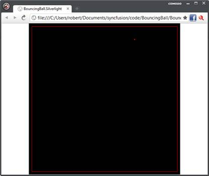

# 第六章模拟和图形

我喜欢把屏幕上的像素分成两部分:

*   低级图形编程，其中程序员负责控制屏幕上出现的几何图形的算法。这方面的一个例子可能是创建一个游戏，程序员直接负责绘制出现在屏幕上的各种元素。
*   高级用户界面创建，其中程序员负责将标签和文本框等公共元素组合在一起，以快速创建实用的用户界面。

F#可用于完成这两个部分。在本章中，我们将了解如何在 F#中创建图形，在下一章中，我们将了解如何将表单和其他更高级别的用户界面组合在一起。

我已经将 F#中的图形创建与模拟创建配对。这是因为你想要展示的图形很可能是某种模拟的结果。在这种情况下，为了保持例子简单，我选择创建一个弹跳球的模拟。还有许多其他的模拟可能会让你感兴趣，从康威的生命游戏到许多种类的分形。这些可以用类似于本章讨论的弹跳球模拟的方式来实现。甚至 F#中游戏的实现也可以大量借鉴本章中描述的技术。

弹跳球模拟本身将是一个简短的 F#模块，只生成模拟的原始数据。然后我们将展示如何在 WPF 和 Silverlight 中进行渲染。

通过以这种方式创建应用程序，我们可以很好地分离关注点。模拟负责应用程序的数学部分——尽管在这种情况下数学非常简单——图形层只负责渲染模拟产生的数据。

## 弹跳球模拟

我们将要看到的弹跳球模拟可能是你能想象到的最简单的模拟。我们的目标只是简单地模拟一个在由四面墙限定的区域之间无限弹跳的球。要开始我们的球模拟，我们需要选择一种表示球的方式。为此，我们必须决定球的哪些信息对模拟很重要。在这种情况下，我们关心两件事:球的位置和速度。由于这是一个二维模拟，这些值可以用 X 和 Y 坐标中的四个数字来表示:两个代表位置，两个代表球的速度。我们可以包括许多关于球的其他细节，例如帮助计算球受到多大阻力的摩擦系数，或者关于球的旋转方向和速度的细节，以帮助确定球撞击物体时将如何移动，但是我们的模拟足够简单，这些细节只是不相关，所以我们不包括它们。球可以用一个简单的 F#记录来表示:

```fs
    /// Represents a ball by its position and its velocity.
    type Ball =
        { X: float
          Y: float
          XVel: float
          YVel: float }

```

提供构造对象新实例的静态方法通常很有用。这为创建对象的新实例提供了一种方便的简写方式。在这种情况下，它看起来像:

```fs
            /// Convient function to create a new instance of a ball.
            static member New(x: float, y: float, xVel: float, yVel: float) =
                { X = x
                  Y = y
                  XVel = xVel
                  YVel = yVel }

```

既然我们已经有了我们球的代表，是时候考虑球将如何移动了。我们将把它实现为一个创建球的新的更新版本的函数:X 和 Y 坐标将根据球的行进方向进行更新，如果球碰到墙壁，速度值也将更新。为了做到这一点，我们需要一组额外的数据:球所绕过的区域的尺寸。这些将作为参数传递给计算球运动的函数。

我们需要做的计算非常简单。我们更新球的位置，如果球在界外，我们反转行进方向，再次更新位置。否则，我们就把球移到新的位置。我已经将这个算法实现为`Ball`类型的成员方法，并调用了`Move`方法。`Move`方法接受四个参数:`xMin`、`yMin`、`xMax`和`yMax`。这些定义了球运动的区域。将它实现为一个成员函数是很方便的，因为模拟很简单，关于环境的信息以单个数字的形式传递。更复杂的模拟可能会有两种变化。首先，将球运动环境的信息分组的环境类型将传递给函数，而不是单个数字。其次，可能有必要在一个模块中有一个集中的功能来协调模拟的不同元素。由于模拟很简单，我们将坚持成员和单个参数的便利性:

```fs
            /// Creates a new ball that has moved one step by its velocity within
            /// the given bounds. If the bounds are crossed, the ball velocity 
            /// is inversed.
            member ball.Move(xMin: float, yMin: float, xMax: float, yMax: float) =
                // Local helper to implement the logic of the movement.
                let updatePositionAndVelocity pos vel min max =
                    let pos' = pos + vel
                    if min < pos' && pos' < max then
                        pos', vel
                    else
                        pos - vel, -vel
                // Get the new position and velocity.
                let newX, newXVel =
                    updatePositionAndVelocity ball.X ball.XVel xMin xMax
                let newY, newYVel =
                    updatePositionAndVelocity ball.Y ball.YVel yMin yMax

                // Create the next ball.
                Ball.New(newX, newY,newXVel, newYVel)

```

请注意，实际上只有一个计算要做，但是我们需要做两次，对于 X 和 Y 坐标。为了实现这一点而不重复，我们定义了一个局部辅助函数`updatePositionAndVelocity`，它封装了更新坐标的计算。然后我们可以调用这个函数，将 X 和 Y 坐标的相关细节传递给它，这个函数将返回更新后的位置和速度。函数需要做的最后一件事是创建新的球定义并返回它。

这很好地说明了 F#的一些简单但重要的特性的使用，即使用局部函数来避免重复和使用元组来返回多个值。在没有局部函数的语言中，重复位置的计算可能很有诱惑力，因为它相当短而且简单。然而，随着代码的维护，任何重复都会导致定义随着时间的推移而出现分歧，这很可能会导致错误。通过元组返回多个值的能力也有助于这个过程。如果我们不能做到这一点，另一种方法是直接从我们的计算中更新变量。这将降低代码的灵活性，因为它将与正在更新的变量定义相耦合。

现在我们有了一个定义球如何运动的模型，我们需要测试这个模型，以确保我们有我们期望的行为。

## 测试模型

这种基于模型的方法的优点之一是它使测试非常简单。模型消耗并产生数据，因此很容易创建所需的输入，并验证模型输出了我们期望的值。使用 F#提供了使用 F# Interactive 创建测试脚本的额外便利，我们可以用单个键击来执行测试脚本。

我们想测试四种情况:

*   球不会在 X 或 Y 方向撞击墙壁，因此不会反弹。
*   球在 X 方向撞击墙壁，但不是在 Y 方向，因此在 X 方向会发生反弹。
*   球不是在 X 方向撞击墙壁，而是在 Y 方向撞击墙壁，因此会在 Y 方向发生反弹。
*   球在 X 和 Y 两个方向上都碰到了墙壁，所以在两个方向上都发生了反弹。

所有测试将共享相同的结构；只有数据和断言会改变，所以我们可以编写一个通用测试，并使用它来测试所有四个场景。但是首先，为了开始我们的测试，我们需要添加一个新的 F#脚本，并添加几个命令来加载要测试的代码:

```fs
    #load "BallModel.fs"
    open FsSuccinctly.BouncingBall

```

第一行将包含球模型的文件加载到 F# Interactive 中，下一行打开`BallModel.fs`文件中定义的命名空间，以便于访问其中包含的类型和函数。现在我们可以访问需要测试的类型和函数，我们可以编写这个通用测试函数:

```fs
    let genericBallTest name x y shouldBounceX shouldBounceY =
        // Create a ball.
        let ball = Ball.New(x, y, 1., 1.)
        // Move the ball.
        let ball' = ball.Move(0., 0., 100., 100.)
        // Verify we have the movement we expect.
        let xOp = if shouldBounceX then (-) else (+)
        let yOp = if shouldBounceY then (-) else (+)
        if xOp ball.X ball.XVel <> ball'.X then failwith "X value not updated correctly"
        if yOp ball.Y ball.YVel <> ball'.Y then failwith "Y value not updated correctly"
        // Notify the user that the test has passed.
        printfn "passed - %s" name

```

这个函数取 5 个参数:`name`，定义测试的名称，让我们在测试通过时写出有意义的消息；`x`和`y`，定义测试用球的位置；最后是`shouldBounceX`和`shouldBounceY`，它们定义了我们是否期望球反弹，并在测试断言期间使用。之后，测试的结构非常简单。首先我们创建一个要测试的球对象的实例，然后我们调用我们的移动函数来创建更新的球。接下来，我们验证球是否已经正确移动，最后，如果球已经按预期移动，我们将打印一条成功消息。测试中唯一复杂的部分是验证球是否移动正确。为此，我们测试`shouldBounceX`和`shouldBounceY`参数，看看球的速度是应该加还是减，然后我们自己执行加法或减法操作，并根据实际结果进行测试。如果结果不像我们预期的那样，我们调用`failwith`函数——一种创建带有适当错误消息的异常的简单方法——否则我们继续。球是否在正确位置的计算很容易进行，因为我们可以访问原始球(它是不可变的，因此是不变的)和更新的球实例。

现在我们已经有了运行测试的功能，很容易为我们感兴趣的四种情况创建我们需要的测试。我们知道每个测试都是在 100×100 的格子上进行的，所以我们只需要在合适的位置开始击球。下面是测试每个案例的四个函数:

```fs
    let testNoneBounce() =
        genericBallTest "testNoneBounce" 10\. 10\. false false

    let testBounceX() =
        genericBallTest "testBounceX" 99\. 10\. true false

    let testBounceY() =
        genericBallTest "testBounceY" 10\. 99\. false true

    let testBounceBoth() =
        genericBallTest "testBounceBoth" 99\. 99\. true true

```

为了执行这些测试，我们需要从顶层调用每个函数:

```fs
    testNoneBounce()
    testBounceX()
    testBounceY()
    testBounceBoth()     

```

当这些测试交互执行时，我们期望看到的结果是:

通过-TestNoenBound

通过-TestBounchex

通过-TestBoundey

通过-TestBouncebooth

与使用单元测试框架(如 NUnit)相比，以这种基本方式进行测试有一些缺点。两个主要的缺点是需要显式调用您想要测试的函数，并且所有测试都将在第一个错误时停止。然而，这种测试方法的主要优点是不需要依赖外部框架。此外，这两种方法并不是不兼容的——我经常发现我只是直接使用 F# Interactive 开始测试一个项目，然后随着项目的成熟将我的测试移植到一个单元测试框架中。

## 绘制模拟结果

现在，我们已经确定我们的模拟行为符合预期，是时候在屏幕上绘制结果了。我们将使用 WPF，然后使用 Silverlight 来实现这一点。虽然 WPF 和 Silverlight 中可用的控件是相似的，但是低级 API 有很大的不同，所以这将是在 GUI 库之间移植模拟的一个有趣的练习。

WPF 有一套很好的绘制形状的方法。要访问这些方法，程序员只需要创建一个从`System.Windows.FrameworkElement`派生的类型，并覆盖传递给`DrawingContext`参数的`OnRender`方法。我们将创建一个类型，`BallRender`，它将负责运行模拟和渲染结果。我们将这样声明类型:

```fs
    type BallRender() as br =
        inherit FrameworkElement()

```

为了渲染我们的模拟结果，我们需要缩放它们。我们选择模拟球在 100×100 的网格上弹跳，球的宽度只有一个点。如果我们试图在不缩放的情况下渲染它，即使在今天分辨率最低的屏幕上，它也会显得很小。这正是用户界面应该处理的那种几何计算。模拟应该可以自由使用便于进行模拟的值和表示。图形用户界面有责任将其转化为对最终用户有吸引力的东西。为了进行这些计算，我们需要一些与控件布局相关的常量，因此我们将在类的隐式构造函数中直接在类型定义之后声明这些常量:

```fs
        // Ball size and limits.
        let size = 5.0
        let xMax = 100.0
        let yMax = 100.0

        // Offset to give a nice board.
        let offset = 10.0

```

我们还需要一些钢笔和画笔对象来定义线条和填充区域的外观:

```fs
        // Pen and brush objects.
        let brush = new SolidColorBrush(Colors.Black)
        let pen = new Pen(brush,1.0)

```

为了运行模拟，我们需要两件事:对当前球对象的引用，它的位置将随着时间的推移而更新，以及负责执行模拟和更新球位置的计时器。当前球将被保存在参考单元中。引用单元格是内置于 F#中的可变类型，支持随时间变化的值。参考单元格由`ref`功能创建:

```fs
        // A reference cell that holds the current ball instance.
        let ball = ref (Ball.New(50., 80., 0.75, 1.25))

```

计时器我们将使用 WPF 的`DispatcherTimer`。这是一个`Tick`事件在图形用户界面线程上执行的时间，因此不需要担心将模拟数据封送回到图形用户界面线程。这对于我们的简单模拟来说非常有效，因为在后台线程上执行`Tick`事件的计算速度非常快，实际上会损害性能，因为线程同步的开销会比模拟本身的成本更高。这将是你创建的许多模拟的情况；然而，随着模拟的复杂性和执行时间的增长，有必要在后台线程上运行它来保持图形用户界面的响应。当模拟变得如此昂贵以至于运行它需要一个后台线程时，引入一个新的抽象——通常是一个新的类——来运行它可能是值得的。但是，对于许多情况，简单的时间就可以了，这可以声明为类成员，如下例所示:

```fs
        // Timer for updating the ball's position.
        let timer = new DispatcherTimer(Interval = new TimeSpan(0,0,0,0,50))

```

为了创建一个平滑的动画，你需要每秒至少 12 帧，所以球的位置必须每秒至少更新 12 次。初始化计时器，使其每 50 毫秒运行一次。这应该给我们每秒 20 帧，所以我们应该总是有漂亮，流畅的动画。

我们需要在构造函数中做的最后一件事是调整控件的大小，使其与我们正在绘制的区域的大小相对应，并初始化计时器的`Tick`事件。为此，创建一个内部函数`init()`，并在构造函数的末尾调用它:

```fs
        // Helper function to do some initialization.
        let init() =
            // Set the control's width and height.
            br.Width <- (xMax * size) + (offset * 2.0)
            br.Height <- (yMax * size) + (offset * 2.0)

            // Set up the timer.
            timer.Tick.Add(fun _ ->
                // Move the current ball to its next position.
                ball := ball.Value.Move(0.,0., xMax,yMax)
                // Invalidate the control to force a redraw.
                br.InvalidateVisual())
            timer.Start()

        do init()

```

让我们仔细看看定时器`Tick`事件的初始化。这是通过向事件添加匿名 lambda 函数进行的初始化。在这个函数中，我们首先通过调用当前球上的`Move`将球移动到它的新位置，然后将结果球存储在`ball`参考单元中。其次，我们调用控件的`InvalidateVisual()`方法——这将导致控件被重绘，以便用户可以看到球的新位置。

为了允许我们在控件上绘制，我们需要覆盖它的`OnRender`方法。这将为我们提供一个`DrawingContext`参数，该参数有一套很好的绘制图元的方法，如直线、矩形和椭圆。这使得画球非常简单。只需将模拟输出乘以适当的比例因子，然后加上边框的偏移量，即可计算出其当前位置。然后我们可以通过调用`DrawEllipse`方法来绘制球。我们还绘制了一个边框，使用户更容易看到球移动的区域:

```fs
        /// The function that takes care of actually drawing the ball.
        override x.OnRender(dc: DrawingContext) =
            // Calculate the ball's position on the canvas.
            let x = (ball.Value.X * size) + offset
            let y = (ball.Value.Y * size) + offset

            // Draw the ball and an outline rectangle.
            dc.DrawEllipse(brush, pen, new Point(x, y), size, size)
            dc.DrawRectangle(null, pen, new Rect(offset, offset, size * xMax, size * xMax))

```

查看控件所需的代码现已完成。剩下的就是一个小小的 WPF 管道来创建一个窗口，它将承载控件并创建一个事件循环来显示窗口:

```fs
    module Main =

        // Create an instance of the new control.
        let br = new BallRender()
        // Create a window to hold the control.
        let win = new Window(Title = "Bouncing Ball",
                             Content = br,
                             Width = br.Width + 20.,
                             Height = br.Height + 40.)

        // Start the event loop and show the control.
        let app = new Application()
        [<STAThread>]
        do app.Run win |> ignore

```

这里我们看到第一个`let`绑定创建了我们的球渲染控件的一个新实例，下一个创建了一个将托管控件的窗口，在创建时设置了窗口的一些属性。最后，我们创建一个 WPF 应用程序类的新实例，并使用它通过调用其 run 方法来启动 WPF 事件循环。关于这一点最需要注意的是，我们在对 run 方法的调用中附加了一个`STAThread`属性，以确保事件循环使用了正确的线程模型。下图显示了程序执行时窗口的外观:


图 3:弹跳球模拟

现在，我们将快速了解如何将控件移植到 Silverlight，以利用 Silverlight 在网络浏览器中轻松下载和执行的能力，从而允许您创建的模拟或游戏轻松分发给用户。

Silverlight 的低级接口与 WPF 的不同；没有用于绘图的 API。如果要创建自定义形状，最好将形状写入可写位图，然后使用用户控件显示位图。

Visual Studio 2012 附带了一个用于创建已安装的 F# Silverlight 应用程序的模板。然而，使用在线提供的模板之一创建一个 Silverlight 应用程序更容易。本示例基于 Daniel Mohl 的 F# Web Application (Silverlight)，可从[http://visualstudiogallery . msdn . Microsoft . com/f0e 9 a 557-3 FD 6-41 d9-8518-c 1735 b 382 c 73](http://visualstudiogallery.msdn.microsoft.com/f0e9a557-3fd6-41d9-8518-c1735b382c73)下载或在**新建项目**对话框中在线搜索找到，如下图所示:


图 4: F#网络应用程序

这个应用程序附带了一些预定义的 XAML 页面，您需要删除。只保留模板附带的**appllogic . fs**文件的基本内容。

我们将像构建 WPF 版本一样构建代码。我们将创建一个负责呈现弹跳球的控件，然后添加在 Silverlight 中显示这个控件所需的样板代码。球渲染控件从声明一个继承自`UserControl`的新类型开始:

```fs
    type BallRender() as br =
        inherit UserControl()

```

然后，我们将添加一些常量来控制整个控件的外观:

```fs
        // Ball size and limits.
        let size = 5.0
        let xMax = 100.0
        let yMax = 100.0

        // Offset to give a nice board.
        let offset = 10.0

        // Calculate total width and height of the area.
        let xTotalWidth = (xMax * size) + (offset * 2.0) |> int
        let yTotalWidth = (yMax * size) + (offset * 2.0) |> int

```

接下来，我们需要声明一个可写位图，我们将在该位图上绘制我们的弹跳球，并且该位图需要包装在一个图像控件中，以便可以显示:

```fs
        // The writable bitmap which will allow us to draw pixels onto it.
        let bitmap = new WriteableBitmap(xTotalWidth, 
                                         yTotalWidth)

        // The image control that holds the bitmap.
        let image = new Image(Source = bitmap)

```

不幸的是，可写位图不支持任何简单的写入方式；它只有一个代表位图颜色的整数平面数组。为了使在位图上绘图更容易，我们需要一些抽象来允许我们更容易地设置位图的像素。这采用了两个函数的形式:一个将 Silverlight `Color`值转换为`System.Int32`值的函数，以及一个可以通过像素的 x 坐标和 y 坐标而不是其在可写位图用来表示像素的整数平面数组中的位置来设置像素颜色的函数。

```fs
        // Convert an RBG color to the int format used by the bitmap.
        let colorToInt (c: Color): int =
            [c.A, 24; c.R, 16; c.G, 8; c.B, 0]
            |> List.sumBy (fun (col, pos) -> (int col) <<< pos)

        // Function to set a pixel by its x-coordinate and y-coordinate to the given color.
        let setPixel x y c =
            bitmap.Pixels.[y * xTotalWidth + x] <- colorToInt c

```

`colorToInt`函数取一个`Color`值并返回一个`int`。`Color`值具有代表颜色的 alpha、红色、绿色和蓝色分量的`byte`成员。为了将这些值拟合到一个整数中，每个分量都需要移位一些位——蓝色为 0，绿色为 8，红色为 16，阿尔法为 24。该函数通过创建一个元组列表来实现这一点，该列表将颜色的阿尔法、红色、绿色和蓝色分量与它们必须移位的位数配对。然后我们可以使用`List.sumBy`函数，该函数将一个函数应用于列表中的每个项目，然后将应用于列表每个元素的函数结果相加。因此，传递给`List.sumBy`的 lambda 函数执行位移位，而`List.sumBy`将结果累加成一个整数。`setPixel`功能获取要设置的像素的 x 和 y 坐标以及要设置的颜色。然后，该函数使用一个简单的公式找到要设置的适当像素，然后将给定的颜色转换为整数，并在位图的`Pixel`数组属性中设置该像素。

现在，我们可以轻松地将像素写入位图的表面，我们可以创建一个函数来绘制球。最简单的方法是使用描述球布局的字符串列表模板。字符串中的每个字符代表球的一个像素。星号(`*`)表示像素应该是彩色的。任何其他字符都意味着它应该保持原样。这似乎是一件奇怪的事情，但这是一种非常方便的方式来直观地描述代码中的球，同时获得一个非常容易处理的数据结构。一旦我们定义了这个球模板，只需要创建一个接受球的函数，枚举模板的行，然后枚举每行中的字符，看看应该填充球的哪些像素。

```fs
        // Template that describes what the ball should look like.
        let ballTemplate =
              [ "     "
                " *** "
                "*****"
                " *** "
                "     " ]

        // Draws the ball on the bitmap.
        let drawBall ball c =
            // Calculate top corner of the ball.
            let xBall = (ball.X * size) + offset
            let yBall = (ball.Y * size) + offset
            // Iterate over the template, setting a
            // pixel if there is an asterisk.
            ballTemplate
            |> Seq.iteri(fun x row ->
                row |> Seq.iteri (fun y item ->
                    if item = '*' then
                        setPixel (int xBall + x)  (int yBall + y) c))

```

`drawBall`功能取一个球和一种颜色来画。该函数使用 F#的`Seq.iteri`函数枚举`ballTemplate`，该函数枚举任何`IEnumerable<T>`集合并将给定的函数应用于该集合的每个成员。应用于每个成员的函数还被传递一个代表当前值索引的整数(`iter`是迭代的缩写，`iteri`末尾的`i`是索引的缩写)。因此，我们首先枚举行，然后是单个的列，并且每当我们找到一个星号时，就用这两个索引作为给定球位置的偏移量来绘制一个像素。你可能想通过改变球中的星号来尝试不同的球布局，看看你是否能找到一个更令人愉快的球形状。

现在我们可以画一个球，我们需要能够在球将反弹的区域周围画一个边界。我们将通过创建一个`drawSquare`函数来做到这一点:

```fs
        // Draws a square around the border of the area.
        let drawSquare c =
            // Calculate where sides should end.
            let xSize = xMax * size + offset |> int
            let ySize = yMax * size + offset |> int
            // Convert the offset to an int.
            let offset = offset |> int
            // Draw the x sides.
            for x in offset .. xSize do
                setPixel x  offset c
                setPixel x  ySize c
            // Draw the y sides.
            for y in offset .. ySize do
                setPixel offset y c
                setPixel xSize y c

```

画正方形相当容易；我们只需要知道左上角将从哪个像素开始，右下角将在哪里结束。对于 x 和 y 方向，左上角将从`offset`开始，左下角将有`offset + xMax * size, offset + xMax * size`的坐标。一旦我们计算了这些值，我们就可以通过从最小 x 坐标迭代到最大 x 坐标来绘制正方形的水平线；将像素设置在当前 x，最小 y 和当前 x，最大 y；然后在最小 y 和最大 y 之间做同样的事情来画垂直线。

我们现在能够画出球和包围它的边界。现在我们必须使用这两个函数来显示球随时间的运动。为此，我们使用了与 WPF 相同的技术:我们在参考单元中创建球来跟踪随时间的变化，并使用时间来更新球和绘制结果。初始化球和定时器的代码如下例所示。

```fs
        // A reference cell that holds the current ball instance.
        let ball = ref (Ball.New(50., 80., 0.75, 1.25))

        // Timer for updating the ball's position.
        let timer = new DispatcherTimer(Interval = new TimeSpan(0,0,0,0,50))

```

事件处理程序必须用黑球替换球的旧位置，将球移动到新位置，绘制新球和边框，最后调用位图的`Invalidate()`方法导致重绘。这样做的代码相当简单:

```fs
        // Handler for the timer's tick event.
        let onTick() =
            // Write over the old ball.
            drawBall !ball Colors.Black
            // Move the current ball to its next position.
            ball := ball.Value.Move(0.,0.,xMax,yMax)

            // Draw ball and square.
            drawBall !ball Colors.Red
            drawSquare Colors.Red

            // Invalidate the bitmap to force a redraw.
            bitmap.Invalidate()

```

之后剩下的就是把所有东西连接起来。我们将为此定义并调用一个`init()`函数。`init()`功能将使用黑色填充位图，将图像分配给用户控件的`Content`属性，以便在用户控件中看到它，最后将我们的`onTick`功能添加到计时器的`Tick`事件中并启动它。

```fs
        // Helper function to do some initialization.
        let init() =
            // First color our bitmap black.
            Array.fill
                bitmap.Pixels
                0 bitmap.Pixels.Length
                (colorToInt Colors.Black)

            // Make the image the user control's content.
            br.Content <- image

            // Set up the timer.
            timer.Tick.Add(fun _ -> onTick())
            timer.Start()

        do init()    

```

这就完成了我们展示弹跳球的控制工作。剩下的就是 Silverlight 管道，它将在应用程序启动时显示控件。这很简单:

```fs
    type App() as this =
        inherit Application()

        do this.Startup.Add(fun _ -> this.RootVisual <- new BallRender())

```

当然，仍然需要创建一个测试 HTML 页面，该页面将加载 Silverlight 运行时以及我们刚刚创建的应用程序，但是我们使用的模板应该考虑到这一点。查看结果模拟应该只需按 F5 即可。您可以在下图中看到在我的机器上运行的模拟。



图 5:弹跳球模拟

尽管 Silverlight 的 API 提供的低级绘图功能少得多，但我们已经看到，通过创建一些简单易用的抽象，创建带有自定义图形的应用程序仍然相当容易。

## 总结

在本章中，我们已经看到了如何在 F#中构建一个简单的模拟，以及如何使用低级绘图 API 在 F#中创建自定义图形。