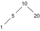

# 第三章深入

我们将从一些更简单的概念开始这一部分，这些概念在 C#中不太等价(至少在没有大量工作的情况下)，但加深了我们对 F#的理解，并添加到我们的“像 F#程序员一样思考”工具箱中。我们将从闭包和有区别的联合开始，然后转向活动模式和延续传递风格(CPS)。我们将重新讨论使用 CPS 的递归，然后讨论函数式编程新手开发人员最困难的两个主题:单子和计算表达式。

## 关闭

闭包是一个您应该已经熟悉的概念，因为它在 C#中的 lambda 表达式中起着重要的作用。“在编程语言中，闭包…是一个函数…以及一个引用环境——一个存储对该函数的每个非局部变量(也称为*自由变量*或*上值*)的引用的表。闭包——与普通函数指针不同——允许函数访问那些非局部变量，即使在它的直接词法范围之外被调用。”[<sup>【46】</sup>](IFP_0010.htm#_ftn46)

例如，在 C#中，我们可以演示“打印词法范围的值”闭包:

```fs
    using System;

    namespace Closures
    {
           delegate void Func();

           class Program
           {
                  static Func[] funcs = new Func[10];

                  static void CreateFuncs()
                  {
                         for (int i = 0; i < funcs.Length; i++)
                         {
                               int j = i;     // Create a lexical scope.
                               funcs[i] = () => Console.Write("{0} ", j);
                         }
                  }

                  static void Main(string[] args)
                  {
                         CreateFuncs();

                         for (int i = 0; i < funcs.Length; i++)
                         {
                               funcs[i]();
                         }
                  }
           }
    }

```

产生以下输出:

```fs
    0 1 2 3 4 5 6 7 8 9

```

我们可以用 F#写一些类似的东西:

```fs
    let rec createFuncs i arrayOfFuncs =
        match i with
        | 10 -> arrayOfFuncs
        | n -> createFuncs (n+1) ((fun () -> printfn "%d" n) :: arrayOfFuncs)

    let funcs = List.rev (createFuncs 0 [])

    List.iter (fun f -> f()) funcs;;

```

前面的代码产生相同的输出(每个数字在一个单独的行上)。在函数式编程中经常依赖闭包，因为人们经常创建局部函数应用程序，这些应用程序传入的值(或函数)是当前词法范围的一部分。为了精通函数式编程，人们应该对闭包非常熟悉。

## 受歧视的工会…

“受歧视的联合提供了对可能是多个命名案例之一的值的支持，每个案例可能具有不同的值和类型。区分联合对于异构数据很有用；可以有特殊情况的数据，包括有效情况和错误情况；从一个实例到另一个实例类型不同的数据；并且作为小对象层次的替代。此外，递归区分联合用于表示树数据结构。”[<sup>【47】</sup>](IFP_0010.htm#_ftn47)

你可以把有区别的联合看作是给一个类型提供了额外的语义，把有区别的联合理解为类似“一个类型可以是一个`x`、一个`y`或者一个`z`(等等。)其中`x`、`y`和`z`分别为`a`、`b`和`c`型。”这并不是在所有情况下都成立，我们将在后面看到。

### …而不是对象层次结构

在命令式面向对象语言中，有区别的联合没有直接的对等物。最接近的方法是实现对象层次结构。以两种形状为例:圆形和矩形。在面向对象的范例中，我们通常会编写一个对象模型:

```fs
    public class Shape
    {
     public abstract double Area { get; }
    }

    public class Circle : Shape
    {
     public double Radius { get; set; }
     public override double Area { get { return 3.14 * Radius * Radius; } }
    }

    public class Rectangle : Shape
    {
     public double Height { get; set; }
     public double Width { get; set; }
     public override double Area { get { return Width * Height; } }
    }

```

在 F#中，我们可以实现一个有区别的联合:

```fs
    type Shape =
        | Circle of double
        | Rectangle of double * double

```

注意，在 Visual Studio 2013 中，我们可以为类型分配标签:[<sup>【48】</sup>](IFP_0010.htm#_ftn48)

```fs
    type Shape =
        | Circle of radius : double
        | Rectangle of width : double * height : double

```

出于我们的目的，我们将继续关注 Visual Studio 2012 中支持的歧视性联合的实现。

请注意，C#中最接近的构造是类，如前所述。

然后，我们可以使用类型上的函数和模式匹配来计算形状的面积:

```fs
    let area shape =
        match shape with
        | Circle r -> 3.14 * r * r
        | Rectangle (w, h) -> w * h

```

由于此函数只在单个参数上匹配每个情况下的 lambda 表达式，因此我们使用以下简写语法:

```fs
    let area = function
        | Circle r -> 3.14 * r * r
        | Rectangle (w, h) -> w * h

```

然后，我们可以计算两个形状的面积(F#控制台):

```fs
    > area (Circle(1.0));;
    val it : float = 3.14
    > area (Rectangle(2.0, 4.0));;
    val it : float = 8.0

```

将此与前面的 C#代码进行比较，您可以说我们已经“去虚拟化”了类层次结构，并显式实现了虚拟表的等价物。

### …可以像枚举一样行动

有区别的联合不需要为事例标识符指定“类型”。我们可以使用(F#控制台)在 C#中构造类似于“枚举”的东西:

```fs
    > type Vehicle =
        | Truck
        | Car

    let vehicles = [Truck, Car];;

    type Vehicle =
      | Truck
      | Car
    val vehicles : (Vehicle * Vehicle) list = [(Truck, Car)]

```

与 C#枚举的显著区别在于大小写标识符(这里是“卡车”和“汽车”)没有赋值——标识符只是一个标识符。

### …可以自引用

```fs
    type Assembly =
      | Subassembly of string * Assembly
      | Part of string

```

在这里，我定义了一个组件，它可以是一个有名称的子组件，也可以是一个有名称的实际零件。

### …在处理树木时非常有用

在描述树中的一个节点时，人们经常发现有区别的联合。例如，以下代码将二叉树类型定义为`Empty`(无类型)或具有三元素元组类型的`Node`，即:

*   左边的另一棵树也是同样的类型，
*   节点的值，以及
*   右边的另一棵相同类型的树。

```fs
    type 'a BinaryTree =   
      | Empty
      | Node of 'a BinaryTree * 'a * 'a BinaryTree

```

这是定义二叉树的一种方式。请注意，案例标识符`Empty`没有指定任何“类型”信息——它只是作为一个占位符标识符，允许我们构建这样的树(F#控制台):

```fs
    > let tree = Node( Node( Node(Empty, 1, Empty), 5, Empty), 10, Node(Empty, 20, Empty));;

    val tree : Tree<int> =
      Node (Node (Node (Empty,1,Empty),5,Empty),10,Node (Empty,20,Empty))

```

通过这个例子，我们构建了一棵如下所示的小树:



表达式树是另一个很好的例子，在这个例子中，有区别的联合非常有效。这个例子，借用了 MSDN 对受歧视工会的描述，[<sup>【49】</sup>](IFP_0010.htm#_ftn49)说明了这个概念:

```fs
    type Expression =
        | Number of int
        | Add of Expression * Expression
        | Subtract of Expression * Expression
        | Multiply of Expression * Expression
        | Divide of Expression * Expression
        | Variable of string

```

### 课程

*   您可以在使用对象层次结构的地方使用有区别的联合。
*   区分联合是一种有用的构造，用于指示“类型名”由特定的标识符组成，每个标识符可以是不同的类型。
*   受歧视的工会在 C#中看起来像`typeof(…)`，但实际上不是。它们更像是一个查找——给定一个标识符名称，这是它的(可选)类型。
*   使用有区别的联合为类型附加语义。编译器使用额外的语义来验证您的计算。

## 活动模式

模式匹配是函数式编程语言中常见的技术。匹配表达式看起来有点像命令式语言中的 case 语句，但有显著的区别。首先，它是一种表达，而不是陈述。第二，在它最独特的形式中，每种情况都代表了一种替代方式，一种被匹配的值的类型的值可以被构造，这提供了一种强大的通用方式来分离给定类型的事物。在某些语言中，编译器会告诉您该类型的情况是否详尽。基本概念有各种扩展。一个值得注意的 F#特有的是活动模式。

“活动模式使您能够定义细分输入数据的命名分区，这样您就可以在模式匹配表达式中使用这些名称，就像使用区别联合一样。您可以使用活动模式以定制的方式为每个分区分解数据。”[<sup>【50】</sup>](IFP_0010.htm#_ftn50)

类似于区分联合，在区分联合中，我们创建的标识符可以与类型相关联，也可以不与类型相关联，使用活动模式，我们可以在*活动识别器*中命名模式的“分区”。例如:

```fs
    let (|Prefix|_|) (p:string) (s:string) =
        if s.StartsWith(p) then
            Some(s.Substring(p.Length))
        else
            None

```

当在字符串“s”的开头找到前缀`p`时，该活动识别器将允许我们匹配标识符`Prefix`。顺便说一下，这段代码是一个“部分活动模式”，因为我们不关心字符串的其余部分是什么。

我们在`match`语句中使用活动识别器:

```fs
    let activePatternTest s =
        match s with
         | Prefix "F#" rest -> printfn "Started with 'F#', rest is '%s'" rest
         | Prefix "Is" rest -> printfn "Started with 'Is', rest is '%s'" rest
         | _ -> printfn "Don't know what you're talking about."

```

这允许我们测试由活动识别器函数确定的特定模式。例如，这是三个模式匹配测试的输出(F#控制台):

```fs
    > activePatternTest "F# is great!"
    activePatternTest "Is F# great?"
    activePatternTest "Yes it is!";;

    Started with 'F#', rest is ' is great!'
    Started with 'Is', rest is ' F# great?'
    Don't know what you're talking about.

```

您可以使用活动模式将一个值分解成不同的表示形式。例如，假设您想要将除法的结果分解为结果本身或商及其余数。我们可以写两个活动模式(请注意，对于下面的例子，我不是在处理除以零的问题):

```fs
    let (|DivisionResult|) (numerator, divisor) = numerator / divisor
    let (|QuotientRemainder|) (numerator, divisor) =
                         (numerator / divisor, numerator % divisor)

```

现在，假设我们有两个函数，其中，它们会将结果打印为浮点结果或商和除数:

```fs
    let printResult numerator divisor =
        match (numerator, divisor) with
        | DivisionResult(r) -> printfn "Result = %f" r

    let printQuotientDivisor numerator divisor =
        match (numerator, divisor) with
        | QuotientRemainder(q, d) -> printfn "Quotient = %d, Divisor = %d" q d

```

然后，我们可以调用这两个函数，并根据我们打算如何将输入与活动模式相匹配来获得不同的结果(F#控制台):

```fs
    > printResult 1.0 3.0;;
    Result = 0.333333
    val it : unit = ()

    > printQuotientDivisor 1 3;;
    Quotient = 0, Divisor = 1
    val it : unit = ()

```

这两个例子当然微不足道。当使用部分活动模式组合匹配表达式中的几个选项时，活动模式的真正作用就显现出来了。例如，假设如果小数部分(小数点右边的所有内容)超过两位数，我们不希望在浮点除法中匹配，因此我们改用商余数格式。首先，让我们编写一个小助手函数来确定小数部分的长度:

```fs
    let moreThanTwoDigits n =
        let strN = n.ToString()
        let idx = strN.IndexOf('.')
        if idx > 0 then   // Is there a decimal point?
            let remainder = strN.Substring(idx)
            remainder.Length > 3 // Including the '.', returning true or false.
        else
            false   // No decimal point.

```

接下来，我们编写一个以通配符(`_`)结尾的部分活动模式。这告诉我们这是一个局部模式，我们将返回`None`或`Some`:

```fs
    let (|DivisionResult|_|) (numerator: int, divisor: int) : float option =
        let r = float(numerator) / float(divisor)
        if moreThanTwoDigits r then
            None
        else
           Some r

```

(强制转换用于强制函数只接受整数并返回可选的浮点数。)

商余数模式保持不变(也是*而不是*的部分模式):

```fs
    let (|QuotientRemainder|) (numerator, divisor) =
                          (numerator / divisor, numerator % divisor)

```

最后，我们可以编写一个函数，根据与活动模式的匹配打印结果:

```fs
    let printResult numerator divisor =
        match (numerator, divisor) with
        | DivisionResult(r) -> printfn "Result = %f" r
        | QuotientRemainder(q, d) -> printfn "Quotient = %d, Divisor = %d" q d

```

现在让我们看看结果(F#控制台):

```fs
    > printResult 2 4;;
    Result = 0.500000
    val it : unit = ()

    > printResult 10 3;;
    Quotient = 3, Divisor = 1
    val it : unit = ()

```

这里我们可以看到，对于 10/3，我们没有匹配活动模式`DivisionResult`，但是我们确实匹配了活动模式`QuotientRemainder`。

### 课程

*   和我们已经讨论过的其他概念一样(不久将再次讨论)，我们的想法是“反转”函数的行为。
*   我们已经创建了可以在特定环境中应用的可重用活动模式，而不是一个复杂的`if…then…else`语句，其中内置了所有的逻辑。
*   同样，这里没有什么是在 C#这样的命令式语言中做不到的；很简单，函数式编程促进了编程更多的重用风格(如果你使用正确的话)。

## 延续传球风格(CPS)

"延拓表示给定计算点的计算余数."[<sup>【51】</sup>](IFP_0010.htm#_ftn51)延续通常在命令式编程中不会遇到，但它们在函数式编程环境中有明确的用途，我们将在后面进一步讨论。基本上，这个想法是一个函数被提供了另一个函数，这个函数被调用了第一个函数的计算结果。例如，与其用管道编写数据库读取器来创建人员记录:

```fs
    let selectNames = createReader db sql |> createPersonListRec

```

我可以更改`createReader`的实现，接受延续函数，并使用 CPS 进行调用:

```fs
    let selectNames = createReaderCps db sql createPersonListRec

```

请注意，管道(`|>`)标记已经消失，我们正在提供想要传递结果的函数。`createReaderCps`功能定义如下:

```fs
    open System
    open System.Data
    open System.Data.SqlClient
    let createReaderCps (connection : SqlConnection) sql f =
        let command = connection.CreateCommand()
        command.CommandText <- sql
        let result = command.ExecuteReader()
        f result

```

注意`createReaderCps`函数的最后一个动作是如何调用提供的函数`f`得到`ExecuteReader()`调用的结果。

### 作为控制反转的延续

我们习惯于编写命令式代码，这样当发现无效条件时，方法会以特定的方式处理它:抛出异常、发出消息、返回 null 等。“失败”处理是该方法固有的。例如，在 F#中，我可以创建一个 PersonIDs 及其相关记录的地图:

```fs
    let nameMap = createReader db sql
                        |> createPersonListRec
                        |> Seq.map (fun r -> r.PersonID, r)
                        |> Map.ofSeq

```

我可以使用`Map.tryFind` (F#控制台)访问记录:

```fs
    > Map.tryFind 1 nameMap;;
    val it : Person option = Some {PersonID = 1;
                                   FirstName = "Ken";
                                   LastName = "Sánchez";}

    > Map.tryFind 1234 nameMap;;
    val it : Person option = None

```

然而，让我们使用延续来指定一旦找到记录我们想要做什么。为此，我们将创建一个函数，它包含两个函数(成功和失败)以及键和映射:

```fs
    let findRecord success fail key map =
        let record = Map.tryFind key map
        match record with
        | None -> fail key
        | _ -> success record

```

现在我们可以提供成功和失败状态的行为(控制反转)。一个非常简单的例子是打印记录值或“未找到”:

```fs
    > findRecord (fun r -> printfn "%A, %A" r.Value.LastName r.Value.FirstName)
               (fun r -> printfn "not found")
               1
               nameMap;;

    "Sánchez", "Ken"
    val it : unit = ()

    > findRecord (fun r -> printfn "%A, %A" r.Value.LastName r.Value.FirstName)
               (fun r -> printfn "not found")
               1234
               nameMap;;

    not found
    val it : unit = ()

```

(在这段代码中，我通过使用选项的`Value`属性来取消对结果的选项，这通常是不推荐的，但是在这种情况下，因为我知道该函数只在有匹配记录的情况下被调用，所以我知道以这种方式实现是安全的。)

#### 一个更复杂的例子:缓存

假设我们的记录被缓存，如果在缓存中找不到关键字，我们希望访问数据库以返回记录并将其添加到缓存中。由于缓存本身是可变的，我们将使用`System.Collections.Generic`命名空间来实例化一个只处理单个表的简单缓存:

```fs
    open System.Collections.Generic
    let cache = new Dictionary<int, Person>()

```

|  | 注意:因为我们使用的是可变结构，所以它不是线程安全的！在更新和检索项目之前，应该锁定缓存字典。 |

接下来，我们创建一个函数，给定一个`Person`记录(我们在[第 2 章](2.html#_Chapter_2_)中定义)来更新缓存。请注意，该函数还返回个人记录，这使得流水线操作和将记录绑定到变量更容易使用:

```fs
    let updateCache p =
        cache.[p.PersonID] <- p
        p

```

我将创建一个辅助函数，用于从`SqlDataReader`构造`Person`记录；当我们知道只有一条记录要读时，就要使用它:

```fs
    let createPersonRecord (reader : SqlDataReader) =
        let id = Convert.ToInt32(reader.["BusinessEntityID"])
        let fname = reader.["FirstName"].ToString()
        let lname = reader.["LastName"].ToString()
        {PersonID = id; FirstName = fname; LastName = lname}

```

接下来，我们编写一个函数，从数据库中检索一条记录或者抛出一个异常。当“从缓存中获取记录”失败时，我们将使用这个函数。由于这只是一个例子，它使用了一点蛮力:

```fs
    let getPersonFromDatabase id =
        printfn "Querying database"
        let sql = "select BusinessEntityID, FirstName, LastName from Person.Person where BusinessEntityID = " + id.ToString()
        let reader = createReader db sql
        match reader.Read() with
        | false -> failwith "record not found"
        | true ->
            let ret = reader |> createPersonRecord |> updateCache
            reader.Close()
            ret

```

现在我们可以写出我们的延拓函数了。注意我们是如何要求函数`onFail`作为第一个参数的，如果记录不在缓存中，我们用期望的标识调用它。这就要求调用者提供当记录不在缓存中时该做什么的实现，从而将实现由内而外地转变为控制反转。

还要注意对`TryGetValue`的调用。在 F#中，以元组的形式返回“out”参数以及方法调用结果。这是一个非常好的便利，因为我们既可以获得`TryGetValue`的成功状态，也可以获得成功时的值，而无需求助于引用类型[<sup>【52】</sup>](IFP_0010.htm#_ftn52)——或者更糟的是，一个可变类型来接收 out 值。

```fs
    let getRecord onFail id =
        let found, p = cache.TryGetValue(id)
        match found with
        | false -> onFail id
        | true ->
            printfn "From cache"
            p

```

我们现在可以通过创建两个部分函数来利用部分应用程序:一个在“连接”的环境中处理从数据库获取数据，另一个在“断开”的环境中简单地抛出异常:

```fs
    let getRecordConnected = getRecord getPersonFromDatabase
    let getRecordDisconnected = getRecord (fun _ -> failwith "not in cache")

```

让我们试驾一下(F#控制台):

```fs
    > getRecordConnected 21;;
    Querying database
    val it : Person = {PersonID = 21;
                       FirstName = "Terry";
                       LastName = "Eminhizer";}
    > getRecordConnected 21;;
    From cache
    val it : Person = {PersonID = 21;
                       FirstName = "Terry";
                       LastName = "Eminhizer";}
    > getRecordDisconnected 21;;
    From cache
    val it : Person = {PersonID = 21;
                       FirstName = "Terry";
                       LastName = "Eminhizer";}
    > getRecordDisconnected 22;;
    System.Exception: not in cache

```

注意第一次调用`getRecordConnected`查询数据库中的`ID 21`，第二次调用从缓存中获取记录。还要注意，在断开连接的状态下，我们只能从缓存中获取记录，否则会引发异常。

#### 课程

*   延续传递风格是一种强大的技术，它允许调用者定义函数如何继续处理，而不是将处理嵌入到函数本身。
*   重新思考对象层次结构，其中函数被覆盖，因为需要不同的行为，使用 CPS 代替。
*   查看您的函数，并考虑可以使用 CPS 提取哪些部分，以使您的程序更适合开发人员的需求。
*   将 CPS 与部分函数应用程序结合起来，创建可重用的行为。

### CPS 和递归

回想一下，为了让编译器将递归转换为迭代，递归调用必须是函数中的最后一次调用。有时这很难实现，尤其是在递归过程中处理两个或多个不同的“分支”时，例如解析二叉树。[<sup>【53】</sup>](IFP_0010.htm#_ftn53)使用前面描述的我们的`Tree`判别并集，我们可以看到 CPS 是在例如尾部递归确定树的大小时使用的必要设备。让我们看一个简单的递归实现，它计算非空节点:

```fs
    let getTreeSize tree =
        let rec treeSize tree acc =
            match tree with    
            | Empty -> acc
            | Node (left, _, right) -> treeSize left (acc+1) + treeSize right 0

        treeSize tree 0

```

后半部分`treeSize right 0`有点不直观——我们增加累加器是因为我们有一个节点。当递归调用处理左分支或右分支时，我们是否这样做并不重要；我们只是不要对左*和右*递归调用都这样做——否则我们会得到双倍的计数。

当我们使用前面定义的小树来调用它时，我们看到我们得到了四个节点(F#控制台):

```fs
    let tree = Node(Node(Node(Empty, 1, Empty), 5, Empty), 10, Node(Empty, 20, Empty))
    getTreeSize tree;;
    val getTreeSize : tree:Tree<'a> -> int
    val tree : Tree<int> =
      Node (Node (Node (Empty,1,Empty),5,Empty),10,Node (Empty,20,Empty))
    val it : int = 4

```

问题是，这个调用不是尾部递归的，所以我们有堆栈溢出的风险。

为了使这个尾部递归，我们必须使用 CPS 来传递延续操作:

```fs
    let getTreeSizeRec tree =
        let rec treeSize tree f =
            match tree with    
            | Empty -> f 0
            | Node (left, x, right) ->
                treeSize left (fun lacc ->
                    treeSize right (fun racc ->
                        f (lacc + racc + 1)
                    )
                )
        treeSize tree (fun x -> x)

```

这里，我们在 CPS 中使用带有左累加器和右累加器的双递归来创建尾部递归函数。这不是一件容易的事情，所以让我们放入一些跟踪语句，看看这是如何工作的:

```fs
    let getTreeSizeRec tree =
        let rec treeSize depth caller tree f =
            printfn "Depth: %d   Caller: %s" depth caller
            match tree with    
            | Empty ->
                printfn "Empty"
                f 0
            | Node (left, x, right) ->
                printfn "Node: %d" x
                treeSize (depth+1) "left" left (fun lacc ->
                    printfn "lacc: %d, x: %d" lacc x
                    treeSize (depth+1) "right" right (fun racc ->
                        printfn "lacc: %d, x: %d, racc: %d, returning = %d" lacc x racc (lacc+racc+1)
                        f (lacc + racc + 1)
                    )
                )
        treeSize 0 "root" tree (fun x -> x)

```

以下是输出(F#控制台):

```fs
    > let tree = Node(Node(Node(Empty, 1, Empty), 5, Empty), 10, Node(Empty, 20, Empty))
    let treeSize = getTreeSizeRec tree
    ;;
    Depth: 0   Caller: root
    Node: 10
    Depth: 1   Caller: left
    Node: 5
    Depth: 2   Caller: left
    Node: 1
    Depth: 3   Caller: left
    Empty
    lacc: 0, x: 1
    Depth: 3   Caller: right
    Empty
    lacc: 0, x: 1, racc: 0, returning = 1
    lacc: 1, x: 5
    Depth: 2   Caller: right
    Empty
    lacc: 1, x: 5, racc: 0, returning = 2
    lacc: 2, x: 10
    Depth: 1   Caller: right
    Node: 20
    Depth: 2   Caller: left
    Empty
    lacc: 0, x: 20
    Depth: 2   Caller: right
    Empty
    lacc: 0, x: 20, racc: 0, returning = 1
    lacc: 2, x: 10, racc: 1, returning = 4

    val tree : int Tree =
      Node (Node (Node (Empty,1,Empty),5,Empty),10,Node (Empty,20,Empty))
    val treeSize : int = 4

```

我们现在对这个函数的工作原理有了更好的理解。参考[附录 A](6.html#sigil_toc_id_40) 了解基于先前输出的完整“堆栈”跟踪。这段代码的“魔力”在于调用`f`时左累加器+右累加器+ 1 的总和。

```fs
    treeSize left (fun lacc -> treeSize right (fun racc -> f (lacc + racc + 1)

```

一个非常简单的例子就足以说明这一点:当用单个节点(`Empty, 10, Empty`)调用函数时:

*   左侧为`Empty`，所以传入的函数用参数`0`求值，导致内部函数被调用:

```fs
    treeSize right (fun racc -> f (0 + racc + 1)

```

*   右边是`Empty`，所以传入的函数用参数`0`求值，导致内部函数被调用:

```fs
    treeSize right (fun racc -> f (0 + racc + 1)

```

*   这个“种子”功能就是身份功能`x -> x`；因此`0 + 0 + 1`评价为`1`。一棵树只有一个节点。

对于更复杂的树，`f`是传递给每个递归调用的函数，因此每个递归“嵌套”了`fun lacc`或`fun racc`参数的计算。一旦函数可以求值，该值就成为先前嵌套函数的输入。同样，[附录 A](6.html#sigil_toc_id_40) 中的跟踪应该会使这一点更加清晰，我已经用函数的伪堆栈说明了跟踪——一旦最里面的函数求值，堆栈就会弹出，值作为参数提供给堆栈上的前一个函数。

#### 一个广义树递归折叠函数

当用函数式编程风格编写时，要问的一个问题是:“这种计算可以传入而不是硬连线到函数本身吗？”之前，在讨论高阶函数时，我们展示了如何编写一个以函数为参数的函数。这是一种非常强大的技术，类似的事情也可以通过延续来完成。例如，确定树的大小的代码可以重构，这样“延续”，在这种情况下是`lacc + racc + 1`，由调用者传入(我已经将函数重命名为更一般化的`foldTree`):

```fs
    let foldTree computation tree =
        let rec folding tree f =
            match tree with    
            | Empty -> f 0
            | Node (left, x, right) ->
                folding left (fun lacc ->
                    folding right (fun racc ->
                        f (computation lacc x racc)
                    )
                )
        folding tree (fun x -> x)

```

这导致了广义树`fold`运算。前面的计算，计算树叶，现在可以作为调用的一部分传递:

```fs
    let treeSize = foldTree (fun lacc _ racc -> lacc + racc + 1) tree

```

我们可以传递其他计算，例如，将树的所有值相加，假设`a`是类型`integer`:

```fs
    let nodeSum = foldTree (fun lacc x racc -> lacc + x + racc) tree

```

结果是(F#控制台):

```fs
    > let nodeSum = foldTree tree (fun lacc x racc -> lacc + x + racc);;

    val nodeSum : int = 36

```

这里的“魔力”(除了是高阶函数的优秀例子)是“累加器”的意思——在第一种情况下，它是一个递增的计数，在第二种情况下，它是一个和。

最后，我们可以使用部分函数应用程序来创建可重用的函数:

```fs
    let getTreeSize<'a> = foldTree (fun lacc (x : 'a) racc -> lacc + racc + 1)
    let getSumOfNodes = foldTree (fun lacc x racc -> lacc + x + racc)

```

现在我们可以调用我们的部分应用程序(F#控制台):

```fs
    > getTreeSize<int> tree;;
    val it : int = 4
    > getSumOfNodes tree;;
    val it : int = 36

```

请注意，在这个代码示例中，我们必须为`getTreeSize`函数指定类型，因为该类型无法推断，因为它没有在计算中使用！

#### 身份功能

这是身份功能:

```fs
    (fun x -> x)

```

当“播种”对需要初始函数的递归函数的调用时，这是一个非常有用的构造。这个构造非常有用，它实际上是一个运算符:[<sup>【54】</sup>](IFP_0010.htm#_ftn54)

```fs
    id

```

您可以在任何地方使用`id`，否则您将显式地编写`(fun x -> x)`。

#### 课程

*   当使用“多路径”递归(如树)时，CPS 是确保尾部递归的必要工具。
*   学会“颠倒”你对函数的想法——看看函数里面有什么，看看你是否想把它暴露在外面。
*   编写函数时要考虑部分应用:什么是“重用”参数和“高度变化”参数？“重用”参数应该放在第一位，这样就可以轻松定义部分函数应用程序，从而促进函数重用。
*   为了获得更多的乐趣(双关语)，请看“变形，第二部分”[<sup>【55】</sup>](IFP_0010.htm#_ftn55)
*   熟悉基本的 F#运算符。[<sup>【56】</sup>](IFP_0010.htm#_ftn56)这可以为你在试图弄清楚别人的代码时节省很多时间。

## 计算表达式

处理“m”字的时候到了——单子。F#中的计算表达式为编写计算提供了一种方便的语法，可以使用控制流构造和绑定对计算进行排序和组合。它们可以用来为 monads 提供一种方便的语法，monads 是一种函数式编程特性，可用于管理函数式程序中的数据、控制和副作用。”[<sup>【57】</sup>](IFP_0010.htm#_ftn57)

但是什么是单子呢？

在函数式编程中，单子是一种结构，它表示定义为步骤序列的计算。具有 monad 结构的类型定义了链式操作或者将该类型的函数嵌套在一起意味着什么。这允许程序员构建分步骤处理数据的管道，其中每个动作都用 monad 提供的附加处理规则来修饰。因此，单子被描述为“可编程的分号”；在许多命令式编程语言中，分号是用于将单个语句链接在一起的运算符，因此该表达式意味着将在管道中的语句之间执行额外的代码。单子也被用一个物理比喻解释为装配线，传送带在功能单元之间传输数据，功能单元一步一步地转换数据。”[<sup>【58】</sup>](IFP_0010.htm#_ftn58)

monad 的一个用途是保留状态而不求助于可变变量。在这一节中，我们将试图用计算表达式和单子来包装我们的头脑，因为这最终会成为一种真正的精神错乱，尤其是来自于一种命令式的编程生活方式。此外，单子在函数式编程方面有着重要的用途，在命令式编程领域中没有对等物(除了松散的面向方面编程)。

### 继续，再次

延续是计算表达式的一个关键方面。首先，当我们写下以下内容时:

```fs
    let a = 5
    let b = 6
    let c = a + b

```

我们需要意识到，这已经是冗长的`in`语法的简写:[<sup>【59】</sup>](IFP_0010.htm#_ftn59)

```fs
    let a = 5 in
      let b = 6 in
        let c = a + b
        c |> ignore     // Expression required to finish the let block.

```

如果我们现在将该值传递到与标识符同名的函数中，我们可以使用 CPS 重写前面的代码:

```fs
    let n = 5 |> (fun a ->
              6 |> (fun b ->
                a + b |> (fun c -> c)))

```

但是现在，让我们通过为管道操作符编写一个函数来使这变得更加有趣。管道操作员定义为`|> x f = f x`。换句话说，用参数`x`调用`f`。我们可以很容易地将自己的管道操作符写成函数:

```fs
    let pipeFnc x f =
        f x

```

现在，我们的三个`let`语句可以写成:

```fs
    let n = pipeFnc 5 (fun a ->
            pipeFnc 6 (fun b ->
            pipeFnc (a+b) (fun c -> c)))

```

但是等等！我们现在可以在`pipeFnc`中引入额外的计算！例如，我们可以记录`x`的值:

```fs
    let pipeFnc x f =
        printfn "x = %d" x
        f x

```

当我们现在调用转换后的`let`语句时，我们得到(F#控制台):

```fs
    let n = pipeFnc 5 (fun a ->
            pipeFnc 6 (fun b ->
            pipeFnc (a+b) (fun c -> c)));;
    x = 5
    x = 6
    x = 11

    val n : int = 11

```

我们已经成功地添加了额外的代码，这些代码在幕后做了一些事情，并且代表了计算表达式工作流的一个非常简单的例子。

### 一个伐木工单子

相反，如果我们将这些操作移动到一个类中，并使用 F#计算表达式的语法糖名，我们将从定义控制表达式如何执行的方法的类类型开始。该类类型被称为*建造者类型*，通常被赋予*建造者名称*:

```fs
    // Define the builder type, which is a class type.
    type LoggerBuilder() =
        // Define the custom operation.
        let log x = printfn "x = %d" x

        // Called for let! (as well as do!)
        member b.Bind(x, f) =
            log x
            f x

        // Called for "return".
        member b.Return(x) =
            x

```

使用一个去糖的语法，这样我们的`LoggerBuilder`类的使用看起来就像我们之前使用`pipeFnc`一样，我们可以写:

```fs
    let logger = new LoggerBuilder()
    let n = logger.Bind(5, fun a ->
            logger.Bind(6, fun b ->
            logger.Bind(a + b, fun c -> logger.Return(c))))

```

用法与我们的 CPS 版本相当，只是我们使用的是一个类的成员函数，结果是相同的输出，结果与我们的 CPS 版本完全匹配。

现在让我们来看看加了糖的语法:

```fs
    // Construct the logger.    
    let logger = new LoggerBuilder()
    let loggedWorkflow =
        logger      // Using the LoggerBuilder...
            {
            let! a = 5          // Bind and compute expression.
            let! b = 6           // Bind and compute expression.
            let! c = a + b        // Bind and compute expression.
            return c             // Return c.
            }        

```

结果是一样的(F#控制台):

```fs
    n = 5
    n = 6
    n = 11

    val loggedWorkflow : int = 11

```

### 也许单子(又名“可能”)

让我们尝试一种叫做*也许是单子*的东西——一种当遇到无效“状态”时停止计算的计算表达式。一个简单的例子是做一系列除法运算，其中分母“可能”为 0。

“builder”类足够简单(在所有的例子中你会发现这个计算表达式，你会看到它被称为`MaybeBuilder`，但是我更喜欢语义更正确的`MayBeBuilder`，所以我将在下面的例子中使用它):

```fs
    // Again we define a class...
    type MayBeBuilder() =
        // with the member Bind so our sugared "let!" works.
        member b.Bind(x, f) =
            match x with
            | None -> None        // The value “may be” invalid, in which case we stop.
            | Some n -> f n      // Continue with the workflow if state remains valid

        // and with the member Return so our sugared "return" works.
        member b.Return(x) = Some x

```

我们还需要一个`divideBy`函数，如果被零除则返回“无”，或者“一些 *n* 来表示结果:

```fs
    let divideBy numerator divisor =
        match divisor with
        | 0 -> None
        | n -> Some (numerator / n)

```

现在我们可以执行工作流了。例如(F#控制台):

```fs
    > let mayBeDivided =
        MayBeBuilder
            {
            let! a = (20 |> divideBy) 2
            let! b = (a |> divideBy) 5
            return b
            };;

    val mayBeDivided : int option = Some 2

```

或者，如果我们尝试除以 0 (F#控制台):

```fs
    > let mayBeDivided =
        MayBeBuilder
            {
            let! a = (20 |> divideBy) 0
            let! b = (a |> divideBy) 5
            return b
            };;

    val mayBeDivided : int option = None

```

同样，这只是编写工作流的延续传递风格的语法糖。`Maybe`单子一个不可忽视的有趣的事情是，一旦计算被认为是无效的(它返回“无”)，工作流就会停止。

### 一种状态单胞菌

状态 monad 不能解决在应用程序的整个生命周期中保持状态的整体问题。为此，来自`System.Collections.Generic`名称空间的可变字典是一种解决方案。相反，一个状态单在一个特定的*工作流中维护状态。*我举一个生成伪随机数的简单例子[<sup>【60】</sup>](IFP_0010.htm#_ftn60)(手动！)，使用“带进位乘法”方法。F#中的可变实现如下所示:

```fs
    let mutable m_w = 1
    let mutable m_z = 2

    let getRandom a b =
        m_z <- (36969 * (a &&& 65535) + (a >>> 16))
        m_w <- (18000 * (b &&& 65535) + (b >>> 16))
        uint32((m_z <<< 16) + m_w)

```

导致(F#控制台):

```fs
    > getRandom 1 2;;
    val it : uint32 = 2422836384u

    > getRandom m_z m_w;;
    val it : uint32 = 1907405312u

    > getRandom m_z m_w;;
    val it : uint32 = 3696412319u

```

当我们将其转换为不可变形式时，我们需要始终返回新的状态和新的随机数:

```fs
    let getRandomImmutable state =
        let m_z = (36969 * (fst state &&& 65535) + (fst state >>> 16))
        let m_w = (18000 * (snd state &&& 65535) + (snd state >>> 16))
        let newRand = uint32((m_z <<< 16) + m_w)
        printfn "%d" newRand
        newRand, (m_z, m_w)

```

产生元组的元组—(随机数，(状态)):

```fs
    > let ri1 = getRandomImmutable (1, 2);;

    val ri1 : uint32 * (int * int) = (2422836384u, (36969, 36000))

    > let ri2 = getRandomImmutable (snd ri1);;

    val ri2 : uint32 * (int * int) = (1907405312u, (1366706961, 648000000))

    > let ri3 = getRandomImmutable (snd ri2);;        

    val ri3 : uint32 * (int * int) = (3696412319u, (710454127, 820233887))

```

每次我们进行这个函数调用时，都必须从元组中提取值并传递状态，这当然是不方便的。

为了创建一个状态单子，我们将首先定义一个允许我们将函数链接在一起的操作符。为什么呢？因为`getRandomImmutable`是一个取一个状态并返回一个值和一个状态的函数，而我们在前面的代码中所做的总是通过传入新的状态来获得下一个随机数，这是一种手动链接函数调用的形式。这是我们的新接线员:

```fs
    let (>>=) x f =
        (fun s0 ->
           let v, s = x s0
            f v s)     // Note! Continuation passing style!

```

这个运算符借用了函数式编程语言 Haskell，它将这个运算符定义为“带值传递的 Monad 排序运算符。”这里，`x`是给定初始状态，`s0`返回一个值和一个新状态的函数。运算符是一个部分函数应用程序，因为它提供了 x 和链中的下一个函数，但它没有给出`s0`，初始状态。

让我们看看这个表达式的作用:

```fs
    let v, s = x s0

```

让我们假设`x`就是这个函数(看看它如何返回一个元组、一个值和下一个状态):

```fs
    let p = (fun t -> t * 10, t + 1)

```

例如:

```fs
    > let v, s = p 1;;

    val v : int = 10
    val s : int = 2

```

这里我们有一个“状态系统”，它返回当前状态值的 10 倍，状态增加 1。

`>>=`操作符的下一个状态是应用功能`f`，位于操作符的右侧。我们可以在这里做一些有用的事情:

```fs
    let getState = (fun v s -> s)
    let getValue = (fun v s -> v)

```

我们可以在这里看到结果(F#控制台):

```fs
    > 1 |> (p >>= getValue);;
    val it : int = 10

    > 1 |> (p >>= getState);;
    val it : int = 2

```

现在，这里的技巧是我们希望延续函数`f`有正确的签名，这样我们就可以在一元序列中继续使用`>>=`运算符。这是什么？这是一个取值并返回执行计算的函数，换句话说，`p`。所以我们可以这样写:

```fs
    let q v =
        printfn "%d" v
        p

```

现在我们可以编写一元序列(F#控制台):

```fs
    > 1 |>   (p >>= q >>= q >>= getValue);;
    10
    20
    val it : int = 30

```

换句话说，`p`用`1`的值求值，调用`q`，后者返回`p`的部分函数应用，其调用被调用方`f v s`完成。我们也可以明确指定状态参数:

```fs
    let q v s =
        printfn "%d" v
        p s

```

但是有了偏函数应用，我们就不需要了！

现在我们可以将所学的`>>=`运算符应用到我们的随机数生成器中，它已经符合取一个状态并返回一个值和状态的元组的形式。我们所需要做的就是以延续传递的方式编写这个，提供链中的下一个函数(F#控制台):

```fs
    > (1, 2) |> (getRandomImmutable >>=
                    (fun a -> getRandomImmutable >>=
                              (fun c -> getRandomImmutable) >>= getValue));;

    2422836384
    1907405312
    3696412319

```

现在让我们用一个`StateBuilder`类来写这个:

```fs
    type StateBuilder() =
      member m.Bind(x, f) = x >>= f
        member m.Return a = (fun s -> a, s)

```

`Bind`函数本身绑定到我们前面创建的函数:一个取状态的函数，返回一个取值和状态的函数。因此，`Bind`是接受接受状态并返回状态和值的函数，该函数被传递给接受值和状态的函数。

最后一部分是延续传递风格生效的地方，允许我们将函数调用链接到`getRandomImmutable`。

使用`StateBuilder`的去糖调用看起来是这样的(注意它是如何以与我们之前所有单子相同的连续传递风格形式):

```fs
    let state = new StateBuilder()

    let printRandoms = (1, 2) |>
                       state.Bind(getRandomImmutable, fun a ->
                       state.Bind(getRandomImmutable, fun b ->
                       state.Bind(getRandomImmutable, fun c -> state.Return 0)));;

```

这里，我们从一个“种子”状态开始，传递给我们的 monad 序列函数，它返回一个值和一个状态。值为“a”(或“b”，或“c”)，状态“value”完成下一个调用的部分应用，这也是一个接受状态并返回一个值和一个状态的函数。同样，如果我们想明确状态是如何处理的，我们可以写:

```fs
    let randoms2 = (1, 2) |>
            state.Bind(getRandomImmutable, fun a s ->
            s |> state.Bind(getRandomImmutable, fun b s ->
            s |> state.Bind(getRandomImmutable, fun c s -> s |> state.Return 0)));;

```

但正是部分函数应用程序语法让我们能够轻松地将第一个 CPS 示例翻译成糖计算表达式:

```fs
    let printRandomValues =
        state {
            let! a = getRandomImmutable
            let! b = getRandomImmutable
            let! c = getRandomImmutable
            return 0
        }

```

结果(F#控制台):

```fs
    > computeRandomValues (1, 2);;
    2422836384
    1907405312
    3696412319
    val it : int * (int * int) = (0, (710454127, 820233887))

```

观察从呼叫到`computeRandomValues`的最终返回。它是一个元组，带有我们的返回值`0`和随机数生成器的当前状态。简单地打印一个结果不是很有用(实际上这是一个副作用)，所以让我们稍微修改一下这个函数，返回一个随机值列表:

```fs
    let computeRandomValues =
        state {
            let! a = getRandomImmutable
            let! b = getRandomImmutable
            let! c = getRandomImmutable
            return a :: b :: c :: []
        };;

```

现在的结果(已经注释掉了`getRandomImmutable`中的`printfn`语句)是来自初始种子(F#控制台)的三个随机数的列表:

```fs
    > fst (computeRandomValues (1, 2));;     // Throw away the final state.
    val it : uint32 list = [2422836384u; 1907405312u; 3696412319u]

```

希望这些练习已经揭开了单子和计算表达式的神秘面纱。计算表达式“糖”还有几个行为，你可以在 MSDN 网页上进一步探讨。

### 课程

*   编写工作流时，第一步是以延续传递的方式重写工作流。这可能涉及“助手”功能，例如由操作者`>>=`定义的功能，以使您的继续调用更具可读性。
*   一旦工作流在延续传递样式语法中表现正确，您就可以很容易地将其转换为一个加糖的计算表达式。
*   让我们回顾一下单子定义的一个关键部分:*“一个具有单子结构的类型定义了链式操作或者将该类型的函数嵌套在一起意味着什么。*”
*   计算表达式是用糖语法编写工作流的一种方式。
*   计算表达式不是单子——它们是在工作流中实现单子的糖语法。这是一个重要的区别——通常，你会在在线文献中看到“单子即计算表达式”，这是不准确的。
*   当第一次遇到状态单子时，人们可能会想，“啊，这就是在 F#程序中保存状态的方法。”那是不正确的；状态 monad 允许您在工作流中保留状态*。*
*   单子是创建工作流的好方法，在工作流中，您必须管理数据、控制逻辑和状态(副作用)。每当您遇到执行工作流的需求(例如从数据库、文件流等读取数据)时，您很可能希望利用 monad 和 CPS，它们是 monad 模式的基础。F#中提供的计算表达式语法使得定义和使用单子在语法上更容易理解，从而允许您编写需要可变成员来保持状态的工作流。