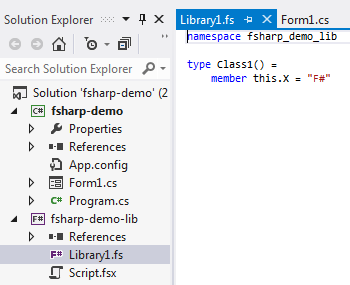

# 第四章命令式和功能性互动

本节将讨论如何在一个应用程序中一起使用 C#和 F#代码。我们将创建一个简单的应用程序，它的前端用户界面用 C#实现，后端数据管理用 F#实现。无论是创建 Windows 窗体还是与 ASP.NET 一起创建 web 应用程序，混合命令式和函数式编程风格可能是最有效的方法——当然，用于设计窗体或网页的工具，XAML 或 HTML，都对生成 C#或 VB 代码有更多的支持。此外，因为用户界面一直在管理状态，应用程序中本质上可变的部分最好用支持可变的语言来实现。相反，处理数据持久化和转换的应用程序后端通常非常适合 F#，因为不变性对于处理异步流程至关重要。

## 创建多语言项目

第一步很简单:在 Visual Studio 2012 中创建新的 Windows 窗体应用程序项目。我已经调用了我的 **fsharp-demo** :


图 1:新的 Windows 窗体项目

接下来，右键单击解决方案并选择**添加** > **新项目**。在左侧树中，点击**其他语言**展开选择列表:


图 2:可用的编程语言

点击**可视化 F#** 并选择 **F#库**。输入名称，例如 **fsharp-demo-lib** 。请注意 Visual Studio 如何创建存根**。带有默认类的文件:**



图 3:新的 F#库

## 从 C#调用 F#

不幸的是，这个例子中生成的代码并不是我们真正想要的——Visual Studio 在 F#中为我们创建了一个命令式的类模板，而我们想要的是一个函数式编程模板。因此，首先用模块名替换生成的代码。我们这样做是因为`let`语句是静态的，需要一个由编译器作为静态类实现的模块。相反，我们可以写，例如:

```fs
    module FSharpLib

    let Add x y = x + y

```

我们也去掉了存根类，创建了一个可以从 C#调用的简单函数。如果省略模块名，模块名将默认为文件名，在我们的例子中是 **Library1** 。

如果需要使用命名空间来避免命名冲突，可以这样做:

```fs
    namespace fsharp_demo_lib
    module FSharpLib =

        let Add x y = x + y

```

请注意，现在明确需要`=`运算符。这是因为当与命名空间结合时，模块现在在该命名空间内是本地的，而不是顶层的。[<sup>【61】</sup>](IFP_0010.htm#_ftn61)在 C#代码中，我们必须在解析函数调用时添加`using` `fsharp_demo_lib;`语句或者显式引用命名空间，例如`fsharp_demo_lib.FSharpLib.Add(1, 2);`。在本节的剩余部分，我不会在 F#中使用名称空间。

接下来，您将希望在 C#项目中向 F#项目添加一个引用:


图 4:引用 C#项目

现在你会注意到一些有趣的事情——如果你转到 **Form1.cs** 并输入以下内容:

```fs
    public Form1()
    {
           int result = FSharpLib.Add(1, 2);    // <<== start typing this
           InitializeComponent();
    }

```

您会注意到，集成开发环境将此标记为未知类，智能感知不起作用。*在 F#代码中进行更改时，您总是需要构建解决方案，然后这些更改才会被 C#端的 IDE 发现。*

在构造函数中完成测试用例:

```fs
    public Form1()
    {
           int result = FSharpLib.Add(1, 2);
           MessageBox.Show("1 + 2 = " + result);
           InitializeComponent();
    }

```

当我们运行应用程序时，首先会出现一个带有结果的消息框。恭喜，我们已经成功地从 C#调用了 F#。

## 从 F#调用 C#

我们可能还想走另一个方向，从我们的 F#代码中调用 C#。我们已经看到了许多这样的例子，但是假设您想在自己的应用程序中调用一些 C#代码。与任何多项目解决方案一样，我们不能有循环引用，所以这意味着您必须了解解决方案的*结构*，这样 C#和 F#项目之间共享的公共代码必须进入自己的项目。

下一个问题是您是想要在静态还是实例上下文中调用 C#代码。静态上下文类似于调用 F#代码。首先，简单地创建一个静态类和一些静态成员:

```fs
    namespace csharp_demo_lib
    {
           public static class StaticClass
           {
                  public static void Print(int x, int y)
                  {
                         MessageBox.Show("Static call, x = " + x + " y = " + y);
                  }
           }
    }

```

在 F#代码中，我们添加了对 C#库的引用，并使用`open`关键字(相当于 C#中的`using`关键字)引用命名空间:

```fs
    module FSharpLib
    open csharp_demo_lib

    let Add x y =
        StaticClass.Print(x, y)
        x + y

```

相反，我们可以实例化一个 C#类，并在可变的上下文中操作它的成员，以及调用方法。例如:

```fs
    namespace csharp_demo_lib
    {
        public class InstanceClass
        {
                  public void Print()
                  {
                         MessageBox.Show("Instance Call");
                  }
        }
    }

```

在 F#中:

```fs
    module FSharpLib
    open csharp_demo_lib

    let Add x y =
        let inst = new InstanceClass()
        inst.Print()
        StaticClass.Print(x, y)
        x + y

```

## 数据库浏览器——一个简单的项目

现在我们已经了解了 C#和 F#交互的基础，让我们创建一个简单的“数据库浏览器”应用程序。这个应用程序将使用 Syncfusion 的 Essential Studio 作为 C#的前端，而 F#作为所有数据库连接和查询的后端。该用户界面将包括:

*   用户可以从中选择表格的列表控件。
*   将显示选定表格内容的网格控件。

在 F#中，后端将:

*   查询数据库模式以获取表列表。
*   在数据库中查询选定的表数据。

我们将连接到 AdventureWorks2008 数据库。

源代码可以在[https://github.com/cliftonm/DatabaseExplorer](https://github.com/cliftonm/DatabaseExplorer)从 GitHub 查看和克隆。

### 后端

让我们从编写 F#后端开始，并结合一些简单的单元测试[<sup>【62】</sup>](IFP_0010.htm#_ftn62)(用 F#编写！)在测试驱动开发[<sup>【64】</sup>](IFP_0010.htm#_ftn64)过程中使用 xuit[<sup>【63】</sup>](IFP_0010.htm#_ftn63)，因为这也说明了如何为 F#编写单元测试。我们使用 xUnit 而不是 nUnit，因为在撰写本文时，nUnit 不支持。NET 4.5 组件，而**xunit.gui.clr4.exe**测试运行程序则有。

#### 建立连接

我们将从一个单元测试开始，该测试验证与我们的数据库建立了连接，如果我们给它一个错误的连接字符串，我们会得到一个`SqlException`:

```fs
    module UnitTests

    open System.Data
    open System.Data.SqlClient
    open Xunit
    open BackEnd

    type BackEndUnitTests() =
        [<Fact>]
        member s.CreateConnection() =
            let conn = openConnection "data source=localhost;initial catalog=AdventureWorks2008;integrated security=SSPI"
            Assert.NotNull(conn);
           conn.Close

        [<Fact>]
        member s.BadConnection() =
            Assert.Throws<SqlException>(fun () ->
                BackEnd.openConnection("data source=localhost;initial catalog=NoDatabase;integrated security=SSPI") |> ignore)

```

请注意，我们必须显式地处理返回“忽略”内容的函数的结果

支持的 F#代码:

```fs
    module BackEnd

    open System.Data
    open System.Data.SqlClient

    // Opens a SqlConnection instance given the full connection string.
    let openConnection connectionString =
        let connection = new SqlConnection()
        connection.ConnectionString <- connectionString
        connection.Open()
        connection

```

#### 正在加载数据库模式

接下来，我们将加载数据库模式。当接口 C#和 F#代码时，最好尽可能地留在 F#命名空间和构造中，编写单独的函数来从 F#构造转换成 C#通常使用的命令(可变)结构。首先，让我们编写一个简单的单元测试，确保我们得到一些结果:

```fs
    [<Fact>]
    member s.ReadSchema() =
        use conn = s.CreateConnection()
        let tables = BackEnd.getTables conn
        Assert.True(tables.Length > 0)
        // Verify that some known table exists in the list.
        Assert.True(List.exists(fun (t) -> (t.tableName = "Person.Person")) tables)

```

注意`use`关键字，[<sup>【65】</sup>](IFP_0010.htm#_ftn65)，当变量超出范围时会自动调用`Dispose`。

支持的 F#代码如下。请注意，编写 F#代码的最佳实践之一是将函数写得尽可能小，并将行为提取到单独的函数中:

```fs
    // A simple record for holding table names.
    type TableName = {tableName : string}

    // A discriminated union for the types of queries we're going to use.
    type Queries =
        | LoadUserTables

    // Returns a SQL statement for the desired query.
    let getSqlQuery query =
        match query with
        | LoadUserTables -> "select s.name + '.' + o.name as table_name from sys.objects o left join sys.schemas s on s.schema_id = o.schema_id where type_desc = 'USER_TABLE'"

    // Returns a SqlCommand instance.
    let getCommand (conn : SqlConnection) query =
        let cmd = conn.CreateCommand()
        cmd.CommandText <- getSqlQuery query
        cmd

    // Reads all records.
    let readTableNames (cmd : SqlCommand) =
        let rec read (reader : SqlDataReader) list =
            match reader.Read() with
            | true -> read reader ({tableName = (reader.[0]).ToString()} :: list)
            | false -> list
        use reader = cmd.ExecuteReader()
        read reader []

    // Returns the list of tables in the database specified by the connection.
    let getTables (conn : SqlConnection) =
        getCommand conn LoadUserTables |> readTableNames |> List.rev

```

在前面的代码中，我们创建了:

*   一个有区别的联合，这样我们就可以为我们的 SQL 语句建立一个查找表。
*   给定所需类型，返回所需 SQL 语句的函数。这可以很容易地用例如从 XML 文件中查找来代替。
*   给定连接和查询名称，返回 SqlCommand 实例的函数。
*   实现递归读取器的函数。
*   `getTables`函数，返回表名列表。

在我们以读取数据库的用户表结束之前，让我们编写一个函数，将 F#列表映射到一个`System.Collections.Generic.List<string>`，适合 C#使用。同样，通过包含`FSharp.Core`程序集，我们可以在 C#中直接使用 F#类型。这种转换只是为了方便起见。这里有一个简单的单元测试:

```fs
    [<Fact>]
    member s.toGenericList() =
        use conn = s.CreateConnection()
        let tables = BackEnd.getTables conn
        let genericList = BackEnd.tableListToGenericList tables
        Assert.Equal(genericList.Count, tables.Length)
        Assert.True(genericList.[0] = tables.[0].tableName)

```

下面是实现:

```fs
    // Convert a TableName : list to a System.Collection.Generic.List.
    let tableListToGenericList list =
        let genericList = new System.Collections.Generic.List<string>()
        List.iter(fun (e) -> genericList.Add(e.tableName)) list
        genericList

```

#### 读取表的数据

接下来，我们希望能够读取任何表的数据，将数据本身的元组作为通用记录列表和列名列表返回。下面的例子是我们的单元测试:

```fs
    [<Fact>]
    member s.LoadTable() =
        use conn = s.CreateConnection()
        let data = BackEnd.loadData conn "Person.Person"
        Assert.True((fst data).Length > 0)
        // Assert something we know about the schema.
        Assert.True(List.exists(fun (t) -> (t.columnName = "FirstName")) (snd data))
        // Verify the correct order of the schema.
        Assert.True((snd data).[0].columnName = "BusinessEntityID");

```

为了实现这一点，我们现在需要扩展我们的 SQL 查询查找:

```fs
    type Queries =
        | LoadUserTables
        | LoadTableData
        | LoadTableSchema

```

此外，返回查询的函数需要更聪明，根据可选的表名参数用表名代替某些查询:

```fs
    let getSqlQuery query (tableName : string option) =
        match query with
        | LoadUserTables -> "select s.name + '.' + o.name as table_name from sys.objects o left join sys.schemas s on s.schema_id = o.schema_id where type_desc = 'USER_TABLE'"
        | LoadTableData ->
            match tableName with
            | Some name -> "select * from " + name
            | None -> failwith "table name is required."
        | LoadTableSchema ->
            match tableName with
            | Some name ->
                let schemaAndName = name.Split('.')
                "select COLUMN_NAME from information_schema.columns where table_name = '" + schemaAndName.[1] + "' AND table_schema='" + schemaAndName.[0] + "' order by ORDINAL_POSITION"
            | None -> failwith "table name is required."

```

接下来，我们需要能够读取表格数据:

```fs
    // Returns all the fields for a record.
    let getFieldValues (reader : SqlDataReader) =
        let objects = Array.create reader.FieldCount (new Object())
        reader.GetValues(objects) |> ignore
        Array.toList objects

    // Returns a list of rows populated with an array of field values.
    let readTableData (cmd : SqlCommand) =
        let rec read (reader : SqlDataReader) list =
            match reader.Read() with
            | true -> read reader (getFieldValues reader :: list)
            | false -> list
        use reader = cmd.ExecuteReader()
        read reader []

```

我们需要能够读取表的模式(注意需要显式转换为`Object[]`):

```fs
    let readTableSchema (cmd : SqlCommand) =
        let schema = readTableData cmd
        List.map(fun (c) -> {columnName = (c : Object[]).[0].ToString()}) schema |> List.rev

```

最后，我们有一个加载数据的函数，返回一个数据元组及其模式:

```fs
    let loadData (conn : SqlConnection) tableName =
        let data = getCommand conn LoadTableData (Some tableName) |> readTableData
        let schema = (getCommand conn LoadTableSchema (Some tableName) |> readTableSchema)
        (data, schema)

```

现在，如果你注意的话，你会注意到功能`readTableNames`和`readTableData`几乎是一样的。唯一的区别是列表是如何构建的。让我们将它重构为一个单独的读取器，在其中传递解析每一行所需的函数，以创建最终的列表:

```fs
    // Reads all the records and parses them as specified by the rowParser parameter.
    let readData rowParser (cmd : SqlCommand) =
        let rec read (reader : SqlDataReader) list =
            match reader.Read() with
            | true -> read reader (rowParser reader :: list)
            | false -> list
        use reader = cmd.ExecuteReader()
        read reader []

```

我们现在有了一个更通用的函数，它允许我们指定如何解析一行。我们现在创建一个返回`TableName`记录的函数:

```fs
    // Returns a table name from the current reader position.
    let getTableNameRecord (reader : SqlDataReader) =
        {tableName = (reader.[0]).ToString()}

```

这允许我们重构`getTables`:

```fs
    // Returns the list of tables in the database specified by the connection.
    let getTables (conn : SqlConnection) =
        getCommand conn LoadUserTables None |> readData getTableNameRecord

```

我们还重构了读取表模式和表的记录:

```fs
    // Returns a list of ColumnName records representing the field names of a table.
    let readTableSchema (cmd : SqlCommand) =
        let schema = readData getFieldValues cmd
        List.map(fun (c) -> {columnName = (c : List<Object>).[0].ToString()}) schema |> List.rev

    // Returns a tuple of table data and the table schema.
    let loadData (conn : SqlConnection) tableName =
        let data = getCommand conn LoadTableData (Some tableName) |> readData getFieldValues
        let schema = (getCommand conn LoadTableSchema (Some tableName) |> readTableSchema)
        (data, schema)

```

这里我们利用了部分函数应用程序——我们已经很容易地重构了读取器，使其在解析每一行时更加通用。这花了大约五分钟的时间，通过我们现有的单元测试，我们能够验证我们的更改没有破坏任何东西。

#### 将我们的 F#结构转换成数据表

除非你想在你的 C#项目中包含`FSharp.Core`程序集，否则你会想把任何返回到 C#的东西转换成。NET“命令式”类。它只是让事情变得更容易。当然，我们可以通过一个`DataSet`阅读器将记录直接加载到`DataTable`中，但是我们使用的过程更能说明保持 F#(此外，我们通常不会加载整个表，而是实现某种分页方案。)

因此，最后一步是用我们的 F#行和表模式信息填充`DataTable`，我们将在 F#中完成。首先，我们应该创建一个单元测试来确保我们的`DataTable`的某些东西:

```fs
    [<Fact>]
    member s.ToDataTable() =
        use conn = s.CreateConnection()
        let data = BackEnd.loadData conn "Person.Person"
        let dataTable = BackEnd.toDataTable data
        Assert.IsType<DataTable>(dataTable) |> ignore
        Assert.Equal(dataTable.Columns.Count, (snd data).Length)
        Assert.True(dataTable.Columns.[0].ColumnName = "BusinessEntityID")
        Assert.Equal(dataTable.Rows.Count, (fst data).Length)

```

F#中的实现包括三个函数:设置列、填充行，以及调用这两个步骤并返回`DataTable`实例的函数:

```fs
    // Populates a DataTable given a ColumnName List, returning
    // the DataTable instance.
    let setupColumns (dataTable : DataTable) schema =
        let rec addColumn colList =
            match colList with
            | hd::tl ->
                let newColumn = new DataColumn()
                newColumn.ColumnName <- hd.columnName
                dataTable.Columns.Add(newColumn)
                addColumn tl
            | [] -> dataTable
        addColumn schema

    // Populates the rows of a DataTable from a data list.
    let setupRows data (dataTable : DataTable) =
       // Rows:
        let rec addRow dataList =
            match dataList with
            | hd::tl ->
                let dataRow = dataTable.NewRow()
                // Columns:
                let rec addFieldValue (index : int) fieldList =
                    match fieldList with
                    | fhd::ftl ->
                        dataRow.[index] <- fhd
                        addFieldValue (index + 1) ftl
                    | [] -> ()
                addFieldValue 0 hd
                dataTable.Rows.InsertAt(dataRow, 0)
                addRow tl
            | [] -> dataTable
        addRow data

    // Return a DataTable populated from our (data, schema) tuple.
    let toDataTable (data, schema) =
        let dataTable = new DataTable()
        setupColumns dataTable schema |> setupRows data

```

我们所有的单元测试都通过了！


图 5:成功的单元测试

### 前端

现在我们准备写前端了。我们将创建两个`GridListControl`控件的简单布局:


图 6:两个网格列表控件

代码隐藏包括加载表列表，调用我们的 F#代码来获取表列表:

```fs
    protected void InitializeTableList()
    {
           List<string> tableList;

           using (var conn = BackEnd.openConnection(connectionString))
           {
                  tableList = BackEnd.getTablesAsGenericList(conn);
           }

           var tableNameList = new List<TableName>();
           tableList.ForEach(t => tableNameList.Add(new TableName() { Name = t }));
           gridTableList.DisplayMember = "Name";
           gridTableList.ValueMember = "Name";
           gridTableList.DataSource = tableNameList;
    }

```

当选择一个表时，我们从 F#代码中获取`DataTable`并设置网格的`DataSource`属性。

```fs
    private void gridTableList_SelectedValueChanged(object sender, EventArgs e)
    {
           if (gridTableList.SelectedValue != null)
           {
                  string tableName = gridTableList.SelectedValue.ToString();
                  DataTable dt;

                  using (var conn = BackEnd.openConnection(connectionString))
                  {
                         Cursor = Cursors.WaitCursor;
                         var data = BackEnd.loadData(conn, tableName);
                         dt = BackEnd.toDataTable(data.Item1, data.Item2);
                         Cursor = Cursors.Arrow;
                  }

                  gridTableData.DataSource = dt;
           }
    }

```

这给了我们前端用户界面进程和后端数据库交互之间的良好分离，从而产生了一个简单的数据库导航器。


图 7:完整的数据库导航器