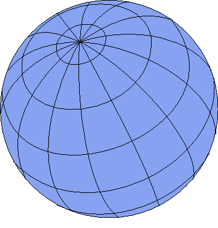

# 一、那么，到底什么是地理信息系统？

对大多数人来说，他们所看到的地理信息系统实际上只是前端输出层，比如谷歌地图中生成的地图，或者汤姆汤姆导航设备上的屏幕。这一切的现实远不止于此；输出层通常是许多互连程序和大量数据的最终结果。

典型的地理信息系统将包括用于可视化、编辑和管理数据的桌面应用、存储数据的几种不同类型的后端数据库，以及在许多情况下大量定制的软件工具。事实上，地理信息系统是顶尖的行业之一，程序员可以编写大量其他公司没有的定制工具。

我们将很快详细探讨一些应用，但现在我们将继续 100 英尺的视图。典型的地理信息系统处理设置如下所示:

图 1:典型的地理信息系统处理设置

正如您在图表中看到的，中心部分通常是数据库本身，其中包含大量的输入和处理步骤。最后，输出图层(以红色显示)是人们通常与地理信息系统相关联的内容。

基于此，我们可以看到，数据库是涉及到 GIS 时的宇宙中心。

## 部件的分解

查看图 1 中的图表，我们可以看到有许多部分具有特定的含义。我们有输入(蓝色)、输出(红色)、就地处理(绿色)和结束处理(紫色)。此时，您可能会问自己，“这与我处理的任何其他以数据为中心的系统有何不同？”你这么做是对的。这里的主要区别是，在典型的地理信息系统中，您必须从一开始就设计每个组件中的所有内容。对于常规的以数据为中心的系统，许多组件通常是可选的，或者被组合成多功能组件。

对于一个典型的地理信息系统，除了可能的输入之外，您在图 1 中看到的都不是可选的。即便如此，您最有可能看到的省略组件仍是手动和历史数据。

那么，这些独立的实体意味着什么，为什么它们通常不是可选的呢？

### 外部数据收集

顾名思义，这是收集特定于所设计系统的外部数据的过程。通常，这将来自运行定制软件(通常是嵌入式或小规模)的定制设备，该软件旨在为正在使用的系统以非常特定的形式创建输入数据。缺少任何就地处理通常意味着所产生的数据的格式在设置中已经是可接受的。

该组件通常由许多不同的技术来满足，并且在大多数情况下需要一些培训来正确使用。你会经常看到数字测量设备或安装在车辆上的专用全球定位系统设备，在许多情况下，这些设备通常会使用某种无线电连接实时反馈数据。

### 静态数据生产

像外部数据一样，这个过程通常会为正在使用的系统收集特定格式的数据。然而，与外部数据不同，您通常会发现静态数据是通过扫描现有纸质地图或数字化现有建筑平面图中的要素而在内部生成的。

像外部输入一样，静态数据通常是使用特定于业务的定制软件和流程生成的。

### 历史数据

由于在典型的地理信息系统设置中产生的数据的大小和数量，通常需要将数据备份到单独的归档系统中，同时在需要时仍然保持使用它的能力。通常，这种性质的数据是由规划部门创建的，显示土地使用情况或记录特定的兴趣点。这被视为单独的输入，因为数据通常是只读的，类似于外部静态数据，曾经专门为系统生成。

### 手动数据加载

虽然这种类型输入的名称可能与外部数据相同，但在此步骤中获得的实际数据通常非常不同。通过这种输入进入系统的数据通常是地理信息系统数据提供者预先提供的数据。在联合王国，这通常意味着像军械测量这样的公司提供的数据。在美国，这可能意味着美国地质调查局等机构提供的数据或美国人口普查局的 TIGER 数据。

在这一步，无论从哪里获得数据，几乎可以肯定的是，它需要被转换成一种格式，这种格式可以在它预定的地理信息系统中使用。通常情况下，它需要经过某种就地处理，然后才能以任何方式使用。

### 常规的 SQL 查询

由于大多数地理信息系统的中心都有一个大型数据库，所以 SQL 仍然扮演着重要的角色，而且可能永远都是。然而，从地理信息系统的角度来看，这些查询不仅涉及到您在数据库管理系统中习惯看到的普通 SQL，还涉及到地理空间 SQL。稍后我们将讨论特定于地理信息系统的 SQL 目前，这里的输入通常是从类似搜索查询的东西中生成的。

例如，当您在谷歌、必应或雅虎地图中键入地名或邮政编码时，您正在查看的网络应用很可能会将您的搜索转化为使用地理空间 SQL 来检查核心数据库中数据的查询。反过来，这将与其他过程结合产生一个输出，在这种情况下，它通常是一个显示您搜索的位置的地图。另一个例子可能是紧急服务控制室中的操作员进入事故地点，并将其与附近紧急车辆的已知地点相结合，以帮助决定将哪辆车辆送往事故地点。

### 位置感知输入

最后一种输入类型可能是大多数人都熟悉的。位置感知数据通常来自移动电话或其他支持全球定位系统的设备上的全球定位系统输入。一般是常见的经纬度信息。在讨论 NMEA 数据时，我们将对此进行更多讨论。

### 图形输出

现在我们进入输出层，第一层是图形层，也是大多数人熟悉的层。这里的输出数据通常是基于栅格的地图，所有操作都以标准位图(如. jpeg)的形式生成一个输出图块。然而，远不止简单的地图切片。图形输出可以并且经常以各种矢量格式产生，或者像 AutoCAD 图形那样加载到 CAD 或建模包中。事实上，即使在人们习惯于看到位图切片的网络环境中，图形输出通常采用与自定义谷歌地图对象相结合的 SVG 或 KML 数据的形式。栅格切片只是冰山一角。

### 统计输出

该组中的输出与图形输出完全相反。数据通常是基于输入数据和系统内正在进行的过程的几个地理信息系统 SQL 操作的副产品。就像一般的数据库数据一样，从这个输出中，您将获得事实和数据，这些数据可以用来向管理或营销团队报告统计数据。然而，我们分开处理这个问题的原因是因为信息的性质。

虽然您可能会忍不住说“这只是数字”，但在某些情况下，除非涉及到一些地理信息系统输入，否则数字没有任何意义。举个例子，假设我们有许多代表地块的地理区域，每个区域都有该地块的货币价值。

我们可以很容易地说，“按降序给我每块地的价值”，让你看到哪块地整体上最贵。然而，这就是差别停止的地方。假设我们现在知道，一个地区的所有土地，每消耗一平方米土地，就要缴纳 1%的税。通过查看地图的图形输出，我们知道视觉上更大的区域将会更贵，但是你不能把它传达给计算机。

但是，您可以使用地理信息系统 SQL 进行统计分析，该分析基于土地地块价值的百分比乘以定义区域边界内的平方米数。

### 手动处理软件

系统中任何需要操作员和一些软件进行更改的东西都属于手动处理软件的范畴。通常，这既是输入也是输出，因为在大多数情况下，这涉及到手动对基础数据进行更改。

这通常是您可以看到大型地理信息系统包的区域，例如 ESRI、数字地球和使用的地图信息。稍后我们将介绍其中的一些。在这个阶段可以执行的一个例子是边界编辑。假设几年前您添加了一些城镇边界作为区域定义，并且自从它们第一次被添加以来，城镇的规模已经增加了。然后你会找到一个地理信息系统专家，他或她选择的软件和一些卫星图像，将编辑您的边界数据，使其定义更好地符合新扩展的图像。

### 自动处理软件

在此阶段运行的操作通常与手动运行的操作没有太大区别。我们之所以看到清晰的分离，是因为有些流程根本无法自动化，需要人眼来识别细节。回到我们前面的城镇边界的例子，可以定义一个过程来分析航空图像并确定是否需要移除边界，这并不是超出想象的。

然而，最常见的是，自动编辑用于执行诸如漂移校正或由于地球运动引起的高度和轮廓变化等任务。

### 转换任务

正如人工数据输入的讨论中所提到的，在获取数据以纳入地理信息系统时，数据的格式很少适合纳入系统。

使数据可用可能涉及像坐标变换这样简单的事情，或者像基于公共属性组合多个数据集这样复杂的事情，等等。转换过程可能并且经常会严重影响整体数据质量，许多系统在转换数据时会因错误而导致许多根深蒂固的问题。

在英国，当使用纬度和经度坐标时，几乎总能看到这些过程，因为英国当局提供的几乎所有数据都以米为单位，而不是以中心周围的度数为单位。

### 组合处理

组合处理通常是各种输入操作的就地处理。这与在常规数据库操作中使用联接没有太大区别。结果是过程和输入数据步骤的组合，最终实时工作以产生定义的输入数据集。

### 预输出

最后但同样重要的是预输出步骤。顾名思义，这是输出可用之前所需的最后处理。预输出过程可以包括将内部坐标系转换成更全局的坐标系；例如，英国的米回到全球范围，或将一批统计数据转换为不同的值范围。位置感知输入通常包含在该步骤中，通常在导航系统中。例如，位置的图形表示可以与当前映射相结合，以产生跟踪地图的视觉输出。

## 数据库

那么，到底是什么让地理信息系统数据库与普通数据库如此不同呢？老实说，不多。地理信息系统数据库只是专门用于特定的任务。

说明地理信息系统数据库独特之处的更好方法是观察不断增长的大数据世界。如今，很难不注意到 NoSQL 和以文档为中心的数据库提供商制造了多少噪音。这些新型数据库从根本上做了与普通数据库相同的事情，但是使用专门的过程，以更好、更有效的方式执行特定的操作。

从非地理信息系统连接的角度来看地理信息系统数据库，几何数据只不过是一个定制的二进制字段或 blob，与系统一起工作的软件和进程知道如何解释。事实上，可以使用一个普通的数据库引擎，在数据库或外部代码中编写自己的例程，来执行除了地理信息系统数据之外的所有常规操作。

一般来说，当一个数据库在空间上启用时，它将不仅仅具有理解添加到其中的二进制数据的能力。将扩展 SQL 语言来执行专门的地理信息系统数据操作，新类型的索引来帮助加速查找，以及各种新的表来管理与您可能需要存储的各种类型的地理信息系统数据相关的元数据。

我不打算在这本书里列出每一个可用的操作，只列出你需要知道的最重要的事情来开始。然而，根据最近的统计，在最近公布的 OGC 标准中有 300 多种不同的功能。

### OGC 什么？

OGC 标准是由开放地理空间联盟制定的建议。它们定义了一个通用的应用编程接口、一组最少的地理信息系统 SQL 扩展和其他相关对象，任何支持地理信息系统的数据库都必须实现这些对象才能被归类为符合 OGC 标准。由于地理信息系统及其数据的多样性，这些标准得到了严格执行。这使得地球上几乎每一个支持地理信息系统的软件都可以使用通用语言与任何支持地理信息系统的数据库进行交互。

请注意，在选择要使用的数据库时，有许多声称具有空间感知能力但不符合 OGC 标准的数据库。最好的例子是微软的 SQL 和 MySQL。

总的来说，微软 SQL 具有 OGC 认可的最小地理信息系统-SQL 和功能实现，但是它的调用模式与大多数地理信息系统软件有很大不同。微软 SQL 还对一些元数据表中的列名进行了更改，这意味着大多数标准地理信息系统软件无法与微软 SQL 服务器进行通信。还要注意的是，MS SQL 直到 2008 年才添加任何种类的 GIS 可扩展性，即使在更新的 2008 年 r 2 和 2012 年版本中，事物的 GIS 方面仍然不完全符合 OGC 标准。

MySQL 也有类似的限制，但对许多核心数据类型的处理方式也非常不同，在执行坐标转换时经常会导致舍入误差和其他异常。你可以在 OCG 网站[http://www.opengeospatial.org/standards/is](http://www.opengeospatial.org/standards/is)找到 OGC 标准文件的完整列表。

在 http://www.bostongis.com/?的波士顿信息系统网站上可以找到比较各种数据库的信息 content _ name = SQL server 2008 R2 _ Oracle 11 gr 2 _ postgis 15 _ compare # 221。

网站上还有很多其他不错的入门文章。缺点是网站混乱，有时很难阅读。

### 元数据表

所有符合 OGC 标准的地理信息系统数据库必须支持两个核心元数据表，称为**几何 _ 列**和**空间 _ 参考 _ 系统**。大多数支持地理信息系统的软件将使用这些表的存在来确定它是否正在与真正的地理信息系统数据库系统对话。如果这些表不存在，软件通常会退出。

这方面的一个很好的例子是早期版本的 MySQL，其中表名由数据库引擎保留，但实际上并不作为表存在。这将导致 MapInfo 应用尝试创建缺失的表，但在尝试这样做时会收到一个错误，从而阻止软件正确使用数据库。

**geometry_columns** 表用于记录数据库中哪些表列包含地理空间数据以及它们的数据类型、坐标系、尺寸和一些其他相关信息。

**space _ ref _ sys**表包含一个已知空间参考系统的列表，或者更广为人知的坐标系。这些坐标系定义了任何地理信息系统数据库中的地理位置；它们是粘合剂，允许所有功能完美地协同工作，即使数据可能来自不同的来源或使用不同的地理坐标系记录。

**空间参考系统**表中的条目由一个称为 EPSG 标识的数字索引。EPSG 或欧洲石油调查小组是一个由石油和天然气行业的能源供应商组成的工作组，他们面临着一个在调查世界海洋石油储量时出现的共同问题:全球范围内的定位。一些公司使用一种规模，其他公司使用不同的规模；一些使用全局坐标系，而另一些使用局部坐标系。

该小组的解决方案是记录每种标度之间的差异以及从一种标度可靠地转换到另一种标度所需的信息，而不损失任何精度。

如今，每个声称符合 OGC 标准的地理信息系统数据库都包含一份该表的副本，以确保从一个系统到另一个系统的数据转换尽可能准确。

我们将在本书稍后介绍实际的坐标系。目前，您真正需要注意的是，如果 **spatial_ref_sys** 表不存在或其中没有数据，您将无法准确映射或对您拥有的任何数据进行真实世界的翻译。

还要注意，从该表中删除不必要的条目可以节省空间。如果您的数据只使用了两个或三个不同的坐标系，那么删除其余条目以减小表格的大小是完全可以接受的。这在使用移动设备时特别有用。

如果您只处理您自己的值范围内的数据，可以说**space _ ref _ sys**表中根本没有数据。然而，我提醒你不要把桌子完全搬走。如前所述，大多数地理信息系统软件会寻找这个表和**几何列**表的存在，以表示支持地理信息系统的数据库的存在。

### 元数据表中实际有什么？

**几何列**表保存与您的数据相关的数据，并具有以下字段:

| f _ 表 _ 目录 | 定义表的数据库名称。 |
| f _ 表 _ 架构 | 定义表的架构空间。 |
| f _ 表名 | 保存数据的表的名称。 |
| f _ 几何 _ 列 | 保存实际数据的列的名称。 |
| coord _ dimension-座标系统 | 坐标维度。 |
| srid(消歧义) | 正在使用的坐标系的空间参考标识。 |
| 类型 | 存储在该表中的几何数据的类型。 |

不同的数据库以不同的方式使用**目录**、**模式**和**名称**字段。例如，Oracle Spatial 有一个单独的 **geometry_columns** 表用于整个服务器，因此**目录**字段用于命名实际的数据库。然而，Postgres 为每个数据库存储一个 **geometry_columns** 表，因此**目录**字段通常为空。另一方面，**模式**字段在 Postgres 和 MS SQL 中都有使用。在 Postgres 中，该字段通常设置为**公共**，而在 MS SQL 中，对于公共可访问的表集，该字段通常设置为 **dbo** 。

表名和列名非常容易理解。大多数情况下坐标尺寸为 **2** ，意味着坐标系只有 x 坐标和 y 坐标。Postgres 和 Oracle Spatial 确实有三维功能，但我还没有看到它们在非常特殊的环境之外被大量使用，我也从未见过一个 **coord_dimension** 字段被设置为除了 **2** 之外的任何东西。

我们将马上覆盖 **srid** 字段。然而**型**需要进一步解释。

### 数据库几何类型

任何符合 OGC 标准的数据库都必须能够存储三种不同类型的原语。它们是:

*   要点
*   线条
*   多边形

这些名字本身很容易解释。一个点是单个 *x* ， *y* 位置。一条线是由两个 *x* 、 *y* 端点连接的单个线段。多边形是一个封闭的区域，其中多个 *x* 、 *y* 点形成一个封闭的周界。

然而，这三种基本类型并不是您将使用的唯一几何类型。有多种变化，例如:

*   线串
*   多重链接
*   多极的

再加上其他一些很少用到的。

线串可以被认为是线对象的集合，其中除了起点和终点之外，每个点都与相邻线的起点或终点相同。例如:

1,2 2,3 3,4

是一个线串，从 1，2 开始，经过两段，在 3，4 结束。

多重链接可以被认为是线串的集合。例如:

(1,2 2,3 3,4) (6,7 7,8 8,9)

将是从 1，2 到 3，4 和从 6，7 到 8，9 的两个线串，每个线串由两段组成。两条线之间会有一个间隙。

顾名思义，多多边形是多边形的集合，但有一个扭曲。如果多边形定义位于同一图形对象中，则它们不能重叠。这如图 3 和图 4 所示。

|  |  |
| 图 2:有效的多多边形 | 图 3:无效的多多边形 |

多多边形必须包含至少一个包围集合中所有其他多边形的多边形。这就是所谓的**外环**。在这个边界内，其他多边形通常在外环上形成孔。这用于带有庭院的建筑平面图，带有环形路的道路布局，任何需要从定义形状的内部区域移除封闭部分的地方。

然而，许多空间数据库甚至将单个多边形定义为多多边形。这样做是为了方便以后需要时插入切口。

### 我的数据应该使用什么类型？

您使用的数据类型取决于您的数据所代表的内容。如果你有一系列代表商店的位置，你很可能只想把它们定义为点。另一方面，如果您的数据代表这些点之间的道路，那么多线可能是更好的选择。如果你想标记每个商店的建筑轮廓，你可以根据结构的复杂程度使用多边形或多多边形。

数据类型没有硬性规定。您只需记住，如果您没有使用适合您期望执行的操作的数据类型，那么几乎可以肯定，您所做的任何计算都会出现错误。

回想一下我们的商店。如果你在搜索最大的一个，你需要测试面积，你不能用一个点来测试面积。另一方面，如果您想做的只是为客户提供一个可搜索的地图来找到他或她最近的商店，您不需要存储比您需要的更多的数据，所以一个简单的点就可以了。

数据布局到此为止。我们一会儿再谈。让我们继续使用元数据表。

### 元数据表，第 2 部分

如前所述， **spatial_ref_sys** 元数据表保存转换数据，以允许从一个坐标系转换到另一个坐标系。

该表中的每个条目都包含特定信息，例如测量单位、原点位置，甚至测量的起始偏移量。

我们大多数人都熟悉这样的坐标对:

54.852726, -1.832299

如果你的手机内置了全球定位系统，启动它并观看显示屏。你会看到类似于这个坐标对的东西。请注意，在某些设备和应用上，坐标可能会互换。

这个坐标对被称为纬度和经度。第一个数字，纬度，是从赤道向北或向南的度数，北为正，南为负。第二个数字，经度，是本初子午线以东或以西的度数，西为负，东为正。该坐标系的正确地理空间名称为 **WGS84** 。在**空间参考系统**表中，其 SRID 号为 **4326** 。

我们稍后将回到不同的坐标系，以及它们存在的原因。现在，让我们继续描述空间参考表。**空间 _ 参考 _ 系统**表有以下字段:

| srid(消歧义) | 由 OGC 标准定义的空间参考号。 |
| 身份验证名称 | 这个 SRID 的认证机构，通常是 EPSG。 |
| auth_srid | 认证机构定义的 SRID，通常与 OGC 标准定义的 SRID 相同。 |
| 街道 | 用于以投影格式映射空间差异的定义文本。 |
| 专案 4 文字 | 用于以项目 4 格式映射空间差异的定义文本。 |

空间参考表中的所有内容都是整数和字符串的简单类型。 **srtext** 和 **proj4text** 根据正在读取它们的软件有不同的含义。

**srtext** 字段保存投影、椭球体、椭球体和其他基本信息，允许任何软件从一个坐标集转换到另一个坐标集。稍后我们将对此进行更多的介绍，但是对这一领域的所有内容的完整描述远远超出了这本小书的范围。事实上，我看过的描述基础知识的最小的一本书超过了 500 页！

**proj4text** 字段有类似的用途，但被使用开源 Proj.4 库的应用使用。

Proj.4 和 Geos 是第一批由许多不同的空间数据库和地理信息系统应用使用的两个开源库。这两个库现在几乎 100%用于所有商业和开源软件，用于任何类型的空间或地理信息系统工作。这两个库仍在积极维护中，可用于您期望使用的每个平台。稍后，当我们简单了解一下可用于的一些地理信息系统软件时，我们将再次与他们见面。NET 开发人员。

目前，您需要注意的是，为了支持不同的空间坐标系，您必须在 **spatial_ref_sys** 表中有条目。

如前所述，您不需要表中的每个条目；您可以只使用几何图形、数据库和软件使用的 SRIDs。由于我住在英国，我通常使用:

OSGB36，SRID:27700-军械测量，在原点有虚假偏移的米。

和

SRID WGS84:4326-全球纬度/经度，带分钟/小时/秒偏移的度数，原点在纬度 0 度(赤道)和经度 0 度(本初子午线)。

对于其他地区，您可以导入整个表并查看哪一个最有效，或者您可以在 EPSG 网站的[http://www.epsg-registry.org/](http://www.epsg-registry.org/)上查找您的地区并只获取您需要的定义。如果您使用 Postgres 或 PostGIS 作为您的空间数据库， **spatial_ref_sys** 表将填充到一个数据库模板中，其中包含您安装数据库时可用的所有已知 SRIDs。创建自己的数据库只需从一开始就使用这个模板来拥有一个完全填充的表。

在我们继续之前需要注意的一点是:有些数据库虽然支持 **geometry_columns** 和 **spatial_sys_ref** 元数据表，但是默认情况下不要创建它们。MS SQL 2008 以此著称；它使用自己的方法来存储空间元数据。您可能会发现，在某些情况下，您需要手动创建其中一些表，然后才能使用数据库。此外，您可能还会发现一些数据库创建了这些表，但是使用了稍微不同的命名约定，尤其是对于**几何 _ 列**表。因此，最好使用官方的符合 OGC 的空间 SQL 命令集(可以从[http://www.opengeospatial.org/standards/sfs](http://www.opengeospatial.org/standards/sfs)下载)来操作这些表中的数据，而不是试图直接操作条目。

## 坐标和空间定位系统

在我们进入技术乐趣并开始玩之前，我们必须涵盖更多的理论。你必须理解为什么所有这些不同的 SRIDs 和坐标系存在。

我想愉快地送你进入你的第一次地理信息系统冒险，并说这东西真的不重要；然而，事实是我不能，这很重要。事实上，这很重要。

如果你不能正确理解这个坐标，就有可能把一辆汽车的轨迹绘制成位于大西洋中部。虽然这对于您正在处理的应用可能无关紧要，例如，您可能正在查看客户分散的总体概述，但您仍然应该尽量确保您的应用尽可能准确。

所以这个价值百万的问题的答案是，“为什么我们要处理所有这些坐标的东西？”归结为一件事，也只有一件事:

*地球不是平的。*

好了，我说了。所有仍然认为这是必要的反对者都需要为自己打造一个顶级的地理信息系统，并进行检验。

玩笑归玩笑，事实上我们的星球是一个球体，这引起了所有这些坐标系统的麻烦。更糟糕的是，我们简陋的家甚至不是一个完美的圆形球体。它围绕着轴稍微拉长，有点像橄榄球，但不太明显。这导致了进一步的复杂化，因为当我们观察更靠近极点的位置时，我们需要使用的数学方法必须补偿地球曲率的差异。

### 度、分和全球定位系统

好吧，那我们到底怎么处理这个曲率呢？在全球范围内，一定有一个衡量标准是合理的，对吗？如果没有，那么飞机和船只究竟是如何从一个国家航行到另一个国家而不迷路或不得不跟踪所有这些不同的 SRIDs 的呢？

你会很高兴知道有，但这并不像在地球上某个地方绘制一个 *x* 位置和一个 *y* 位置那样简单。

如果你看任何地理教科书或世界地图，你会看到地球被分成长方形。这些矩形是由构成我们星球线框模型的经纬线形成的。它看起来如下所示:

图 4:地球线框模型

根据使用的比例因子，每条水平线和垂直线代表一个或多个整度。然后，分钟用于偏移网格正方形内的位置。

当我们表示北纬 50° 25 ' 32 "时，我们实际上说的是北纬 50 度，再加上进入那个广场向北 25 分 32 秒，简单来说。如果实话实说的话，事情会复杂一点，但除非你在公海航行或驾驶商业客机，否则你可能不需要讲那么多细节。

经度也是如此。一切都表示为正数，所以本初子午线以西以 W 为后缀，以东以 e 为后缀。将这些与南北经度名称相结合，将行星分成四个象限，每个象限 180 度。

#### 这对地理信息系统开发人员有什么关系？

如果你想从任何商业级全球定位系统中检索数据，尤其是那些内置在手机中的数据，你几乎总是会遇到美国国家海洋电子协会及其电子导航设备通信标准，即 NMEA 0183 标准。几乎在任何设备上打开 GPS 端口都会产生一个持续的数据流，看起来非常类似于以下内容:

$GPGGA，092750，000，5321，5802，n，00630，3372，w，1.8，1.03，61.7，m，55.2，m，*76

$GPGSA，A，3，10，07，05，02，29，04，08，13，，，，1.72，1.03，1.38*0A

$GPGSV.3，1，11，10，63，137，17，07，61，098，15，05，59，290，20，08，54，157，30*70

$GPGSV.3，2，11，02，39，223，19，13，28，070，17，26，23，252，，，04，14，186，14*79

该数据流是设备中的全球定位系统电路响应从环绕地球的全球定位系统网络接收到的信息而发出的导航数据。我们将在后面的章节中更详细地讨论这个问题。现在，我想提请大家注意这个数据的第一行，特别是以下条目:

**5321.5802，N****00630.3372，W**

这些是全球定位系统的当前位置，用度数和分钟表示。一旦你习惯了，破译它们并不难，但一开始可能会有点奇怪。

字符串的格式为:纬度(垂直)方向为 **DDMM.mmmm** ，经度(水平)方向为 **DDDMM.mmmm** 。

从字符串中的北(纬度)测量开始，前两位数字是度数，其余数字是分钟。小数点后的数字是一分钟的分数。这给了我们:

**北纬 53 度 21.5802 分**

对于经度测量，前三个*数字是度数，其余数字是分钟。小数点后的所有数字都是一分钟的分数。这给了我们:*

**6 度，向西 30.3372 分钟**

因为这些数据是字符串数据，所以它本质上是在特定点切割字符串以获得所需值的练习。一旦你有了它们，将它们转换成更熟悉的纬度和经度(如果你记得那是 WGS84)格式的数学是非常简单的。

首先，您需要将纬度字符串的前两位数字和经度字符串的前三位数字分开。这给出了以下内容:

北向为**53****21.5802**

**006****30.3372**为西

因为一个学位有 60 分钟，所以我们必须把分钟数字除以 60，找出它们是学位的哪个分数，然后把它们和我们的整个学位结合起来。所以，对于我们的纬度:

**53**T2】+(21.5812/60)会给你 **53.359686** 度。

对于我们的经度:

**6 + (30.3372/60)** 会给你 **6.505620** 度。

你从数字中得到简单的位置。要完成转换，您需要将北和西方向应用为正数或负数。管理哪个方向是正的或负的最简单的方法是将任何向西或向南的测量值改为负的。所以用我们的数字，WGS84 经纬度的最终坐标是:

**53.359686，-6.505620**

WGS84 是一个全球坐标系统标准，虽然它被广泛使用，但将其用于任何事情都会导致一些问题。因为 WGS84 的设计是为了覆盖全球，所以它的设计也是为了非常宽松地适应地球的曲率。回想一下图 4 中的线框球体。请注意靠近地球顶部的矩形形状。

你可以在图中看到矩形变得越来越长越来越窄。这种拉伸也必须在坐标系中考虑。在长距离上，它会导致数据出现舍入和偏差。

如果你处理的区域只有一个定义的操作区域，那么使用更适合该区域的坐标系是首选的工作方式。正如我之前提到的，对于在英国的我来说，在将这些 WGS84 坐标存储到我的数据库之前，将其转换为 OSGB36 通常会更好。正如我们稍后开始查看空间 SQL 时将会看到的那样，如果设置正确，您的地理信息系统数据库可以动态完成这项工作。

作为一名开发人员，这几乎是你需要知道的全部。你可以挖掘更深层次的东西，比如球体和艾里计算、大地测量，以及学校里的很多三角学知识。事实是，您的地理信息系统数据库和您将使用的许多工具实际上将为您完成绝大多数繁重的工作。因此，虽然对系统和项目 4 字符串使用的实际公式有很好的了解可能会很有趣，但我向你保证一件事:它最终会让你头疼。

在下一章中，我们开始进入更有趣的事情，从我们将要使用的软件开始。