# 第 3 章将数据加载到数据库中

在开始探索地理信息系统能做什么之前，我们需要做的第一件事是加载一些数据。

在本章中，我将把三个 ESRI 形状文件加载到 Postgres 中，以便稍后与演示一起使用。前两个文件是基于点的文件，显示英国城镇的位置。第三个文件是多边形文件，显示组成英国的所有郡和自治市的边界轮廓

对于那些不熟悉英国地理的人来说，郡界在逻辑上将国家划分为行政区，类似于美国各州或中国各省。

## 创建空间数据库

在我们开始向系统中添加任何数据之前，我们首先需要创建一个数据库来存储数据。对于本书中的示例，我将创建一个简单的三表数据库，而不是前面描述的整个地理信息系统模型。

如果您正在处理一个大型企业应用程序，我再怎么强调规划和设计在地理信息系统数据库解决方案中的重要性也不为过。在许多方面，这方面的计划比普通数据库中的相同步骤要重要得多。与一般的企业数据解决方案相比，地理信息系统解决方案的故障和变更往往更昂贵、更复杂。

为了创建数据库，我们将使用 Postgres 提供的数据库管理工具 pgAdmin。要启动 pgAdmin，点击桌面上的 **pgAdmin III** 图标。如果看不到图标，请确保在安装服务器时安装了管理工具。

安装应用程序并创建与数据库服务器的初始连接后，您可以开始在该服务器连接中创建数据库，如下图所示。

请注意，出于安全原因，我已经从本书中显示 pgAdmin 的许多图中删除了服务器和表名，只留下了那些您理解所必需的名称。在您使用 pgAdmin 的过程中，当您完成我在这里介绍的步骤时，您会看到更多的信息。

图 10:创建新数据库

右键单击服务器树中的**数据库**项目，并选择**新数据库**。这将启动**新数据库**对话框。

图 11:命名新数据库

很容易看出什么需要去哪里。我们只需要给数据库一个名字和一个所有者。如果您愿意，可以填写**注释**字段；剩下的你通常可以用默认设置离开。填写完字段后，您的对话框应该如下所示:

图 12:完成的新数据库对话框

大多数 Postgres 安装程序在使用此对话框或类似对话框时都会创建一个模板来帮助创建空间数据库表。在点击**确定**之前，我们需要导航到**定义**选项卡，选择要使用的模板，如下图所示:

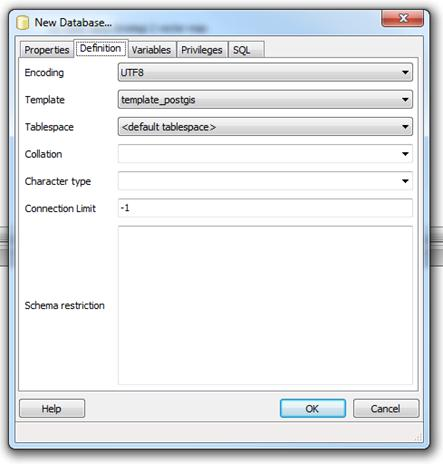

图 13:从定义选项卡中选择模板

该选项卡中的所有其他选项都可以保持原样。单击**确定**后，pgAdmin 将返回主显示屏，您将看到新数据库出现在服务器树中。

图 14:添加到服务器树的新数据库

也可以使用标准的 SQL 命令手工创建数据库，如`Create Database`、`Create Table`；然而，使用这些可能是一个漫长的过程。

Postgres **Contrib** 目录(位于您选择安装 Postgres 的位置)中有脚本，您可以加载并运行这些脚本来创建所需的所有空间函数和元数据表。因为我安装的每一个 Postgres 都包含了 pgAdmin，所以我发现使用图形用户界面更加容易和快捷。还请注意，即使您是在 Ubuntu 等平台上安装数据库，也可以从 Postgres 网站单独下载 pgAdmin 工具，并将其安装在管理服务器的标准 Windows 机器上。

创建数据库后，您可以展开服务器树中的对象，以显示新空间数据库中的不同表和对象。

图 15:探索新数据库

### 关于 Postgres 用户的补充说明

阅读这篇文章的许多人可能已经习惯了在数据任务中使用微软的 SQL Server。Postgres 和 SQL Server 一样，支持多个用户帐户。但是，您需要小心使用根管理员帐户。

在 MS SQL 中，超级用户帐户(通常是 **sa** )对整个数据库拥有最终控制权。在 Postgres 下，等价的超级用户账号叫做 **Postgres** ，但与 MS SQL 不同的是，可以阻止 Postgres 用户与其他表进行交互。

如果您使用 Postgres 帐户创建所有表，您不会有问题，但是如果您创建数据库，然后将这些数据库的所有权分配给您在服务器中创建的其他用户名，您可能会发现 **Postgres** 用户帐户无法使用它们。

在 QGIS 中打开数据库图层时，最有可能出现这个问题。如果使用给定的一组凭据创建数据库连接，并使用 **Postgres** 用户帐户在 pgAdmin 中创建数据库，您会发现空间元数据表将有 **Postgres** 作为其所有者。发生这种情况时，QGIS 将无法打开元数据表，并且不会显示可供您在应用程序中使用的图层。

这个问题的解决方法很简单。使用 pgAdmin，右键单击其中一个元数据表，选择**属性**选项，如下图所示:

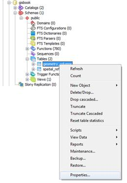

图 16:编辑元数据表属性

表格的**属性**对话框将出现。

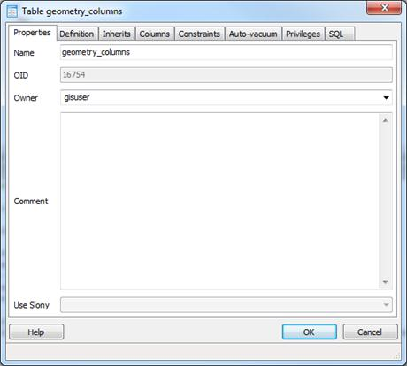

图 17:编辑几何列表属性

**所有者**字段提供了服务器中定义的用户的下拉列表。选择您在应用程序连接中使用的所有者。

### 重访元数据表

如果你还记得我们在本书前面的讨论，我们讨论了空间元数据表以及它们在事物大格局中的重要性。

如果您已经正确地创建了空间数据库，您应该会在服务器树中看到两个表:**几何 _ 列**和**空间 _ 系统 _ 参考**。右键单击它们并选择**查看数据**将允许您检查其中的内容，如下图所示。

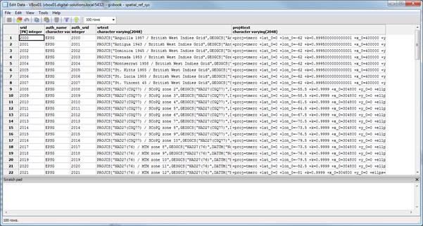

图 18:空间 _ 系统 _ 参考表

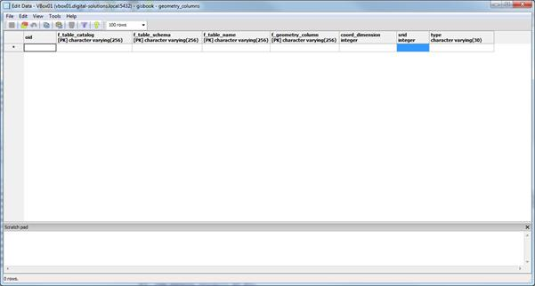

图 19:几何列表

如您所见，geometry_columns 表最初是空的。当我们将数据加载到数据库中时，这将开始填满。

## 使用 QGIS 的装载点

量子地理信息系统内置了一个很棒的小工具**SPIT**(shape file to PostGIS Import Tool)，它的唯一目的是将 ESRI 形状文件插入 Postgres。

在实践中，我发现如果您试图导入的 shapefile 中有哪怕一点点的损坏或非标准数据，它都会很容易被打乱。尽管它很脆弱，但它仍然是 QGIS 用户最常用的将数据导入其数据库的工具。

您可以通过单击 QGIS 工具栏上的蓝色小象图标来激活 SPIT，如下图所示:

图 20:激活 SPIT

一旦 SPIT 加载并显示其主界面，您应该会看到以下内容:

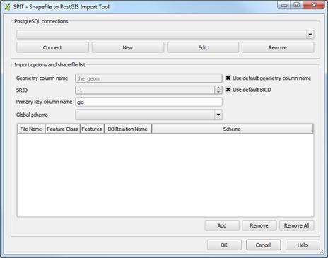

图 21: SPIT 界面

这个接口是相当不言自明的。您可以在 **PostgreSQL** **连接**区域找到与您列出的 SQL 数据库的任何连接。**导入选项**用于指定数据的 SRID 等内容，以及数据导入的其他选项。

您的 PostgreSQL 连接列表在此处和主应用程序之间共享。如果您已经在 QGIS 中创建了一个连接，您只需从下拉列表中选择它并单击**连接**，就可以在这里重用它。

然而，在本练习中，我们将创建一个新的连接来保存我们的数据。首先，点击**邮箱连接**下的**新建**。将出现**创建新的邮政地理信息系统连接**对话框。

图 22:创建新的邮政地理信息系统连接

完成如图 22 所示的字段，记住根据您自己 Postgres 安装的需要替换您的服务器名、数据库名、用户名和密码。

您不必保存密码和用户名，但是如果您不必每次都键入凭据，连接会更容易。

四个取消选择的选项不是必需的。它们用于控制以下内容:

*   **只看 geometry_columns 表**:这个选项的意思和它说的一模一样。默认情况下，QGIS 将查看数据库中的所有表，以查看其中是否包含空间几何。选中此复选框可防止这种情况。
*   **只查看公共模式**:如果使用不同的模式对数据库进行逻辑划分，选择该选项会使 QGIS 只查看**公共**模式(相当于 MS SQL 中的 **DBO** )。
*   **也列出没有几何图形的表**:选择该选项将在**添加图层**对话框中列出没有地理数据的 QGIS 表。
*   **使用预估表元数据**:如果你有一个表没有在 geometry_columns 表中注册，选择这个选项会让 QGIS 猜测数据类型，而不是检查表中的数据来确定几何类型。

完成这些字段后，点击**测试连接**按钮。测试应该会成功。

点击**确定**保存连接并在**吐槽**工具中注册。

返回 **SPIT** 对话框后，点击**连接**，然后使用**添加**按钮浏览并加载英国城镇的形状文件。

你可以从[bitbucket.org/syncfusion/gis-succinctly](https://bitbucket.org/syncfusion/gis-succinctly)下载样本形状文件。

一旦您设置了其他选项，如 **SRID** (为这些演示提供的所有文件都在英国-OSGB36，SRID 27700)和**几何列名**，您的 **SPIT** 对话框应该类似于下图:

图 23:完整的 SPIT 对话框

单击**确定**将您的数据添加到 Postgres 数据库中，并创建所需的任何表格和其他对象。如果您在添加数据后返回到 pgAdmin，查看**几何 _ 列**表，您会看到其中现在有两个条目。

一旦 SPIT 完成，您应该能够返回到主 QGIS 窗口并显示一个 Postgres 矢量图层。不过，我们会暂时等着做这件事；接下来我们将使用 GeoKettle 加载县界多边形。

## 使用地理釜加载边界多边形

有时，您需要对数据加载过程多一点控制。例如，在将数据导入数据库之前，您可能需要合并两个文件并对数据进行一些转换。

当您需要超越使用 SPIT 的简单加载时，您需要使用 ETL(提取、转换和加载)工具，如 GeoKettle。如前所述，GeoKettle 是一个专门的 ETL 包，它理解地理空间数据及其所有特殊的元数据。

与 Postgres 和 QGIS 一样，我不打算介绍安装过程。如果你下载了 Java 安装程序版本，那就相当简单了。因为它需要运行 Java，所以请确保您的计算机上安装了最新的 Java 虚拟机。

安装 GeoCapt 后，打开程序。您应该会看到类似以下截图的内容:

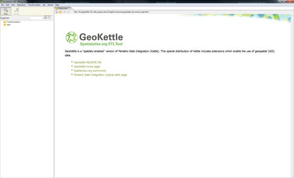

图 24:地理水壶主屏幕

使用 GeoKettle 背后的概念与您可能熟悉的普通点击方法略有不同，但是一旦您习惯了它们，使用 GeoKettle 就非常容易了。

### 转换和作业

如果点击**文件**菜单，选择**新建**，会看到有两个选项:**变换**和**作业**。这里的想法是，许多转换组成了一项工作，允许您将任务分解成更小的块，然后使用序列重新组装它们。

如果你曾经在。NET 中，您将熟悉独立工作单元的概念，并对这些部分进行排序以执行整个任务。使用 GeoKettle 也是同样的想法。对于我们要在这里实现的，我们只需要一个简单的变换，所以选择**新建**下的**变换**项。

图 25:地理水壶文件菜单

### 添加变换步骤

一旦你有了一个新的 GeoKettle 工作表面，你会注意到屏幕左侧的设计器调色板。

要构建变换，请将必要的步骤从该选项板拖动到您的工作表面，然后通过按住 **Shift** 并在它们之间拖动将它们连接在一起。

然后，数据在连接的方向上一步一步地流动，通过时执行所需的步骤。

为了将 shapefile 添加到数据库，我们需要三个转换步骤:

1.  形状文件输入。
2.  一套 SRID 变换。
3.  表格输出。

让我们从添加输入步骤开始。在设计面板中选择**输入**文件夹，然后将**形状文件输入**拖到工作面上，如下图所示:

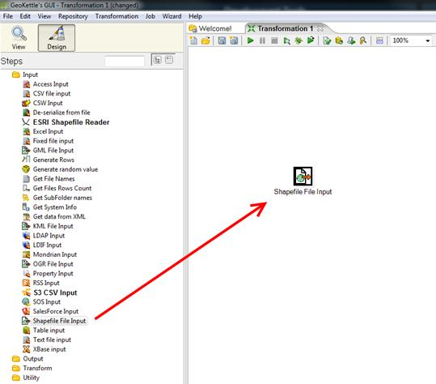

图 26:向转换添加一个形状文件输入步骤

打开设计器调板中的**输出**文件夹，将**表格输出**添加到变换中。

图 27:向转换中添加一个表输出步骤

在设计器面板中打开**变换**文件夹，添加**设置 SRS** 步骤。

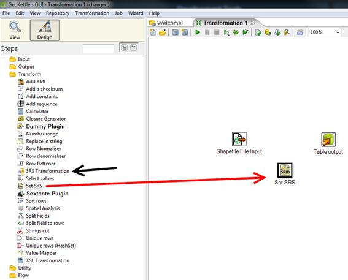

图 28:向转换中添加一个设置 SRS 步骤

注意图 28 中指向 **SRS 转换**的黑色箭头——注意不要使用这个，因为它是一个实际的数据转换。如果要将数据从一个空间系统转换到另一个空间系统，您可能会发现需要这样做；例如，如果您有一个从 GPS 设备记录的 GPS 路线，它可能在 WGS84 坐标空间中，但您可能需要将其更改为与您的全球区域相匹配的本地 UTM 系统。

**设置 SRS** 不变换实际坐标值；它只是设置你添加的数据的 SRID。你必须确保这个 SRID 是正确的价值；否则，当您尝试演示或投影数据时，您的几何图形将出现在与您预期完全不同的位置。

一旦您向工作区添加了必要的步骤，您就需要连接它们。为此，单击您要选择的一个步骤，按住**移动**，然后单击并拖动到您要连接的步骤。可能令人困惑的一件事是，当您将指针从一个步骤拖到下一个步骤时，GeoKettle 不会画线。只需继续将指针移动到下一个转换步骤，并在到达时释放鼠标按钮。

例如，将**形状文件输入**连接到**设置 SRS** ，然后将**设置 SRS** 连接到**表格输出**。如果一切按预期进行，您应该会看到如下内容:

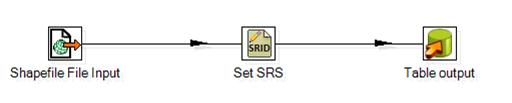

图 29:连接的转换步骤

### 配置步骤

一旦连接好了所有的东西，就应该准备好配置所有的东西了。我们将从配置 shapefile 输入开始。双击**形状文件输入**步骤，访问其属性。

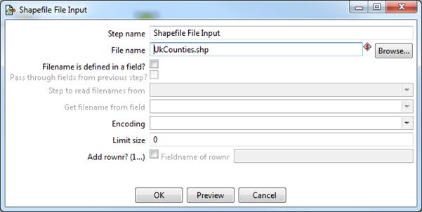

图 30:配置形状文件输入

我们唯一需要更改的是文件名。点击**浏览**按钮，浏览至您下载的英国县界样本形状文件的位置，点击**确定**。

在点击**确定**之前，您可以使用**预览**按钮快速浏览您的文件。点击**预览**后，系统会提示你要预览多少行。

图 31:预览形状文件输入

输入 **0** 将显示输入文件中的所有行。点击**确定**显示预览。GeoKettle 将打开文件，并向您显示数据和文件中任何属性的类似电子表格的视图。

图 32:形状文件数据预览-标准视图

您可以点击顶部的**地理视图**选项卡，查看以下内容:

图 33:形状文件数据预览—地理视图

数据预览完毕后，点击**关闭**。在**形状文件输入**对话框中点击**确定**完成形状文件输入设置。

接下来我们需要做的是设置我们的 SRS 选项。在我们的案例中，您可能在预览数据时已经注意到，我们的县界形状文件实际上位于 WGS84 (SRID 4326)坐标空间中。如前所述，我们不会实际转换该样本数据的坐标，但在生产系统中，强烈建议您在同一坐标空间中匹配所有数据。如果我是为一个生产系统这样做的，我会使用 SRS 转换步骤，实际上将坐标更改为 OSGB36 (SRID 27700)。对于这个例子，我尽可能保持简单。

如果您想尝试转换您的数据，请注意您需要两个**设置 SRS** 步骤，在 **SRS 转换**步骤的每一侧各一个，以确保您有正确的空间标识进入和退出转换。

继续我们的例子，让我们为这个数据设置我们需要的奇异 SRID。双击**设置 SRS** 步骤打开其对话框；您应该会看到以下内容:

图 34:配置设置安全气囊系统步骤

在**字段**下拉列表中，选择正确的字段来设置几何图形。通常它在形状文件中被称为**。在 **EPSG 代码**字段中，为数据选择正确的空间标识。在我们的例子中，它将是 SRID 4326 (WGS84)。您可以通过下拉列表了解有多少 SRID 坐标空间。不需要浏览整个下拉列表，只需输入 **4326** 。**

设置好 SRID 后，点击**确定**确认安全气囊系统设置。

最后一步是设置我们的**表输出**和关联的数据库连接。双击**表格输出**步骤，打开其配置对话框，如下图所示。请注意，我已经填写了连接和目标表的详细信息。

图 35:表输出配置

您要做的第一件事是创建一个新的数据库连接。单击**连接**字段旁边的**新建**按钮。将出现**数据库连接**对话框。

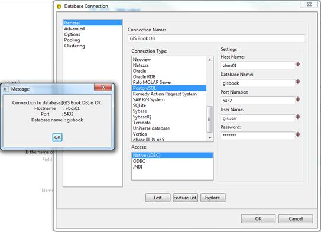

图 36:添加新的数据库连接

同样对于图 36，我已经填写了我的详细信息，但是您应该能够很容易地看到 GeoKettle 支持各种各样的数据库类型。

在**连接类型**下，选择**邮政编码**。在**访问**下，选择**原生 JDBC** 并填写适当的详细信息，以连接到使用 QGIS 添加点数据时连接到的同一数据库。

完成后，为连接命名并点击**测试**按钮。应该会显示一个小对话框，说明与数据库的连接正常，如上图所示。点击**确定**关闭对话框，在**数据库连接**窗口点击**确定**返回**表格输出**选项。

接下来，您必须设置一个目标表名，以便转换步骤知道在哪里插入数据。您也可以选择**截断表格**复选框，以确保表格在开始之前没有数据。其他表输出设置通常可以保持原样。

如果您是第一次创建数据，您需要单击窗口底部的 **SQL** 按钮，以自动生成并运行在数据库中创建初始表所需的 SQL。如果您正在使用一个现有的表，这将为您提供确保表模式与数据匹配所需的 SQL。这相当简单，如果您对 SQL 有所了解，您会立即看到发生了什么。

我经常在 SQL 对话框中做的一件事是添加一个主键，因为 GeoKettle 不会自动添加一个主键。添加主键等都有转换步骤，但我发现在创建表时，通过手动输入额外的行，在 SQL 编辑器中添加额外的字段更容易。在下图中，您可以看到我在 Postgres 中添加了一个带有 GID 定义的主键。

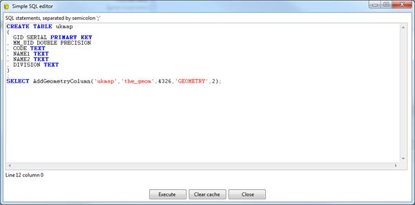

图 37:添加主键

编辑完 SQL 后，点击**执行**运行。一旦您成功运行了您的 SQL，您可以单击**关闭**退出 SQL 编辑器，然后单击**确定**返回到转换工作区。您已经完成了所需步骤的设置。

到达此点后，转到**文件** > **保存**保存你的加载脚本。除非保存您的文件，否则 GeoKettle 将拒绝运行转换。保存脚本并准备运行转换后，单击工具栏中的绿色播放箭头。

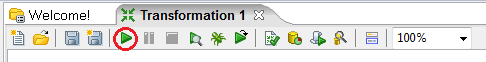

图 38:运行转换的按钮

将出现**执行变换**窗口。

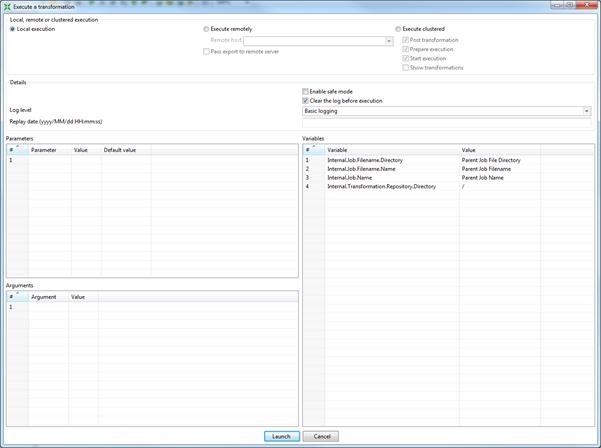

图 39:执行转换窗口

99%的时候你不需要在这个窗口里改变任何东西。点击**启动**按钮，工作区下方窗格将显示转换进度。

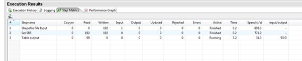

图 40:查看转换结果

当您所有的**活动**列条目切换到**完成**时，您应该有一个加载了县多边形的数据库；你现在准备开始实验了。

如果任何一个台阶变红并显示**停止**，说明你有问题。问题的详细信息和堆栈跟踪将显示在**日志**和**执行历史**选项卡中。不幸的是，尽管我很想能够列出你将在这里看到的每一个可能的问题，但我就是不能。当 GeoKettle 失败时，它只释放一个堆栈跟踪，拒绝做任何进一步的事情。对于普通开发人员来说，这可能不是问题，但是对于非技术用户来说，这看起来确实非常可怕。

我对转换问题的经验是，它们通常是某种数据格式问题；例如，目标服务器的转换步骤中的一个不正确的设置吐出了它的默认数据，因为它不喜欢 SQL GeoKettle 刚刚发送给它的东西。

每当我收到一个停止条件，我就将**日志**窗格的输出复制并粘贴到一个文本编辑器中，这样我就可以开始检查 SQL 语句，并在一个易于阅读的窗口中诊断堆栈跟踪。

一旦所有的转换步骤成功完成，您就可以关闭 GeoKettle 并返回到 Quantum GIS。使用您在使用 SPIT 加载数据时创建的连接，您可以查看数据库中的数据。

## 预览数据

如果我们打开 Quantum GIS，开始一个新项目，首先需要做的就是设置项目属性。我们通过导航到工具栏中的**设置** > **项目属性**来实现。

图 41:在量子地理信息系统中打开项目属性

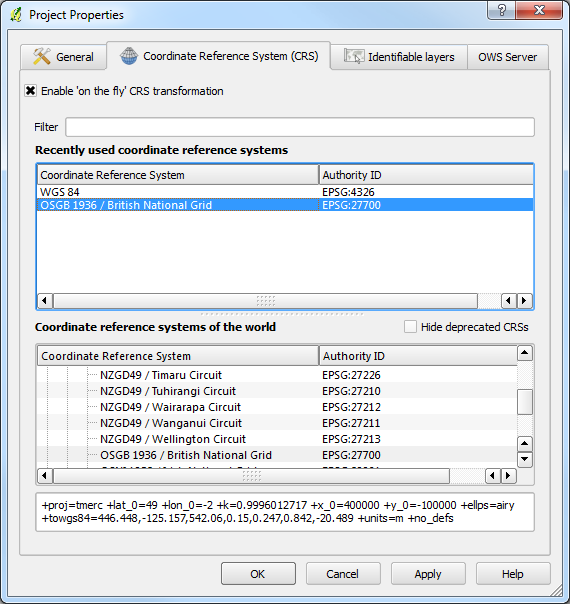

图 42:量子地理信息系统项目属性

在**项目属性**中，选择**启用“动态”CRS 变换**复选框，因为我们的数据库中有 SRID 27700 和 SRID 4326 坐标系。如图 42 所示，由于我居住在英国，所以我选择了 OSGB36 (SRID 27700)作为我的项目。如果你愿意，你可以选择 WGS84 作为你的项目。如前所述，选择特定于您所在位置的坐标系是一种很好的做法。

选择坐标系后，单击**确定**返回主量子地理信息系统工作区。

现在我们需要开始从数据库中添加矢量图层。单击工具栏上的蓝色**添加数据库层**图标。您将看到**添加图层**对话框，并应立即识别对话框顶部的**连接**下拉列表；它看起来就像你在 SPIT 中使用的那个。

图 43:添加数据库层图标

图 44:添加数据库层

从下拉列表中选择您想要使用的连接，或者像在 SPIT 中一样创建一个新的连接，然后单击**连接**。Postgres 数据库中的矢量图层列表应该如下图所示:

图 45:可用的矢量图层

如您所见，我们之前导入的两个点图层和我们使用 GeoKettle 导入的多边形图层都是可用的。全部选中，点击**添加**。

经过一点处理后，根据您的计算机和数据库速度，QGIS 应该显示图层，希望有三种不同的样式。

图 46:三层加载地图

如图 46 中的例子所示，县的边界是绿色的，城镇是深蓝色的，城市是粉色的。

如果你的显示器看起来像我的一样，那么恭喜你，你刚刚创建了你的第一个空间数据库。现在我们可以利用这些数据。